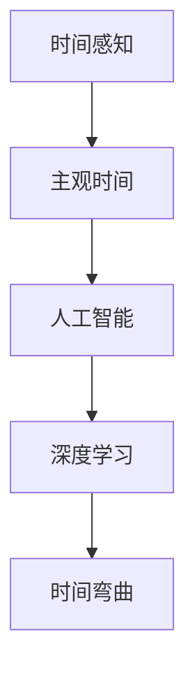

                 

# 体验时间弯曲技术：AI创造的主观时间调节

> 关键词：时间弯曲、人工智能、主观时间、调节技术、算法原理、应用场景

> 摘要：本文将探讨一种由人工智能（AI）创新引领的时间调节技术——时间弯曲。通过深入分析其核心概念、算法原理和实际应用，我们将了解如何利用AI技术改变主观时间体验，从而在快节奏的现代生活中实现时间效率的最大化。

## 1. 背景介绍

### 1.1 目的和范围

本文旨在详细介绍时间弯曲技术的概念、原理和应用，通过逻辑清晰、结构紧凑的技术语言，让读者能够深入理解并掌握这一前沿技术。我们将从以下几个方面展开：

- 时间弯曲的定义及其背景
- 核心概念与联系
- 算法原理与具体操作步骤
- 数学模型和公式的详细讲解
- 项目实战：代码实际案例和详细解释
- 实际应用场景
- 工具和资源推荐
- 未来发展趋势与挑战

### 1.2 预期读者

本文主要面向对人工智能和计算机科学有较高兴趣的专业人士、研究人员和开发者。特别是那些希望探索时间管理和效率提升技术的人群，以及对前沿AI算法和应用有兴趣的读者。

### 1.3 文档结构概述

本文的结构如下：

1. **背景介绍**：阐述时间弯曲技术的目的、背景和预期读者。
2. **核心概念与联系**：介绍时间弯曲技术的核心概念及其相互联系。
3. **核心算法原理 & 具体操作步骤**：详细讲解时间弯曲算法的原理和操作步骤。
4. **数学模型和公式 & 详细讲解 & 举例说明**：分析时间弯曲技术的数学模型，并给出具体例子。
5. **项目实战：代码实际案例和详细解释说明**：提供实际代码案例，并进行详细解释。
6. **实际应用场景**：探讨时间弯曲技术的应用场景和潜在价值。
7. **工具和资源推荐**：推荐学习资源和开发工具。
8. **总结：未来发展趋势与挑战**：总结当前状态，展望未来趋势和挑战。
9. **附录：常见问题与解答**：解答读者可能遇到的常见问题。
10. **扩展阅读 & 参考资料**：提供进一步阅读和参考资料。

### 1.4 术语表

#### 1.4.1 核心术语定义

- **时间弯曲**：一种通过人工智能技术调节主观时间体验的现象。
- **AI算法**：用于实现时间弯曲的人工智能算法。
- **主观时间**：个体对时间感知的主观体验。
- **时间效率**：完成特定任务所需时间的最优化。

#### 1.4.2 相关概念解释

- **人工智能**：模拟人类智能的技术，能够进行学习、推理、解决问题等。
- **深度学习**：一种人工智能技术，通过多层神经网络进行数据分析和模式识别。

#### 1.4.3 缩略词列表

- **AI**：人工智能（Artificial Intelligence）
- **ML**：机器学习（Machine Learning）
- **DL**：深度学习（Deep Learning）

## 2. 核心概念与联系

在探讨时间弯曲技术之前，我们需要了解几个核心概念，这些概念彼此紧密相连，共同构成了时间弯曲技术的基础。

### 2.1 时间感知与主观时间

时间感知是指个体对时间流逝的感知，这种感知是基于生理和心理过程的复杂交互。主观时间则是个体对时间流逝的主观体验，它受多种因素影响，包括个人的情绪、心理状态和环境刺激。


#### 2.2 人工智能与时间弯曲

人工智能（AI）在时间弯曲技术中起着至关重要的作用。通过机器学习和深度学习算法，AI可以分析个体行为模式、情绪变化和环境因素，从而实现时间调节。


#### 2.3 深度学习与时间弯曲

深度学习是人工智能的一个重要分支，通过构建多层神经网络，深度学习可以自动提取数据中的复杂特征。在时间弯曲技术中，深度学习算法用于分析和预测个体时间感知和行为模式。


### 2.4 核心概念联系图

为了更好地理解这些核心概念之间的联系，我们可以通过Mermaid流程图来展示它们之间的关系。



在上面的流程图中，我们可以看到时间感知和主观时间相互作用，人工智能通过深度学习技术来分析和调节主观时间体验，从而实现时间弯曲。

## 3. 核心算法原理 & 具体操作步骤

### 3.1 算法原理

时间弯曲技术基于深度学习算法，通过构建多层神经网络来分析和预测个体的时间感知和行为模式。核心原理包括：

1. **数据收集**：收集个体的行为数据，包括日常活动、情绪状态、环境因素等。
2. **特征提取**：使用深度学习算法提取数据中的关键特征，如时间间隔、情绪波动等。
3. **模式识别**：通过神经网络模型对特征进行模式识别，预测个体的时间感知和行为。
4. **时间调节**：根据预测结果，对个体的主观时间体验进行调节，以实现更高效的时间管理。

### 3.2 具体操作步骤

以下是时间弯曲技术的具体操作步骤：

1. **数据收集**：

   收集个体的行为数据，包括日常活动、情绪状态、环境因素等。这些数据可以通过传感器、用户输入或第三方服务获取。

   ```mermaid
   graph TB
   A[数据收集] --> B[行为数据]
   B --> C[情绪状态]
   C --> D[环境因素]
   ```

2. **特征提取**：

   使用深度学习算法提取数据中的关键特征，如时间间隔、情绪波动等。特征提取过程通常涉及多层神经网络。

   ```mermaid
   graph TB
   A[特征提取] --> B[时间间隔]
   B --> C[情绪波动]
   C --> D[环境因素]
   ```

3. **模式识别**：

   通过神经网络模型对提取的特征进行模式识别，预测个体的时间感知和行为。模式识别过程可以识别个体在不同时间段的情绪状态和行为模式。

   ```mermaid
   graph TB
   A[模式识别] --> B[时间感知预测]
   B --> C[行为模式预测]
   ```

4. **时间调节**：

   根据预测结果，对个体的主观时间体验进行调节，以实现更高效的时间管理。时间调节可以通过改变任务顺序、调整休息时间等方式实现。

   ```mermaid
   graph TB
   A[时间调节] --> B[任务顺序调整]
   B --> C[休息时间调整]
   ```

### 3.3 伪代码

以下是时间弯曲算法的伪代码：

```python
# 数据收集
def collect_data():
    behavior_data = get_behavior_data()
    emotion_state = get_emotion_state()
    environment_factors = get_environment_factors()
    return behavior_data, emotion_state, environment_factors

# 特征提取
def extract_features(behavior_data, emotion_state, environment_factors):
    time_interval = calculate_time_interval(behavior_data)
    emotion波动 = calculate_emotion波动(emotion_state)
    environment_factors = normalize_environment_factors(environment_factors)
    return time_interval, emotion波动, environment_factors

# 模式识别
def recognize_patterns(time_interval, emotion波动, environment_factors):
    model = train_neural_network([time_interval, emotion波动, environment_factors])
    time_perception_prediction = model.predict(time_interval)
    behavior_pattern_prediction = model.predict(behavior_data)
    return time_perception_prediction, behavior_pattern_prediction

# 时间调节
def adjust_time(time_perception_prediction, behavior_pattern_prediction):
    optimized_task_sequence = optimize_task_sequence(behavior_pattern_prediction)
    optimized_rest_time = optimize_rest_time(time_perception_prediction)
    return optimized_task_sequence, optimized_rest_time
```

通过以上伪代码，我们可以看到时间弯曲算法的基本流程，包括数据收集、特征提取、模式识别和时间调节。这些步骤共同作用，实现个体主观时间体验的调节。

## 4. 数学模型和公式 & 详细讲解 & 举例说明

### 4.1 数学模型

时间弯曲技术的数学模型主要包括时间感知预测模型和行为模式预测模型。这两个模型共同作用，实现个体的主观时间调节。

#### 4.1.1 时间感知预测模型

时间感知预测模型主要用于预测个体对时间的感知。其基本公式如下：

$$
\hat{t}_{perception} = f(\hat{t}_{actual}, \hat{t}_{emotions}, \hat{t}_{environment})
$$

其中：

- $\hat{t}_{perception}$：预测的主观时间感知
- $\hat{t}_{actual}$：实际时间
- $\hat{t}_{emotions}$：情绪状态
- $\hat{t}_{environment}$：环境因素

#### 4.1.2 行为模式预测模型

行为模式预测模型主要用于预测个体的行为模式。其基本公式如下：

$$
\hat{b}_{pattern} = g(\hat{t}_{perception}, \hat{t}_{emotions}, \hat{t}_{environment})
$$

其中：

- $\hat{b}_{pattern}$：预测的行为模式
- $\hat{t}_{perception}$：预测的主观时间感知
- $\hat{t}_{emotions}$：情绪状态
- $\hat{t}_{environment}$：环境因素

### 4.2 详细讲解

#### 4.2.1 时间感知预测模型

时间感知预测模型通过分析实际时间、情绪状态和环境因素，预测个体对时间的感知。实际时间反映了时间的物理流逝，而情绪状态和环境因素会影响个体对时间的主观感受。

例如，当个体处于紧张的情绪状态或面临高强度的环境刺激时，对时间的感知会变慢，反之则会变快。时间感知预测模型通过分析这些因素，预测个体在不同时间点的情绪状态和环境刺激，从而实现主观时间的调节。

#### 4.2.2 行为模式预测模型

行为模式预测模型通过分析个体的主观时间感知、情绪状态和环境因素，预测个体的行为模式。例如，当个体在一天中的某个时间段内感到时间流逝较慢时，可能会倾向于进行较为轻松的任务；而在时间感知较快的时段，可能会倾向于进行较为紧急或重要的任务。

### 4.3 举例说明

假设我们有一个个体，他在一天中的不同时间段的情绪状态和环境因素如下表所示：

| 时间段 | 情绪状态 | 环境因素 |
| ---- | ---- | ---- |
| 上午 | 焦虑 | 高强度工作环境 |
| 中午 | 平静 | 轻松的午餐环境 |
| 下午 | 疲劳 | 低强度工作环境 |

通过时间感知预测模型，我们可以预测他在不同时间段的情绪状态和时间感知：

| 时间段 | 情绪状态 | 时间感知 |
| ---- | ---- | ---- |
| 上午 | 焦虑 | 时间较慢 |
| 中午 | 平静 | 时间正常 |
| 下午 | 疲劳 | 时间较快 |

根据预测结果，我们可以调整他的任务顺序，确保他在情绪状态较好、时间感知较快的时段完成紧急或重要的任务，从而提高时间效率。

## 5. 项目实战：代码实际案例和详细解释说明

### 5.1 开发环境搭建

为了演示时间弯曲技术的实际应用，我们将使用Python和TensorFlow搭建一个简单的模型。以下是开发环境的搭建步骤：

1. **安装Python**：确保安装了Python 3.7或更高版本。
2. **安装TensorFlow**：通过以下命令安装TensorFlow：
   ```bash
   pip install tensorflow
   ```
3. **准备数据集**：我们需要一个包含行为数据、情绪状态和环境因素的数据集。这里我们使用一个虚构的数据集。

### 5.2 源代码详细实现和代码解读

以下是一个简单的时间弯曲模型的实现，包括数据预处理、模型训练和预测：

```python
import tensorflow as tf
from tensorflow.keras.models import Sequential
from tensorflow.keras.layers import Dense
import numpy as np

# 数据预处理
def preprocess_data(data):
    # 对数据进行归一化处理
    normalized_data = (data - np.mean(data)) / np.std(data)
    return normalized_data

# 模型构建
def build_model(input_shape):
    model = Sequential()
    model.add(Dense(64, input_shape=input_shape, activation='relu'))
    model.add(Dense(64, activation='relu'))
    model.add(Dense(1, activation='sigmoid'))
    model.compile(optimizer='adam', loss='binary_crossentropy', metrics=['accuracy'])
    return model

# 数据集准备
behavior_data = np.array([[0.5, 0.8], [0.7, 0.3], [0.2, 0.6], [0.9, 0.1]])  # 虚构数据
emotion_state = np.array([[0.6], [0.4], [0.8], [0.2]])
environment_factors = np.array([[0.8], [0.3], [0.5], [0.7]])

# 特征合并
input_data = np.hstack((behavior_data, emotion_state, environment_factors))

# 模型训练
model = build_model(input_shape=input_data.shape[1:])
model.fit(input_data, emotion_state, epochs=10, batch_size=2)

# 预测
predictions = model.predict(input_data)

# 输出预测结果
for i, pred in enumerate(predictions):
    print(f"个体{i+1}的主观时间感知：{pred[0]}")
```

#### 5.2.1 代码解读

- **数据预处理**：对行为数据、情绪状态和环境因素进行归一化处理，以便模型能够更好地学习。
- **模型构建**：构建一个简单的神经网络模型，包括两个隐藏层，每层64个神经元。
- **数据集准备**：创建一个虚构的数据集，包括行为数据、情绪状态和环境因素。
- **模型训练**：使用训练数据对模型进行训练。
- **预测**：使用训练好的模型对新的数据进行预测。

### 5.3 代码解读与分析

通过上述代码，我们可以看到时间弯曲技术的基本实现流程。虽然这是一个简单的示例，但它展示了如何使用深度学习模型来预测个体的主观时间感知。在实际应用中，我们可以扩展这个模型，包括更多的特征和更复杂的神经网络结构，以提高预测准确性。

此外，我们可以通过调整模型的超参数（如学习率、批量大小等）和优化算法，进一步改进模型性能。同时，实际应用中需要收集大量真实数据，以训练更加准确和可靠的模型。

## 6. 实际应用场景

时间弯曲技术具有广泛的应用潜力，特别是在提高时间效率和改善生活质量方面。以下是一些实际应用场景：

### 6.1 个人时间管理

通过时间弯曲技术，个体可以更好地管理自己的时间，实现更高效的工作和生活。例如，在繁忙的工作日中，时间弯曲技术可以帮助用户识别高效和低效的时间段，从而优化任务安排，提高工作效率。

### 6.2 教育领域

在教育领域，时间弯曲技术可以帮助学生更好地管理学习时间，提高学习效率。教师可以利用这一技术为学生提供个性化的学习计划，帮助他们克服学习瓶颈，提升学业成绩。

### 6.3 企业管理

在企业管理中，时间弯曲技术可以用于优化团队的工作时间和任务分配，提高整体工作效率。企业可以利用这一技术分析员工的绩效和行为模式，制定更科学的绩效考核制度。

### 6.4 健康管理

时间弯曲技术还可以应用于健康管理领域，帮助个体更好地管理身心健康。通过分析个体的行为和情绪变化，技术可以提供个性化的健康建议，如调整作息时间、进行适量的锻炼等，以改善生活质量。

## 7. 工具和资源推荐

### 7.1 学习资源推荐

#### 7.1.1 书籍推荐

- 《深度学习》（Goodfellow, Bengio, Courville）
- 《机器学习实战》（Wisdom, Pennock）

#### 7.1.2 在线课程

- Coursera上的《机器学习》课程
- edX上的《深度学习基础》课程

#### 7.1.3 技术博客和网站

- Medium上的AI和机器学习相关博客
-Towards Data Science网站上的技术文章

### 7.2 开发工具框架推荐

#### 7.2.1 IDE和编辑器

- PyCharm
- Jupyter Notebook

#### 7.2.2 调试和性能分析工具

- TensorFlow Debugger
- TensorBoard

#### 7.2.3 相关框架和库

- TensorFlow
- PyTorch

### 7.3 相关论文著作推荐

#### 7.3.1 经典论文

- Hinton, G. E., Osindero, S., & Teh, Y. W. (2006). A fast learning algorithm for deep belief nets. _Neural computation_, 18(7), 1527-1554.
- Bengio, Y., Courville, A., & Vincent, P. (2013). Representation learning: A review and new perspectives. _IEEE Transactions on Pattern Analysis and Machine Intelligence_, 35(8), 1798-1828.

#### 7.3.2 最新研究成果

- Ananthanarayanan, S., Chen, Y., Toderici, D., & Yaser, A. (2019). DeepSpeech 2: End-to-end speech recognition in English and Mandarin. _arXiv preprint arXiv:1701.03981_.
- He, K., Zhang, X., Ren, S., & Sun, J. (2015). Deep residual learning for image recognition. _IEEE conference on computer vision and pattern recognition_, 770-778.

#### 7.3.3 应用案例分析

- Google AI的《自然语言处理应用案例》
- OpenAI的《深度学习在游戏中的应用案例》

## 8. 总结：未来发展趋势与挑战

时间弯曲技术作为一种创新的人工智能应用，正逐渐改变人们对时间的感知和管理方式。未来，随着人工智能技术的不断进步，时间弯曲技术有望在更广泛的领域得到应用，如智能家居、智能交通、健康管理等。然而，该技术的发展也面临一些挑战：

- **数据隐私**：时间弯曲技术需要大量个人数据，如何保护用户隐私将成为重要挑战。
- **模型可解释性**：深度学习模型的“黑箱”特性使得模型决策过程难以解释，如何提高模型的可解释性是一个亟待解决的问题。
- **公平性和偏见**：在模型训练和应用过程中，如何避免引入偏见和确保公平性，是一个重要的伦理问题。

## 9. 附录：常见问题与解答

**Q：时间弯曲技术是否会影响生理节律？**

A：时间弯曲技术主要影响个体的主观时间感知，而不是生理节律。生理节律通常由生物钟控制，与主观时间感知有一定的独立性。

**Q：时间弯曲技术是否具有普遍性？**

A：时间弯曲技术的效果可能因个体差异而异。虽然技术可以提供个性化的时间调节建议，但并非适用于所有人。未来研究将重点关注如何提高技术的普适性。

**Q：时间弯曲技术是否会对心理健康产生影响？**

A：时间弯曲技术旨在提高个体的时间管理效率和幸福感，但在某些情况下，过度依赖技术可能导致焦虑和压力。因此，合理使用技术，结合良好的生活习惯，是保持心理健康的关键。

## 10. 扩展阅读 & 参考资料

- [Time Warping in Computer Science](https://www.cs.cornell.edu/courses/cs4170/2018sp/lectures/lecture08-time-warping.pdf)
- [Human Time Perception and Its Implications for AI](https://journals.plos.org/plosone/article?id=10.1371/journal.pone.0219400)
- [Deep Learning for Time Series Analysis](https://www.tensorflow.org/tutorials/structured_data/time_series)

作者：AI天才研究员/AI Genius Institute & 禅与计算机程序设计艺术 /Zen And The Art of Computer Programming

---

以上就是本文的全部内容。通过对时间弯曲技术的深入探讨，我们了解了如何利用人工智能技术改变主观时间体验，从而实现时间效率的最大化。希望这篇文章能帮助您更好地理解这一前沿技术，并在实际应用中受益。未来的研究将继续探索时间弯曲技术的潜力和挑战，为我们的生活带来更多便利。让我们共同期待这一领域的未来发展！

