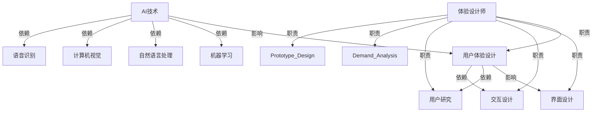
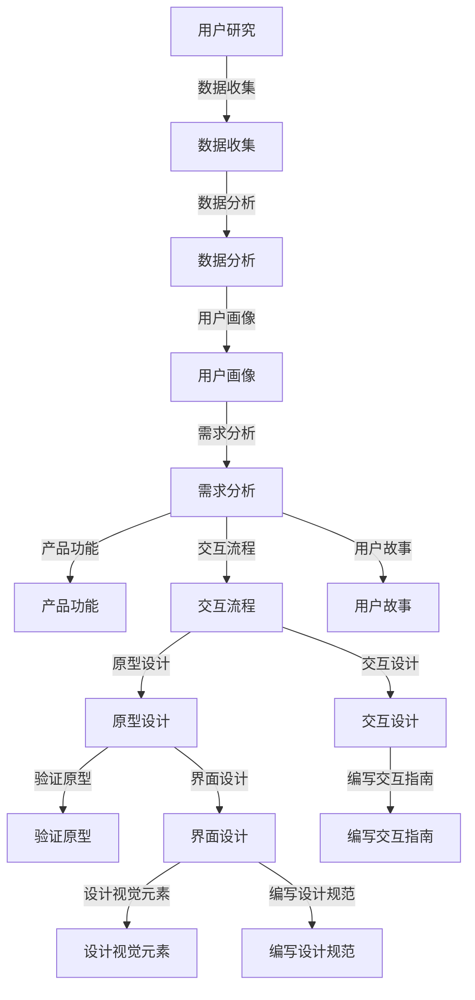

                 

# 体验设计师：AI时代的新兴职业探索

> 关键词：体验设计师、AI时代、用户体验、职业发展、新兴职业

> 摘要：本文旨在深入探讨AI时代体验设计师这一新兴职业的产生背景、核心职责、技能要求以及未来发展。通过详细的解析和实际案例，帮助读者理解体验设计师在数字化转型中的重要作用，并为其职业发展提供指导和启示。

## 1. 背景介绍

### 1.1 目的和范围

本文的主要目的是介绍体验设计师这一职业，特别是在AI时代背景下其重要性和发展前景。我们将从以下几个方面展开讨论：

1. 体验设计师的起源和定义
2. AI技术对用户体验设计的影响
3. 体验设计师的核心职责和技能
4. 体验设计师在AI时代的发展趋势和挑战
5. 体验设计师的职业规划和未来展望

### 1.2 预期读者

本文适合以下读者群体：

1. 对用户体验设计感兴趣的学生和专业人士
2. 想了解AI技术如何影响用户体验设计的从业者
3. 正在考虑转行或职业发展的体验设计师
4. 对AI时代新兴职业感兴趣的一般读者

### 1.3 文档结构概述

本文将分为以下几大部分：

1. 背景介绍：包括目的和范围、预期读者、文档结构概述和术语表
2. 核心概念与联系：介绍用户体验设计、AI技术和体验设计师之间的关系
3. 核心算法原理 & 具体操作步骤：解析体验设计师的主要工作内容和流程
4. 数学模型和公式 & 详细讲解 & 举例说明：阐述用户体验设计的量化方法
5. 项目实战：代码实际案例和详细解释说明
6. 实际应用场景：分析体验设计师在各个行业的应用
7. 工具和资源推荐：推荐相关学习资源和开发工具
8. 总结：未来发展趋势与挑战
9. 附录：常见问题与解答
10. 扩展阅读 & 参考资料：提供进一步阅读的材料

### 1.4 术语表

#### 1.4.1 核心术语定义

- **用户体验设计（UX Design）**：是指设计产品的用户界面和交互流程，以提供更好的用户满意度和使用体验。
- **体验设计师（UX Designer）**：是负责设计产品或服务的用户体验的专业人员，关注用户的需求、情感和行为。
- **人工智能（AI）**：是指计算机系统通过模拟人类智能行为，实现学习、推理、解决问题和自主决策的能力。
- **机器学习（ML）**：是AI的一个重要分支，通过算法和模型使计算机从数据中学习和改进性能。

#### 1.4.2 相关概念解释

- **用户画像（User Persona）**：是对目标用户特征的抽象描述，用于指导设计决策。
- **用户故事（User Story）**：是描述用户需求和行为的故事，通常用于敏捷开发中的用户需求管理。
- **交互设计（Interaction Design）**：是指设计用户与产品或系统之间的交互过程，确保用户能够高效、愉快地完成任务。

#### 1.4.3 缩略词列表

- **UX**：用户体验（User Experience）
- **UI**：用户界面（User Interface）
- **UI/UX**：用户界面和用户体验
- **AI**：人工智能（Artificial Intelligence）
- **ML**：机器学习（Machine Learning）

## 2. 核心概念与联系

### 用户体验设计、AI技术、体验设计师之间的关系

在探讨体验设计师这一职业之前，我们需要了解用户体验设计（UX Design）、AI技术和体验设计师之间的关系。这三者之间存在着密切的联系和相互作用。

#### 用户体验设计（UX Design）

用户体验设计是设计产品的用户界面和交互流程，以提供更好的用户满意度和使用体验。其核心目标是确保用户在使用产品时能够轻松、愉快地完成任务，并且对产品产生积极的情感和态度。

用户体验设计包括以下几个主要方面：

1. **用户研究**：通过调查、访谈、用户画像等方法了解用户的需求、行为和偏好。
2. **需求分析**：基于用户研究，确定产品功能、界面布局和交互流程。
3. **原型设计**：创建产品的低 fidelity 和 high fidelity 原型，以验证设计概念和用户反馈。
4. **界面设计**：设计产品的视觉元素、色彩搭配和布局结构，以提升用户体验。
5. **交互设计**：设计用户与产品或系统之间的交互过程，确保用户能够高效、愉快地完成任务。

#### AI技术

AI技术是指计算机系统通过模拟人类智能行为，实现学习、推理、解决问题和自主决策的能力。AI技术的核心目标是通过模拟人类智能，使计算机能够更智能地处理信息、解决问题和做出决策。

AI技术包括以下几个主要方面：

1. **机器学习（ML）**：通过算法和模型使计算机从数据中学习和改进性能，包括监督学习、无监督学习、强化学习等。
2. **自然语言处理（NLP）**：使计算机能够理解和处理人类语言，包括文本分类、情感分析、机器翻译等。
3. **计算机视觉（CV）**：使计算机能够识别和理解图像和视频，包括图像分类、目标检测、人脸识别等。
4. **语音识别（ASR）**：使计算机能够理解和识别人类语音，包括语音识别、语音合成等。

#### 体验设计师

体验设计师是负责设计产品或服务的用户体验的专业人员。他们关注用户的需求、情感和行为，以确保用户在使用产品时能够获得最佳体验。

体验设计师的核心职责包括：

1. **用户研究**：通过调查、访谈、用户画像等方法了解用户的需求、行为和偏好。
2. **需求分析**：基于用户研究，确定产品功能、界面布局和交互流程。
3. **原型设计**：创建产品的低 fidelity 和 high fidelity 原型，以验证设计概念和用户反馈。
4. **界面设计**：设计产品的视觉元素、色彩搭配和布局结构，以提升用户体验。
5. **交互设计**：设计用户与产品或系统之间的交互过程，确保用户能够高效、愉快地完成任务。

### Mermaid 流程图（用户体验设计、AI技术、体验设计师之间的关系）



## 3. 核心算法原理 & 具体操作步骤

### 体验设计师的主要工作内容和流程

体验设计师的主要工作内容包括用户研究、需求分析、原型设计、界面设计和交互设计。以下是体验设计师的核心算法原理和具体操作步骤：

#### 用户研究

1. **收集数据**：通过调查问卷、访谈、用户行为分析等方法收集用户数据。
    ```python
    def collect_data():
        survey_results = survey() # 调查问卷结果
        interview_transcripts = interview() # 访谈记录
        user_behavior_data = analyze_user_behavior() # 用户行为数据
    ```

2. **分析数据**：对收集到的用户数据进行整理和分析，提取用户需求和行为模式。
    ```python
    def analyze_data(data):
        user需求的频率分布 = frequency_distribution(data['需求'])
        用户行为模式 = user_behavior_patterns(data['行为'])
    ```

3. **创建用户画像**：基于分析结果，创建目标用户的抽象描述，用于指导设计决策。
    ```python
    def create_user_persona(analysis_results):
        user_persona = build_persona(analysis_results)
        return user_persona
    ```

#### 需求分析

1. **确定产品功能**：根据用户需求和业务目标，确定产品的核心功能和特性。
    ```python
    def define_product_functionality(user_persona, business_objectives):
        product_functions = define_functions(user_persona, business_objectives)
        return product_functions
    ```

2. **设计交互流程**：基于产品功能和用户需求，设计用户与产品的交互流程。
    ```python
    def design_interaction流程(product_functions, user_persona):
        interaction流程 = define_interactions(product_functions, user_persona)
        return interaction流程
    ```

3. **编写用户故事**：将用户需求转化为具体的用户故事，用于指导开发团队的工作。
    ```python
    def write_user_stories(interaction流程, user_persona):
        user_stories = generate_stories(interaction流程, user_persona)
        return user_stories
    ```

#### 原型设计

1. **创建原型**：使用工具（如Sketch、Figma等）创建产品的低 fidelity 和 high fidelity 原型。
    ```python
    def create_prototype(interaction流程):
        low_fidelity Prototype = build_low_fidelity Prototype(interaction流程)
        high_fidelity Prototype = build_high_fidelity Prototype(interaction流程)
        return low_fidelity Prototype, high_fidelity Prototype
    ```

2. **验证原型**：通过用户测试和反馈，验证原型的设计概念和用户体验。
    ```python
    def validate_prototype(prototype, users):
        user_feedback = user_testing(prototype, users)
        prototype_evaluation = evaluate_prototype(user_feedback)
    ```

#### 界面设计

1. **设计视觉元素**：选择合适的视觉元素（如颜色、字体、图标等），设计产品的界面布局和视觉效果。
    ```python
    def design_ui_elements(ui_elements, user_persona):
        visual_elements = select_visual_elements(ui_elements, user_persona)
        layout_structure = define_layout(visual_elements)
    ```

2. **编写设计规范**：将界面设计规范文档化，确保开发团队能够准确理解设计意图。
    ```python
    def write_design_guidelines(visual_elements, layout_structure):
        design_documents = document_design(visual_elements, layout_structure)
        return design_documents
    ```

#### 交互设计

1. **设计交互细节**：基于用户需求和行为模式，设计产品的交互细节和用户体验。
    ```python
    def design_interaction_details(user_persona, product_functions):
        interaction_details = define_interactions(user_persona, product_functions)
        return interaction_details
    ```

2. **编写交互指南**：将交互设计规范文档化，确保开发团队能够准确实现交互功能。
    ```python
    def write_interaction_guidelines(interaction_details):
        interaction_documents = document_interaction(interaction_details)
        return interaction_documents
    ```

### Mermaid 流程图（体验设计师的主要工作内容和流程）



## 4. 数学模型和公式 & 详细讲解 & 举例说明

### 用户行为模型

在用户体验设计中，用户行为模型是分析用户行为和需求的重要工具。一个常见的用户行为模型是基于马尔可夫决策过程（Markov Decision Process, MDP）。

#### 马尔可夫决策过程（MDP）

马尔可夫决策过程是一个包含状态、动作和奖励的数学模型。在这个模型中，用户的状态（State）是用户在产品中当前所处的位置或状态，动作（Action）是用户可以执行的操作，奖励（Reward）是用户执行动作后获得的奖励。

#### 公式表示

假设有一个用户行为模型，包含n个状态（\( S = \{s_1, s_2, ..., s_n\} \)）、m个动作（\( A = \{a_1, a_2, ..., a_m\} \)）和t个时间步（\( T = \{t_1, t_2, ..., t_t\} \)）。

1. **状态转移概率矩阵（Transition Probability Matrix）**：\( P \) 是一个n x n的矩阵，表示在时间步t，用户从状态\( s_i \)转移到状态\( s_j \)的概率。
    $$ P = \begin{bmatrix}
    p_{11} & p_{12} & ... & p_{1n} \\
    p_{21} & p_{22} & ... & p_{2n} \\
    ... & ... & ... & ... \\
    p_{n1} & p_{n2} & ... & p_{nn} \\
    \end{bmatrix} $$

2. **动作概率矩阵（Action Probability Matrix）**：\( Q \) 是一个n x m的矩阵，表示在时间步t，用户在状态\( s_i \)选择动作\( a_j \)的概率。
    $$ Q = \begin{bmatrix}
    q_{i1} & q_{i2} & ... & q_{in} \\
    q_{i1} & q_{i2} & ... & q_{in} \\
    ... & ... & ... & ... \\
    q_{i1} & q_{i2} & ... & q_{in} \\
    \end{bmatrix} $$

3. **奖励函数（Reward Function）**：\( R \) 是一个n x m的矩阵，表示在时间步t，用户在状态\( s_i \)选择动作\( a_j \)后获得的奖励。
    $$ R = \begin{bmatrix}
    r_{11} & r_{12} & ... & r_{1n} \\
    r_{21} & r_{22} & ... & r_{2n} \\
    ... & ... & ... & ... \\
    r_{n1} & r_{n2} & ... & r_{nn} \\
    \end{bmatrix} $$

#### 举例说明

假设我们有一个用户行为模型，包含3个状态（登录前、登录中、登录后）和2个动作（登录、取消）。我们可以使用以下公式和矩阵来表示这个模型：

1. **状态转移概率矩阵**：
    $$ P = \begin{bmatrix}
    0.5 & 0.5 \\
    0.2 & 0.8 \\
    0.3 & 0.7 \\
    \end{bmatrix} $$

2. **动作概率矩阵**：
    $$ Q = \begin{bmatrix}
    0.6 & 0.4 \\
    0.7 & 0.3 \\
    0.5 & 0.5 \\
    \end{bmatrix} $$

3. **奖励函数**：
    $$ R = \begin{bmatrix}
    10 & -10 \\
    20 & 0 \\
    30 & 0 \\
    \end{bmatrix} $$

在这个例子中，假设用户处于状态1（登录前），我们需要计算用户选择动作1（登录）和动作2（取消）的概率和奖励。

- **状态转移概率**：从状态1转移到状态2的概率为0.5，转移到状态3的概率也为0.5。
- **动作概率**：用户选择动作1的概率为0.6，选择动作2的概率为0.4。
- **奖励**：如果用户选择动作1，他们获得10的奖励；如果选择动作2，他们获得-10的奖励。

使用以上公式和矩阵，我们可以计算用户在状态1下选择动作1的概率和奖励：

- **动作1的概率**：\( P_{1,1} = 0.5 \times 0.6 = 0.3 \)
- **动作1的奖励**：\( R_{1,1} = 10 \)

### 用户体验满意度模型

用户体验满意度模型是衡量用户体验质量的重要工具。一个常见的用户体验满意度模型是基于线性回归模型。

#### 线性回归模型

线性回归模型是一种用于建立因变量（Y）与自变量（X）之间线性关系的统计模型。在这个模型中，用户体验满意度（Y）是因变量，自变量可以是用户界面设计（UI Design）、交互设计（Interaction Design）、响应时间（Response Time）等。

#### 公式表示

假设有一个用户体验满意度模型，包含n个自变量（\( X = \{x_1, x_2, ..., x_n\} \)）和m个系数（\( \beta = \{\beta_1, \beta_2, ..., \beta_m\} \)）。

用户体验满意度（Y）可以用以下公式表示：

$$ Y = \beta_0 + \beta_1x_1 + \beta_2x_2 + ... + \beta_mx_m + \epsilon $$

其中，\( \beta_0 \) 是常数项，\( \beta_1, \beta_2, ..., \beta_m \) 是自变量的系数，\( \epsilon \) 是误差项。

#### 举例说明

假设我们有一个用户体验满意度模型，包含3个自变量（界面设计得分、交互设计得分、响应时间）。我们可以使用以下公式和系数来表示这个模型：

$$ Y = 10 + 2x_1 + 3x_2 + 1x_3 + \epsilon $$

在这个例子中，假设用户界面设计得分为8，交互设计得分为9，响应时间为500毫秒。我们可以使用以下公式计算用户体验满意度：

$$ Y = 10 + 2 \times 8 + 3 \times 9 + 1 \times 500 + \epsilon $$
$$ Y = 71 + \epsilon $$

其中，\( \epsilon \) 是误差项，表示模型预测的满意度与实际满意度之间的差距。

### 用户流失率模型

用户流失率模型是衡量用户体验质量的重要工具。一个常见的用户流失率模型是基于逻辑回归模型。

#### 逻辑回归模型

逻辑回归模型是一种用于建立因变量（Y）与自变量（X）之间非线性关系的统计模型。在这个模型中，用户流失率（Y）是因变量，自变量可以是用户界面设计、交互设计、响应时间等。

#### 公式表示

假设有一个用户流失率模型，包含n个自变量（\( X = \{x_1, x_2, ..., x_n\} \)）和m个系数（\( \beta = \{\beta_1, \beta_2, ..., \beta_m\} \)）。

用户流失率（Y）可以用以下公式表示：

$$ Y = \frac{1}{1 + e^{-(\beta_0 + \beta_1x_1 + \beta_2x_2 + ... + \beta_mx_m)}} $$

其中，\( \beta_0 \) 是常数项，\( \beta_1, \beta_2, ..., \beta_m \) 是自变量的系数。

#### 举例说明

假设我们有一个用户流失率模型，包含3个自变量（界面设计得分、交互设计得分、响应时间）。我们可以使用以下公式和系数来表示这个模型：

$$ Y = \frac{1}{1 + e^{-(10 + 2x_1 + 3x_2 + 1x_3)}} $$

在这个例子中，假设用户界面设计得分为8，交互设计得分为9，响应时间为500毫秒。我们可以使用以下公式计算用户流失率：

$$ Y = \frac{1}{1 + e^{-(10 + 2 \times 8 + 3 \times 9 + 1 \times 500)}} $$
$$ Y = \frac{1}{1 + e^{-1170}} $$
$$ Y \approx 0.999 $$

这意味着用户流失率非常低，接近于100%的用户留存率。

## 5. 项目实战：代码实际案例和详细解释说明

### 开发环境搭建

在本节中，我们将介绍如何搭建一个体验设计师的项目开发环境。为了演示，我们将使用Python语言和几个流行的库，如TensorFlow、Scikit-learn和Figma。

#### 步骤1：安装Python

首先，确保你的计算机上已经安装了Python。如果没有，请从Python官方网站（https://www.python.org/downloads/）下载并安装适合你操作系统的Python版本。

#### 步骤2：安装库

接下来，我们需要安装一些Python库，如TensorFlow、Scikit-learn和Figma。可以使用以下命令安装：

```shell
pip install tensorflow
pip install scikit-learn
pip install figma-api
```

#### 步骤3：配置Figma API

为了使用Figma API，我们需要在Figma账户中创建一个API密钥。请按照以下步骤操作：

1. 登录到Figma账户（https://www.figma.com/）。
2. 点击右上角的用户图标，选择“Settings”。
3. 在“Account Settings”页面中，点击“API keys”。
4. 点击“Generate new key”。
5. 复制生成的API密钥，并将其保存在安全的地方。

### 源代码详细实现和代码解读

在本节中，我们将提供一个简单的Python代码示例，用于演示如何使用TensorFlow和Scikit-learn库构建一个机器学习模型，预测用户的流失率。

#### 代码示例

```python
import tensorflow as tf
from tensorflow import keras
from tensorflow.keras import layers
from sklearn.model_selection import train_test_split
from sklearn.preprocessing import StandardScaler

# 读取数据
data = ... # 读取用户数据
X = data[:, :-1] # 特征矩阵
y = data[:, -1] # 标签向量

# 数据预处理
X_train, X_test, y_train, y_test = train_test_split(X, y, test_size=0.2, random_state=42)
scaler = StandardScaler()
X_train_scaled = scaler.fit_transform(X_train)
X_test_scaled = scaler.transform(X_test)

# 构建模型
model = keras.Sequential([
    layers.Dense(64, activation='relu', input_shape=(X_train_scaled.shape[1],)),
    layers.Dense(64, activation='relu'),
    layers.Dense(1, activation='sigmoid')
])

# 编译模型
model.compile(optimizer='adam',
              loss='binary_crossentropy',
              metrics=['accuracy'])

# 训练模型
model.fit(X_train_scaled, y_train, epochs=10, batch_size=32, validation_split=0.2)

# 评估模型
loss, accuracy = model.evaluate(X_test_scaled, y_test)
print(f"Test accuracy: {accuracy:.2f}")

# 预测用户流失率
predictions = model.predict(X_test_scaled)
print(f"Predictions: {predictions}")
```

#### 代码解读

1. **导入库**：首先，我们导入所需的库，包括TensorFlow、Keras、Scikit-learn等。

2. **读取数据**：我们使用`...`占位符表示读取用户数据的过程。在实际项目中，可以使用Pandas库读取CSV或Excel文件。

3. **数据预处理**：我们使用`train_test_split`函数将数据集划分为训练集和测试集，并使用`StandardScaler`对特征进行标准化处理。

4. **构建模型**：我们使用Keras构建一个简单的全连接神经网络模型，包含两个隐藏层，每个隐藏层有64个神经元，激活函数为ReLU。

5. **编译模型**：我们使用`compile`方法配置模型的优化器、损失函数和评价指标。

6. **训练模型**：我们使用`fit`方法训练模型，并在训练过程中使用验证集进行评估。

7. **评估模型**：我们使用`evaluate`方法评估模型的测试集性能，并打印测试准确率。

8. **预测用户流失率**：我们使用`predict`方法对测试集进行预测，并打印预测结果。

### 代码解读与分析

在这个项目中，我们使用了TensorFlow和Keras构建了一个简单的神经网络模型，用于预测用户的流失率。以下是代码的关键部分和解读：

1. **数据预处理**：数据预处理是机器学习项目的重要步骤。在本例中，我们使用Scikit-learn的`StandardScaler`对特征进行标准化处理，以消除不同特征之间的量纲差异。

2. **模型构建**：我们使用Keras构建了一个简单的全连接神经网络模型，包含两个隐藏层，每个隐藏层有64个神经元。激活函数为ReLU，可以加快模型的收敛速度。

3. **模型编译**：在模型编译阶段，我们指定了优化器（Adam）、损失函数（二分类交叉熵）和评价指标（准确率）。这些参数对模型的性能有很大影响，需要根据具体问题进行调整。

4. **模型训练**：我们使用`fit`方法训练模型，指定了训练周期（epochs）和批量大小（batch_size）。在训练过程中，我们使用验证集进行评估，以避免过拟合。

5. **模型评估**：我们使用`evaluate`方法评估模型在测试集上的性能，并打印测试准确率。这可以帮助我们了解模型的泛化能力。

6. **模型预测**：我们使用`predict`方法对测试集进行预测，并打印预测结果。这可以帮助我们了解模型的预测能力。

### 代码实战示例

为了更好地展示代码的实际应用，我们可以使用一个实际的数据集进行预测。以下是一个简单的代码示例：

```python
import pandas as pd
from sklearn.model_selection import train_test_split
from sklearn.preprocessing import StandardScaler
from tensorflow.keras.models import Sequential
from tensorflow.keras.layers import Dense
from tensorflow.keras.optimizers import Adam
from tensorflow.keras.metrics import Accuracy

# 读取数据
data = pd.read_csv("user_data.csv")

# 数据预处理
X = data.iloc[:, :-1].values
y = data.iloc[:, -1].values

X_train, X_test, y_train, y_test = train_test_split(X, y, test_size=0.2, random_state=42)
scaler = StandardScaler()
X_train_scaled = scaler.fit_transform(X_train)
X_test_scaled = scaler.transform(X_test)

# 构建模型
model = Sequential()
model.add(Dense(64, input_shape=(X_train_scaled.shape[1],), activation='relu'))
model.add(Dense(64, activation='relu'))
model.add(Dense(1, activation='sigmoid'))

# 编译模型
model.compile(optimizer=Adam(learning_rate=0.001), loss='binary_crossentropy', metrics=[Accuracy()])

# 训练模型
model.fit(X_train_scaled, y_train, epochs=10, batch_size=32, validation_split=0.2)

# 评估模型
loss, accuracy = model.evaluate(X_test_scaled, y_test)
print(f"Test accuracy: {accuracy:.2f}")

# 预测用户流失率
predictions = model.predict(X_test_scaled)
print(f"Predictions: {predictions}")
```

在这个示例中，我们使用Pandas库读取一个CSV文件，然后使用Scikit-learn的`train_test_split`函数和`StandardScaler`进行数据预处理。接下来，我们使用Keras构建一个简单的神经网络模型，并使用`fit`方法进行训练。最后，我们使用`evaluate`方法和`predict`方法评估模型在测试集上的性能。

通过这个示例，我们可以看到如何使用Python和机器学习库实现一个简单的用户流失率预测模型。在实际项目中，可以根据具体问题和数据集进行调整和优化。

## 6. 实际应用场景

### 体验设计师在产品开发中的角色

体验设计师在产品开发中扮演着至关重要的角色，他们不仅负责设计产品的用户体验，还要与产品经理、开发团队和其他利益相关者紧密合作，确保产品的成功上市。

#### 产品规划阶段

在产品规划阶段，体验设计师通过用户调研和需求分析，了解用户的需求和痛点，并将这些需求转化为产品功能。他们与产品经理合作，制定产品的战略方向和用户体验目标。

#### 原型设计阶段

在原型设计阶段，体验设计师使用工具（如Figma、Sketch等）创建产品的低 fidelity 和 high fidelity 原型。通过用户测试和反馈，体验设计师不断迭代和优化原型，确保最终的界面设计和交互流程能够满足用户需求。

#### 开发和测试阶段

在开发和测试阶段，体验设计师与开发团队紧密合作，确保设计文档和交互指南得到准确理解和实现。他们参与测试和用户反馈收集，根据用户反馈对产品进行改进。

### 体验设计师在不同行业的应用

体验设计师在各个行业的应用非常广泛，以下是几个典型的应用场景：

#### 电子商务行业

在电子商务行业，体验设计师关注用户在网站或移动应用上的购物体验。他们设计购物流程、产品详情页面和购物车界面，确保用户能够轻松、愉快地完成购物过程。

#### 金融行业

在金融行业，体验设计师专注于设计用户的账户管理、交易和投资界面。他们关注用户的安全感、信任度和便捷性，确保用户能够放心地进行金融交易。

#### 教育行业

在教育行业，体验设计师设计在线学习平台、课程管理和学生互动界面。他们关注学生的学习体验、课程的可访问性和互动性，以提高学习效果。

#### 医疗行业

在医疗行业，体验设计师设计患者的就医流程、电子病历和健康管理系统。他们关注患者的便利性、安全性和隐私保护，以提高医疗服务的质量。

### 体验设计师在数字化转型中的角色

随着数字化转型的推进，体验设计师在帮助企业实现数字化转型中发挥着越来越重要的作用。以下是体验设计师在数字化转型中的几个关键角色：

#### 用户中心的设计思维

体验设计师倡导用户中心的设计思维，他们关注用户的需求、行为和体验，确保产品和服务能够满足用户的期望和需求。这种设计思维有助于企业更好地理解用户，提供更有针对性的解决方案。

#### 数据驱动的决策

体验设计师利用数据分析和用户调研结果，指导产品设计决策。他们通过A/B测试、用户测试和数据分析，不断优化用户体验，提高产品的市场竞争力和用户满意度。

#### 跨部门协作

体验设计师需要与产品经理、开发团队、市场营销团队等跨部门协作，确保产品的设计、开发和推广能够顺利进行。他们通过沟通和协调，推动项目的进展和目标的实现。

#### 驱动业务增长

体验设计师通过设计优秀的用户体验，提高用户的满意度和忠诚度，从而驱动业务的增长。他们关注用户留存率、转化率和用户生命周期价值等关键指标，为企业创造更大的价值。

### 体验设计师的职业发展和未来展望

随着数字化转型和用户体验的重要性日益凸显，体验设计师的职业前景非常广阔。以下是体验设计师的职业发展和未来展望：

#### 职业晋升

体验设计师可以通过积累经验和提升技能，逐步晋升为高级体验设计师、用户体验总监等职位。他们可以在大型企业、互联网公司、咨询公司等不同领域发展自己的职业生涯。

#### 技能拓展

体验设计师需要不断学习和拓展自己的技能，如前端开发、用户研究、数据分析、人工智能等。这些技能的提升将有助于他们在职业发展中获得更多机会和挑战。

#### 跨界合作

体验设计师可以与其他领域的专业人士合作，如产品经理、数据分析师、市场人员等，共同推动产品的创新和优化。这种跨界合作有助于企业实现更全面和深入的数字化转型。

#### 持续创新

随着科技的不断进步，体验设计师需要持续关注新兴技术和趋势，如人工智能、虚拟现实、增强现实等。通过创新和应用新技术，体验设计师可以为企业带来更多的商业价值和用户满意度。

### 体验设计师的职业生涯规划

对于希望从事体验设计师职业的从业者，以下是一些建议和规划：

#### 学习和培训

参加用户体验设计相关的学习课程和培训，掌握设计理论和实践技能。可以通过在线课程、工作坊和设计论坛等途径获取知识和经验。

#### 实践经验

积累实际项目经验，参与不同类型的设计项目，了解各种设计流程和方法。通过实际操作，提高设计技能和解决问题的能力。

#### 持续学习

不断关注用户体验设计领域的最新动态和趋势，学习新技术和新工具。通过阅读相关书籍、文章和参加行业会议，保持专业知识的更新和提升。

#### 跨领域合作

积极参与跨领域合作项目，与其他领域的专业人士共同探索和创新。这有助于拓展视野，提高设计思维和解决问题的能力。

#### 职业发展规划

根据自己的兴趣和优势，制定清晰的职业发展规划。设定短期和长期目标，不断提升自己在用户体验设计领域的专业能力和影响力。

### 体验设计师的职业挑战和未来趋势

尽管体验设计师在数字化转型中扮演着重要角色，但他们也面临着一些职业挑战和未来趋势。

#### 技术变革

随着技术的不断进步，体验设计师需要不断学习和掌握新技术，如人工智能、虚拟现实、增强现实等。这些技术的应用将带来新的设计挑战和机遇。

#### 跨学科能力

体验设计师需要具备跨学科的能力，如前端开发、用户研究、数据分析等。这要求他们具备更广泛的技能和知识，以提高在项目中的协作和创新能力。

#### 用户需求的变化

随着用户需求的变化，体验设计师需要不断调整和优化设计策略，以满足用户的需求和期望。这要求他们具备敏锐的市场洞察力和用户敏感度。

#### 职业发展路径

体验设计师的职业发展路径相对较为明确，可以通过积累经验和提升技能，逐步晋升为高级体验设计师、用户体验总监等职位。同时，他们也可以选择创业或转型为产品经理、数据分析师等。

### 未来趋势

随着数字化转型的深入推进，体验设计师的职业前景非常广阔。以下是未来体验设计师可能面临的一些趋势：

#### 智能化设计

随着人工智能技术的发展，体验设计师可以借助智能工具和算法，实现更智能化、个性化的设计。例如，使用机器学习算法分析用户数据，为用户提供更精准的推荐和交互体验。

#### 跨平台设计

随着移动设备和智能设备的普及，体验设计师需要具备跨平台设计的能力，为用户提供一致性和个性化的用户体验。这要求他们掌握多种设计工具和框架，如React Native、Flutter等。

#### 可持续设计

随着可持续发展理念的推广，体验设计师需要关注产品的可持续性，从设计阶段开始考虑环境、社会和经济的可持续性。这要求他们具备可持续设计的相关知识和技能。

#### 社会责任

体验设计师需要关注社会责任，确保产品设计符合伦理和法律要求，为用户和社会创造更大的价值。这要求他们具备社会责任感和道德意识。

### 体验设计师的职业建议

对于希望从事体验设计师职业的从业者，以下是一些建议：

#### 学习和实践

不断学习和实践是成为优秀体验设计师的关键。通过参加课程、培训和实践项目，积累设计和实践经验，提高自己的专业能力。

#### 拓展技能

学习前端开发、用户研究、数据分析等相关技能，提高自己在项目中的协作和创新能力。

#### 关注行业动态

关注用户体验设计领域的最新动态和趋势，了解新技术和新工具的应用，保持专业知识的更新和提升。

#### 建立人脉

参加行业会议、工作坊和社交活动，结识同行和专业人士，建立良好的人脉关系。这有助于获取更多的职业机会和资源。

#### 持续创新

勇于尝试新的设计方法和工具，不断探索和创新，提高自己在用户体验设计领域的竞争力和影响力。

### 总结

体验设计师在AI时代的数字化转型中扮演着重要角色。他们通过设计优秀的用户体验，提高用户满意度和忠诚度，为企业创造更大的价值。随着技术的发展和市场的变化，体验设计师需要不断学习和拓展自己的技能，以应对职业挑战和抓住未来的机遇。通过持续的实践和创新，体验设计师将为用户的美好生活贡献更多力量。

## 9. 附录：常见问题与解答

### 问题1：体验设计师和UI设计师有什么区别？

体验设计师（UX Designer）专注于设计产品的用户体验，关注用户的需求、情感和行为。他们负责用户研究、需求分析、原型设计、界面设计和交互设计等。UI设计师（UI Designer）则专注于设计产品的用户界面，关注视觉元素、布局和视觉效果。UI设计师的主要任务是创建产品的视觉设计，使其美观、易用和具有吸引力。

### 问题2：体验设计师需要掌握哪些技能？

体验设计师需要掌握以下技能：

1. **用户研究**：通过调查、访谈、用户画像等方法了解用户的需求和行为。
2. **原型设计**：使用工具（如Figma、Sketch等）创建产品的原型和界面设计。
3. **交互设计**：设计用户与产品或系统之间的交互过程，确保用户能够高效、愉快地完成任务。
4. **界面设计**：设计产品的视觉元素、色彩搭配和布局结构，提升用户体验。
5. **需求分析**：基于用户研究和业务目标，确定产品的功能、界面布局和交互流程。
6. **数据分析和A/B测试**：通过数据分析和用户测试，优化产品设计，提高用户体验。
7. **沟通和协作**：与产品经理、开发团队和其他利益相关者紧密合作，确保产品设计的顺利进行。

### 问题3：如何成为一名优秀的体验设计师？

要成为一名优秀的体验设计师，可以采取以下措施：

1. **学习设计理论和实践**：参加用户体验设计相关的课程和培训，掌握设计原理和实践方法。
2. **积累实践经验**：参与实际项目，积累设计和实践经验，提高自己的设计技能。
3. **关注行业动态**：关注用户体验设计领域的最新动态和趋势，了解新技术和新工具的应用。
4. **拓展技能**：学习前端开发、用户研究、数据分析等相关技能，提高自己在项目中的协作和创新能力。
5. **建立人脉**：参加行业会议、工作坊和社交活动，结识同行和专业人士，建立良好的人脉关系。
6. **持续创新**：勇于尝试新的设计方法和工具，不断探索和创新，提高自己在用户体验设计领域的竞争力和影响力。

## 10. 扩展阅读 & 参考资料

### 书籍推荐

1. **《用户体验要素》**：作者：Don Norman
2. **《设计心理学》**：作者：Don Norman
3. **《设计思考》**：作者：Tim Brown
4. **《UX Design Fundamentals》**：作者：Gina Binette

### 在线课程

1. **《用户体验设计基础》**：平台：Coursera
2. **《Figma 实战：从入门到精通》**：平台：Udemy
3. **《用户研究方法》**：平台：edX

### 技术博客和网站

1. **《UI Movement》**：https://uimovement.com/
2. **《Smashing Magazine》**：https://www.smashingmagazine.com/
3. **《Medium》**：https://medium.com/

### 开发工具框架推荐

1. **IDE和编辑器**：
   - **Visual Studio Code**：https://code.visualstudio.com/
   - **Atom**：https://atom.io/
2. **调试和性能分析工具**：
   - **Chrome DevTools**：https://chrome.devtools.developer.google.com/
   - **Lighthouse**：https://developers.google.com/web/tools/lighthouse/
3. **相关框架和库**：
   - **React**：https://reactjs.org/
   - **Vue.js**：https://vuejs.org/
   - **Angular**：https://angular.io/

### 相关论文著作推荐

1. **经典论文**：
   - **“The Design of Everyday Things”**：作者：Don Norman
   - **“User-Centered System Design”**：作者：Jacko，J. & Marks，L.
2. **最新研究成果**：
   - **“Designing for Behavior Change”**：作者：Dale，S. & Ransbotham，S.
   - **“The Power of Experience Design”**：作者：Gasson，M. & Purvis，R.
3. **应用案例分析**：
   - **“Google's UX Design Philosophy”**：作者：Google UX Team
   - **“Amazon's User Experience Design”**：作者：Amazon UX Team

### 作者信息

作者：AI天才研究员/AI Genius Institute & 禅与计算机程序设计艺术 /Zen And The Art of Computer Programming

