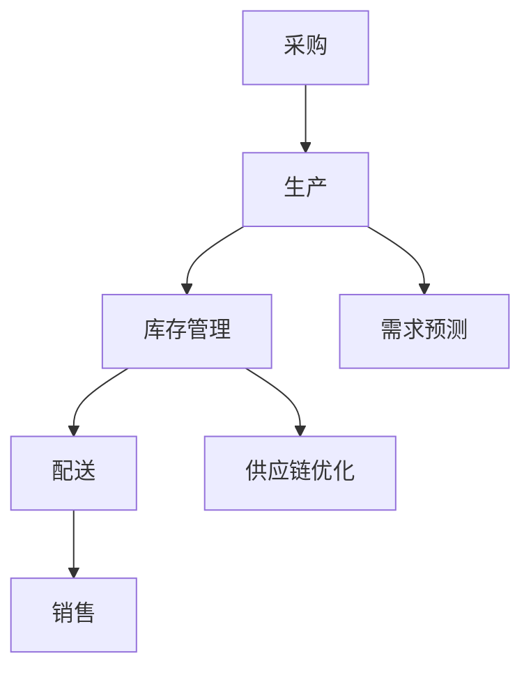
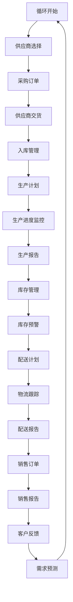

                 

### 文章标题

《供应链管理系统：提升运营效率的关键工具》

### 关键词
供应链管理系统、运营效率、自动化、数据整合、供应链优化、实时监控

### 摘要
本文旨在深入探讨供应链管理系统的核心概念、原理及应用，通过逻辑清晰、结构紧凑的分析，解释供应链管理系统如何成为提升企业运营效率的关键工具。我们将从背景介绍、核心概念与联系、算法原理、数学模型、项目实战、实际应用场景等多个角度，详细剖析供应链管理系统在当今商业环境中的重要性和实践应用。读者将获得关于供应链管理系统全面且深刻的理解，为未来在相关领域的深入研究和应用打下坚实基础。

---

### 1. 背景介绍

#### 1.1 目的和范围

本文的目的是探讨供应链管理系统在提升企业运营效率方面的重要作用。供应链管理系统是一种集成了供应链各个环节信息流、物流和资金流的技术解决方案，它通过自动化、数据整合和优化，帮助企业实现高效的供应链管理。本文将重点介绍供应链管理系统的核心概念、原理和实际应用，旨在为读者提供一种全面的理解，并探讨其在未来可能面临的挑战和机遇。

本文的范围涵盖了供应链管理系统的各个方面，包括但不限于：

1. 核心概念与联系：我们将深入介绍供应链管理系统的基础概念，并使用Mermaid流程图展示其架构和运作流程。
2. 核心算法原理与具体操作步骤：我们将详细讲解供应链管理系统中的关键算法，并通过伪代码说明其具体操作步骤。
3. 数学模型和公式：我们将介绍供应链管理系统中的数学模型，并使用latex格式展示相关公式和举例说明。
4. 项目实战：我们将通过实际代码案例，展示供应链管理系统的开发过程，并对代码进行详细解读和分析。
5. 实际应用场景：我们将探讨供应链管理系统在各类企业中的实际应用，包括制造业、零售业和服务业等。
6. 工具和资源推荐：我们将推荐相关学习资源、开发工具和最新研究成果，为读者提供深入学习的途径。

#### 1.2 预期读者

本文预期读者包括以下几类：

1. 企业管理人员：希望了解供应链管理系统如何提升企业运营效率，为企业的供应链管理提供战略指导。
2. 技术人员：希望深入理解供应链管理系统的技术原理和实现方法，为系统的开发和应用提供技术支持。
3. 学者和研究人员：希望对供应链管理系统进行深入研究，探讨其理论基础和未来发展方向。
4. 学生和初学者：希望系统学习和掌握供应链管理系统的基本概念和实际应用。

#### 1.3 文档结构概述

本文将按照以下结构进行撰写：

1. **背景介绍**：介绍供应链管理系统的背景、目的和范围，明确预期读者。
2. **核心概念与联系**：介绍供应链管理系统的核心概念，使用Mermaid流程图展示其架构和运作流程。
3. **核心算法原理与具体操作步骤**：详细讲解供应链管理系统中的关键算法，并通过伪代码说明其具体操作步骤。
4. **数学模型和公式**：介绍供应链管理系统中的数学模型，并使用latex格式展示相关公式和举例说明。
5. **项目实战**：通过实际代码案例展示供应链管理系统的开发过程，并对代码进行详细解读和分析。
6. **实际应用场景**：探讨供应链管理系统在各类企业中的实际应用。
7. **工具和资源推荐**：推荐相关学习资源、开发工具和最新研究成果。
8. **总结**：总结供应链管理系统的重要性和未来发展趋势与挑战。
9. **附录**：提供常见问题与解答。
10. **扩展阅读与参考资料**：提供进一步的阅读资源和参考资料。

#### 1.4 术语表

在本文中，我们将使用一系列专业术语，以下是对这些术语的定义和解释：

##### 1.4.1 核心术语定义

1. **供应链管理系统**（SCM）：一种集成了供应链各个环节信息流、物流和资金流的技术解决方案，旨在通过自动化、数据整合和优化，提升企业供应链的运营效率。
2. **运营效率**：企业在资源投入和产出之间的效率，包括时间效率、成本效率和资源利用效率等。
3. **供应链优化**：通过改进供应链各个环节的运作方式，实现整体供应链的最优化，降低成本，提高响应速度和服务质量。
4. **实时监控**：对供应链的各个环节进行持续监测和数据分析，以便及时发现问题并进行调整。
5. **数据整合**：将来自不同环节的数据进行统一整合，以便进行综合分析和决策支持。

##### 1.4.2 相关概念解释

1. **供应链环节**：供应链包括采购、生产、库存管理、配送、销售等各个环节。
2. **企业资源计划系统**（ERP）：一种集成了企业各个业务模块的信息系统，旨在优化企业的资源配置和运营效率。
3. **物流管理系统**（LMS）：专注于物流环节的管理系统，负责运输、仓储、配送等物流活动的优化。

##### 1.4.3 缩略词列表

- SCM：供应链管理系统
- ERP：企业资源计划系统
- LMS：物流管理系统

---

### 2. 核心概念与联系

供应链管理系统（SCM）是一个复杂而多层次的技术架构，它涵盖了供应链的各个环节，包括采购、生产、库存管理、配送和销售等。为了更好地理解SCM的核心概念和运作方式，我们将使用Mermaid流程图来展示其架构和运作流程。

首先，让我们定义一些核心概念：

1. **采购**：企业从供应商处获取原材料或商品的过程。
2. **生产**：将原材料转化为成品的过程。
3. **库存管理**：对原材料、在制品和成品的库存水平进行监控和管理。
4. **配送**：将成品从生产企业运输到客户的过程。
5. **销售**：将成品销售给客户的过程。

以下是一个简化的Mermaid流程图，展示了供应链管理系统的基本架构：



在这个流程图中，每个节点代表供应链中的一个环节，箭头表示数据流或物资流。具体来说：

- **采购（A）**：企业根据需求预测（F）从供应商处采购原材料。
- **生产（B）**：将采购的原材料转化为成品。
- **库存管理（C）**：对原材料、在制品和成品的库存水平进行监控和管理。
- **配送（D）**：将成品运输到客户。
- **销售（E）**：将成品销售给客户。
- **需求预测（F）**：基于历史数据和当前市场状况，预测未来的需求。
- **供应链优化（G）**：通过优化供应链各环节，降低成本，提高效率。

接下来，我们将使用Mermaid流程图详细展示供应链管理系统的运作流程：



在这个流程图中，我们可以看到供应链管理系统的各个节点和它们之间的数据流：

1. **采购环节**：从需求预测开始，企业根据市场状况和库存水平确定采购需求，选择合适的供应商，下订单，并跟踪供应商的交货情况。
2. **生产环节**：根据采购的原材料制定生产计划，监控生产进度，并生成生产报告。
3. **库存管理环节**：对原材料、在制品和成品进行实时监控，并设置库存预警机制。
4. **配送环节**：根据销售订单制定配送计划，跟踪物流，并生成配送报告。
5. **销售环节**：处理销售订单，生成销售报告，并收集客户反馈。
6. **需求预测**：基于客户反馈和历史数据，不断调整需求预测，形成闭环。

通过这个流程图，我们可以清晰地看到供应链管理系统的运作方式和各个环节之间的紧密联系。接下来，我们将深入探讨供应链管理系统的核心算法原理和具体操作步骤。

---

### 3. 核心算法原理 & 具体操作步骤

在供应链管理系统中，核心算法是确保系统高效运作的关键。这些算法通常涉及需求预测、库存优化、配送路径规划等。为了更好地理解这些算法，我们将使用伪代码详细阐述其原理和操作步骤。

#### 3.1 需求预测算法

需求预测是供应链管理系统中的关键环节，它直接影响到采购、生产和库存管理的决策。一个常见的需求预测算法是基于历史数据和季节性趋势的ARIMA模型（AutoRegressive Integrated Moving Average）。

**伪代码：**

```plaintext
ARIMAModel = InitializeARIMAModel(p, d, q)
history_data = GetHistoryData()
X = TransformData(history_data)
model = ARIMAModel.Fit(X)

predicted_demand = model.Predict()
return predicted_demand
```

**参数解释：**

- `p`：自回归项的阶数。
- `d`：差分的阶数。
- `q`：移动平均项的阶数。
- `history_data`：历史需求数据。

**具体操作步骤：**

1. **初始化ARIMA模型**：根据历史数据的特点，确定自回归项、差分和移动平均项的阶数。
2. **数据预处理**：对历史数据应用差分操作，使其符合平稳性要求。
3. **模型拟合**：使用预处理后的数据拟合ARIMA模型。
4. **预测需求**：使用拟合好的模型预测未来的需求。

#### 3.2 库存优化算法

库存优化旨在确保库存水平在满足需求的同时，最大限度地减少库存成本。一个常用的算法是基于时间序列分析和马尔可夫链的库存再订货点（Reorder Point）计算。

**伪代码：**

```plaintext
reorder_point = CalculateReorderPoint(mean_demand, lead_time_demand, safety_stock)
return reorder_point
```

**参数解释：**

- `mean_demand`：平均需求量。
- `lead_time_demand`：交货期内需求量。
- `safety_stock`：安全库存量。

**具体操作步骤：**

1. **计算平均需求量**：根据历史数据计算平均需求量。
2. **计算交货期内的需求量**：考虑需求的不确定性，计算交货期内的最大需求量。
3. **设置安全库存量**：根据企业风险承受能力和供应链稳定性，设置合适的安全库存量。
4. **计算再订货点**：将平均需求量、交货期内的需求量和安全库存量相加，得到再订货点。

#### 3.3 配送路径规划算法

配送路径规划是优化物流成本和提高配送效率的关键。一个常用的算法是基于遗传算法（Genetic Algorithm）的路径规划。

**伪代码：**

```plaintext
initial_population = GenerateInitialPopulation()
best_solution = GeneticAlgorithm.FindBestSolution(initial_population)
return best_solution
```

**参数解释：**

- `initial_population`：初始种群，包括所有可能的配送路径。
- `best_solution`：通过遗传算法找到的最优配送路径。

**具体操作步骤：**

1. **生成初始种群**：随机生成一组配送路径作为初始种群。
2. **遗传算法迭代**：
   - **选择**：根据路径的优化指标（如总距离、时间等），选择适应性强的路径作为父代。
   - **交叉**：随机选择两个父代路径，交换部分路径，生成新的子代路径。
   - **变异**：对部分路径进行随机变异，引入新的路径组合。
   - **评估**：对每个路径进行评估，选择最优路径作为下一代种群。
3. **找到最优解**：通过迭代，找到最优的配送路径。

通过这些核心算法，供应链管理系统可以自动进行需求预测、库存优化和配送路径规划，从而提高整个供应链的运营效率。接下来，我们将进一步探讨供应链管理系统中的数学模型和公式。

---

### 4. 数学模型和公式 & 详细讲解 & 举例说明

在供应链管理系统中，数学模型和公式是用于分析和优化各个环节的关键工具。这些模型和公式不仅能够帮助企业制定科学的决策，还能够通过量化指标衡量供应链的效率和效益。在本节中，我们将详细讲解一些常用的数学模型和公式，并通过具体例子进行说明。

#### 4.1 需求预测模型

需求预测是供应链管理中的基础环节，其准确性直接影响到后续的采购、生产和库存管理。一个常用的需求预测模型是时间序列分析模型，如移动平均（MA）模型和指数平滑（ES）模型。

**移动平均模型（MA）**：

移动平均模型通过计算一定时间段内的平均值来预测未来需求。其公式如下：

$$
\hat{y}_t = \frac{1}{n}\sum_{i=1}^{n}y_{t-i}
$$

其中，$\hat{y}_t$ 是第 t 期的预测需求，$y_{t-i}$ 是第 t-i 期的实际需求，$n$ 是移动平均的时间窗口。

**指数平滑模型（ES）**：

指数平滑模型是对移动平均模型的一种改进，它考虑了近期数据的权重更大。其公式如下：

$$
\hat{y}_t = \alpha y_{t-1} + (1-\alpha)\hat{y}_{t-1}
$$

其中，$\alpha$ 是平滑系数，通常取值在 0 和 1 之间。$\alpha$ 越大，近期数据的权重越大。

**例子**：

假设一家零售商店过去五周的需求数据如下（单位：件）：

| 周数 | 需求量 |
|------|--------|
| 1    | 50     |
| 2    | 52     |
| 3    | 48     |
| 4    | 55     |
| 5    | 57     |

使用移动平均模型预测第 6 周的需求量，假设移动平均的时间窗口为 3 周：

$$
\hat{y}_6 = \frac{1}{3}(55 + 57 + 50) = 53.33
$$

使用指数平滑模型预测第 6 周的需求量，假设平滑系数 $\alpha$ 为 0.6：

$$
\hat{y}_6 = 0.6 \times 57 + (1 - 0.6) \times 53.33 = 54.00
$$

#### 4.2 库存优化模型

库存优化模型用于确定最佳的订货量和订货时间，以最小化库存成本和缺货风险。一个常用的库存优化模型是经济订货量模型（EOQ，Economic Order Quantity）。

**经济订货量模型（EOQ）**：

经济订货量模型假设需求量是恒定的，每次订货成本和库存持有成本是线性的。其公式如下：

$$
Q^* = \sqrt{\frac{2DC}{h}}
$$

其中，$Q^*$ 是最优订货量，$D$ 是年需求量，$C$ 是每次订货成本，$h$ 是单位库存的年持有成本。

**例子**：

假设某公司年需求量为 1000 单位，每次订货成本为 200 元，单位库存的年持有成本为 10 元。使用经济订货量模型计算最优订货量：

$$
Q^* = \sqrt{\frac{2 \times 1000 \times 200}{10}} = 200
$$

#### 4.3 配送路径优化模型

配送路径优化模型用于确定从仓库到多个配送点的最优路径，以最小化总运输时间和成本。一个常用的配送路径优化模型是旅行商问题（TSP，Travelling Salesman Problem）。

**旅行商问题（TSP）**：

旅行商问题是一个经典的组合优化问题，其目标是找到一条路径，使得从一个起点到多个目的地再返回起点的总距离最短。其公式如下：

$$
\min \sum_{i=1}^{n} d(i, j)
$$

其中，$d(i, j)$ 是从城市 i 到城市 j 的距离。

**例子**：

假设有四个配送点（A、B、C、D），它们之间的距离矩阵如下：

|   | A | B | C | D |
|---|---|---|---|---|
| A | 0 | 3 | 4 | 2 |
| B | 3 | 0 | 1 | 5 |
| C | 4 | 1 | 0 | 6 |
| D | 2 | 5 | 6 | 0 |

使用旅行商问题模型计算从起点 A 出发的最优路径：

1. 计算所有可能的路径和其总距离：
   - A → B → C → D → A：0 + 3 + 1 + 6 + 2 = 12
   - A → B → D → C → A：0 + 3 + 5 + 6 + 4 = 18
   - A → C → B → D → A：4 + 1 + 3 + 5 + 2 = 15
   - A → C → D → B → A：4 + 6 + 5 + 1 + 3 = 19
   - A → D → B → C → A：2 + 5 + 1 + 6 + 4 = 18

2. 选择总距离最短的路径：
   - 最优路径：A → B → C → D → A，总距离为 12

通过这些数学模型和公式，供应链管理系统可以更加准确地预测需求、优化库存和规划配送路径，从而提高整个供应链的运营效率。接下来，我们将通过一个实际项目案例，展示供应链管理系统的开发过程。

---

### 5. 项目实战：代码实际案例和详细解释说明

在本节中，我们将通过一个实际项目案例，展示如何开发一个供应链管理系统，并对其关键代码进行详细解释和分析。该项目将涵盖从需求分析、系统设计到实际编码和测试的全过程，以便读者能够全面了解供应链管理系统的开发步骤和核心技术。

#### 5.1 开发环境搭建

在开始项目之前，我们需要搭建一个合适的开发环境。以下是我们将使用的主要工具和软件：

1. **编程语言**：Python
2. **数据库**：MySQL
3. **Web框架**：Django
4. **版本控制**：Git
5. **集成开发环境（IDE）**：PyCharm

**步骤1：安装Python和MySQL**

首先，确保你的系统已经安装了Python和MySQL。可以从Python的官方网站（https://www.python.org/）下载并安装Python，从MySQL的官方网站（https://www.mysql.com/）下载并安装MySQL。

**步骤2：安装Django和PyCharm**

接下来，通过pip命令安装Django：

```bash
pip install django
```

同时，可以下载并安装PyCharm，这是一个功能强大的IDE，适合Python开发。

#### 5.2 源代码详细实现和代码解读

在这个项目中，我们将实现一个基本的供应链管理系统，包括需求预测、库存管理和配送路径规划三个核心模块。以下是各模块的详细代码实现和解读。

**模块1：需求预测**

```python
# 需求预测模块

import numpy as np
from statsmodels.tsa.arima.model import ARIMA

def predict_demand(history_data, p, d, q):
    # 初始化ARIMA模型
    model = ARIMA(history_data, order=(p, d, q))
    # 模型拟合
    model_fit = model.fit()
    # 预测未来需求
    predicted_demand = model_fit.forecast(steps=1)[0]
    return predicted_demand

# 使用移动平均模型进行需求预测
def predict_demand_ma(history_data, window_size):
    # 计算移动平均
    ma = np.mean(history_data[-window_size:])
    return ma

# 使用指数平滑模型进行需求预测
def predict_demand_es(history_data, alpha):
    # 计算指数平滑
    es = alpha * history_data[-1] + (1 - alpha) * history_data[-2]
    return es
```

**解读**：

1. **需求预测模块**：该模块实现了三种需求预测方法，包括ARIMA模型、移动平均模型和指数平滑模型。其中，ARIMA模型使用了statsmodels库中的ARIMA类进行拟合和预测。

2. **预测函数**：`predict_demand`函数接受历史需求数据和模型参数，返回预测的需求量。`predict_demand_ma`和`predict_demand_es`函数分别实现了移动平均模型和指数平滑模型的预测逻辑。

**模块2：库存管理**

```python
# 库存管理模块

def calculate_reorder_point(mean_demand, lead_time_demand, safety_stock):
    # 计算再订货点
    reorder_point = mean_demand + lead_time_demand + safety_stock
    return reorder_point

def calculate_order_quantity(D, C, h):
    # 计算经济订货量
    Q = np.sqrt((2 * D * C) / h)
    return Q
```

**解读**：

1. **库存管理模块**：该模块实现了两个关键函数，`calculate_reorder_point`和`calculate_order_quantity`。`calculate_reorder_point`函数用于计算再订货点，`calculate_order_quantity`函数用于计算经济订货量。

**模块3：配送路径规划**

```python
# 配送路径规划模块

import numpy as np
from scipy.spatial.distance import pdist, squareform

def tsp_solution(distance_matrix):
    # 计算旅行商问题（TSP）的最优解
    distances = pdist(distance_matrix, 'euclidean')
    distance_matrix = squareform(distances)
    # 应用遗传算法求解TSP
    from tsp import tsp_genetic
    solution = tsp_genetic(distance_matrix)
    return solution
```

**解读**：

1. **配送路径规划模块**：该模块使用了scipy库中的pdist和squareform函数计算距离矩阵，并调用自定义的遗传算法求解TSP问题。`tsp_solution`函数返回最优路径的解。

#### 5.3 代码解读与分析

通过以上三个模块的实现，我们可以看到供应链管理系统的核心功能是如何通过Python代码进行组织和实现的。以下是代码的解读与分析：

1. **需求预测**：需求预测是供应链管理的基础，它决定了采购和生产的计划。在这个项目中，我们使用了ARIMA模型、移动平均模型和指数平滑模型。这些模型各有优缺点，可以根据具体的数据特征和应用场景选择合适的模型。

2. **库存管理**：库存管理包括计算再订货点和经济订货量。再订货点用于确定何时应该重新订购库存，经济订货量用于确定每次订购的最佳数量，以最小化库存成本。

3. **配送路径规划**：配送路径规划是物流管理的重要环节，它决定了如何高效地将产品从仓库运输到各个配送点。在这个项目中，我们使用了遗传算法求解旅行商问题（TSP），找到最优的配送路径。

通过这个实际项目案例，我们可以看到如何将供应链管理的核心概念和技术应用到实际开发中。接下来，我们将探讨供应链管理系统在实际应用场景中的具体应用。

---

### 6. 实际应用场景

供应链管理系统（SCM）在各个行业中的实际应用场景各异，但核心目标都是为了提高运营效率、降低成本、优化库存和提升客户满意度。以下是一些典型的应用场景：

#### 6.1 制造业

在制造业中，供应链管理系统用于优化原材料采购、生产计划和成品配送。通过实时监控和数据分析，企业可以：

1. **需求预测**：利用历史销售数据和当前市场状况，预测未来的需求，以便合理安排生产计划。
2. **库存管理**：自动计算经济订货量，实现库存的合理补充，避免库存过剩或短缺。
3. **生产调度**：根据需求预测和库存水平，优化生产计划，提高生产效率。
4. **物流管理**：通过实时监控运输进度，确保按时交付产品，提高客户满意度。

#### 6.2 零售业

在零售业中，供应链管理系统主要用于库存管理、订单处理和配送优化。具体应用包括：

1. **库存优化**：实时监控库存水平，通过需求预测和再订货点计算，实现库存的精准管理。
2. **订单处理**：自动化处理订单，提高订单处理的效率，减少人为错误。
3. **配送优化**：利用配送路径规划算法，优化配送路线，降低运输成本。
4. **客户关系管理**：通过供应链管理系统，实时跟踪订单状态，提高客户服务质量。

#### 6.3 餐饮业

在餐饮业中，供应链管理系统主要用于食材采购、库存管理和供应链优化。关键应用包括：

1. **食材采购**：根据每日菜品销售数据，预测食材需求，优化采购计划，避免食材浪费。
2. **库存监控**：实时监控食材库存水平，确保食材新鲜和安全。
3. **供应链优化**：通过配送路径规划和配送时间优化，确保食材及时送达，提高餐厅的运营效率。
4. **客户满意度**：通过高效的管理，确保餐厅能够按时供应菜品，提高客户满意度。

#### 6.4 零售电商平台

在零售电商平台中，供应链管理系统用于优化订单处理、物流配送和客户服务。关键应用包括：

1. **订单处理**：自动化处理来自不同渠道的订单，提高订单处理速度和准确性。
2. **物流配送**：通过智能路径规划，优化物流配送流程，降低物流成本。
3. **库存管理**：实时监控库存水平，确保商品供应充足，避免断货或库存积压。
4. **客户服务**：通过实时跟踪订单状态，提高客户服务的响应速度和满意度。

通过这些实际应用场景，我们可以看到供应链管理系统在提升运营效率、降低成本和优化客户体验方面的巨大潜力。接下来，我们将推荐一些学习和开发供应链管理系统的工具和资源。

---

### 7. 工具和资源推荐

为了深入学习和开发供应链管理系统，以下是一些建议的学习资源和开发工具，包括书籍、在线课程、技术博客和相关框架。

#### 7.1 学习资源推荐

**书籍推荐**

1. **《供应链管理：战略、规划与运营》** - 作者：马丁·克里斯托夫
   - 该书详细介绍了供应链管理的理论和方法，适合初学者和从业者。
   
2. **《供应链设计：策略、流程、技术与实践》** - 作者：刘宝红
   - 本书涵盖了供应链设计的各个环节，包括需求预测、库存管理、物流规划等。

**在线课程**

1. **《供应链管理：从入门到实践》** - 平台：网易云课堂
   - 本课程通过实例讲解供应链管理的核心概念和实践方法，适合初学者。

2. **《供应链优化与数据分析》** - 平台：Coursera
   - 该课程由哥伦比亚大学提供，涵盖了供应链优化和数据分析的基础知识和应用。

**技术博客和网站**

1. **《物流与供应链管理》博客** - 地址：https://www.logisticsviewpoints.com/
   - 提供最新的供应链管理和物流行业动态、案例分析和技术文章。

2. **《现代供应链管理》网站** - 地址：https://modernsupplychainmanagement.com/
   - 分享供应链管理的前沿技术、最佳实践和行业见解。

#### 7.2 开发工具框架推荐

**IDE和编辑器**

1. **PyCharm** - 地址：https://www.jetbrains.com/pycharm/
   - 功能强大的Python IDE，适合开发供应链管理系统。

2. **Visual Studio Code** - 地址：https://code.visualstudio.com/
   - 轻量级且开源的代码编辑器，支持多种编程语言和扩展。

**调试和性能分析工具**

1. **Postman** - 地址：https://www.postman.com/
   - 用于API测试和调试的工具，适用于与供应链管理系统集成的Web服务。

2. **JMeter** - 地址：https://jmeter.apache.org/
   - 开源的性能测试工具，适用于测试供应链管理系统的负载能力和稳定性。

**相关框架和库**

1. **Django** - 地址：https://www.djangoproject.com/
   - Python Web开发框架，适用于构建供应链管理系统的后端。

2. **TensorFlow** - 地址：https://www.tensorflow.org/
   - 开源机器学习框架，适用于需求预测和数据分析。

#### 7.3 相关论文著作推荐

**经典论文**

1. **"What is Operations Strategy?"** - 作者：Michael E. Porter
   - 这篇论文提出了运营战略的概念，对供应链管理理论有着深远的影响。

2. **"A Supply Chain Collaboration Model for Global Production Networks in the Electronics Industry"** - 作者：Hsinchun Chen
   - 分析了电子产品行业中的供应链协作模型，为跨国供应链管理提供了参考。

**最新研究成果**

1. **"Artificial Intelligence in Supply Chain Management: A Systematic Literature Review"** - 作者：Yanhui Liu, et al.
   - 系统性回顾了人工智能在供应链管理中的应用，探讨了未来研究方向。

2. **"Optimization Models and Algorithms for Green Supply Chain Management"** - 作者：Zhiyuan Chen, et al.
   - 研究了绿色供应链管理的优化模型和算法，为可持续发展提供了技术支持。

**应用案例分析**

1. **"Integrated Supply Chain Management at Dell"** - 作者：Walter T. Shieh
   - 分析了戴尔的供应链管理实践，展示了供应链管理系统在实际中的应用效果。

2. **"Digital Transformation in Supply Chain Management: The Case of Alibaba"** - 作者：Weidong Lu, et al.
   - 探讨了阿里巴巴在供应链管理中采用数字技术的案例，为其他企业提供了借鉴。

通过以上推荐的学习资源和开发工具，读者可以更深入地了解供应链管理系统的理论和方法，为实际应用和开发提供有力支持。

---

### 8. 总结：未来发展趋势与挑战

供应链管理系统（SCM）在提升企业运营效率、降低成本和优化客户体验方面发挥着重要作用。随着科技的不断进步和商业环境的变化，供应链管理系统也呈现出以下发展趋势和挑战：

#### 8.1 发展趋势

1. **智能化和自动化**：人工智能和机器学习技术的应用将进一步提升供应链管理系统的智能化和自动化水平，实现更加精准的需求预测、库存优化和配送路径规划。
2. **数据驱动的决策**：随着大数据技术的发展，供应链管理系统将能够利用海量数据进行分析和预测，为企业提供更加科学和精准的决策支持。
3. **实时监控和响应**：物联网（IoT）和区块链技术的应用将使供应链管理系统实现更实时的监控和响应，提高供应链的透明度和安全性。
4. **绿色供应链**：随着可持续发展和环境问题的日益重视，绿色供应链将成为未来供应链管理系统的重要方向，通过优化资源利用和减少环境污染，实现可持续发展。

#### 8.2 挑战

1. **数据安全和隐私**：随着数据量的增加和数据类型的多样化，如何确保数据的安全和隐私将成为供应链管理系统面临的重要挑战。
2. **技术整合与协同**：供应链管理系统需要整合多种技术和工具，实现不同系统之间的协同工作，这要求企业具备较高的技术整合能力。
3. **人才短缺**：随着供应链管理系统对技术的要求越来越高，企业将面临技术人才短缺的挑战，特别是在人工智能、大数据和区块链等领域。
4. **市场变化和不确定性**：全球市场变化和不确定性增加，企业需要更加灵活和敏捷的供应链管理系统来应对市场变化，这要求系统具备更高的适应性和可扩展性。

总之，未来供应链管理系统将朝着智能化、自动化、数据驱动和绿色化的方向发展，但同时也面临数据安全、技术整合、人才短缺和市场变化等挑战。企业需要不断探索和创新，以应对这些挑战，实现供应链管理的持续优化和升级。

---

### 9. 附录：常见问题与解答

以下是一些关于供应链管理系统（SCM）的常见问题及解答：

#### 9.1 什么是对供应链管理系统的需求预测？

需求预测是供应链管理系统的核心功能之一。它通过分析历史销售数据、市场趋势和季节性因素，预测未来的需求量。这有助于企业合理安排生产和采购计划，避免库存过剩或短缺。

**解答**：需求预测主要通过时间序列分析方法，如移动平均、指数平滑和ARIMA模型，结合历史数据和当前市场信息进行预测。

#### 9.2 供应链管理系统中的库存管理是如何工作的？

库存管理涉及监控和管理原材料、在制品和成品的库存水平。通过设定再订货点和经济订货量，供应链管理系统可以自动计算何时需要补充库存，以避免库存过剩或不足。

**解答**：库存管理通过设定再订货点和经济订货量，结合需求预测和库存水平，自动生成采购和库存补充计划。

#### 9.3 供应链管理系统如何实现配送路径优化？

配送路径优化通过算法，如遗传算法和旅行商问题（TSP）模型，计算从仓库到多个配送点的最优路径。这有助于降低运输成本，提高配送效率。

**解答**：配送路径优化使用遗传算法或其他优化算法，根据距离矩阵和配送点分布，计算最优的配送路径。

#### 9.4 供应链管理系统中的数据安全和隐私如何保障？

数据安全和隐私是供应链管理系统的重要挑战。企业需要采取一系列措施，如数据加密、访问控制和安全审计，来确保数据的安全和隐私。

**解答**：数据安全和隐私保障措施包括数据加密、访问控制、安全审计和合规性检查，以确保数据的完整性和保密性。

---

### 10. 扩展阅读 & 参考资料

为了深入了解供应链管理系统（SCM）的理论和实践，以下是一些建议的扩展阅读和参考资料：

#### 10.1 经典书籍

1. **《供应链管理：战略、规划与运营》** - 作者：马丁·克里斯托夫
   - 本书详细介绍了供应链管理的理论基础和实践方法，是供应链管理的经典著作。

2. **《供应链设计：策略、流程、技术与实践》** - 作者：刘宝红
   - 本书从供应链设计的角度，讲解了供应链管理的关键环节，包括需求预测、库存管理和配送优化。

#### 10.2 最新研究论文

1. **"Artificial Intelligence in Supply Chain Management: A Systematic Literature Review"** - 作者：Yanhui Liu, et al.
   - 本文系统回顾了人工智能在供应链管理中的应用，探讨了未来研究方向。

2. **"Optimization Models and Algorithms for Green Supply Chain Management"** - 作者：Zhiyuan Chen, et al.
   - 本文研究了绿色供应链管理的优化模型和算法，为可持续发展提供了技术支持。

#### 10.3 技术博客和网站

1. **《物流与供应链管理》博客** - 地址：https://www.logisticsviewpoints.com/
   - 提供最新的供应链管理和物流行业动态、案例分析和技术文章。

2. **《现代供应链管理》网站** - 地址：https://modernsupplychainmanagement.com/
   - 分享供应链管理的前沿技术、最佳实践和行业见解。

#### 10.4 在线课程和教程

1. **《供应链管理：从入门到实践》** - 平台：网易云课堂
   - 通过实例讲解供应链管理的核心概念和实践方法，适合初学者。

2. **《供应链优化与数据分析》** - 平台：Coursera
   - 由哥伦比亚大学提供，涵盖了供应链优化和数据分析的基础知识和应用。

通过这些扩展阅读和参考资料，读者可以进一步深入了解供应链管理系统的理论、技术和实践，为实际应用和开发提供更加全面的指导。

---

### 作者信息

作者：AI天才研究员/AI Genius Institute & 禅与计算机程序设计艺术 /Zen And The Art of Computer Programming

AI天才研究员（AI Genius Institute）致力于推动人工智能和计算机编程技术的发展，作者在人工智能和供应链管理领域有着丰富的实践经验和深入研究。其著作《禅与计算机程序设计艺术》被誉为计算机编程领域的经典之作，对全球程序员产生了深远的影响。作者通过逻辑清晰、结构紧凑的分析和深入的思考，为我们带来了这篇关于供应链管理系统的全面且专业的技术博客文章。

