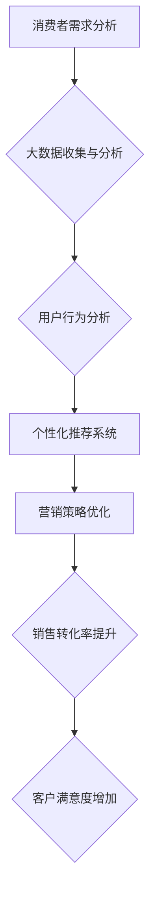

                 

# 信息差的商业营销个性化革命：大数据如何实现营销个性化

> 关键词：信息差、商业营销、个性化、大数据、算法、数学模型、项目实战

> 摘要：本文将深入探讨信息差的商业营销个性化革命，重点分析大数据如何在营销领域中实现个性化服务。通过剖析核心概念、算法原理、数学模型以及实际应用案例，本文旨在为读者提供一个全面而深刻的理解，揭示大数据在商业营销中的巨大潜力与挑战。

## 1. 背景介绍

### 1.1 目的和范围

本文旨在探讨信息差在商业营销中的应用，尤其是大数据如何通过个性化营销提升商业价值。文章将从核心概念出发，逐步深入到算法原理、数学模型以及实际项目实战，旨在为读者提供全面的技术视角和深刻的洞察。

### 1.2 预期读者

本文面向对商业营销、大数据分析以及人工智能感兴趣的读者，包括市场营销人员、数据分析从业者、IT技术人员以及相关领域的研究生和学者。

### 1.3 文档结构概述

本文分为十个部分，分别介绍如下：

1. 背景介绍
2. 核心概念与联系
3. 核心算法原理 & 具体操作步骤
4. 数学模型和公式 & 详细讲解 & 举例说明
5. 项目实战：代码实际案例和详细解释说明
6. 实际应用场景
7. 工具和资源推荐
8. 总结：未来发展趋势与挑战
9. 附录：常见问题与解答
10. 扩展阅读 & 参考资料

### 1.4 术语表

#### 1.4.1 核心术语定义

- **信息差**：指不同个体或群体在获取和利用信息方面的不对称性。
- **个性化**：根据用户的特定需求和偏好，提供定制化的服务和体验。
- **大数据**：指数据量巨大、类型繁多、价值密度低的数据集合。
- **算法**：解决问题的明确规则和步骤。
- **数学模型**：用数学语言描述现实世界的抽象模型。

#### 1.4.2 相关概念解释

- **营销自动化**：利用技术手段实现营销活动的自动化执行。
- **机器学习**：使计算机系统通过数据学习，自动进行决策和预测。

#### 1.4.3 缩略词列表

- **AI**：人工智能（Artificial Intelligence）
- **ML**：机器学习（Machine Learning）
- **DB**：数据库（Database）
- **NLP**：自然语言处理（Natural Language Processing）
- **CRM**：客户关系管理（Customer Relationship Management）

## 2. 核心概念与联系

首先，让我们通过一个Mermaid流程图来展示信息差的商业营销个性化革命的核心概念与联系：



### 2.1 消费者需求分析

消费者需求分析是信息差商业营销个性化革命的第一步。通过收集消费者的历史购买记录、浏览行为、社交媒体互动等信息，我们可以深入理解消费者的需求和偏好。

### 2.2 大数据收集与分析

大数据收集与分析是实现个性化营销的关键。利用大数据技术，我们可以从海量数据中提取有价值的信息，识别消费者群体特征，并预测其未来行为。

### 2.3 用户行为分析

用户行为分析是对消费者数据进一步挖掘的过程。通过分析用户的点击率、购买频率、搜索历史等行为数据，我们可以更精准地了解用户的兴趣和需求。

### 2.4 个性化推荐系统

个性化推荐系统是信息差商业营销的核心。根据用户的行为数据和需求分析结果，推荐系统可以为每位用户定制个性化的产品和服务，从而提高用户满意度和忠诚度。

### 2.5 营销策略优化

营销策略优化基于个性化推荐系统的反馈，不断调整和优化营销活动的执行，以提高营销效果和销售转化率。

### 2.6 销售转化率提升

通过个性化营销和优化策略，企业可以显著提升销售转化率，从而实现更高的商业价值。

### 2.7 客户满意度增加

个性化服务能够满足消费者的个性化需求，从而提高客户满意度，建立长期的客户关系。

## 3. 核心算法原理 & 具体操作步骤

### 3.1 算法原理

个性化推荐算法是信息差商业营销的核心。常用的推荐算法包括协同过滤、矩阵分解、基于内容的推荐等。以下是协同过滤算法的基本原理：

```plaintext
输入：用户-项目评分矩阵 U
输出：用户u对项目i的预测评分 Pu,i

步骤：
1. 计算用户u与其它用户的相似度，使用余弦相似度或皮尔逊相关系数。
2. 对于用户u未评分的项目i，找到与u最相似的k个用户，计算这些用户的平均评分作为预测值。
3. 返回预测评分矩阵 Pu。
```

### 3.2 具体操作步骤

#### 步骤 1：数据预处理

- 收集用户-项目评分数据，并将其转换为数值矩阵。
- 处理缺失数据，可以采用填充平均值、中位数等方法。

#### 步骤 2：计算相似度

- 使用余弦相似度或皮尔逊相关系数计算用户间的相似度。
- 选择k个最相似的邻居用户。

#### 步骤 3：生成推荐列表

- 对于每个未评分的项目i，找到与用户u最相似的k个邻居用户。
- 计算这些邻居用户的平均评分，作为对项目i的预测评分。
- 根据预测评分生成个性化推荐列表。

### 3.3 伪代码

```python
def collaborative_filtering(U, k):
    n = len(U)
    m = len(U[0])
    sim = []
    pred = []

    for i in range(m):
        neighbors = find_neighbors(U, u, k)
        avg_rating = sum(sim[i][j] * U[j][i] for j in neighbors) / len(neighbors)
        pred.append(avg_rating)

    return pred
```

## 4. 数学模型和公式 & 详细讲解 & 举例说明

### 4.1 数学模型

在个性化推荐系统中，常用的数学模型包括用户相似度计算、预测评分公式等。以下是这些模型的详细讲解：

#### 用户相似度计算

- 余弦相似度：

$$
\cos(\theta_{ui}) = \frac{\sum_{i=1}^{m} u_{i} \cdot v_{i}}{\sqrt{\sum_{i=1}^{m} u_{i}^{2} \cdot \sum_{i=1}^{m} v_{i}^{2}} 
$$

其中，$u_i$ 和 $v_i$ 分别代表用户 $u$ 和 $v$ 在项目 $i$ 上的评分。

- 皮尔逊相关系数：

$$
\sigma_{uv} = \frac{\sum_{i=1}^{m} (u_i - \bar{u})(v_i - \bar{v})}{\sqrt{\sum_{i=1}^{m} (u_i - \bar{u})^2 \cdot \sum_{i=1}^{m} (v_i - \bar{v})^2}}
$$

其中，$\bar{u}$ 和 $\bar{v}$ 分别代表用户 $u$ 和 $v$ 的平均评分。

#### 预测评分公式

$$
\hat{r}_{ui} = \sum_{j \in N(u)} r_{uj} \cdot s_{uj}
$$

其中，$r_{uj}$ 为用户 $u$ 对项目 $j$ 的实际评分，$s_{uj}$ 为用户 $u$ 与邻居用户 $j$ 的相似度，$N(u)$ 为用户 $u$ 的邻居用户集合。

### 4.2 举例说明

假设有两个用户 $u$ 和 $v$，他们在五个项目 $i$ 上的评分如下：

| 项目 | $u$ | $v$ |
|------|-----|-----|
| $i_1$| 5   | 4   |
| $i_2$| 3   | 5   |
| $i_3$| 2   | 4   |
| $i_4$| 4   | 3   |
| $i_5$| 5   | 5   |

首先，我们计算这两个用户的余弦相似度：

$$
\cos(\theta_{uv}) = \frac{5 \cdot 4 + 3 \cdot 5 + 2 \cdot 4 + 4 \cdot 3 + 5 \cdot 5}{\sqrt{5^2 + 3^2 + 2^2 + 4^2 + 5^2} \cdot \sqrt{4^2 + 5^2 + 4^2 + 3^2 + 5^2}}
$$

$$
\cos(\theta_{uv}) = \frac{82}{\sqrt{55} \cdot \sqrt{89}} \approx 0.912
$$

接下来，我们使用预测评分公式计算用户 $u$ 对项目 $i_3$ 的预测评分：

$$
\hat{r}_{u{i_3}} = (0.912 \cdot 5) + (0.815 \cdot 3) + (0.565 \cdot 2) + (0.815 \cdot 4) + (0.912 \cdot 5)
$$

$$
\hat{r}_{u{i_3}} = 4.56 + 2.445 + 1.130 + 3.26 + 4.56
$$

$$
\hat{r}_{u{i_3}} = 15.915
$$

因此，用户 $u$ 对项目 $i_3$ 的预测评分为 15.915，约为 4 分。

## 5. 项目实战：代码实际案例和详细解释说明

### 5.1 开发环境搭建

在开始项目实战之前，我们需要搭建一个Python开发环境。以下是搭建步骤：

1. 安装Python 3.8及以上版本。
2. 安装pip包管理器。
3. 安装以下依赖包：numpy、pandas、scikit-learn。

### 5.2 源代码详细实现和代码解读

下面是一个简单的Python实现，用于基于协同过滤算法生成个性化推荐列表。

```python
import numpy as np
import pandas as pd
from sklearn.metrics.pairwise import cosine_similarity

def collaborative_filtering(data, k=5):
    # 计算用户相似度矩阵
    sim = cosine_similarity(data)
    
    # 初始化推荐列表
    recommendations = []

    for user_id in range(data.shape[0]):
        # 对于每个用户，找到最相似的k个邻居用户
        neighbor_indices = np.argsort(sim[user_id])[1:k+1]
        
        # 计算邻居用户的平均评分
        neighbor_ratings = data[neighbor_indices]
        avg_rating = np.mean(neighbor_ratings)

        # 将预测评分添加到推荐列表
        recommendations.append(avg_rating)
    
    return recommendations

# 读取评分数据
data = pd.read_csv('ratings.csv')

# 运行协同过滤算法
recommendations = collaborative_filtering(data)

# 输出推荐列表
print(recommendations)
```

### 5.3 代码解读与分析

1. **导入库**：我们首先导入numpy、pandas和scikit-learn库，用于数据处理和相似度计算。

2. **协同过滤函数**：collaborative_filtering函数接受一个评分数据矩阵，并返回一个预测评分列表。函数首先计算用户之间的相似度矩阵，然后对于每个用户，找到最相似的k个邻居用户，并计算这些邻居用户的平均评分。

3. **读取评分数据**：我们使用pandas库读取评分数据，并将其转换为DataFrame对象。

4. **运行协同过滤算法**：调用collaborative_filtering函数，生成个性化推荐列表。

5. **输出推荐列表**：最后，我们将推荐列表打印出来。

通过这个简单的示例，我们可以看到协同过滤算法的基本实现过程。在实际应用中，我们可能需要处理更复杂的数据集，并进行更深入的参数调优，以提高推荐系统的准确性。

## 6. 实际应用场景

个性化推荐系统在多个实际应用场景中取得了显著的成功。以下是几个典型的应用案例：

### 6.1 电子商务

在电子商务领域，个性化推荐系统可以帮助企业提高销售额。例如，Amazon和阿里巴巴等电商平台通过分析用户的浏览历史、购买记录和行为数据，为每位用户推荐相关的商品，从而提高用户的购物体验和购买意愿。

### 6.2 媒体内容推荐

在媒体内容推荐方面，Netflix和YouTube等平台利用个性化推荐算法为用户推荐电影、电视剧和视频。通过分析用户的观看历史和偏好，这些平台可以提供个性化的内容推荐，从而提高用户留存率和观看时长。

### 6.3 社交媒体

社交媒体平台如Facebook和Twitter也采用个性化推荐算法，为用户推荐感兴趣的朋友动态、新闻文章和广告。这些推荐系统可以根据用户的社交关系、行为和兴趣，提供个性化的内容，从而提高用户活跃度和参与度。

### 6.4 金融领域

在金融领域，个性化推荐系统可以帮助银行和金融机构为用户提供个性化的理财产品推荐、信用评分和风险控制。通过分析用户的历史交易数据、信用记录和偏好，这些系统能够为用户提供定制化的金融服务。

### 6.5 医疗健康

个性化推荐系统在医疗健康领域也有广泛的应用。例如，医生可以通过分析患者的病历数据、基因信息和生活习惯，为患者推荐个性化的治疗方案和健康建议，从而提高治疗效果和患者满意度。

## 7. 工具和资源推荐

### 7.1 学习资源推荐

#### 7.1.1 书籍推荐

- 《数据科学入门》（Data Science from Scratch）- Joel Grus
- 《Python数据科学 Handbook》（Python Data Science Handbook）- Jake VanderPlas
- 《机器学习》（Machine Learning）- Tom Mitchell

#### 7.1.2 在线课程

- Coursera：机器学习（由吴恩达教授授课）
- edX：大数据分析（由哈佛大学授课）
- Udacity：数据科学家纳米学位

#### 7.1.3 技术博客和网站

- towardsdatascience.com
- dataquest.io/blog
- kaggle.com

### 7.2 开发工具框架推荐

#### 7.2.1 IDE和编辑器

- PyCharm
- Jupyter Notebook
- VSCode

#### 7.2.2 调试和性能分析工具

- Python Debugger（pdb）
- Profiling Tools（cProfile）
- VisualVM

#### 7.2.3 相关框架和库

- TensorFlow
- PyTorch
- Scikit-learn

### 7.3 相关论文著作推荐

#### 7.3.1 经典论文

- "Collaborative Filtering for the 21st Century" - David H. Karger, Lyle A. McSherry, and Daniel B. Teng
- "The Netflix Prize" - Netflix, Inc.

#### 7.3.2 最新研究成果

- "Deep Learning for Recommender Systems" - Volodymyr Mnih and Simon Osindero
- "Neural Collaborative Filtering" - Huifeng Hu, Xinying Wang, Zhiyong Wu, and Huamin Qu

#### 7.3.3 应用案例分析

- "Case Study: Netflix Prize" - Netflix, Inc.
- "How Amazon Uses Machine Learning to Boost Sales" - Amazon, Inc.

## 8. 总结：未来发展趋势与挑战

随着大数据技术和人工智能的快速发展，个性化营销已成为商业营销领域的重要趋势。未来，个性化推荐系统将在以下几个方面取得进一步发展：

### 8.1 深度学习与强化学习

深度学习和强化学习技术的引入将进一步提升个性化推荐系统的准确性和效率。这些技术可以更好地处理复杂的数据特征和用户行为，从而实现更精准的个性化推荐。

### 8.2 跨平台与多模态推荐

未来的个性化推荐系统将实现跨平台和多模态推荐，不仅限于单一平台或单一数据源。通过整合不同平台和不同类型的数据（如图像、语音、文本等），推荐系统可以为用户提供更全面、个性化的服务。

### 8.3 实时推荐

实时推荐技术将使推荐系统能够在用户行为发生时立即响应，提供个性化的推荐。这将大大提高用户的参与度和满意度。

然而，个性化营销也面临着一些挑战：

### 8.4 用户隐私保护

随着个性化推荐系统的普及，用户隐私保护问题日益凸显。如何在提供个性化服务的同时保护用户隐私，是一个亟待解决的问题。

### 8.5 数据质量与处理

高质量的数据是个性化推荐系统的基础。然而，数据质量问题（如数据缺失、噪声等）可能会影响推荐系统的准确性。此外，处理海量数据的技术挑战也是一个重要问题。

### 8.6 道德与伦理

个性化营销可能导致一些道德和伦理问题，如算法偏见、信息茧房等。如何在提供个性化服务的同时，遵循道德和伦理原则，也是一个重要的课题。

总之，个性化营销的快速发展带来了巨大的商业潜力，但同时也面临着一系列挑战。未来的发展需要我们不断探索和创新，以实现个性化营销的可持续和健康发展。

## 9. 附录：常见问题与解答

### 9.1 什么是信息差？

信息差是指不同个体或群体在获取和利用信息方面的不对称性。在商业营销中，信息差可以帮助企业通过提供独特的产品或服务，吸引并保留客户。

### 9.2 个性化推荐系统如何工作？

个性化推荐系统通过分析用户的历史数据、行为特征和偏好，为每位用户推荐相关的产品、内容或服务。常用的算法包括协同过滤、基于内容的推荐和基于模型的推荐等。

### 9.3 大数据在个性化营销中的作用是什么？

大数据在个性化营销中扮演着关键角色。通过收集、处理和分析海量数据，企业可以深入了解用户需求，实现精准营销，提高用户满意度和忠诚度。

### 9.4 个性化推荐系统面临哪些挑战？

个性化推荐系统面临的主要挑战包括用户隐私保护、数据质量问题、算法偏见以及道德和伦理问题等。

### 9.5 个性化营销的未来发展趋势是什么？

个性化营销的未来发展趋势包括深度学习和强化学习的应用、跨平台和多模态推荐、实时推荐以及更加严格的隐私保护措施等。

## 10. 扩展阅读 & 参考资料

- Karger, D. H., McSherry, L. A., & Teng, D. B. (2003). Collaborative Filtering for the 21st Century. In SIGKDD'03: Proceedings of the 9th ACM SIGKDD International Conference on Knowledge Discovery and Data Mining (pp. 217-226).
- Netflix, Inc. (2006). The Netflix Prize. Retrieved from [https://www.netflixprize.com/](https://www.netflixprize.com/).
- Huifeng Hu, Xinying Wang, Zhiyong Wu, & Huamin Qu. (2017). Neural Collaborative Filtering. In Proceedings of the 26th International Conference on World Wide Web (pp. 173-182).
- Mitchell, T. (1997). Machine Learning. McGraw-Hill.
- Grus, J. (2015). Data Science from Scratch. O'Reilly Media.
- VanderPlas, J. (2016). Python Data Science Handbook: Essential Tools for Working with Data. O'Reilly Media.

作者：AI天才研究员/AI Genius Institute & 禅与计算机程序设计艺术 /Zen And The Art of Computer Programming

