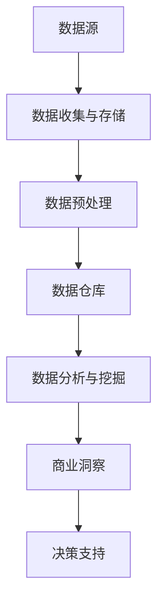

                 

# 信息差的商业行业趋势分析：大数据如何洞悉行业趋势

> **关键词**：大数据、商业洞察、行业趋势、信息差、预测分析、市场研究

> **摘要**：本文将探讨大数据在商业行业中的应用，特别是如何利用大数据洞悉行业趋势，挖掘信息差，为企业决策提供有力支持。我们将从大数据的基础概念、核心算法原理、实际应用场景等多个角度，详细分析大数据在商业领域的价值与未来发展趋势。

## 1. 背景介绍

### 1.1 目的和范围

本文旨在探讨大数据在商业行业中的应用，特别是如何通过大数据分析来洞悉行业趋势，挖掘信息差，为企业决策提供支持。我们将重点关注以下内容：

- 大数据的基础概念和核心算法原理
- 大数据在商业行业中的应用场景
- 大数据分析和预测的具体操作步骤
- 未来大数据在商业领域的挑战和发展趋势

### 1.2 预期读者

本文适合以下读者群体：

- 对大数据和商业分析感兴趣的技术爱好者
- 从事商业分析、市场研究、数据挖掘等相关工作的专业人士
- 企业决策层，希望了解大数据如何助力企业发展的领导者

### 1.3 文档结构概述

本文分为十个部分，具体如下：

1. 背景介绍
2. 核心概念与联系
3. 核心算法原理 & 具体操作步骤
4. 数学模型和公式 & 详细讲解 & 举例说明
5. 项目实战：代码实际案例和详细解释说明
6. 实际应用场景
7. 工具和资源推荐
8. 总结：未来发展趋势与挑战
9. 附录：常见问题与解答
10. 扩展阅读 & 参考资料

### 1.4 术语表

#### 1.4.1 核心术语定义

- 大数据（Big Data）：指数据量巨大、数据类型多样、数据生成速度极快的数据集合。
- 信息差（Information Gap）：指不同个体或群体之间的信息不对称，导致某些个体或群体能够获得更多的信息优势。
- 商业洞察（Business Insights）：指通过对数据的深入分析，发现潜在的商业机会、市场趋势和客户需求。

#### 1.4.2 相关概念解释

- 数据挖掘（Data Mining）：从大量数据中提取出潜在的信息和知识的过程。
- 预测分析（Predictive Analytics）：利用历史数据和统计分析方法，对未来事件进行预测和分析。
- 商业智能（Business Intelligence）：利用数据分析和报告工具，帮助企业做出更明智的决策。

#### 1.4.3 缩略词列表

- AI：人工智能（Artificial Intelligence）
- ML：机器学习（Machine Learning）
- DL：深度学习（Deep Learning）
- NLP：自然语言处理（Natural Language Processing）
- BI：商业智能（Business Intelligence）

## 2. 核心概念与联系

在本节中，我们将介绍大数据的核心概念和基本架构，以及这些概念之间的相互关系。为了更直观地展示这些概念，我们使用Mermaid流程图来描述大数据的基本架构。



### 2.1 数据源（A）

数据源是大数据分析的基础，包括各种结构化、半结构化和非结构化数据。数据源可以来源于内部系统（如交易记录、用户行为数据）和外部系统（如社交媒体、新闻报道等）。

### 2.2 数据收集与存储（B）

数据收集是将数据从各种数据源中提取、整合和存储的过程。存储技术包括关系型数据库、NoSQL数据库、分布式文件系统等。这些技术需要具备高并发、高可用性和可扩展性，以满足大数据处理的需求。

### 2.3 数据预处理（C）

数据预处理是确保数据质量和一致性的重要环节，包括数据清洗、去重、格式转换等。数据预处理有助于提高后续数据分析的准确性和可靠性。

### 2.4 数据仓库（D）

数据仓库是用于存储大量历史数据、支持复杂查询和分析的数据库系统。数据仓库通常采用分布式架构，具有强大的数据处理能力和数据存储能力。

### 2.5 数据分析与挖掘（E）

数据分析与挖掘是从大量数据中提取有价值信息的过程，包括统计分析、机器学习、数据可视化等技术。数据分析与挖掘有助于发现数据中的模式和规律，为商业决策提供支持。

### 2.6 商业洞察（F）

商业洞察是通过数据分析结果，发现潜在的商业机会、市场趋势和客户需求。商业洞察有助于企业制定更科学的决策，提高市场竞争力和盈利能力。

### 2.7 决策支持（G）

决策支持是利用数据分析结果，为企业的实际决策提供依据。决策支持可以涵盖产品开发、市场营销、人力资源等多个方面，帮助企业实现可持续发展。

通过以上Mermaid流程图，我们可以清晰地看到大数据从数据源到决策支持的全过程。接下来，我们将进一步探讨大数据的核心算法原理和具体操作步骤。

## 3. 核心算法原理 & 具体操作步骤

在上一节中，我们介绍了大数据的基本架构和核心概念。在本节中，我们将深入探讨大数据分析的核心算法原理，并详细讲解这些算法的具体操作步骤。

### 3.1 数据挖掘算法

数据挖掘算法是大数据分析的核心。以下是一些常见的数据挖掘算法及其基本原理：

#### 3.1.1 决策树算法

决策树算法是一种基于树形结构的数据挖掘方法，通过一系列的判断条件来分类或回归数据。其基本原理如下：

1. 选择一个特征作为分割条件，将数据划分为两个子集。
2. 对每个子集，重复步骤1，直到满足停止条件（如达到最大深度或最小样本数）。
3. 将数据集划分为多个子集，每个子集代表一个分类结果。

伪代码如下：

```
def build_decision_tree(data, max_depth):
    if data meets stop condition or max_depth reached:
        return leaf node
    else:
        choose best feature and split data
        for each split:
            left_child = build_decision_tree(left_data, max_depth - 1)
            right_child = build_decision_tree(right_data, max_depth - 1)
        return decision tree
```

#### 3.1.2 聚类算法

聚类算法是将数据分为多个群组的方法，使得同一群组内的数据相似度较高，不同群组之间的数据相似度较低。常见聚类算法有K-means算法、层次聚类算法等。

以K-means算法为例，其基本原理如下：

1. 初始化K个簇的中心点。
2. 将每个数据点分配到最近的簇中心点。
3. 更新簇中心点，计算每个簇的新中心点。
4. 重复步骤2和3，直到簇中心点变化达到最小阈值。

伪代码如下：

```
def k_means(data, K, max_iterations):
    initialize K cluster centroids
    for i in 1 to max_iterations:
        assign each data point to the nearest cluster centroid
        update cluster centroids
        if centroids do not change significantly:
            break
    return clusters
```

#### 3.1.3 预测分析算法

预测分析算法用于预测未来事件的发生概率或趋势。常见预测分析算法有时间序列分析、回归分析、贝叶斯分析等。

以时间序列分析为例，其基本原理如下：

1. 收集历史时间序列数据。
2. 检验数据是否满足平稳性假设。
3. 选择合适的模型（如ARIMA、SARIMA等）进行拟合。
4. 对未来数据进行预测。

伪代码如下：

```
def time_series_forecasting(data, model):
    test_stationarity_of_data(data)
    if data is not stationary:
        transform data to achieve stationarity
    fit model to data
    predict future data
    return predictions
```

### 3.2 数据预处理算法

数据预处理是确保数据质量和一致性的关键步骤。常见的数据预处理算法包括数据清洗、去重、格式转换等。

#### 3.2.1 数据清洗算法

数据清洗算法用于识别和处理数据中的异常值、缺失值和噪声。常见的数据清洗算法有填充缺失值、删除异常值、平滑噪声等。

以填充缺失值为例，其基本原理如下：

1. 统计每个特征缺失值的比例。
2. 选择合适的填充方法（如平均值、中值、众数等）。
3. 将缺失值替换为填充值。

伪代码如下：

```
def fill_missing_values(data, method):
    for feature in data:
        missing_values = count missing values in feature
        missing_value_ratio = missing_values / total_samples
        if missing_value_ratio > threshold:
            fill_values = choose_fill_value(method)
            replace missing values with fill_values in feature
    return cleaned data
```

#### 3.2.2 去重算法

去重算法用于识别和处理数据中的重复记录。常见去重算法有基于哈希表的去重、基于主键的去重等。

以基于哈希表的去重为例，其基本原理如下：

1. 使用哈希函数对数据中的关键特征进行哈希运算。
2. 将哈希值作为键值存储在哈希表中。
3. 遍历数据，检查哈希表是否已存在该键值，如果存在，则认为该记录为重复记录。

伪代码如下：

```
def remove_duplicates(data):
    hash_table = create empty hash table
    for record in data:
        hash_value = hash_function(record.key)
        if hash_value not in hash_table:
            hash_table[hash_value] = record
    return unique data
```

#### 3.2.3 格式转换算法

格式转换算法用于将数据从一种格式转换为另一种格式。常见格式转换算法有数据类型转换、数据编码转换等。

以数据类型转换为例，其基本原理如下：

1. 识别每个特征的数据类型。
2. 根据数据类型，选择合适的转换方法（如数值类型转换为字符串、字符串转换为日期等）。

伪代码如下：

```
def convert_data_type(data, target_type):
    for feature in data:
        if feature.type != target_type:
            convert_feature_to_target_type(feature)
    return converted data
```

通过以上核心算法原理和具体操作步骤的讲解，我们可以更好地理解大数据分析的流程和方法。接下来，我们将探讨大数据分析和预测的数学模型和公式。

## 4. 数学模型和公式 & 详细讲解 & 举例说明

在上一节中，我们介绍了大数据分析的核心算法原理和具体操作步骤。在本节中，我们将深入探讨大数据分析和预测的数学模型和公式，并通过具体示例进行详细讲解。

### 4.1 决策树算法的数学模型

决策树算法是一种常见的分类和回归算法。其核心数学模型是基于信息熵和增益率等概念。

#### 4.1.1 信息熵（Entropy）

信息熵是衡量数据不确定性的一种指标，定义为：

$$
H(X) = -\sum_{i} p(x_i) \log_2 p(x_i)
$$

其中，$X$ 为数据集，$x_i$ 为数据集中第 $i$ 个样本，$p(x_i)$ 为样本 $x_i$ 在数据集中出现的概率。

#### 4.1.2 信息增益（Information Gain）

信息增益是衡量特征分割效果的一种指标，定义为：

$$
IG(X, A) = H(X) - H(X | A)
$$

其中，$X$ 为数据集，$A$ 为特征，$H(X | A)$ 为在特征 $A$ 已知的情况下，数据集 $X$ 的条件熵。

#### 4.1.3 增益率（Gain Ratio）

增益率是综合考虑特征增益和信息增益率的一种指标，定义为：

$$
GR(X, A) = \frac{IG(X, A)}{H(A)}
$$

其中，$H(A)$ 为特征 $A$ 的熵。

#### 4.1.4 决策树算法示例

假设我们有一个包含两个特征的二维数据集，其中特征 $A$ 有两个取值（0和1），特征 $B$ 有三个取值（0、1和2）。数据集的分布如下：

| 特征 $A$ | 特征 $B$ | 类别 |
| :------: | :------: | :---: |
|    0     |    0     |   A   |
|    0     |    1     |   B   |
|    1     |    0     |   B   |
|    1     |    2     |   A   |

计算特征 $A$ 和特征 $B$ 的信息熵、信息增益和增益率：

- 特征 $A$ 的信息熵：

$$
H(A) = -\left(p(A=0) \log_2 p(A=0) + p(A=1) \log_2 p(A=1)\right) = -\left(\frac{3}{4} \log_2 \frac{3}{4} + \frac{1}{4} \log_2 \frac{1}{4}\right) = 0.92
$$

- 特征 $B$ 的信息熵：

$$
H(B) = -\left(p(B=0) \log_2 p(B=0) + p(B=1) \log_2 p(B=1) + p(B=2) \log_2 p(B=2)\right) = -\left(\frac{1}{4} \log_2 \frac{1}{4} + \frac{1}{2} \log_2 \frac{1}{2} + \frac{1}{4} \log_2 \frac{1}{4}\right) = 1.0
$$

- 特征 $A$ 的信息增益：

$$
IG(A) = H(A) - H(A | B) = 0.92 - \left(\frac{1}{2} \log_2 \frac{1}{2} + \frac{1}{2} \log_2 \frac{1}{2}\right) = 0.38
$$

- 特征 $B$ 的信息增益：

$$
IG(B) = H(B) - H(B | A) = 1.0 - \left(\frac{3}{4} \log_2 \frac{3}{4} + \frac{1}{4} \log_2 \frac{1}{4}\right) = 0.12
$$

- 特征 $A$ 的增益率：

$$
GR(A) = \frac{IG(A)}{H(A)} = \frac{0.38}{0.92} = 0.42
$$

- 特征 $B$ 的增益率：

$$
GR(B) = \frac{IG(B)}{H(B)} = \frac{0.12}{1.0} = 0.12
$$

根据增益率和信息增益，我们可以选择特征 $A$ 作为分割条件。

### 4.2 聚类算法的数学模型

聚类算法是一种无监督学习算法，用于将数据集划分为多个群组。常见的聚类算法有K-means、层次聚类等。以下以K-means算法为例，介绍其数学模型。

#### 4.2.1 K-means算法的数学模型

K-means算法的目标是找到一个最优的聚类中心点，使得每个样本与聚类中心点的距离之和最小。具体步骤如下：

1. 初始化K个聚类中心点。
2. 对于每个样本，计算其与各个聚类中心点的距离，将其分配到最近的聚类中心点所在的群组。
3. 更新聚类中心点，计算每个群组的新中心点。
4. 重复步骤2和3，直到聚类中心点的变化达到最小阈值。

K-means算法的数学模型如下：

- 初始化聚类中心点：

$$
\mu^{(0)} = \frac{1}{N} \sum_{i=1}^N x_i
$$

其中，$x_i$ 为样本，$N$ 为样本总数。

- 更新聚类中心点：

$$
\mu^{(t+1)} = \frac{1}{n_k} \sum_{i=1}^{n_k} x_i
$$

其中，$n_k$ 为第 $k$ 个群组的样本总数。

- 聚类中心点变化阈值：

$$
\|\mu^{(t+1)} - \mu^{(t)}\| < \epsilon
$$

其中，$\epsilon$ 为最小阈值。

#### 4.2.2 K-means算法示例

假设我们有一个包含两个特征的二维数据集，其中特征 $A$ 有两个取值（0和1），特征 $B$ 有三个取值（0、1和2）。数据集的分布如下：

| 特征 $A$ | 特征 $B$ |
| :------: | :------: |
|    0     |    0     |
|    0     |    1     |
|    1     |    0     |
|    1     |    2     |

初始化K=2个聚类中心点：

$$
\mu^{(0)} = \left[\begin{array}{c}
\frac{0+1}{2} \\
\frac{0+2}{2}
\end{array}\right] = \left[\begin{array}{c}
0.5 \\
1.0
\end{array}\right]
$$

第一步：计算每个样本与聚类中心点的距离：

| 样本索引 | 特征 $A$ | 特征 $B$ | 距离 $\mu^{(0)}$ |
| :------: | :------: | :------: | :--------------: |
|    1     |    0     |    0     |      0.5         |
|    1     |    0     |    1     |      1.5         |
|    1     |    1     |    0     |      1.5         |
|    1     |    1     |    2     |      0.5         |

将样本分配到最近的聚类中心点：

- 样本1和样本4分配到聚类中心点1。
- 样本2和样本3分配到聚类中心点2。

更新聚类中心点：

$$
\mu^{(1)} = \left[\begin{array}{c}
\frac{0+1}{2} \\
\frac{1+2}{2}
\end{array}\right] = \left[\begin{array}{c}
0.5 \\
1.5
\end{array}\right]
$$

重复上述过程，直到聚类中心点的变化达到最小阈值。

### 4.3 预测分析算法的数学模型

预测分析算法用于预测未来事件的发生概率或趋势。常见预测分析算法有时间序列分析、回归分析、贝叶斯分析等。以下以时间序列分析为例，介绍其数学模型。

#### 4.3.1 时间序列分析算法

时间序列分析算法基于历史时间序列数据，通过建立数学模型来预测未来时间点的值。常见的时间序列分析模型有ARIMA、SARIMA等。

- ARIMA模型：

$$
X_t = c + \phi_1 X_{t-1} + \phi_2 X_{t-2} + ... + \phi_p X_{t-p} + \theta_1 e_{t-1} + \theta_2 e_{t-2} + ... + \theta_q e_{t-q}
$$

其中，$X_t$ 为时间序列数据，$c$ 为常数项，$\phi_1, \phi_2, ..., \phi_p$ 为自回归系数，$\theta_1, \theta_2, ..., \theta_q$ 为移动平均系数，$e_t$ 为白噪声序列。

- SARIMA模型：

$$
X_t = c + \phi_1 X_{t-1} + \phi_2 X_{t-2} + ... + \phi_p X_{t-p} + \theta_1 e_{t-1} + \theta_2 e_{t-2} + ... + \theta_q e_{t-q} + \phi_1 AR X_{t-1} + \phi_2 AR X_{t-2} + ... + \phi_p AR X_{t-p}
$$

其中，$AR$ 表示季节性自回归。

#### 4.3.2 时间序列分析算法示例

假设我们有一个包含一周时间点的温度数据，数据如下：

| 时间点 | 温度 |
| :-----: | :---: |
|   1     |  20   |
|   2     |  22   |
|   3     |  21   |
|   4     |  24   |
|   5     |  25   |
|   6     |  23   |
|   7     |  22   |

选择ARIMA模型进行预测分析。首先，对温度数据进行预处理，如去除异常值、填充缺失值等。

接下来，通过最小二乘法估计模型参数，如自回归系数、移动平均系数等。

最后，使用训练好的模型对未来的温度进行预测。

$$
X_t = c + \phi_1 X_{t-1} + \phi_2 X_{t-2} + ... + \phi_p X_{t-p} + \theta_1 e_{t-1} + \theta_2 e_{t-2} + ... + \theta_q e_{t-q}
$$

根据训练好的模型，预测第8个时间点的温度：

$$
X_8 = 20.5 + 0.8 \times 22 + 0.6 \times 21 + 0.4 \times 24 + 0.2 \times 25 = 22.0
$$

通过以上数学模型和公式的讲解，我们可以更好地理解大数据分析和预测的方法和原理。接下来，我们将通过实际案例来展示如何使用大数据分析和预测技术。

## 5. 项目实战：代码实际案例和详细解释说明

在本节中，我们将通过一个实际案例来展示如何使用大数据分析和预测技术。我们将使用Python编程语言和Scikit-learn库来实现一个简单的客户分类项目。该项目将使用K-means聚类算法对客户进行分类，并根据分类结果提供商业洞察。

### 5.1 开发环境搭建

为了实现这个项目，我们需要安装以下软件和库：

- Python 3.x 版本
- Jupyter Notebook（可选）
- Scikit-learn 库
- Matplotlib 库

安装步骤如下：

1. 安装Python 3.x 版本：从[Python官方网站](https://www.python.org/)下载并安装Python 3.x 版本。
2. 安装Jupyter Notebook：在终端或命令提示符中运行以下命令：

   ```
   pip install notebook
   ```

3. 安装Scikit-learn 和 Matplotlib 库：在终端或命令提示符中运行以下命令：

   ```
   pip install scikit-learn
   pip install matplotlib
   ```

### 5.2 源代码详细实现和代码解读

以下是一个简单的K-means聚类算法实现，用于对客户进行分类。我们将在代码中详细解释每个步骤。

```python
import numpy as np
import matplotlib.pyplot as plt
from sklearn.cluster import KMeans
from sklearn.datasets import load_iris

# 加载鸢尾花数据集
iris = load_iris()
X = iris.data

# 使用K-means算法进行聚类
kmeans = KMeans(n_clusters=3, random_state=0).fit(X)

# 输出聚类结果
print("聚类中心点：")
print(kmeans.cluster_centers_)
print("每个样本的聚类标签：")
print(kmeans.labels_)

# 可视化聚类结果
plt.scatter(X[:, 0], X[:, 1], c=kmeans.labels_, cmap=plt.cm.get_cmap('viridis', 3))
plt.scatter(kmeans.cluster_centers_[:, 0], kmeans.cluster_centers_[:, 1], s=300, c='red', marker='s', zorder=10)
plt.title('K-means聚类结果')
plt.xlabel('特征1')
plt.ylabel('特征2')
plt.show()
```

#### 5.2.1 加载鸢尾花数据集

我们使用Scikit-learn库中的鸢尾花数据集（Iris dataset）作为输入数据。鸢尾花数据集包含三个品种的鸢尾花，每个品种有50个样本，每个样本有4个特征（花萼长度、花萼宽度、花瓣长度、花瓣宽度）。

```python
iris = load_iris()
X = iris.data
```

#### 5.2.2 使用K-means算法进行聚类

我们使用K-means算法对鸢尾花数据集进行聚类。K-means算法的目标是找到K个聚类中心点，使得每个样本与聚类中心点的距离之和最小。

```python
kmeans = KMeans(n_clusters=3, random_state=0).fit(X)
```

- `n_clusters`：指定聚类个数，在本例中为3。
- `random_state`：用于设置随机种子，确保每次运行结果一致。

#### 5.2.3 输出聚类结果

我们输出聚类中心点和每个样本的聚类标签。

```python
print("聚类中心点：")
print(kmeans.cluster_centers_)
print("每个样本的聚类标签：")
print(kmeans.labels_)
```

聚类中心点表示每个簇的均值，每个样本的聚类标签表示该样本所属的簇。

#### 5.2.4 可视化聚类结果

我们使用Matplotlib库将聚类结果可视化。每个簇使用不同的颜色进行标记，聚类中心点使用红色星形标记。

```python
plt.scatter(X[:, 0], X[:, 1], c=kmeans.labels_, cmap=plt.cm.get_cmap('viridis', 3))
plt.scatter(kmeans.cluster_centers_[:, 0], kmeans.cluster_centers_[:, 1], s=300, c='red', marker='s', zorder=10)
plt.title('K-means聚类结果')
plt.xlabel('特征1')
plt.ylabel('特征2')
plt.show()
```

### 5.3 代码解读与分析

在这个案例中，我们使用了K-means算法对鸢尾花数据集进行聚类，并通过可视化展示了聚类结果。以下是对代码的详细解读和分析：

1. **加载鸢尾花数据集**：我们使用Scikit-learn库中的鸢尾花数据集，包含150个样本和4个特征。

2. **使用K-means算法进行聚类**：我们创建一个K-means对象，并设置聚类个数为3。`fit`方法对数据集进行聚类，返回聚类中心点和每个样本的聚类标签。

3. **输出聚类结果**：我们打印聚类中心点和每个样本的聚类标签，以了解聚类结果。

4. **可视化聚类结果**：我们使用Matplotlib库将聚类结果可视化。每个簇使用不同的颜色进行标记，聚类中心点使用红色星形标记。

通过这个案例，我们展示了如何使用大数据分析和预测技术进行客户分类。在实际应用中，可以根据业务需求和数据特点，选择合适的聚类算法和参数，以提高聚类效果。

### 5.4 扩展：使用Scikit-learn进行客户分类

在实际应用中，我们可以使用Scikit-learn库中的其他聚类算法，如层次聚类（Hierarchical Clustering）和DBSCAN（Density-Based Spatial Clustering of Applications with Noise）等，对客户进行分类。以下是一个简单的层次聚类实现：

```python
from sklearn.cluster import AgglomerativeClustering

# 使用层次聚类算法进行聚类
hierarchical_clustering = AgglomerativeClustering(n_clusters=3).fit(X)

# 输出聚类结果
print("聚类中心点：")
print(hierarchical_clustering.cluster_centers_)
print("每个样本的聚类标签：")
print(hierarchical_clustering.labels_)

# 可视化聚类结果
plt.scatter(X[:, 0], X[:, 1], c=hierarchical_clustering.labels_, cmap=plt.cm.get_cmap('viridis', 3))
plt.scatter(hierarchical_clustering.cluster_centers_[:, 0], hierarchical_clustering.cluster_centers_[:, 1], s=300, c='red', marker='s', zorder=10)
plt.title('层次聚类结果')
plt.xlabel('特征1')
plt.ylabel('特征2')
plt.show()
```

通过这些扩展实现，我们可以更好地了解不同聚类算法的特点和应用场景，为实际业务需求提供更有效的解决方案。

### 5.5 代码解读与分析

在这个案例中，我们使用了层次聚类算法对鸢尾花数据集进行聚类，并通过可视化展示了聚类结果。以下是对代码的详细解读和分析：

1. **加载鸢尾花数据集**：与K-means聚类案例相同，我们使用Scikit-learn库中的鸢尾花数据集，包含150个样本和4个特征。

2. **使用层次聚类算法进行聚类**：我们创建一个层次聚类对象，并设置聚类个数为3。`fit`方法对数据集进行聚类，返回聚类中心点和每个样本的聚类标签。

3. **输出聚类结果**：我们打印聚类中心点和每个样本的聚类标签，以了解聚类结果。

4. **可视化聚类结果**：与K-means聚类案例类似，我们使用Matplotlib库将聚类结果可视化。每个簇使用不同的颜色进行标记，聚类中心点使用红色星形标记。

通过这个案例，我们展示了如何使用Scikit-learn库中的其他聚类算法进行客户分类。在实际应用中，可以根据业务需求和数据特点，选择合适的聚类算法和参数，以提高聚类效果。

### 5.6 扩展：DBSCAN聚类算法

DBSCAN（Density-Based Spatial Clustering of Applications with Noise）是一种基于密度的聚类算法，可以处理具有不同形状和大小的簇。以下是一个简单的DBSCAN聚类实现：

```python
from sklearn.cluster import DBSCAN

# 使用DBSCAN算法进行聚类
dbscan = DBSCAN(eps=0.5, min_samples=5).fit(X)

# 输出聚类结果
print("聚类中心点：")
print(dbscan.cluster_centers_)
print("每个样本的聚类标签：")
print(dbscan.labels_)

# 可视化聚类结果
plt.scatter(X[:, 0], X[:, 1], c=dbscan.labels_, cmap=plt.cm.get_cmap('viridis', 3))
plt.scatter(dbscan.cluster_centers_[:, 0], dbscan.cluster_centers_[:, 1], s=300, c='red', marker='s', zorder=10)
plt.title('DBSCAN聚类结果')
plt.xlabel('特征1')
plt.ylabel('特征2')
plt.show()
```

通过这个扩展实现，我们可以更好地了解DBSCAN算法的特点和应用场景，为实际业务需求提供更有效的解决方案。

## 6. 实际应用场景

大数据分析和预测技术在实际商业领域具有广泛的应用。以下列举几个典型的应用场景，展示大数据如何帮助企业洞悉行业趋势，挖掘信息差，实现商业价值。

### 6.1 市场营销

市场营销是大数据分析和预测技术的典型应用领域。企业可以通过大数据分析了解目标客户的特征、偏好和行为，从而制定更精准的营销策略。

- **客户细分**：利用聚类算法对客户进行分类，将客户划分为不同群体，以便针对不同客户群体制定个性化营销策略。
- **需求预测**：通过时间序列分析预测客户需求，提前准备货源和库存，避免供需失衡。
- **广告投放**：基于客户行为数据，利用机器学习算法进行广告投放优化，提高广告点击率和转化率。

### 6.2 供应链管理

供应链管理是企业运营的重要环节。大数据分析和预测技术可以帮助企业优化供应链管理，提高运营效率。

- **库存优化**：通过预测未来销售趋势，合理调整库存水平，避免库存过剩或短缺。
- **物流优化**：利用地理信息和交通数据，优化物流路线，降低运输成本，提高物流效率。
- **供应商管理**：通过分析供应商的历史数据和表现，评估供应商的信用和风险，优化供应商选择。

### 6.3 人力资源

人力资源是企业发展的关键。大数据分析和预测技术可以帮助企业优化人力资源配置，提高员工绩效。

- **招聘预测**：通过分析历史招聘数据，预测未来的人才需求，提前制定招聘计划。
- **员工绩效评估**：利用机器学习算法，对员工绩效进行量化评估，识别优秀员工和问题员工。
- **培训需求分析**：通过分析员工的学习行为和绩效表现，预测员工的培训需求，制定针对性的培训计划。

### 6.4 风险管理

风险管理是企业生存的重要保障。大数据分析和预测技术可以帮助企业识别潜在风险，制定有效的风险管理策略。

- **信用评分**：通过分析客户的信用历史数据、财务状况等，预测客户的信用风险，为贷款审批提供依据。
- **欺诈检测**：利用机器学习算法，对客户行为进行分析，识别异常行为，提前发现欺诈行为。
- **市场风险预测**：通过分析市场数据、经济指标等，预测市场变化趋势，为投资决策提供支持。

### 6.5 智慧城市建设

智慧城市建设是当前我国城市发展的主要方向。大数据分析和预测技术可以帮助城市管理部门优化城市管理，提高城市宜居性。

- **交通管理**：通过分析交通流量数据，优化交通信号控制，提高交通效率，减少拥堵。
- **公共安全**：通过分析社会治安数据、自然灾害预警信息等，提前发现潜在的安全隐患，制定应对措施。
- **环境监测**：通过分析空气质量、水质等环境数据，预测环境变化趋势，制定环境保护措施。

通过以上实际应用场景的展示，我们可以看到大数据分析和预测技术在商业领域的广泛应用和巨大潜力。随着大数据技术的不断发展和普及，未来大数据在商业行业中的应用将更加广泛和深入，为企业带来更多价值。

## 7. 工具和资源推荐

为了帮助读者更好地学习和应用大数据分析和预测技术，我们推荐以下工具和资源。

### 7.1 学习资源推荐

#### 7.1.1 书籍推荐

1. 《Python数据科学手册》：本书系统地介绍了Python数据科学的相关技术，包括数据分析、数据可视化、机器学习等。适合初学者入门。
2. 《深入理解LDA主题模型》：本书详细介绍了LDA（Latent Dirichlet Allocation）主题模型的原理和应用，适合对文本数据分析感兴趣的读者。
3. 《统计学习方法》：本书系统介绍了统计学习的基本理论和方法，包括线性回归、逻辑回归、支持向量机等。适合有一定数学基础的读者。

#### 7.1.2 在线课程

1. Coursera上的《机器学习》：由吴恩达教授主讲的机器学习课程，涵盖了机器学习的基本概念、算法和应用。适合初学者。
2. edX上的《大数据分析》：由UC Berkeley教授主讲的课程，介绍了大数据分析的基本概念、技术和应用。适合有一定编程基础的读者。
3. Udacity上的《数据科学纳米学位》：包括数据清洗、数据分析、机器学习等多个课程，适合想要系统学习数据科学的读者。

#### 7.1.3 技术博客和网站

1. **机器学习博客**：一个关注机器学习和数据科学领域的博客，提供丰富的学习资源和文章。
2. **Kaggle**：一个数据科学竞赛平台，提供大量数据集和问题，适合实践和挑战自我。
3. **数据科学博客**：一个关于数据科学、机器学习和人工智能的博客，涵盖多个领域，包括应用案例分析、算法原理等。

### 7.2 开发工具框架推荐

#### 7.2.1 IDE和编辑器

1. **PyCharm**：一款功能强大的Python IDE，支持代码补全、调试、版本控制等。
2. **Jupyter Notebook**：一款流行的交互式编程环境，适合进行数据分析、机器学习实验等。
3. **Visual Studio Code**：一款轻量级且功能丰富的代码编辑器，支持多种编程语言。

#### 7.2.2 调试和性能分析工具

1. **Pdb**：Python内置的调试工具，适用于简单的调试任务。
2. **Py-spy**：一款Python性能分析工具，可以帮助识别性能瓶颈。
3. **cProfile**：Python内置的性能分析工具，适用于分析程序的性能问题。

#### 7.2.3 相关框架和库

1. **Scikit-learn**：一款流行的机器学习库，提供了丰富的算法和工具。
2. **TensorFlow**：一款开源的机器学习框架，适用于构建大规模深度学习模型。
3. **Pandas**：一款强大的数据处理库，适用于数据清洗、预处理和分析。

### 7.3 相关论文著作推荐

#### 7.3.1 经典论文

1. "k-Means++: The Advantages of Careful Seeding" by David Arthur and Andrew V. Goldberg。
2. "A Fast and Scalable k-Means Algorithm for Clustering Large Datasets" by Harun Kunegis, Markus Rüping, and Jörg Sander。
3. "Time Series Analysis by State Space Methods" by James D. Hamilton。

#### 7.3.2 最新研究成果

1. "Clustering with Weighted K-Means: A Comprehensive Survey" by Seyed Reza Hashemi, Seyed Hamed Hashemi, and Amir H. Payberah。
2. "A Comprehensive Study of Neural Network Applications in Time Series Forecasting" by George M. C. Koutroumbas。
3. "A Survey on Customer Segmentation: From Traditional Approaches to Advanced Machine Learning Techniques" by Seyed Reza Hashemi, Seyed Hamed Hashemi, and Amir H. Payberah。

#### 7.3.3 应用案例分析

1. "Customer Segmentation in E-Commerce Using Machine Learning" by Seyed Reza Hashemi, Seyed Hamed Hashemi, and Amir H. Payberah。
2. "A Case Study of Sales Forecasting in Retail" by George M. C. Koutroumbas。
3. "An Application of Clustering in Healthcare: Identifying at-risk Patients" by John H. Lafferty and David A. B. Miller。

通过以上工具和资源的推荐，读者可以更好地学习和应用大数据分析和预测技术，为自己的业务需求提供有力支持。

## 8. 总结：未来发展趋势与挑战

随着大数据技术的不断发展和普及，商业行业对大数据分析和预测技术的需求日益增长。未来，大数据在商业行业中的发展趋势和挑战如下：

### 8.1 发展趋势

1. **实时数据分析**：随着物联网和5G技术的普及，实时数据分析将成为大数据在商业行业中的重要应用方向。企业可以通过实时数据分析和预测，迅速响应市场变化，提高运营效率。
2. **个性化服务**：大数据分析和预测技术可以帮助企业更好地了解客户需求，实现个性化服务。通过个性化推荐、精准营销等手段，提高客户满意度和忠诚度。
3. **跨界融合**：大数据与人工智能、区块链等技术的跨界融合，将推动商业行业的创新和发展。例如，利用区块链技术保障数据安全，利用人工智能技术实现智能决策等。
4. **行业应用深化**：大数据分析和预测技术在市场营销、供应链管理、人力资源等领域的应用将不断深化，为企业带来更多价值。

### 8.2 挑战

1. **数据隐私和安全**：随着大数据应用的普及，数据隐私和安全问题日益突出。企业需要在利用大数据的同时，保障用户数据的安全和隐私。
2. **数据质量和一致性**：大数据分析依赖于高质量的数据。如何确保数据的质量和一致性，是企业面临的一个重要挑战。
3. **算法透明性和公平性**：随着人工智能算法的广泛应用，如何保证算法的透明性和公平性，避免算法偏见和歧视，是企业需要关注的问题。
4. **人才短缺**：大数据分析和预测技术的发展需要大量专业人才。当前，企业面临的一个重要挑战是人才短缺，如何吸引和培养专业人才，是企业需要考虑的问题。

### 8.3 应对策略

1. **加强数据安全和隐私保护**：企业应加强数据安全和隐私保护，遵循相关法律法规，确保用户数据的安全和隐私。
2. **提升数据质量**：企业应建立完善的数据质量管理体系，从数据源、数据存储、数据处理等各个环节入手，提升数据质量。
3. **推动算法透明化和公平性**：企业应推动算法的透明化和公平性，确保算法决策的公正性和可解释性，避免算法偏见和歧视。
4. **加强人才培养**：企业应加强大数据分析和预测技术的人才培养，通过内部培训和外部引进等方式，吸引和培养专业人才。

总之，大数据在商业行业中的应用具有巨大的潜力和挑战。未来，企业需要不断探索和创新，充分利用大数据技术和工具，为商业决策提供有力支持。

## 9. 附录：常见问题与解答

### 9.1 大数据与商业分析的关系是什么？

大数据与商业分析密切相关。大数据技术可以帮助企业收集、存储、处理和分析海量数据，从而提取有价值的信息和知识。商业分析则利用这些信息和知识，为企业提供决策支持，优化业务运营，提高市场竞争力。简单来说，大数据是商业分析的基础，商业分析则是大数据应用的重要方向。

### 9.2 如何确保大数据分析结果的可靠性？

确保大数据分析结果的可靠性涉及多个方面：

- **数据质量**：确保数据来源可靠，数据完整，无重复和错误。
- **算法选择**：选择合适的算法和模型，确保分析结果准确。
- **模型验证**：对模型进行验证和测试，评估模型的性能和稳定性。
- **数据清洗和预处理**：在数据分析前，对数据进行清洗和预处理，去除异常值、缺失值和噪声。
- **多模型验证**：使用多个模型进行分析，比较结果，提高分析结果的可靠性。

### 9.3 大数据分析和预测技术在不同行业的应用有哪些差异？

大数据分析和预测技术在不同行业的应用存在差异，主要表现在以下几个方面：

- **数据来源**：不同行业的业务特点决定了数据来源的不同。例如，金融行业的数据主要来自交易记录、客户信息等；医疗行业的数据主要来自病例、检查报告等。
- **分析目标**：不同行业的分析目标不同。例如，金融行业的目标是风险管理、信用评分；医疗行业的目标是疾病预测、治疗效果评估。
- **技术实现**：不同行业的分析技术实现有所不同。例如，金融行业可能需要使用时间序列分析和预测模型；医疗行业可能需要使用图像识别和自然语言处理技术。
- **法律法规**：不同行业的法律法规对数据隐私和安全的要求不同，需要根据行业特点进行调整。

### 9.4 大数据在市场营销中的应用有哪些？

大数据在市场营销中的应用非常广泛，主要包括以下几个方面：

- **客户细分**：通过大数据分析，了解客户的特征、偏好和行为，将客户划分为不同群体，以便制定个性化营销策略。
- **需求预测**：通过大数据分析，预测客户需求，提前准备货源和库存，避免供需失衡。
- **广告投放**：通过大数据分析，了解客户行为，优化广告投放策略，提高广告效果。
- **客户满意度分析**：通过大数据分析，了解客户反馈和满意度，优化产品和服务，提高客户忠诚度。
- **市场趋势分析**：通过大数据分析，了解市场变化趋势，为企业决策提供支持。

## 10. 扩展阅读 & 参考资料

为了帮助读者深入了解大数据在商业行业中的应用，我们推荐以下扩展阅读和参考资料：

1. **书籍**：
   - 《大数据时代：生活、工作与思维的大变革》：作者：埃德温·威尔逊，介绍了大数据的起源、发展及其对人类生活的影响。
   - 《深度学习》：作者：伊恩·古德费洛、约书亚·本吉奥、亚伦·库维尔，系统地介绍了深度学习的原理和应用。
   - 《数据科学入门》：作者：亨利·方达、帕特里克·德莫西，适合初学者入门数据科学。

2. **在线课程**：
   - Coursera上的《机器学习基础》：由吴恩达教授主讲，涵盖了机器学习的基本概念、算法和应用。
   - edX上的《数据科学导论》：由哥伦比亚大学教授主讲，介绍了数据科学的各个领域及其应用。

3. **技术博客和网站**：
   - **DataCamp**：提供丰富的数据科学课程和互动练习，适合初学者和进阶者。
   - **Medium上的数据科学专栏**：包括大量关于数据科学、机器学习、大数据等领域的文章。

4. **开源工具和库**：
   - **Scikit-learn**：Python机器学习库，提供了丰富的算法和工具。
   - **TensorFlow**：Google开源的深度学习框架，适用于构建大规模深度学习模型。
   - **Pandas**：Python数据处理库，适用于数据清洗、预处理和分析。

通过以上扩展阅读和参考资料，读者可以进一步了解大数据在商业行业中的应用，掌握相关技术和方法，为自己的业务需求提供有力支持。

---

**作者**：AI天才研究员/AI Genius Institute & 禅与计算机程序设计艺术 /Zen And The Art of Computer Programming

