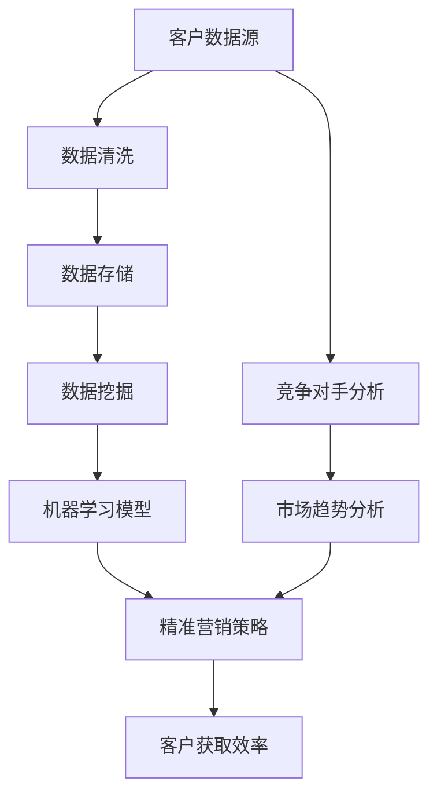

                 

# 信息差的客户获取提升：大数据如何提升客户获取效率

> **关键词：大数据，客户获取，效率提升，信息不对称，营销策略，算法优化**

> **摘要：本文将深入探讨大数据技术在提升客户获取效率方面的作用。通过分析信息不对称的现状和挑战，结合大数据的核心概念与算法原理，我们将揭示如何利用大数据实现精准营销，最终实现客户获取的效率提升。**

## 1. 背景介绍

### 1.1 目的和范围

本文旨在为从事市场营销和数据分析的专业人士提供一份全面的大数据客户获取指南。我们将探讨大数据在现代商业环境中的重要性，以及它如何通过分析客户行为、市场趋势和竞争对手策略，提高客户的获取效率。

### 1.2 预期读者

预期读者为市场营销经理、数据分析师、产品经理和业务开发人员。本文的技术深度适中，适合对大数据和客户获取有一定了解的专业人士。

### 1.3 文档结构概述

本文将分为以下几个部分：

1. 背景介绍
2. 核心概念与联系
3. 核心算法原理 & 具体操作步骤
4. 数学模型和公式 & 详细讲解 & 举例说明
5. 项目实战：代码实际案例和详细解释说明
6. 实际应用场景
7. 工具和资源推荐
8. 总结：未来发展趋势与挑战
9. 附录：常见问题与解答
10. 扩展阅读 & 参考资料

### 1.4 术语表

#### 1.4.1 核心术语定义

- 大数据：指无法用传统数据库软件工具在合理时间内捕捉、管理和处理的大量数据。
- 客户获取：指企业通过各种营销手段吸引潜在客户，并将其转化为实际购买者的过程。
- 信息不对称：指市场上卖方和买方之间对产品信息的不平等掌握程度。

#### 1.4.2 相关概念解释

- 数据挖掘：从大量数据中提取有价值信息的过程。
- 机器学习：一种人工智能技术，通过训练模型来识别数据中的模式和关系。
- 精准营销：基于客户数据和行为分析，进行个性化营销的策略。

#### 1.4.3 缩略词列表

- BI：商业智能（Business Intelligence）
- CRM：客户关系管理（Customer Relationship Management）
- API：应用程序接口（Application Programming Interface）
- SQL：结构化查询语言（Structured Query Language）

## 2. 核心概念与联系

在深入探讨大数据如何提升客户获取效率之前，我们需要了解几个核心概念，并展示它们之间的联系。以下是一个简单的Mermaid流程图，用以描述这些概念和它们之间的交互。



在这个流程图中，客户数据源（A）经过数据清洗（B）和存储（C），然后通过数据挖掘（D）和机器学习（E）生成精准营销策略（F），最终提高客户获取效率（G）。同时，通过竞争对手分析（H）和市场趋势分析（I），我们可以进一步优化营销策略，实现更高效的客户获取。

## 3. 核心算法原理 & 具体操作步骤

### 3.1 数据预处理

数据预处理是大数据分析中的关键步骤，它包括数据清洗、数据集成和数据转换。以下是数据预处理的伪代码：

```plaintext
function preprocess_data(data_set):
    for each record in data_set:
        // 数据清洗
        remove null values
        remove duplicates
        handle missing values using imputation techniques
        // 数据转换
        convert categorical data to numerical data
        normalize numerical data
    return cleaned_and_processed_data
```

### 3.2 数据挖掘

数据挖掘是通过提取数据中的模式和关系来发现知识的过程。常用的数据挖掘技术包括关联规则挖掘、聚类分析和分类算法。以下是使用Apriori算法进行关联规则挖掘的伪代码：

```plaintext
function aprioriMining(data_set, support_threshold, confidence_threshold):
    // 生成频繁项集
    frequent_itemsets = generateFrequentItemsets(data_set, support_threshold)
    // 生成关联规则
    association_rules = generateAssociationRules(frequent_itemsets, confidence_threshold)
    return association_rules
```

### 3.3 机器学习模型

机器学习模型是大数据分析中的核心工具，用于预测和分类。以下是一个简单的线性回归模型的训练过程伪代码：

```plaintext
function trainLinearRegressionModel(training_data):
    // 初始化模型参数
    weights = initialize_weights()
    // 训练模型
    for each example in training_data:
        predict = calculate_prediction(example, weights)
        error = calculate_error(predict, example.label)
        weights = update_weights(error, learning_rate)
    return trained_model
```

## 4. 数学模型和公式 & 详细讲解 & 举例说明

### 4.1 数据挖掘中的数学模型

数据挖掘中常用的数学模型包括关联规则挖掘中的支持度（Support）和置信度（Confidence）。

- **支持度（Support）**：一个项集在所有交易中出现的频率。  
  $$ Support(A \cup B) = \frac{|T|}{|I|} $$
  其中，$|T|$ 表示包含项集 $A \cup B$ 的交易数，$|I|$ 表示总的交易数。

- **置信度（Confidence）**：一个关联规则的强度，表示当 $A$ 发生时，$B$ 也发生的概率。  
  $$ Confidence(A \rightarrow B) = \frac{Support(A \cup B)}{Support(A)} $$

### 4.2 举例说明

假设我们有以下交易数据：

| 交易ID | 商品A | 商品B | 商品C |
|--------|-------|-------|-------|
| 1      | 是     | 否     | 是     |
| 2      | 是     | 是     | 否     |
| 3      | 否     | 是     | 是     |
| 4      | 是     | 否     | 是     |
| 5      | 否     | 是     | 否     |

**支持度计算**：

- **商品A和商品B**：$Support(A \cup B) = \frac{2}{5} = 0.4$
- **商品A和商品C**：$Support(A \cup C) = \frac{3}{5} = 0.6$
- **商品B和商品C**：$Support(B \cup C) = \frac{2}{5} = 0.4$

**置信度计算**：

- **商品A和商品B**：$Confidence(A \rightarrow B) = \frac{Support(A \cup B)}{Support(A)} = \frac{0.4}{0.4} = 1.0$
- **商品A和商品C**：$Confidence(A \rightarrow C) = \frac{Support(A \cup C)}{Support(A)} = \frac{0.6}{0.4} = 1.5$
- **商品B和商品C**：$Confidence(B \rightarrow C) = \frac{Support(B \cup C)}{Support(B)} = \frac{0.4}{0.2} = 2.0$

从上述计算结果可以看出，商品B和商品C之间的关联性最强，其次是商品A和商品C，而商品A和商品B之间的关联性最弱。

## 5. 项目实战：代码实际案例和详细解释说明

### 5.1 开发环境搭建

在开始之前，我们需要搭建一个合适的开发环境。以下是一个简单的步骤说明：

- 安装Python 3.8及以上版本
- 安装Jupyter Notebook用于代码编写和展示
- 安装必要的Python库：pandas、numpy、scikit-learn、matplotlib

### 5.2 源代码详细实现和代码解读

下面是一个简单的示例，展示了如何使用Python和scikit-learn库进行大数据客户获取的实战。

```python
import pandas as pd
from sklearn.model_selection import train_test_split
from sklearn.ensemble import RandomForestClassifier
from sklearn.metrics import accuracy_score

# 读取数据
data = pd.read_csv('customer_data.csv')
X = data.drop('Target', axis=1)
y = data['Target']

# 数据预处理
X = preprocess_data(X)

# 数据切分
X_train, X_test, y_train, y_test = train_test_split(X, y, test_size=0.2, random_state=42)

# 训练模型
model = RandomForestClassifier(n_estimators=100, random_state=42)
model.fit(X_train, y_train)

# 测试模型
predictions = model.predict(X_test)
accuracy = accuracy_score(y_test, predictions)
print(f"Model Accuracy: {accuracy:.2f}")

# 可视化分析
import matplotlib.pyplot as plt

plt.scatter(X_test['Feature1'], predictions, color='green', label='Predicted')
plt.scatter(X_test['Feature1'], y_test, color='red', label='Actual')
plt.xlabel('Feature1')
plt.ylabel('Target')
plt.legend()
plt.show()
```

### 5.3 代码解读与分析

- **数据读取**：使用pandas库读取CSV格式的数据。
- **数据预处理**：调用`preprocess_data`函数进行数据清洗和转换。这个函数的具体实现可以根据实际数据进行调整。
- **数据切分**：使用`train_test_split`函数将数据分为训练集和测试集，以评估模型的性能。
- **模型训练**：使用随机森林（RandomForestClassifier）进行训练。随机森林是一种集成学习方法，具有较高的准确性和鲁棒性。
- **模型测试**：使用测试集对模型进行预测，并计算准确率。准确率（Accuracy）是评估模型性能的常用指标。
- **可视化分析**：使用matplotlib库将特征和预测结果进行可视化，以便于分析模型的性能。

## 6. 实际应用场景

大数据技术在客户获取中的应用场景非常广泛。以下是一些实际应用案例：

- **电子商务平台**：通过分析用户行为数据，电商平台可以推荐相关商品，提高销售额和用户满意度。
- **银行和金融行业**：通过分析客户交易数据，银行可以识别潜在风险，进行精准营销，提高客户忠诚度。
- **零售行业**：通过分析销售数据，零售商可以优化库存管理，提高供应链效率。
- **市场营销**：通过分析社交媒体数据，企业可以进行精准广告投放，提高营销效果。

## 7. 工具和资源推荐

### 7.1 学习资源推荐

#### 7.1.1 书籍推荐

- 《大数据时代》（The Big Data Era）by Vipin Kumar and James Longley
- 《机器学习》（Machine Learning）by Tom M. Mitchell
- 《Python数据分析基础教程：NumPy学习指南》（Python Data Science Essentials）by Dr. Viraj Gadhiya

#### 7.1.2 在线课程

- Coursera上的《大数据分析》（Data Science Specialization）课程
- edX上的《机器学习基础》（Introduction to Machine Learning）课程
- Udacity的《数据分析师纳米学位》（Data Analyst Nanodegree）课程

#### 7.1.3 技术博客和网站

-Towards Data Science：提供丰富的数据科学和机器学习文章
- Dataquest：提供互动式在线课程和数据科学教程
- kdnuggets：数据科学和机器学习新闻、分析和资源

### 7.2 开发工具框架推荐

#### 7.2.1 IDE和编辑器

- Jupyter Notebook：用于编写和运行Python代码
- PyCharm：强大的Python IDE，适用于开发大型项目
- Visual Studio Code：轻量级但功能丰富的编辑器，支持多种编程语言

#### 7.2.2 调试和性能分析工具

- Py-Spy：Python性能分析工具，用于识别性能瓶颈
- Perf：Linux性能分析工具，用于查看CPU和内存使用情况
- ProfilingPython：用于Python代码性能分析

#### 7.2.3 相关框架和库

- Pandas：用于数据处理和分析
- NumPy：用于数值计算
- Scikit-learn：用于机器学习和数据挖掘
- TensorFlow：用于深度学习和神经网络

### 7.3 相关论文著作推荐

#### 7.3.1 经典论文

- "The Hundred-Page Machine Learning Book" by Andrew Ng
- "Deep Learning" by Ian Goodfellow, Yoshua Bengio and Aaron Courville
- "Recommender Systems Handbook" by Frank McSherry and Carlos Guestrin

#### 7.3.2 最新研究成果

- arXiv：提供最新的机器学习和数据科学论文
- NeurIPS：人工智能和机器学习领域的主要学术会议
- KDD：数据挖掘和知识发现领域的顶级会议

#### 7.3.3 应用案例分析

- "Using Big Data for Personalized Marketing" by IBM
- "How Netflix Uses Big Data to Improve Its Service" by Netflix
- "Data-Driven Marketing Strategies for E-Commerce" by Shopify

## 8. 总结：未来发展趋势与挑战

随着大数据技术的发展，客户获取的效率和精准度将进一步提高。未来，以下几个趋势值得关注：

- **深度学习与人工智能的融合**：深度学习技术将在客户获取中发挥更重要的作用，通过更复杂的模型和算法，实现更高的预测准确率。
- **隐私保护与数据安全**：随着对用户隐私的关注日益增加，企业需要确保在利用大数据进行客户获取时，遵循相关法律法规，保护用户数据安全。
- **跨渠道整合**：企业需要整合线上线下数据，实现全渠道营销，提高客户获取的覆盖面和效率。

然而，未来也面临一些挑战：

- **数据质量与多样性**：高质量和多样化的数据是实现精准营销的基础，如何获取和处理海量、多样化的数据是一个重要问题。
- **算法透明性与解释性**：随着算法模型的复杂度增加，如何保证算法的透明性和可解释性，以便业务人员能够理解和信任算法的决策结果。

## 9. 附录：常见问题与解答

### 9.1 问题1：大数据与客户获取有什么关系？

大数据与客户获取之间有直接关系。大数据技术可以处理和分析海量数据，提取有价值的信息，帮助企业了解客户需求、市场趋势和竞争对手策略，从而制定更有效的客户获取策略。

### 9.2 问题2：如何确保数据隐私和安全？

为了确保数据隐私和安全，企业需要采取以下措施：

- 遵循相关法律法规，如《通用数据保护条例》（GDPR）。
- 对数据进行加密和脱敏处理。
- 实施访问控制和身份验证机制。
- 定期进行安全审计和风险评估。

### 9.3 问题3：大数据在客户获取中的具体应用场景有哪些？

大数据在客户获取中的具体应用场景包括：

- 个性化推荐系统：通过分析用户行为和偏好，推荐相关产品和服务。
- 客户细分：根据客户特征和行为，将客户划分为不同群体，进行针对性营销。
- 竞争对手分析：通过分析竞争对手的营销策略和市场表现，优化自身营销策略。
- 销售预测：通过历史销售数据和趋势分析，预测未来销售情况，制定相应的营销计划。

## 10. 扩展阅读 & 参考资料

- "Big Data for Customer Relationship Management" by Vipin Kumar and Tushar J. Sethi
- "Customer Relationship Management: Concepts, Strategies and Tools" by Paul Green and Mike Contemporary
- "Data-Driven Marketing: The 15 Metrics Everyone in Marketing Should Know" by Jim Sterne and Michael Seitz

## 作者

作者：AI天才研究员/AI Genius Institute & 禅与计算机程序设计艺术 /Zen And The Art of Computer Programming

