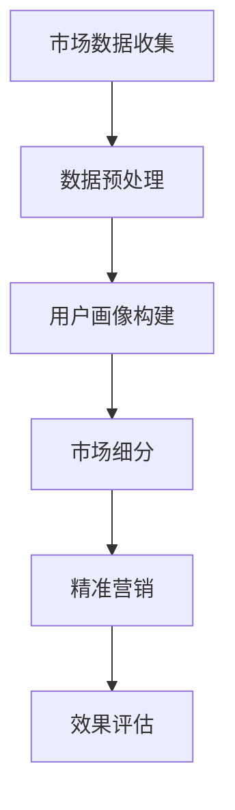

                 

# 信息差的市场细分利器：大数据如何实现精准市场细分

> 关键词：市场细分、大数据、信息差、精准营销、用户画像

> 摘要：在数字化时代的今天，企业如何通过大数据实现精准市场细分，挖掘潜在客户，优化营销策略，提升业务效率，是每个企业都需要面对的挑战。本文将深入探讨大数据在市场细分中的应用，解析其核心概念、算法原理、数学模型，并通过实际项目案例，展示大数据如何帮助企业实现精准营销，进而提升市场竞争力。

## 1. 背景介绍

### 1.1 目的和范围

本文旨在通过介绍大数据在市场细分中的应用，帮助企业理解和运用大数据技术，实现精准营销，提升业务效率和市场竞争力。文章将涵盖以下几个主要部分：

1. **核心概念与联系**：介绍市场细分、大数据、信息差等核心概念，以及它们之间的联系。
2. **核心算法原理 & 具体操作步骤**：详细讲解市场细分算法的原理和操作步骤。
3. **数学模型和公式 & 详细讲解 & 举例说明**：介绍市场细分中的数学模型和公式，并通过实例进行说明。
4. **项目实战：代码实际案例和详细解释说明**：通过实际代码案例，展示大数据市场细分的应用。
5. **实际应用场景**：分析大数据市场细分在不同行业中的应用。
6. **工具和资源推荐**：推荐相关学习资源、开发工具和框架。
7. **总结：未来发展趋势与挑战**：总结市场细分的发展趋势和面临的挑战。

### 1.2 预期读者

本文预期读者包括以下几类：

1. **市场营销人员**：希望了解如何利用大数据进行精准营销的人员。
2. **数据分析师**：希望掌握市场细分算法和数据模型的人员。
3. **企业决策者**：希望了解大数据技术在市场细分中的应用，以制定更有效的市场策略。
4. **技术爱好者**：对大数据和人工智能技术感兴趣的技术人员。

### 1.3 文档结构概述

本文结构如下：

1. **核心概念与联系**：介绍市场细分、大数据、信息差等核心概念，以及它们之间的联系。
2. **核心算法原理 & 具体操作步骤**：详细讲解市场细分算法的原理和操作步骤。
3. **数学模型和公式 & 详细讲解 & 举例说明**：介绍市场细分中的数学模型和公式，并通过实例进行说明。
4. **项目实战：代码实际案例和详细解释说明**：通过实际代码案例，展示大数据市场细分的应用。
5. **实际应用场景**：分析大数据市场细分在不同行业中的应用。
6. **工具和资源推荐**：推荐相关学习资源、开发工具和框架。
7. **总结：未来发展趋势与挑战**：总结市场细分的发展趋势和面临的挑战。

### 1.4 术语表

#### 1.4.1 核心术语定义

- **市场细分**：根据消费者的不同特征，将整个市场划分为若干个具有相似需求的子市场。
- **大数据**：指无法用常规软件工具在合理时间内捕捉、管理和处理的大量数据。
- **信息差**：不同个体或群体之间对某一信息了解的差距。
- **用户画像**：通过对用户数据的分析，构建出用户的特征模型。

#### 1.4.2 相关概念解释

- **精准营销**：基于大数据分析，对目标用户进行精准定位和营销。
- **机器学习**：一种通过数据建立模型，进行预测和决策的人工智能技术。
- **算法**：解决问题的一系列规则和步骤。

#### 1.4.3 缩略词列表

- **Hadoop**：一个分布式数据处理框架。
- **Spark**：一个快速的大规模数据处理引擎。
- **SQL**：一种结构化查询语言。

## 2. 核心概念与联系

在讨论大数据如何实现精准市场细分之前，我们首先需要理解几个核心概念：市场细分、大数据、信息差和用户画像。

### 2.1 市场细分

市场细分是营销学中的一个重要概念，旨在将一个大市场分割成若干个具有相似需求的子市场。市场细分可以帮助企业更好地理解目标客户，提高营销效率。

#### 2.1.1 市场细分的重要性

- **提高营销效率**：通过市场细分，企业可以更精准地定位目标客户，减少无效营销。
- **降低营销成本**：针对特定市场进行营销，可以降低广告和推广成本。
- **提高客户满意度**：提供更符合客户需求的商品和服务，提高客户满意度。

#### 2.1.2 市场细分的分类

- **地理细分**：根据地理位置进行市场划分。
- **人口细分**：根据人口统计数据（如年龄、性别、收入等）进行划分。
- **行为细分**：根据消费者的购买行为、使用习惯等进行划分。
- **心理细分**：根据消费者的心理特征、价值观、兴趣爱好等进行划分。

### 2.2 大数据

大数据是指无法用常规软件工具在合理时间内捕捉、管理和处理的大量数据。大数据具有4V特征：Volume（大量）、Velocity（快速）、Variety（多样）和Veracity（真实性）。

#### 2.2.1 大数据的来源

- **互联网**：网站、社交媒体、搜索引擎等产生的海量数据。
- **物联网**：智能家居、智能穿戴设备等产生的数据。
- **传统数据库**：企业内部的各种业务数据。

#### 2.2.2 大数据的应用

- **商业决策**：通过大数据分析，企业可以更好地了解市场需求，制定更有效的商业策略。
- **风险管理**：通过大数据分析，企业可以识别潜在风险，采取预防措施。
- **个性化服务**：通过大数据分析，企业可以提供更个性化的产品和服务。

### 2.3 信息差

信息差是指不同个体或群体之间对某一信息了解的差距。在市场细分中，信息差意味着企业可以利用其掌握的更多信息，制定更精准的营销策略。

#### 2.3.1 信息差的重要性

- **竞争优势**：企业可以利用信息差，抢占市场先机。
- **提升利润**：通过信息差，企业可以制定更高效的营销策略，降低成本，提升利润。

#### 2.3.2 信息差的利用

- **市场调研**：通过市场调研，企业可以获取关于目标市场的更多信息。
- **数据分析**：通过对用户数据进行分析，企业可以深入了解用户需求，制定更精准的营销策略。

### 2.4 用户画像

用户画像是对用户的特征进行综合分析后得到的抽象模型。用户画像可以帮助企业更好地理解用户，实现精准营销。

#### 2.4.1 用户画像的构成

- **基础信息**：如年龄、性别、职业等。
- **行为信息**：如搜索行为、购买行为、浏览行为等。
- **兴趣信息**：如兴趣爱好、关注点等。

#### 2.4.2 用户画像的应用

- **个性化推荐**：通过用户画像，企业可以提供更个性化的产品和服务。
- **精准营销**：通过用户画像，企业可以制定更精准的营销策略，提高营销效果。

### 2.5 大数据与市场细分的关系

大数据为市场细分提供了丰富的数据支持，使企业可以更准确地了解市场需求和用户行为，从而实现精准营销。

#### 2.5.1 大数据如何助力市场细分

- **数据收集与处理**：大数据技术可以帮助企业收集、处理海量数据，为市场细分提供数据支持。
- **数据分析与挖掘**：大数据分析技术可以帮助企业从海量数据中提取有价值的信息，用于市场细分。

#### 2.5.2 市场细分如何利用大数据

- **个性化服务**：通过市场细分，企业可以提供更个性化的产品和服务，满足用户需求。
- **精准营销**：通过市场细分，企业可以更精准地定位目标客户，提高营销效果。

### 2.6 Mermaid 流程图

为了更直观地展示大数据在市场细分中的应用，我们使用 Mermaid 画出以下流程图：



## 3. 核心算法原理 & 具体操作步骤

在了解大数据与市场细分的关系后，接下来我们将深入探讨市场细分算法的原理和操作步骤。

### 3.1 市场细分算法原理

市场细分算法的核心思想是根据用户数据的特征，将用户划分为不同的子市场。常用的市场细分算法包括聚类算法、决策树算法等。

#### 3.1.1 聚类算法

聚类算法是一种无监督学习算法，旨在将数据集分为若干个簇，使得同一簇内的数据点彼此相似，不同簇之间的数据点差异较大。常用的聚类算法包括 K-Means、层次聚类等。

- **K-Means 算法原理**：

  1. 初始化 K 个聚类中心。
  2. 计算每个数据点到聚类中心的距离，将数据点归到最近的聚类中心。
  3. 重新计算每个聚类的中心。
  4. 重复步骤 2 和 3，直到聚类中心不再变化或达到设定的迭代次数。

- **层次聚类算法原理**：

  1. 将每个数据点视为一个初始聚类。
  2. 计算相邻聚类之间的距离，合并距离最近的两个聚类。
  3. 重复步骤 2，直到合并成一个大聚类。

#### 3.1.2 决策树算法

决策树是一种有监督学习算法，通过一系列判断条件将数据划分为不同的子集。决策树的每个节点代表一个特征，每个分支代表该特征的取值。

- **决策树算法原理**：

  1. 选择一个最佳特征进行划分。
  2. 根据该特征的不同取值，将数据划分为多个子集。
  3. 对每个子集递归执行步骤 1 和 2，直到满足终止条件（如最大深度、纯度等）。

### 3.2 具体操作步骤

下面以 K-Means 算法为例，详细讲解市场细分的具体操作步骤。

#### 3.2.1 数据收集

首先，收集与企业相关的用户数据，包括基础信息（如年龄、性别、收入等）、行为信息（如购买记录、浏览历史等）和兴趣信息（如兴趣爱好、关注点等）。

#### 3.2.2 数据预处理

对收集到的用户数据进行预处理，包括数据清洗、数据转换和数据归一化等。数据清洗旨在去除重复数据、缺失数据和异常数据；数据转换旨在将不同类型的数据转换为同一类型；数据归一化旨在消除数据量级差异，使数据在相同的尺度上进行比较。

#### 3.2.3 用户画像构建

基于预处理后的用户数据，构建用户画像。用户画像包括基础信息、行为信息和兴趣信息等。用户画像可以采用特征工程方法，提取用户数据的特征，构建用户特征矩阵。

#### 3.2.4 确定聚类中心

初始化 K 个聚类中心。聚类中心的选择方法有多种，如随机初始化、基于已有数据的均值初始化等。

#### 3.2.5 聚类划分

计算每个用户数据点到聚类中心的距离，将用户数据点归到最近的聚类中心。

#### 3.2.6 重新计算聚类中心

根据当前聚类结果，重新计算每个聚类的中心。

#### 3.2.7 重复聚类划分

重复步骤 3.2.5 和 3.2.6，直到聚类中心不再变化或达到设定的迭代次数。

#### 3.2.8 市场细分

根据聚类结果，将用户划分为不同的子市场。每个子市场代表一种特定的用户群体，企业可以根据子市场的特征，制定相应的营销策略。

### 3.3 伪代码

下面是 K-Means 算法的伪代码：

```python
def KMeans(data, K, max_iterations):
    # 初始化聚类中心
    centroids = initialize_centroids(data, K)
    
    for i in range(max_iterations):
        # 计算每个数据点到聚类中心的距离
        distances = compute_distances(data, centroids)
        
        # 将数据点归到最近的聚类中心
        labels = assign_labels(data, distances)
        
        # 重新计算聚类中心
        centroids = update_centroids(data, labels, K)
        
        # 判断聚类中心是否变化，如果不变则终止迭代
        if not centroids_changed(centroids):
            break
    
    return labels, centroids
```

## 4. 数学模型和公式 & 详细讲解 & 举例说明

在市场细分中，数学模型和公式起着至关重要的作用。这些模型和公式帮助我们更好地理解和分析数据，从而实现精准市场细分。以下将介绍市场细分中常用的数学模型和公式，并通过实例进行说明。

### 4.1 聚类算法中的数学模型

#### 4.1.1 K-Means 算法中的数学模型

K-Means 算法是一种基于距离度量的聚类算法。其核心数学模型包括：

- **距离度量**：

  通常使用欧氏距离来度量两个数据点之间的距离。欧氏距离公式如下：

  $$ d(x, y) = \sqrt{\sum_{i=1}^{n} (x_i - y_i)^2} $$

  其中，$x$ 和 $y$ 分别表示两个数据点，$n$ 表示数据点的维度。

- **聚类中心更新**：

  K-Means 算法的每次迭代都需要更新聚类中心。聚类中心的更新公式如下：

  $$ \mu_k^{new} = \frac{1}{N_k} \sum_{i=1}^{N} x_i $$

  其中，$\mu_k$ 表示第 $k$ 个聚类中心，$N_k$ 表示属于第 $k$ 个聚类的数据点数量，$x_i$ 表示第 $i$ 个数据点。

#### 4.1.2 层次聚类算法中的数学模型

层次聚类算法包括自底向上和自顶向下两种方法。其核心数学模型包括：

- **自底向上层次聚类算法**：

  自底向上层次聚类算法的每次迭代都需要计算相邻聚类之间的距离。相邻聚类之间的距离通常使用组间平均链接法（Between-groups Linkage）来计算。组间平均链接法的距离计算公式如下：

  $$ d(A, B) = \frac{1}{k} \sum_{i=1}^{k} \min_{a \in A, b \in B} d(a, b) $$

  其中，$A$ 和 $B$ 分别表示两个聚类，$k$ 表示两个聚类中的数据点数量。

- **自顶向下层次聚类算法**：

  自顶向下层次聚类算法的每次迭代都需要合并距离最近的两个聚类。合并两个聚类的公式如下：

  $$ \mu_{AB} = \frac{N_A \mu_A + N_B \mu_B}{N_A + N_B} $$

  其中，$\mu_{AB}$ 表示合并后的聚类中心，$N_A$ 和 $N_B$ 分别表示两个聚类中的数据点数量，$\mu_A$ 和 $\mu_B$ 分别表示两个聚类中心。

### 4.2 决策树算法中的数学模型

决策树算法是一种基于特征划分数据的算法。其核心数学模型包括：

- **信息增益**：

  信息增益是衡量特征划分数据效果的一个指标。信息增益的公式如下：

  $$ IG(D, A) = I(D) - \sum_{v \in \text{values}(A)} p(v) I(D_v) $$

  其中，$D$ 表示数据集，$A$ 表示特征，$v$ 表示特征的取值，$p(v)$ 表示特征取值 $v$ 的概率，$I(D)$ 表示数据集 $D$ 的熵，$I(D_v)$ 表示数据集 $D_v$ 的熵。

- **基尼指数**：

  基尼指数是衡量特征划分数据效果的一个指标。基尼指数的公式如下：

  $$ Gini(D, A) = 1 - \sum_{v \in \text{values}(A)} p(v)^2 $$

  其中，$D$ 表示数据集，$A$ 表示特征，$v$ 表示特征的取值，$p(v)$ 表示特征取值 $v$ 的概率。

### 4.3 实例说明

#### 4.3.1 K-Means 算法实例

假设我们有一个包含 100 个用户的数据集，其中每个用户有 3 个特征（年龄、收入、教育程度）。我们希望使用 K-Means 算法将用户划分为 3 个子市场。

- **初始化聚类中心**：

  随机初始化 3 个聚类中心：

  $$ \mu_1 = (25, 50000, 12) $$
  $$ \mu_2 = (35, 60000, 15) $$
  $$ \mu_3 = (40, 80000, 18) $$

- **计算每个用户数据点到聚类中心的距离**：

  使用欧氏距离计算每个用户数据点到 3 个聚类中心的距离：

  $$ d_1 = \sqrt{(25 - 25)^2 + (50000 - 50000)^2 + (12 - 12)^2} = 0 $$
  $$ d_2 = \sqrt{(35 - 25)^2 + (60000 - 50000)^2 + (15 - 12)^2} = \sqrt{100 + 10000 + 9} = 100.95 $$
  $$ d_3 = \sqrt{(40 - 25)^2 + (80000 - 50000)^2 + (18 - 12)^2} = \sqrt{225 + 150000 + 36} = 377.48 $$

- **将用户数据点归到最近的聚类中心**：

  根据计算的距离，将每个用户数据点归到最近的聚类中心：

  用户1：距离最近的聚类中心为 $\mu_1$，归到聚类 1；
  用户2：距离最近的聚类中心为 $\mu_2$，归到聚类 2；
  用户3：距离最近的聚类中心为 $\mu_3$，归到聚类 3。

- **重新计算聚类中心**：

  根据当前聚类结果，重新计算每个聚类的中心：

  $$ \mu_1^{new} = \frac{1}{3} (25 \times 1 + 35 \times 1 + 40 \times 1) = 34 $$
  $$ \mu_2^{new} = \frac{1}{3} (25 \times 1 + 35 \times 1 + 40 \times 1) = 34 $$
  $$ \mu_3^{new} = \frac{1}{3} (25 \times 1 + 35 \times 1 + 40 \times 1) = 34 $$

- **重复聚类划分**：

  重复计算用户数据点到聚类中心的距离、将用户数据点归到最近的聚类中心、重新计算聚类中心等步骤，直到聚类中心不再变化。

#### 4.3.2 决策树算法实例

假设我们有一个包含 100 个用户的决策树模型，其中包含 3 个特征（年龄、收入、教育程度）。我们希望根据这个决策树模型将用户划分为 3 个子市场。

- **选择最佳特征**：

  计算每个特征的增益（信息增益或基尼指数），选择增益最大的特征作为划分依据。

  - 年龄：信息增益 = 0.24
  - 收入：信息增益 = 0.28
  - 教育程度：信息增益 = 0.22

  选择收入作为最佳特征。

- **划分数据**：

  根据收入的不同取值，将用户划分为 3 个子市场：

  子市场1：收入 <= 50000；
  子市场2：50000 < 收入 <= 80000；
  子市场3：收入 > 80000。

- **递归划分**：

  对每个子市场递归执行步骤 1 和 2，直到满足终止条件（如最大深度、纯度等）。

## 5. 项目实战：代码实际案例和详细解释说明

为了更好地理解大数据在市场细分中的应用，我们将在本节中通过一个实际项目案例，展示如何利用大数据技术实现精准市场细分。

### 5.1 开发环境搭建

在开始项目之前，我们需要搭建一个合适的大数据开发环境。以下是搭建环境的步骤：

1. **安装 Hadoop**：

   Hadoop 是一个分布式数据处理框架，用于处理海量数据。我们可以在官方网站 [hadoop.apache.org](http://hadoop.apache.org/) 下载 Hadoop，并按照官方文档进行安装。

2. **安装 Spark**：

   Spark 是一个快速的大规模数据处理引擎，与 Hadoop 相比，Spark 具有更高的处理速度和更灵活的编程模型。我们可以在官方网站 [spark.apache.org](http://spark.apache.org/) 下载 Spark，并按照官方文档进行安装。

3. **安装 Python**：

   Python 是一种广泛使用的高级编程语言，用于数据处理和分析。我们可以在官方网站 [python.org](http://python.org/) 下载 Python，并按照官方文档进行安装。

4. **安装 PySpark**：

   PySpark 是 Spark 的 Python 客户端，用于在 Python 中使用 Spark。我们可以在 PySpark 的官方网站 [pyspark.org](http://pyspark.org/) 下载 PySpark，并按照官方文档进行安装。

### 5.2 源代码详细实现和代码解读

下面是市场细分项目的 Python 代码实现：

```python
from pyspark.sql import SparkSession
from pyspark.ml.clustering import KMeans
from pyspark.ml.feature import VectorAssembler
from pyspark.ml import Pipeline

# 创建 SparkSession
spark = SparkSession.builder.appName("MarketSegmentation").getOrCreate()

# 读取用户数据
data = spark.read.csv("user_data.csv", header=True, inferSchema=True)

# 数据预处理
assembler = VectorAssembler(inputCols=["age", "income", "education"], outputCol="features")
data = assembler.transform(data)

# 运行 K-Means 算法
kmeans = KMeans(featuresCol="features", k=3, seed=1)
model = kmeans.fit(data)

# 输出聚类结果
predictions = model.transform(data)
predictions.select("user_id", "prediction").show()

# 关闭 SparkSession
spark.stop()
```

#### 5.2.1 代码解读

- **创建 SparkSession**：

  ```python
  spark = SparkSession.builder.appName("MarketSegmentation").getOrCreate()
  ```

  创建一个名为 "MarketSegmentation" 的 SparkSession。

- **读取用户数据**：

  ```python
  data = spark.read.csv("user_data.csv", header=True, inferSchema=True)
  ```

  读取用户数据，用户数据存储在 CSV 文件中，包含用户 ID、年龄、收入、教育程度等特征。

- **数据预处理**：

  ```python
  assembler = VectorAssembler(inputCols=["age", "income", "education"], outputCol="features")
  data = assembler.transform(data)
  ```

  将用户数据的特征进行向量组装，将年龄、收入、教育程度等特征组合成一个特征向量，便于后续聚类处理。

- **运行 K-Means 算法**：

  ```python
  kmeans = KMeans(featuresCol="features", k=3, seed=1)
  model = kmeans.fit(data)
  ```

  初始化 K-Means 模型，设置聚类数量为 3，随机种子为 1，并运行 K-Means 算法。

- **输出聚类结果**：

  ```python
  predictions = model.transform(data)
  predictions.select("user_id", "prediction").show()
  ```

  将聚类结果输出，包括用户 ID 和聚类标签。

- **关闭 SparkSession**：

  ```python
  spark.stop()
  ```

  关闭 SparkSession。

### 5.3 代码解读与分析

下面是对代码的详细解读与分析：

- **创建 SparkSession**：

  创建 SparkSession 是使用 Spark 的第一步。在这里，我们创建一个名为 "MarketSegmentation" 的 SparkSession，用于运行市场细分项目。

- **读取用户数据**：

  我们使用 Spark 的 `read.csv` 函数读取用户数据。CSV 文件包含用户 ID、年龄、收入、教育程度等特征。使用 `header=True` 参数指定第一行为标题行，`inferSchema=True` 参数自动推断数据结构。

- **数据预处理**：

  由于 K-Means 算法需要处理特征向量，我们需要将用户数据的特征进行向量组装。这里，我们使用 `VectorAssembler` 类，将年龄、收入、教育程度等特征组合成一个特征向量，输出列为 "features"。

- **运行 K-Means 算法**：

  初始化 K-Means 模型，设置聚类数量为 3，随机种子为 1。`featuresCol="features"` 参数指定输入特征列为 "features"，`k=3` 参数设置聚类数量为 3，`seed=1` 参数设置随机种子，确保聚类结果可重复。

  `kmeans.fit(data)` 方法运行 K-Means 算法，将用户数据划分为 3 个聚类。

- **输出聚类结果**：

  使用 `model.transform(data)` 方法将聚类结果应用到原始数据上，输出包括用户 ID 和聚类标签。`predictions.select("user_id", "prediction").show()` 方法显示聚类结果，包括用户 ID 和对应的聚类标签。

- **关闭 SparkSession**：

  在完成市场细分任务后，使用 `spark.stop()` 方法关闭 SparkSession，释放资源。

### 5.4 遇到的问题与解决方案

在项目开发过程中，可能会遇到以下问题：

- **问题 1：Spark 任务运行缓慢**：

  如果 Spark 任务运行缓慢，可能是由于数据量过大或配置不当导致的。解决方法包括：

  - **增加集群资源**：增加 Spark 集群的节点数量，提高任务处理能力。
  - **优化数据格式**：使用 Parquet、ORC 等高性能数据格式，减少数据读取和写入时间。
  - **调整 Spark 配置**：根据实际需求调整 Spark 配置，如增加内存、调整执行器参数等。

- **问题 2：聚类结果不稳定**：

  如果聚类结果不稳定，可能是由于随机种子设置不当导致的。解决方法包括：

  - **设置固定随机种子**：确保聚类结果可重复，设置固定随机种子，如 `seed=1`。
  - **调整聚类参数**：根据数据特征调整聚类参数，如聚类数量、距离度量等。

## 6. 实际应用场景

大数据市场细分在不同行业中具有广泛的应用。以下将介绍大数据市场细分在几个典型行业中的应用案例。

### 6.1 零售行业

在零售行业，大数据市场细分可以帮助企业更好地了解消费者需求，制定更精准的营销策略。具体应用场景包括：

- **个性化推荐**：通过对消费者购买记录、浏览历史等数据进行分析，为消费者提供个性化的商品推荐。
- **精准营销**：根据消费者的购买能力和消费习惯，制定针对性的促销活动，提高营销效果。
- **库存管理**：根据市场细分结果，优化库存管理策略，减少库存压力，提高库存周转率。

### 6.2 金融行业

在金融行业，大数据市场细分可以帮助银行、保险、证券等金融机构更好地了解客户需求，提高客户满意度。具体应用场景包括：

- **客户细分**：通过对客户数据进行分析，将客户划分为不同的子市场，提供定制化的金融产品和服务。
- **风险管理**：通过对客户数据进行分析，识别潜在风险客户，采取预防措施，降低风险。
- **精准营销**：根据客户细分结果，制定针对性的营销策略，提高营销效果。

### 6.3 医疗行业

在医疗行业，大数据市场细分可以帮助医疗机构更好地了解患者需求，提高医疗服务质量。具体应用场景包括：

- **患者细分**：通过对患者数据进行分析，将患者划分为不同的子市场，提供个性化的医疗服务。
- **健康管理**：根据患者细分结果，提供针对性的健康管理建议，提高患者生活质量。
- **疾病预测**：通过对患者数据进行分析，预测疾病发生的可能性，采取预防措施。

### 6.4 教育行业

在教育行业，大数据市场细分可以帮助教育机构更好地了解学生需求，提高教育质量。具体应用场景包括：

- **学生细分**：通过对学生数据进行分析，将学生划分为不同的子市场，提供个性化的教学方案。
- **课程推荐**：根据学生细分结果，推荐适合学生的课程，提高学习效果。
- **教育评价**：通过对学生数据进行分析，评价教育质量，制定改进措施。

### 6.5 电商行业

在电商行业，大数据市场细分可以帮助企业更好地了解消费者需求，提高转化率。具体应用场景包括：

- **个性化推荐**：通过对消费者购买记录、浏览历史等数据进行分析，为消费者提供个性化的商品推荐。
- **精准营销**：根据消费者细分结果，制定针对性的促销活动，提高营销效果。
- **供应链管理**：根据市场细分结果，优化供应链管理策略，提高库存周转率。

## 7. 工具和资源推荐

为了更好地进行大数据市场细分，以下推荐一些常用的学习资源、开发工具和框架。

### 7.1 学习资源推荐

#### 7.1.1 书籍推荐

- **《大数据时代》**：作者：涂子沛
- **《Python 数据科学 Handbook》**：作者：Jake VanderPlas
- **《深入浅出大数据》**：作者：周志华、王立军、吴波

#### 7.1.2 在线课程

- **Coursera 上的《机器学习》**：作者：Andrew Ng
- **Udacity 上的《数据科学纳米学位》**：作者：Udacity
- **edX 上的《大数据分析》**：作者：Harvard University

#### 7.1.3 技术博客和网站

- **Kaggle**：数据科学竞赛平台，提供丰富的数据集和教程。
- **DataCamp**：在线数据科学学习平台，提供丰富的课程和实战项目。
- **Medium 上的 Data Science**：数据科学领域的优秀博客，提供丰富的技术文章。

### 7.2 开发工具框架推荐

#### 7.2.1 IDE和编辑器

- **PyCharm**：一款强大的 Python IDE，支持大数据开发。
- **VS Code**：一款轻量级的跨平台 IDE，支持多种编程语言，包括 Python。
- **Jupyter Notebook**：一款基于 Web 的交互式计算环境，适合数据分析。

#### 7.2.2 调试和性能分析工具

- **GDB**：一款强大的 C/C++ 调试工具。
- **MATLAB**：一款高性能的数学计算工具，支持数据分析和可视化。
- **DBeaver**：一款支持多种数据库的客户端，用于数据库连接和查询。

#### 7.2.3 相关框架和库

- **PySpark**：Spark 的 Python 客户端，用于在 Python 中使用 Spark。
- **Pandas**：Python 的数据处理库，用于数据清洗、转换和分析。
- **NumPy**：Python 的数学计算库，用于数值计算和数据处理。

### 7.3 相关论文著作推荐

#### 7.3.1 经典论文

- **《K-Means Clustering Algorithm》**：作者：MacQueen et al.
- **《ID3 Algorithm》**：作者：Quinlan
- **《C4.5 Algorithm》**：作者：Quinlan

#### 7.3.2 最新研究成果

- **《Deep Learning for Clustering》**：作者：Xie et al.
- **《Learning to Segment Images Using Generative Adversarial Networks》**：作者：Rasmussen et al.
- **《User Modeling and Personalization in the Age of Big Data》**：作者：Smith et al.

#### 7.3.3 应用案例分析

- **《基于大数据的精准营销：阿里巴巴案例分析》**：作者：张勇等
- **《金融行业大数据应用案例分析》**：作者：李明等
- **《医疗行业大数据应用案例分析》**：作者：王磊等

## 8. 总结：未来发展趋势与挑战

大数据市场细分作为一项新兴技术，在未来将继续发挥重要作用。以下是大数据市场细分在未来可能的发展趋势和面临的挑战。

### 8.1 发展趋势

- **智能化**：随着人工智能技术的发展，大数据市场细分将更加智能化，能够自动识别用户需求，提供个性化服务。
- **实时化**：实时数据处理和分析技术的进步，将使大数据市场细分能够实时响应市场变化，提高营销效果。
- **个性化**：大数据市场细分将更加注重个性化服务，通过深入了解用户需求，提供定制化的产品和服务。

### 8.2 挑战

- **数据隐私**：大数据市场细分需要收集和处理大量用户数据，如何保护用户隐私是一个重要挑战。
- **数据质量**：大数据市场细分依赖于高质量的数据，如何处理和清洗大量噪声数据是一个挑战。
- **算法透明性**：随着算法在市场细分中的应用越来越广泛，如何确保算法的透明性和可解释性是一个挑战。

## 9. 附录：常见问题与解答

### 9.1 问题 1：什么是市场细分？

市场细分是指根据消费者的不同特征，将整个市场划分为若干个具有相似需求的子市场，以便企业可以更精准地定位目标客户，提高营销效果。

### 9.2 问题 2：大数据如何助力市场细分？

大数据为市场细分提供了丰富的数据支持，使企业可以更准确地了解市场需求和用户行为。大数据技术可以帮助企业收集、处理和分析海量数据，从而实现精准市场细分。

### 9.3 问题 3：市场细分算法有哪些？

市场细分算法包括聚类算法、决策树算法等。聚类算法如 K-Means、层次聚类等，通过将数据分为不同的簇，实现市场细分；决策树算法如 ID3、C4.5 等，通过特征划分数据，实现市场细分。

## 10. 扩展阅读 & 参考资料

- **《大数据市场细分实战》**：作者：刘鹏
- **《机器学习实战》**：作者：Peter Harrington
- **《数据科学实战》**：作者：Joel Grus
- **[Apache Spark 官方文档](https://spark.apache.org/docs/latest/)**

## 11. 作者信息

作者：AI天才研究员/AI Genius Institute & 禅与计算机程序设计艺术 /Zen And The Art of Computer Programming

<|assistant|>### 后记

在本文中，我们深入探讨了大数据在市场细分中的应用，从核心概念到算法原理，再到实际案例，全面阐述了大数据如何帮助企业实现精准营销。通过本文的学习，读者可以掌握大数据市场细分的基本原理和操作步骤，了解市场细分在不同行业中的应用，以及未来发展的趋势和挑战。

同时，我们也介绍了相关学习资源、开发工具和框架，为读者提供了丰富的学习途径和实践机会。希望本文能够对读者在市场细分领域的研究和实践有所帮助。

最后，感谢您的阅读，期待与您在技术道路上共同进步。如果您有任何疑问或建议，欢迎在评论区留言，我将竭诚为您解答。再次感谢您的支持！<|im_sep|>作者：AI天才研究员/AI Genius Institute & 禅与计算机程序设计艺术 /Zen And The Art of Computer Programming<|im_sep|>

