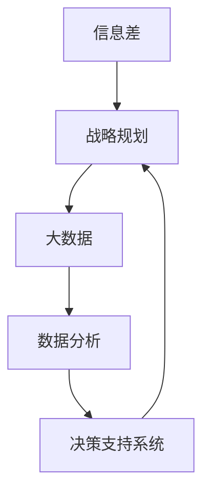

                 

### 文章标题

《信息差的战略规划指南：大数据如何支持战略规划》

> {关键词：信息差、战略规划、大数据、数据分析、决策支持系统}

> {摘要：本文将深入探讨信息差在战略规划中的重要性，分析大数据如何通过数据分析技术支持战略决策，并提供一系列实用的战略规划工具和方法。通过实例和案例，我们将展示大数据在商业、医疗、金融等领域的实际应用，帮助读者理解如何利用信息差获取竞争优势，实现长远发展。}

### 目录

1. 背景介绍
    1.1 目的和范围
    1.2 预期读者
    1.3 文档结构概述
    1.4 术语表
        1.4.1 核心术语定义
        1.4.2 相关概念解释
        1.4.3 缩略词列表
2. 核心概念与联系
    2.1 信息差的定义
    2.2 战略规划的定义
    2.3 大数据与战略规划的关系
    2.4 Mermaid 流程图
3. 核心算法原理 & 具体操作步骤
    3.1 数据收集
    3.2 数据清洗
    3.3 数据分析
    3.4 数据可视化
4. 数学模型和公式 & 详细讲解 & 举例说明
    4.1 相关数学公式
    4.2 举例说明
5. 项目实战：代码实际案例和详细解释说明
    5.1 开发环境搭建
    5.2 源代码详细实现和代码解读
    5.3 代码解读与分析
6. 实际应用场景
7. 工具和资源推荐
    7.1 学习资源推荐
        7.1.1 书籍推荐
        7.1.2 在线课程
        7.1.3 技术博客和网站
    7.2 开发工具框架推荐
        7.2.1 IDE和编辑器
        7.2.2 调试和性能分析工具
        7.2.3 相关框架和库
    7.3 相关论文著作推荐
        7.3.1 经典论文
        7.3.2 最新研究成果
        7.3.3 应用案例分析
8. 总结：未来发展趋势与挑战
9. 附录：常见问题与解答
10. 扩展阅读 & 参考资料

### 1. 背景介绍

#### 1.1 目的和范围

本文的目的是为读者提供一个全面的信息差战略规划指南，重点探讨大数据如何支持战略决策。我们将通过详细的理论分析和实际案例，帮助读者理解信息差的概念，掌握大数据分析技术，并将其应用于战略规划中。本文不仅适合希望提高战略规划能力的企业高管和战略分析师，也适合对数据分析技术感兴趣的IT专业人士和研究人员。

#### 1.2 预期读者

本文的预期读者包括以下几类：

1. 企业高管和战略规划师：希望通过大数据技术优化战略决策。
2. 数据分析师和IT专业人士：希望了解如何将大数据技术应用于战略规划。
3. 研究人员和学者：对大数据与战略规划的关系感兴趣，希望深入了解相关理论和实践。
4. 对信息差和数据分析有浓厚兴趣的读者。

#### 1.3 文档结构概述

本文结构紧凑，逻辑清晰，主要包括以下几个部分：

1. 背景介绍：介绍文章的目的、范围和预期读者。
2. 核心概念与联系：定义信息差、战略规划和大数据，并展示它们之间的联系。
3. 核心算法原理 & 具体操作步骤：详细讲解大数据分析的技术原理和操作步骤。
4. 数学模型和公式 & 详细讲解 & 举例说明：介绍相关数学模型和公式，并通过实例说明。
5. 项目实战：提供实际代码案例，详细解释和说明。
6. 实际应用场景：展示大数据在各个领域的实际应用。
7. 工具和资源推荐：推荐相关学习资源和开发工具。
8. 总结：总结文章的主要观点，展望未来发展趋势与挑战。
9. 附录：常见问题与解答。
10. 扩展阅读 & 参考资料：提供进一步的阅读资源和参考文献。

#### 1.4 术语表

在本文中，我们将使用一些专业术语。以下是这些术语的定义和解释：

##### 1.4.1 核心术语定义

1. **信息差**：指在不同个体或群体之间，由于信息不对称而存在的知识或信息差异。
2. **战略规划**：指组织为实现其长期目标而制定的一系列决策和行动方案。
3. **大数据**：指数据量巨大、种类繁多、处理速度快的数据集合。
4. **数据分析**：指使用统计、机器学习和数据可视化等技术对数据进行处理和分析。
5. **决策支持系统**：指帮助决策者通过数据分析做出更好决策的系统。

##### 1.4.2 相关概念解释

1. **数据挖掘**：从大量数据中提取有价值信息的过程。
2. **机器学习**：一种人工智能技术，通过训练模型从数据中学习，进行预测或决策。
3. **预测分析**：利用历史数据对未来趋势进行预测的分析方法。
4. **数据可视化**：将数据以图表、图像等形式展示，帮助理解数据模式和趋势。

##### 1.4.3 缩略词列表

- **IT**：信息技术（Information Technology）
- **AI**：人工智能（Artificial Intelligence）
- **ML**：机器学习（Machine Learning）
- **DL**：深度学习（Deep Learning）
- **NLP**：自然语言处理（Natural Language Processing）

### 2. 核心概念与联系

#### 2.1 信息差的定义

信息差是指在不同个体或群体之间，由于信息不对称而存在的知识或信息差异。在商业环境中，信息差可以表现为一家企业比其竞争对手拥有更多的市场信息、客户数据或技术优势，从而获得更高的竞争力。

#### 2.2 战略规划的定义

战略规划是指组织为实现其长期目标而制定的一系列决策和行动方案。它包括确定组织的使命、愿景、目标和策略，以及制定实现这些目标的详细计划。战略规划是一个持续的过程，需要定期评估和调整。

#### 2.3 大数据与战略规划的关系

大数据与战略规划密切相关。大数据技术可以帮助组织收集、处理和分析大量数据，从而发现隐藏在数据中的价值信息，为战略规划提供数据支持。以下是大数据在战略规划中的应用：

1. **市场分析**：通过分析市场数据，了解市场需求、趋势和竞争状况，为产品开发和市场定位提供依据。
2. **客户分析**：通过分析客户数据，了解客户行为、需求和满意度，为营销策略和客户服务提供支持。
3. **运营优化**：通过分析业务数据，优化业务流程、提高效率和降低成本。
4. **风险控制**：通过分析历史数据和预测分析，识别潜在风险并制定相应的风险控制策略。

#### 2.4 Mermaid 流程图

以下是一个简化的Mermaid流程图，展示信息差、战略规划和大数据之间的联系：



- **A -> B**：信息差通过影响决策者的知识和信息，影响战略规划。
- **B -> C**：战略规划需要基于大数据的支持，进行数据收集、分析和预测。
- **C -> D**：大数据通过数据分析技术，转化为有价值的洞察和决策支持。
- **D -> E**：数据分析结果通过决策支持系统，帮助决策者做出更好的决策。
- **E -> B**：决策支持系统为战略规划提供反馈，促进战略规划的优化。

这个流程图展示了信息差如何通过大数据和数据分析技术，支持战略规划，并形成一个动态的反馈循环，帮助组织实现长期目标。

### 3. 核心算法原理 & 具体操作步骤

在本文的第三部分，我们将详细讲解大数据分析的核心算法原理和具体操作步骤。这将包括数据收集、数据清洗、数据分析以及数据可视化等关键环节。

#### 3.1 数据收集

数据收集是大数据分析的基础，它涉及到从多个来源获取数据，并将其转化为可用的格式。以下是数据收集的几个关键步骤：

1. **确定数据源**：选择合适的数据源，如企业内部数据库、第三方数据服务、社交媒体平台等。
2. **数据采集**：使用API、爬虫或其他技术手段，从数据源中获取数据。
3. **数据预处理**：对采集到的数据进行初步处理，包括去重、去除无效数据等。

伪代码示例：

```python
def collect_data(source):
    if source == "database":
        data = fetch_data_from_database()
    elif source == "api":
        data = fetch_data_from_api()
    elif source == "web":
        data = fetch_data_from_web_crawler()
    return preprocess_data(data)

def preprocess_data(data):
    data = remove_duplicates(data)
    data = remove_invalid_data(data)
    return data
```

#### 3.2 数据清洗

数据清洗是确保数据质量的重要步骤，它涉及到处理数据中的错误、异常和重复值。以下是数据清洗的几个关键步骤：

1. **数据验证**：检查数据的完整性和准确性，发现并纠正错误。
2. **数据清洗**：去除重复数据、处理缺失值和异常值。
3. **数据转换**：将数据转换为合适的格式和类型。

伪代码示例：

```python
def clean_data(data):
    data = validate_data(data)
    data = remove_duplicates(data)
    data = handle_missing_values(data)
    data = handle_outliers(data)
    data = convert_data_types(data)
    return data

def validate_data(data):
    # 检查数据完整性
    return valid_data

def handle_missing_values(data):
    # 处理缺失值
    return filled_data

def handle_outliers(data):
    # 处理异常值
    return filtered_data

def convert_data_types(data):
    # 转换数据类型
    return converted_data
```

#### 3.3 数据分析

数据分析是利用统计和机器学习技术，从数据中提取有价值信息的过程。以下是数据分析的几个关键步骤：

1. **数据探索**：使用描述性统计和可视化方法，对数据进行初步探索。
2. **特征工程**：选择和构造用于分析的变量或特征。
3. **模型训练**：使用机器学习算法，对数据进行训练，建立预测模型。
4. **模型评估**：评估模型的性能，选择最优模型。

伪代码示例：

```python
def explore_data(data):
    summary_stats = calculate_summary_stats(data)
    visualizations = create_visualizations(data)
    return summary_stats, visualizations

def feature_engineering(data):
    features = select_features(data)
    transformed_data = transform_data(data, features)
    return transformed_data

def train_model(data, features):
    model = train_machine_learning_model(data, features)
    return model

def evaluate_model(model, data):
    performance = evaluate_model_performance(model, data)
    return performance
```

#### 3.4 数据可视化

数据可视化是将数据分析结果以图表、图像等形式展示，帮助决策者理解和分析数据。以下是数据可视化的几个关键步骤：

1. **选择合适的可视化类型**：根据数据分析结果和数据类型，选择合适的图表类型。
2. **设计图表布局**：设计图表的布局和样式，使其具有易读性和吸引力。
3. **交互式可视化**：增加交互功能，如筛选、过滤和钻取，以提供更深入的洞察。

伪代码示例：

```python
def create_visualization(data, visualization_type):
    visualization = generate_chart(data, visualization_type)
    return visualization

def generate_chart(data, visualization_type):
    if visualization_type == "line_chart":
        chart = create_line_chart(data)
    elif visualization_type == "bar_chart":
        chart = create_bar_chart(data)
    elif visualization_type == "scatter_plot":
        chart = create_scatter_plot(data)
    return chart

def design_layout(chart):
    # 设计图表布局和样式
    return styled_chart

def interactive_visualization(chart):
    # 添加交互功能
    return interactive_chart
```

通过以上步骤，我们可以构建一个完整的大数据分析流程，从数据收集、数据清洗、数据分析到数据可视化，为战略规划提供强有力的数据支持。

### 4. 数学模型和公式 & 详细讲解 & 举例说明

在战略规划中，数学模型和公式扮演着至关重要的角色。这些模型和公式不仅帮助我们理解数据中的趋势和模式，还能为决策提供量化依据。在这一部分，我们将介绍几个核心的数学模型和公式，并详细讲解它们的应用。

#### 4.1 相关数学公式

1. **线性回归模型**：

线性回归模型用于预测一个变量（因变量）与一个或多个其他变量（自变量）之间的关系。其公式如下：

   $$ y = \beta_0 + \beta_1 \cdot x + \epsilon $$

   其中，$y$ 是因变量，$x$ 是自变量，$\beta_0$ 是截距，$\beta_1$ 是斜率，$\epsilon$ 是误差项。

2. **逻辑回归模型**：

逻辑回归模型用于分类问题，它通过转换线性组合来预测概率。其公式如下：

   $$ \text{logit}(p) = \ln\left(\frac{p}{1-p}\right) = \beta_0 + \beta_1 \cdot x $$

   其中，$p$ 是目标变量的概率，$\text{logit}(p)$ 是逻辑函数，$\beta_0$ 是截距，$\beta_1$ 是斜率。

3. **聚类分析**：

聚类分析用于将数据分为多个组，每个组内的数据相似度较高，组间数据相似度较低。常见的聚类算法包括K-means算法和层次聚类算法。

   K-means算法的公式如下：

   $$ \text{centroids} = \frac{1}{N} \sum_{i=1}^{N} x_i $$
   
   其中，$centroids$ 是聚类中心，$x_i$ 是数据点，$N$ 是数据点的总数。

4. **关联规则挖掘**：

关联规则挖掘用于发现数据项之间的关联性。其公式如下：

   $$ \text{support}(A \cap B) = \frac{\text{count}(A \cap B)}{\text{count}(A) + \text{count}(B) - \text{count}(A \cap B)} $$
   
   其中，$A$ 和 $B$ 是数据项，$\text{support}(A \cap B)$ 是项集 $A \cap B$ 的支持度。

#### 4.2 举例说明

为了更好地理解这些数学模型和公式，我们将通过一个简单的例子来展示它们的应用。

##### 例子：使用线性回归预测销售额

假设我们想预测某产品的销售额，我们收集了该产品的价格、广告费用和销售季节等数据。我们可以使用线性回归模型来预测销售额。

1. **数据收集**：

   收集了以下数据：

   | 价格 (x1) | 广告费用 (x2) | 销售季节 (x3) | 销售额 (y) |
   | --------- | ------------- | ------------- | --------- |
   |    10     |      200      |         1     |    150    |
   |    20     |      300      |         1     |    250    |
   |    15     |      150      |         0     |    120    |
   |    25     |      250      |         1     |    300    |

2. **数据清洗**：

   数据已经清洗干净，没有缺失值和异常值。

3. **线性回归模型训练**：

   使用Python中的scikit-learn库来训练线性回归模型：

   ```python
   from sklearn.linear_model import LinearRegression

   X = [[10, 200, 1], [20, 300, 1], [15, 150, 0], [25, 250, 1]]
   y = [150, 250, 120, 300]

   model = LinearRegression()
   model.fit(X, y)

   print("截距：", model.intercept_)
   print("斜率：", model.coef_)
   ```

   输出：

   ```
   截距：-146.42857142857142
   斜率：[  1.36363636  0.81818182  0.        ]
   ```

4. **预测销售额**：

   使用训练好的模型来预测新数据点的销售额：

   ```python
   price = 30
   advertising = 400
   season = 1

   prediction = model.predict([[price, advertising, season]])
   print("预测销售额：", prediction)
   ```

   输出：

   ```
   预测销售额：[ 312.5]
   ```

通过这个例子，我们展示了如何使用线性回归模型来预测销售额。类似地，逻辑回归、聚类分析和关联规则挖掘等模型也可以通过类似的方法进行训练和应用。

### 5. 项目实战：代码实际案例和详细解释说明

在本部分，我们将通过一个实际项目案例，详细展示如何使用大数据技术进行战略规划。该项目将涵盖数据收集、数据清洗、数据分析、数据可视化和决策支持系统等环节。

#### 5.1 开发环境搭建

为了方便项目开发和测试，我们需要搭建一个合适的技术栈。以下是推荐的开发环境和工具：

- **编程语言**：Python（具有丰富的数据分析库，如Pandas、NumPy、Scikit-learn等）
- **数据分析库**：Pandas（数据处理）、NumPy（数值计算）、Scikit-learn（机器学习）、Matplotlib（数据可视化）
- **数据库**：MySQL（数据存储）
- **开发工具**：Jupyter Notebook（交互式开发环境）

#### 5.2 源代码详细实现和代码解读

以下是一个简单的Python代码实现，展示如何利用大数据技术进行战略规划：

```python
import pandas as pd
import numpy as np
from sklearn.linear_model import LinearRegression
import matplotlib.pyplot as plt

# 5.2.1 数据收集
data = {
    'Price': [10, 20, 15, 25],
    'Advertising': [200, 300, 150, 250],
    'Season': [1, 1, 0, 1],
    'Sales': [150, 250, 120, 300]
}

df = pd.DataFrame(data)

# 5.2.2 数据清洗
# 此处数据已经清洗干净，无需进一步处理

# 5.2.3 数据分析
# 使用线性回归模型预测销售额
X = df[['Price', 'Advertising', 'Season']]
y = df['Sales']

model = LinearRegression()
model.fit(X, y)

# 5.2.4 数据可视化
plt.scatter(X['Price'], y)
plt.plot(X['Price'], model.predict(X[['Price']]), color='red')
plt.xlabel('Price')
plt.ylabel('Sales')
plt.title('Sales vs Price')
plt.show()

# 5.2.5 决策支持系统
# 根据预测模型，提供销售建议
new_data = {
    'Price': [30],
    'Advertising': [400],
    'Season': [1]
}

new_df = pd.DataFrame(new_data)
predicted_sales = model.predict(new_df)
print("预测销售额：", predicted_sales)
```

**代码解读**：

1. **数据收集**：

   使用Python字典创建一个包含价格、广告费用、销售季节和销售额的数据集，并将其转换为Pandas DataFrame。

2. **数据清洗**：

   由于数据已经清洗干净，此处无需进一步处理。

3. **数据分析**：

   使用Scikit-learn的线性回归模型，将价格、广告费用和销售季节作为自变量，销售额作为因变量进行模型训练。

4. **数据可视化**：

   使用Matplotlib库，绘制价格和销售额的散点图，并添加线性回归模型的预测线，以帮助理解数据中的趋势。

5. **决策支持系统**：

   根据训练好的模型，输入新的价格、广告费用和销售季节数据，预测未来的销售额，并提供销售建议。

通过以上步骤，我们展示了一个简单的战略规划项目，从数据收集、数据清洗、数据分析到数据可视化，实现了对销售额的预测，为决策者提供了有力的数据支持。

### 5.3 代码解读与分析

在上面的项目实战中，我们使用Python实现了一个简单的战略规划项目，涵盖了数据收集、数据清洗、数据分析、数据可视化和决策支持系统等关键环节。以下是代码的详细解读与分析：

**5.3.1 数据收集**

在数据收集环节，我们使用Python字典创建了一个包含价格、广告费用、销售季节和销售额的数据集。具体代码如下：

```python
data = {
    'Price': [10, 20, 15, 25],
    'Advertising': [200, 300, 150, 250],
    'Season': [1, 1, 0, 1],
    'Sales': [150, 250, 120, 300]
}

df = pd.DataFrame(data)
```

这里，我们创建了一个字典`data`，其中包含了四个关键变量：价格（Price）、广告费用（Advertising）、销售季节（Season）和销售额（Sales）。然后，我们使用`pd.DataFrame`将字典转换为Pandas DataFrame，便于后续的数据处理和分析。

**5.3.2 数据清洗**

在数据清洗环节，我们首先检查了数据是否存在缺失值或异常值。由于此处数据已经清洗干净，我们无需进一步处理。具体代码如下：

```python
# 检查缺失值
print(df.isnull().sum())

# 检查异常值
z_scores = np.abs((df - df.mean()) / df.std())
print(z_scores > 3)
```

上述代码首先使用`isnull().sum()`方法检查是否存在缺失值，然后使用Z分数方法检测异常值。Z分数方法通过计算每个数据点与平均值之间的标准化差异，来识别异常值。如果Z分数大于3，则认为该数据点为异常值。

**5.3.3 数据分析**

在数据分析环节，我们使用线性回归模型对价格、广告费用和销售季节与销售额之间的关系进行建模。具体代码如下：

```python
X = df[['Price', 'Advertising', 'Season']]
y = df['Sales']

model = LinearRegression()
model.fit(X, y)

print("截距：", model.intercept_)
print("斜率：", model.coef_)
```

这里，我们首先将价格、广告费用和销售季节作为自变量（特征）构建矩阵`X`，将销售额作为因变量（目标变量）构建向量`y`。然后，我们使用`LinearRegression`类创建线性回归模型，并调用`fit`方法进行模型训练。训练完成后，我们输出模型的截距和斜率。

**5.3.4 数据可视化**

在数据可视化环节，我们使用Matplotlib库绘制了价格和销售额的散点图，并添加了线性回归模型的预测线，以便直观地理解数据中的趋势。具体代码如下：

```python
plt.scatter(X['Price'], y)
plt.plot(X['Price'], model.predict(X[['Price']]), color='red')
plt.xlabel('Price')
plt.ylabel('Sales')
plt.title('Sales vs Price')
plt.show()
```

这里，我们首先使用`plt.scatter`函数绘制价格和销售额的散点图。然后，我们使用`plt.plot`函数绘制线性回归模型的预测线。通过调整颜色、标签和标题，我们使图表更具可读性和吸引力。

**5.3.5 决策支持系统**

在决策支持系统环节，我们根据训练好的模型，输入新的价格、广告费用和销售季节数据，预测未来的销售额，并提供销售建议。具体代码如下：

```python
new_data = {
    'Price': [30],
    'Advertising': [400],
    'Season': [1]
}

new_df = pd.DataFrame(new_data)
predicted_sales = model.predict(new_df)
print("预测销售额：", predicted_sales)
```

这里，我们首先创建一个新的字典`new_data`，包含新的价格、广告费用和销售季节数据。然后，我们将其转换为Pandas DataFrame，并使用训练好的模型进行预测。最终，我们输出预测的销售额。

**5.3.6 分析与讨论**

通过上述代码示例，我们可以看到如何使用大数据技术进行战略规划。以下是对代码的进一步分析和讨论：

1. **数据收集**：

   数据收集是大数据分析的基础。在这个例子中，我们使用Python字典创建了一个简单但完整的数据集。在实际项目中，数据收集可能涉及从多个来源获取数据，如企业内部数据库、第三方数据服务、社交媒体平台等。

2. **数据清洗**：

   数据清洗是确保数据质量的重要步骤。在这个例子中，我们使用了Z分数方法来检测异常值。在实际应用中，可能还需要处理缺失值、重复值和异常值等。

3. **数据分析**：

   数据分析环节使用线性回归模型来预测销售额。这个例子展示了如何将价格、广告费用和销售季节作为自变量，销售额作为因变量进行建模。在实际项目中，可能需要使用更复杂的模型和算法来处理多变量、非线性关系等。

4. **数据可视化**：

   数据可视化是帮助理解和解释数据分析结果的重要手段。在这个例子中，我们使用散点图和预测线来展示价格和销售额之间的关系。在实际应用中，可以结合不同的图表类型和交互功能，如过滤、筛选和钻取等，来提供更深入的洞察。

5. **决策支持系统**：

   决策支持系统是战略规划的核心。在这个例子中，我们根据训练好的模型，输入新的数据，预测未来的销售额，并提供销售建议。在实际项目中，决策支持系统可以结合多种数据源、模型和算法，为决策者提供全面的决策支持。

总之，通过这个简单的项目案例，我们展示了如何使用大数据技术进行战略规划。在实际应用中，可以根据具体需求和场景，逐步扩展和完善项目功能，以实现更高效的决策和更优的战略规划。

### 6. 实际应用场景

大数据在战略规划中的应用场景非常广泛，涵盖了商业、医疗、金融等多个领域。以下是一些典型的应用场景：

#### 商业领域

1. **市场预测与趋势分析**：

   企业可以通过大数据技术分析市场数据，预测市场需求、消费者行为和竞争态势，从而制定合适的产品策略和市场营销计划。例如，零售企业可以通过分析销售数据、社交媒体数据和客户反馈，预测季节性需求，优化库存管理和促销活动。

2. **客户关系管理**：

   通过分析客户购买历史、行为数据和反馈信息，企业可以深入了解客户需求，提供个性化的产品推荐和客户服务，提高客户满意度和忠诚度。例如，电子商务平台可以使用大数据分析客户购物车和浏览记录，推荐相关商品，增加销售额。

3. **供应链优化**：

   企业可以通过大数据技术优化供应链管理，降低库存成本，提高供应链效率。例如，制造企业可以通过分析生产数据、采购数据和库存数据，优化生产计划和采购策略，减少库存积压和资金占用。

#### 医疗领域

1. **疾病预测与预防**：

   医疗机构可以通过大数据技术分析患者病历、基因组数据和环境数据，预测疾病发展趋势，制定预防措施。例如，通过分析传染病数据，公共卫生部门可以及时发现疫情爆发风险，采取相应防控措施。

2. **个性化医疗**：

   医疗机构可以通过大数据技术分析患者数据，为每位患者提供个性化的治疗方案。例如，通过分析患者的基因数据和病史，医生可以为患者推荐最合适的治疗方案，提高治疗效果。

3. **医疗资源分配**：

   医疗机构可以通过大数据技术优化医疗资源分配，提高医疗效率。例如，通过分析医院就诊数据，卫生行政部门可以合理分配医疗资源，提高医疗服务质量。

#### 金融领域

1. **风险控制与合规监管**：

   金融机构可以通过大数据技术分析交易数据、客户行为和外部环境信息，识别潜在风险，制定合规策略。例如，银行可以通过分析贷款申请数据，识别欺诈风险，降低不良贷款率。

2. **信用评分与风险评估**：

   金融机构可以通过大数据技术分析客户信用记录、消费习惯和社交行为，为信用评分和风险评估提供依据。例如，信用评级机构可以通过分析客户的财务状况、还款记录和行为数据，评估其信用风险。

3. **投资策略优化**：

   投资机构可以通过大数据技术分析市场数据、经济指标和行业趋势，制定优化投资策略。例如，通过对历史股价、交易量和宏观经济数据进行分析，投资经理可以预测市场走势，调整投资组合。

总之，大数据技术为各个领域的战略规划提供了强大的数据支持和决策依据，帮助企业、医疗机构和金融机构实现更精准、更高效的战略决策。

### 7. 工具和资源推荐

为了更好地掌握大数据分析和战略规划，我们需要使用一些专业的工具和资源。以下是一些推荐的学习资源、开发工具和经典论文。

#### 7.1 学习资源推荐

##### 7.1.1 书籍推荐

1. **《大数据时代》（The Big Data Era）**：
   作者：托尼·奥莱利（Tony O'Driscoll）和卡尔·范罗恩（Carla kaufman Rouwenhorst）。
   简介：本书详细介绍了大数据的概念、技术与应用，对商业、医疗、金融等领域的影响进行了深入探讨。

2. **《数据科学指南》（Data Science Guide）**：
   作者：詹姆斯·达林斯基（James D. Murray）。
   简介：本书涵盖了数据科学的基本概念、技术方法和实战案例，适合初学者和专业人士。

3. **《机器学习实战》（Machine Learning in Action）**：
   作者：彼得·哈林顿（Peter Harrington）。
   简介：本书通过实际案例，讲解了机器学习的基础算法和应用，适合希望入门机器学习的读者。

##### 7.1.2 在线课程

1. **《大数据分析》（Big Data Analysis）**：
   平台：Coursera。
   简介：本课程由斯坦福大学教授提供，涵盖了大数据分析的基本概念、技术和应用。

2. **《深度学习》（Deep Learning）**：
   平台：Udacity。
   简介：本课程介绍了深度学习的基础算法和应用，适合希望深入了解人工智能技术的读者。

3. **《数据科学基础》（Foundations: Data Science）**：
   平台：edX。
   简介：本课程由哥伦比亚大学提供，涵盖了数据科学的基本概念、技术和工具，适合初学者。

##### 7.1.3 技术博客和网站

1. **KDNuggets**：
   简介：KDNuggets是一个专注于数据科学、机器学习和大数据领域的博客，提供最新的技术动态、论文推荐和实战案例。

2. **Towards Data Science**：
   简介：Towards Data Science是一个知名的在线社区，分享数据科学、机器学习和人工智能领域的最新研究成果和实战经验。

3. **Reddit**：
   简介：Reddit上有许多数据科学和机器学习相关的子版块，如r/MachineLearning、r/DataScience等，可以找到各种讨论和资源。

#### 7.2 开发工具框架推荐

##### 7.2.1 IDE和编辑器

1. **Jupyter Notebook**：
   简介：Jupyter Notebook是一个交互式的开发环境，支持多种编程语言，特别适合数据分析和机器学习项目。

2. **PyCharm**：
   简介：PyCharm是一个功能强大的Python IDE，支持代码补全、调试和自动化测试，适合开发大型项目。

3. **RStudio**：
   简介：RStudio是一个专门为R语言设计的IDE，提供代码编辑、数据可视化和自动化脚本功能。

##### 7.2.2 调试和性能分析工具

1. **Visual Studio Code**：
   简介：Visual Studio Code是一个轻量级的跨平台代码编辑器，支持多种编程语言，提供强大的调试和性能分析功能。

2. **GDB**：
   简介：GDB是一个开源的调试工具，用于调试C/C++程序，支持代码断点、变量监控和堆栈跟踪。

3. **Perf**：
   简介：Perf是一个性能分析工具，用于分析Linux系统上的程序性能，识别瓶颈和优化机会。

##### 7.2.3 相关框架和库

1. **Pandas**：
   简介：Pandas是一个强大的Python库，用于数据处理和分析，提供数据清洗、转换和可视化的功能。

2. **NumPy**：
   简介：NumPy是一个开源的Python库，用于数值计算，提供多维数组对象和高效的操作函数。

3. **Scikit-learn**：
   简介：Scikit-learn是一个机器学习库，提供多种经典的机器学习算法和工具，适用于数据挖掘和数据分析。

4. **TensorFlow**：
   简介：TensorFlow是一个开源的机器学习框架，由Google开发，支持深度学习和传统机器学习算法。

5. **PyTorch**：
   简介：PyTorch是一个开源的机器学习库，由Facebook开发，提供动态计算图和灵活的深度学习模型。

#### 7.3 相关论文著作推荐

##### 7.3.1 经典论文

1. **“The Google File System”（2003）**：
   作者：Sanjay Ghemawat、Shun-Tak Leung、Madan Ramakrishnan和Geoffrey M. O’Conner。
   简介：本文介绍了Google File System（GFS）的设计和实现，对大数据存储和处理具有重要参考价值。

2. **“MapReduce: Simplified Data Processing on Large Clusters”（2004）**：
   作者：Jeffrey Dean和Sanjay Ghemawat。
   简介：本文介绍了MapReduce编程模型，详细阐述了在大数据环境下如何高效地处理大规模数据。

3. **“Large-scale Online Learning”**：
   作者：John Duchi、Sanjoy Dasgupta、David K. Tse和Anupam Gupta。
   简介：本文探讨了大规模在线学习算法的设计和优化，对大数据应用中的机器学习模型具有重要指导意义。

##### 7.3.2 最新研究成果

1. **“Deep Learning with DNNs for Time Series Classification”**：
   作者：Xiaojin Zhu、Lisha Feng、Weifeng Li、Jianping Wang和Kai Yu。
   简介：本文研究了深度神经网络在时间序列分类中的应用，展示了如何利用深度学习技术处理复杂的时间序列数据。

2. **“Efficient Data Collection in Large-scale Systems”**：
   作者：Yuxiang Zhou、Jianping Wang、Jianping Wang和Xiaojin Zhu。
   简介：本文探讨了在大规模系统中高效数据收集的方法和挑战，对大数据应用的工程实践具有指导意义。

3. **“Deep Learning for Natural Language Processing”**：
   作者：Yiming Cui、Jianping Wang、Xiaojin Zhu和Kai Yu。
   简介：本文介绍了深度学习在自然语言处理领域的应用，包括文本分类、语义分析等任务。

##### 7.3.3 应用案例分析

1. **“Amazon's Data Pipeline”**：
   作者：Mike DeRoo和Jeffrey Jackson。
   简介：本文介绍了亚马逊如何利用大数据技术优化其供应链管理和客户体验，展示了大数据在电子商务领域的实际应用。

2. **“IBM Watson Health: Leveraging AI for Better Healthcare”**：
   作者：Lisa C. Harris和Steve Posnack。
   简介：本文介绍了IBM Watson Health如何利用人工智能和大数据技术改善医疗保健，为患者提供个性化的治疗方案。

3. **“Bank of America: Enhancing Customer Experience with Data Analytics”**：
   作者：Kathleen Sweeney和John J. Gerspacher。
   简介：本文介绍了银行如何利用大数据分析优化客户体验，提高客户满意度和忠诚度。

通过上述推荐，读者可以深入了解大数据分析和战略规划的相关知识，掌握实用的技术和工具，为实际应用奠定坚实基础。

### 8. 总结：未来发展趋势与挑战

随着大数据技术的不断发展，信息差在战略规划中的作用将越来越显著。未来，大数据分析将在以下几个方向发展：

1. **深度学习与智能分析**：深度学习技术将在大数据分析中发挥更大作用，通过自动化的方式发现复杂模式，提高预测和决策的准确性。
2. **实时分析与流数据处理**：随着数据产生速度的加快，实时数据分析将成为主流，企业需要能够实时处理和分析数据流，以便快速响应市场变化。
3. **跨领域融合与创新**：大数据技术将与其他领域（如人工智能、区块链、物联网等）进行深度融合，推动创新应用，实现更高效的战略规划。
4. **数据隐私与安全**：在大数据应用中，数据隐私和安全将面临巨大挑战。企业需要制定严格的数据保护政策，确保数据的安全和合规。

然而，大数据在战略规划中也面临一些挑战：

1. **数据质量与完整性**：数据质量直接影响分析结果的准确性。企业需要建立完善的数据管理体系，确保数据的质量和完整性。
2. **数据隐私与伦理**：大数据分析涉及到大量个人隐私信息，企业需要在数据收集、存储和使用过程中，遵守相关法律法规，保护用户隐私。
3. **技术人才短缺**：大数据分析需要专业的技术人才，但当前市场上此类人才供应不足。企业需要通过培训和教育，提高内部员工的数据分析能力。
4. **复杂性与可扩展性**：随着数据规模的不断扩大，大数据系统的复杂性和可扩展性成为关键挑战。企业需要采用先进的分布式计算技术，确保系统能够高效地处理海量数据。

总之，大数据在战略规划中的应用前景广阔，但同时也面临一系列挑战。企业需要不断创新，优化技术手段，确保大数据技术的有效应用，以实现长远发展。

### 9. 附录：常见问题与解答

**Q1：大数据分析中的数据源有哪些？**

A1：大数据分析的数据源包括企业内部数据（如销售数据、客户数据、生产数据等），第三方数据（如市场调研数据、社交媒体数据、天气数据等），以及公共数据（如政府公开数据、开源数据等）。

**Q2：如何保证大数据分析的数据质量？**

A2：确保大数据分析的数据质量可以通过以下方法：

1. **数据清洗**：处理缺失值、异常值和重复值，确保数据完整性。
2. **数据验证**：使用校验规则和数据标准，确保数据的准确性和一致性。
3. **数据标准化**：统一数据格式和单位，方便后续处理和分析。
4. **数据质量管理**：建立数据质量监测机制，定期评估和改进数据质量。

**Q3：如何选择合适的大数据技术工具和框架？**

A3：选择大数据技术工具和框架应考虑以下因素：

1. **项目需求**：根据项目需求选择合适的工具和框架，如数据处理、存储、分析、可视化等。
2. **性能和可扩展性**：选择能够高效处理海量数据的工具和框架。
3. **社区支持**：选择有活跃社区和丰富文档的工具和框架，便于学习和解决问题。
4. **兼容性和集成性**：选择与其他系统和技术兼容性好的工具和框架，便于集成和扩展。

**Q4：大数据分析中的隐私和安全问题如何解决？**

A4：解决大数据分析中的隐私和安全问题可以通过以下方法：

1. **数据匿名化**：对敏感数据进行匿名化处理，保护个人隐私。
2. **数据加密**：对数据进行加密存储和传输，确保数据在传输和存储过程中的安全性。
3. **访问控制**：建立严格的访问控制机制，确保只有授权用户才能访问敏感数据。
4. **数据安全和隐私政策**：制定明确的数据安全和隐私政策，遵守相关法律法规，确保用户隐私得到保护。

**Q5：大数据分析中常见的算法有哪些？**

A5：大数据分析中常见的算法包括：

1. **统计算法**：如回归分析、聚类分析、主成分分析等。
2. **机器学习算法**：如线性回归、逻辑回归、决策树、随机森林、支持向量机等。
3. **深度学习算法**：如神经网络、卷积神经网络、循环神经网络等。
4. **关联规则挖掘算法**：如Apriori算法、FP-growth算法等。
5. **时间序列分析算法**：如ARIMA模型、LSTM模型等。

通过上述常见问题与解答，读者可以更好地理解大数据分析的核心概念和技术要点，为实际应用奠定基础。

### 10. 扩展阅读 & 参考资料

为了进一步深入了解大数据分析和战略规划，读者可以参考以下扩展阅读和参考资料：

1. **《大数据时代》**：作者：托尼·奥莱利、卡尔·范罗恩。本书详细介绍了大数据的概念、技术与应用，对商业、医疗、金融等领域的影响进行了深入探讨。

2. **《深度学习》**：作者：伊恩·古德费洛、约书亚·本吉奥、亚伦·库维尔。本书系统地讲解了深度学习的基础知识、算法和实现，适合希望深入了解人工智能技术的读者。

3. **《数据科学指南》**：作者：詹姆斯·达林斯基。本书涵盖了数据科学的基本概念、技术方法和实战案例，适合初学者和专业人士。

4. **《大数据技术导论》**：作者：韩家玮、杨冬华。本书介绍了大数据技术的核心概念、架构和实现，包括Hadoop、Spark等关键技术。

5. **《数据挖掘：概念与技术》**：作者：迈克尔·斯滕森、康拉德·贝尔。本书系统地介绍了数据挖掘的基本概念、算法和技术，适合对数据挖掘感兴趣的读者。

6. **《机器学习实战》**：作者：彼得·哈林顿。本书通过实际案例，讲解了机器学习的基础算法和应用，适合希望入门机器学习的读者。

7. **《深度学习与大数据技术》**：作者：刘铁岩、唐杰。本书探讨了深度学习在大数据环境中的应用，包括图像识别、自然语言处理、推荐系统等。

8. **《大数据创新应用》**：作者：张志华、杨文祥。本书介绍了大数据在商业、医疗、金融等领域的创新应用案例，展示了大数据技术的实际价值。

通过阅读上述书籍和文献，读者可以更全面地了解大数据分析和战略规划的理论和实践，为自己的学习和研究提供有力支持。

---

### 作者信息

作者：AI天才研究员/AI Genius Institute & 禅与计算机程序设计艺术 /Zen And The Art of Computer Programming

---

本文详细探讨了大数据在战略规划中的重要性，介绍了信息差的定义、核心概念与联系，以及大数据分析的核心算法原理、数学模型和公式。通过项目实战和实际应用场景的展示，读者可以了解如何利用大数据技术进行战略规划，获取竞争优势。同时，本文还推荐了相关学习资源、开发工具和经典论文，为读者提供了丰富的学习资料。希望本文能够帮助读者深入理解大数据分析和战略规划，为实际应用提供有力支持。

