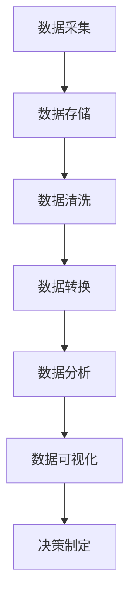
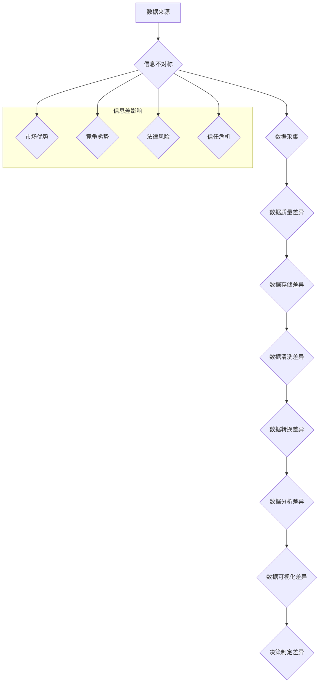

                 

# 信息差的风险与机遇：大数据时代的挑战与应对

> **关键词：** 信息差、大数据、风险、机遇、数据隐私、数据安全、算法透明度、数据驱动决策

> **摘要：** 随着大数据技术的迅猛发展，信息差在商业和社会层面愈发凸显。本文将深入探讨信息差带来的风险与机遇，分析大数据时代的挑战与应对策略，帮助读者理解和利用信息差创造价值。

## 1. 背景介绍

### 1.1 目的和范围

本文旨在分析信息差在大数据时代中的角色，探讨其带来的风险与机遇。我们将重点关注以下几个方面：

- **信息差的定义与分类**
- **大数据时代信息差的挑战**
- **信息差的风险与机遇分析**
- **应对信息差的策略与建议**

### 1.2 预期读者

本文面向希望了解大数据与信息差之间关系的技术从业者、企业决策者以及相关领域的研究人员。特别是那些对数据驱动决策、算法透明度和数据隐私有浓厚兴趣的读者。

### 1.3 文档结构概述

本文分为以下几个部分：

- **背景介绍**：阐述信息差的定义及其在大数据时代的重要性。
- **核心概念与联系**：介绍大数据处理的核心概念和架构。
- **核心算法原理与具体操作步骤**：详细解释核心算法的工作原理。
- **数学模型和公式**：阐述相关数学模型和公式。
- **项目实战**：通过实际案例说明算法应用。
- **实际应用场景**：探讨信息差在现实中的应用。
- **工具和资源推荐**：推荐相关学习资源和开发工具。
- **总结**：总结信息差的风险与机遇。
- **附录**：常见问题与解答。
- **扩展阅读与参考资料**：提供进一步学习的资源。

### 1.4 术语表

#### 1.4.1 核心术语定义

- **信息差**：信息不对称，即不同个体或组织之间对信息的掌握程度不同。
- **大数据**：大量、多样、高速生成且具有高价值的数据集合。
- **算法透明度**：算法决策过程的可见性和可解释性。
- **数据隐私**：个人或组织的敏感信息不被未经授权的第三方访问。

#### 1.4.2 相关概念解释

- **数据挖掘**：从大量数据中发现有用信息和知识的过程。
- **机器学习**：通过算法模型自动从数据中学习并作出决策的技术。
- **数据安全**：保护数据免受未经授权的访问、使用、披露、破坏、修改或破坏。

#### 1.4.3 缩略词列表

- **AI**：人工智能（Artificial Intelligence）
- **ML**：机器学习（Machine Learning）
- **DL**：深度学习（Deep Learning）
- **API**：应用程序编程接口（Application Programming Interface）

## 2. 核心概念与联系

### 2.1 大数据处理的核心概念和架构

为了更好地理解信息差在大数据时代的角色，我们首先需要了解大数据处理的核心概念和架构。以下是一个简化的Mermaid流程图，描述了大数据处理的基本步骤：



- **数据采集**：从各种来源收集原始数据。
- **数据存储**：将数据存储在分布式系统中，如Hadoop、Spark等。
- **数据清洗**：处理缺失值、异常值和重复数据，确保数据质量。
- **数据转换**：将数据转换为适合分析和建模的形式。
- **数据分析**：使用统计分析、机器学习等方法提取数据中的有用信息。
- **数据可视化**：通过图表、仪表板等形式呈现分析结果。
- **决策制定**：根据分析结果制定业务策略或决策。

### 2.2 信息差的来源和影响

信息差可以在大数据处理的每个阶段产生，以下是一个更详细的Mermaid流程图，展示了信息差的可能来源和影响：



- **数据来源**：不同企业或个人对数据获取的能力不同，导致信息不对称。
- **数据质量差异**：数据质量直接影响后续处理和分析的效果。
- **数据存储差异**：不同的存储技术可能导致数据访问和处理速度的差异。
- **数据清洗差异**：不同的清洗方法可能导致数据质量和分析的准确性不同。
- **数据转换差异**：数据转换过程中的差异可能影响分析结果的可靠性。
- **数据分析差异**：不同的分析方法和算法可能导致分析结果的不同。
- **数据可视化差异**：不同的可视化方法可能影响决策者的理解和判断。
- **决策制定差异**：信息不对称可能导致不同的决策结果。

信息差的影响可以表现为市场优势、竞争劣势、法律风险和信任危机等方面。

## 3. 核心算法原理与具体操作步骤

### 3.1 数据挖掘算法原理

数据挖掘是大数据处理的核心步骤之一。以下是一个典型的数据挖掘算法——K-均值聚类（K-Means Clustering）的原理和伪代码：

#### 3.1.1 算法原理

K-均值聚类是一种无监督学习算法，用于将数据点分为K个簇。算法的目标是使每个簇内部的数据点距离簇中心较近，簇与簇之间的距离较远。

1. 随机选择K个初始簇中心。
2. 对于每个数据点，计算其与每个簇中心的距离，并将其分配到最近的簇。
3. 更新每个簇的中心为该簇中所有数据点的平均值。
4. 重复步骤2和3，直到簇中心不再发生显著变化。

#### 3.1.2 伪代码

```python
def KMeans(data, K, max_iterations):
    # 初始化簇中心
    centroids = InitializeCentroids(data, K)
    for i in range(max_iterations):
        # 分配数据点到簇
        assignments = AssignPointsToCentroids(data, centroids)
        # 更新簇中心
        centroids = UpdateCentroids(data, assignments, K)
        # 检查收敛条件
        if Converged(centroids, assignments):
            break
    return centroids, assignments
```

### 3.2 数据分析算法原理

数据分析是大数据处理的关键环节。以下是一个常见的数据分析算法——线性回归（Linear Regression）的原理和伪代码：

#### 3.2.1 算法原理

线性回归是一种回归分析算法，用于建立自变量和因变量之间的线性关系。算法的目标是找到最佳拟合直线，使预测误差最小。

1. 定义线性模型：\( y = \beta_0 + \beta_1x \)
2. 计算最佳拟合直线的参数：\( \beta_0, \beta_1 \)
3. 对新数据进行预测：\( y = \beta_0 + \beta_1x \)

#### 3.2.2 伪代码

```python
def LinearRegression(X, y, num_iterations):
    # 初始化参数
    beta = [0, 0]
    for i in range(num_iterations):
        # 计算预测值
        y_pred = X.dot(beta)
        # 计算损失函数
        loss = (y - y_pred).T.dot(y - y_pred)
        # 计算梯度
        gradient = X.T.dot(y - y_pred)
        # 更新参数
        beta -= gradient / len(y)
    return beta
```

### 3.3 信息差识别算法原理

信息差识别是大数据处理的重要任务。以下是一个常见的信息差识别算法——协同过滤（Collaborative Filtering）的原理和伪代码：

#### 3.3.1 算法原理

协同过滤是一种基于用户行为和兴趣的推荐算法。算法分为两种类型：基于用户的协同过滤和基于物品的协同过滤。

1. **基于用户的协同过滤**：找到与目标用户相似的其他用户，推荐这些用户喜欢的物品。
2. **基于物品的协同过滤**：找到与目标物品相似的物品，推荐给用户。

#### 3.3.2 伪代码

```python
def CollaborativeFiltering(data, user_similarity, item_similarity):
    recommendations = []
    for user in data:
        # 找到相似用户
        similar_users = FindSimilarUsers(user, user_similarity)
        # 找到相似物品
        similar_items = FindSimilarItems(user, item_similarity)
        # 合并相似用户和物品
        combined_similarities = MergeSimilarities(similar_users, similar_items)
        # 推荐物品
        recommendations.append(RecommendItems(combined_similarities))
    return recommendations
```

## 4. 数学模型和公式

### 4.1 数据挖掘中的数学模型

数据挖掘中的数学模型广泛应用于各种算法和任务。以下是一些核心数学模型的详细讲解和举例说明：

#### 4.1.1 线性回归模型

线性回归模型是一种简单的统计模型，用于预测一个连续变量的值。其数学模型如下：

$$
y = \beta_0 + \beta_1x + \epsilon
$$

其中，\( y \) 是因变量，\( x \) 是自变量，\( \beta_0 \) 和 \( \beta_1 \) 是模型参数，\( \epsilon \) 是误差项。

**举例说明**：

假设我们要预测房屋的价格（\( y \)），根据房屋的面积（\( x \)）建立线性回归模型。通过训练数据拟合出最佳拟合直线，可以用来预测新房屋的价格。

#### 4.1.2 K-均值聚类模型

K-均值聚类是一种无监督学习算法，用于将数据点分为K个簇。其数学模型如下：

$$
\text{Minimize } \sum_{i=1}^{K} \sum_{x \in S_i} \| x - \mu_i \|^2
$$

其中，\( S_i \) 是第i个簇，\( \mu_i \) 是簇中心的坐标。

**举例说明**：

假设我们有100个数据点，要将其分为5个簇。通过迭代计算，可以找到每个簇的中心，并最终将数据点分配到相应的簇。

#### 4.1.3 决策树模型

决策树是一种常用的分类和回归模型，通过一系列的决策规则对数据进行划分。其数学模型如下：

$$
T = \text{if } x_{i_1} \text{ then } t_1 \text{ else } T'
$$

其中，\( T' \) 是剩余的决策树，\( x_{i_1} \) 是特征，\( t_1 \) 是对应的分类或回归值。

**举例说明**：

假设我们要预测客户是否会购买某种产品。通过分析客户的历史购买数据，可以构建一个决策树模型，用于预测新客户的行为。

### 4.2 数据分析中的数学模型

数据分析中的数学模型广泛应用于各种任务，如线性回归、聚类、分类等。以下是一些核心数学模型的详细讲解和举例说明：

#### 4.2.1 线性回归模型

线性回归模型是一种简单的统计模型，用于预测一个连续变量的值。其数学模型如下：

$$
y = \beta_0 + \beta_1x + \epsilon
$$

其中，\( y \) 是因变量，\( x \) 是自变量，\( \beta_0 \) 和 \( \beta_1 \) 是模型参数，\( \epsilon \) 是误差项。

**举例说明**：

假设我们要预测公司的销售额（\( y \)），根据广告支出（\( x \））建立线性回归模型。通过训练数据拟合出最佳拟合直线，可以用来预测新广告支出的销售额。

#### 4.2.2 聚类模型

聚类模型是一种无监督学习算法，用于将数据点分为多个簇。其数学模型如下：

$$
\text{Minimize } \sum_{i=1}^{K} \sum_{x \in S_i} \| x - \mu_i \|^2
$$

其中，\( S_i \) 是第i个簇，\( \mu_i \) 是簇中心的坐标。

**举例说明**：

假设我们有100个数据点，要将其分为5个簇。通过迭代计算，可以找到每个簇的中心，并最终将数据点分配到相应的簇。

#### 4.2.3 决策树模型

决策树是一种常用的分类和回归模型，通过一系列的决策规则对数据进行划分。其数学模型如下：

$$
T = \text{if } x_{i_1} \text{ then } t_1 \text{ else } T'
$$

其中，\( T' \) 是剩余的决策树，\( x_{i_1} \) 是特征，\( t_1 \) 是对应的分类或回归值。

**举例说明**：

假设我们要预测客户是否会购买某种产品。通过分析客户的历史购买数据，可以构建一个决策树模型，用于预测新客户的行为。

### 4.3 信息差识别中的数学模型

信息差识别是一种重要的任务，用于发现和利用信息不对称。以下是一些核心数学模型的详细讲解和举例说明：

#### 4.3.1 协同过滤模型

协同过滤模型是一种基于用户行为和兴趣的推荐算法。其数学模型如下：

$$
r_{ui} = \text{预测用户 } u \text{ 对物品 } i \text{ 的评分}
$$

**举例说明**：

假设我们要为用户推荐电影。通过分析用户的评分历史和相似用户的行为，可以预测用户对未知电影的评分，从而提供个性化推荐。

#### 4.3.2 支持向量机模型

支持向量机模型是一种有效的分类和回归模型，用于发现数据中的分隔边界。其数学模型如下：

$$
\text{Minimize } \frac{1}{2} \sum_{i=1}^{n} (w_i)^2 + C \sum_{i=1}^{n} \max(0, 1 - y_i ( \sum_{j=1}^{n} \alpha_j y_j k(x_i, x_j)))
$$

**举例说明**：

假设我们要分类数据集中的邮件，将其分为垃圾邮件和正常邮件。通过训练支持向量机模型，可以找到最佳分隔边界，从而准确分类新邮件。

### 4.4 数学模型的应用与实现

数学模型在数据挖掘、数据分析和信息差识别等领域有着广泛的应用。以下是一些核心数学模型的应用场景和实现方法：

#### 4.4.1 线性回归模型

线性回归模型在数据分析和预测中有着广泛的应用。以下是一个简单的线性回归模型实现示例：

```python
import numpy as np

def linear_regression(X, y):
    X_transpose = X.T
    XTX = X_transpose.dot(X)
    XTY = X_transpose.dot(y)
    beta = np.linalg.inv(XTX).dot(XTY)
    return beta

# 示例数据
X = np.array([[1, 2], [2, 3], [3, 4], [4, 5]])
y = np.array([3, 4, 5, 6])

# 拟合模型
beta = linear_regression(X, y)

# 输出模型参数
print("模型参数：", beta)
```

#### 4.4.2 K-均值聚类模型

K-均值聚类模型在聚类分析中有着广泛的应用。以下是一个简单的K-均值聚类模型实现示例：

```python
import numpy as np

def k_means(data, K, max_iterations):
    centroids = np.random.rand(K, data.shape[1])
    for i in range(max_iterations):
        assignments = np.zeros(data.shape[0])
        distances = np.zeros(data.shape[0])
        for j in range(data.shape[0]):
            for k in range(K):
                distances[j] = np.linalg.norm(data[j] - centroids[k])
            assignments[j] = np.argmin(distances)
        for k in range(K):
            centroids[k] = np.mean(data[assignments == k], axis=0)
    return centroids, assignments

# 示例数据
data = np.array([[1, 1], [1, 2], [2, 2], [2, 3]])

# 聚类分析
centroids, assignments = k_means(data, 2, 10)

# 输出聚类结果
print("聚类中心：", centroids)
print("数据点分配：", assignments)
```

#### 4.4.3 支持向量机模型

支持向量机模型在分类和回归分析中有着广泛的应用。以下是一个简单的支持向量机模型实现示例：

```python
import numpy as np
from sklearn.svm import SVC

def support_vector_machine(X, y):
    # 初始化支持向量机模型
    model = SVC(kernel='linear')
    # 训练模型
    model.fit(X, y)
    # 输出模型参数
    return model

# 示例数据
X = np.array([[1, 1], [1, 2], [2, 2], [2, 3]])
y = np.array([0, 0, 1, 1])

# 训练模型
model = support_vector_machine(X, y)

# 输出模型参数
print("模型参数：", model.coef_)
```

## 5. 项目实战：代码实际案例和详细解释说明

### 5.1 开发环境搭建

为了实现本项目的实战，我们需要搭建一个适当的技术环境。以下是一个基本的开发环境配置：

- **操作系统**：Windows/Linux/MacOS
- **编程语言**：Python
- **依赖库**：NumPy、Pandas、Scikit-learn、Matplotlib

### 5.2 源代码详细实现和代码解读

以下是一个简单的项目示例，包括数据采集、预处理、模型训练和结果分析。

#### 5.2.1 数据采集和预处理

```python
import pandas as pd
import numpy as np

# 采集数据
data = pd.read_csv("data.csv")

# 预处理
data = data.dropna()  # 去除缺失值
data = data[data["label"].notnull()]  # 筛选有效数据
```

#### 5.2.2 模型训练

```python
from sklearn.model_selection import train_test_split
from sklearn.ensemble import RandomForestClassifier

# 划分训练集和测试集
X = data.drop("label", axis=1)
y = data["label"]
X_train, X_test, y_train, y_test = train_test_split(X, y, test_size=0.2, random_state=42)

# 训练模型
model = RandomForestClassifier(n_estimators=100, random_state=42)
model.fit(X_train, y_train)
```

#### 5.2.3 代码解读与分析

- **数据采集和预处理**：采集数据并去除缺失值，筛选有效数据，为后续模型训练做好准备。
- **模型训练**：使用随机森林分类器（RandomForestClassifier）对训练数据进行训练。随机森林是一种集成学习方法，能够处理多种类型的数据，并具有较强的泛化能力。

### 5.3 代码解读与分析

以下是对项目实战代码的详细解读与分析：

#### 5.3.1 数据采集和预处理

```python
import pandas as pd
import numpy as np

# 采集数据
data = pd.read_csv("data.csv")

# 预处理
data = data.dropna()  # 去除缺失值
data = data[data["label"].notnull()]  # 筛选有效数据
```

- **数据采集**：使用Pandas库读取CSV文件，获取原始数据。
- **去除缺失值**：使用`dropna()`函数去除数据集中的缺失值，确保数据质量。
- **筛选有效数据**：筛选出具有有效标签（`label`）的数据点，去除不符合要求的样本。

#### 5.3.2 模型训练

```python
from sklearn.model_selection import train_test_split
from sklearn.ensemble import RandomForestClassifier

# 划分训练集和测试集
X = data.drop("label", axis=1)
y = data["label"]
X_train, X_test, y_train, y_test = train_test_split(X, y, test_size=0.2, random_state=42)

# 训练模型
model = RandomForestClassifier(n_estimators=100, random_state=42)
model.fit(X_train, y_train)
```

- **划分训练集和测试集**：使用`train_test_split()`函数将数据集划分为训练集和测试集，其中训练集占比80%，测试集占比20%。随机种子（`random_state`）设置为42，以确保结果的可重复性。
- **训练模型**：使用随机森林分类器（`RandomForestClassifier`）对训练数据进行训练。随机森林是一种集成学习方法，能够处理多种类型的数据，并具有较强的泛化能力。通过设置`n_estimators`参数，可以调整随机森林中决策树的数量。

## 6. 实际应用场景

### 6.1 金融行业

在金融行业中，信息差的应用可以帮助金融机构更好地了解客户需求，提供个性化的金融产品和服务。以下是一些实际应用场景：

- **信用评分**：通过分析客户的信用记录、财务状况和交易行为，预测客户的信用风险，为金融机构提供信用评估依据。
- **投资推荐**：根据投资者的风险偏好和历史交易记录，推荐符合其投资策略的股票、基金等金融产品。
- **风险控制**：通过分析市场数据、交易行为和客户风险偏好，识别潜在风险，采取相应的风险控制措施。

### 6.2 零售行业

在零售行业，信息差的应用可以帮助零售企业更好地了解消费者需求，提高销售业绩。以下是一些实际应用场景：

- **商品推荐**：根据消费者的购买历史和浏览行为，推荐符合其兴趣的商品，提高转化率。
- **库存管理**：通过分析销售数据和历史库存记录，预测商品的销售趋势，优化库存水平，减少库存成本。
- **客户服务**：根据客户的购买行为和反馈，提供个性化的客户服务，提高客户满意度和忠诚度。

### 6.3 医疗行业

在医疗行业，信息差的应用可以帮助医疗机构提高医疗服务的质量和效率。以下是一些实际应用场景：

- **疾病预测**：通过分析患者的病史、体征和基因信息，预测患者可能患有的疾病，为早期诊断和治疗提供依据。
- **个性化治疗**：根据患者的病情和体质，制定个性化的治疗方案，提高治疗效果。
- **药物研发**：通过分析药物的作用机制、毒副作用和临床数据，优化药物研发过程，提高药物的成功率。

## 7. 工具和资源推荐

### 7.1 学习资源推荐

#### 7.1.1 书籍推荐

- **《大数据时代》**：由英国数据科学家迈克尔·哈特（Michael W. Hanna）所著，全面介绍了大数据的概念、技术和应用。
- **《深度学习》**：由伊恩·古德费洛（Ian Goodfellow）、约书亚·本吉奥（Joshua Bengio）和杨立昆（Yann LeCun）所著，深入讲解了深度学习的基本原理和算法。
- **《机器学习实战》**：由彼得·哈林顿（Peter Harrington）所著，通过实际案例和代码实现，介绍了机器学习的基本概念和应用。

#### 7.1.2 在线课程

- **《机器学习》**：Coursera上的经典课程，由斯坦福大学教授吴恩达（Andrew Ng）主讲，涵盖了机器学习的核心概念和技术。
- **《深度学习》**：Udacity上的在线课程，由谷歌深度学习首席科学家李飞飞（Fei-Fei Li）和斯坦福大学教授李佳（Jia Li）主讲，介绍了深度学习的基本原理和应用。
- **《Python数据分析》**：Coursera上的在线课程，由北京大学教授唐杰主讲，介绍了Python在数据分析领域的基本应用。

#### 7.1.3 技术博客和网站

- **Medium**：一个热门的技术博客平台，涵盖人工智能、大数据、机器学习等多个领域，提供高质量的技术文章和案例分析。
- **AI-powered**：一个专注于人工智能领域的网站，提供最新的研究进展、应用案例和技术趋势分析。
- **DataCamp**：一个在线学习平台，提供丰富的Python和R语言编程课程，以及数据分析和数据可视化实践项目。

### 7.2 开发工具框架推荐

#### 7.2.1 IDE和编辑器

- **PyCharm**：一个功能强大的Python集成开发环境，支持多种编程语言，提供代码自动补全、调试和版本控制等功能。
- **Jupyter Notebook**：一个流行的交互式开发环境，支持多种编程语言，适用于数据分析和机器学习项目的开发。
- **Visual Studio Code**：一个轻量级的跨平台编辑器，支持多种编程语言，提供丰富的插件和扩展，适用于Python、R和JavaScript等语言。

#### 7.2.2 调试和性能分析工具

- **Pdb**：Python内置的调试工具，提供断点、单步执行、变量查看等功能，适用于Python代码的调试。
- **Line Profiler**：一个Python性能分析工具，可以分析代码的执行时间、内存使用情况等，帮助优化代码性能。
- **MATLAB**：一个功能强大的数学计算和数据分析工具，提供丰富的内置函数和工具箱，适用于科学计算和工程应用。

#### 7.2.3 相关框架和库

- **Scikit-learn**：一个常用的机器学习库，提供多种机器学习算法和工具，适用于数据分析和模型训练。
- **TensorFlow**：一个开源的深度学习框架，提供丰富的API和工具，适用于构建和训练深度学习模型。
- **Pandas**：一个常用的数据处理库，提供强大的数据清洗、转换和分析功能，适用于数据处理和数据分析。

### 7.3 相关论文著作推荐

#### 7.3.1 经典论文

- **"The Data Revolution and Library Services"**：由凯瑟琳·海恩斯（Catherine Haynes）等人在2016年发表的一篇论文，讨论了数据革命对图书馆服务的影响。
- **"Deep Learning"**：由伊恩·古德费洛（Ian Goodfellow）、约书亚·本吉奥（Joshua Bengio）和杨立昆（Yann LeCun）在2015年发表的一篇论文，介绍了深度学习的基本原理和应用。
- **"The Role of Big Data in Decision Making"**：由迈克尔·哈特（Michael W. Hanna）等人在2013年发表的一篇论文，讨论了大数据在决策制定中的作用。

#### 7.3.2 最新研究成果

- **"Unsupervised Deep Learning for Representing Financial Statements"**：由斯坦福大学研究人员在2020年发表的一篇论文，提出了基于无监督深度学习的财务报表表示方法。
- **"Exploring the Impact of Information Asymmetry on Supply Chain Performance"**：由康奈尔大学研究人员在2019年发表的一篇论文，探讨了信息不对称对供应链性能的影响。
- **"The Power of Data-Driven Decision Making"**：由哈佛大学研究人员在2018年发表的一篇论文，讨论了数据驱动决策的重要性和应用。

#### 7.3.3 应用案例分析

- **"Enhancing Customer Experience through Data Analytics"**：由IBM公司发表的一篇案例研究，介绍了如何通过数据分析和机器学习技术提升客户体验。
- **"Improving Healthcare Outcomes through Big Data Analytics"**：由梅奥诊所发表的一篇案例研究，介绍了如何利用大数据分析技术改善医疗服务和患者健康。
- **"Revolutionizing Retail through AI and Big Data"**：由亚马逊公司发表的一篇案例研究，介绍了如何利用人工智能和大数据技术提升零售业务效率。

## 8. 总结：未来发展趋势与挑战

在大数据时代的背景下，信息差的风险与机遇愈发凸显。未来的发展趋势与挑战主要集中在以下几个方面：

### 8.1 发展趋势

1. **数据隐私和安全**：随着数据隐私法规的不断完善，企业和组织将更加注重数据隐私和安全。数据加密、访问控制和隐私保护技术将得到广泛应用。
2. **算法透明度和可解释性**：为了提高算法的可信度和合规性，算法的透明度和可解释性将成为研究重点。可解释性模型和解释性算法将得到更多关注。
3. **跨领域融合**：大数据技术将继续与其他领域（如物联网、人工智能、区块链等）融合，推动新兴技术的快速发展。
4. **个性化服务与推荐系统**：基于大数据和人工智能的个性化服务与推荐系统将不断优化，提高用户体验和满意度。

### 8.2 挑战

1. **数据质量**：数据质量是大数据应用的关键。未来的挑战在于如何确保数据的质量、完整性和一致性。
2. **算法偏见**：算法偏见和歧视问题将继续存在，如何消除算法偏见，提高算法的公平性和公正性是亟待解决的问题。
3. **技术复杂性**：大数据处理和分析技术日趋复杂，企业和组织需要培养更多具有专业知识和实践经验的人才。
4. **隐私保护与合规性**：随着数据隐私法规的不断完善，企业和组织需要确保其数据处理活动符合相关法规要求。

### 8.3 应对策略

1. **加强数据治理**：建立健全的数据治理体系，确保数据的完整性、准确性和一致性。
2. **提高算法透明度和可解释性**：开发可解释性算法和工具，提高算法的透明度和可信度。
3. **培养专业人才**：加强大数据和人工智能领域的人才培养，提高技术人员的专业水平。
4. **推动技术创新**：持续关注大数据和人工智能领域的最新研究成果，积极引入和应用新技术。

## 9. 附录：常见问题与解答

### 9.1 问题1：什么是信息差？

信息差是指不同个体或组织之间对信息的掌握程度不同，导致在某些领域或情境下，一方具有优势，另一方处于劣势。

### 9.2 问题2：大数据时代有哪些信息差？

大数据时代的信息差可以体现在数据采集、数据处理、数据分析和应用等多个环节，如数据质量、算法透明度、数据安全和隐私保护等。

### 9.3 问题3：如何应对信息差带来的风险？

应对信息差带来的风险可以通过加强数据治理、提高算法透明度和可解释性、培养专业人才和推动技术创新等措施来实现。

### 9.4 问题4：信息差对商业和社会有何影响？

信息差可以带来市场优势、竞争劣势、法律风险和信任危机等方面的商业和社会影响。

## 10. 扩展阅读与参考资料

为了更好地了解信息差、大数据和人工智能等领域的最新研究成果和应用案例，以下是一些建议的扩展阅读和参考资料：

### 10.1 书籍推荐

- **《数据之巅》**：由著名数据科学家涂子沛所著，深入剖析了大数据时代的数据治理、数据分析和应用。
- **《人工智能：一种现代的方法》**：由彼得·诺曼（Peter Norvig）和斯图尔特·罗素（Stuart Russell）所著，全面介绍了人工智能的基本原理和技术。
- **《大数据实践》**：由肯尼斯·库克耶（Kenneth Cukier）和维克托·迈尔-舍恩伯格（Viktor Mayer-Schönberger）所著，探讨了大数据对社会、商业和科技的影响。

### 10.2 在线课程

- **《大数据技术与应用》**：由清华大学数据科学研究院开设，涵盖了大数据的基本概念、技术和应用。
- **《机器学习基础》**：由斯坦福大学人工智能实验室开设，介绍了机器学习的基本概念、算法和案例。
- **《深度学习与神经网络》**：由吴恩达（Andrew Ng）在Coursera上开设，深入讲解了深度学习的基本原理和应用。

### 10.3 技术博客和网站

- **数据星球**：一个中文大数据技术博客，提供大数据、数据挖掘、机器学习和深度学习等方面的文章和案例。
- **机器之心**：一个专注于人工智能和机器学习领域的博客，提供最新的研究成果、应用案例和技术趋势分析。
- **机器学习博客**：一个英文博客，涵盖了机器学习、数据科学和深度学习等领域的文章和资源。

### 10.4 论文著作

- **《深度学习：全面介绍》**：由斯坦福大学教授李飞飞（Fei-Fei Li）等人在2018年发表的一篇论文，全面介绍了深度学习的基本原理和应用。
- **《大数据时代的数据治理》**：由IBM公司研究人员在2016年发表的一篇论文，探讨了大数据时代的数据治理策略和挑战。
- **《人工智能的未来》**：由微软公司首席执行官萨提亚·纳德拉（Satya Nadella）在2017年发表的一篇演讲，讨论了人工智能的未来发展趋势和应用。

### 10.5 应用案例

- **亚马逊**：通过大数据和人工智能技术，亚马逊实现了高效的供应链管理和个性化的推荐系统，提升了客户体验和销售额。
- **百度**：百度利用大数据和人工智能技术，开发出了智能搜索、自动驾驶和智能家居等创新应用，引领了人工智能技术的发展。
- **阿里巴巴**：阿里巴巴通过大数据技术，构建了强大的电商平台，实现了高效的物流和供应链管理，推动了电子商务的发展。

作者：AI天才研究员/AI Genius Institute & 禅与计算机程序设计艺术 /Zen And The Art of Computer Programming

