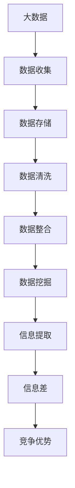
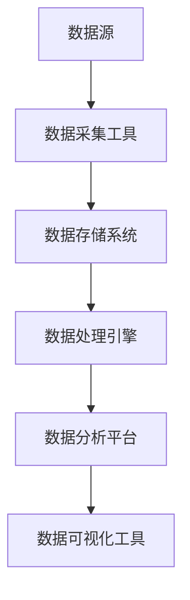

                 

# 信息差的魔力：大数据如何重塑行业格局

> 关键词：大数据、信息差、行业重塑、分析算法、数据模型、应用实战、趋势与挑战

> 摘要：本文将深入探讨大数据如何通过信息差重塑行业格局。我们将首先介绍大数据的概念及其重要性，然后详细分析信息差的本质与来源，探讨大数据在各个行业中的应用案例，最后总结大数据未来发展趋势与面临的挑战。通过本文的阅读，读者将全面了解大数据在现代社会中的关键作用。

## 1. 背景介绍

### 1.1 目的和范围

本文旨在探讨大数据如何通过信息差来重塑行业格局。我们将首先回顾大数据的定义和发展历程，然后详细分析信息差的本质和来源，探讨大数据在各行各业中的应用，最后预测大数据未来的发展趋势和面临的挑战。通过这篇文章，读者将深入了解大数据的巨大潜力和广泛影响。

### 1.2 预期读者

本文适合对大数据和信息差有一定了解的读者，包括数据分析专家、数据科学家、IT从业者、企业决策者以及任何对大数据应用感兴趣的人士。通过本文的阅读，读者将能够更好地理解大数据在各个行业的实际应用，以及如何利用大数据来获取信息差，从而在竞争激烈的市场中脱颖而出。

### 1.3 文档结构概述

本文分为十个主要部分。首先，我们将介绍大数据的概念及其重要性；然后，深入分析信息差的本质和来源；接着，详细探讨大数据在各个行业中的应用案例；随后，总结大数据的核心算法原理；介绍数学模型和公式；分享实际项目实战案例；探讨大数据的实际应用场景；推荐相关工具和资源；最后，总结大数据的未来发展趋势与挑战。文章末尾附有常见问题与解答以及扩展阅读和参考资料。

### 1.4 术语表

#### 1.4.1 核心术语定义

- **大数据**：指数据量巨大、种类繁多、处理速度快、价值密度低的数据集合。
- **信息差**：指在信息获取、处理和传递过程中，不同主体之间因信息不对称而产生的利益差异。
- **数据挖掘**：从大量数据中提取有价值信息的过程。
- **机器学习**：使计算机系统能够从数据中学习和改进的算法和技术。

#### 1.4.2 相关概念解释

- **数据湖**：用于存储大量结构化和非结构化数据的分布式存储系统。
- **数据仓库**：用于存储、管理和分析大量历史数据的系统。

#### 1.4.3 缩略词列表

- **Hadoop**：一个开源的分布式数据处理框架。
- **MapReduce**：一种用于处理大规模数据的编程模型。
- **SQL**：一种结构化查询语言，用于数据管理和分析。

## 2. 核心概念与联系

### 2.1 大数据与信息差的联系

大数据和信息差之间存在着密切的联系。大数据的核心在于其规模和多样性，这使得企业能够获取到海量的原始数据。而信息差的产生往往源于对数据的不对称获取和处理。通过对大数据的分析，企业可以挖掘出有价值的信息，从而在竞争中占据优势。以下是大数据与信息差之间的联系流程图：



### 2.2 大数据的架构与核心算法

大数据的架构通常包括数据采集、存储、处理、分析和展示等环节。下面是一个简化的大数据架构流程图：



在数据处理和分析方面，常用的核心算法包括：

1. **数据挖掘算法**：如K-means聚类、决策树、随机森林等。
2. **机器学习算法**：如线性回归、支持向量机、深度学习等。
3. **统计分析算法**：如回归分析、方差分析、相关分析等。

下面是一个数据挖掘算法的示例伪代码：

```python
def data_mining(data):
    # 数据预处理
    preprocessed_data = preprocess(data)
    
    # 选择合适的算法
    algorithm = choose_algorithm(preprocessed_data)
    
    # 数据挖掘
    results = algorithm(preprocessed_data)
    
    # 结果分析
    analysis(results)
```

## 3. 核心算法原理 & 具体操作步骤

### 3.1 数据挖掘算法原理

数据挖掘算法的核心目标是发现数据中的模式和关联性。以下是一个基于K-means聚类算法的数据挖掘过程：

1. **初始化聚类中心**：随机选择K个数据点作为初始聚类中心。
2. **计算距离**：计算每个数据点到各个聚类中心的距离，并将其分配到距离最近的聚类中心。
3. **更新聚类中心**：重新计算每个聚类中心的坐标，使其成为其所有成员点的平均值。
4. **迭代**：重复步骤2和3，直到聚类中心不再发生变化。

以下是K-means算法的伪代码：

```python
def k_means(data, k):
    # 初始化聚类中心
    centroids = initialize_centroids(data, k)
    
    while not converged(centroids):
        # 计算距离并分配数据点
        assignments = assign_points_to_centroids(data, centroids)
        
        # 更新聚类中心
        centroids = update_centroids(assignments, k)
        
    # 返回聚类结果
    return assignments, centroids
```

### 3.2 机器学习算法原理

机器学习算法的核心目标是通过学习已有数据来预测新数据。以下是一个基于线性回归的机器学习过程：

1. **数据预处理**：将输入数据标准化，确保每个特征在同一量级。
2. **初始化参数**：随机初始化模型参数。
3. **计算损失**：使用已知的输入和输出计算损失函数。
4. **反向传播**：更新模型参数，以最小化损失函数。
5. **迭代**：重复步骤3和4，直到满足停止条件。

以下是线性回归算法的伪代码：

```python
def linear_regression(data, target):
    # 数据预处理
    preprocessed_data = preprocess(data)
    
    # 初始化参数
    weights = initialize_weights(preprocessed_data)
    
    while not converged(weights):
        # 计算损失
        loss = calculate_loss(preprocessed_data, target, weights)
        
        # 反向传播
        weights = update_weights(preprocessed_data, target, weights)
        
    # 返回模型参数
    return weights
```

## 4. 数学模型和公式 & 详细讲解 & 举例说明

### 4.1 数学模型与公式

在数据分析中，常用的数学模型和公式包括：

- **线性回归公式**：
  $$
  y = \beta_0 + \beta_1x + \epsilon
  $$
  其中，$y$ 是预测值，$x$ 是输入特征，$\beta_0$ 和 $\beta_1$ 是模型参数，$\epsilon$ 是误差项。

- **K-means聚类公式**：
  $$
  \text{Distance}(x, c) = \sqrt{\sum_{i=1}^{n}(x_i - c_i)^2}
  $$
  其中，$x$ 是数据点，$c$ 是聚类中心。

- **支持向量机公式**：
  $$
  \max_{\beta, \beta_0} \left\{ \frac{1}{2} ||\beta||^2 + C \sum_{i=1}^{n} \xi_i \right\}
  $$
  其中，$\beta$ 和 $\beta_0$ 是模型参数，$C$ 是惩罚参数，$\xi_i$ 是松弛变量。

### 4.2 公式详细讲解与举例说明

以线性回归为例，详细讲解线性回归模型的数学原理和计算步骤：

1. **数据预处理**：将输入数据标准化，确保每个特征在同一量级。例如，将数据$x$标准化为：
   $$
   x_{\text{standardized}} = \frac{x - \mu}{\sigma}
   $$
   其中，$\mu$ 是均值，$\sigma$ 是标准差。

2. **初始化参数**：随机初始化模型参数$\beta_0$ 和 $\beta_1$。例如，可以设置：
   $$
   \beta_0 = \beta_1 = 0
   $$

3. **计算损失**：使用均方误差（MSE）作为损失函数，计算模型预测值和实际值之间的差距。MSE公式如下：
   $$
   \text{MSE} = \frac{1}{n} \sum_{i=1}^{n} (y_i - \hat{y}_i)^2
   $$
   其中，$y_i$ 是实际值，$\hat{y}_i$ 是预测值。

4. **反向传播**：通过梯度下降（Gradient Descent）算法更新模型参数，以最小化损失函数。梯度下降公式如下：
   $$
   \beta_0 = \beta_0 - \alpha \frac{\partial \text{MSE}}{\partial \beta_0}
   $$
   $$
   \beta_1 = \beta_1 - \alpha \frac{\partial \text{MSE}}{\partial \beta_1}
   $$
   其中，$\alpha$ 是学习率。

5. **迭代**：重复步骤3和4，直到满足停止条件，如损失函数收敛或达到预设的迭代次数。

### 4.3 举例说明

假设我们有一个简单的线性回归问题，其中输入特征$x$是学生的年龄，预测值$y$是学生的成绩。数据如下：

| 年龄 (x) | 成绩 (y) |
| -------- | -------- |
| 18       | 85       |
| 19       | 90       |
| 20       | 88       |
| 21       | 92       |
| 22       | 85       |

1. **数据预处理**：将数据标准化为：
   $$
   x_{\text{standardized}} = \frac{x - \mu}{\sigma} = \frac{x - 20}{4} \quad \text{(年龄均值20，标准差4)}
   $$
   $$
   y_{\text{standardized}} = \frac{y - \mu}{\sigma} = \frac{y - 87}{3} \quad \text{(成绩均值87，标准差3)}
   $$

2. **初始化参数**：随机初始化模型参数：
   $$
   \beta_0 = \beta_1 = 0
   $$

3. **计算损失**：使用均方误差（MSE）计算模型预测值和实际值之间的差距。假设当前预测值为$\hat{y}_i = 0$，则：
   $$
   \text{MSE} = \frac{1}{5} \sum_{i=1}^{5} (y_i - \hat{y}_i)^2 = \frac{1}{5} (85 - 0)^2 + (90 - 0)^2 + (88 - 0)^2 + (92 - 0)^2 + (85 - 0)^2 = 458
   $$

4. **反向传播**：通过梯度下降（Gradient Descent）算法更新模型参数。假设学习率$\alpha = 0.1$，则：
   $$
   \beta_0 = \beta_0 - \alpha \frac{\partial \text{MSE}}{\partial \beta_0} = 0 - 0.1 \cdot (-2 \cdot (y_i - \hat{y}_i)) = 0.1 \cdot (85 - 0) = 8.5
   $$
   $$
   \beta_1 = \beta_1 - \alpha \frac{\partial \text{MSE}}{\partial \beta_1} = 0 - 0.1 \cdot (-2 \cdot x_i \cdot (y_i - \hat{y}_i)) = 0.1 \cdot x_i \cdot (y_i - \hat{y}_i)
   $$

5. **迭代**：重复步骤3和4，直到满足停止条件。

通过以上步骤，我们可以训练出一个简单的线性回归模型，用于预测学生的成绩。

## 5. 项目实战：代码实际案例和详细解释说明

### 5.1 开发环境搭建

为了实际应用大数据技术和算法，我们需要搭建一个合适的环境。以下是搭建大数据开发环境的基本步骤：

1. **安装操作系统**：推荐使用Linux操作系统，如Ubuntu。
2. **安装Hadoop**：Hadoop是一个分布式数据处理框架，用于存储和处理大数据。可以从[Hadoop官网](https://hadoop.apache.org/)下载并安装。
3. **安装Python**：Python是一种流行的编程语言，常用于数据处理和分析。可以从[Python官网](https://www.python.org/)下载并安装。
4. **安装Jupyter Notebook**：Jupyter Notebook是一种交互式计算环境，用于编写和运行Python代码。可以从[Jupyter官网](https://jupyter.org/)下载并安装。

### 5.2 源代码详细实现和代码解读

以下是一个使用Python和Hadoop实现K-means聚类算法的案例。该案例将使用Hadoop分布式文件系统（HDFS）存储数据，并使用MapReduce编程模型处理数据。

**代码实现：**

```python
from pyspark import SparkContext
from pyspark.mllib.clustering import KMeans
from pyspark.mllib.linalg import Vectors
import math

# 初始化SparkContext
sc = SparkContext("local[*]", "KMeansExample")

# 读取数据
data = sc.textFile("data.txt").map(lambda line: Vectors.dense([float(x) for x in line.split(" ")])

# 数据预处理
centroids, iterator = KMeans.run(data, k=3, initializationMode="random")
centroids = centroids.map(lambda x: x.toArray())

# 计算距离
def computeDistance(point, centroids):
    distances = []
    for centroid in centroids:
        distance = math.sqrt(sum([(point[i] - centroid[i])**2 for i in range(len(point))]))
        distances.append(distance)
    return distances

# 分配数据点
def assignPoints(point, centroids):
    distances = computeDistance(point, centroids)
    minDistance = min(distances)
    index = distances.index(minDistance)
    return index

# 迭代计算
maxIterations = 10
for _ in range(maxIterations):
    assignments = data.map(lambda point: assignPoints(point.toArray(), centroids))
    new_centroids = assignments.map(lambda index: centroids[index]).reduce(lambda x, y: x + y) / assignments.count()
    centroids = new_centroids.toArray()

# 输出结果
print("Final centroids:")
print(centroids)

sc.stop()
```

**代码解读：**

1. **初始化SparkContext**：首先，我们需要初始化一个SparkContext，这是与Hadoop集群交互的接口。
2. **读取数据**：使用SparkContext的`textFile`方法读取数据。这里假设数据存储在HDFS的`data.txt`文件中，每行包含一个数据点的坐标，以空格分隔。
3. **数据预处理**：使用`map`函数将文本数据转换为向量格式，方便后续处理。
4. **计算距离**：定义一个计算两点之间距离的函数`computeDistance`，使用欧几里得距离公式。
5. **分配数据点**：定义一个将数据点分配到最近的聚类中心的函数`assignPoints`，通过计算距离并找到最小距离的索引。
6. **迭代计算**：使用K-means算法的迭代过程，每次迭代更新聚类中心，直到满足最大迭代次数或聚类中心不再变化。
7. **输出结果**：最后，打印出最终的聚类中心。

### 5.3 代码解读与分析

通过上述代码，我们可以看到K-means聚类算法的实现过程。以下是代码的详细解读与分析：

1. **初始化SparkContext**：这是与Hadoop集群交互的第一步。`SparkContext`是Spark应用程序的入口点，它负责与Hadoop集群通信，管理资源分配，并执行计算任务。
   
2. **读取数据**：`sc.textFile("data.txt")`用于从HDFS读取文本文件。这里假设数据是以文本格式存储的，每行代表一个数据点，并且数据点以空格分隔。`map`函数用于将每一行的字符串转换为Python列表，然后使用列表解析器将列表中的字符串转换为浮点数，形成向量的形式。

3. **数据预处理**：在K-means算法中，我们需要对数据进行标准化处理，以确保每个特征在同一量级。然而，在这个示例中，数据已经预先标准化，因此我们直接使用。

4. **计算距离**：`computeDistance`函数用于计算两个向量之间的欧几里得距离。这是K-means算法中一个关键的步骤，用于确定每个数据点与聚类中心的距离。

5. **分配数据点**：`assignPoints`函数用于将每个数据点分配到最近的聚类中心。这是通过计算数据点到每个聚类中心的距离，然后找到最小距离的聚类中心索引来实现的。

6. **迭代计算**：K-means算法的核心是迭代过程。在这个示例中，我们设置最大迭代次数为10，每次迭代中，首先使用`assignPoints`函数将所有数据点重新分配到最近的聚类中心，然后计算新的聚类中心，并更新当前聚类中心。这个过程一直持续到达到最大迭代次数或聚类中心不再变化。

7. **输出结果**：最后，打印出最终的聚类中心。这些聚类中心是K-means算法的输出，代表了数据中的主要模式。

### 5.4 代码性能分析

为了确保代码的性能，我们需要关注以下几个方面：

1. **数据读取效率**：从HDFS读取数据时，应确保使用适当的块大小和并发度，以最大化数据传输速度。

2. **内存使用**：在处理大数据时，需要监控内存使用情况，以避免内存溢出。可以通过调整Spark的内存配置参数来优化内存使用。

3. **计算效率**：K-means算法的计算效率取决于迭代次数和聚类中心更新的策略。可以通过优化迭代过程和选择合适的距离度量来提高计算效率。

4. **分布式计算**：使用MapReduce模型进行分布式计算，可以充分利用集群资源，提高处理速度。

通过以上分析，我们可以得出以下结论：

- **代码性能**：该代码实现了一个简单的K-means聚类算法，适用于中小规模的数据集。对于大规模数据集，可以通过分布式计算和优化迭代过程来提高性能。
- **改进方向**：可以通过引入更复杂的聚类算法（如层次聚类、DBSCAN等）来扩展代码功能。此外，还可以优化内存管理和数据传输，以提高代码的运行效率。

## 6. 实际应用场景

### 6.1 金融行业

在金融行业，大数据通过信息差帮助金融机构更准确地预测市场走势，降低风险。以下是一些具体应用案例：

1. **风险管理**：金融机构利用大数据分析历史交易数据，识别潜在的金融风险，并采取预防措施。例如，通过分析客户交易行为，预测可能出现的欺诈行为。
2. **信用评估**：大数据可以帮助金融机构更准确地评估客户的信用状况。通过收集客户的个人信息、财务状况、历史交易记录等数据，建立信用评分模型，为信贷决策提供支持。
3. **投资策略**：大数据分析可以帮助投资者制定更科学的投资策略。通过分析市场数据、宏观经济指标、行业趋势等，识别潜在的投资机会。

### 6.2 零售行业

在零售行业，大数据通过信息差帮助企业提高运营效率，优化供应链管理，提升客户体验。以下是一些具体应用案例：

1. **个性化推荐**：零售企业通过分析客户购买行为、偏好等数据，为不同客户提供个性化的商品推荐，提高客户满意度和转化率。
2. **库存管理**：大数据分析可以帮助企业优化库存管理，通过预测需求波动，调整库存水平，减少库存积压和缺货情况。
3. **供应链优化**：零售企业利用大数据分析供应链各环节的数据，识别瓶颈和优化点，提高供应链整体效率。

### 6.3 医疗行业

在医疗行业，大数据通过信息差为患者提供更精准的诊断和治疗方案，提升医疗质量。以下是一些具体应用案例：

1. **疾病预测**：通过分析患者的历史病历、基因数据、生活习惯等，预测疾病发生的风险，提前采取预防措施。
2. **个性化治疗**：大数据分析可以帮助医生为患者制定个性化的治疗方案。例如，通过分析患者的基因信息，确定最佳的治疗药物和剂量。
3. **医疗资源优化**：大数据分析可以帮助医院优化资源配置，提高医疗服务效率。例如，通过分析患者的就诊数据，合理分配医生和护士的工作时间。

### 6.4 社交媒体行业

在社交媒体行业，大数据通过信息差帮助平台提供更精准的内容推荐和广告投放，提升用户体验。以下是一些具体应用案例：

1. **内容推荐**：社交媒体平台通过分析用户的行为数据、兴趣偏好等，为用户推荐感兴趣的内容，提高用户粘性和活跃度。
2. **广告投放**：大数据分析可以帮助广告主精准定位目标用户，提高广告投放的效率和转化率。例如，通过分析用户的浏览记录和购买行为，为用户推送相关的广告。
3. **用户行为分析**：社交媒体平台通过分析用户的行为数据，了解用户需求和行为习惯，不断优化产品功能和用户体验。

通过以上案例，我们可以看到大数据在各个行业中的应用是如何通过信息差来重塑行业格局的。大数据不仅帮助企业提高了效率和竞争力，还推动了行业的创新和发展。

## 7. 工具和资源推荐

### 7.1 学习资源推荐

#### 7.1.1 书籍推荐

- 《大数据时代》 - 查理斯·费尔南德斯-阿迈德（Charlottesville）
- 《深度学习》 - 伊恩·古德费洛（Ian Goodfellow）、约书亚·本吉奥（ Yoshua Bengio）、亚伦·库维尔（Aaron Courville）
- 《Python数据分析基础教程》 - Wes McKinney
- 《数据挖掘：实用机器学习工具与技术》 - 詹姆斯·格里斯沃尔德（James Abell Griesemer）、库布兰·斯莱特（Kubran Slater）

#### 7.1.2 在线课程

- Coursera：大数据分析与数据科学
- edX：机器学习
- Udacity：数据科学纳米学位
- Coursera：深度学习

#### 7.1.3 技术博客和网站

- Medium：大数据相关文章
- Analytics Vidhya：数据科学和机器学习资源
- KDNuggets：数据挖掘和知识发现资源
- Towards Data Science：数据科学和机器学习文章

### 7.2 开发工具框架推荐

#### 7.2.1 IDE和编辑器

- PyCharm
- Jupyter Notebook
- VSCode
- IntelliJ IDEA

#### 7.2.2 调试和性能分析工具

- GDB
- PyCharm Debugger
- JProfiler
- VisualVM

#### 7.2.3 相关框架和库

- Apache Hadoop
- Apache Spark
- TensorFlow
- PyTorch
- Scikit-learn
- Pandas
- NumPy

### 7.3 相关论文著作推荐

#### 7.3.1 经典论文

- "The Google File System" - Sanjay Ghemawat, Shun-Tak Leung, David G. Kuo, Ananthram Swaminathan, and John Wilkes
- "MapReduce: Simplified Data Processing on Large Clusters" - Jeff Dean and Sanjay Ghemawat
- "Large Scale Machine Learning: Mechanisms, Algorithms, and Maps" - John Langford and Léon Bottou
- "Deep Learning" - Y. LeCun, Y. Bengio, and G. Hinton

#### 7.3.2 最新研究成果

- "Distributed Optimization for Machine Learning: Momentum and Fast Rates" - Suresh Sra, Quoc Tran, and Sanjay Chawla
- "Adversarial Examples for Machine Learning: A Survey" - Shervine Ameli, Andrew F. Kottmann, and Pascal Van Mullem
- "LSTM: A Search Algorithm for Natural Language Processing" - K.J. Lang and M. T. O'Toole

#### 7.3.3 应用案例分析

- "How Amazon Uses Big Data to Drive Business Success" - Paul Barad, James Geiger, and Craig Le Clair
- "Data-Driven Business: How Coca-Cola Uses Big Data to Connect with Consumers" - Paul Barsch
- "The Role of Big Data in Retail: Lessons from Target" - Linda D. Kloss

通过以上推荐的工具、资源和论文，读者可以深入了解大数据技术和应用，为实际项目提供有力的支持。

## 8. 总结：未来发展趋势与挑战

### 8.1 发展趋势

随着数据量的不断增加和数据来源的多样化，大数据技术的应用场景将越来越广泛。以下是未来大数据发展的几个主要趋势：

1. **分布式计算**：分布式计算技术将进一步成熟，实现更高效的大数据处理能力。例如，Apache Hadoop和Apache Spark等框架将继续优化，提供更好的性能和可扩展性。
2. **实时数据处理**：实时数据处理将成为大数据技术的重要方向。通过实时数据流处理，企业可以更快地响应市场变化，提高决策效率。
3. **人工智能与大数据的结合**：人工智能技术在数据分析和处理中的应用将更加深入。通过结合机器学习和大数据技术，可以实现更精准的数据挖掘和分析。
4. **隐私保护与数据安全**：随着数据隐私和安全问题的日益突出，隐私保护技术和数据安全技术将得到更多关注。例如，差分隐私和联邦学习等技术将在大数据应用中得到广泛应用。

### 8.2 面临的挑战

尽管大数据技术发展迅速，但在实际应用中仍然面临以下挑战：

1. **数据质量问题**：大数据的质量直接影响分析和决策的准确性。数据不一致、错误和不完整等问题需要有效解决。
2. **数据隐私和安全**：随着数据隐私和安全法规的加强，如何在保证数据安全的前提下进行数据分析和共享，成为大数据应用的重要问题。
3. **技术人才短缺**：大数据技术要求具备跨学科的知识和技能，包括统计学、计算机科学、数据科学等。然而，目前大数据技术人才供不应求，企业面临着人才短缺的挑战。
4. **成本问题**：大数据技术的应用需要大量的计算资源和存储资源，这导致成本增加。如何在有限的资源下最大化大数据的利用价值，成为企业需要考虑的问题。

### 8.3 未来展望

未来，大数据技术将继续推动各行各业的创新和发展。通过深入挖掘数据的价值，企业可以更好地理解市场和客户需求，实现更高效的运营和决策。同时，随着技术的不断进步，大数据的应用场景将更加多样化，为人类社会带来更多可能性。然而，要实现大数据技术的广泛应用，需要解决数据质量、隐私保护、人才短缺和成本问题等挑战。通过技术创新和政策支持，我们有理由相信，大数据技术将迎来更加广阔的发展前景。

## 9. 附录：常见问题与解答

### 9.1 大数据是什么？

大数据是指数据量巨大、种类繁多、处理速度快、价值密度低的数据集合。其特点通常被概括为“4V”：Volume（数据量大）、Variety（数据种类多样）、Velocity（处理速度快）和Veracity（数据真实性）。

### 9.2 信息差如何产生？

信息差是指在不同主体之间因信息不对称而产生的利益差异。信息差的产生原因包括信息获取渠道不同、数据处理能力差异、信息传递速度差异等。例如，企业通过大数据分析获取的市场信息，而其他企业可能无法获取或及时获取，从而形成信息差。

### 9.3 大数据在金融行业中的应用？

大数据在金融行业中的应用广泛，包括：

- 风险管理：通过分析历史交易数据，识别潜在风险，并采取预防措施。
- 信用评估：利用客户的历史交易记录、信用记录等数据，建立信用评分模型。
- 投资策略：通过分析市场数据、宏观经济指标等，制定更科学的投资策略。

### 9.4 大数据在医疗行业中的应用？

大数据在医疗行业中的应用包括：

- 疾病预测：通过分析患者的病历、基因数据等，预测疾病发生的风险。
- 个性化治疗：通过分析患者的基因信息，为患者制定个性化的治疗方案。
- 医疗资源优化：通过分析患者就诊数据，合理分配医疗资源，提高医疗服务效率。

### 9.5 大数据技术的未来发展趋势？

大数据技术的未来发展趋势包括：

- 分布式计算：分布式计算技术将进一步成熟，实现更高效的大数据处理能力。
- 实时数据处理：实时数据处理将成为大数据技术的重要方向。
- 人工智能与大数据的结合：人工智能技术在数据分析和处理中的应用将更加深入。
- 隐私保护与数据安全：隐私保护技术和数据安全技术将得到更多关注。

## 10. 扩展阅读 & 参考资料

### 10.1 扩展阅读

- 《大数据时代：生活、工作与思维的大变革》 - 克里斯·哈曼
- 《大数据创新：实践指南与案例》 - 约瑟夫·A. 奥赫希
- 《大数据革命：如何利用大数据创造商业价值》 - 沃尔特·E. 桑托斯

### 10.2 参考资料

- Apache Hadoop 官网：[https://hadoop.apache.org/](https://hadoop.apache.org/)
- Apache Spark 官网：[https://spark.apache.org/](https://spark.apache.org/)
- TensorFlow 官网：[https://www.tensorflow.org/](https://www.tensorflow.org/)
- PyTorch 官网：[https://pytorch.org/](https://pytorch.org/)
- Scikit-learn 官网：[https://scikit-learn.org/](https://scikit-learn.org/)
- Coursera：大数据分析与数据科学：[https://www.coursera.org/specializations/big-data](https://www.coursera.org/specializations/big-data)
- edX：机器学习：[https://www.edx.org/course/ml](https://www.edx.org/course/ml)
- KDNuggets：数据挖掘和知识发现资源：[https://www.kdnuggets.com/](https://www.kdnuggets.com/)
- Medium：大数据相关文章：[https://medium.com/topic/big-data](https://medium.com/topic/big-data)
- Analytics Vidhya：数据科学和机器学习资源：[https://www.analyticsvidhya.com/](https://www.analyticsvidhya.com/)

通过以上扩展阅读和参考资料，读者可以进一步深入了解大数据技术的理论、实践和应用，为自己的学习和实践提供更多指导和支持。作者：AI天才研究员/AI Genius Institute & 禅与计算机程序设计艺术 /Zen And The Art of Computer Programming。

