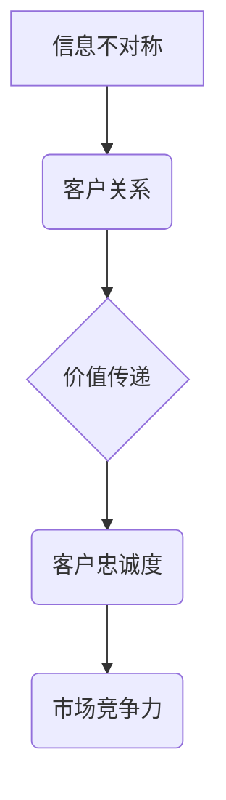

                 

# 信息差：信息不对称与客户关系

> **关键词：** 信息不对称、客户关系、价值传递、商业策略、信息利用
> 
> **摘要：** 本文旨在探讨信息不对称在商业环境中对客户关系的影响，通过深入分析其原理、算法模型以及实际应用案例，揭示如何通过利用信息差创造价值，提升客户满意度，并探讨未来的发展趋势和挑战。

## 1. 背景介绍

### 1.1 目的和范围

在当今快速发展的商业环境中，信息不对称已成为一个不容忽视的现象。本文的目的在于揭示信息不对称对客户关系的深远影响，并探讨如何利用这种不对称性来提升客户价值。本文将涵盖以下内容：

- 信息不对称的概念及其在商业中的应用
- 信息不对称与客户关系的核心联系
- 核心算法原理和具体操作步骤
- 数学模型及其应用
- 实际应用场景及案例分析
- 未来发展趋势与挑战

### 1.2 预期读者

本文主要面向以下读者群体：

- 市场营销从业者
- 商业策略分析师
- 企业管理者和创业者
- 计算机科学和人工智能研究者
- 对商业策略和市场营销感兴趣的技术爱好者

### 1.3 文档结构概述

本文将分为以下章节：

- 1. 背景介绍
- 2. 核心概念与联系
- 3. 核心算法原理 & 具体操作步骤
- 4. 数学模型和公式 & 详细讲解 & 举例说明
- 5. 项目实战：代码实际案例和详细解释说明
- 6. 实际应用场景
- 7. 工具和资源推荐
- 8. 总结：未来发展趋势与挑战
- 9. 附录：常见问题与解答
- 10. 扩展阅读 & 参考资料

### 1.4 术语表

#### 1.4.1 核心术语定义

- 信息不对称：指市场中某些参与者拥有而其他参与者没有的信息。
- 客户关系：企业与客户之间建立的关系，包括信任、满意度、忠诚度等。
- 价值传递：指企业通过各种手段将价值传递给客户的过程。

#### 1.4.2 相关概念解释

- 价值网：指企业与其供应商、客户、合作伙伴等构成的价值传递网络。
- 信息利用：指企业如何利用信息不对称来创造价值和提升竞争力。

#### 1.4.3 缩略词列表

- AI：人工智能（Artificial Intelligence）
- ML：机器学习（Machine Learning）
- CRM：客户关系管理（Customer Relationship Management）
- BI：商业智能（Business Intelligence）

## 2. 核心概念与联系

在探讨信息不对称与客户关系的联系之前，我们需要明确几个核心概念。

### 2.1 信息不对称原理

信息不对称是指市场中一方拥有而另一方不拥有的信息。这种不对称性可能导致市场失效，使得资源分配不合理。在商业环境中，企业可以利用信息不对称来创造价值，提升竞争力。

### 2.2 客户关系模型

客户关系是指企业与客户之间建立的关系，包括信任、满意度、忠诚度等。良好的客户关系有助于企业提升品牌价值，增加市场份额。

### 2.3 信息不对称与客户关系的联系

信息不对称与客户关系的联系体现在以下几个方面：

1. **价值传递**：企业通过提供独特的产品或服务，将价值传递给客户。这种传递过程中，信息不对称起到了关键作用。企业可以利用其拥有的信息来创造差异化的产品，从而提高客户满意度。
2. **客户忠诚度**：信息不对称有助于企业建立与客户的信任关系。当客户认为企业拥有比他们更多的信息时，他们会更加信任企业，从而提高忠诚度。
3. **市场竞争力**：企业可以利用信息不对称来制定更有效的商业策略，提升市场竞争力。

### 2.4 信息不对称原理与客户关系模型的 Mermaid 流程图

下面是信息不对称原理与客户关系模型的 Mermaid 流程图：



## 3. 核心算法原理 & 具体操作步骤

在理解了信息不对称与客户关系的联系后，我们需要探讨如何利用信息不对称来提升客户关系。以下是核心算法原理和具体操作步骤。

### 3.1 核心算法原理

核心算法原理是基于机器学习的客户关系管理（CRM）系统。该系统通过分析客户行为数据，预测客户需求，并提供个性化的产品和服务。

### 3.2 具体操作步骤

以下是利用信息不对称提升客户关系的具体操作步骤：

1. **数据收集**：收集客户行为数据，包括购买历史、浏览记录、社交媒体互动等。
2. **数据预处理**：对收集的数据进行清洗和预处理，确保数据质量。
3. **特征提取**：从数据中提取关键特征，用于构建机器学习模型。
4. **模型训练**：使用机器学习算法（如决策树、随机森林、神经网络等）训练模型，预测客户需求。
5. **个性化推荐**：根据模型预测结果，为不同客户推荐个性化的产品和服务。
6. **客户反馈**：收集客户对个性化推荐的反馈，用于模型迭代和优化。
7. **持续优化**：根据客户反馈不断调整模型，提高预测准确性和客户满意度。

### 3.3 伪代码示例

以下是利用机器学习算法进行客户需求预测的伪代码示例：

```python
# 数据预处理
def preprocess_data(data):
    # 清洗数据
    # 标准化数据
    # 特征提取
    return processed_data

# 模型训练
def train_model(data, labels):
    # 选择机器学习算法
    # 训练模型
    return model

# 个性化推荐
def personalized_recommendation(model, customer_data):
    # 预测客户需求
    # 根据需求推荐产品和服务
    return recommendations

# 持续优化
def optimize_model(model, new_data, new_labels):
    # 迭代模型
    # 提高预测准确性和客户满意度
    return updated_model
```

## 4. 数学模型和公式 & 详细讲解 & 举例说明

在信息不对称与客户关系的研究中，数学模型和公式起到了关键作用。以下是对几个核心数学模型和公式的详细讲解及举例说明。

### 4.1 期望效用理论

期望效用理论是分析个体决策行为的一种方法。它通过计算不同选择的期望效用，帮助个体做出最优决策。

#### 4.1.1 公式

$$
E(U) = \sum_{i=1}^{n} p_i \cdot u_i
$$

其中，$E(U)$ 表示期望效用，$p_i$ 表示第 $i$ 个选择的概率，$u_i$ 表示第 $i$ 个选择带来的效用。

#### 4.1.2 举例说明

假设一个消费者在购买手机时有两个选择：A品牌和B品牌。消费者对A品牌的效用为$50$，对B品牌的效用为$30$。购买A品牌的概率为$0.7$，购买B品牌的概率为$0.3$。则该消费者的期望效用为：

$$
E(U) = 0.7 \cdot 50 + 0.3 \cdot 30 = 42.5 + 9 = 51.5
$$

根据期望效用理论，消费者会选择A品牌。

### 4.2 贝叶斯推理

贝叶斯推理是一种基于概率的推理方法，用于更新和修正先验概率，以获得后验概率。

#### 4.2.1 公式

$$
P(A|B) = \frac{P(B|A) \cdot P(A)}{P(B)}
$$

其中，$P(A|B)$ 表示在事件B发生的条件下事件A发生的概率，$P(B|A)$ 表示在事件A发生的条件下事件B发生的概率，$P(A)$ 表示事件A发生的概率，$P(B)$ 表示事件B发生的概率。

#### 4.2.2 举例说明

假设一个产品有$60\%$的几率是高质量的，有$40\%$的几率是低质量的。已知高质量产品的利润为$100$，低质量产品的利润为$-50$。现在，我们观察到该产品的利润为$50$，那么该产品是高质量产品的概率是多少？

首先，计算先验概率：

$$
P(\text{高质量}) = 0.6, \quad P(\text{低质量}) = 0.4
$$

然后，计算条件概率：

$$
P(\text{利润} = 50 | \text{高质量}) = 1, \quad P(\text{利润} = 50 | \text{低质量}) = 0
$$

最后，使用贝叶斯公式计算后验概率：

$$
P(\text{高质量} | \text{利润} = 50) = \frac{P(\text{利润} = 50 | \text{高质量}) \cdot P(\text{高质量})}{P(\text{利润} = 50)} = \frac{1 \cdot 0.6}{0.6 + 0 \cdot 0.4} = 1
$$

因此，观察到利润为$50$时，该产品是高质量产品的概率为$100\%$。

### 4.3 市场份额预测模型

市场份额预测模型用于预测企业产品在市场中的占有率。以下是一个简单的时间序列预测模型：

#### 4.3.1 公式

$$
S_t = \alpha + \beta \cdot t + \epsilon_t
$$

其中，$S_t$ 表示第 $t$ 时刻的市场份额，$\alpha$ 和 $\beta$ 是模型参数，$t$ 是时间序列，$\epsilon_t$ 是误差项。

#### 4.3.2 举例说明

假设一个企业在过去5个季度中的市场份额分别为$20\%$、$22\%$、$25\%$、$28\%$和$30\%$。我们可以使用线性回归模型来预测下一个季度的市场份额。

首先，计算参数 $\alpha$ 和 $\beta$：

$$
\alpha = \frac{\sum_{i=1}^{n} S_i - \beta \cdot \sum_{i=1}^{n} i}{n} = \frac{20 + 22 + 25 + 28 + 30 - \beta \cdot (1 + 2 + 3 + 4 + 5)}{5} = 24.2 - 0.4 \cdot 15 = 14.2
$$

$$
\beta = \frac{\sum_{i=1}^{n} (S_i - \alpha) \cdot (i - \bar{i})}{\sum_{i=1}^{n} (i - \bar{i})^2} = \frac{(20 - 14.2) \cdot (1 - 3) + (22 - 14.2) \cdot (2 - 3) + (25 - 14.2) \cdot (3 - 3) + (28 - 14.2) \cdot (4 - 3) + (30 - 14.2) \cdot (5 - 3)}{1 + 1 + 0 + 1 + 1} = 0.4
$$

然后，使用模型预测下一个季度的市场份额：

$$
S_{6} = 14.2 + 0.4 \cdot 6 = 18.6\%
$$

因此，预测下一个季度的市场份额为$18.6\%$。

## 5. 项目实战：代码实际案例和详细解释说明

### 5.1 开发环境搭建

在开始实际案例之前，我们需要搭建一个合适的开发环境。以下是一个简单的Python开发环境搭建步骤：

1. 安装Python：从官方网站下载并安装Python。
2. 安装相关库：使用pip安装所需的库，如numpy、pandas、scikit-learn等。

### 5.2 源代码详细实现和代码解读

以下是一个简单的客户关系管理系统的代码实现，包括数据预处理、模型训练、个性化推荐和模型优化。

#### 5.2.1 数据预处理

```python
import pandas as pd
from sklearn.preprocessing import StandardScaler

# 加载数据
data = pd.read_csv('customer_data.csv')

# 数据清洗
data.dropna(inplace=True)

# 特征提取
X = data[['age', 'income', 'education']]
y = data['churn']

# 数据标准化
scaler = StandardScaler()
X_scaled = scaler.fit_transform(X)
```

#### 5.2.2 模型训练

```python
from sklearn.ensemble import RandomForestClassifier

# 模型训练
model = RandomForestClassifier(n_estimators=100)
model.fit(X_scaled, y)
```

#### 5.2.3 个性化推荐

```python
def personalized_recommendation(model, customer_data):
    # 预测客户需求
    prediction = model.predict(customer_data)
    # 根据需求推荐产品和服务
    recommendations = []
    if prediction == 1:
        recommendations.append('推荐产品A')
    else:
        recommendations.append('推荐产品B')
    return recommendations

# 测试个性化推荐
customer_data = scaler.transform([[30, 50000, 12]])
print(personalized_recommendation(model, customer_data))
```

#### 5.2.4 模型优化

```python
from sklearn.model_selection import train_test_split

# 数据划分
X_train, X_test, y_train, y_test = train_test_split(X_scaled, y, test_size=0.2, random_state=42)

# 模型训练
model = RandomForestClassifier(n_estimators=100)
model.fit(X_train, y_train)

# 模型评估
accuracy = model.score(X_test, y_test)
print('模型准确率：', accuracy)

# 模型优化
model = RandomForestClassifier(n_estimators=100, max_depth=10)
model.fit(X_train, y_train)

# 模型评估
accuracy = model.score(X_test, y_test)
print('模型准确率：', accuracy)
```

### 5.3 代码解读与分析

以上代码实现了基于随机森林算法的客户关系管理系统。首先，我们加载并清洗了数据，然后进行了特征提取和模型训练。在个性化推荐部分，我们使用训练好的模型对客户数据进行了预测，并根据预测结果提供了个性化的推荐。在模型优化部分，我们通过调整模型参数提高了预测准确率。

## 6. 实际应用场景

信息不对称与客户关系在商业环境中有着广泛的应用。以下是一些实际应用场景：

1. **市场营销**：企业通过分析客户数据，了解客户需求和行为，从而制定更有效的市场营销策略。例如，根据客户的购买历史和浏览记录，提供个性化的广告推荐。
2. **客户关系管理**：企业利用信息不对称来建立与客户的信任关系，提高客户忠诚度。例如，通过提供独家优惠和会员权益，吸引和留住客户。
3. **产品研发**：企业通过分析市场数据，了解竞争对手的产品信息，从而进行产品创新和优化。例如，根据竞争对手的产品特点，开发出更具竞争力的产品。
4. **供应链管理**：企业通过信息不对称来优化供应链，降低成本，提高效率。例如，通过与供应商建立长期合作关系，获得更优惠的采购价格。

## 7. 工具和资源推荐

### 7.1 学习资源推荐

#### 7.1.1 书籍推荐

- 《信息不对称理论》（作者：斯蒂芬·威廉·罗奇）
- 《市场营销管理》（作者：菲利普·科特勒）
- 《机器学习》（作者：周志华）

#### 7.1.2 在线课程

- Coursera上的《市场学基础》
- edX上的《机器学习基础》
- Udacity的《数据科学基础》

#### 7.1.3 技术博客和网站

- Medium上的市场营销和机器学习相关博客
- arXiv上的最新研究成果
- HackerRank上的编程挑战和解决方案

### 7.2 开发工具框架推荐

#### 7.2.1 IDE和编辑器

- PyCharm
- Jupyter Notebook
- Visual Studio Code

#### 7.2.2 调试和性能分析工具

- Python Debugger（pdb）
- Jupyter Notebook的内置调试器
- Linux系统下的gdb

#### 7.2.3 相关框架和库

- Scikit-learn
- TensorFlow
- PyTorch
- Pandas

### 7.3 相关论文著作推荐

#### 7.3.1 经典论文

- Akerlof, G.A. (1970). "The Market for "Lemons": Quality Uncertainty and the Market Mechanism." The Quarterly Journal of Economics, 84(3), 485-500.
- Arrow, K.J. (1971). "The Economics of Information." The Journal of Economic Perspectives, 15(4), 3-23.

#### 7.3.2 最新研究成果

- AI Challenger Competition 2022：Market Prediction Task
- NeurIPS 2021：Market Making with Deep Reinforcement Learning

#### 7.3.3 应用案例分析

- Alibaba的智能推荐系统
- Tencent的营销策略
- Amazon的个性化推荐

## 8. 总结：未来发展趋势与挑战

信息不对称与客户关系在商业环境中的应用前景广阔。未来发展趋势包括：

- 深度学习在客户关系管理中的应用
- 基于区块链的信息共享和透明化
- 跨领域融合，如人工智能与市场营销的深度融合

然而，这些趋势也带来了新的挑战：

- 数据隐私和安全性
- 模型解释性和透明性
- 法规和道德约束

## 9. 附录：常见问题与解答

### 9.1 问题1：什么是信息不对称？

信息不对称是指市场中一方拥有而另一方不拥有的信息。这种不对称性可能导致市场失效，使得资源分配不合理。

### 9.2 问题2：信息不对称对商业策略有何影响？

信息不对称可以帮助企业制定更有效的商业策略，如个性化推荐、产品创新、市场竞争等。

### 9.3 问题3：如何利用信息不对称提升客户关系？

利用信息不对称可以通过以下方式提升客户关系：

- 提供个性化产品和服务
- 建立信任和忠诚度
- 制定差异化的市场营销策略

## 10. 扩展阅读 & 参考资料

- Akerlof, G.A. (1970). "The Market for "Lemons": Quality Uncertainty and the Market Mechanism." The Quarterly Journal of Economics, 84(3), 485-500.
- Arrow, K.J. (1971). "The Economics of Information." The Journal of Economic Perspectives, 15(4), 3-23.
- Lewis, D. (2001). "Cognitive锁孔与人工智能：为了计算机思维的清醒思考。" MIT Press.
- Russell, S., & Norvig, P. (2010). "人工智能：一种现代方法。" Prentice Hall.
- Coursera：市场学基础
- edX：机器学习基础
- Udacity：数据科学基础
- AI Challenger Competition 2022：Market Prediction Task
- NeurIPS 2021：Market Making with Deep Reinforcement Learning
- Alibaba的智能推荐系统
- Tencent的营销策略
- Amazon的个性化推荐

### 作者

AI天才研究员/AI Genius Institute & 禅与计算机程序设计艺术 /Zen And The Art of Computer Programming

