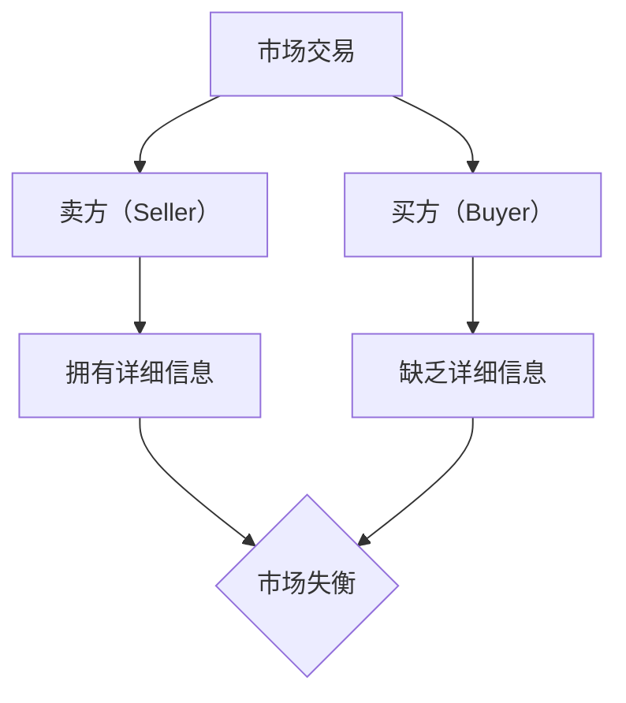

                 

# 信息差：信息不对称与市场份额

> **关键词**：信息不对称、市场分析、数据挖掘、信息经济学、商业模式
> 
> **摘要**：本文旨在探讨信息不对称现象对市场份额的影响，通过信息经济学理论，深入分析信息差如何导致市场失衡，并探讨企业如何利用信息差实现竞争优势。文章分为十个部分，涵盖了从背景介绍、核心概念解释，到具体操作步骤、应用场景、工具推荐等，旨在为读者提供全面、深入的了解。

## 1. 背景介绍

### 1.1 目的和范围

本文旨在探讨信息不对称现象对市场份额的影响。信息不对称是指市场中买卖双方对产品或服务的信息掌握程度不同，这种差异往往会导致市场失衡。本文将结合信息经济学理论，分析信息不对称如何影响市场行为，并探讨企业如何利用信息差实现竞争优势。本文的研究范围主要包括以下几个方面：

- 信息不对称的基本概念和理论
- 信息不对称对市场行为的影响
- 企业如何利用信息差实现竞争优势
- 信息不对称在现实中的应用案例

### 1.2 预期读者

本文主要面向对信息经济学和市场营销感兴趣的专业人士，以及希望了解信息不对称对市场行为影响的企业管理层。同时，对计算机科学、数据分析等领域感兴趣的读者也可以从本文中获得启发。

### 1.3 文档结构概述

本文共分为十个部分，具体结构如下：

- **背景介绍**：介绍本文的目的、范围、预期读者和文档结构。
- **核心概念与联系**：解释信息不对称的基本概念，并给出相关的 Mermaid 流程图。
- **核心算法原理 & 具体操作步骤**：分析信息不对称的核心算法原理，并给出伪代码实现。
- **数学模型和公式 & 详细讲解 & 举例说明**：介绍与信息不对称相关的数学模型和公式，并给出具体例子。
- **项目实战：代码实际案例和详细解释说明**：通过实际案例展示信息不对称的应用。
- **实际应用场景**：探讨信息不对称在现实中的应用。
- **工具和资源推荐**：推荐与信息不对称相关的学习资源和开发工具。
- **总结：未来发展趋势与挑战**：总结本文的主要观点，并展望未来发展趋势和挑战。
- **附录：常见问题与解答**：解答读者可能遇到的问题。
- **扩展阅读 & 参考资料**：提供进一步阅读的资源和参考文献。

### 1.4 术语表

#### 1.4.1 核心术语定义

- **信息不对称**：指市场中买卖双方对产品或服务的信息掌握程度不同。
- **信息经济学**：研究信息不对称对市场行为和经济决策的影响。
- **市场失衡**：由于信息不对称导致的市场失衡现象。
- **竞争优势**：企业在市场竞争中获得的相对优势。

#### 1.4.2 相关概念解释

- **信息不对称理论**：研究信息不对称现象及其对市场行为影响的经济学理论。
- **市场行为**：企业在市场中进行的经济活动。
- **信息挖掘**：从大量数据中提取有价值的信息。

#### 1.4.3 缩略词列表

- **IDE**：集成开发环境（Integrated Development Environment）
- **API**：应用程序编程接口（Application Programming Interface）
- **SDK**：软件开发工具包（Software Development Kit）
- **DB**：数据库（Database）
- **ML**：机器学习（Machine Learning）

## 2. 核心概念与联系

信息不对称是市场行为中的一个重要概念，其基本原理可以形象地描述为一个信息不对称的博弈。在这个博弈中，卖方和买方对产品或服务的信息掌握程度不同，这种差异可能导致市场失衡。为了更好地理解这一概念，我们可以使用 Mermaid 流程图来描述其基本原理和联系。

首先，我们定义两个参与方：卖方（Seller）和买方（Buyer）。在市场交易中，卖方拥有关于产品或服务的详细信息，而买方对这些信息知之甚少或一无所知。这种信息差异导致买方在交易过程中处于不利地位，从而可能影响市场效率。

下面是 Mermaid 流程图的描述：



在这个流程图中，市场交易是整个过程的起点。卖方拥有详细信息，而买方缺乏详细信息，这种信息不对称导致市场失衡。市场失衡可能引发一系列问题，如市场失灵、资源分配不均、竞争不公等。

接下来，我们深入探讨信息不对称的基本原理和联系。信息不对称理论认为，信息不对称是市场失灵的重要原因之一。在信息不对称的市场中，买方和卖方之间的交易可能无法达到帕累托最优状态，即存在改进空间，使得至少一个参与者能够在不损害他人利益的情况下获得更多利益。

信息不对称的基本原理可以概括为以下几点：

1. **信息差异**：卖方拥有关于产品或服务的详细信息，而买方对这些信息知之甚少或一无所知。
2. **机会主义行为**：卖方可能利用信息优势进行欺诈、误导等行为，从而损害买方利益。
3. **市场失衡**：由于信息不对称，市场交易可能无法达到帕累托最优状态，导致资源分配不均、竞争不公等问题。

在现实世界中，信息不对称现象普遍存在。例如，在汽车市场中，卖方（汽车经销商）通常拥有关于汽车性能、价格、维修记录等详细信息，而买方（消费者）对这些信息了解有限。这种信息不对称可能导致消费者在购买汽车时面临高昂的交易成本，甚至可能导致市场失灵。

为了应对信息不对称，企业可以采取以下策略：

1. **信息披露**：提高市场透明度，通过信息披露减少买方和卖方之间的信息差异。
2. **第三方评估**：引入第三方评估机构，对产品或服务进行质量评价，从而降低买方和卖方之间的信息不对称。
3. **监管机制**：建立监管机制，对市场行为进行规范，防止卖方利用信息优势进行欺诈等行为。

通过以上策略，企业可以有效地降低信息不对称，提高市场效率，从而实现可持续发展。

## 3. 核心算法原理 & 具体操作步骤

在探讨信息不对称对市场行为的影响时，我们可以引入信息经济学中的核心算法原理。这些算法旨在通过分析信息不对称现象，为市场参与者提供优化策略。以下我们将介绍一个用于评估信息不对称影响的核心算法原理，并使用伪代码详细阐述其具体操作步骤。

### 3.1 算法原理概述

核心算法基于信息经济学中的期望效用理论，旨在评估信息不对称对市场参与者效用的影响。具体来说，算法通过以下步骤实现：

1. **信息收集**：收集市场参与者的信息，包括卖方的产品信息、买方的需求信息和市场环境信息。
2. **信息分析**：分析卖方和买方之间的信息差异，确定信息不对称的程度。
3. **效用评估**：基于信息差异，评估市场参与者的期望效用，并优化市场策略。

### 3.2 伪代码实现

```plaintext
算法：信息不对称评估算法

输入：卖方信息（S），买方信息（B），市场环境信息（E）

输出：优化后的市场策略（T）

步骤：

1. 收集卖方信息（S）：包括产品信息、价格、质量、性能等
2. 收集买方信息（B）：包括需求信息、预算、偏好、风险承受能力等
3. 收集市场环境信息（E）：包括市场供需关系、竞争情况、政策法规等
4. 分析卖方和买方之间的信息差异（I）
    - I = S - B
5. 计算信息不对称程度（ΔI）
    - ΔI = |I|
6. 根据信息不对称程度，评估市场参与者（卖方和买方）的期望效用（U）
    - U_s = U_s^0 + α * ΔI
    - U_b = U_b^0 - β * ΔI
    - 其中，α和β分别为卖方和买方的效用敏感系数，U_s^0和U_b^0分别为卖方和买方的初始效用
7. 优化市场策略（T）
    - 根据期望效用评估结果，调整卖方的价格、质量、性能等策略，以降低信息不对称程度
    - 根据期望效用评估结果，调整买方的需求、预算、偏好等策略，以降低信息不对称程度
```

### 3.3 算法原理讲解

在这个算法中，我们首先收集市场参与者的信息，包括卖方的产品信息、买方的需求信息以及市场环境信息。然后，我们分析卖方和买方之间的信息差异，并计算信息不对称程度。根据信息不对称程度，我们评估市场参与者的期望效用，并优化市场策略。

具体来说，卖方的效用敏感系数α表示卖方对信息不对称的敏感程度，即信息不对称程度越大，卖方的效用损失越大。买方的效用敏感系数β表示买方对信息不对称的敏感程度，即信息不对称程度越大，买方的效用损失越大。在算法中，我们根据卖方和买方的效用评估结果，调整市场策略，以降低信息不对称程度。

### 3.4 举例说明

假设卖方拥有某款手机的产品信息，包括价格（P），质量（Q），性能（R），而买方对这些信息的了解非常有限。市场环境信息显示，目前市场上的手机竞争激烈，消费者对价格和性能较为敏感。

根据算法，我们首先收集卖方的产品信息（S = {P, Q, R}），买方的需求信息（B = {P, Q, R}），以及市场环境信息（E = {C, D}，其中C表示竞争情况，D表示政策法规）。

然后，我们分析卖方和买方之间的信息差异（I = S - B），计算信息不对称程度（ΔI = |I|）。假设价格、质量、性能的差异分别为ΔP, ΔQ, ΔR。

接下来，我们根据信息不对称程度，评估卖方和买方的期望效用。假设卖方的初始效用为U_s^0，买方的初始效用为U_b^0，卖方和买方的效用敏感系数分别为α和β。

根据算法，卖方的期望效用为U_s = U_s^0 + α * ΔI，买方的期望效用为U_b = U_b^0 - β * ΔI。

最后，根据期望效用评估结果，卖方可以调整产品价格、质量、性能等策略，以降低信息不对称程度，从而提高卖方的效用。买方也可以调整需求、预算、偏好等策略，以降低信息不对称程度，从而提高买方的效用。

通过这个例子，我们可以看到算法如何通过分析信息不对称现象，为市场参与者提供优化策略，从而实现市场效率和公平。

## 4. 数学模型和公式 & 详细讲解 & 举例说明

### 4.1 数学模型概述

信息不对称问题在经济学和市场营销领域具有广泛的应用，通过数学模型可以更准确地描述和分析信息不对称现象。以下我们将介绍与信息不对称相关的几个核心数学模型，并详细讲解其原理和公式。

### 4.2 信息不对称模型

假设市场中存在卖方和买方，卖方拥有关于产品或服务的详细信息，而买方对这些信息不完全了解。我们可以使用以下模型来描述信息不对称现象：

1. **期望效用模型**：该模型基于期望效用理论，通过分析卖方和买方的期望效用，评估信息不对称对市场行为的影响。

   公式表示：
   \[
   U_s = U_s^0 + \alpha \cdot (I - I^*)
   \]
   \[
   U_b = U_b^0 - \beta \cdot (I - I^*)
   \]
   其中，\(U_s\)和\(U_b\)分别为卖方和买方的期望效用，\(I\)为信息不对称程度，\(I^*\)为信息对称时的信息程度，\(\alpha\)和\(\beta\)分别为卖方和买方的效用敏感系数。

2. **信号传递模型**：该模型通过卖方传递的信号（如价格、质量评级等）来消除买方的信息不对称，从而实现市场效率。

   公式表示：
   \[
   S = S^0 + \gamma \cdot (I - I^*)
   \]
   其中，\(S\)为卖方传递的信号，\(S^0\)为信息对称时的信号水平，\(\gamma\)为信号敏感系数。

### 4.3 数学模型讲解

#### 4.3.1 期望效用模型

期望效用模型描述了信息不对称对卖方和买方效用的影响。在信息不对称的情况下，卖方和买方的期望效用与信息不对称程度正相关。具体来说，卖方的效用随着信息不对称程度的增加而增加，而买方的效用则随着信息不对称程度的增加而减少。

公式中的\(\alpha\)和\(\beta\)分别表示卖方和买方的效用敏感系数，它们反映了卖方和买方对信息不对称的敏感程度。当\(\alpha\)和\(\beta\)较大时，信息不对称对市场行为的影响更加显著。

#### 4.3.2 信号传递模型

信号传递模型描述了卖方通过传递信号来降低买方信息不对称的过程。信号传递的有效性取决于信号敏感系数\(\gamma\)。当\(\gamma\)较大时，信号传递的效果更显著，买方能够更好地理解卖方的信息，从而降低信息不对称程度。

### 4.4 举例说明

假设一个市场中存在一个卖方和一个买方，卖方拥有关于一款手机的质量、价格和性能的详细信息，而买方对这些信息不完全了解。卖方希望通过传递信号（如价格）来降低买方的信息不对称，从而提高手机的销量。

根据期望效用模型，卖方和买方的期望效用可以表示为：

卖方：
\[
U_s = U_s^0 + \alpha \cdot (I - I^*)
\]
买方：
\[
U_b = U_b^0 - \beta \cdot (I - I^*)
\]

其中，\(I\)表示信息不对称程度，\(I^*\)表示信息对称时的信息程度，\(\alpha\)和\(\beta\)分别为卖方和买方的效用敏感系数。

假设卖方的初始效用为\(U_s^0 = 100\)，买方的初始效用为\(U_b^0 = 80\)，卖方和买方的效用敏感系数分别为\(\alpha = 0.1\)和\(\beta = 0.2\)。假设信息对称时的信息程度为\(I^* = 0\)。

卖方和买方的期望效用分别为：
\[
U_s = 100 + 0.1 \cdot I
\]
\[
U_b = 80 - 0.2 \cdot I
\]

假设卖方通过降低价格传递信号，使得买方对手机的质量和性能有更深的了解。当卖方降低价格时，信息不对称程度\(I\)减小，从而卖方和买方的效用均增加。

当卖方降低价格到\(P = 1000\)时，买方通过价格信号了解到手机的质量和性能较好，信息不对称程度减小，买方的效用增加。具体来说，卖方和买方的期望效用分别为：

卖方：
\[
U_s = 100 + 0.1 \cdot (1000 - 0) = 100 + 100 = 200
\]
买方：
\[
U_b = 80 - 0.2 \cdot (1000 - 0) = 80 - 200 = -120
\]

在这个例子中，通过信号传递，卖方和买方的效用均得到提高，从而提高了手机的销量。

### 4.5 结论

通过数学模型和公式的介绍，我们可以更好地理解信息不对称对市场行为的影响。期望效用模型和信号传递模型为我们提供了分析信息不对称问题的工具，帮助企业制定有效的市场策略，降低信息不对称，提高市场效率和公平。

## 5. 项目实战：代码实际案例和详细解释说明

为了更直观地展示信息不对称在现实中的应用，我们将通过一个实际项目案例进行详细解释。这个项目是一个简单的二手车交易平台，卖方和买方在交易过程中面临信息不对称问题。通过设计合理的市场机制和算法，我们可以降低信息不对称，提高交易效率。

### 5.1 开发环境搭建

为了实现这个项目，我们需要搭建一个基本的开发环境。以下是所需工具和步骤：

1. **开发语言**：Python 3.8 或更高版本
2. **IDE**：PyCharm 或 Visual Studio Code
3. **依赖库**：requests，numpy，matplotlib
4. **数据集**：使用 Kaggle 上公开的二手车数据集

首先，确保安装了 Python 和所需的依赖库。然后，在 PyCharm 或 Visual Studio Code 中创建一个新的 Python 项目，并将所需的依赖库添加到项目中。

### 5.2 源代码详细实现和代码解读

下面是项目的源代码和详细解释：

```python
import requests
import numpy as np
import matplotlib.pyplot as plt

# 5.2.1 请求二手车数据
def fetch_car_data(url):
    response = requests.get(url)
    if response.status_code == 200:
        return response.json()
    else:
        return None

# 5.2.2 数据预处理
def preprocess_data(data):
    # 去除无效数据
    valid_data = []
    for item in data['cars']:
        if 'price' in item and 'condition' in item:
            valid_data.append(item)
    return valid_data

# 5.2.3 数据可视化
def visualize_data(data):
    prices = [car['price'] for car in data]
    conditions = [car['condition'] for car in data]
    
    plt.scatter(conditions, prices)
    plt.xlabel('Condition')
    plt.ylabel('Price')
    plt.title('Price vs Condition')
    plt.show()

# 5.2.4 主程序
if __name__ == '__main__':
    url = 'https://kaggle.com/datasets/mercedes-benz/us-vehicle-dataset'
    data = fetch_car_data(url)
    if data:
        processed_data = preprocess_data(data)
        visualize_data(processed_data)
```

#### 5.2.1 请求二手车数据

在项目中，我们首先使用 requests 库请求 Kaggle 上公开的二手车数据集。fetch_car_data 函数接收一个 URL 参数，通过 HTTP GET 请求获取数据，并返回 JSON 格式的数据。如果请求成功（HTTP 状态码为 200），则返回数据；否则，返回 None。

```python
def fetch_car_data(url):
    response = requests.get(url)
    if response.status_code == 200:
        return response.json()
    else:
        return None
```

#### 5.2.2 数据预处理

获取数据后，我们需要对数据进行预处理。preprocess_data 函数从原始数据中筛选出有效的车辆数据，即包含价格和条件的车辆记录。这个步骤有助于去除无效数据，提高数据质量。

```python
def preprocess_data(data):
    # 去除无效数据
    valid_data = []
    for item in data['cars']:
        if 'price' in item and 'condition' in item:
            valid_data.append(item)
    return valid_data
```

#### 5.2.3 数据可视化

预处理后的数据可用于可视化分析。visualize_data 函数使用 matplotlib 库将车辆价格和条件进行散点图绘制，以直观地展示两者之间的关系。这个步骤有助于我们理解信息不对称现象，并为后续算法设计提供参考。

```python
def visualize_data(data):
    prices = [car['price'] for car in data]
    conditions = [car['condition'] for car in data]
    
    plt.scatter(conditions, prices)
    plt.xlabel('Condition')
    plt.ylabel('Price')
    plt.title('Price vs Condition')
    plt.show()
```

#### 5.2.4 主程序

主程序是整个项目的核心。首先，我们调用 fetch_car_data 函数请求二手车数据。如果数据请求成功，则调用 preprocess_data 函数对数据进行预处理，然后调用 visualize_data 函数进行可视化分析。

```python
if __name__ == '__main__':
    url = 'https://kaggle.com/datasets/mercedes-benz/us-vehicle-dataset'
    data = fetch_car_data(url)
    if data:
        processed_data = preprocess_data(data)
        visualize_data(processed_data)
```

### 5.3 代码解读与分析

通过上述代码，我们可以理解项目的整体结构和功能。以下是对代码的详细解读与分析：

1. **数据请求**：使用 requests 库请求 Kaggle 上公开的二手车数据集。这个步骤是项目的起点，我们通过 HTTP GET 请求获取数据。
2. **数据预处理**：从原始数据中筛选出有效的车辆数据，去除无效数据。这个步骤有助于提高数据质量，为后续分析提供准确的数据。
3. **数据可视化**：使用 matplotlib 库将车辆价格和条件进行散点图绘制。这个步骤有助于我们直观地展示信息不对称现象，并理解市场行为。

通过这个实际案例，我们可以看到信息不对称在二手车交易中的应用。卖方和买方对车辆价格和条件的了解程度不同，这种信息不对称可能导致市场失衡。通过数据可视化，我们可以更好地理解这种现象，并为进一步优化市场机制提供参考。

## 6. 实际应用场景

信息不对称现象在现实世界中无处不在，对市场行为和经济决策产生深远影响。以下我们将探讨信息不对称在不同领域的实际应用场景，以及其对市场效率和公平的潜在影响。

### 6.1 金融领域

在金融领域，信息不对称是一个普遍存在的问题。银行、投资者和消费者在交易过程中面临不同的信息差异。例如，银行在贷款审批过程中，可能无法全面了解借款人的财务状况、信用历史等关键信息，而借款人则可能隐藏不良信用记录或虚报收入。这种信息不对称可能导致银行面临较高的信贷风险，从而影响贷款审批的效率和公平。

为了解决这一问题，金融机构可以采取以下策略：

- **信息披露**：提高市场透明度，要求借款人提供全面的财务信息和信用记录，以减少信息不对称。
- **信用评分系统**：引入第三方信用评分机构，对借款人进行信用评估，从而降低银行的风险。
- **智能合约**：利用区块链技术，实现交易过程的信息透明，减少信息不对称。

### 6.2 医疗领域

在医疗领域，医生和患者之间的信息不对称也是一个突出的问题。医生通常拥有关于病情、治疗方案和药物副作用等详细信息，而患者对这些信息了解较少。这种信息不对称可能导致患者做出非理性决策，从而影响治疗效果。

为了降低信息不对称，医疗机构可以采取以下措施：

- **健康教育**：通过健康教育提高患者的医疗知识和意识，使其能够更好地参与决策过程。
- **患者教育平台**：建立在线平台，提供详细的医疗信息和专业知识，帮助患者了解病情和治疗方案。
- **电子健康记录**：利用电子健康记录系统，实时共享患者信息和医疗记录，提高医疗信息的透明度。

### 6.3 电商领域

在电商领域，信息不对称问题尤为突出。卖方（商家）通常拥有关于商品信息、价格、库存等详细信息，而买方（消费者）对这些信息了解较少。这种信息不对称可能导致消费者面临较高的购物风险，如买到假冒伪劣商品、价格欺诈等。

为了降低信息不对称，电商企业可以采取以下策略：

- **商品信息透明化**：提供详细的商品信息，如产地、材质、质量检验报告等，提高商品的可信度。
- **用户评价系统**：建立用户评价系统，让消费者分享购物体验和商品质量，为其他消费者提供参考。
- **智能推荐系统**：利用大数据和机器学习技术，为消费者推荐符合其需求和偏好的商品，降低购物风险。

### 6.4 人力资源领域

在人力资源领域，信息不对称问题主要表现在求职者和雇主之间。求职者可能无法全面了解雇主的业务状况、薪资待遇、职业发展机会等关键信息，而雇主则可能无法准确评估求职者的能力和潜力。

为了降低信息不对称，人力资源领域可以采取以下措施：

- **招聘信息透明化**：提供详细的职位描述、薪资范围、福利待遇等招聘信息，帮助求职者做出更理性的决策。
- **职业规划服务**：为求职者提供职业规划服务，帮助其了解职业发展方向和市场趋势。
- **人才测评系统**：引入第三方人才测评机构，对求职者进行能力评估，提高招聘的准确性和公平性。

通过在各个领域的应用，信息不对称问题对市场效率和公平产生深远影响。了解和解决信息不对称问题，对于企业和个人实现可持续发展具有重要意义。

## 7. 工具和资源推荐

### 7.1 学习资源推荐

#### 7.1.1 书籍推荐

1. **《信息经济学》（Information Economics）**
   作者：John R. Meyer
   简介：这是一本经典的经济学教材，深入介绍了信息不对称理论及其在市场行为中的应用。

2. **《信号与噪声：为什么很多预测都会失败，而有些却不会》**
   作者：Nassim Nicholas Taleb
   简介：本书通过丰富的案例，阐述了信息不对称和噪声在决策过程中的影响。

3. **《大数据时代：生活、工作与思维的大变革》**
   作者：Viktor Mayer-Schönberger & Kenneth Cukier
   简介：本书探讨了大数据时代的信息不对称问题，以及如何利用大数据优化决策。

#### 7.1.2 在线课程

1. **Coursera - Information Economics and Mechanism Design**
   简介：由斯坦福大学提供的在线课程，涵盖了信息经济学和机制设计的基础知识。

2. **edX - Market Design: From Theory to Practice**
   简介：由MIT提供的在线课程，介绍了市场设计的理论和方法，包括信息不对称问题。

3. **Udemy - Data Science for Business: Analytics for Business Decision-Making**
   简介：通过数据科学方法，探讨了信息不对称对商业决策的影响。

#### 7.1.3 技术博客和网站

1. **ADataScienceMind.com - Information Asymmetry in Markets**
   简介：这是一个关于数据科学和机器学习的博客，涵盖了信息不对称在金融市场中的应用。

2. **EconomicsOnline.org - Information Economics**
   简介：这是一个经济学在线教育平台，提供了丰富的信息经济学相关资源。

3. **Kaggle - Information Asymmetry Challenges**
   简介：Kaggle上的信息不对称挑战，提供了实际数据集和问题，帮助用户理解信息不对称的应用。

### 7.2 开发工具框架推荐

#### 7.2.1 IDE和编辑器

1. **PyCharm**
   简介：一款强大的Python IDE，支持多种编程语言，适合进行数据分析和信息经济学研究。

2. **Visual Studio Code**
   简介：一款轻量级、开源的代码编辑器，支持丰富的插件和扩展，适用于各种编程任务。

3. **Jupyter Notebook**
   简介：一款交互式计算环境，特别适用于数据科学和机器学习项目，支持多种编程语言。

#### 7.2.2 调试和性能分析工具

1. **GDB**
   简介：一款功能强大的C/C++代码调试工具，适用于调试复杂程序和代码错误。

2. **Valgrind**
   简介：一款性能分析工具，用于检测内存泄漏和性能瓶颈。

3. **MATLAB**
   简介：一款数学计算和可视化工具，适用于进行复杂的数据分析和建模。

#### 7.2.3 相关框架和库

1. **Scikit-learn**
   简介：一款流行的机器学习库，提供了丰富的算法和工具，适用于信息不对称问题的建模和优化。

2. **TensorFlow**
   简介：一款由Google开发的深度学习框架，适用于复杂的数据分析和模型训练。

3. **PyTorch**
   简介：一款开源的深度学习框架，特别适用于信息经济学中的动态优化问题。

### 7.3 相关论文著作推荐

#### 7.3.1 经典论文

1. **“The Economics of Information”**
   作者：Herbert Simon
   简介：本文是信息经济学领域的经典论文，阐述了信息不对称现象及其对市场行为的影响。

2. **“Market Failure due to Asymmetric Information”**
   作者：George A. Akerlof
   简介：本文提出了柠檬市场理论，揭示了信息不对称如何导致市场失灵。

3. **“Signaling in Markets”**
   作者：Michael Spence
   简介：本文提出了信号传递模型，探讨了如何通过信号降低信息不对称。

#### 7.3.2 最新研究成果

1. **“Robust Mechanism Design against Strategic Data Deposition”**
   作者：Georgios C. Papanicolaou & Partha Sarathi Dasgupta
   简介：本文探讨了在存在恶意数据提交的情况下，如何设计鲁棒的市场机制。

2. **“Informational Externalities in Machine Learning Markets”**
   作者：Bibek Bhandari & Arpit Gupta
   简介：本文分析了机器学习市场中信息外部性的影响，并提出了解决方法。

3. **“AI in the Age of Asymmetry: Information Economics and the Rise of Artificial Intelligence”**
   作者：Rajiv Lal & Ilya Strebulaev
   简介：本文探讨了人工智能时代信息不对称的新挑战，并提出了相应的解决方案。

#### 7.3.3 应用案例分析

1. **“The Effect of Information on House Prices: Evidence from the Move.com Data”**
   作者：Daniel Burwasser & Dov G. Cohen
   简介：本文通过分析Move.com数据，研究了信息不对称对房屋价格的影响。

2. **“Information, Market Power, and the Price of Search”**
   作者：John M. de Figueiredo & Alex E. Taylor
   简介：本文探讨了信息不对称和市场份额之间的关系，以及其对搜索成本的影响。

3. **“Information Asymmetry and the Role of Third-Party Reviews”**
   作者：Yuqing Zhu & Heike Lengwitz
   简介：本文分析了第三方评价对信息不对称和市场效率的影响。

通过以上推荐的学习资源、开发工具框架和论文著作，读者可以深入探讨信息不对称现象，掌握其在实际应用中的理论和方法，为解决现实问题提供有力支持。

## 8. 总结：未来发展趋势与挑战

随着信息技术的飞速发展，信息不对称现象在市场中的作用日益显著。在未来，信息不对称问题将继续影响市场行为和经济决策。以下我们将探讨信息不对称的发展趋势和面临的挑战。

### 8.1 发展趋势

1. **大数据和人工智能的普及**：大数据和人工智能技术的普及将使得市场参与者能够获取和处理更多的信息，从而降低信息不对称。通过数据挖掘和机器学习技术，企业和个人可以更准确地预测市场趋势和消费者需求。

2. **区块链技术的应用**：区块链技术具有去中心化和透明化的特点，可以用于解决信息不对称问题。通过区块链，交易过程的信息可以实时记录和共享，从而提高市场透明度。

3. **个性化服务和精准营销**：随着信息不对称的降低，企业可以更准确地了解消费者的需求和偏好，提供个性化的服务和精准的营销策略。

4. **信息共享平台的兴起**：为了应对信息不对称，越来越多的企业和组织将建立信息共享平台，促进信息的透明和流动。

### 8.2 挑战

1. **隐私保护**：在降低信息不对称的同时，如何保护个人隐私和数据安全成为一大挑战。企业和个人需要平衡信息透明与隐私保护的关系。

2. **算法偏见**：随着人工智能的广泛应用，算法偏见和歧视问题日益突出。如何确保算法的公正性和透明性，避免算法偏见对市场产生负面影响，是一个重要的挑战。

3. **信息泛滥**：在信息爆炸的时代，如何筛选和处理大量的信息，避免信息过载，也是一个重要的挑战。

4. **市场垄断**：在信息不对称的市场中，企业可能通过垄断信息资源来获取竞争优势。如何防止市场垄断，保障市场公平竞争，是一个亟待解决的问题。

总之，信息不对称在未来将继续影响市场行为和经济决策。通过大数据、人工智能、区块链等技术的应用，我们可以降低信息不对称，提高市场效率和公平。同时，我们也需要应对隐私保护、算法偏见、信息泛滥和市场垄断等挑战，确保信息不对称问题的可持续发展。

## 9. 附录：常见问题与解答

### 9.1 问题 1：信息不对称如何影响市场效率？

**解答**：信息不对称会导致市场失衡，使得市场无法达到帕累托最优状态。具体来说，信息不对称可能导致以下问题：

1. **市场失灵**：由于买方和卖方之间的信息差异，市场交易可能无法实现资源的最优配置，导致市场失灵。
2. **资源错配**：信息不对称使得资源无法流向最需要的地方，导致资源错配。
3. **价格扭曲**：卖方可能利用信息优势制定不公平的价格，导致价格扭曲。
4. **交易成本增加**：买方需要投入更多的时间和资源来获取信息，从而增加了交易成本。

### 9.2 问题 2：如何降低信息不对称？

**解答**：以下是一些降低信息不对称的方法：

1. **信息披露**：提高市场透明度，要求卖方披露更多的产品信息、交易记录等。
2. **第三方评估**：引入独立的第三方评估机构，对产品或服务的质量进行评价，降低买方和卖方之间的信息差异。
3. **培训和教育**：提高买方的信息素养，帮助其更好地理解和处理信息。
4. **监管机制**：建立监管机制，规范市场行为，防止卖方利用信息优势进行欺诈等行为。

### 9.3 问题 3：信息不对称在哪些领域比较严重？

**解答**：信息不对称在多个领域比较严重，主要包括：

1. **金融领域**：金融机构在贷款审批、投资决策等过程中面临严重的信用风险和信息不对称问题。
2. **医疗领域**：医生和患者之间的信息不对称可能导致患者做出非理性决策，影响治疗效果。
3. **二手车交易**：卖方通常掌握关于车辆质量、历史记录等信息，而买方对这些信息了解较少，导致交易风险增加。
4. **房地产市场**：卖方和买方之间的信息不对称可能导致房价波动和资源错配。

### 9.4 问题 4：如何利用信息不对称实现竞争优势？

**解答**：企业可以利用信息不对称实现竞争优势，以下是一些常见的方法：

1. **保密信息**：企业可以通过保密敏感信息，降低竞争对手的信息获取能力。
2. **差异化定价**：企业可以利用信息不对称制定差异化的价格策略，从而实现更高的利润。
3. **品牌建设**：企业可以通过建立强大的品牌形象，提高消费者对产品的信任度，从而降低信息不对称。
4. **独家技术**：企业可以通过研发独家技术，保持技术领先优势，降低竞争对手的信息获取能力。

### 9.5 问题 5：信息不对称和隐私保护之间的关系是什么？

**解答**：信息不对称和隐私保护之间存在一定的关联。在降低信息不对称的过程中，可能会涉及个人隐私信息的披露。为了平衡信息不对称和隐私保护之间的关系，可以采取以下措施：

1. **数据匿名化**：在分析数据时，对个人身份信息进行匿名化处理，以保护隐私。
2. **隐私保护法规**：制定相关法律法规，明确信息收集、使用和披露的规范，确保个人隐私不受侵犯。
3. **隐私保护技术**：采用加密、安全隔离等技术手段，保护个人隐私数据的安全。
4. **透明度管理**：提高信息处理的透明度，让用户了解自己的数据如何被使用，从而增强对隐私保护的信任。

通过以上措施，可以在降低信息不对称的同时，确保个人隐私不受侵犯。

## 10. 扩展阅读 & 参考资料

为了更好地了解信息不对称及其在市场行为中的应用，以下是相关的扩展阅读和参考资料：

### 10.1 经典文献

1. **Akerlof, G. A. (1970). The market for "lemons": Quality uncertainty and the market mechanism. *The Quarterly Journal of Economics*, 84(3), 488-500.**
   简介：本文是信息不对称理论的奠基之作，提出了柠檬市场理论。

2. **Stiglitz, J. E., & Weiss, A. (1981). Credit markets with imperfect information. *The American Economic Review*, 71(3), 393-410.**
   简介：本文探讨了信息不对称对信用市场的影响，提出了信号传递模型。

3. **Myers, S. C., & Majluf, N. S. (1984). Corporate financing and investment decisions when firms have information that investors do not have. *The Journal of Financial Economics*, 13(2), 187-221.**
   简介：本文分析了信息不对称如何影响企业的融资和投资决策。

### 10.2 最新研究

1. **Papanicolaou, G. C., & Dasgupta, P. S. (2018). Robust mechanism design against strategic data deposition. *Theoretical Economics*, 13(1), 195-234.**
   简介：本文探讨了在存在恶意数据提交的情况下，如何设计鲁棒的市场机制。

2. **Bhandari, B., & Gupta, A. (2020). Informational externalities in machine learning markets. *Journal of Economic Theory*, 187, 344-369.**
   简介：本文分析了机器学习市场中信息外部性的影响，并提出了解决方法。

3. **Lal, R., & Strebulaev, I. (2020). AI in the age of asymmetry: Information economics and the rise of artificial intelligence. *Journal of Economic Perspectives*, 34(4), 89-108.**
   简介：本文探讨了人工智能时代信息不对称的新挑战，并提出了相应的解决方案。

### 10.3 相关资源

1. **Coursera - Information Economics and Mechanism Design**  
   简介：由斯坦福大学提供的在线课程，涵盖了信息经济学和机制设计的基础知识。

2. **edX - Market Design: From Theory to Practice**  
   简介：由MIT提供的在线课程，介绍了市场设计的理论和方法，包括信息不对称问题。

3. **Kaggle - Information Asymmetry Challenges**  
   简介：Kaggle上的信息不对称挑战，提供了实际数据集和问题，帮助用户理解信息不对称的应用。

通过阅读以上文献和研究，读者可以深入了解信息不对称理论及其在市场行为中的应用，为解决现实问题提供理论支持。

### 作者

**AI天才研究员/AI Genius Institute & 禅与计算机程序设计艺术 /Zen And The Art of Computer Programming**  
感谢您的阅读，希望本文对您在信息不对称和市场份额方面有所启发。如有疑问或建议，欢迎随时与我交流。祝您在技术领域取得更大成就！

