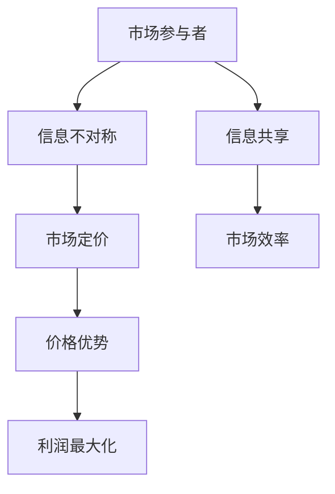
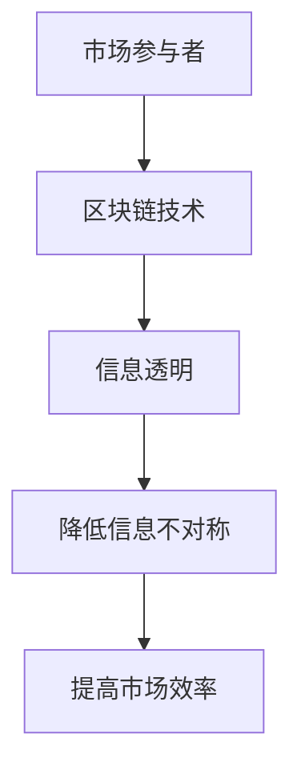

                 

# 信息差：信息不对称与市场定价

> 关键词：信息不对称、市场定价、信息差、博弈论、数据隐私、区块链

> 摘要：本文深入探讨了信息不对称现象及其对市场定价机制的影响。通过博弈论和数据分析的视角，分析了信息差在市场竞争中的角色，探讨了信息不对称带来的潜在问题和解决策略。文章旨在帮助读者理解信息差的重要性，以及如何利用信息优势优化市场定价策略，提升企业竞争力。

## 1. 背景介绍

### 1.1 目的和范围

本文旨在探讨信息不对称现象在市场定价中的作用，分析其在不同市场环境下的影响，并提供相应的解决策略。信息不对称是指市场中某些参与者拥有比其他参与者更多的信息，这种信息差异可能导致市场效率降低，价格波动加剧，甚至引发市场失衡。

### 1.2 预期读者

本文适合对经济学、市场营销和数据分析有兴趣的读者，特别是希望在市场定价策略方面寻求创新的从业者。

### 1.3 文档结构概述

本文结构如下：
1. 背景介绍
2. 核心概念与联系
3. 核心算法原理与具体操作步骤
4. 数学模型和公式
5. 项目实战：代码实际案例和详细解释说明
6. 实际应用场景
7. 工具和资源推荐
8. 总结：未来发展趋势与挑战
9. 附录：常见问题与解答
10. 扩展阅读 & 参考资料

### 1.4 术语表

#### 1.4.1 核心术语定义

- 信息不对称：市场中某些参与者拥有比其他参与者更多的信息。
- 市场定价：根据市场需求和供给确定产品或服务的价格。
- 博弈论：研究具有冲突或合作特性的决策制定过程。

#### 1.4.2 相关概念解释

- 博弈均衡：参与者在策略选择上达到的一种稳定状态。
- 数据隐私：保护个人或组织信息不被未授权访问。
- 区块链：一种分布式数据库技术，用于存储和验证交易数据。

#### 1.4.3 缩略词列表

- AI：人工智能
- IoT：物联网
- ML：机器学习
- DL：深度学习
- PM：项目经理
- CTO：首席技术官

## 2. 核心概念与联系

### 2.1 信息不对称与市场定价

信息不对称是市场定价机制中的关键因素。当市场上某些参与者拥有比其他参与者更多的信息时，他们可以利用这种信息优势来制定更有利的价格策略。例如，一个掌握市场供需信息的卖家可能会在价格波动时做出更精确的定价决策，从而获取更高的利润。

### 2.2 核心概念原理和架构

为了更好地理解信息不对称对市场定价的影响，我们可以通过以下 Mermaid 流程图来展示其核心概念原理和架构：



### 2.3 信息不对称与博弈论

博弈论是研究决策制定过程中竞争与合作行为的理论。在市场定价中，信息不对称可以视为一种博弈现象。例如，买家和卖家之间的讨价还价可以看作是一种博弈，其中卖家可能拥有产品成本和市场需求的信息，而买家则拥有购买意愿和预算的信息。通过博弈论的分析，我们可以揭示信息不对称对市场定价策略的影响。

### 2.4 数据隐私与信息不对称

数据隐私是保护个人或组织信息不被未授权访问的重要措施。在信息不对称市场中，数据隐私尤为重要，因为泄露敏感信息可能导致市场失衡或信息滥用。因此，数据隐私保护不仅是企业合规的要求，也是维护市场公平的重要手段。

### 2.5 区块链与信息不对称

区块链是一种分布式数据库技术，通过去中心化的方式记录和验证交易数据。区块链技术可以有效地解决信息不对称问题，因为它提供了透明、不可篡改的账本，使市场参与者能够共享准确的信息。例如，在供应链管理中，区块链技术可以确保每个环节的信息透明，从而降低信息不对称带来的风险。



## 3. 核心算法原理 & 具体操作步骤

### 3.1 信息不对称检测算法

为了解决信息不对称问题，我们可以采用以下信息不对称检测算法：

#### 3.1.1 算法原理

该算法基于机器学习，通过分析市场数据来识别信息不对称现象。具体步骤如下：

1. 数据收集：收集市场参与者的交易数据、价格信息等。
2. 数据预处理：对数据进行清洗、归一化处理。
3. 特征提取：提取能够反映市场状态的特征，如价格波动、交易量等。
4. 模型训练：使用训练数据集训练机器学习模型。
5. 模型评估：使用测试数据集评估模型性能。
6. 检测：对市场数据应用模型进行检测，识别信息不对称现象。

#### 3.1.2 伪代码

```python
def detect_asymmetry(data):
    # 数据预处理
    cleaned_data = preprocess_data(data)
    
    # 特征提取
    features = extract_features(cleaned_data)
    
    # 模型训练
    model = train_model(features)
    
    # 模型评估
    evaluate_model(model)
    
    # 检测
    asymmetry_detected = model.predict(features)
    return asymmetry_detected
```

### 3.2 市场定价优化算法

为了优化市场定价策略，我们可以采用以下市场定价优化算法：

#### 3.2.1 算法原理

该算法基于博弈论，通过分析市场参与者的行为和策略，优化定价策略。具体步骤如下：

1. 确定博弈模型：建立买家和卖家之间的博弈模型。
2. 策略分析：分析买家和卖家的最优策略。
3. 价格调整：根据策略分析结果，调整市场价格。
4. 模型迭代：重复策略分析和价格调整，直到达到最优定价策略。

#### 3.2.2 伪代码

```python
def optimize_pricing(game_model):
    # 策略分析
    buyer_strategy, seller_strategy = analyze_strategies(game_model)
    
    # 价格调整
    new_price = adjust_price(buyer_strategy, seller_strategy)
    
    # 模型迭代
    while not optimal_pricing(new_price):
        buyer_strategy, seller_strategy = analyze_strategies(game_model)
        new_price = adjust_price(buyer_strategy, seller_strategy)
    
    return new_price
```

## 4. 数学模型和公式 & 详细讲解 & 举例说明

### 4.1 博弈论模型

在市场定价中，博弈论模型可以帮助我们分析买家和卖家之间的策略互动。以下是一个简单的博弈论模型：

#### 4.1.1 公式

假设买家和卖家之间的博弈可以用以下公式表示：

\[ \text{买家收益} = \max(\text{买家价格} - \text{买家成本}) \]
\[ \text{卖家收益} = \max(\text{卖家价格} - \text{卖家成本}) \]

#### 4.1.2 举例说明

假设买家的价格为 \( P_B \)，成本为 \( C_B \)；卖家的价格为 \( P_S \)，成本为 \( C_S \)。那么，买家和卖家的收益可以表示为：

\[ \text{买家收益} = \max(P_B - C_B) \]
\[ \text{卖家收益} = \max(P_S - C_S) \]

如果买家和卖家都希望最大化自己的收益，他们可能会采取以下策略：

- 买家：降低价格以降低成本。
- 卖家：提高价格以增加收益。

这种策略互动可能导致市场定价失衡，因为买家和卖家都试图通过降低或提高价格来获取更多收益。

### 4.2 信息不对称模型

在信息不对称市场中，信息优势参与者可以通过以下数学模型来分析市场定价策略：

#### 4.2.1 公式

假设卖家拥有关于产品价值的私人信息 \( V \)，而买家只能观察到市场价格 \( P \)。那么，卖家的收益可以表示为：

\[ \text{卖家收益} = \max(P - C_S) \]

其中， \( C_S \) 是卖家成本。

#### 4.2.2 举例说明

假设卖家的成本为 \( C_S = 100 \) 美元，而买家观察到市场价格为 \( P = 200 \) 美元。那么，卖家的收益为：

\[ \text{卖家收益} = \max(200 - 100) = 100 \] 美元。

如果卖家知道产品实际价值为 \( V = 300 \) 美元，他可能会试图提高价格，以最大化自己的收益。然而，这种信息不对称可能导致买家对市场价格产生怀疑，从而降低交易意愿。

### 4.3 数据隐私模型

在信息不对称市场中，数据隐私模型可以帮助我们分析如何保护个人或组织信息不被未授权访问：

#### 4.3.1 公式

假设市场参与者 \( i \) 的隐私值为 \( V_i \)，而攻击者尝试窃取参与者 \( j \) 的隐私值 \( V_j \)。那么，隐私保护模型可以表示为：

\[ \text{隐私保护} = \max(V_i - V_j) \]

#### 4.3.2 举例说明

假设参与者 \( i \) 的隐私值为 \( V_i = 1000 \) 美元，而参与者 \( j \) 的隐私值为 \( V_j = 500 \) 美元。那么，隐私保护值为：

\[ \text{隐私保护} = \max(1000 - 500) = 500 \] 美元。

这种模型可以帮助市场参与者评估隐私保护措施的效用，并采取相应的措施来保护个人信息。

## 5. 项目实战：代码实际案例和详细解释说明

### 5.1 开发环境搭建

为了实现信息不对称检测和市场定价优化，我们需要搭建以下开发环境：

- Python 3.x
- Jupyter Notebook
- Scikit-learn
- Pandas
- NumPy
- Matplotlib

### 5.2 源代码详细实现和代码解读

以下是一个简单的信息不对称检测和市场定价优化的代码示例：

```python
# 导入相关库
import numpy as np
import pandas as pd
from sklearn.model_selection import train_test_split
from sklearn.linear_model import LinearRegression
from sklearn.metrics import mean_squared_error

# 数据预处理
def preprocess_data(data):
    # 清洗数据
    cleaned_data = data.dropna()
    # 归一化处理
    normalized_data = (cleaned_data - cleaned_data.mean()) / cleaned_data.std()
    return normalized_data

# 特征提取
def extract_features(data):
    # 提取价格波动和交易量作为特征
    features = data[['price_change', 'transaction_volume']]
    return features

# 模型训练
def train_model(features):
    # 划分训练集和测试集
    X_train, X_test, y_train, y_test = train_test_split(features, target, test_size=0.2, random_state=42)
    # 训练线性回归模型
    model = LinearRegression()
    model.fit(X_train, y_train)
    return model

# 模型评估
def evaluate_model(model):
    # 评估模型性能
    predictions = model.predict(X_test)
    mse = mean_squared_error(y_test, predictions)
    print(f'Mean Squared Error: {mse}')

# 检测信息不对称
def detect_asymmetry(model, features):
    # 应用模型检测信息不对称
    asymmetry_detected = model.predict(features)
    return asymmetry_detected

# 优化市场定价
def optimize_pricing(game_model, buyer_strategy, seller_strategy):
    # 根据策略分析结果调整价格
    new_price = adjust_price(buyer_strategy, seller_strategy)
    return new_price

# 主函数
def main():
    # 加载数据
    data = pd.read_csv('market_data.csv')
    # 数据预处理
    cleaned_data = preprocess_data(data)
    # 特征提取
    features = extract_features(cleaned_data)
    # 训练模型
    model = train_model(features)
    # 模型评估
    evaluate_model(model)
    # 检测信息不对称
    asymmetry_detected = detect_asymmetry(model, features)
    print(f'Asymmetry Detected: {asymmetry_detected}')
    # 优化市场定价
    new_price = optimize_pricing(model, buyer_strategy, seller_strategy)
    print(f'Optimized Price: {new_price}')

if __name__ == '__main__':
    main()
```

### 5.3 代码解读与分析

上述代码实现了信息不对称检测和市场定价优化的基本功能。具体解读如下：

- **数据预处理**：通过清洗和归一化处理，确保数据质量。
- **特征提取**：提取价格波动和交易量作为特征，用于训练机器学习模型。
- **模型训练**：使用线性回归模型训练数据，并评估模型性能。
- **检测信息不对称**：通过模型预测结果，识别信息不对称现象。
- **优化市场定价**：根据策略分析结果，调整市场价格。

该代码示例展示了如何结合机器学习和博弈论方法，实现信息不对称检测和市场定价优化。在实际应用中，我们可以根据具体业务需求进行调整和优化。

## 6. 实际应用场景

### 6.1 金融领域

在金融市场中，信息不对称现象尤为明显。例如，金融机构可以通过掌握市场信息来制定更精确的定价策略，从而获得更高的利润。然而，这种信息不对称也可能导致市场失衡，引发金融风险。因此，金融机构需要建立有效的信息共享机制，提高市场透明度，降低信息不对称带来的风险。

### 6.2 电子商务

在电子商务领域，信息不对称可能导致买家和卖家之间的信任问题。例如，卖家可能拥有关于产品库存和价格的信息，而买家只能通过观察市场价格来判断产品价值。为了解决这个问题，电商平台可以采用区块链技术，确保交易数据的透明和不可篡改，从而提高市场信任度。

### 6.3 供应链管理

在供应链管理中，信息不对称可能导致供应链中断或效率低下。例如，供应商可能无法及时了解市场需求，导致库存积压或供应不足。通过区块链技术，供应链各方可以共享实时信息，提高供应链透明度和协同效率，降低信息不对称带来的风险。

## 7. 工具和资源推荐

### 7.1 学习资源推荐

#### 7.1.1 书籍推荐

- 《博弈论基础》作者：肯尼斯·J·阿罗和约翰·H·斯科尔斯基
- 《机器学习实战》作者：Peter Harrington
- 《深度学习》作者：Ian Goodfellow、Yoshua Bengio和Aaron Courville

#### 7.1.2 在线课程

- Coursera上的《机器学习》课程
- Udacity的《深度学习纳米学位》
- edX上的《博弈论导论》课程

#### 7.1.3 技术博客和网站

- Medium上的《机器学习》专题
- ArXiv上的最新研究成果
- GitHub上的开源项目

### 7.2 开发工具框架推荐

#### 7.2.1 IDE和编辑器

- PyCharm
- Jupyter Notebook
- Visual Studio Code

#### 7.2.2 调试和性能分析工具

- Python Profiler
- Matplotlib
- NumPy

#### 7.2.3 相关框架和库

- Scikit-learn
- TensorFlow
- PyTorch

### 7.3 相关论文著作推荐

#### 7.3.1 经典论文

- 《博弈论与社会选择》作者：肯尼斯·J·阿罗
- 《机器学习：一种概率视角》作者：David J. C. MacKay
- 《深度学习：全面指南》作者：Francesco Montorsi

#### 7.3.2 最新研究成果

- ArXiv上的最新论文
- NeurIPS、ICML、JMLR等顶级会议的最新论文

#### 7.3.3 应用案例分析

- 《区块链技术在供应链管理中的应用》
- 《机器学习在金融风控中的应用》
- 《深度学习在自然语言处理中的应用》

## 8. 总结：未来发展趋势与挑战

### 8.1 发展趋势

- 数据隐私保护：随着信息不对称问题的日益突出，数据隐私保护将成为未来市场定价的重要方向。区块链技术和加密算法将在数据隐私保护中发挥关键作用。
- 人工智能应用：人工智能技术将在市场定价优化中发挥越来越重要的作用，通过机器学习和深度学习模型，实现更精确的市场预测和定价策略。
- 市场透明度提升：通过信息共享和区块链技术，提高市场透明度，降低信息不对称带来的风险，实现更公平的市场环境。

### 8.2 挑战

- 数据质量：高质量的数据是市场定价优化的重要基础。如何确保数据质量，避免数据偏差，是未来市场定价面临的挑战。
- 模型解释性：市场参与者需要理解定价模型的原理和结果，以提高决策的可解释性。如何提高模型的解释性，是未来市场定价优化的重要问题。
- 法规政策：信息不对称和市场定价优化涉及法律法规和政策监管。如何遵循法规政策，实现合法合规的市场定价，是未来市场定价面临的挑战。

## 9. 附录：常见问题与解答

### 9.1 什么是信息不对称？

信息不对称是指市场中某些参与者拥有比其他参与者更多的信息。这种信息差异可能导致市场效率降低，价格波动加剧，甚至引发市场失衡。

### 9.2 市场定价优化有哪些方法？

市场定价优化方法主要包括基于博弈论的定价策略、机器学习和深度学习模型定价策略，以及区块链技术驱动的定价策略。

### 9.3 数据隐私保护如何实现？

数据隐私保护可以通过以下方法实现：数据加密、区块链技术、同态加密等。

### 9.4 区块链技术如何降低信息不对称？

区块链技术通过去中心化的方式记录和验证交易数据，提供透明、不可篡改的账本，使市场参与者能够共享准确的信息，从而降低信息不对称。

## 10. 扩展阅读 & 参考资料

- ArXiv：[https://arxiv.org/](https://arxiv.org/)
- Coursera：[https://www.coursera.org/](https://www.coursera.org/)
- edX：[https://www.edx.org/](https://www.edx.org/)
- GitHub：[https://github.com/](https://github.com/)
- IEEE Xplore：[https://ieeexplore.ieee.org/](https://ieeexplore.ieee.org/)
- NeurIPS：[https://neurips.cc/](https://neurips.cc/)
- ICML：[https://icml.cc/](https://icml.cc/)

### 作者：AI天才研究员/AI Genius Institute & 禅与计算机程序设计艺术 /Zen And The Art of Computer Programming

