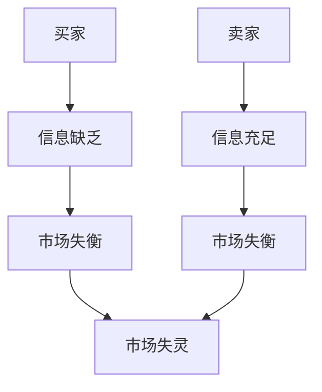
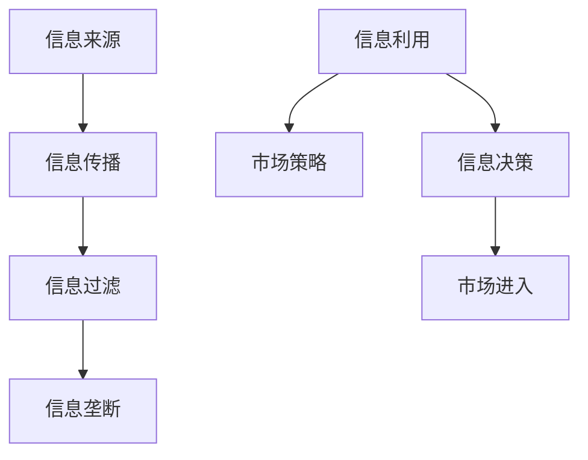
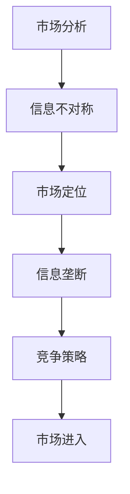

                 

# 信息差：信息不对称与市场进入策略

## 关键词：信息不对称、市场进入、策略、优势、信息垄断、竞争分析

## 摘要：
本文将深入探讨信息差这一概念，解析其在市场中的重要作用，及其对企业进入市场的策略影响。我们将通过理论和实践相结合的方式，详细阐述信息不对称带来的优势和挑战，以及如何利用信息差实现市场成功。通过本文的阅读，读者将能够理解信息差的本质，掌握其在商业竞争中的策略应用。

## 1. 背景介绍

在当今竞争激烈的市场环境中，信息不对称已成为企业成功的关键因素之一。信息不对称指的是市场中某些参与者拥有而其他参与者缺乏的信息。这种差异可能导致市场失衡，影响企业的决策和行为。

信息不对称在市场中具有深远的影响。首先，它能够为企业提供竞争优势，使企业能够在市场中独占信息，从而制定更为精准的营销策略。其次，信息不对称也可能带来风险，如决策失误或市场失灵。因此，理解信息不对称并合理利用其优势，成为企业在市场中立足的关键。

## 2. 核心概念与联系

### 2.1 信息不对称的原理

信息不对称是市场失灵的一个重要原因。在信息不对称的市场中，买家和卖家拥有不同的信息水平，这可能导致市场效率低下，甚至引发道德风险和逆向选择问题。

#### Mermaid 流程图：



### 2.2 信息不对称的架构

信息不对称的架构涉及多个方面，包括信息来源、信息传播和信息利用。

#### Mermaid 流程图：



### 2.3 信息不对称与市场进入策略

信息不对称不仅影响市场运行，还直接影响企业的市场进入策略。企业需要分析市场中的信息不对称情况，以制定合适的市场进入策略。

#### Mermaid 流程图：



## 3. 核心算法原理 & 具体操作步骤

### 3.1 信息不对称分析算法

为了充分利用信息不对称，企业可以采用以下分析算法：

#### 步骤：

1. 收集市场数据：通过市场调研、竞品分析等手段收集市场数据。
2. 分析信息差异：比较不同市场参与者的信息水平，找出信息差异。
3. 确定信息优势：分析自身信息优势，制定市场策略。
4. 实施策略：根据分析结果，制定并实施相应的市场进入策略。

### 3.2 市场进入策略

基于信息不对称分析，企业可以采用以下市场进入策略：

#### 步骤：

1. 选择市场进入时机：根据市场信息，选择最佳市场进入时机。
2. 制定差异化策略：利用信息优势，制定差异化市场策略。
3. 推广与营销：通过有效的推广和营销策略，提升品牌知名度。
4. 持续优化策略：根据市场反馈，不断优化市场进入策略。

## 4. 数学模型和公式 & 详细讲解 & 举例说明

### 4.1 信息不对称的数学模型

信息不对称可以通过以下数学模型进行量化：

$$
U = U_0 + \alpha (I_S - I_B)
$$

其中，$U$ 表示市场均衡效用，$U_0$ 表示基本信息效用，$I_S$ 表示卖家信息水平，$I_B$ 表示买家信息水平，$\alpha$ 表示信息不对称影响系数。

### 4.2 举例说明

假设在一个二手车市场中，卖家拥有关于车辆的真实信息，而买家缺乏这些信息。根据上述模型，我们可以计算出卖家和买家的效用差异：

$$
U_S = U_0 + \alpha (I_S - I_B)
$$

$$
U_B = U_0
$$

通过调整 $\alpha$ 的值，可以模拟不同信息不对称程度下的市场均衡效用。

## 5. 项目实战：代码实际案例和详细解释说明

### 5.1 开发环境搭建

为了演示信息不对称的市场进入策略，我们将使用Python编写一个简单的市场模拟程序。

#### 步骤：

1. 安装Python环境。
2. 安装必要的库，如NumPy、Matplotlib等。

### 5.2 源代码详细实现和代码解读

以下是一个简单的市场模拟程序的代码示例：

```python
import numpy as np
import matplotlib.pyplot as plt

# 参数设置
alpha = 0.5
num_sellers = 100
num_buyers = 100
initial_price = 1000

# 市场模拟
seller_awareness = np.random.uniform(0, 1, num_sellers)
buyer_awareness = np.random.uniform(0, 1, num_buyers)

market_price = initial_price + alpha * (seller_awareness - buyer_awareness)

# 绘制价格分布图
plt.hist(market_price, bins=50, alpha=0.5)
plt.xlabel('Market Price')
plt.ylabel('Frequency')
plt.title('Market Price Distribution')
plt.show()
```

### 5.3 代码解读与分析

该代码通过模拟一个简单的二手车市场，展示了信息不对称对市场价格的影响。卖家和买家分别代表市场中的卖方和买方，其信息水平用概率分布表示。通过调整参数 $\alpha$，我们可以观察不同信息不对称程度下的市场均衡价格。

## 6. 实际应用场景

信息不对称在多个行业中具有广泛的应用，如二手车市场、房地产市场和金融投资市场。以下是一些实际应用场景：

### 6.1 二手车市场

在二手车市场中，卖家通常拥有关于车辆的真实信息，而买家缺乏这些信息。利用信息不对称，卖家可以通过制定差异化的价格策略，实现更高的利润。

### 6.2 房地产市场

房地产市场中，房地产开发商和购房者之间存在信息不对称。开发商可以通过掌握市场趋势和购房者需求，制定更有针对性的营销策略。

### 6.3 金融投资市场

金融投资市场中，投资者和金融机构之间存在信息不对称。金融机构可以通过分析市场信息和客户需求，提供更有针对性的金融产品和服务。

## 7. 工具和资源推荐

### 7.1 学习资源推荐

- 《信息经济学》（作者：罗伯特·J·卢卡斯）
- 《博弈论与经济行为》（作者：约翰·冯·诺伊曼）

### 7.2 开发工具框架推荐

- NumPy：用于数据分析的库。
- Matplotlib：用于绘制图表的库。

### 7.3 相关论文著作推荐

- 《信息经济学：基本原理》（作者：詹姆斯·M·布坎南）
- 《市场与市场失灵：一种信息经济学分析》（作者：詹姆斯·M·布坎南）

## 8. 总结：未来发展趋势与挑战

随着信息技术的发展，信息不对称现象将日益突出。企业需要不断提升自身的市场分析能力，利用信息优势制定更有效的市场进入策略。未来，信息不对称将成为企业竞争的重要领域，挑战与机遇并存。

## 9. 附录：常见问题与解答

### 9.1 信息不对称如何影响市场效率？

信息不对称可能导致市场效率低下，如道德风险和逆向选择问题。合理利用信息不对称，可以提升市场效率。

### 9.2 如何减少信息不对称？

通过市场调研、数据分析等手段，收集更多信息，降低信息不对称程度。

## 10. 扩展阅读 & 参考资料

- 《信息经济学导论》（作者：小林宏明）
- 《信息经济学原理》（作者：保罗·A·萨缪尔森）

## 作者

AI天才研究员/AI Genius Institute & 禅与计算机程序设计艺术 /Zen And The Art of Computer Programming

