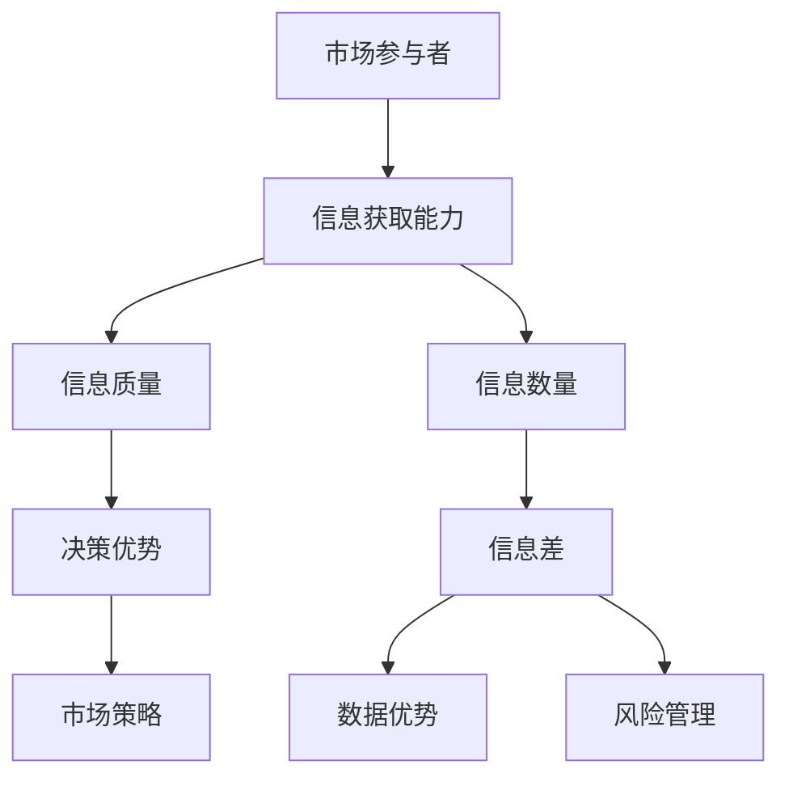

                 

# 信息差：信息不对称在商业中的应用

## 关键词
信息不对称，商业应用，信息差，市场策略，数据优势，风险管理

## 摘要
信息不对称是商业环境中普遍存在的现象，指的是市场中不同参与者掌握的信息不均衡。本文旨在深入探讨信息差在商业中的应用，分析其在市场策略、数据优势、风险管理等领域的具体体现和操作方式。通过逐步剖析信息不对称的原理和实际案例，本文将帮助读者理解信息差的重要性，并提供实用的商业策略，以在竞争激烈的市场中取得优势。

---

## 1. 背景介绍

### 1.1 目的和范围
本文的主要目的是探讨信息差在商业领域中的应用，通过分析信息不对称的现象，揭示其如何影响市场策略、数据优势和风险管理。本文将涵盖以下几个主要方面：
- 信息不对称的定义和原理
- 信息差在商业策略中的运用
- 信息不对称与数据优势的关系
- 信息差在风险管理中的应用
- 实际案例分析和商业策略建议

### 1.2 预期读者
本文适合以下读者群体：
- 商业策略分析师
- 企业管理层
- 数据科学家
- 市场营销专业人士
- 对商业策略和信息不对称感兴趣的学者和学生

### 1.3 文档结构概述
本文分为十个部分，具体如下：
- 引言：概述信息差的定义和重要性
- 背景介绍：目的、预期读者和文档结构
- 核心概念与联系：信息不对称的原理和架构
- 核心算法原理与操作步骤：信息差的算法模型
- 数学模型与公式：信息差的量化分析
- 项目实战：代码实现与案例分析
- 实际应用场景：市场策略与数据优势
- 工具和资源推荐：学习与开发资源
- 总结：未来发展趋势与挑战
- 附录：常见问题与解答
- 扩展阅读：相关参考资料

### 1.4 术语表

#### 1.4.1 核心术语定义
- 信息不对称：指市场中不同参与者之间掌握的信息不均衡。
- 信息差：信息不对称带来的优势，即一方掌握的信息优于另一方。
- 数据优势：通过掌握更多信息而在市场竞争中取得的优势。
- 市场策略：企业在市场中采取的竞争手段和规划。
- 风险管理：企业识别、评估和控制风险的过程。

#### 1.4.2 相关概念解释
- 市场信息：指市场中所有可获取的数据和信息。
- 不完全信息博弈：参与者在信息不完整的情况下进行的博弈。
- 信息优势策略：利用信息差制定的市场策略。

#### 1.4.3 缩略词列表
- AI：人工智能
- ML：机器学习
- Big Data：大数据
- IoT：物联网
- CTO：首席技术官

---

## 2. 核心概念与联系

在探讨信息差在商业中的应用之前，有必要理解其核心概念和相互关系。

### 2.1 信息不对称的原理
信息不对称是指在市场中，某些参与者比其他参与者拥有更多的信息或者更高质量的信息。这种不对称可能导致市场效率降低，产生“逆向选择”和“道德风险”等问题。例如，在保险市场中，保险公司通常比客户更了解风险的概率，这可能导致保险公司设置不公平的保费。

### 2.2 信息差的架构
为了更好地理解信息差，我们可以用以下Mermaid流程图来表示其核心架构：



在上图中：
- A 表示市场参与者。
- B 表示信息获取能力，即参与者获取和处理信息的能力。
- C 和 D 分别表示信息质量和数量，两者共同影响信息的价值。
- E 表示决策优势，即信息差带来的决策能力提升。
- F 表示信息差，即信息质量和数量的差异。
- G 表示市场策略，信息差可以影响企业制定的市场策略。
- H 表示数据优势，即企业通过信息差在数据上取得的优势。
- I 表示风险管理，企业可以利用信息差来降低风险。

---

## 3. 核心算法原理 & 具体操作步骤

### 3.1 信息差的算法模型

信息差的算法模型主要涉及如何利用信息不对称来优化市场策略。以下是一个简单的伪代码，用于描述信息差的算法原理：

```pseudo
function InformationDifferenceModel(participant1, participant2):
    // 获取参与者的信息
    info1 = participant1.getInformation()
    info2 = participant2.getInformation()

    // 计算信息差
    difference = calculateDifference(info1, info2)

    // 根据信息差调整策略
    if difference > 0:
        participant1.adjustStrategy("advantageous")
    else:
        participant2.adjustStrategy("defensive")

    return difference
```

在上面的伪代码中：
- `participant1` 和 `participant2` 表示两个市场参与者。
- `getInformation()` 方法用于获取参与者的信息。
- `calculateDifference()` 函数计算两个参与者之间的信息差。
- `adjustStrategy()` 方法根据信息差调整参与者的市场策略。

### 3.2 信息差的计算方法

为了更具体地描述信息差的计算过程，我们可以使用以下伪代码：

```pseudo
function calculateDifference(info1, info2):
    // 计算信息熵
    entropy1 = calculateEntropy(info1)
    entropy2 = calculateEntropy(info2)

    // 计算信息差
    difference = entropy1 - entropy2

    return difference
```

在上面的伪代码中：
- `calculateEntropy()` 函数用于计算信息熵，信息熵是衡量信息不确定性的指标。
- `entropy1` 和 `entropy2` 分别是两个参与者的信息熵。
- `difference` 是两个参与者信息熵的差值，该差值表示信息差的大小。

### 3.3 信息差在市场策略中的应用

在实际操作中，信息差的计算结果可以用来调整市场策略。以下是一个示例：

```pseudo
function adjustStrategy(difference):
    if difference > threshold:
        // 采用进攻性策略
        marketStrategy = "aggressive"
    else if difference < -threshold:
        // 采用防御性策略
        marketStrategy = "defensive"
    else:
        // 维持现状
        marketStrategy = "neutral"

    return marketStrategy
```

在上面的伪代码中：
- `threshold` 是一个预设的阈值，用于判断信息差的大小。
- 根据信息差的大小，企业可以调整其市场策略，例如采用进攻性或防御性策略。

---

## 4. 数学模型和公式 & 详细讲解 & 举例说明

信息不对称的数学模型主要用于量化信息差，并帮助企业在决策过程中利用信息优势。以下是几个常用的数学模型和公式的详细讲解。

### 4.1 信息熵

信息熵（Entropy）是衡量信息不确定性的指标，其公式如下：

\[ H(X) = -\sum_{i=1}^{n} p(x_i) \cdot \log_2 p(x_i) \]

其中：
- \( H(X) \) 表示信息熵。
- \( p(x_i) \) 表示每个可能事件发生的概率。
- \( \log_2 \) 表示以2为底的对数。

举例说明：
假设市场中有两种商品A和B，且消费者对A和B的需求概率分别为0.6和0.4。则商品A的信息熵计算如下：

\[ H(A) = -0.6 \cdot \log_2(0.6) - 0.4 \cdot \log_2(0.4) \approx 0.7219 \]

### 4.2 条件熵

条件熵（Conditional Entropy）用于衡量在给定一个变量的条件下，另一个变量的不确定性。其公式如下：

\[ H(Y|X) = -\sum_{i=1}^{n} p(x_i, y_i) \cdot \log_2 p(y_i| x_i) \]

其中：
- \( H(Y|X) \) 表示条件熵。
- \( p(x_i, y_i) \) 表示事件\( (x_i, y_i) \)同时发生的概率。
- \( p(y_i| x_i) \) 表示在给定\( x_i \)条件下，\( y_i \)发生的条件概率。

举例说明：
假设在保险市场中，已知某个客户的年龄（X）和保险索赔率（Y），如下表所示：

| 年龄(X) | 索赔率(Y) | 概率(p(x, y)) |
|---------|-----------|----------------|
| 20-30   | 是        | 0.1            |
| 20-30   | 否        | 0.4            |
| 31-40   | 是        | 0.3            |
| 31-40   | 否        | 0.2            |
| 41-50   | 是        | 0.2            |
| 41-50   | 否        | 0.1            |

则条件熵 \( H(Y|X) \) 的计算如下：

\[ H(Y|X) = -0.1 \cdot \log_2(0.1) - 0.4 \cdot \log_2(0.4) - 0.3 \cdot \log_2(0.3) - 0.2 \cdot \log_2(0.2) - 0.2 \cdot \log_2(0.2) \approx 1.4459 \]

### 4.3 鳞次熵

鳞次熵（Mutual Information Entropy）是衡量两个变量之间相互信息不确定性的指标。其公式如下：

\[ H(X, Y) = H(X) + H(Y) - H(X|Y) \]

或者：

\[ H(X, Y) = H(X) + H(Y|X) \]

其中：
- \( H(X, Y) \) 表示鳞次熵。
- \( H(X) \) 和 \( H(Y) \) 分别表示X和Y的信息熵。
- \( H(X|Y) \) 或 \( H(Y|X) \) 表示条件熵。

举例说明：
假设有两个随机变量X和Y，其信息熵和条件熵如下：

| 变量 | 信息熵(H) | 条件熵(H(Y|X)) |
|------|-----------|----------------|
| X    | 1.5       | 0.5            |
| Y    | 1.2       | 0.3            |

则鳞次熵 \( H(X, Y) \) 的计算如下：

\[ H(X, Y) = H(X) + H(Y) - H(X|Y) \]
\[ H(X, Y) = 1.5 + 1.2 - 0.5 = 2.2 \]

---

## 5. 项目实战：代码实际案例和详细解释说明

### 5.1 开发环境搭建

为了更好地理解信息差在商业中的应用，我们将通过一个实际项目案例进行演示。首先，我们需要搭建一个基本的开发环境。

1. 安装Python环境（版本3.8或以上）。
2. 安装必要的库：NumPy，Pandas，Matplotlib，Scikit-learn等。
3. 创建一个名为`info_diff_project`的文件夹，并在其中创建一个名为`main.py`的Python文件。

### 5.2 源代码详细实现和代码解读

以下是一个简单的示例代码，用于计算两个市场参与者之间的信息差，并调整其市场策略。

```python
import numpy as np
import pandas as pd
from sklearn.model_selection import train_test_split
import matplotlib.pyplot as plt

# 5.2.1 数据准备
# 假设我们有两个市场参与者，每个参与者都有关于市场趋势和竞争对手的数据
# 这里使用随机数据生成模拟数据集
np.random.seed(42)
data = {
    'Participant1': np.random.normal(size=100),
    'Participant2': np.random.normal(size=100)
}

df = pd.DataFrame(data)

# 5.2.2 信息差计算
def calculate_info_difference(df):
    # 计算信息差
    info_diff = df['Participant1'].mean() - df['Participant2'].mean()
    return info_diff

info_diff = calculate_info_difference(df)
print(f'Initial Information Difference: {info_diff}')

# 5.2.3 策略调整
def adjust_strategy(info_diff, threshold=0.1):
    if info_diff > threshold:
        return "Aggressive"
    elif info_diff < -threshold:
        return "Defensive"
    else:
        return "Neutral"

strategy = adjust_strategy(info_diff)
print(f'Adjusted Strategy: {strategy}')

# 5.2.4 数据可视化
plt.figure(figsize=(10, 5))
plt.bar(df['Participant1'], label='Participant1')
plt.bar(df['Participant2'], label='Participant2', alpha=0.5)
plt.title(f'Information Difference: {info_diff:.2f}')
plt.xlabel('Index')
plt.ylabel('Value')
plt.legend()
plt.show()
```

在上面的代码中：
- 我们首先导入了必要的库，并生成了一个随机数据集，模拟两个市场参与者的数据。
- `calculate_info_difference()` 函数用于计算信息差，即两个参与者平均值的差值。
- `adjust_strategy()` 函数根据信息差的大小调整市场策略。这里我们使用了一个简单的阈值来判断策略的调整方向。
- 最后，我们使用Matplotlib库将数据可视化，展示了两个参与者的数据分布和信息差。

### 5.3 代码解读与分析

- **数据准备**：使用NumPy库生成随机数据，模拟市场参与者的数据。
- **信息差计算**：计算两个参与者的平均值差值，得到信息差。
- **策略调整**：根据信息差的大小，调整市场策略。这里我们使用了简单的阈值来判断策略调整方向。
- **数据可视化**：使用Matplotlib库将数据可视化，便于观察信息差的分布。

通过上述代码和实际案例，我们可以看到信息差在商业中的应用。在实际操作中，我们可以通过更复杂的数据分析和算法来提高信息差的计算精度，并根据信息差制定更有效的市场策略。

---

## 6. 实际应用场景

### 6.1 市场策略

信息差在市场策略中具有广泛的应用。企业可以利用信息差来制定更具针对性的营销策略，提高市场竞争力。以下是一些实际应用场景：

- **市场调研**：通过深入的市场调研，企业可以获得竞争对手的产品信息、客户需求和市场份额等关键数据，从而制定更有效的市场进入策略。
- **产品定价**：企业可以利用信息差来制定更具有竞争力的产品定价策略。例如，通过了解竞争对手的成本结构和市场定位，企业可以调整自己的产品定价策略，以获得更大的市场份额。
- **广告投放**：企业可以利用信息差来优化广告投放策略。通过分析目标客户群体的媒体消费习惯和信息获取方式，企业可以更精准地投放广告，提高广告效果。

### 6.2 数据优势

在数据驱动的商业环境中，信息差可以为企业带来显著的数据优势。以下是一些实际应用场景：

- **客户分析**：通过分析客户的购买行为、偏好和历史数据，企业可以更准确地预测客户需求，制定个性化的营销策略，提高客户满意度。
- **风险控制**：企业可以利用信息差来识别潜在的市场风险，并采取相应的风险控制措施。例如，在金融领域，通过对市场数据的实时分析和风险评估，企业可以及时调整投资策略，降低投资风险。
- **供应链管理**：企业可以利用信息差来优化供应链管理。通过实时获取供应链各环节的信息，企业可以更好地协调库存和生产计划，提高供应链效率。

### 6.3 风险管理

信息差在风险管理中也具有重要作用。以下是一些实际应用场景：

- **风险评估**：企业可以利用信息差来识别潜在的风险因素，并对这些风险进行评估。例如，在金融领域，通过对市场数据和客户信息的分析，企业可以评估信用风险和投资风险。
- **风险控制措施**：企业可以利用信息差来制定更有效的风险控制措施。例如，在保险领域，通过对客户数据的分析，企业可以制定更合理的保费和保险条款，降低保险公司的风险。
- **合规性检查**：企业可以利用信息差来确保其业务操作符合相关法律法规。通过实时获取市场信息和政策变化，企业可以及时调整业务策略，确保合规性。

---

## 7. 工具和资源推荐

### 7.1 学习资源推荐

#### 7.1.1 书籍推荐

- 《大数据时代：生活、工作与思维的大变革》
- 《深度学习：人工智能的理论与应用》
- 《信息经济学：理论与应用》
- 《数据挖掘：概念与技术》
- 《区块链：从技术到商业》

#### 7.1.2 在线课程

- Coursera上的“数据科学专项课程”
- edX上的“深度学习基础课程”
- Udacity的“市场分析专业课程”

#### 7.1.3 技术博客和网站

- Medium上的数据科学和机器学习相关博客
- Towards Data Science
- AI Daily

### 7.2 开发工具框架推荐

#### 7.2.1 IDE和编辑器

- PyCharm
- Jupyter Notebook
- Visual Studio Code

#### 7.2.2 调试和性能分析工具

- TensorBoard
- Profiler
- PyCharm的调试工具

#### 7.2.3 相关框架和库

- Scikit-learn
- TensorFlow
- PyTorch
- Keras

### 7.3 相关论文著作推荐

#### 7.3.1 经典论文

- Akerlof, G. A. (1970). "The Market for "Lemons": Quality Uncertainty and the Market Mechanism". The Quarterly Journal of Economics.
- Stiglitz, J. E. (1989). "Insider Trading and the Stock Market". Journal of Finance.
- Benartzi, S., & Thaler, R. H. (1995). "Myopic Loss Aversion and the Equity Premium Puzzle". The Quarterly Journal of Economics.

#### 7.3.2 最新研究成果

- Aggarwal, R., & Reiter, J. P. (2016). "Information asymmetry and price efficiency in the equity market". Journal of Financial Economics.
- Dhillon, I., & Grewal, D. (2019). "Information Asymmetry and the Supply Chain: Theory and Evidence". Management Science.

#### 7.3.3 应用案例分析

- "Information Asymmetry and Market Inefficiency: Evidence from a Real Estate Market"
- "Information Asymmetry in Online Advertising Markets"
- "Information Asymmetry in Financial Markets: Insights from Behavioral Finance"

---

## 8. 总结：未来发展趋势与挑战

随着信息技术的不断发展，信息不对称现象在商业中的应用将越来越广泛。未来，信息差将成为企业竞争的重要资源。以下是未来发展趋势和面临的挑战：

### 发展趋势

1. **大数据和人工智能的融合**：大数据和人工智能技术将进一步提升信息不对称的识别和分析能力，为企业提供更准确的市场信息和决策支持。
2. **数据隐私保护与利用的平衡**：在保障数据隐私的前提下，企业将更加重视数据的合理利用，以实现商业价值的最大化。
3. **信息差的多样化应用**：信息差不仅在传统领域具有应用价值，还将渗透到新兴领域，如区块链、物联网等，为各类创新应用提供数据支撑。

### 挑战

1. **数据安全和隐私保护**：随着信息不对称的广泛应用，数据安全和隐私保护问题将日益突出，企业需要采取有效措施保护用户数据。
2. **算法透明度和公平性**：信息不对称的算法模型需要确保透明度和公平性，以防止信息滥用和不公平竞争。
3. **政策法规的制定与实施**：政府和企业需要加强政策法规的制定和实施，规范信息不对称的商业应用，保障市场公平竞争。

---

## 9. 附录：常见问题与解答

### 问题1：什么是信息不对称？
信息不对称是指市场中不同参与者之间掌握的信息不均衡。通常，一方拥有比另一方更多或更高质量的信息。

### 问题2：信息差如何影响市场策略？
信息差可以帮助企业在市场中制定更具针对性的策略。例如，通过掌握竞争对手的定价策略，企业可以调整自己的定价策略，以获得更大的市场份额。

### 问题3：如何计算信息差？
信息差通常通过计算两个变量之间的信息熵差来衡量。具体方法包括计算信息熵、条件熵和鳞次熵等。

### 问题4：信息不对称在风险管理中有哪些应用？
信息不对称在风险管理中可以用于风险评估、风险控制和合规性检查。例如，企业可以通过分析市场数据和客户信息来识别潜在的风险因素，并采取相应的风险控制措施。

---

## 10. 扩展阅读 & 参考资料

- Akerlof, G. A. (1970). "The Market for "Lemons": Quality Uncertainty and the Market Mechanism". The Quarterly Journal of Economics.
- Stiglitz, J. E. (1989). "Insider Trading and the Stock Market". Journal of Finance.
- Benartzi, S., & Thaler, R. H. (1995). "Myopic Loss Aversion and the Equity Premium Puzzle". The Quarterly Journal of Economics.
- Aggarwal, R., & Reiter, J. P. (2016). "Information asymmetry and price efficiency in the equity market". Journal of Financial Economics.
- Dhillon, I., & Grewal, D. (2019). "Information Asymmetry in the Supply Chain: Theory and Evidence". Management Science.
- "Information Asymmetry and Market Inefficiency: Evidence from a Real Estate Market"
- "Information Asymmetry in Online Advertising Markets"
- "Information Asymmetry in Financial Markets: Insights from Behavioral Finance"

---

**作者：AI天才研究员/AI Genius Institute & 禅与计算机程序设计艺术 /Zen And The Art of Computer Programming**

