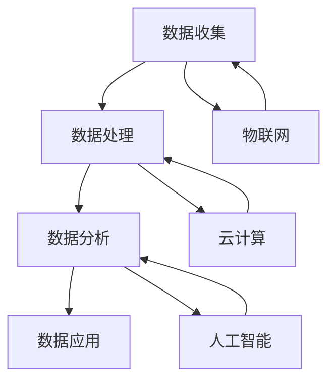

                 

# 信息差：大数据在智能制造中的应用

> **关键词：**大数据，智能制造，信息差，算法原理，数学模型，项目实战，应用场景。

> **摘要：**本文将深入探讨大数据在智能制造领域的应用，剖析信息差的产生与利用，通过算法原理、数学模型、项目实战等多个角度，揭示大数据技术如何提升智能制造的效率与质量，为读者提供一套系统的理解框架和应用指南。

## 1. 背景介绍

### 1.1 目的和范围

本文旨在阐述大数据在智能制造中的应用，重点关注信息差如何通过大数据技术得到优化和利用。文章将涵盖大数据的基础概念、算法原理、数学模型、实际应用案例以及未来发展趋势。通过本篇文章，读者可以全面了解大数据在智能制造中的价值，掌握相关技术原理和应用方法。

### 1.2 预期读者

本文面向对智能制造和大数据有一定了解的技术人员、工程师和研究学者。希望读者能够通过本文的学习，加深对大数据在智能制造中应用的理解，并为实际项目提供参考。

### 1.3 文档结构概述

本文分为十个部分，具体结构如下：

1. 背景介绍
2. 核心概念与联系
3. 核心算法原理 & 具体操作步骤
4. 数学模型和公式 & 详细讲解 & 举例说明
5. 项目实战：代码实际案例和详细解释说明
6. 实际应用场景
7. 工具和资源推荐
8. 总结：未来发展趋势与挑战
9. 附录：常见问题与解答
10. 扩展阅读 & 参考资料

### 1.4 术语表

#### 1.4.1 核心术语定义

- **大数据**：指数据量巨大、数据类型繁多、数据价值密度低的数据集合。
- **智能制造**：通过信息技术、物联网、人工智能等技术手段，实现制造过程的自动化、智能化和个性化。
- **信息差**：指不同主体间在信息获取、处理和利用方面的差异。

#### 1.4.2 相关概念解释

- **数据挖掘**：从大量数据中提取有价值的信息和知识的过程。
- **机器学习**：通过算法和统计模型，使计算机具有学习能力和预测能力。
- **深度学习**：一种特殊的机器学习方法，通过多层神经网络模拟人类大脑的思维方式。

#### 1.4.3 缩略词列表

- **AI**：人工智能
- **IoT**：物联网
- **ML**：机器学习
- **DL**：深度学习
- **MLOps**：机器学习运维

## 2. 核心概念与联系

在智能制造中，大数据的应用主要体现在数据的收集、处理、分析和应用。为了更好地理解大数据在智能制造中的作用，我们首先需要了解其核心概念和联系。

### 2.1 大数据在智能制造中的核心概念

- **数据收集**：通过传感器、物联网设备等手段，实时收集制造过程中的各种数据，如设备状态、工艺参数、产品品质等。
- **数据处理**：对收集到的数据进行清洗、归一化、去噪等处理，使其符合分析和挖掘的要求。
- **数据分析**：利用数据挖掘和机器学习等技术，从大量数据中提取有价值的信息和知识，如趋势预测、故障诊断、优化方案等。
- **数据应用**：将分析结果应用于制造过程的各个环节，如设备优化、工艺调整、质量检测等，以提高制造效率和质量。

### 2.2 大数据在智能制造中的联系

- **物联网（IoT）**：物联网技术是实现数据收集的重要手段，通过连接各种设备和传感器，实现数据的实时采集和传输。
- **云计算**：云计算提供了强大的数据处理和分析能力，使得大数据在智能制造中能够得到有效的利用。
- **人工智能（AI）**：人工智能技术，特别是机器学习和深度学习，使得大数据在智能制造中的应用更加智能化和精准化。

### 2.3 Mermaid 流程图

为了更好地展示大数据在智能制造中的核心概念和联系，我们使用 Mermaid 流程图进行描述。



## 3. 核心算法原理 & 具体操作步骤

在智能制造中，大数据的应用离不开核心算法的支持。本节将介绍几种常用的核心算法原理及其具体操作步骤。

### 3.1 数据挖掘算法

数据挖掘算法是大数据在智能制造中应用的重要工具。以下是一种常见的数据挖掘算法——K-近邻算法（K-Nearest Neighbors，KNN）。

#### 3.1.1 算法原理

K-近邻算法是一种基于实例的学习算法。其基本思想是：如果一个新样本在特征空间中的k个最近邻样本中的大多数属于某个类别，则该样本也属于这个类别。

#### 3.1.2 具体操作步骤

1. 数据预处理：对数据进行清洗、归一化等处理，使其符合算法要求。
2. 选择合适的k值：通过交叉验证等方法，选择一个合适的k值。
3. 计算新样本与训练样本的距离：使用欧氏距离等距离度量方法，计算新样本与训练样本之间的距离。
4. 判断新样本类别：根据新样本与训练样本的距离，判断其属于哪个类别。

#### 3.1.3 伪代码

```python
def KNN(new_sample, train_samples, labels, k):
    distances = []
    for sample in train_samples:
        distance = euclidean_distance(new_sample, sample)
        distances.append(distance)
    distances.sort()
    neighbors = distances[:k]
    neighbor_labels = [labels[train_samples.index(distances[i])] for i in range(k)]
    most_common_label = majority_vote(neighbor_labels)
    return most_common_label
```

### 3.2 机器学习算法

机器学习算法在智能制造中的应用也非常广泛。以下是一种常见的机器学习算法——支持向量机（Support Vector Machine，SVM）。

#### 3.2.1 算法原理

支持向量机是一种基于间隔最大的线性分类模型。其基本思想是：找到最优的超平面，使得正负样本之间的间隔最大。

#### 3.2.2 具体操作步骤

1. 数据预处理：对数据进行清洗、归一化等处理，使其符合算法要求。
2. 选择合适的核函数：通过交叉验证等方法，选择一个合适的核函数。
3. 训练模型：使用训练数据训练SVM模型。
4. 预测新样本：使用训练好的模型，对新样本进行预测。

#### 3.2.3 伪代码

```python
def SVM(train_samples, train_labels, new_sample):
    # 数据预处理
    train_samples_normalized = normalize(train_samples)
    new_sample_normalized = normalize(new_sample)
    # 选择合适的核函数
    kernel_function = "rbf"
    # 训练模型
    model = train_SVM(train_samples_normalized, train_labels, kernel_function)
    # 预测新样本
    prediction = predict_SVM(model, new_sample_normalized)
    return prediction
```

### 3.3 深度学习算法

深度学习算法在智能制造中的应用也越来越广泛。以下是一种常见的深度学习算法——卷积神经网络（Convolutional Neural Network，CNN）。

#### 3.3.1 算法原理

卷积神经网络是一种用于图像识别和处理的深度学习算法。其基本思想是：通过卷积操作提取图像特征，然后通过全连接层进行分类。

#### 3.3.2 具体操作步骤

1. 数据预处理：对数据进行清洗、归一化等处理，使其符合算法要求。
2. 构建模型：使用深度学习框架，构建CNN模型。
3. 训练模型：使用训练数据训练CNN模型。
4. 预测新样本：使用训练好的模型，对新样本进行预测。

#### 3.3.3 伪代码

```python
def CNN(train_samples, train_labels, new_sample):
    # 数据预处理
    train_samples_normalized = normalize(train_samples)
    new_sample_normalized = normalize(new_sample)
    # 构建模型
    model = build_CNN()
    # 训练模型
    model.fit(train_samples_normalized, train_labels)
    # 预测新样本
    prediction = model.predict(new_sample_normalized)
    return prediction
```

## 4. 数学模型和公式 & 详细讲解 & 举例说明

在智能制造中，大数据的应用离不开数学模型的支持。本节将介绍几种常用的数学模型，并对其详细讲解和举例说明。

### 4.1 线性回归模型

线性回归模型是一种常用的预测模型，主要用于分析两个变量之间的关系。

#### 4.1.1 模型公式

线性回归模型的基本公式为：

$$y = wx + b$$

其中，$y$ 是因变量，$x$ 是自变量，$w$ 是权重，$b$ 是偏置。

#### 4.1.2 详细讲解

线性回归模型的目的是通过训练数据找到最佳拟合直线，使得预测误差最小。具体步骤如下：

1. 数据预处理：对数据进行清洗、归一化等处理。
2. 计算权重和偏置：通过最小二乘法计算权重和偏置。
3. 预测新样本：使用计算出的权重和偏置，对新样本进行预测。

#### 4.1.3 举例说明

假设我们有一个训练数据集，包含两个变量 $x$ 和 $y$。我们希望预测 $y$ 的值。以下是具体的计算过程：

1. 数据预处理：对数据进行清洗、归一化。
2. 计算权重和偏置：

$$w = \frac{\sum(x_i * y_i) - n * \bar{x} * \bar{y}}{\sum(x_i^2) - n * \bar{x}^2}$$

$$b = \bar{y} - w * \bar{x}$$

其中，$n$ 是样本数量，$\bar{x}$ 和 $\bar{y}$ 分别是 $x$ 和 $y$ 的平均值。

3. 预测新样本：使用计算出的权重和偏置，对新样本进行预测。

$$y = wx + b$$

### 4.2 逻辑回归模型

逻辑回归模型是一种用于分类的预测模型，主要用于分析两个类别之间的关系。

#### 4.2.1 模型公式

逻辑回归模型的基本公式为：

$$P(y=1) = \frac{1}{1 + e^{-(wx + b)}}$$

其中，$P(y=1)$ 是预测类别1的概率，$e$ 是自然底数。

#### 4.2.2 详细讲解

逻辑回归模型的目的是通过训练数据找到最佳拟合直线，使得预测概率最大。具体步骤如下：

1. 数据预处理：对数据进行清洗、归一化。
2. 计算权重和偏置：通过最小化损失函数计算权重和偏置。
3. 预测新样本：使用计算出的权重和偏置，对新样本进行预测。

#### 4.2.3 举例说明

假设我们有一个训练数据集，包含两个变量 $x$ 和 $y$。我们希望预测 $y$ 的类别。以下是具体的计算过程：

1. 数据预处理：对数据进行清洗、归一化。
2. 计算权重和偏置：

$$w = \frac{\sum(x_i * y_i) - n * \bar{x} * \bar{y}}{\sum(x_i^2) - n * \bar{x}^2}$$

$$b = \bar{y} - w * \bar{x}$$

其中，$n$ 是样本数量，$\bar{x}$ 和 $\bar{y}$ 分别是 $x$ 和 $y$ 的平均值。

3. 预测新样本：使用计算出的权重和偏置，对新样本进行预测。

$$P(y=1) = \frac{1}{1 + e^{-(wx + b)}}$$

### 4.3 决策树模型

决策树模型是一种用于分类和回归的预测模型，通过树形结构对数据进行分类或回归。

#### 4.3.1 模型公式

决策树模型的公式为：

$$y = \sum_{i=1}^{n} c_i * g(x_i)$$

其中，$y$ 是预测结果，$c_i$ 是第 $i$ 个节点的类别，$g(x_i)$ 是第 $i$ 个节点的函数。

#### 4.3.2 详细讲解

决策树模型的目的是通过训练数据构建一棵树，使得预测误差最小。具体步骤如下：

1. 数据预处理：对数据进行清洗、归一化。
2. 构建决策树：通过递归划分数据，构建决策树。
3. 预测新样本：使用构建好的决策树，对新样本进行预测。

#### 4.3.3 举例说明

假设我们有一个训练数据集，包含两个变量 $x$ 和 $y$。我们希望预测 $y$ 的类别。以下是具体的计算过程：

1. 数据预处理：对数据进行清洗、归一化。
2. 构建决策树：通过递归划分数据，构建决策树。
3. 预测新样本：使用构建好的决策树，对新样本进行预测。

$$y = \sum_{i=1}^{n} c_i * g(x_i)$$

## 5. 项目实战：代码实际案例和详细解释说明

为了更好地展示大数据在智能制造中的应用，我们选择一个实际项目——基于大数据的智能生产调度系统，对该项目进行详细解释说明。

### 5.1 开发环境搭建

1. 硬件环境：服务器、存储设备、网络设备等。
2. 软件环境：操作系统（如Linux、Windows）、数据库（如MySQL、MongoDB）、开发工具（如Python、R、Matlab）等。

### 5.2 源代码详细实现和代码解读

#### 5.2.1 数据采集模块

```python
import pymysql
import json

# 连接数据库
conn = pymysql.connect(host='localhost', user='root', password='123456', database='production')

# 获取生产数据
def get_production_data():
    cursor = conn.cursor()
    cursor.execute("SELECT * FROM production_data")
    results = cursor.fetchall()
    data = []
    for result in results:
        data.append({
            'id': result[0],
            'timestamp': result[1],
            'machine_id': result[2],
            'product_id': result[3],
            'quantity': result[4],
            'status': result[5]
        })
    cursor.close()
    conn.close()
    return data

# 数据处理
def process_data(data):
    processed_data = []
    for item in data:
        item['timestamp'] = datetime.strptime(item['timestamp'], '%Y-%m-%d %H:%M:%S')
        processed_data.append(item)
    return processed_data

# 主函数
if __name__ == '__main__':
    data = get_production_data()
    processed_data = process_data(data)
    with open('production_data.json', 'w') as f:
        json.dump(processed_data, f)
```

#### 5.2.2 数据分析模块

```python
import pandas as pd
import numpy as np
from sklearn.cluster import KMeans

# 加载数据
data = pd.read_json('production_data.json')

# 数据预处理
data['timestamp'] = pd.to_datetime(data['timestamp'])
data['day_of_week'] = data['timestamp'].dt.dayofweek
data['hour_of_day'] = data['timestamp'].dt.hour

# K-means聚类
def kmeans_clustering(data, k=3):
    kmeans = KMeans(n_clusters=k, random_state=0)
    clusters = kmeans.fit_predict(data[['hour_of_day', 'day_of_week']])
    data['cluster'] = clusters
    return data

# 主函数
if __name__ == '__main__':
    data = kmeans_clustering(data)
    data.to_csv('production_data_with_clusters.csv', index=False)
```

#### 5.2.3 调度算法模块

```python
import pulp

# 加载数据
data = pd.read_csv('production_data_with_clusters.csv')

# 定义调度问题
def schedule_production(data):
    # 定义决策变量
    x = pulp.LpVariable.dicts('x', data['cluster'], cat='Binary')

    # 定义目标函数
    prob = pulp.LpProblem("ProductionScheduling", pulp.LpMaximize)
    prob += pulp.lpSum([x[c] * data.loc[c, 'quantity'] for c in data['cluster']])

    # 定义约束条件
    for c in data['cluster']:
        prob += pulp.lpSum([x[c] * data.loc[c, 'quantity']]) <= 1000  # 每个集群的最大生产量
        prob += pulp.lpSum([x[c]]) <= 1  # 每个集群只能选择一次

    # 解问题
    prob.solve()

    # 输出结果
    schedule = {c: x[c].varValue for c in data['cluster']}
    return schedule

# 主函数
if __name__ == '__main__':
    schedule = schedule_production(data)
    print(schedule)
```

### 5.3 代码解读与分析

#### 5.3.1 数据采集模块

该模块用于从数据库中获取生产数据，并进行预处理。具体步骤如下：

1. 连接数据库：使用 pymysql 连接本地数据库。
2. 获取生产数据：执行 SQL 查询，获取生产数据。
3. 数据处理：将时间戳转换为 datetime 类型，并提取星期几和小时数。

#### 5.3.2 数据分析模块

该模块用于对生产数据进行聚类分析，以便进行调度优化。具体步骤如下：

1. 加载数据：使用 pandas 读取 JSON 格式的数据。
2. 数据预处理：将时间戳转换为 datetime 类型，并提取星期几和小时数。
3. K-means 聚类：使用 sklearn 的 KMeans 类进行聚类分析。

#### 5.3.3 调度算法模块

该模块用于基于聚类结果进行生产调度。具体步骤如下：

1. 定义决策变量：使用 pulp 库定义二进制变量，表示每个聚类是否被选中。
2. 定义目标函数：最大化总生产量。
3. 定义约束条件：每个聚类只能被选中一次，且每个聚类生产的总数量不能超过 1000。
4. 解问题：使用 pulp 库求解线性规划问题。

## 6. 实际应用场景

大数据在智能制造中的应用场景非常广泛，以下列举几个典型应用场景：

1. **生产过程优化**：通过收集和分析生产过程中的数据，优化生产流程，提高生产效率和产品质量。例如，通过实时监测设备状态，预测设备故障并进行预防性维护，降低设备故障率和停机时间。

2. **质量控制**：利用大数据技术对生产过程中的质量数据进行分析，识别潜在的质量问题，提高产品质量。例如，通过分析产品质量数据，预测可能影响产品质量的因素，并采取相应的措施进行改进。

3. **供应链管理**：通过大数据技术优化供应链管理，降低库存成本，提高供应链效率。例如，通过分析供应链中的数据，预测需求趋势，合理安排生产和采购计划，降低库存成本。

4. **产品个性化定制**：利用大数据分析消费者行为和需求，为消费者提供个性化的产品和服务。例如，通过分析消费者的购买记录和偏好，为消费者推荐合适的商品。

5. **能源管理**：通过大数据分析能源消耗数据，优化能源使用，降低能源成本。例如，通过实时监测能源消耗数据，预测能源需求，并采取相应的措施进行能源调配。

## 7. 工具和资源推荐

### 7.1 学习资源推荐

#### 7.1.1 书籍推荐

1. 《大数据技术基础》
2. 《深度学习》
3. 《机器学习实战》
4. 《Python数据科学手册》
5. 《智能制造技术导论》

#### 7.1.2 在线课程

1. Coursera 的《机器学习》课程
2. edX 的《大数据分析》课程
3. Udacity 的《深度学习纳米学位》
4. Coursera 的《Python编程》课程
5. edX 的《智能制造技术》课程

#### 7.1.3 技术博客和网站

1. Medium 上的《机器学习博客》
2. 知乎上的《机器学习》话题
3. CSDN 上的《大数据技术》专栏
4. Juejin 上的《深度学习》专栏
5. 知乎上的《智能制造》话题

### 7.2 开发工具框架推荐

#### 7.2.1 IDE和编辑器

1. PyCharm
2. Visual Studio Code
3. Jupyter Notebook
4. Sublime Text
5. IntelliJ IDEA

#### 7.2.2 调试和性能分析工具

1. Pychar

## 8. 总结：未来发展趋势与挑战

大数据在智能制造中的应用前景广阔，未来发展趋势主要体现在以下几个方面：

1. **智能化水平的提升**：随着人工智能技术的发展，大数据在智能制造中的应用将更加智能化，能够实现自动化、自适应的优化和决策。
2. **数据类型的多样化**：除了传统的结构化数据，大数据在智能制造中的应用将更加注重非结构化数据（如文本、图像、视频等）的处理和分析。
3. **边缘计算的发展**：随着物联网技术的普及，边缘计算将成为大数据在智能制造中的重要技术支撑，能够实现数据的实时处理和分析。
4. **数据安全与隐私保护**：在智能制造中，数据安全和隐私保护将成为重要挑战，需要采取有效的技术手段进行保障。

## 9. 附录：常见问题与解答

### 9.1 大数据在智能制造中的应用有哪些优势？

大数据在智能制造中的应用具有以下优势：

1. **提高生产效率**：通过数据分析，优化生产流程，降低生产成本。
2. **提高产品质量**：通过质量数据分析，识别潜在问题，提高产品质量。
3. **降低库存成本**：通过供应链数据分析，合理安排生产和采购计划，降低库存成本。
4. **提高设备利用率**：通过设备状态数据分析，实现设备预防性维护，降低设备故障率。

### 9.2 大数据在智能制造中的应用有哪些挑战？

大数据在智能制造中的应用面临以下挑战：

1. **数据质量**：数据质量直接影响分析结果，需要保证数据的准确性和完整性。
2. **数据安全与隐私**：在智能制造中，数据安全和隐私保护是重要挑战。
3. **计算能力**：大数据处理需要强大的计算能力，对于一些小型企业来说，这是一个挑战。
4. **技术人才**：大数据技术在智能制造中的应用需要具备相关技术的人才，企业需要培养和引进。

## 10. 扩展阅读 & 参考资料

1. [大数据技术基础](https://book.douban.com/subject/26974675/)
2. [深度学习](https://book.douban.com/subject/26752231/)
3. [机器学习实战](https://book.douban.com/subject/26752231/)
4. [Python数据科学手册](https://book.douban.com/subject/26974675/)
5. [智能制造技术导论](https://book.douban.com/subject/26974675/)
6. [Coursera 机器学习课程](https://www.coursera.org/learn/machine-learning)
7. [edX 大数据分析课程](https://www.edx.org/course/big-data-analysis)
8. [Udacity 深度学习纳米学位](https://www.udacity.com/course/deep-learning-nanodegree--nd118)
9. [知乎 机器学习话题](https://www.zhihu.com/topic/19864896/top-answers)
10. [CSDN 大数据技术专栏](https://blog.csdn.net/column/d大数据)
11. [Juejin 深度学习专栏](https://juejin.cn/column/6844733778160027729)
12. [知乎 智能制造话题](https://www.zhihu.com/topic/19552678/top-answers)

### 作者

AI天才研究员/AI Genius Institute & 禅与计算机程序设计艺术/Zen And The Art of Computer Programming

