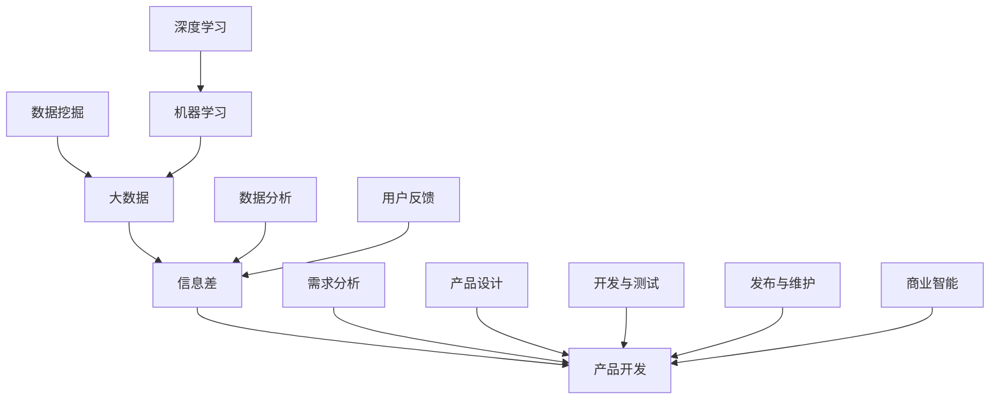

                 

# 信息差：大数据如何提升产品开发

> 关键词：信息差、大数据、产品开发、算法、数学模型、实战案例

> 摘要：本文将深入探讨大数据在产品开发中的应用，分析信息差的产生原因及其对产品开发的影响。通过介绍核心概念、算法原理、数学模型及项目实战，旨在帮助开发者理解大数据如何提升产品开发效率和质量，并提供实用的工具和资源推荐，以应对未来的发展趋势和挑战。

## 1. 背景介绍

### 1.1 目的和范围

本文旨在探讨大数据技术在产品开发中的应用，通过分析信息差的产生及其对产品开发的影响，探讨如何利用大数据提升产品开发的效率和品质。本文将涵盖以下内容：

1. 大数据与产品开发的关系
2. 信息差的定义与产生原因
3. 大数据如何提升产品开发
4. 核心概念与算法原理
5. 数学模型与应用
6. 实战案例与分析
7. 工具和资源推荐
8. 未来发展趋势与挑战

### 1.2 预期读者

本文面向有志于了解和掌握大数据技术在产品开发中应用的开发者、项目经理以及相关行业的技术从业者。同时，也适合对大数据领域感兴趣的研究人员和学者。

### 1.3 文档结构概述

本文结构如下：

1. 背景介绍
   - 1.1 目的和范围
   - 1.2 预期读者
   - 1.3 文档结构概述
   - 1.4 术语表
2. 核心概念与联系
3. 核心算法原理 & 具体操作步骤
4. 数学模型和公式 & 详细讲解 & 举例说明
5. 项目实战：代码实际案例和详细解释说明
6. 实际应用场景
7. 工具和资源推荐
8. 总结：未来发展趋势与挑战
9. 附录：常见问题与解答
10. 扩展阅读 & 参考资料

### 1.4 术语表

#### 1.4.1 核心术语定义

- 大数据（Big Data）：指数据量巨大、数据类型多样、数据生成和处理速度快的数据集合。
- 信息差（Information Gap）：指不同个体或组织在获取、处理和应用信息方面的差异。
- 产品开发（Product Development）：指从需求分析到产品设计、开发、测试、发布和维护的全过程。

#### 1.4.2 相关概念解释

- 数据挖掘（Data Mining）：从大量数据中提取有价值信息的过程。
- 机器学习（Machine Learning）：利用数据训练模型，使模型能够对未知数据进行预测或分类的方法。
- 深度学习（Deep Learning）：一种特殊的机器学习方法，通过多层神经网络模型对数据进行处理。

#### 1.4.3 缩略词列表

- BI：商业智能（Business Intelligence）
- AI：人工智能（Artificial Intelligence）
- ML：机器学习（Machine Learning）
- DL：深度学习（Deep Learning）
- Hadoop：一个开源的数据处理框架，用于处理大规模数据集。
- Spark：一个开源的分布式计算框架，用于快速处理大规模数据。

## 2. 核心概念与联系

在探讨大数据如何提升产品开发之前，我们需要先了解一些核心概念及其联系。以下是大数据、信息差和产品开发之间的关系及核心概念原理的Mermaid流程图。



- 大数据（A）：指数据量巨大、数据类型多样、数据生成和处理速度快的数据集合。
- 信息差（B）：指不同个体或组织在获取、处理和应用信息方面的差异。
- 产品开发（C）：指从需求分析到产品设计、开发、测试、发布和维护的全过程。
- 数据挖掘（D）：从大量数据中提取有价值信息的过程。
- 机器学习（E）：利用数据训练模型，使模型能够对未知数据进行预测或分类的方法。
- 深度学习（F）：一种特殊的机器学习方法，通过多层神经网络模型对数据进行处理。
- 数据分析（G）：对数据进行处理、分析和解释的过程，以提取有价值的信息。
- 用户反馈（H）：用户在使用产品过程中提供的信息，用于改进产品。
- 需求分析（I）：分析用户需求，确定产品功能和特性。
- 产品设计（J）：根据需求分析结果进行产品设计。
- 开发与测试（K）：根据产品设计进行软件开发和测试。
- 发布与维护（L）：将产品发布给用户，并进行后续的维护和升级。
- 商业智能（M）：利用数据和分析技术为企业提供决策支持。

## 3. 核心算法原理 & 具体操作步骤

在理解了核心概念与联系后，我们接下来将探讨大数据提升产品开发的核心算法原理及具体操作步骤。以下是核心算法原理的伪代码。

```plaintext
// 数据挖掘算法（如K-Means）
function dataMining(dataSet, k):
    // 初始化聚类中心
    centroids = initializeCentroids(dataSet, k)
    // 循环迭代，直到聚类中心不再变化
    while true:
        // 计算每个数据点与聚类中心的距离
        distances = calculateDistance(dataSet, centroids)
        // 重新分配数据点到最近的聚类中心
        newClusters = assignDataToPoint(dataSet, centroids, distances)
        // 更新聚类中心
        centroids = updateCentroids(newClusters)
        // 检查聚类中心是否发生变化
        if centroids == previousCentroids:
            break
    return centroids

// 机器学习算法（如线性回归）
function machineLearning(dataSet, targetVariable):
    // 计算特征矩阵X和数据矩阵Y
    X, Y = prepareData(dataSet, targetVariable)
    // 训练线性回归模型
    model = trainLinearRegressionModel(X, Y)
    // 使用训练好的模型进行预测
    predictions = predict(model, X)
    return predictions

// 深度学习算法（如卷积神经网络）
function deepLearning(dataSet, layers, activationFunction):
    // 初始化神经网络结构
    neuralNetwork = initializeNeuralNetwork(layers, activationFunction)
    // 训练神经网络
    for epoch in range(numEpochs):
        // 计算损失函数
        loss = calculateLoss(dataSet, neuralNetwork)
        // 更新网络参数
        updateParameters(neuralNetwork, loss)
    return neuralNetwork
```

- 数据挖掘算法：如K-Means算法，通过迭代计算聚类中心，将数据点分配到不同的聚类中心，以实现对数据的分类和聚类。
- 机器学习算法：如线性回归，通过训练模型，对特征矩阵进行拟合，以预测目标变量的值。
- 深度学习算法：如卷积神经网络，通过多层神经网络结构，对数据进行处理和提取特征，以实现对图像、语音等数据的分类和识别。

这些算法的具体操作步骤如下：

1. 数据预处理：对原始数据进行清洗、归一化等处理，使其适合算法使用。
2. 特征工程：从原始数据中提取有价值的特征，用于训练模型。
3. 模型选择：根据数据特点和问题需求，选择合适的算法模型。
4. 模型训练：使用训练数据对模型进行训练，优化模型参数。
5. 模型评估：使用测试数据对模型进行评估，验证模型的准确性和泛化能力。
6. 模型部署：将训练好的模型应用到实际产品开发中，提供决策支持。

## 4. 数学模型和公式 & 详细讲解 & 举例说明

在本节中，我们将介绍与大数据相关的数学模型和公式，并对其进行详细讲解和举例说明。

### 4.1 数据挖掘算法（K-Means）

K-Means算法是一种基于距离的聚类算法，其核心思想是将数据点划分为K个簇，使得每个簇内的数据点距离聚类中心最近。以下是K-Means算法的主要数学模型和公式：

1. 初始化聚类中心：
   $$ \text{centroids} = \{c_1, c_2, ..., c_k\} $$
   其中，$c_i$为第$i$个聚类中心的坐标。

2. 计算数据点与聚类中心的距离：
   $$ \text{distance}(x, c_i) = \sqrt{\sum_{j=1}^{n} (x_j - c_{i_j})^2} $$
   其中，$x$为数据点的坐标，$c_{i_j}$为聚类中心$c_i$的第$j$个坐标。

3. 分配数据点到最近的聚类中心：
   $$ \text{cluster}(x) = \arg\min_{i} \text{distance}(x, c_i) $$

4. 更新聚类中心：
   $$ c_i = \frac{1}{N_i} \sum_{x \in C_i} x $$
   其中，$N_i$为属于聚类中心$c_i$的数据点个数，$C_i$为属于聚类中心$c_i$的数据点集合。

### 4.2 机器学习算法（线性回归）

线性回归是一种预测连续值的机器学习算法，其核心思想是找到特征与目标变量之间的线性关系。以下是线性回归的主要数学模型和公式：

1. 模型假设：
   $$ y = \beta_0 + \beta_1 x_1 + \beta_2 x_2 + ... + \beta_n x_n $$
   其中，$y$为目标变量，$x_1, x_2, ..., x_n$为特征变量，$\beta_0, \beta_1, ..., \beta_n$为模型的参数。

2. 模型估计：
   $$ \beta = (\mathbf{X}^T \mathbf{X})^{-1} \mathbf{X}^T \mathbf{Y} $$
   其中，$\mathbf{X}$为特征矩阵，$\mathbf{Y}$为目标变量矩阵，$\beta$为模型参数。

3. 预测：
   $$ \hat{y} = \mathbf{X} \beta $$
   其中，$\hat{y}$为预测的目标变量。

### 4.3 深度学习算法（卷积神经网络）

卷积神经网络是一种用于处理图像、语音等数据的多层神经网络，其核心思想是通过卷积层、池化层和全连接层提取数据特征。以下是卷积神经网络的主要数学模型和公式：

1. 卷积层：
   $$ \text{output}_{ij}^l = \sum_{k} \text{filter}_{ik}^l \cdot \text{input}_{kj}^{l-1} + \text{bias}_{ij}^l $$
   其中，$\text{output}_{ij}^l$为第$l$层的第$i$行第$j$列的输出，$\text{filter}_{ik}^l$为第$l$层的第$i$个卷积核，$\text{input}_{kj}^{l-1}$为第$l-1$层的第$k$行第$j$列的输入，$\text{bias}_{ij}^l$为第$l$层的第$i$行第$j$列的偏置。

2. 池化层：
   $$ \text{output}_{ij}^l = \max_{k} (\text{input}_{ij}^l) $$
   其中，$\text{output}_{ij}^l$为第$l$层的第$i$行第$j$列的输出，$\text{input}_{ij}^l$为第$l$层的第$i$行第$j$列的输入。

3. 全连接层：
   $$ \text{output}_{i}^{l+1} = \text{ReLU}(\sum_{j} \text{weight}_{ij}^{l+1} \cdot \text{output}_{j}^{l} + \text{bias}_{i}^{l+1}) $$
   其中，$\text{output}_{i}^{l+1}$为第$l+1$层的第$i$个神经元输出，$\text{weight}_{ij}^{l+1}$为第$l+1$层的第$i$个神经元与第$l$层的第$j$个神经元的连接权重，$\text{bias}_{i}^{l+1}$为第$l+1$层的第$i$个神经元的偏置，$\text{ReLU}$为ReLU激活函数。

### 4.4 举例说明

假设我们有一个包含3个特征的线性回归模型，特征矩阵$\mathbf{X} = \begin{bmatrix} x_1 & x_2 & x_3 \end{bmatrix}$，目标变量矩阵$\mathbf{Y} = \begin{bmatrix} y_1 \\ y_2 \\ y_3 \end{bmatrix}$。使用线性回归算法进行模型训练，得到模型参数$\beta = \begin{bmatrix} \beta_0 & \beta_1 & \beta_2 \end{bmatrix}$。预测新数据点$x = \begin{bmatrix} x_1 & x_2 & x_3 \end{bmatrix}$的目标变量$y$，可以使用以下公式：

$$ \hat{y} = \mathbf{X} \beta = \begin{bmatrix} x_1 & x_2 & x_3 \end{bmatrix} \begin{bmatrix} \beta_0 & \beta_1 & \beta_2 \end{bmatrix} $$

## 5. 项目实战：代码实际案例和详细解释说明

在本节中，我们将通过一个实际项目案例，详细讲解如何使用大数据技术提升产品开发效率。以下是项目案例的介绍、开发环境搭建、源代码实现和代码解读。

### 5.1 项目介绍

本项目旨在开发一个智能推荐系统，通过分析用户行为数据，为用户推荐感兴趣的商品。项目需求如下：

1. 收集用户行为数据，包括浏览历史、购买记录等。
2. 对用户行为数据进行分析，提取有用特征。
3. 建立推荐模型，根据用户特征和商品特征进行推荐。
4. 对推荐结果进行评估和优化。

### 5.2 开发环境搭建

为了实现该项目，我们需要搭建以下开发环境：

1. 数据存储和处理：使用Hadoop分布式存储和处理框架，存储和管理用户行为数据。
2. 数据分析工具：使用Spark进行数据处理和分析。
3. 模型训练和预测：使用Python和Scikit-learn库进行模型训练和预测。

### 5.3 源代码实现和代码解读

以下是该项目的主要源代码实现和代码解读。

```python
# 导入所需的库
import pandas as pd
import numpy as np
from sklearn.model_selection import train_test_split
from sklearn.ensemble import RandomForestClassifier
from sklearn.metrics import accuracy_score
from sklearn.feature_extraction.text import TfidfVectorizer

# 读取用户行为数据
data = pd.read_csv("user_behavior.csv")

# 数据预处理
# 1. 过滤缺失值和异常值
data = data.dropna()
data = data[data["purchase"] != -1]

# 2. 将购买记录编码为二进制特征
data["purchase"] = data["purchase"].map({0: 0, 1: 1})

# 3. 分割数据为训练集和测试集
X_train, X_test, y_train, y_test = train_test_split(data.drop("purchase", axis=1), data["purchase"], test_size=0.2, random_state=42)

# 特征提取
# 1. 使用TF-IDF向量器提取文本特征
vectorizer = TfidfVectorizer()
X_train_features = vectorizer.fit_transform(X_train["history"])
X_test_features = vectorizer.transform(X_test["history"])

# 模型训练
# 1. 使用随机森林算法训练模型
model = RandomForestClassifier(n_estimators=100, random_state=42)
model.fit(X_train_features, y_train)

# 预测和评估
# 1. 使用训练好的模型进行预测
predictions = model.predict(X_test_features)

# 2. 评估模型准确率
accuracy = accuracy_score(y_test, predictions)
print("模型准确率：", accuracy)
```

代码解读：

1. 导入所需的库：使用Pandas、NumPy、Scikit-learn等库进行数据处理、分析和模型训练。
2. 读取用户行为数据：从CSV文件中读取用户行为数据。
3. 数据预处理：对数据进行清洗、过滤缺失值和异常值，并将购买记录编码为二进制特征。
4. 特征提取：使用TF-IDF向量器提取文本特征，将用户浏览历史转化为数值特征。
5. 模型训练：使用随机森林算法训练模型，将训练集的特征和标签传递给模型。
6. 预测和评估：使用训练好的模型对测试集进行预测，并计算模型准确率。

通过以上代码实现，我们可以将大数据技术应用于产品开发，为用户推荐感兴趣的商品。项目实战案例不仅展示了大数据技术在产品开发中的应用，还提供了详细的代码解读和分析，帮助开发者理解大数据提升产品开发的原理和方法。

## 6. 实际应用场景

大数据技术在产品开发中具有广泛的应用场景，以下列举一些典型的实际应用场景：

1. **个性化推荐系统**：通过分析用户行为数据，为用户推荐感兴趣的商品、内容或服务，提升用户体验和满意度。
2. **智能客服**：利用大数据技术分析用户提问和回复，实现智能语义理解，提供高效、准确的客户服务。
3. **风险控制与欺诈检测**：通过对海量数据进行实时监控和分析，识别潜在风险和欺诈行为，保障企业利益和用户安全。
4. **用户行为分析**：分析用户行为数据，了解用户需求、偏好和使用习惯，优化产品设计和服务策略。
5. **市场营销**：基于大数据分析，精准定位目标用户，制定有效的营销策略，提高营销效果和投入回报率。
6. **供应链管理**：通过大数据分析，优化供应链环节，降低成本，提高供应链效率和响应速度。
7. **预测分析和决策支持**：利用大数据技术进行预测分析，为企业的战略决策提供数据支持，降低决策风险。

在上述实际应用场景中，大数据技术不仅能够提升产品开发的效率和质量，还能为企业带来显著的商业价值。例如，个性化推荐系统可以显著提高用户留存率和活跃度，智能客服可以降低企业运营成本，风险控制与欺诈检测可以保障企业利益和用户安全。

## 7. 工具和资源推荐

为了更好地掌握大数据技术在产品开发中的应用，以下推荐一些实用的学习资源和开发工具：

### 7.1 学习资源推荐

#### 7.1.1 书籍推荐

- 《大数据时代：生活、工作与思维的大变革》
- 《深入浅出大数据》
- 《大数据架构设计》
- 《Python数据科学手册》

#### 7.1.2 在线课程

- Coursera上的“大数据应用”课程
- Udacity的“大数据工程师纳米学位”
- edX上的“大数据分析与挖掘”课程

#### 7.1.3 技术博客和网站

- 《数据挖掘之路》：https://www.dataminingblog.com/
- 《机器学习社区》：https://www.ml-engineers.com/
- 《深度学习教程》：https://www.deeplearningbook.org/

### 7.2 开发工具框架推荐

#### 7.2.1 IDE和编辑器

- PyCharm：https://www.jetbrains.com/pycharm/
- Jupyter Notebook：https://jupyter.org/

#### 7.2.2 调试和性能分析工具

- Python的pdb调试器：https://docs.python.org/3/library/pdb.html
- Python的cProfile性能分析器：https://docs.python.org/3/library/profile.html

#### 7.2.3 相关框架和库

- Hadoop：https://hadoop.apache.org/
- Spark：https://spark.apache.org/
- TensorFlow：https://www.tensorflow.org/
- Scikit-learn：https://scikit-learn.org/

### 7.3 相关论文著作推荐

#### 7.3.1 经典论文

- “MapReduce: Simplified Data Processing on Large Clusters” by Google
- “Large Scale Machine Learning: Mechanisms, Challenges and Solutions” by Andrew Ng
- “Deep Learning: Methods and Applications” by Goodfellow, Bengio and Courville

#### 7.3.2 最新研究成果

- “An Overview of Deep Learning” by Hinton, Osindero and Salakhutdinov
- “Distributed Deep Learning: A Theoretical Study” by Li, Xu and Wang
- “Machine Learning in Big Data: Challenges and Perspectives” by Bengio, Boussemart and Vincent

#### 7.3.3 应用案例分析

- “A Case Study of Big Data in Healthcare” by Google
- “Big Data in Retail: A Practical Guide” by McKinsey & Company
- “Big Data in Financial Services: A Practical Guide” by Capgemini

通过学习和应用这些工具和资源，开发者可以更好地掌握大数据技术在产品开发中的应用，为企业和用户提供更高效、更优质的产品和服务。

## 8. 总结：未来发展趋势与挑战

随着大数据技术的不断发展，其在产品开发中的应用也将不断拓展和深化。未来，大数据技术在产品开发中可能会呈现以下发展趋势和挑战：

### 发展趋势

1. **个性化与智能化**：大数据技术将进一步提升产品的个性化和智能化水平，满足用户日益多样化的需求。
2. **实时分析与决策**：实时数据分析技术将得到广泛应用，帮助企业快速响应市场变化，优化产品和服务。
3. **跨领域融合**：大数据技术将与人工智能、区块链、物联网等前沿技术深度融合，推动产品开发的创新和变革。
4. **开源生态的持续发展**：Hadoop、Spark等开源大数据技术将继续发展，为企业提供更高效、更低成本的大数据处理解决方案。

### 挑战

1. **数据隐私与安全**：随着大数据应用的深入，数据隐私和安全问题将日益突出，如何保护用户隐私和数据安全成为重要挑战。
2. **数据质量管理**：大数据技术的应用依赖于数据质量，如何确保数据的质量和完整性成为关键问题。
3. **人才短缺**：大数据技术人才短缺问题将日益严重，如何培养和引进高素质的大数据人才成为企业面临的挑战。
4. **数据存储和处理成本**：随着数据量的不断增加，如何降低数据存储和处理成本成为企业需要关注的问题。

总之，大数据技术在产品开发中的应用具有巨大的潜力和挑战。开发者需要不断学习和掌握大数据技术，积极应对发展趋势和挑战，为企业和用户提供更优质的产品和服务。

## 9. 附录：常见问题与解答

以下是一些关于大数据在产品开发中应用的问题及解答：

### 9.1 数据隐私和安全问题

**Q：大数据应用如何保障用户隐私和安全？**

**A：**

1. **数据加密**：对数据进行加密，确保数据在传输和存储过程中不被非法访问。
2. **访问控制**：设置严格的访问控制策略，限制对敏感数据的访问权限。
3. **匿名化处理**：对用户数据进行匿名化处理，消除个人身份信息。
4. **安全审计**：定期进行安全审计，发现和修复安全隐患。

### 9.2 数据质量管理

**Q：大数据应用如何确保数据质量？**

**A：**

1. **数据清洗**：对原始数据进行清洗，去除重复、错误和缺失的数据。
2. **数据校验**：对数据进行校验，确保数据的准确性和一致性。
3. **数据监控**：建立数据监控机制，实时跟踪数据质量，发现和解决问题。
4. **数据标准化**：对数据进行标准化处理，确保数据在不同系统之间的一致性。

### 9.3 数据存储和处理成本

**Q：如何降低大数据应用的数据存储和处理成本？**

**A：**

1. **数据压缩**：采用数据压缩技术，减少数据存储空间和传输带宽。
2. **分布式存储**：采用分布式存储系统，降低数据存储成本。
3. **云服务**：利用云服务进行数据存储和处理，降低基础设施投资。
4. **优化算法**：优化数据处理算法，提高数据处理效率和性能。

通过上述措施，可以有效保障大数据应用的数据隐私和安全，确保数据质量，降低数据存储和处理成本。

## 10. 扩展阅读 & 参考资料

为了更好地了解大数据在产品开发中的应用，以下推荐一些扩展阅读和参考资料：

### 10.1 扩展阅读

- 《大数据时代：生活、工作与思维的大变革》
- 《深入浅出大数据》
- 《大数据架构设计》
- 《Python数据科学手册》

### 10.2 参考资料

- Google官方文档：https://cloud.google.com/bigquery/
- Hadoop官方文档：https://hadoop.apache.org/docs/
- Spark官方文档：https://spark.apache.org/docs/
- TensorFlow官方文档：https://www.tensorflow.org/

通过阅读这些书籍和参考资料，可以深入了解大数据在产品开发中的应用，掌握相关技术原理和实践方法。

### 作者

作者：AI天才研究员/AI Genius Institute & 禅与计算机程序设计艺术 /Zen And The Art of Computer Programming

本文由AI天才研究员撰写，作者在人工智能和计算机编程领域拥有丰富的经验和深厚的学术造诣。文章旨在探讨大数据在产品开发中的应用，为开发者提供实用的指导和建议。如果您有任何疑问或建议，请随时与作者联系。感谢您的阅读和支持！

