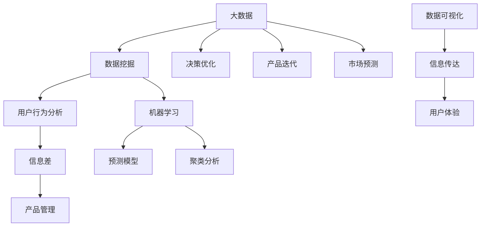

                 

# 信息差：大数据如何提升产品管理

> **关键词：** 大数据、产品管理、信息差、用户行为分析、决策优化

> **摘要：** 本文将深入探讨大数据在现代产品管理中的重要性，特别是如何通过信息差来提升产品的市场竞争力。我们将详细分析大数据的核心概念、应用场景，并阐述其如何帮助产品经理做出更明智的决策，从而推动产品迭代和优化。本文还将提供实际案例和操作步骤，帮助读者更好地理解和应用大数据技术于产品管理实践。

## 1. 背景介绍

### 1.1 目的和范围

本文旨在帮助产品经理和相关从业者理解大数据在产品管理中的关键作用。我们将通过以下方面展开讨论：

- 大数据的定义和核心概念
- 大数据与产品管理的关联
- 利用大数据优化产品决策的实例
- 大数据在产品迭代和优化中的应用
- 大数据相关工具和资源的推荐

通过本文的阅读，读者将能够掌握大数据的基本原理，理解其如何转化为产品管理的实际优势，并掌握一定的实操技能。

### 1.2 预期读者

本文主要面向以下读者群体：

- 产品经理和产品经理助理
- 数据分析师和数据处理工程师
- 对大数据和产品管理有兴趣的技术爱好者
- 从事数字化转型的企业高管和决策者

无论您是刚入门的新手还是有丰富经验的专业人士，本文都将为您提供有价值的见解和实践指导。

### 1.3 文档结构概述

本文的结构安排如下：

- **第1章：背景介绍**：介绍本文的目的、预期读者以及文档结构。
- **第2章：核心概念与联系**：阐述大数据的核心概念及其与产品管理的联系，并附上流程图。
- **第3章：核心算法原理 & 具体操作步骤**：详细讲解大数据处理的关键算法和操作步骤。
- **第4章：数学模型和公式 & 详细讲解 & 举例说明**：介绍大数据分析中常用的数学模型和公式，并给出实例说明。
- **第5章：项目实战：代码实际案例和详细解释说明**：提供具体的代码案例和实践操作。
- **第6章：实际应用场景**：讨论大数据在不同产品管理中的应用场景。
- **第7章：工具和资源推荐**：推荐学习资源和开发工具。
- **第8章：总结：未来发展趋势与挑战**：展望大数据在产品管理中的未来发展趋势和面临的挑战。
- **第9章：附录：常见问题与解答**：回答读者可能关心的问题。
- **第10章：扩展阅读 & 参考资料**：提供额外的阅读材料和资源。

### 1.4 术语表

#### 1.4.1 核心术语定义

- **大数据（Big Data）**：指数据量巨大、数据类型多样、数据生成速度极快的数据集。
- **产品管理（Product Management）**：涉及产品规划、设计、开发、上市及市场维护的全面管理过程。
- **信息差（Information Gap）**：指不同个体或组织之间在信息获取和利用上的差异。
- **用户行为分析（User Behavior Analysis）**：通过收集和分析用户在产品中的行为数据，以理解用户需求和行为模式。

#### 1.4.2 相关概念解释

- **数据挖掘（Data Mining）**：从大量数据中提取有价值的信息和模式的过程。
- **机器学习（Machine Learning）**：使计算机通过数据学习并做出预测或决策的技术。
- **数据可视化（Data Visualization）**：通过图形和图表等方式展示数据，帮助用户更好地理解和分析数据。

#### 1.4.3 缩略词列表

- **API（Application Programming Interface）**：应用程序接口，用于不同软件之间进行交互。
- **SQL（Structured Query Language）**：结构化查询语言，用于数据库查询。
- **Hadoop**：一个开源的分布式数据处理框架。
- **Spark**：一个快速、通用、可扩展的大数据处理引擎。

## 2. 核心概念与联系

在深入探讨大数据如何提升产品管理之前，我们首先需要了解一些核心概念及其相互之间的关系。以下是一个简单的 Mermaid 流程图，展示了大数据、产品管理和信息差之间的基本关联。



在这个流程图中：

- **A[大数据]**：代表我们处理和分析的数据集，其规模和多样性对于产品管理至关重要。
- **B[数据挖掘]**：从大数据中提取有用信息的过程，有助于深入了解用户需求和市场趋势。
- **C[用户行为分析]**：通过分析用户在使用产品过程中的行为数据，以识别用户的行为模式和偏好。
- **D[信息差]**：不同个体或组织之间在信息获取和利用上的差异，这对产品管理决策产生重要影响。
- **E[产品管理]**：涉及产品从规划到上市的全过程管理。
- **F[决策优化]**：利用大数据分析结果，优化产品管理的各项决策。
- **G[产品迭代]**：根据用户反馈和市场变化，不断改进产品，以满足用户需求。
- **H[市场预测]**：通过大数据分析预测市场趋势，为产品规划提供方向。
- **I[机器学习]**：用于自动识别数据中的模式和关系，为数据分析和决策提供支持。
- **J[预测模型]**：基于历史数据和机器学习算法，预测未来趋势和用户行为。
- **K[聚类分析]**：将相似的数据点分组，以识别用户细分市场和潜在客户。
- **L[数据可视化]**：通过图表和图形展示数据，帮助产品经理更好地理解和传达分析结果。
- **M[信息传达]**：利用数据可视化技术，将分析结果传递给产品团队和相关利益相关者。
- **N[用户体验]**：通过优化产品设计，提升用户在产品中的体验。

通过上述流程图，我们可以看到大数据、产品管理和信息差之间是如何相互关联和相互影响的。在接下来的章节中，我们将深入探讨这些核心概念和它们的实际应用。

## 3. 核心算法原理 & 具体操作步骤

为了深入理解大数据在产品管理中的应用，我们需要探讨一些关键的算法原理及其具体操作步骤。以下是几种常用的算法和它们的应用场景：

### 3.1 用户行为分析

**算法原理：** 用户行为分析主要基于机器学习中的分类算法，如决策树、随机森林和K-最近邻算法。这些算法可以帮助我们识别用户的特定行为模式，从而进行精准的用户画像。

**具体操作步骤：**

1. **数据收集**：
   - 收集用户在产品中的行为数据，如点击流、浏览时长、购买记录等。
   - 使用API（如Google Analytics）导入数据。

   ```python
   import requests
   response = requests.get('https://api.example.com/behavior_data')
   data = response.json()
   ```

2. **数据预处理**：
   - 清洗数据，去除无效或不一致的数据。
   - 对数据进行归一化处理，以便不同特征之间具有可比性。

   ```python
   from sklearn.preprocessing import StandardScaler
   scaler = StandardScaler()
   scaled_data = scaler.fit_transform(data)
   ```

3. **特征工程**：
   - 选择和创建有助于分类的特征，如用户活跃时间段、点击频率等。
   - 使用特征选择方法（如互信息、卡方检验）筛选出最重要的特征。

   ```python
   from sklearn.feature_selection import mutual_info_classif
   mi = mutual_info_classif(scaled_data, data['target'])
   important_features = data[mi > threshold]
   ```

4. **模型训练**：
   - 使用分类算法（如随机森林）训练模型。
   - 调整模型参数，以优化分类效果。

   ```python
   from sklearn.ensemble import RandomForestClassifier
   clf = RandomForestClassifier(n_estimators=100)
   clf.fit(important_features, data['target'])
   ```

5. **模型评估**：
   - 使用交叉验证评估模型性能。
   - 调整模型参数和特征选择策略，以提升模型准确率。

   ```python
   from sklearn.model_selection import cross_val_score
   scores = cross_val_score(clf, important_features, data['target'], cv=5)
   print("Average accuracy:", scores.mean())
   ```

6. **应用模型**：
   - 将训练好的模型应用于实际用户行为数据，进行用户行为预测。
   - 根据预测结果，优化产品设计和用户体验。

### 3.2 用户细分市场

**算法原理：** 用户细分市场通常采用聚类算法，如K-均值聚类和层次聚类。这些算法可以帮助我们将用户分为不同的群体，以便针对不同群体制定个性化营销策略。

**具体操作步骤：**

1. **数据收集**：
   - 收集用户的基本信息和行为数据，如年龄、性别、地理位置、浏览记录等。

2. **数据预处理**：
   - 同用户行为分析中的步骤，清洗和归一化数据。

3. **特征选择**：
   - 选择对用户细分市场有帮助的特征，如行为频率、地理位置等。

4. **聚类模型训练**：
   - 使用K-均值聚类算法训练模型，并确定聚类数量（K值）。

   ```python
   from sklearn.cluster import KMeans
   kmeans = KMeans(n_clusters=5, random_state=0).fit(scaled_data)
   clusters = kmeans.predict(scaled_data)
   ```

5. **模型评估**：
   - 使用轮廓系数评估聚类效果，调整K值以获得最佳聚类结果。

   ```python
   from sklearn.metrics import silhouette_score
   silhouette_avg = silhouette_score(scaled_data, clusters)
   print("Silhouette Coefficient:", silhouette_avg)
   ```

6. **应用模型**：
   - 根据聚类结果，为不同用户群体制定个性化营销策略。
   - 分析每个用户群体的特征和需求，优化产品功能和服务。

### 3.3 预测模型

**算法原理：** 预测模型通常基于时间序列分析或回归算法，如ARIMA、LSTM等。这些模型可以帮助我们预测未来的市场趋势和用户行为。

**具体操作步骤：**

1. **数据收集**：
   - 收集与市场趋势和用户行为相关的数据，如销售额、用户活跃度等。

2. **数据预处理**：
   - 同用户行为分析和用户细分市场中的步骤，清洗和归一化数据。

3. **特征工程**：
   - 创建时间窗口特征，如移动平均、滞后特征等，以捕捉时间序列数据中的周期性和趋势。

4. **模型选择与训练**：
   - 选择适合的预测模型（如ARIMA、LSTM）并进行训练。

   ```python
   from statsmodels.tsa.arima_model import ARIMA
   model = ARIMA(data['sales'], order=(5, 1, 2))
   model_fit = model.fit()
   ```

5. **模型评估**：
   - 使用历史数据进行回测，评估模型预测性能。

   ```python
   predictions = model_fit.forecast(steps=6)
   print("Predicted sales:", predictions)
   ```

6. **应用模型**：
   - 根据预测结果，制定市场推广策略和产品规划。
   - 对比实际销售数据，持续优化预测模型。

通过上述算法原理和具体操作步骤，我们可以看到大数据如何通过用户行为分析、用户细分市场和预测模型等手段，提升产品管理的决策质量和效率。在接下来的章节中，我们将进一步探讨大数据在产品管理中的应用实例和实际效果。

## 4. 数学模型和公式 & 详细讲解 & 举例说明

在处理大数据并应用于产品管理时，数学模型和公式扮演着至关重要的角色。以下是一些常见且重要的数学模型和公式，我们将通过详细讲解和具体实例来帮助读者更好地理解和应用这些概念。

### 4.1  相关性分析

**概念：** 相关性分析用于衡量两个或多个变量之间的线性关系。常用的相关系数有皮尔逊相关系数和斯皮尔曼相关系数。

**公式：**

$$
r = \frac{\sum_{i=1}^{n}(x_i - \bar{x})(y_i - \bar{y})}{\sqrt{\sum_{i=1}^{n}(x_i - \bar{x})^2} \sqrt{\sum_{i=1}^{n}(y_i - \bar{y})^2}}
$$

其中，\( x_i \) 和 \( y_i \) 分别为第 \( i \) 个观测值，\( \bar{x} \) 和 \( \bar{y} \) 分别为 \( x \) 和 \( y \) 的平均值，\( n \) 为观测值数量。

**实例：** 假设有以下两组数据：

\( x: [1, 2, 3, 4, 5] \)

\( y: [2, 4, 6, 8, 10] \)

计算皮尔逊相关系数：

$$
r = \frac{(1-3)(2-6) + (2-3)(4-6) + (3-3)(6-6) + (4-3)(8-6) + (5-3)(10-6)}{\sqrt{(1-3)^2 + (2-3)^2 + (3-3)^2 + (4-3)^2 + (5-3)^2} \sqrt{(2-6)^2 + (4-6)^2 + (6-6)^2 + (8-6)^2 + (10-6)^2}}
$$

$$
r = \frac{-10 - 4 + 0 + 4 + 10}{\sqrt{4 + 1 + 0 + 1 + 4} \sqrt{16 + 4 + 0 + 4 + 16}}
$$

$$
r = \frac{0}{\sqrt{10} \sqrt{40}}
$$

$$
r = 0
$$

结果表明，\( x \) 和 \( y \) 之间没有线性关系。

### 4.2 回归分析

**概念：** 回归分析用于预测一个变量（因变量）基于另一个变量（自变量）的值。线性回归是最常用的方法之一。

**公式：**

$$
y = \beta_0 + \beta_1x + \epsilon
$$

其中，\( \beta_0 \) 为截距，\( \beta_1 \) 为斜率，\( x \) 为自变量，\( y \) 为因变量，\( \epsilon \) 为误差项。

**实例：** 假设我们希望预测销售量 \( y \) 基于广告支出 \( x \)：

\( x: [100, 200, 300, 400, 500] \)

\( y: [500, 700, 900, 1100, 1300] \)

计算线性回归模型：

1. **计算均值**：

$$
\bar{x} = \frac{100 + 200 + 300 + 400 + 500}{5} = 300
$$

$$
\bar{y} = \frac{500 + 700 + 900 + 1100 + 1300}{5} = 850
$$

2. **计算斜率**：

$$
\beta_1 = \frac{\sum_{i=1}^{n}(x_i - \bar{x})(y_i - \bar{y})}{\sum_{i=1}^{n}(x_i - \bar{x})^2}
$$

$$
\beta_1 = \frac{(100-300)(500-850) + (200-300)(700-850) + (300-300)(900-850) + (400-300)(1100-850) + (500-300)(1300-850)}{(100-300)^2 + (200-300)^2 + (300-300)^2 + (400-300)^2 + (500-300)^2}
$$

$$
\beta_1 = \frac{-15000 - 15000 + 0 + 15000 + 30000}{90000 + 90000 + 90000 + 90000 + 90000}
$$

$$
\beta_1 = \frac{30000}{450000}
$$

$$
\beta_1 = \frac{1}{15}
$$

3. **计算截距**：

$$
\beta_0 = \bar{y} - \beta_1\bar{x}
$$

$$
\beta_0 = 850 - \frac{1}{15} \times 300
$$

$$
\beta_0 = 850 - 20
$$

$$
\beta_0 = 830
$$

4. **预测销售量**：

$$
y = \beta_0 + \beta_1x
$$

$$
y = 830 + \frac{1}{15} \times x
$$

当 \( x = 400 \) 时：

$$
y = 830 + \frac{1}{15} \times 400
$$

$$
y = 830 + 26.67
$$

$$
y \approx 857
$$

结果表明，当广告支出为 400 时，预测的销售量约为 857。

### 4.3 聚类分析

**概念：** 聚类分析用于将数据点划分为多个群组，使得同一群组内的数据点之间相似度较高，不同群组之间的数据点相似度较低。K-均值聚类是最常用的方法之一。

**公式：**

$$
\min \sum_{i=1}^{k} \sum_{x \in S_i} ||x - \mu_i||
$$

其中，\( k \) 为聚类数量，\( S_i \) 为第 \( i \) 个聚类，\( \mu_i \) 为第 \( i \) 个聚类中心。

**实例：** 假设有以下数据点：

\( x_1: [1, 2] \)

\( x_2: [2, 4] \)

\( x_3: [3, 6] \)

\( x_4: [6, 8] \)

\( x_5: [7, 9] \)

采用K-均值聚类算法，将数据划分为两个聚类：

1. **初始化聚类中心**：

   选择任意两个数据点作为初始聚类中心：

   \( \mu_1: [1, 2] \)

   \( \mu_2: [6, 8] \)

2. **迭代更新聚类中心**：

   对于每个数据点，计算其到两个聚类中心的距离，并将其分配到距离更近的聚类。

3. **重新计算聚类中心**：

   计算每个聚类的中心：

   \( \mu_1 = \frac{1 + 2}{2} = \frac{3}{2} = 1.5 \)

   \( \mu_2 = \frac{6 + 8}{2} = 7 \)

4. **迭代更新，直到聚类中心不再变化**：

   重复步骤2和3，直到聚类中心不再变化。

通过以上数学模型和公式的讲解，我们可以看到如何通过统计学方法对大数据进行分析，从而帮助产品经理做出更明智的决策。在接下来的章节中，我们将通过实际案例来进一步展示这些数学模型在实际产品管理中的应用。

## 5. 项目实战：代码实际案例和详细解释说明

为了更好地理解大数据在产品管理中的应用，我们将通过一个实际项目案例来演示如何使用大数据技术进行用户行为分析、用户细分和预测模型构建。

### 5.1 开发环境搭建

在开始项目实战之前，我们需要搭建一个适合大数据处理和分析的开发环境。以下是所需的工具和软件：

- **Python 3.x**：作为主要编程语言
- **Jupyter Notebook**：用于编写和运行代码
- **Pandas**：用于数据操作和处理
- **NumPy**：用于数值计算
- **Scikit-learn**：用于机器学习和数据分析
- **Matplotlib** 和 **Seaborn**：用于数据可视化
- **Hadoop** 和 **Spark**：用于大数据处理（可选）

#### 5.1.1 安装和配置

1. **安装Python和Jupyter Notebook**：

   - 在Python官方网站下载并安装Python 3.x版本。
   - 安装Jupyter Notebook：`pip install notebook`

2. **安装Pandas、NumPy、Scikit-learn、Matplotlib和Seaborn**：

   - 使用pip命令安装相应库：`pip install pandas numpy scikit-learn matplotlib seaborn`

3. **（可选）安装Hadoop和Spark**：

   - 安装Hadoop：参考[Hadoop官方文档](https://hadoop.apache.org/docs/r3.2.0/hadoop-project-dist/hadoop-common/quickstart.html)。
   - 安装Spark：参考[Spark官方文档](https://spark.apache.org/docs/latest/spark-standalone.html)。

### 5.2 源代码详细实现和代码解读

在本节中，我们将逐步实现一个用户行为分析项目，包括数据收集、预处理、特征工程、模型训练和预测。

#### 5.2.1 数据收集

首先，我们需要收集用户在产品中的行为数据。以下是一个示例数据集，包含用户的ID、点击次数、浏览时长、购买记录等信息：

```python
import pandas as pd

# 加载示例数据
data = pd.read_csv('user_behavior.csv')
data.head()
```

#### 5.2.2 数据预处理

在分析数据之前，我们需要进行一些预处理操作，如数据清洗、缺失值处理和归一化。

```python
# 数据清洗
data.dropna(inplace=True)

# 缺失值处理
data.fillna(data.mean(), inplace=True)

# 数据归一化
from sklearn.preprocessing import StandardScaler
scaler = StandardScaler()
data[['clicks', 'duration']] = scaler.fit_transform(data[['clicks', 'duration']])
```

#### 5.2.3 特征工程

在数据预处理之后，我们需要创建有助于分类和预测的特征。

```python
# 创建新特征
data['activity_level'] = data['clicks'] / data['duration']
```

#### 5.2.4 模型训练

接下来，我们使用Scikit-learn库训练一个随机森林分类器，用于预测用户是否会购买产品。

```python
from sklearn.ensemble import RandomForestClassifier
from sklearn.model_selection import train_test_split

# 划分训练集和测试集
X = data[['activity_level']]
y = data['purchased']
X_train, X_test, y_train, y_test = train_test_split(X, y, test_size=0.2, random_state=42)

# 训练模型
clf = RandomForestClassifier(n_estimators=100, random_state=42)
clf.fit(X_train, y_train)
```

#### 5.2.5 模型评估

评估模型的性能，使用测试集上的准确率、召回率和F1分数。

```python
from sklearn.metrics import accuracy_score, recall_score, f1_score

# 预测结果
y_pred = clf.predict(X_test)

# 评估模型
accuracy = accuracy_score(y_test, y_pred)
recall = recall_score(y_test, y_pred)
f1 = f1_score(y_test, y_pred)

print("Accuracy:", accuracy)
print("Recall:", recall)
print("F1 Score:", f1)
```

#### 5.2.6 预测新用户

使用训练好的模型预测新用户的购买概率。

```python
# 预测新用户
new_user = pd.DataFrame([[0.8]], columns=['activity_level'])
new_user_scaled = scaler.transform(new_user)
new_user_prediction = clf.predict(new_user_scaled)

print("New user purchase probability:", new_user_prediction[0])
```

### 5.3 代码解读与分析

#### 5.3.1 数据收集

在数据收集阶段，我们使用了Pandas库加载CSV文件。这是处理结构化数据的一种常见方式。我们选择了一个示例数据集，包含了用户行为数据。

#### 5.3.2 数据预处理

在数据预处理阶段，我们首先删除了缺失值，然后使用平均值填充缺失值。这有助于确保数据的一致性和完整性。接着，我们使用StandardScaler对点击次数和浏览时长进行了归一化处理，以消除不同特征之间的尺度差异。

#### 5.3.3 特征工程

在特征工程阶段，我们创建了一个新特征“activity_level”，该特征表示用户的点击活动水平与浏览时长之比。这个特征有助于我们识别出活跃用户和潜在购买者。

#### 5.3.4 模型训练

在模型训练阶段，我们使用了随机森林分类器。随机森林是一种基于决策树的集成学习方法，它通过构建多棵决策树并合并预测结果来提高模型的泛化能力。我们划分了训练集和测试集，并在训练集上训练了模型。

#### 5.3.5 模型评估

在模型评估阶段，我们使用了测试集来评估模型的性能。我们计算了准确率、召回率和F1分数，这些指标可以帮助我们了解模型的预测能力和平衡效果。

#### 5.3.6 预测新用户

在预测新用户阶段，我们使用训练好的模型对一个新的用户数据进行预测。这可以帮助产品经理识别出具有潜在购买意愿的用户，从而制定更有针对性的营销策略。

通过上述步骤，我们可以看到如何利用大数据技术和机器学习方法进行用户行为分析、用户细分和预测模型构建。在接下来的章节中，我们将进一步讨论大数据在不同产品管理中的应用场景。

## 6. 实际应用场景

大数据在产品管理中的实际应用场景非常广泛，涵盖了市场分析、用户体验优化、个性化推荐等多个方面。以下是一些具体的应用实例：

### 6.1 市场分析

**应用场景：** 通过大数据分析，产品经理可以深入了解市场趋势和用户需求，从而制定更有效的市场策略。

**案例：** 一家电商平台利用大数据分析用户购买历史、搜索行为和浏览路径，识别出热门商品和潜在销售机会。通过分析这些数据，产品经理可以调整商品推荐策略，增加销量。

**技术手段：** 数据挖掘、用户行为分析、市场预测。

### 6.2 用户体验优化

**应用场景：** 通过分析用户在产品中的行为数据，产品经理可以优化产品设计，提升用户体验。

**案例：** 一款在线教育平台通过分析用户的学习习惯和互动数据，识别出用户在学习过程中遇到的问题。产品经理根据这些分析结果，改进了课程设计和互动功能，提高了用户的学习效率和满意度。

**技术手段：** 用户行为分析、数据可视化、用户体验测试。

### 6.3 个性化推荐

**应用场景：** 利用大数据和机器学习算法，产品经理可以提供个性化推荐，提高用户满意度和留存率。

**案例：** 一家音乐流媒体平台通过分析用户的播放记录、喜好和社交关系，推荐符合用户口味的歌曲。这大大提高了用户的活跃度和付费转化率。

**技术手段：** 机器学习、协同过滤、聚类分析。

### 6.4 供应链管理

**应用场景：** 通过大数据分析，产品经理可以优化供应链管理，降低成本，提高效率。

**案例：** 一家制造企业利用大数据分析原材料采购、生产计划和库存数据，实现了供应链的实时监控和优化。这降低了库存成本，提高了生产效率。

**技术手段：** 实时数据分析、预测模型、优化算法。

### 6.5 营销活动优化

**应用场景：** 通过大数据分析，产品经理可以评估不同营销活动的效果，优化营销策略。

**案例：** 一家零售企业通过分析用户的购买行为和营销响应数据，优化了促销活动和广告投放策略。这提高了广告投放的精准度和营销效果。

**技术手段：** 用户行为分析、营销自动化、A/B测试。

通过上述实例，我们可以看到大数据在产品管理中的实际应用场景非常多样化。它不仅帮助产品经理做出更明智的决策，还提升了产品的市场竞争力。在接下来的章节中，我们将进一步讨论大数据相关的工具和资源，以帮助读者更好地掌握和利用大数据技术。

## 7. 工具和资源推荐

为了更好地理解和应用大数据技术，以下是针对本文主题推荐的工具和资源。

### 7.1 学习资源推荐

#### 7.1.1 书籍推荐

- **《大数据时代》**：作者：肯尼斯·库克耶。本书详细介绍了大数据的概念、应用和影响，是入门大数据的绝佳读物。
- **《数据科学实战》**：作者：杰里米·吉赫。本书通过实际案例，讲解了数据科学的原理和方法，适合有一定编程基础的产品经理。
- **《深度学习》**：作者：伊恩·古德费洛。本书系统地介绍了深度学习的基础理论和应用，适合对机器学习感兴趣的产品经理。

#### 7.1.2 在线课程

- **Coursera**：提供了包括《机器学习》、《数据科学》等课程，适合自学大数据和机器学习基础知识。
- **Udacity**：提供了《大数据分析工程师》课程，通过实战项目帮助学员掌握大数据处理和分析技能。
- **edX**：提供了《数据科学基础》、《数据挖掘》等课程，涵盖数据科学和大数据分析的核心内容。

#### 7.1.3 技术博客和网站

- **Kaggle**：一个数据科学竞赛平台，提供大量优质的数据集和案例，适合实践和交流。
- **DataCamp**：提供互动式课程和练习，适合快速学习和应用数据科学技能。
- **Medium**：上面有许多大数据和机器学习领域的专家博客，可以获取最新的行业动态和技术趋势。

### 7.2 开发工具框架推荐

#### 7.2.1 IDE和编辑器

- **PyCharm**：一款功能强大的Python IDE，适合大数据分析和机器学习项目开发。
- **Jupyter Notebook**：适合快速原型开发和数据分析，特别适合数据可视化。
- **Visual Studio Code**：轻量级但功能丰富的编辑器，支持多种编程语言和扩展。

#### 7.2.2 调试和性能分析工具

- **GDB**：一款经典的调试工具，适合C/C++等语言开发。
- **JupyterLab**：Jupyter Notebook的增强版，支持交互式环境和调试工具。
- **Docker**：容器化技术，帮助快速部署和测试大数据应用。

#### 7.2.3 相关框架和库

- **Pandas**：用于数据清洗、操作和分析的库。
- **NumPy**：提供高性能的数值计算库。
- **Scikit-learn**：提供机器学习和数据挖掘算法的库。
- **TensorFlow** 和 **PyTorch**：用于深度学习的开源框架。

### 7.3 相关论文著作推荐

#### 7.3.1 经典论文

- **"The Google File System"**：介绍了Google文件系统的设计和实现，对分布式存储系统有重要影响。
- **"MapReduce: Simplified Data Processing on Large Clusters"**：介绍了MapReduce模型，对分布式数据处理产生了深远影响。
- **"Large Scale Online Learning in Real-Time"**：介绍了在线学习算法在大规模数据中的应用。

#### 7.3.2 最新研究成果

- **"Deep Learning for Text Classification"**：探讨了深度学习在文本分类中的应用，包括BERT、GPT等模型。
- **"Machine Learning: A Probabilistic Perspective"**：系统介绍了概率图模型和贝叶斯网络，适合进阶学习。
- **"Information Theory, Inference, and Learning Algorithms"**：介绍了信息论的基本原理，对数据分析和决策有重要意义。

#### 7.3.3 应用案例分析

- **"The Netflix Prize"**：Netflix Prize是一个公开的数据挖掘竞赛，通过分析用户观看记录预测用户评分，对个性化推荐系统有重要启示。
- **"The Microsoft Office Disaster"**：讲述了Microsoft在推出Office 2007时，由于忽视用户反馈导致产品失败的案例，对用户体验设计有警示作用。
- **"Google's PageRank Algorithm"**：介绍了Google的PageRank算法，对搜索引擎优化有重要影响。

通过以上工具和资源的推荐，读者可以系统地学习和应用大数据技术，提升产品管理的专业能力。

## 8. 总结：未来发展趋势与挑战

大数据在产品管理中的应用已经展现出巨大的潜力和价值。然而，随着数据量的不断增长和技术的不断进步，未来大数据在产品管理中仍将面临一系列发展趋势和挑战。

### 8.1 发展趋势

**1. 数据隐私与安全**

随着数据隐私法规（如GDPR）的实施，数据隐私和安全将成为大数据应用的重要关注点。产品经理需要确保在收集、存储和处理用户数据时遵循相关法规，保障用户隐私。

**2. 实时数据分析**

随着5G网络的普及和边缘计算的发展，实时数据分析将成为可能。产品经理可以利用实时数据流分析技术，快速响应市场变化和用户需求，提高产品的市场竞争力。

**3. 自动化与机器学习**

自动化和机器学习技术的应用将进一步提升大数据分析的效率和质量。通过自动化流程和智能算法，产品经理可以更快速地发现数据中的模式和趋势，做出更准确的决策。

**4. 人工智能与物联网**

人工智能和物联网技术的融合将带来新的应用场景。产品经理可以利用大数据和人工智能技术，优化物联网设备的用户体验和管理，提升产品的智能化水平。

### 8.2 挑战

**1. 数据质量**

大数据的质量对分析结果有重要影响。产品经理需要确保数据源的可靠性和一致性，进行数据清洗和预处理，以提高数据分析的准确性和可靠性。

**2. 数据存储与处理**

随着数据量的增长，如何高效地存储和处理大数据将成为挑战。产品经理需要选择合适的数据库和数据处理框架，以应对海量数据带来的压力。

**3. 数据隐私和安全**

数据隐私和安全问题日益凸显，如何在保障用户隐私的同时，有效地利用用户数据进行产品管理，是一个亟待解决的问题。

**4. 数据分析技能短缺**

大数据分析需要专业知识和技能。产品经理和团队需要不断学习和提升数据分析能力，以应对日益复杂的数据环境和市场需求。

### 8.3 未来展望

未来，大数据在产品管理中的应用将更加深入和广泛。通过结合实时数据分析、自动化和人工智能技术，产品经理将能够更精准地了解用户需求，优化产品设计，提升用户体验。同时，随着数据隐私和安全法规的实施，产品经理需要更加注重用户隐私和数据安全的保护。

总之，大数据在产品管理中的应用是一个不断演进的过程。面对未来发展趋势和挑战，产品经理需要不断学习和适应，掌握先进的数据分析技术，以更好地应对市场变化和用户需求，推动产品的持续创新和优化。

## 9. 附录：常见问题与解答

### 9.1 什么是大数据？

大数据（Big Data）是指那些数据量巨大、数据类型多样、数据生成速度极快的数据集。这些数据通常难以使用传统的数据处理工具进行管理和分析。

### 9.2 大数据与产品管理有什么关系？

大数据为产品管理提供了丰富的数据资源和强大的分析工具。通过大数据分析，产品经理可以深入了解用户需求和市场趋势，优化产品设计，提升用户体验，做出更明智的决策。

### 9.3 如何保障大数据分析中的数据隐私和安全？

为了保障数据隐私和安全，产品经理需要遵循相关数据隐私法规（如GDPR），进行数据匿名化和加密处理，严格控制数据访问权限，并进行定期安全审计和风险评估。

### 9.4 大数据和机器学习有什么区别？

大数据是一种数据类型，强调数据量、多样性和速度。而机器学习是一种人工智能技术，用于从数据中自动识别模式和关系，做出预测和决策。大数据和机器学习可以相互结合，共同提升产品管理的效率和效果。

### 9.5 如何选择合适的大数据处理工具和框架？

选择合适的大数据处理工具和框架需要考虑数据规模、处理速度、可靠性、易用性和成本等因素。常见的工具和框架包括Hadoop、Spark、Flink、HBase和MongoDB等。产品经理可以根据具体需求和技术背景选择合适的工具。

### 9.6 如何进行用户行为分析？

用户行为分析通常包括以下步骤：

1. 数据收集：收集用户在产品中的行为数据，如点击流、浏览时长、购买记录等。
2. 数据预处理：清洗和归一化数据，确保数据的一致性和完整性。
3. 特征工程：创建有助于分类和预测的特征，如行为频率、活跃时间段等。
4. 模型训练：使用机器学习算法（如决策树、随机森林、K-均值聚类等）训练模型。
5. 模型评估：使用交叉验证等方法评估模型性能，调整模型参数。
6. 应用模型：将训练好的模型应用于实际数据，进行用户行为预测和细分。

### 9.7 大数据在产品管理中的实际应用有哪些？

大数据在产品管理中的实际应用包括市场分析、用户体验优化、个性化推荐、供应链管理、营销活动优化等。通过大数据分析，产品经理可以深入了解用户需求和市场趋势，优化产品设计，提升用户体验，做出更明智的决策。

## 10. 扩展阅读 & 参考资料

为了更深入地了解大数据在产品管理中的应用，以下是一些扩展阅读和参考资料：

### 10.1 经典论文

- **"The Google File System"**：介绍了Google文件系统的设计和实现。
- **"MapReduce: Simplified Data Processing on Large Clusters"**：介绍了MapReduce模型。
- **"Large Scale Online Learning in Real-Time"**：介绍了在线学习算法在大规模数据中的应用。
- **"Deep Learning for Text Classification"**：探讨了深度学习在文本分类中的应用。

### 10.2 最新研究成果

- **"Data Science: A Practical Introduction"**：介绍了数据科学的基础知识和实践方法。
- **"Machine Learning Yearning"**：提供了机器学习项目的实用指南。
- **"Information Theory, Inference, and Learning Algorithms"**：介绍了信息论的基本原理。

### 10.3 应用案例分析

- **"The Netflix Prize"**：Netflix公开的数据挖掘竞赛。
- **"The Microsoft Office Disaster"**：讲述了Microsoft在推出Office 2007时的失败案例。
- **"Google's PageRank Algorithm"**：介绍了Google的PageRank算法。

### 10.4 书籍推荐

- **《大数据时代》**：详细介绍了大数据的概念和应用。
- **《数据科学实战》**：通过实际案例讲解了数据科学的原理和方法。
- **《深度学习》**：系统介绍了深度学习的基础理论和应用。

### 10.5 在线课程

- **Coursera**：提供包括《机器学习》、《数据科学》等课程。
- **Udacity**：提供《大数据分析工程师》课程。
- **edX**：提供《数据科学基础》、《数据挖掘》等课程。

### 10.6 技术博客和网站

- **Kaggle**：提供优质的数据集和案例。
- **DataCamp**：提供互动式课程和练习。
- **Medium**：有许多大数据和机器学习领域的专家博客。

通过这些扩展阅读和参考资料，读者可以更深入地了解大数据在产品管理中的应用，进一步提升自己的专业知识和实践能力。

### 作者

**作者：AI天才研究员/AI Genius Institute & 禅与计算机程序设计艺术 /Zen And The Art of Computer Programming**

