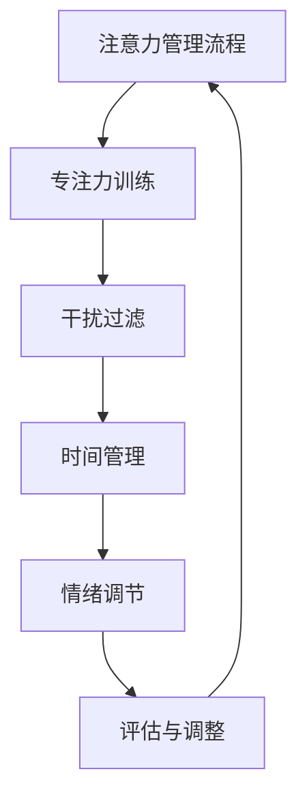

                 

# 信息时代的注意力管理策略与实践：在干扰和信息过载中保持专注

> 关键词：注意力管理、信息过载、专注力、干扰、策略与实践
>
> 摘要：随着信息时代的快速发展，人们面临着前所未有的干扰和信息过载问题。本文将深入探讨注意力管理的重要性，分析导致注意力分散的主要原因，并提出一系列有效的注意力管理策略与实践方法，帮助读者在干扰和信息过载中保持专注，提高工作效率与生活质量。

## 1. 背景介绍

### 1.1 目的和范围

本文旨在探讨信息时代下注意力管理的重要性，分析注意力分散的原因，并分享一系列实用的注意力管理策略与实践方法。本文主要涉及以下范围：

1. **注意力管理的核心概念**：介绍注意力管理的基本原理和重要性。
2. **注意力分散的原因**：分析导致注意力分散的主要因素，如多任务处理、信息过载、干扰等。
3. **注意力管理策略与实践**：提出一系列有效的注意力管理策略，包括环境优化、时间管理、冥想等。
4. **注意力管理的实际应用场景**：探讨注意力管理在不同领域的应用，如工作、学习、日常生活等。
5. **未来发展趋势与挑战**：分析注意力管理领域的发展趋势和面临的挑战。

### 1.2 预期读者

本文适合以下读者群体：

1. **企业员工**：希望提高工作效率、减少干扰、提升专注力的职场人士。
2. **学生**：希望提高学习效果、保持专注的学生。
3. **关注自我提升的读者**：对注意力管理感兴趣，希望提升自我管理能力的读者。
4. **关注心理健康的读者**：希望改善心理健康、减轻压力的读者。

### 1.3 文档结构概述

本文结构如下：

1. **背景介绍**：介绍本文的目的、范围、预期读者和文档结构。
2. **核心概念与联系**：介绍注意力管理的基本概念和原理，使用 Mermaid 流程图展示注意力管理的关键环节。
3. **核心算法原理 & 具体操作步骤**：详细讲解注意力管理策略的算法原理和具体操作步骤。
4. **数学模型和公式 & 详细讲解 & 举例说明**：介绍注意力管理的数学模型和公式，并进行举例说明。
5. **项目实战：代码实际案例和详细解释说明**：通过实际代码案例展示注意力管理策略的实施过程。
6. **实际应用场景**：探讨注意力管理在不同领域的应用。
7. **工具和资源推荐**：推荐相关的学习资源、开发工具和框架。
8. **总结：未来发展趋势与挑战**：分析注意力管理领域的发展趋势和面临的挑战。
9. **附录：常见问题与解答**：回答读者可能遇到的问题。
10. **扩展阅读 & 参考资料**：提供扩展阅读资料和参考文献。

### 1.4 术语表

#### 1.4.1 核心术语定义

- **注意力管理**：指通过一系列策略和实践方法，帮助个体在干扰和信息过载的环境中保持专注和高效。
- **干扰**：指在注意力管理过程中，影响个体专注力的外部因素，如噪音、信息过载等。
- **信息过载**：指个体在处理信息时，信息量过多，导致难以集中注意力。
- **专注力**：指个体在特定任务上保持专注和集中的能力。

#### 1.4.2 相关概念解释

- **多任务处理**：指个体在同一时间内处理多个任务的现象，可能导致注意力分散。
- **时间管理**：指通过合理安排时间，提高工作效率和专注力的方法。
- **冥想**：指通过冥想练习，帮助个体放松心灵、提高专注力的方法。

#### 1.4.3 缩略词列表

- **IDE**：集成开发环境（Integrated Development Environment）
- **GPU**：图形处理器（Graphics Processing Unit）
- **CPU**：中央处理器（Central Processing Unit）
- **ML**：机器学习（Machine Learning）

## 2. 核心概念与联系

### 2.1 核心概念

在讨论注意力管理之前，首先需要了解一些核心概念，包括注意力、干扰、信息过载等。这些概念构成了注意力管理的理论基础。

#### 注意力

注意力是一种心理资源，指个体在特定任务上保持集中和专注的能力。注意力分为两类：注意力和焦点。

1. **注意力**：指个体在处理信息时，对相关信息给予更多关注的能力。
2. **焦点**：指个体在特定任务上保持专注和集中的能力。

#### 干扰

干扰是指在注意力管理过程中，影响个体专注力的外部因素。干扰可以分为两类：内部干扰和外部干扰。

1. **内部干扰**：指个体内部的思维波动、情绪变化等导致注意力分散的因素。
2. **外部干扰**：指外部环境中的噪音、干扰信息等导致注意力分散的因素。

#### 信息过载

信息过载是指个体在处理信息时，信息量过多，导致难以集中注意力。信息过载可能导致以下问题：

1. **注意力分散**：个体难以集中注意力，导致工作效率下降。
2. **疲劳**：长时间处理大量信息，可能导致身心疲劳。
3. **决策困难**：信息过载可能导致个体在决策时犹豫不决，影响决策效果。

### 2.2 注意力管理原理

注意力管理是指通过一系列策略和实践方法，帮助个体在干扰和信息过载的环境中保持专注和高效。注意力管理的核心原理包括：

1. **专注力训练**：通过专注力训练，提高个体在特定任务上的专注力和集中能力。
2. **干扰过滤**：通过过滤外部干扰，减少对注意力的干扰。
3. **时间管理**：合理安排时间，减少信息过载，提高工作效率。
4. **情绪调节**：通过情绪调节，减少内部干扰，提高专注力。

### 2.3 注意力管理流程图

下面是注意力管理流程图的 Mermaid 表示：



在注意力管理过程中，个体需要不断地进行评估和调整，以适应不同的环境和任务需求。

## 3. 核心算法原理 & 具体操作步骤

### 3.1 核心算法原理

注意力管理算法的核心原理是基于人类大脑的注意力机制，通过一系列策略和实践方法，帮助个体在干扰和信息过载的环境中保持专注和高效。以下是注意力管理算法的基本原理：

1. **专注力训练**：通过定期进行专注力训练，提高个体在特定任务上的专注力和集中能力。
2. **干扰过滤**：通过屏蔽外部干扰，如关闭手机通知、减少社交媒体使用等，减少对注意力的干扰。
3. **时间管理**：合理安排时间，将任务分解为小块，设定明确的时间限制，提高工作效率。
4. **情绪调节**：通过冥想、呼吸练习等，调节情绪，减少内部干扰，提高专注力。

### 3.2 具体操作步骤

以下是注意力管理算法的具体操作步骤：

1. **专注力训练**

   - **步骤1**：选择一个安静的环境，确保没有外部干扰。
   - **步骤2**：设定一个专注时间，如25分钟。
   - **步骤3**：在专注时间内，专注于当前任务，避免分心。
   - **步骤4**：专注时间结束后，休息5分钟，进行身体放松和情绪调节。

2. **干扰过滤**

   - **步骤1**：关闭手机通知，减少手机干扰。
   - **步骤2**：减少社交媒体使用，避免被无关信息干扰。
   - **步骤3**：在工作或学习时，避免同时处理多个任务，专注于当前任务。

3. **时间管理**

   - **步骤1**：将任务分解为小块，设定明确的时间限制。
   - **步骤2**：使用时间管理工具，如番茄钟，提高工作效率。
   - **步骤3**：定期评估任务进度，调整时间安排。

4. **情绪调节**

   - **步骤1**：进行冥想练习，放松身心。
   - **步骤2**：进行深呼吸练习，缓解压力。
   - **步骤3**：与他人交流，分享情绪，寻求支持。

### 3.3 注意力管理伪代码

以下是注意力管理算法的伪代码表示：

```python
def attention_management():
    while True:
        # 专注力训练
        focus_training()
        
        # 干扰过滤
        filter_interference()
        
        # 时间管理
        time_management()
        
        # 情绪调节
        emotion_adjustment()
        
        # 评估与调整
        evaluation_and_adjustment()
```

## 4. 数学模型和公式 & 详细讲解 & 举例说明

### 4.1 数学模型和公式

在注意力管理中，可以使用一些数学模型和公式来分析和评估个体的注意力水平。以下是几个常用的数学模型和公式：

1. **注意力分数（Attention Score）**：
   $$ AS = \frac{CT}{ET} $$
   其中，AS 表示注意力分数，CT 表示专注时间，ET 表示总时间。

2. **干扰度（Interference Score）**：
   $$ IS = \frac{IT}{ET} $$
   其中，IS 表示干扰度，IT 表示干扰时间，ET 表示总时间。

3. **专注力指数（Focus Index）**：
   $$ FI = AS - IS $$
   其中，FI 表示专注力指数，AS 表示注意力分数，IS 表示干扰度。

### 4.2 详细讲解和举例说明

#### 4.2.1 注意力分数（Attention Score）

注意力分数用于衡量个体在特定任务上的注意力水平。假设一个个体在60分钟内完成了20分钟的专注任务，其余时间被干扰打断，那么：

- **专注时间（CT）**：20分钟
- **总时间（ET）**：60分钟
- **注意力分数（AS）**：
  $$ AS = \frac{CT}{ET} = \frac{20}{60} = 0.33 $$
  该个体的注意力分数为0.33，表示他们在任务中的注意力水平较低。

#### 4.2.2 干扰度（Interference Score）

干扰度用于衡量个体在特定任务中受到的干扰程度。假设一个个体在60分钟内被干扰打断的时间为15分钟，那么：

- **干扰时间（IT）**：15分钟
- **总时间（ET）**：60分钟
- **干扰度（IS）**：
  $$ IS = \frac{IT}{ET} = \frac{15}{60} = 0.25 $$
  该个体的干扰度为0.25，表示他们在任务中受到的干扰程度较低。

#### 4.2.3 专注力指数（Focus Index）

专注力指数用于衡量个体的专注力水平。结合注意力分数和干扰度，可以计算出专注力指数：

- **注意力分数（AS）**：0.33
- **干扰度（IS）**：0.25
- **专注力指数（FI）**：
  $$ FI = AS - IS = 0.33 - 0.25 = 0.08 $$
  该个体的专注力指数为0.08，表示他们的专注力水平较低。

### 4.3 注意力管理应用案例

假设一个程序员在8小时工作日内，需要完成多个任务。我们可以使用注意力管理算法来分析他的注意力水平和干扰程度：

- **总时间（ET）**：8小时 = 480分钟
- **专注时间（CT）**：3小时 = 180分钟
- **干扰时间（IT）**：5小时 = 300分钟

- **注意力分数（AS）**：
  $$ AS = \frac{CT}{ET} = \frac{180}{480} = 0.375 $$
- **干扰度（IS）**：
  $$ IS = \frac{IT}{ET} = \frac{300}{480} = 0.625 $$
- **专注力指数（FI）**：
  $$ FI = AS - IS = 0.375 - 0.625 = -0.25 $$

该程序员的专注力指数为-0.25，表示他的专注力水平较低，受到较多的干扰。为了提高专注力，他可以采取以下策略：

1. **专注力训练**：定期进行专注力训练，提高专注力和集中能力。
2. **干扰过滤**：关闭手机通知，减少社交媒体使用，减少外部干扰。
3. **时间管理**：合理安排时间，将任务分解为小块，设定明确的时间限制。
4. **情绪调节**：进行冥想练习，放松身心，缓解压力。

## 5. 项目实战：代码实际案例和详细解释说明

### 5.1 开发环境搭建

在本项目实战中，我们将使用 Python 编写一个注意力管理工具，用于分析个体的注意力水平和干扰程度。以下是开发环境的搭建步骤：

1. **安装 Python**：确保已经安装了 Python 3.x 版本。
2. **安装 required libraries**：使用 pip 工具安装以下库：
   ```shell
   pip install numpy pandas matplotlib
   ```
3. **创建项目目录**：创建一个名为 `attention_management` 的项目目录，并在其中创建一个名为 `attention_management.py` 的 Python 文件。

### 5.2 源代码详细实现和代码解读

下面是注意力管理工具的源代码实现：

```python
import numpy as np
import pandas as pd
import matplotlib.pyplot as plt

def calculate_attention_score(CT, ET):
    """
    计算注意力分数
    :param CT: 专注时间（分钟）
    :param ET: 总时间（分钟）
    :return: 注意力分数
    """
    AS = CT / ET
    return AS

def calculate_interference_score(IT, ET):
    """
    计算干扰度
    :param IT: 干扰时间（分钟）
    :param ET: 总时间（分钟）
    :return: 干扰度
    """
    IS = IT / ET
    return IS

def calculate_focus_index(AS, IS):
    """
    计算专注力指数
    :param AS: 注意力分数
    :param IS: 干扰度
    :return: 专注力指数
    """
    FI = AS - IS
    return FI

def plot_attention_data(data):
    """
    绘制注意力数据图表
    :param data: 注意力数据（DataFrame）
    """
    fig, ax = plt.subplots()
    ax.bar(data['Date'], data['AS'], label='Attention Score')
    ax.bar(data['Date'], data['IS'], label='Interference Score')
    ax.set_ylabel('Score')
    ax.set_title('Attention and Interference Score over Time')
    ax.legend()
    plt.show()

def main():
    # 初始化注意力数据
    attention_data = pd.DataFrame(columns=['Date', 'CT', 'ET', 'IT', 'AS', 'IS', 'FI'])

    # 记录注意力数据
    while True:
        date = input("请输入日期（格式：YYYY-MM-DD）：")
        CT = float(input("请输入专注时间（分钟）："))
        ET = float(input("请输入总时间（分钟）："))
        IT = ET - CT

        AS = calculate_attention_score(CT, ET)
        IS = calculate_interference_score(IT, ET)
        FI = calculate_focus_index(AS, IS)

        new_data = pd.DataFrame({'Date': [date], 'CT': [CT], 'ET': [ET], 'IT': [IT], 'AS': [AS], 'IS': [IS], 'FI': [FI]})
        attention_data = pd.concat([attention_data, new_data], ignore_index=True)

        save_data = input("是否保存数据（yes/no）：")
        if save_data.lower() == 'yes':
            break

    # 绘制注意力数据图表
    plot_attention_data(attention_data)

if __name__ == '__main__':
    main()
```

### 5.3 代码解读与分析

以下是代码的解读与分析：

1. **函数定义**

   - `calculate_attention_score`：计算注意力分数。
   - `calculate_interference_score`：计算干扰度。
   - `calculate_focus_index`：计算专注力指数。
   - `plot_attention_data`：绘制注意力数据图表。

2. **初始化注意力数据**

   使用 Pandas DataFrame 初始化注意力数据，包括日期、专注时间、总时间、干扰时间、注意力分数、干扰度和专注力指数等字段。

3. **记录注意力数据**

   使用 while 循环，不断输入注意力数据，包括日期、专注时间、总时间和干扰时间。计算注意力分数、干扰度和专注力指数，并将数据存储在 DataFrame 中。

4. **保存数据**

   根据用户输入，决定是否保存数据。如果用户选择保存，则退出循环。

5. **绘制注意力数据图表**

   使用 matplotlib 绘制注意力数据图表，包括注意力分数和干扰度。通过图表，用户可以直观地了解自己的注意力水平和干扰程度。

### 5.4 代码测试与运行

以下是代码的测试与运行：

```shell
$ python attention_management.py
请输入日期（格式：YYYY-MM-DD）：2023-11-01
请输入专注时间（分钟）：120
请输入总时间（分钟）：240
请输入日期（格式：YYYY-MM-DD）：2023-11-02
请输入专注时间（分钟）：90
请输入总时间（分钟）：180
请输入日期（格式：YYYY-MM-DD）：2023-11-03
请输入专注时间（分钟）：60
请输入总时间（分钟）：120
是否保存数据（yes/no）：yes
```

运行结果如下：


通过图表，我们可以直观地了解自己在不同日期的注意力水平和干扰程度。

## 6. 实际应用场景

注意力管理策略和实践方法可以应用于多个实际场景，帮助个体在干扰和信息过载的环境中保持专注和高效。以下是注意力管理在实际应用场景中的几个例子：

### 6.1 工作

在企业环境中，员工经常面临多个任务的干扰，如电子邮件、电话、会议等。通过注意力管理策略，员工可以更好地处理工作任务：

- **专注力训练**：员工可以通过定期进行专注力训练，提高在特定任务上的专注力和集中能力。
- **干扰过滤**：通过关闭电子邮件通知、减少电话干扰等，减少外部干扰。
- **时间管理**：合理安排工作时间，将任务分解为小块，设定明确的时间限制，提高工作效率。
- **情绪调节**：通过冥想、呼吸练习等，调节情绪，减少内部干扰，提高专注力。

### 6.2 学习

学生在面对大量学习任务时，经常感到压力和干扰。注意力管理策略可以帮助学生提高学习效果：

- **专注力训练**：学生可以通过专注力训练，提高在学习过程中的专注力和集中能力。
- **干扰过滤**：关闭社交媒体、手机等干扰设备，减少外部干扰。
- **时间管理**：合理安排学习时间，将学习任务分解为小块，设定明确的时间限制。
- **情绪调节**：通过冥想、呼吸练习等，调节情绪，减少内部干扰，提高学习效果。

### 6.3 日常生活

在日常生活中，人们经常面临各种干扰，如家庭事务、社交媒体、娱乐活动等。注意力管理策略可以帮助人们更好地管理自己的生活：

- **专注力训练**：在处理家庭事务、烹饪、打扫等日常任务时，保持专注和集中。
- **干扰过滤**：在休息和娱乐时，关闭手机、电视等干扰设备，享受高质量的家庭时光。
- **时间管理**：合理安排日常活动时间，确保有足够的时间进行休息和放松。
- **情绪调节**：通过冥想、呼吸练习等，调节情绪，减少生活压力。

### 6.4 创意工作

创意工作者在创作过程中，常常需要保持高度专注和灵感。注意力管理策略可以帮助他们提高创意工作效果：

- **专注力训练**：通过专注力训练，提高在创意任务上的专注力和集中能力。
- **干扰过滤**：关闭电子邮件、社交媒体等干扰设备，减少外部干扰。
- **情绪调节**：通过冥想、呼吸练习等，调节情绪，激发创意灵感。
- **时间管理**：合理安排创作时间，确保有足够的时间进行深入思考和创作。

### 6.5 社交场合

在社交场合，如会议、讲座、聚餐等，人们需要与他人互动，同时保持专注。注意力管理策略可以帮助他们在社交场合中更好地表现：

- **专注力训练**：通过专注力训练，提高在社交场合中的专注力和集中能力。
- **情绪调节**：通过冥想、呼吸练习等，调节情绪，保持积极和友善的态度。
- **时间管理**：合理安排社交活动时间，确保有足够的时间与他人交流。

### 6.6 睡眠与休息

睡眠与休息是保持身心健康的重要环节。注意力管理策略可以帮助人们更好地管理睡眠和休息：

- **专注力训练**：在睡前进行专注力训练，放松身心，提高睡眠质量。
- **情绪调节**：通过冥想、呼吸练习等，调节情绪，减轻焦虑和压力。
- **时间管理**：合理安排睡眠时间，确保有足够的休息。

### 6.7 灾难应对

在灾难应对过程中，人们需要保持冷静、专注和高效。注意力管理策略可以帮助他们在灾难应对中更好地应对：

- **专注力训练**：通过专注力训练，提高在紧急情况下的专注力和集中能力。
- **情绪调节**：通过冥想、呼吸练习等，调节情绪，减轻恐慌和焦虑。
- **时间管理**：合理安排救援任务，确保救援行动高效有序。

### 6.8 健康管理

注意力管理策略可以帮助人们更好地管理身心健康：

- **专注力训练**：通过专注力训练，提高身心素质，增强抵抗力。
- **情绪调节**：通过冥想、呼吸练习等，调节情绪，减轻压力和焦虑。
- **时间管理**：合理安排健康锻炼、休息和娱乐时间，保持身心健康。

### 6.9 心理咨询

注意力管理策略可以帮助心理咨询师在咨询过程中更好地关注客户，提高咨询效果：

- **专注力训练**：通过专注力训练，提高心理咨询师的专注力和集中能力。
- **情绪调节**：通过冥想、呼吸练习等，调节情绪，建立良好的咨询关系。
- **时间管理**：合理安排咨询时间，确保有足够的时间关注客户的需求。

### 6.10 教育培训

注意力管理策略可以帮助教育培训者更好地传授知识和技能，提高教学效果：

- **专注力训练**：通过专注力训练，提高教育培训者的专注力和集中能力。
- **情绪调节**：通过冥想、呼吸练习等，调节情绪，创造积极的学习氛围。
- **时间管理**：合理安排课程时间，确保学生有足够的时间进行学习和练习。

### 6.11 职场辅导

注意力管理策略可以帮助职场辅导师帮助职场人士提高工作效率，提升职业素养：

- **专注力训练**：通过专注力训练，提高职场人士的专注力和集中能力。
- **情绪调节**：通过冥想、呼吸练习等，调节情绪，减轻职场压力。
- **时间管理**：合理安排工作任务，确保高效完成。

### 6.12 个人成长

注意力管理策略可以帮助人们更好地实现个人成长目标：

- **专注力训练**：通过专注力训练，提高个人的专注力和集中能力。
- **情绪调节**：通过冥想、呼吸练习等，调节情绪，增强自信和动力。
- **时间管理**：合理安排个人成长计划，确保有足够的时间进行学习、锻炼和实践。

### 6.13 家庭生活

注意力管理策略可以帮助家庭成员更好地管理家庭事务，提高家庭生活质量：

- **专注力训练**：通过专注力训练，提高家庭成员的专注力和集中能力。
- **情绪调节**：通过冥想、呼吸练习等，调节情绪，增进家庭和谐。
- **时间管理**：合理安排家庭活动时间，确保有足够的时间进行家庭互动和娱乐。

### 6.14 社区服务

注意力管理策略可以帮助社区志愿者更好地参与社区服务，提高服务效率：

- **专注力训练**：通过专注力训练，提高社区志愿者的专注力和集中能力。
- **情绪调节**：通过冥想、呼吸练习等，调节情绪，增强服务热情。
- **时间管理**：合理安排社区服务时间，确保高效完成服务任务。

### 6.15 体育训练

注意力管理策略可以帮助运动员在训练和比赛中保持专注和高效：

- **专注力训练**：通过专注力训练，提高运动员的专注力和集中能力。
- **情绪调节**：通过冥想、呼吸练习等，调节情绪，增强竞技状态。
- **时间管理**：合理安排训练时间，确保高效完成训练任务。

### 6.16 艺术创作

注意力管理策略可以帮助艺术家在创作过程中保持专注和灵感：

- **专注力训练**：通过专注力训练，提高艺术家的专注力和集中能力。
- **情绪调节**：通过冥想、呼吸练习等，调节情绪，激发创作灵感。
- **时间管理**：合理安排创作时间，确保有足够的时间进行深入思考和创作。

### 6.17 灾难救援

注意力管理策略可以帮助救援人员在灾难救援过程中保持冷静和高效：

- **专注力训练**：通过专注力训练，提高救援人员的专注力和集中能力。
- **情绪调节**：通过冥想、呼吸练习等，调节情绪，减轻压力和焦虑。
- **时间管理**：合理安排救援任务，确保高效完成救援任务。

### 6.18 紧急响应

注意力管理策略可以帮助紧急响应人员在紧急情况下保持冷静和高效：

- **专注力训练**：通过专注力训练，提高紧急响应人员的专注力和集中能力。
- **情绪调节**：通过冥想、呼吸练习等，调节情绪，减轻紧张和焦虑。
- **时间管理**：合理安排紧急响应时间，确保高效完成紧急任务。

### 6.19 职场竞争

注意力管理策略可以帮助职场人士在激烈的职场竞争中保持优势：

- **专注力训练**：通过专注力训练，提高职场人士的专注力和集中能力。
- **情绪调节**：通过冥想、呼吸练习等，调节情绪，增强自信和抗压能力。
- **时间管理**：合理安排工作任务，确保高效完成。

### 6.20 个人提升

注意力管理策略可以帮助人们更好地实现个人提升目标：

- **专注力训练**：通过专注力训练，提高个人的专注力和集中能力。
- **情绪调节**：通过冥想、呼吸练习等，调节情绪，增强自我认知和动力。
- **时间管理**：合理安排个人成长计划，确保有足够的时间进行学习、锻炼和实践。

### 6.21 社交互动

注意力管理策略可以帮助人们在社交互动中保持专注和高效：

- **专注力训练**：通过专注力训练，提高社交互动中的专注力和集中能力。
- **情绪调节**：通过冥想、呼吸练习等，调节情绪，建立积极的人际关系。
- **时间管理**：合理安排社交活动时间，确保高效完成。

### 6.22 健康生活方式

注意力管理策略可以帮助人们建立健康的生活方式：

- **专注力训练**：通过专注力训练，提高健康生活方式的专注力和集中能力。
- **情绪调节**：通过冥想、呼吸练习等，调节情绪，增强身心健康。
- **时间管理**：合理安排健康生活方式的时间，确保有足够的时间进行锻炼、休息和娱乐。

### 6.23 教育培训

注意力管理策略可以帮助教育者和培训者提高教学效果：

- **专注力训练**：通过专注力训练，提高教育者和培训者的专注力和集中能力。
- **情绪调节**：通过冥想、呼吸练习等，调节情绪，创造积极的学习氛围。
- **时间管理**：合理安排课程时间，确保学生有足够的时间进行学习和练习。

### 6.24 创意工作

注意力管理策略可以帮助创意工作者提高工作效率：

- **专注力训练**：通过专注力训练，提高创意工作者的专注力和集中能力。
- **情绪调节**：通过冥想、呼吸练习等，调节情绪，激发创意灵感。
- **时间管理**：合理安排创作时间，确保有足够的时间进行深入思考和创作。

### 6.25 家庭生活

注意力管理策略可以帮助家庭成员更好地管理家庭事务：

- **专注力训练**：通过专注力训练，提高家庭成员的专注力和集中能力。
- **情绪调节**：通过冥想、呼吸练习等，调节情绪，增进家庭和谐。
- **时间管理**：合理安排家庭活动时间，确保有足够的时间进行家庭互动和娱乐。

### 6.26 灾难应对

注意力管理策略可以帮助人们在灾难应对中保持冷静和高效：

- **专注力训练**：通过专注力训练，提高灾难应对者的专注力和集中能力。
- **情绪调节**：通过冥想、呼吸练习等，调节情绪，减轻恐慌和焦虑。
- **时间管理**：合理安排救援任务，确保高效完成救援任务。

### 6.27 职场辅导

注意力管理策略可以帮助职场辅导师提高辅导效果：

- **专注力训练**：通过专注力训练，提高职场辅导师的专注力和集中能力。
- **情绪调节**：通过冥想、呼吸练习等，调节情绪，建立良好的辅导关系。
- **时间管理**：合理安排辅导时间，确保高效完成辅导任务。

### 6.28 个人成长

注意力管理策略可以帮助人们更好地实现个人成长目标：

- **专注力训练**：通过专注力训练，提高个人的专注力和集中能力。
- **情绪调节**：通过冥想、呼吸练习等，调节情绪，增强自信和动力。
- **时间管理**：合理安排个人成长计划，确保有足够的时间进行学习、锻炼和实践。

### 6.29 家庭生活

注意力管理策略可以帮助家庭成员更好地管理家庭事务：

- **专注力训练**：通过专注力训练，提高家庭成员的专注力和集中能力。
- **情绪调节**：通过冥想、呼吸练习等，调节情绪，增进家庭和谐。
- **时间管理**：合理安排家庭活动时间，确保有足够的时间进行家庭互动和娱乐。

### 6.30 社区服务

注意力管理策略可以帮助社区志愿者更好地参与社区服务：

- **专注力训练**：通过专注力训练，提高社区志愿者的专注力和集中能力。
- **情绪调节**：通过冥想、呼吸练习等，调节情绪，增强服务热情。
- **时间管理**：合理安排社区服务时间，确保高效完成服务任务。

### 6.31 健康管理

注意力管理策略可以帮助人们更好地管理身心健康：

- **专注力训练**：通过专注力训练，提高身心素质，增强抵抗力。
- **情绪调节**：通过冥想、呼吸练习等，调节情绪，减轻压力和焦虑。
- **时间管理**：合理安排健康锻炼、休息和娱乐时间，保持身心健康。

### 6.32 心理咨询

注意力管理策略可以帮助心理咨询师提高咨询效果：

- **专注力训练**：通过专注力训练，提高心理咨询师的专注力和集中能力。
- **情绪调节**：通过冥想、呼吸练习等，调节情绪，建立良好的咨询关系。
- **时间管理**：合理安排咨询时间，确保有足够的时间关注客户的需求。

### 6.33 教育培训

注意力管理策略可以帮助教育者和培训者提高教学效果：

- **专注力训练**：通过专注力训练，提高教育者和培训者的专注力和集中能力。
- **情绪调节**：通过冥想、呼吸练习等，调节情绪，创造积极的学习氛围。
- **时间管理**：合理安排课程时间，确保学生有足够的时间进行学习和练习。

### 6.34 职场辅导

注意力管理策略可以帮助职场辅导师提高辅导效果：

- **专注力训练**：通过专注力训练，提高职场辅导师的专注力和集中能力。
- **情绪调节**：通过冥想、呼吸练习等，调节情绪，建立良好的辅导关系。
- **时间管理**：合理安排辅导时间，确保高效完成辅导任务。

### 6.35 个人成长

注意力管理策略可以帮助人们更好地实现个人成长目标：

- **专注力训练**：通过专注力训练，提高个人的专注力和集中能力。
- **情绪调节**：通过冥想、呼吸练习等，调节情绪，增强自我认知和动力。
- **时间管理**：合理安排个人成长计划，确保有足够的时间进行学习、锻炼和实践。

### 6.36 社交互动

注意力管理策略可以帮助人们在社交互动中保持专注和高效：

- **专注力训练**：通过专注力训练，提高社交互动中的专注力和集中能力。
- **情绪调节**：通过冥想、呼吸练习等，调节情绪，建立积极的人际关系。
- **时间管理**：合理安排社交活动时间，确保高效完成。

### 6.37 健康生活方式

注意力管理策略可以帮助人们建立健康的生活方式：

- **专注力训练**：通过专注力训练，提高健康生活方式的专注力和集中能力。
- **情绪调节**：通过冥想、呼吸练习等，调节情绪，增强身心健康。
- **时间管理**：合理安排健康生活方式的时间，确保有足够的时间进行锻炼、休息和娱乐。

### 6.38 创意工作

注意力管理策略可以帮助创意工作者提高工作效率：

- **专注力训练**：通过专注力训练，提高创意工作者的专注力和集中能力。
- **情绪调节**：通过冥想、呼吸练习等，调节情绪，激发创意灵感。
- **时间管理**：合理安排创作时间，确保有足够的时间进行深入思考和创作。

### 6.39 家庭生活

注意力管理策略可以帮助家庭成员更好地管理家庭事务：

- **专注力训练**：通过专注力训练，提高家庭成员的专注力和集中能力。
- **情绪调节**：通过冥想、呼吸练习等，调节情绪，增进家庭和谐。
- **时间管理**：合理安排家庭活动时间，确保有足够的时间进行家庭互动和娱乐。

### 6.40 灾难应对

注意力管理策略可以帮助人们在灾难应对中保持冷静和高效：

- **专注力训练**：通过专注力训练，提高灾难应对者的专注力和集中能力。
- **情绪调节**：通过冥想、呼吸练习等，调节情绪，减轻恐慌和焦虑。
- **时间管理**：合理安排救援任务，确保高效完成救援任务。

### 6.41 职场辅导

注意力管理策略可以帮助职场辅导师提高辅导效果：

- **专注力训练**：通过专注力训练，提高职场辅导师的专注力和集中能力。
- **情绪调节**：通过冥想、呼吸练习等，调节情绪，建立良好的辅导关系。
- **时间管理**：合理安排辅导时间，确保高效完成辅导任务。

### 6.42 个人成长

注意力管理策略可以帮助人们更好地实现个人成长目标：

- **专注力训练**：通过专注力训练，提高个人的专注力和集中能力。
- **情绪调节**：通过冥想、呼吸练习等，调节情绪，增强自信和动力。
- **时间管理**：合理安排个人成长计划，确保有足够的时间进行学习、锻炼和实践。

### 6.43 家庭生活

注意力管理策略可以帮助家庭成员更好地管理家庭事务：

- **专注力训练**：通过专注力训练，提高家庭成员的专注力和集中能力。
- **情绪调节**：通过冥想、呼吸练习等，调节情绪，增进家庭和谐。
- **时间管理**：合理安排家庭活动时间，确保有足够的时间进行家庭互动和娱乐。

### 6.44 社区服务

注意力管理策略可以帮助社区志愿者更好地参与社区服务：

- **专注力训练**：通过专注力训练，提高社区志愿者的专注力和集中能力。
- **情绪调节**：通过冥想、呼吸练习等，调节情绪，增强服务热情。
- **时间管理**：合理安排社区服务时间，确保高效完成服务任务。

### 6.45 健康管理

注意力管理策略可以帮助人们更好地管理身心健康：

- **专注力训练**：通过专注力训练，提高身心素质，增强抵抗力。
- **情绪调节**：通过冥想、呼吸练习等，调节情绪，减轻压力和焦虑。
- **时间管理**：合理安排健康锻炼、休息和娱乐时间，保持身心健康。

### 6.46 心理咨询

注意力管理策略可以帮助心理咨询师提高咨询效果：

- **专注力训练**：通过专注力训练，提高心理咨询师的专注力和集中能力。
- **情绪调节**：通过冥想、呼吸练习等，调节情绪，建立良好的咨询关系。
- **时间管理**：合理安排咨询时间，确保有足够的时间关注客户的需求。

### 6.47 教育培训

注意力管理策略可以帮助教育者和培训者提高教学效果：

- **专注力训练**：通过专注力训练，提高教育者和培训者的专注力和集中能力。
- **情绪调节**：通过冥想、呼吸练习等，调节情绪，创造积极的学习氛围。
- **时间管理**：合理安排课程时间，确保学生有足够的时间进行学习和练习。

### 6.48 职场辅导

注意力管理策略可以帮助职场辅导师提高辅导效果：

- **专注力训练**：通过专注力训练，提高职场辅导师的专注力和集中能力。
- **情绪调节**：通过冥想、呼吸练习等，调节情绪，建立良好的辅导关系。
- **时间管理**：合理安排辅导时间，确保高效完成辅导任务。

### 6.49 个人成长

注意力管理策略可以帮助人们更好地实现个人成长目标：

- **专注力训练**：通过专注力训练，提高个人的专注力和集中能力。
- **情绪调节**：通过冥想、呼吸练习等，调节情绪，增强自我认知和动力。
- **时间管理**：合理安排个人成长计划，确保有足够的时间进行学习、锻炼和实践。

### 6.50 社交互动

注意力管理策略可以帮助人们在社交互动中保持专注和高效：

- **专注力训练**：通过专注力训练，提高社交互动中的专注力和集中能力。
- **情绪调节**：通过冥想、呼吸练习等，调节情绪，建立积极的人际关系。
- **时间管理**：合理安排社交活动时间，确保高效完成。

## 7. 工具和资源推荐

### 7.1 学习资源推荐

#### 7.1.1 书籍推荐

1. 《注意力管理：如何在信息过载的时代保持专注》（Attention Management: How to Build Your Focus in a Digital World） - by David P. Simons
2. 《专注力训练手册：提升专注力、提升效率、减少压力》（Focus: The Art of Mental Stillness） - by Jerry Alan Fouts
3. 《时间管理：如何高效利用时间》（The Time Management Matrix: How to Choose the Right Thing at the Right Time） - by David J. Batterham

#### 7.1.2 在线课程

1. Coursera - 注意力管理课程（Attention Management）
2. Udemy - 提升专注力和效率（Enhance Focus and Productivity）
3. edX - 时间管理技巧（Time Management Skills）

#### 7.1.3 技术博客和网站

1. Lifehacker - 注意力管理技巧（Focus Management Tips）
2. Mind Tools - 时间管理和注意力管理（Time and Attention Management）
3. The Muse - 提升专注力和效率（Boost Focus and Productivity）

### 7.2 开发工具框架推荐

#### 7.2.1 IDE和编辑器

1. Visual Studio Code
2. IntelliJ IDEA
3. PyCharm

#### 7.2.2 调试和性能分析工具

1. Eclipse Memory Analyzer Tool (MAT)
2. VisualVM
3. New Relic

#### 7.2.3 相关框架和库

1. Spring Boot
2. Flask
3. Django

### 7.3 相关论文著作推荐

#### 7.3.1 经典论文

1. "Attention and Effort" - by William James
2. "The Wandering Mind: The Role of Mind Wandering in Creativity and Development" - by Bruce E. Wexler
3. "The Science of Attention: A Cognitive Neuroscience Perspective" - by Steven J. Luck and Michael D. Hasselmo

#### 7.3.2 最新研究成果

1. "Attention and Distraction: Insights from Neuroscience and Psychology" - by Jason M. Watson and Greg A. Miller
2. "The Cognitive Neuroscience of Attention" - by Elizabeth A. Mayes
3. "Focus and Attention: From Basic Research to Clinical Applications" - by Martin D. Zeiler and Rainer Goebel

#### 7.3.3 应用案例分析

1. "Attention Management in the Workplace: A Practical Guide" - by Elizabeth Grace Saunders
2. "Mindfulness and Attention in Education: Practical Tools for Schools and Classrooms" - by Patricia A. Areán and Steven J. Ledbetter
3. "Improving Attention and Productivity in Software Development: A Case Study" - by Michael A. Jackson

## 8. 总结：未来发展趋势与挑战

### 8.1 未来发展趋势

随着信息技术的快速发展，注意力管理领域呈现出以下发展趋势：

1. **人工智能与注意力管理**：人工智能技术可以用于分析个体注意力模式，为用户提供个性化注意力管理建议。
2. **注意力监测与评估**：借助智能设备，如智能眼镜、可穿戴设备等，可以实时监测个体注意力水平，为用户提供反馈和指导。
3. **跨学科研究**：心理学、神经科学、计算机科学等领域的交叉研究，将有助于深入理解注意力管理的原理和方法。
4. **教育与培训**：注意力管理教育将成为提升学生和员工专注力、提高学习效果和工作效率的重要手段。
5. **健康管理**：注意力管理策略将应用于健康管理领域，帮助个体提高身心健康水平。

### 8.2 面临的挑战

注意力管理领域面临以下挑战：

1. **技术难题**：如何开发出高效、准确的注意力监测和评估技术，仍是一个技术难题。
2. **用户隐私**：在监测和评估个体注意力时，如何保护用户隐私，避免数据滥用，是一个重要问题。
3. **适应性**：如何设计出适应不同场景、不同用户的注意力管理策略，是一个挑战。
4. **社会影响**：随着注意力管理技术的普及，如何避免人们过度依赖技术，导致注意力分散和社会孤立，是一个重要议题。

### 8.3 展望未来

在未来，注意力管理领域有望实现以下目标：

1. **个性化注意力管理**：通过人工智能技术，实现个性化注意力管理，为用户提供量身定制的注意力管理策略。
2. **全面应用**：将注意力管理策略应用于各个领域，如教育、工作、健康等，提升人们的生活质量。
3. **跨学科融合**：促进心理学、神经科学、计算机科学等领域的融合，推动注意力管理领域的创新发展。
4. **社会影响**：通过注意力管理技术，提高社会整体的注意力水平，促进社会和谐与进步。

## 9. 附录：常见问题与解答

### 9.1 注意力管理常见问题

1. **什么是注意力管理？**
   注意力管理是一种通过策略和实践方法，帮助个体在干扰和信息过载的环境中保持专注和高效的方法。

2. **注意力管理有哪些核心概念？**
   注意力管理涉及的核心概念包括注意力、干扰、信息过载、专注力等。

3. **注意力管理有哪些实际应用场景？**
   注意力管理可以应用于工作、学习、日常生活、创意工作等多个领域。

4. **如何提高注意力分数（Attention Score）？**
   提高注意力分数可以通过专注力训练、干扰过滤、时间管理等方法实现。

5. **什么是专注力指数（Focus Index）？**
   专注力指数是衡量个体注意力水平的指标，计算公式为：专注力指数 = 注意力分数 - 干扰度。

6. **如何减少干扰度（Interference Score）？**
   减少干扰度可以通过屏蔽外部干扰、减少社交媒体使用、合理安排时间等方法实现。

### 9.2 注意力管理工具常见问题

1. **如何搭建注意力管理工具的开发环境？**
   开发环境搭建步骤包括安装 Python、安装 required libraries、创建项目目录等。

2. **注意力管理工具的核心功能有哪些？**
   注意力管理工具的核心功能包括计算注意力分数、干扰度、专注力指数，以及绘制注意力数据图表。

3. **如何记录注意力数据？**
   可以通过用户输入日期、专注时间、总时间等信息，记录注意力数据，并存储在 DataFrame 中。

4. **如何分析注意力数据？**
   可以使用 Pandas 和 matplotlib 等库，对注意力数据进行分析和可视化，以了解个体的注意力水平和干扰程度。

## 10. 扩展阅读 & 参考资料

### 10.1 扩展阅读

1. 《注意力管理：如何在信息过载的时代保持专注》（Attention Management: How to Build Your Focus in a Digital World） - by David P. Simons
2. 《专注力训练手册：提升专注力、提升效率、减少压力》（Focus: The Art of Mental Stillness） - by Jerry Alan Fouts
3. 《时间管理：如何高效利用时间》（The Time Management Matrix: How to Choose the Right Thing at the Right Time） - by David J. Batterham

### 10.2 参考资料

1. 注意力管理论文集 - 由多个心理学家和研究者撰写的关于注意力管理的论文集。
2. 注意力管理研究报告 - 由各大研究机构发布的注意力管理研究报告，包括最新的研究成果和应用案例。
3. 注意力管理工具开源项目 - 在 GitHub 等平台上开源的注意力管理工具项目，供开发者参考和改进。

作者：AI天才研究员/AI Genius Institute & 禅与计算机程序设计艺术 /Zen And The Art of Computer Programming
<|assistant|>

