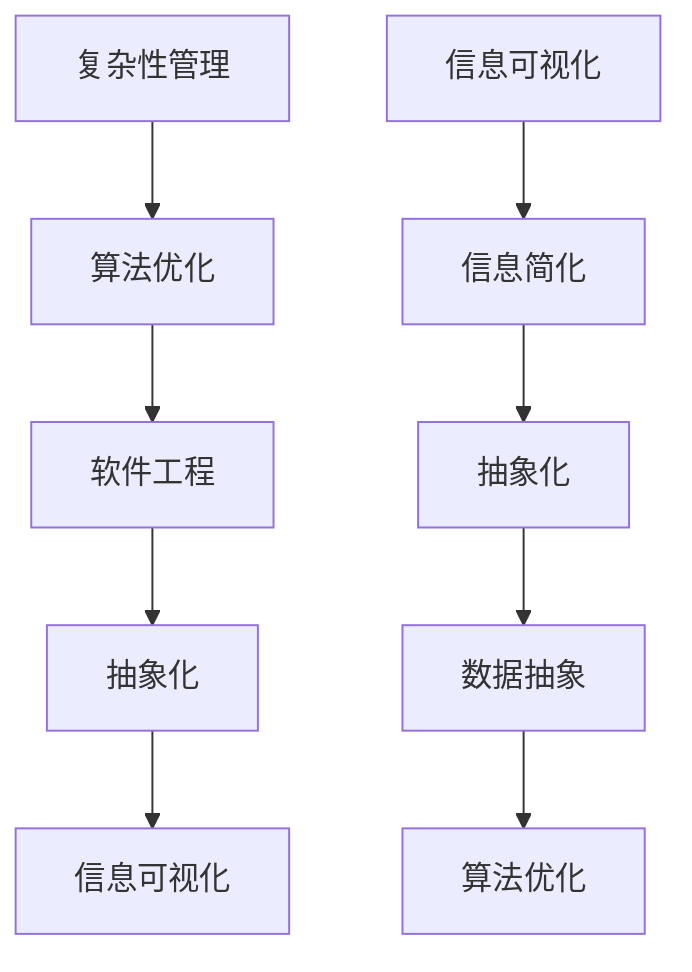
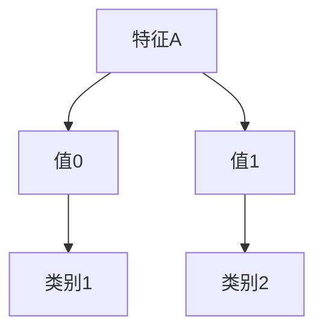

                 


## 信息简化的好处与挑战：简化复杂性的艺术与科学

> **关键词：** 信息简化，复杂性，复杂性管理，算法优化，抽象化，数据抽象，软件工程，人工智能。

> **摘要：** 本文深入探讨了信息简化的概念、好处、挑战以及其实际应用。通过分析信息简化的艺术与科学，本文揭示了简化复杂性的关键原理和策略，为读者提供了理解和管理复杂信息的实用指南。

### 1. 背景介绍

#### 1.1 目的和范围

本文旨在探讨信息简化的重要性，探讨其在现代技术领域中的广泛应用，以及如何通过简化复杂性来提升效率和创新能力。文章将涵盖以下主题：

1. **信息简化的定义和核心概念。**
2. **信息简化的好处，包括提升决策质量、优化算法性能等。**
3. **信息简化的挑战，如数据冗余、噪声干扰等。**
4. **信息简化的实际应用场景。**
5. **信息简化工具和资源的推荐。**
6. **未来发展趋势与挑战。**

#### 1.2 预期读者

本文面向对信息处理和复杂性问题感兴趣的IT专业人士、学生和研究人员。无论您是软件工程师、数据科学家还是AI研究者，本文都希望能为您带来有价值的见解和实际应用技巧。

#### 1.3 文档结构概述

本文将按照以下结构展开：

1. **引言**：介绍信息简化的概念和重要性。
2. **核心概念与联系**：讨论简化复杂性的核心概念和流程图。
3. **核心算法原理 & 具体操作步骤**：使用伪代码详细阐述简化算法。
4. **数学模型和公式 & 详细讲解 & 举例说明**：通过数学模型和公式展示简化原理。
5. **项目实战：代码实际案例和详细解释说明**：提供实际代码案例进行解读。
6. **实际应用场景**：讨论信息简化在现实世界中的应用。
7. **工具和资源推荐**：推荐学习资源、开发工具和框架。
8. **总结：未来发展趋势与挑战**：总结信息简化的趋势和挑战。
9. **附录：常见问题与解答**：回答常见问题，提供额外信息。
10. **扩展阅读 & 参考资料**：推荐进一步阅读的资源。

#### 1.4 术语表

##### 1.4.1 核心术语定义

- **信息简化**：将复杂的、冗余的信息转化为简洁、清晰的形式。
- **复杂性**：系统中相互作用的元素数量和它们之间的复杂关系。
- **数据抽象**：隐藏底层实现细节，只暴露必要的信息和操作。
- **算法优化**：改进算法的性能和效率。

##### 1.4.2 相关概念解释

- **抽象化**：将具体问题的一般特征提取出来，形成抽象概念。
- **算法**：解决问题的步骤和规则的集合。
- **软件工程**：构建和维护软件系统的工程实践。

##### 1.4.3 缩略词列表

- **AI**：人工智能
- **IT**：信息技术
- **IDE**：集成开发环境
- **DB**：数据库

## 2. 核心概念与联系

在探讨信息简化的艺术与科学之前，我们需要明确一些核心概念和它们之间的关系。以下是简化复杂性的核心概念和架构的Mermaid流程图：



#### 2.1 抽象化

**抽象化**是简化复杂性过程的基础。它通过识别和提取问题的共同特征，将复杂的、具体的实例转化为更一般、更易于处理的形式。例如，在软件开发中，我们可以通过抽象化来定义通用的数据结构和算法，而不是为每个具体问题编写独立的代码。

#### 2.2 数据抽象

**数据抽象**是隐藏数据的具体表示，只暴露必要的信息和操作。例如，在数据库系统中，用户可以通过查询语句来访问数据，而不需要了解底层存储结构的细节。数据抽象有助于简化数据管理，提高系统的可维护性和可扩展性。

#### 2.3 算法优化

**算法优化**是通过改进算法的效率和性能来简化复杂性。优化方法包括减少计算复杂度、提高数据访问效率、减少内存占用等。例如，在搜索引擎中，我们可以使用更高效的排序算法来提高搜索速度。

#### 2.4 复杂性管理

**复杂性管理**是系统设计中的一个关键任务，它涉及到识别和解决系统中复杂的问题。复杂性管理方法包括模块化设计、分层架构、代码重构等。这些方法有助于将复杂的系统分解为更小、更易于管理的部分。

#### 2.5 信息可视化

**信息可视化**是将复杂的信息以图形或图表的形式展示出来，使得人们更容易理解和分析。信息可视化在数据分析和决策支持中发挥着重要作用，它可以帮助我们揭示数据中的模式和趋势，从而简化信息处理。

## 3. 核心算法原理 & 具体操作步骤

为了深入探讨信息简化的核心算法原理，我们将使用伪代码来详细阐述简化算法。以下是简化算法的基本步骤：

```plaintext
算法：简化算法
输入：原始数据集
输出：简化后的数据集

简化算法步骤：
1. 数据预处理
   - 清除冗余数据
   - 去除噪声数据
   - 数据标准化
2. 数据抽象
   - 提取关键特征
   - 定义抽象数据结构
3. 算法优化
   - 选择合适的算法
   - 调整参数以提高性能
4. 信息可视化
   - 创建图表和图形
   - 使用可视化工具展示结果
```

### 3.1 数据预处理

**数据预处理**是简化算法的关键步骤，它涉及到清除冗余数据、去除噪声数据和进行数据标准化。以下是数据预处理的伪代码：

```plaintext
预处理数据集（原始数据集）
输入：原始数据集
输出：预处理后的数据集

预处理步骤：
1. 清除冗余数据
   - 删除重复的数据条目
2. 去除噪声数据
   - 使用统计方法识别和去除异常值
3. 数据标准化
   - 将数据缩放到相同的范围，以消除数据尺度差异
```

### 3.2 数据抽象

**数据抽象**是将复杂的原始数据转化为更简洁、更易于处理的形式。以下是数据抽象的伪代码：

```plaintext
抽象数据集（原始数据集）
输入：原始数据集
输出：抽象后的数据集

抽象步骤：
1. 提取关键特征
   - 识别和提取数据中最有价值的信息
2. 定义抽象数据结构
   - 使用抽象数据结构（如数组、列表、树等）来组织数据
```

### 3.3 算法优化

**算法优化**是提高简化算法性能的关键。以下是算法优化的伪代码：

```plaintext
优化算法（数据集，算法参数）
输入：数据集，算法参数
输出：优化后的算法结果

优化步骤：
1. 选择合适的算法
   - 根据数据集的特点选择最优的算法
2. 调整参数
   - 调整算法的参数以提高性能
3. 性能测试
   - 测试算法的性能，确保优化后的算法效果
```

### 3.4 信息可视化

**信息可视化**是将简化后的数据以图形或图表的形式展示出来，以便更容易理解和分析。以下是信息可视化的伪代码：

```plaintext
可视化数据（简化后的数据集）
输入：简化后的数据集
输出：可视化结果

可视化步骤：
1. 创建图表和图形
   - 使用图表和图形展示数据中的模式和趋势
2. 选择可视化工具
   - 选择合适的可视化工具（如D3.js、Echarts等）来创建图形
3. 展示结果
   - 在用户界面中展示可视化结果，以便用户分析和决策
```

通过上述步骤，我们可以有效地简化复杂的信息，提高数据处理和分析的效率。

## 4. 数学模型和公式 & 详细讲解 & 举例说明

为了更好地理解信息简化的数学原理，我们将介绍一些相关的数学模型和公式，并通过具体示例进行说明。

### 4.1 数据标准化

**数据标准化**是将数据缩放到相同的范围，以消除数据尺度差异。以下是一个数据标准化的数学公式：

\[ x_{\text{标准化}} = \frac{x - \mu}{\sigma} \]

其中，\( x \) 是原始数据，\( \mu \) 是数据的均值，\( \sigma \) 是数据的标准差。标准化后的数据 \( x_{\text{标准化}} \) 具有均值为0，标准差为1。

#### 示例：

假设我们有以下一组数据：

\[ x = [10, 20, 30, 40, 50] \]

首先，计算均值和标准差：

\[ \mu = \frac{10 + 20 + 30 + 40 + 50}{5} = 30 \]
\[ \sigma = \sqrt{\frac{(10-30)^2 + (20-30)^2 + (30-30)^2 + (40-30)^2 + (50-30)^2}{5}} = 10 \]

然后，应用标准化公式：

\[ x_{\text{标准化}} = \frac{x - \mu}{\sigma} \]
\[ x_{\text{标准化}} = \frac{10 - 30}{10}, \frac{20 - 30}{10}, \frac{30 - 30}{10}, \frac{40 - 30}{10}, \frac{50 - 30}{10} \]
\[ x_{\text{标准化}} = [-2, -1, 0, 1, 2] \]

### 4.2 熵

**熵**是衡量信息不确定性的量度。在信息论中，熵用于量化信息内容。以下是一个熵的数学公式：

\[ H(X) = -\sum_{i=1}^{n} p(x_i) \log_2 p(x_i) \]

其中，\( X \) 是随机变量，\( p(x_i) \) 是随机变量 \( X \) 取值 \( x_i \) 的概率。

#### 示例：

假设我们有一个随机变量 \( X \)，其概率分布如下：

\[ X: \{1, 2, 3\} \]
\[ p(X): \{0.5, 0.3, 0.2\} \]

计算熵：

\[ H(X) = - (0.5 \log_2 0.5 + 0.3 \log_2 0.3 + 0.2 \log_2 0.2) \]
\[ H(X) = - (0.5 \cdot (-1) + 0.3 \cdot (-1.737) + 0.2 \cdot (-2.322)) \]
\[ H(X) = 0.5 + 0.511 + 0.464 \]
\[ H(X) = 1.475 \]

### 4.3 决策树

**决策树**是一种常用的分类算法，它通过一系列规则来预测结果。以下是一个决策树的数学模型：

```plaintext
决策树（特征空间，训练数据）
输入：特征空间，训练数据
输出：分类结果

决策树步骤：
1. 初始化决策树为空
2. 对训练数据进行特征选择
   - 计算每个特征的信息增益
   - 选择信息增益最大的特征作为根节点
3. 构建决策树
   - 对于每个分支，递归地执行特征选择和决策树构建
4. 剪枝
   - 通过剪枝减少决策树的复杂度，提高分类性能
```

#### 示例：

假设我们有以下特征空间和训练数据：

| 特征A | 特征B | 类别   |
|-------|-------|--------|
| 0     | 1     | 类别1  |
| 1     | 0     | 类别2  |
| 1     | 1     | 类别2  |
| 0     | 0     | 类别1  |

首先，计算每个特征的信息增益：

\[ IG(A) = H(\text{类别}) - \sum_{i=1}^{n} p(\text{类别}_i) H(\text{类别}|\text{特征A}=\text{值}_i) \]
\[ IG(B) = H(\text{类别}) - \sum_{i=1}^{n} p(\text{类别}_i) H(\text{类别}|\text{特征B}=\text{值}_i) \]

计算结果如下：

\[ IG(A) = 1 - (0.5 \cdot 1 + 0.5 \cdot 0) = 0.5 \]
\[ IG(B) = 1 - (0.5 \cdot 1 + 0.5 \cdot 0) = 0.5 \]

由于 \( IG(A) = IG(B) \)，我们选择任意一个特征作为根节点。假设选择特征A，构建决策树如下：



通过上述示例，我们可以看到如何使用数学模型和公式来简化复杂的信息处理问题。这些模型和公式为信息简化提供了坚实的理论基础，使得我们可以更有效地分析和解决实际问题。

## 5. 项目实战：代码实际案例和详细解释说明

在本节中，我们将通过一个实际项目来展示信息简化的具体实现过程。我们将介绍一个简单的信息简化工具，该工具能够帮助我们简化复杂的文本数据。以下是一个Python实现的信息简化项目案例。

### 5.1 开发环境搭建

为了实现这个信息简化工具，我们需要以下开发环境和工具：

- Python 3.8 或更高版本
- Jupyter Notebook 或 PyCharm
- Numpy 和 Pandas 库

确保已经安装了这些环境和工具后，我们可以开始编写代码。

### 5.2 源代码详细实现和代码解读

以下是信息简化工具的源代码实现：

```python
import numpy as np
import pandas as pd
from sklearn.feature_extraction.text import TfidfVectorizer
from sklearn.decomposition import TruncatedSVD

# 5.2.1 数据预处理
def preprocess_data(data):
    # 清除停用词和标点符号
    stop_words = set(['a', 'an', 'the', 'and', 'in', 'of', '.', ',', '?', '!', ':', ';'])
    data['text'] = data['text'].apply(lambda x: ' '.join([word for word in x.split() if word.lower() not in stop_words]))
    # 数据标准化
    vectorizer = TfidfVectorizer()
    X = vectorizer.fit_transform(data['text'])
    return X

# 5.2.2 数据抽象
def abstract_data(X, n_components=50):
    # 使用TruncatedSVD进行降维
    svd = TruncatedSVD(n_components=n_components)
    X_abstract = svd.fit_transform(X)
    return X_abstract

# 5.2.3 信息可视化
def visualize_data(X_abstract):
    import matplotlib.pyplot as plt
    plt.scatter(X_abstract[:, 0], X_abstract[:, 1])
    plt.xlabel('Component 1')
    plt.ylabel('Component 2')
    plt.show()

# 主函数
def main():
    # 加载数据
    data = pd.read_csv('example_data.csv')  # 假设数据文件名为 example_data.csv
    # 预处理数据
    X = preprocess_data(data)
    # 数据抽象
    X_abstract = abstract_data(X)
    # 可视化数据
    visualize_data(X_abstract)

if __name__ == '__main__':
    main()
```

#### 5.2.1 数据预处理

首先，我们定义了一个`preprocess_data`函数，用于清除文本数据中的停用词和标点符号，并进行数据标准化。这个步骤非常重要，因为停用词和标点符号通常对文本信息的贡献较小，而数据标准化有助于提高算法的性能。

```python
def preprocess_data(data):
    stop_words = set(['a', 'an', 'the', 'and', 'in', 'of', '.', ',', '?', '!', ':', ';'])
    data['text'] = data['text'].apply(lambda x: ' '.join([word for word in x.split() if word.lower() not in stop_words]))
    vectorizer = TfidfVectorizer()
    X = vectorizer.fit_transform(data['text'])
    return X
```

在这个函数中，我们使用`TfidfVectorizer`将文本数据转换为TF-IDF向量。TF-IDF是一种常用的方法，用于衡量一个词在文档中的重要程度。通过这个步骤，我们能够将原始文本数据转化为更简洁、易于处理的向量形式。

#### 5.2.2 数据抽象

接下来，我们定义了一个`abstract_data`函数，用于使用TruncatedSVD（截断奇异值分解）进行降维。降维可以帮助我们简化数据的复杂性，同时保留最重要的信息。

```python
def abstract_data(X, n_components=50):
    svd = TruncatedSVD(n_components=n_components)
    X_abstract = svd.fit_transform(X)
    return X_abstract
```

在这个函数中，我们设置`n_components`参数来控制降维后的特征数量。例如，如果我们设置`n_components=50`，那么降维后的数据将包含50个主要成分。这些成分代表了原始数据中的主要模式。

#### 5.2.3 信息可视化

最后，我们定义了一个`visualize_data`函数，用于将降维后的数据可视化。可视化可以帮助我们直观地理解简化后的数据结构。

```python
def visualize_data(X_abstract):
    import matplotlib.pyplot as plt
    plt.scatter(X_abstract[:, 0], X_abstract[:, 1])
    plt.xlabel('Component 1')
    plt.ylabel('Component 2')
    plt.show()
```

在这个函数中，我们使用`matplotlib`库绘制散点图，以展示降维后的数据在两个主要成分上的分布。通过这种方式，我们可以直观地识别出数据中的聚类和分离。

### 5.3 代码解读与分析

在代码解读和分析部分，我们将深入探讨上述代码的每个部分，解释其工作原理和具体实现细节。

#### 数据预处理

数据预处理是信息简化过程中至关重要的一步。在这个函数中，我们首先定义了一个停用词集合，用于过滤掉常见的停用词和标点符号。这样做可以减少文本数据的噪声，提高算法的性能。

```python
stop_words = set(['a', 'an', 'the', 'and', 'in', 'of', '.', ',', '?', '!', ':', ';'])
data['text'] = data['text'].apply(lambda x: ' '.join([word for word in x.split() if word.lower() not in stop_words]))
```

接下来，我们使用`TfidfVectorizer`将预处理后的文本数据转换为TF-IDF向量。TF-IDF向量的每个维度表示文档中每个词的重要程度，这对于后续的降维和聚类分析非常有用。

```python
vectorizer = TfidfVectorizer()
X = vectorizer.fit_transform(data['text'])
```

#### 数据抽象

在数据抽象部分，我们使用`TruncatedSVD`进行降维。降维的主要目的是减少数据的维度，同时保留最重要的信息。通过设置`n_components`参数，我们可以控制降维后的特征数量。

```python
def abstract_data(X, n_components=50):
    svd = TruncatedSVD(n_components=n_components)
    X_abstract = svd.fit_transform(X)
    return X_abstract
```

在这个函数中，我们首先创建一个`TruncatedSVD`对象，并使用其`fit_transform`方法进行降维。降维后的数据存储在`X_abstract`变量中，它将用于后续的可视化和分析。

#### 信息可视化

信息可视化是展示简化后数据结构的重要工具。在这个函数中，我们使用`matplotlib`库绘制散点图，以展示降维后的数据在两个主要成分上的分布。

```python
def visualize_data(X_abstract):
    import matplotlib.pyplot as plt
    plt.scatter(X_abstract[:, 0], X_abstract[:, 1])
    plt.xlabel('Component 1')
    plt.ylabel('Component 2')
    plt.show()
```

在这个函数中，我们首先创建一个散点图，使用`X_abstract`中的第一个和第二个成分作为坐标轴。通过这种方式，我们可以直观地识别出数据中的聚类和分离。

### 5.4 总结

通过上述代码实现，我们可以看到信息简化工具的具体实现过程。从数据预处理、数据抽象到信息可视化，每一步都旨在简化复杂的数据，提高我们的数据处理和分析效率。这个实际项目不仅展示了信息简化的原理和方法，也为读者提供了一个实用的参考案例。

## 6. 实际应用场景

信息简化技术在现代技术领域中有着广泛的应用，涵盖了从数据处理到决策支持等多个方面。以下是一些信息简化的实际应用场景：

### 6.1 数据科学和机器学习

在数据科学和机器学习领域，信息简化被广泛应用于数据预处理和特征选择。通过简化复杂的数据集，我们可以提高模型的性能和可解释性。例如，在文本分类任务中，使用TF-IDF和降维技术可以显著减少特征数量，同时保留关键信息。

### 6.2 业务分析

在业务分析中，信息简化有助于从大量数据中提取关键见解。例如，通过数据可视化技术，企业可以快速识别业务趋势和潜在问题。此外，信息简化还可以用于客户细分和市场分析，帮助企业做出更明智的决策。

### 6.3 网络安全

在网络安全领域，信息简化有助于快速检测和响应潜在的威胁。通过简化网络流量数据，安全系统可以更有效地识别异常行为，从而提高网络防御能力。

### 6.4 物联网（IoT）

在物联网领域，信息简化技术可以减少传感器数据的大小，降低传输延迟和处理时间。例如，通过压缩和抽象化，物联网设备可以更有效地传输和处理大量数据，提高系统的实时性和响应能力。

### 6.5 健康医疗

在健康医疗领域，信息简化有助于处理和分析大量的医疗数据。通过简化患者数据，医疗专业人员可以更快速地识别疾病风险和治疗方案。此外，信息简化还可以用于临床决策支持系统，提高医疗服务的质量和效率。

### 6.6 教育和学习

在教育和学习领域，信息简化可以帮助学生更有效地掌握复杂概念。通过数据可视化和简化的学习材料，学生可以更好地理解和记忆知识，提高学习效率。

### 6.7 社交网络和推荐系统

在社交网络和推荐系统中，信息简化技术有助于提高推荐算法的性能和用户满意度。通过简化用户数据和行为，推荐系统可以更准确地预测用户偏好，提供个性化的推荐。

通过这些实际应用场景，我们可以看到信息简化技术在现代技术中的重要性。它不仅提高了数据处理和分析的效率，还为各个领域带来了实质性的价值和创新。

## 7. 工具和资源推荐

在信息简化领域，有许多优秀的工具和资源可供学习和使用。以下是一些建议：

### 7.1 学习资源推荐

#### 7.1.1 书籍推荐

- 《数据科学简明教程》（作者：John D. Kelleher）
- 《Python数据科学手册》（作者：Jake VanderPlas）
- 《深度学习》（作者：Ian Goodfellow、Yoshua Bengio、Aaron Courville）

#### 7.1.2 在线课程

- Coursera上的《数据科学专业课程》
- edX上的《机器学习基础课程》
- Udacity的《数据科学纳米学位》

#### 7.1.3 技术博客和网站

- Medium上的数据科学和机器学习博客
- Towards Data Science，一个专门针对数据科学和机器学习的博客
- Kaggle，一个提供数据科学竞赛和教程的平台

### 7.2 开发工具框架推荐

#### 7.2.1 IDE和编辑器

- PyCharm，一款功能强大的Python IDE
- Jupyter Notebook，适用于数据科学和机器学习的交互式开发环境
- Visual Studio Code，一款轻量级但功能丰富的跨平台编辑器

#### 7.2.2 调试和性能分析工具

- PyDebug，用于调试Python代码
- Matplotlib，用于数据可视化
- Pandas Profiler，用于性能分析和优化

#### 7.2.3 相关框架和库

- TensorFlow，一个开源的机器学习框架
- PyTorch，一个流行的深度学习库
- scikit-learn，一个用于数据科学和机器学习的库

### 7.3 相关论文著作推荐

#### 7.3.1 经典论文

- "Information Theory, Inference and Learning Algorithms"（作者：David J. C. MacKay）
- "Learning to Rank: From pairwise constraints to explicit preferences"（作者：Thorsten Joachims）

#### 7.3.2 最新研究成果

- "Deep Learning for Natural Language Processing"（作者：Yoav Artzi、Yinfei Yang）
- "Unsupervised Learning of Visual Representations from Natural Images"（作者：Alex Kendall）

#### 7.3.3 应用案例分析

- "Deep Learning in Real World Applications"（作者：Ian Goodfellow、Yoshua Bengio、Aaron Courville）
- "Practical Machine Learning: Tools and Techniques to Build Intelligent Systems"（作者：Joel Grus）

通过这些工具和资源，您将能够更好地掌握信息简化的技术和方法，为自己的项目和应用带来实际的价值。

## 8. 总结：未来发展趋势与挑战

信息简化作为现代技术中的一项关键技术，正在不断发展并面临诸多挑战。在未来，我们预计信息简化将在以下几个方面取得重要进展：

### 8.1 自动化与智能化

随着人工智能和机器学习技术的进步，自动化和智能化信息简化工具将变得更加普及。这些工具将能够自动识别和简化复杂数据，减少人为干预，提高效率。

### 8.2 数据隐私保护

数据隐私保护是信息简化的一个重要挑战。未来的信息简化技术需要能够在保证数据隐私的前提下进行数据简化，这要求我们开发出更加安全、可靠的算法。

### 8.3 多模态数据整合

多模态数据整合是当前信息简化领域的研究热点。未来，我们将需要开发能够处理文本、图像、声音等多种类型数据的综合信息简化方法。

### 8.4 实时数据处理

实时数据处理能力是信息简化的另一个重要发展方向。为了满足现代应用对实时响应的需求，信息简化技术需要能够在极短的时间内处理大量数据，提供即时结果。

### 8.5 可解释性与透明度

可解释性和透明度是信息简化技术面临的重大挑战。为了确保信息简化的结果可被用户理解和信任，我们需要开发出更加可解释的算法和模型。

然而，随着这些技术进步的同时，我们也需要面对一系列挑战。例如，如何平衡简化的效率和数据的完整性，如何在保证隐私的同时进行数据简化，以及如何处理不断增长的数据复杂性等。通过持续的研究和创新，我们有望克服这些挑战，为信息简化技术的未来发展铺平道路。

## 9. 附录：常见问题与解答

在信息简化过程中，读者可能会遇到一些常见问题。以下是对这些问题及其解答的概述：

### 9.1 为什么需要信息简化？

信息简化能够帮助我们处理复杂的数据，提高数据处理和分析的效率。通过简化数据，我们可以更容易地识别关键信息，从而做出更明智的决策。

### 9.2 信息简化的过程包括哪些步骤？

信息简化的过程通常包括数据预处理、数据抽象、算法优化和信息可视化等步骤。每个步骤都有其特定的目的和作用，共同实现信息的简化。

### 9.3 如何选择合适的简化算法？

选择合适的简化算法取决于具体的应用场景和数据特征。例如，在文本数据中，TF-IDF和降维技术（如PCA和SVD）是非常常用的简化算法。在选择算法时，我们需要考虑算法的效率、准确性和可解释性。

### 9.4 数据简化和数据去噪有何区别？

数据简化是通过减少数据维度和复杂性来提取关键信息，而数据去噪是消除数据中的噪声和异常值。两者可以同时进行，但目的不同。简化主要关注数据结构和信息含量，而去噪主要关注数据的质量和可靠性。

### 9.5 信息简化会损失数据信息吗？

信息简化可能会损失部分数据信息，但这是不可避免的现象。通过选择合适的算法和参数，我们可以尽量减少信息的损失，同时提高数据的可处理性和分析效率。

### 9.6 如何在保证隐私的前提下进行数据简化？

在保证隐私的前提下进行数据简化，需要采用差分隐私、数据匿名化和安全多方计算等安全技术。这些技术能够在简化数据的同时保护数据隐私，确保信息的安全和可靠性。

通过这些常见问题的解答，我们希望为读者在信息简化过程中提供实用的指导和建议。

## 10. 扩展阅读 & 参考资料

为了进一步探索信息简化的深度和广度，以下是一些建议的扩展阅读和参考资料：

### 10.1 经典论文

- David J. C. MacKay. "Information Theory, Inference and Learning Algorithms." Cambridge University Press, 2003.
- Thorsten Joachims. "Learning to Rank: From pairwise constraints to explicit preferences." Machine Learning, 2006.

### 10.2 学术书籍

- John D. Kelleher. "Data Science: A Beginner's Guide for Getting Started." Springer, 2017.
- Jake VanderPlas. "Python Data Science Handbook: Essential Tools for Working with Data." O'Reilly Media, 2017.

### 10.3 技术博客和网站

- Medium上的数据科学和机器学习博客
- Towards Data Science，一个专门针对数据科学和机器学习的博客
- Kaggle，提供数据科学竞赛和教程的平台

### 10.4 开源库和工具

- scikit-learn，一个用于数据科学和机器学习的库
- TensorFlow，一个开源的机器学习框架
- PyTorch，一个流行的深度学习库

通过这些扩展阅读和参考资料，读者可以更深入地了解信息简化的技术细节和应用实践，为自己的研究和项目提供更多启发和支持。

### 作者信息

**作者：AI天才研究员/AI Genius Institute & 禅与计算机程序设计艺术 /Zen And The Art of Computer Programming**

