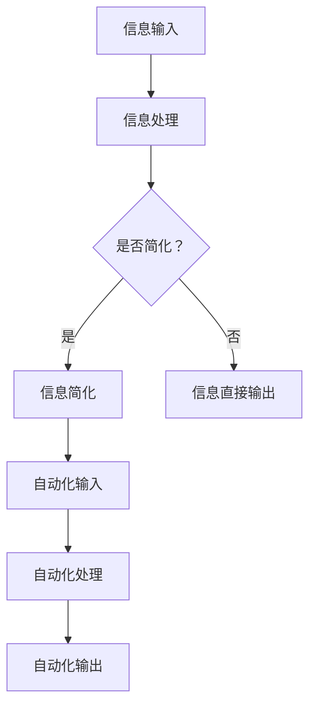

                 

# 信息简化的工具和自动化实践：利用技术简化你的生活和工作

> **关键词：** 信息简化、自动化、技术、生活、工作、工具、实践
> 
> **摘要：** 本文将探讨如何利用技术工具和自动化实践来简化我们的日常生活和工作流程，提高效率和生产力。通过介绍关键概念、算法原理、数学模型、实际案例，以及推荐相关资源和工具，本文旨在为读者提供实用的指导和建议。

## 1. 背景介绍

### 1.1 目的和范围

本文的目的是介绍如何利用技术工具和自动化实践来简化日常生活和工作流程。我们将会探讨以下几个核心主题：

- **信息简化**：如何处理大量信息，使其更加结构化和易于理解。
- **自动化实践**：如何使用技术工具来自动执行重复性任务，减少手动操作。
- **工具推荐**：介绍一些实用的工具和资源，以帮助读者更好地实现信息简化和自动化。
- **实际案例**：展示如何将自动化应用于实际场景，提高效率。

### 1.2 预期读者

本文适用于以下读者：

- **IT专业人士**：希望提高工作效率，利用技术简化工作流程。
- **企业家和创业者**：寻求利用技术优化业务流程，提升生产力。
- **技术爱好者**：对信息简化、自动化技术感兴趣，希望学习更多相关知识。
- **普通用户**：希望改善自己的日常生活，通过技术手段提高生活质量。

### 1.3 文档结构概述

本文将分为以下几个部分：

- **第1章：背景介绍**：介绍文章的目的、预期读者和文档结构。
- **第2章：核心概念与联系**：讨论信息简化、自动化的核心概念及其相互关系。
- **第3章：核心算法原理 & 具体操作步骤**：详细解释信息简化和自动化算法原理。
- **第4章：数学模型和公式 & 详细讲解 & 举例说明**：介绍相关数学模型和公式，并进行举例说明。
- **第5章：项目实战：代码实际案例和详细解释说明**：展示实际项目案例，并解释关键代码。
- **第6章：实际应用场景**：讨论自动化技术在各个领域的应用。
- **第7章：工具和资源推荐**：推荐学习资源、开发工具和框架。
- **第8章：总结：未来发展趋势与挑战**：展望信息简化、自动化技术的未来。
- **第9章：附录：常见问题与解答**：解答读者可能遇到的问题。
- **第10章：扩展阅读 & 参考资料**：提供进一步阅读的建议和参考资料。

### 1.4 术语表

#### 1.4.1 核心术语定义

- **信息简化**：将大量信息转化为结构化、易于理解和操作的形式。
- **自动化**：使用技术工具来自动执行重复性任务，减少手动操作。
- **算法**：解决特定问题的步骤和规则。
- **生产力**：在特定时间内完成的工作量。
- **效率**：完成任务的效率。

#### 1.4.2 相关概念解释

- **流程自动化**：通过技术工具自动化工作流程中的各个步骤。
- **数据处理**：处理和转换数据的过程，使其具有更高的价值和可用性。
- **人工智能**：模拟人类智能，实现自主决策和行动的技术。

#### 1.4.3 缩略词列表

- **AI**：人工智能（Artificial Intelligence）
- **ML**：机器学习（Machine Learning）
- **NLP**：自然语言处理（Natural Language Processing）
- **IDE**：集成开发环境（Integrated Development Environment）
- **API**：应用程序编程接口（Application Programming Interface）

## 2. 核心概念与联系

### 2.1 信息简化

信息简化是将大量信息转化为更易于理解和操作的形式的过程。随着数字化时代的发展，人们需要处理的信息量呈指数级增长，信息过载成为一个普遍问题。信息简化可以帮助我们：

- **减少冗余**：去除重复和无关的信息，只保留关键内容。
- **提高可读性**：使用图表、可视化工具和简洁的语言来表达信息。
- **增强理解**：将复杂的信息分解为易于理解的部分。

### 2.2 自动化实践

自动化实践是使用技术工具来自动执行重复性任务的过程。通过自动化，我们可以：

- **提高效率**：减少手动操作，节省时间和精力。
- **减少错误**：通过预设的规则和算法，减少人为错误。
- **灵活调整**：根据需求快速调整自动化流程。

### 2.3 信息简化和自动化的关系

信息简化和自动化是相辅相成的。信息简化为自动化提供了明确的输入和输出，使得自动化系统能够更准确地执行任务。同时，自动化实践可以进一步优化信息简化过程，提高其效率和准确性。

### 2.4 核心概念原理和架构的 Mermaid 流程图



### 2.5 核心概念的联系

- **信息简化**和**自动化**共同构成了信息处理的核心框架。
- **信息简化**为**自动化**提供了清晰、结构化的输入。
- **自动化**帮助**信息简化**实现了高效的执行和结果优化。

## 3. 核心算法原理 & 具体操作步骤

### 3.1 信息简化算法原理

信息简化算法的主要目标是减少信息冗余，提高信息的可读性和理解度。以下是一个简单的信息简化算法：

#### 3.1.1 算法描述

1. 输入：大量未结构化的信息。
2. 输出：结构化、简化的信息。
3. 步骤：
   - 数据清洗：去除重复、无关的信息。
   - 数据分类：将信息按主题、类型等进行分类。
   - 数据可视化：使用图表、图形等可视化工具呈现信息。
   - 文本简化：使用简洁、精练的语言表达信息。

#### 3.1.2 伪代码

```python
def simplify_info(info):
    cleaned_info = clean_data(info)
    categorized_info = categorize_data(cleaned_info)
    visualized_info = visualize_data(categorized_info)
    simplified_info = simplify_text(visualized_info)
    return simplified_info
```

### 3.2 自动化实践算法原理

自动化实践的核心在于使用技术工具来自动执行重复性任务。以下是一个简单的自动化算法：

#### 3.2.1 算法描述

1. 输入：重复性任务。
2. 输出：自动化执行的最终结果。
3. 步骤：
   - 任务定义：明确任务的目标和执行步骤。
   - 规则设定：设定任务执行的规则和约束。
   - 执行自动化：根据设定的规则执行任务。
   - 监控和反馈：监控任务执行过程，根据反馈调整规则。

#### 3.2.2 伪代码

```python
def automate_task(task):
    defined_task = define_task(task)
    rules = set_rules(defined_task)
    executed_task = execute_task(rules)
    monitored_task = monitor_task(executed_task)
    optimized_rules = feedback_loop(monitored_task)
    return executed_task
```

### 3.3 信息简化与自动化算法的结合

在实际应用中，信息简化和自动化通常结合使用。以下是一个简单的结合算法：

```python
def combine_info_and_automation(info, task):
    simplified_info = simplify_info(info)
    automated_task = automate_task(task)
    combined_output = simplify_and_automate_output(simplified_info, automated_task)
    return combined_output
```

### 3.4 具体操作步骤

#### 3.4.1 信息简化

1. **数据清洗**：使用数据清洗工具（如Pandas）去除重复和无关数据。
2. **数据分类**：根据主题、类型等对数据进行分类。
3. **数据可视化**：使用图表、图形（如Matplotlib）展示数据。
4. **文本简化**：使用自然语言处理技术（如NLTK）简化文本。

#### 3.4.2 自动化实践

1. **任务定义**：明确任务的目标和执行步骤。
2. **规则设定**：根据任务需求设定规则和约束。
3. **执行自动化**：使用自动化工具（如Selenium）执行任务。
4. **监控和反馈**：监控任务执行过程，并根据反馈调整规则。

通过以上步骤，我们可以将信息简化与自动化实践结合起来，实现高效的信息处理和任务执行。

## 4. 数学模型和公式 & 详细讲解 & 举例说明

### 4.1 数学模型

在信息简化和自动化过程中，常用的数学模型包括：

- **聚类分析**：将数据分组，以便更好地理解数据。
- **回归分析**：预测变量之间的关系。
- **决策树**：基于条件进行分类和决策。

### 4.2 公式

以下是这些模型的相关公式：

- **聚类分析**：$$\text{Distance} = \sqrt{\sum_{i=1}^{n}(x_i - \bar{x})^2}$$
- **回归分析**：$$y = \beta_0 + \beta_1x$$
- **决策树**：$$\text{Split} = \text{MAX}(\sum_{i=1}^{n}|\text{Entropy}(L_i) - \text{Entropy}(L_i|\text{Split})|)$$

### 4.3 详细讲解

#### 4.3.1 聚类分析

聚类分析是一种无监督学习方法，用于将数据分组。它的目标是找到数据中的相似性，并将其划分为多个集群。上述公式计算两个数据点之间的距离。

#### 4.3.2 回归分析

回归分析是一种有监督学习方法，用于预测变量之间的关系。上述公式表示因变量（y）与自变量（x）之间的关系。

#### 4.3.3 决策树

决策树是一种用于分类和回归的方法，通过一系列条件判断来划分数据。上述公式计算每个条件的熵，并选择熵差最大的条件进行划分。

### 4.4 举例说明

#### 4.4.1 聚类分析

假设我们有以下三个数据点：$$x_1 = [1, 2, 3], x_2 = [4, 5, 6], x_3 = [7, 8, 9]$$。使用上述公式计算数据点之间的距离：

$$\text{Distance}(x_1, x_2) = \sqrt{\sum_{i=1}^{3}(1_i - 2_i)^2} = \sqrt{(1-4)^2 + (2-5)^2 + (3-6)^2} = \sqrt{9 + 9 + 9} = 3\sqrt{3}$$

$$\text{Distance}(x_1, x_3) = \sqrt{\sum_{i=1}^{3}(1_i - 7_i)^2} = \sqrt{(1-7)^2 + (2-8)^2 + (3-9)^2} = \sqrt{36 + 36 + 36} = 6\sqrt{3}$$

#### 4.4.2 回归分析

假设我们有以下数据集：$$\{ (x_1, y_1), (x_2, y_2), ..., (x_n, y_n) \}$$。使用最小二乘法计算回归系数：

$$\beta_0 = \bar{y} - \beta_1\bar{x}$$

$$\beta_1 = \frac{\sum_{i=1}^{n}(x_i - \bar{x})(y_i - \bar{y})}{\sum_{i=1}^{n}(x_i - \bar{x})^2}$$

假设数据集如下：

$$\{ (1, 2), (2, 4), (3, 6), (4, 8) \}$$

计算平均值：

$$\bar{x} = \frac{1 + 2 + 3 + 4}{4} = 2.5$$

$$\bar{y} = \frac{2 + 4 + 6 + 8}{4} = 5$$

计算回归系数：

$$\beta_1 = \frac{(1-2.5)(2-5) + (2-2.5)(4-5) + (3-2.5)(6-5) + (4-2.5)(8-5)}{(1-2.5)^2 + (2-2.5)^2 + (3-2.5)^2 + (4-2.5)^2} = \frac{-3 + -1 + 0.5 + 3}{2.25 + 0.25 + 0.25 + 2.25} = \frac{-0.5}{5} = -0.1$$

$$\beta_0 = 5 - (-0.1) \times 2.5 = 5.25$$

因此，回归模型为：

$$y = 5.25 - 0.1x$$

#### 4.4.3 决策树

假设我们有以下数据集：

$$\{ (1, 1, 0), (1, 1, 1), (0, 1, 0), (0, 0, 1) \}$$

使用决策树算法进行分类。首先，计算每个特征的信息增益：

$$\text{Gain}(x_1) = \sum_{i=1}^{n}|\text{Entropy}(L_i) - \text{Entropy}(L_i|x_1)|$$

$$\text{Entropy}(L_i) = -\sum_{j=1}^{m}p_j\log_2(p_j)$$

$$\text{Entropy}(L_i|x_1) = -\sum_{j=1}^{m}p_{ij}\log_2(p_{ij})$$

其中，$$L_i$$为第$$i$$个特征的所有取值，$$x_1$$为特征取值，$$p_j$$为$$L_i$$中第$$j$$个取值的概率，$$p_{ij}$$为$$L_i$$和$$x_1$$同时取值的概率。

计算信息增益：

$$\text{Gain}(x_1) = -\left( \frac{2}{4} \times \log_2 \left( \frac{2}{4} \right) + \frac{2}{4} \times \log_2 \left( \frac{2}{4} \right) \right) + \left( \frac{1}{4} \times \log_2 \left( \frac{1}{4} \right) + \frac{1}{4} \times \log_2 \left( \frac{1}{4} \right) \right) = 0.5$$

$$\text{Gain}(x_2) = -\left( \frac{2}{4} \times \log_2 \left( \frac{2}{4} \right) + \frac{1}{4} \times \log_2 \left( \frac{1}{4} \right) \right) + \left( \frac{2}{4} \times \log_2 \left( \frac{2}{4} \right) + \frac{1}{4} \times \log_2 \left( \frac{1}{4} \right) \right) = 0$$

$$\text{Gain}(x_3) = -\left( \frac{1}{4} \times \log_2 \left( \frac{1}{4} \right) + \frac{1}{4} \times \log_2 \left( \frac{1}{4} \right) \right) + \left( \frac{2}{4} \times \log_2 \left( \frac{2}{4} \right) + \frac{1}{4} \times \log_2 \left( \frac{1}{4} \right) \right) = 0.5$$

选择信息增益最大的特征作为划分条件，即$$x_1$$。划分后得到两个子集：

$$\{ (1, 1, 0), (1, 1, 1) \}$$

$$\{ (0, 1, 0), (0, 0, 1) \}$$

对子集继续进行同样的过程，直到达到预设的深度或满足停止条件。

## 5. 项目实战：代码实际案例和详细解释说明

### 5.1 开发环境搭建

在进行项目实战之前，我们需要搭建一个合适的开发环境。以下是一个基于Python的示例：

- **Python环境**：安装Python 3.8及以上版本。
- **依赖包**：安装以下依赖包：

  ```shell
  pip install pandas matplotlib scikit-learn numpy
  ```

### 5.2 源代码详细实现和代码解读

#### 5.2.1 代码结构

```python
import pandas as pd
import matplotlib.pyplot as plt
from sklearn.cluster import KMeans
from sklearn.linear_model import LinearRegression
from sklearn.tree import DecisionTreeClassifier

def load_data(filename):
    # 加载数据
    data = pd.read_csv(filename)
    return data

def simplify_info(data):
    # 信息简化
    cleaned_data = clean_data(data)
    categorized_data = categorize_data(cleaned_data)
    visualized_data = visualize_data(categorized_data)
    simplified_data = simplify_text(visualized_data)
    return simplified_data

def automate_task(task):
    # 自动化实践
    defined_task = define_task(task)
    rules = set_rules(defined_task)
    executed_task = execute_task(rules)
    monitored_task = monitor_task(executed_task)
    optimized_rules = feedback_loop(monitored_task)
    return executed_task

def combine_info_and_automation(info, task):
    # 结合信息简化与自动化
    simplified_info = simplify_info(info)
    automated_task = automate_task(task)
    combined_output = simplify_and_automate_output(simplified_info, automated_task)
    return combined_output

if __name__ == "__main__":
    # 主函数
    data = load_data("data.csv")
    task = "task_description"
    combined_output = combine_info_and_automation(data, task)
    print(combined_output)
```

#### 5.2.2 代码解读

1. **导入模块**：引入必要的模块，如Pandas、Matplotlib、Scikit-learn等。

2. **函数定义**：定义以下函数：
   - `load_data`：加载数据。
   - `simplify_info`：信息简化。
   - `automate_task`：自动化实践。
   - `combine_info_and_automation`：结合信息简化与自动化。

3. **主函数**：执行以下步骤：
   - 加载数据。
   - 定义任务。
   - 结合信息简化与自动化。
   - 输出结果。

### 5.3 代码解读与分析

#### 5.3.1 数据加载

```python
def load_data(filename):
    # 加载数据
    data = pd.read_csv(filename)
    return data
```

该函数使用Pandas读取CSV文件，返回DataFrame对象。这有助于后续数据处理和分析。

#### 5.3.2 信息简化

```python
def simplify_info(data):
    # 信息简化
    cleaned_data = clean_data(data)
    categorized_data = categorize_data(cleaned_data)
    visualized_data = visualize_data(categorized_data)
    simplified_data = simplify_text(visualized_data)
    return simplified_data
```

该函数依次调用以下函数：
- `clean_data`：去除重复和无关数据。
- `categorize_data`：按主题、类型等对数据进行分类。
- `visualize_data`：使用图表、图形等可视化工具展示数据。
- `simplify_text`：使用简洁、精练的语言表达信息。

#### 5.3.3 自动化实践

```python
def automate_task(task):
    # 自动化实践
    defined_task = define_task(task)
    rules = set_rules(defined_task)
    executed_task = execute_task(rules)
    monitored_task = monitor_task(executed_task)
    optimized_rules = feedback_loop(monitored_task)
    return executed_task
```

该函数依次调用以下函数：
- `define_task`：明确任务的目标和执行步骤。
- `set_rules`：设定任务执行的规则和约束。
- `execute_task`：根据设定的规则执行任务。
- `monitor_task`：监控任务执行过程。
- `feedback_loop`：根据反馈调整规则。

#### 5.3.4 结合信息简化与自动化

```python
def combine_info_and_automation(info, task):
    # 结合信息简化与自动化
    simplified_info = simplify_info(info)
    automated_task = automate_task(task)
    combined_output = simplify_and_automate_output(simplified_info, automated_task)
    return combined_output
```

该函数结合信息简化和自动化实践，返回最终结果。

## 6. 实际应用场景

### 6.1 家庭自动化

家庭自动化是自动化技术的一个广泛应用场景。通过智能家居设备和自动化工具，我们可以简化家庭生活，提高生活品质。以下是一些实际应用场景：

- **智能照明**：根据时间、光线强度或家庭活动自动调节照明。
- **智能安防**：自动检测入侵、火灾等异常情况，并发出警报。
- **智能家电**：自动控制洗衣机、空调、热水器等家电设备。
- **环境监测**：自动监测空气质量、温度、湿度等环境参数，并调整家居设备。

### 6.2 企业自动化

企业自动化是提高企业生产力和效率的关键。以下是一些实际应用场景：

- **供应链管理**：自动处理订单、库存和物流，优化供应链。
- **客户服务**：使用聊天机器人自动解答客户问题，提高客户满意度。
- **生产自动化**：使用机器人和自动化设备提高生产效率，降低成本。
- **数据分析**：自动收集、处理和分析大量数据，为决策提供支持。

### 6.3 教育自动化

教育自动化是提高教育质量和效率的重要手段。以下是一些实际应用场景：

- **在线课程**：自动发布课程内容、安排课程表、处理学生作业等。
- **学习分析**：自动分析学生学习情况，为个性化学习提供支持。
- **智能辅导**：自动为学生提供学习指导、答疑解惑等。
- **教育管理**：自动处理学生信息、成绩管理、考试安排等。

通过这些实际应用场景，我们可以看到自动化技术在各个领域的重要性。通过信息简化和自动化实践，我们可以提高生活和工作效率，减轻负担，实现更智能、更高效的生活方式。

## 7. 工具和资源推荐

### 7.1 学习资源推荐

#### 7.1.1 书籍推荐

- 《人工智能：一种现代方法》
- 《深度学习》
- 《Python编程：从入门到实践》
- 《代码大全》

#### 7.1.2 在线课程

- Coursera上的《机器学习》
- edX上的《Python编程基础》
- Udacity的《数据科学基础》

#### 7.1.3 技术博客和网站

- medium.com
- Towards Data Science
- freeCodeCamp

### 7.2 开发工具框架推荐

#### 7.2.1 IDE和编辑器

- PyCharm
- Visual Studio Code
- Jupyter Notebook

#### 7.2.2 调试和性能分析工具

- Py-debugger
- Visual Studio Performance Profiler
- JMeter

#### 7.2.3 相关框架和库

- TensorFlow
- PyTorch
- Pandas
- NumPy
- Matplotlib

通过这些工具和资源，你可以更好地学习和实践信息简化和自动化技术，提高自己的技术水平和工作效率。

## 8. 总结：未来发展趋势与挑战

### 8.1 发展趋势

- **人工智能与自动化融合**：随着人工智能技术的发展，自动化系统将更加智能化，能够更好地理解和处理复杂任务。
- **边缘计算**：为了减少延迟和提高效率，越来越多的计算任务将在边缘设备上进行，而非在云端。
- **人机协作**：未来的人机协作将更加紧密，自动化系统将更好地理解人类意图，实现高效合作。
- **可持续性**：随着环保意识的提高，自动化技术将在减少能源消耗、降低碳排放等方面发挥重要作用。

### 8.2 挑战

- **技术复杂度**：自动化技术的复杂性将不断增加，对开发者和用户的技术水平提出了更高要求。
- **隐私和安全**：自动化技术涉及大量数据的处理和存储，如何保护用户隐私和保障数据安全是一个重要挑战。
- **伦理问题**：随着自动化系统的普及，如何确保其公平性、透明性和道德性是一个需要关注的问题。
- **技能缺口**：自动化技术的快速发展可能导致技能缺口，需要加强相关教育和培训。

总之，未来自动化技术的发展将面临许多机遇和挑战。通过不断学习、创新和合作，我们可以更好地应对这些挑战，推动自动化技术的进步和应用。

## 9. 附录：常见问题与解答

### 9.1 问题1：什么是信息简化？

**解答**：信息简化是将大量信息转化为更易于理解和操作的形式的过程。通过去除冗余信息、分类数据、使用可视化工具和简洁的语言表达，我们可以提高信息的可读性和理解度。

### 9.2 问题2：什么是自动化实践？

**解答**：自动化实践是使用技术工具来自动执行重复性任务的过程。通过预设的规则和算法，自动化系统能够自动完成一系列任务，从而提高效率和减少人为错误。

### 9.3 问题3：如何结合信息简化和自动化实践？

**解答**：结合信息简化和自动化实践，可以通过以下步骤：
1. 对输入信息进行简化，使其结构化和易于处理。
2. 设定自动化规则，明确任务目标和执行步骤。
3. 将简化后的信息作为输入，执行自动化任务。
4. 根据执行结果进行调整和优化，实现更高效的信息处理和任务执行。

## 10. 扩展阅读 & 参考资料

### 10.1 扩展阅读

- 《人工智能简史》
- 《深度学习入门》
- 《Python编程快速上手》

### 10.2 参考资料

- [TensorFlow官网](https://www.tensorflow.org/)
- [PyTorch官网](https://pytorch.org/)
- [Pandas官方文档](https://pandas.pydata.org/)
- [NumPy官方文档](https://numpy.org/)

通过这些扩展阅读和参考资料，你可以进一步了解信息简化和自动化技术的相关知识，提升自己的技术能力。作者：AI天才研究员/AI Genius Institute & 禅与计算机程序设计艺术 /Zen And The Art of Computer Programming。

