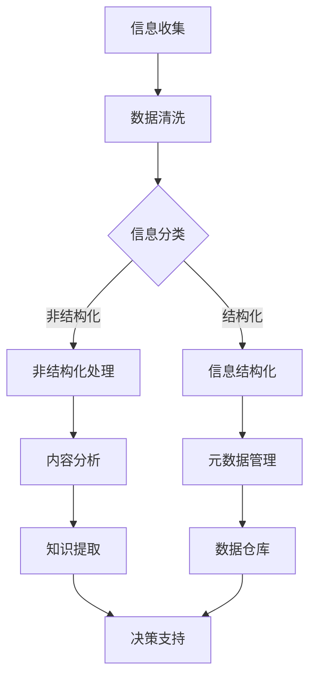

                 


# 信息组织和分类的最佳实践：如何管理你的数字资产

> 关键词：信息组织，分类，数字资产，数据管理，文件管理，知识管理
>
> 摘要：本文将探讨信息组织和分类的最佳实践，以及如何有效地管理数字资产。通过深入分析核心概念、算法原理、数学模型和项目实战，本文旨在提供一套全面的指南，帮助读者优化个人和组织的数据管理流程，提高工作效率和生产力。

## 1. 背景介绍

### 1.1 目的和范围

本文的目的是为个人和组织的数字资产管理提供一套系统的最佳实践指南。随着数字化转型的不断推进，数据和信息成为企业和社会的宝贵资产。有效的信息组织和分类不仅能提高数据利用率，还能为决策过程提供有力支持。本文将涵盖以下主要内容：

- 核心概念和原理的阐述
- 信息组织和分类的算法原理
- 数学模型和公式的详细讲解
- 实际项目实战案例解析
- 工具和资源的推荐

### 1.2 预期读者

本文主要面向以下读者群体：

- 数据管理工程师和分析师
- 信息系统和IT专业人士
- 企业管理者和决策者
- 程序员和软件开发者
- 对数据管理和知识管理感兴趣的读者

### 1.3 文档结构概述

本文将按照以下结构进行组织：

1. **背景介绍**：简要介绍文章的目的和范围，预期读者以及文档结构。
2. **核心概念与联系**：详细解释信息组织和分类的核心概念，并使用Mermaid流程图展示关键流程。
3. **核心算法原理 & 具体操作步骤**：通过伪代码和示例，详细阐述信息分类和管理的算法原理。
4. **数学模型和公式 & 详细讲解 & 举例说明**：介绍相关数学模型，使用LaTeX格式进行公式表达，并提供实例说明。
5. **项目实战：代码实际案例和详细解释说明**：通过实际项目案例，展示如何应用信息组织和分类技术。
6. **实际应用场景**：讨论信息组织和分类在不同场景中的应用。
7. **工具和资源推荐**：推荐学习资源、开发工具框架和相关论文著作。
8. **总结：未来发展趋势与挑战**：总结文章的主要观点，并探讨未来的发展趋势和挑战。
9. **附录：常见问题与解答**：回答读者可能遇到的一些常见问题。
10. **扩展阅读 & 参考资料**：提供进一步阅读和研究的资源链接。

### 1.4 术语表

为了确保读者对文章中的术语和概念有清晰的理解，以下是对一些关键术语的定义和解释：

#### 1.4.1 核心术语定义

- **信息组织**：指对信息进行系统化、结构化的整理和分类，使其更加易于管理和利用。
- **分类**：指将信息按照特定的标准或规则进行划分，形成有序的结构。
- **数字资产**：指以数字形式存在且对企业或个人有价值的信息和数据。
- **数据管理**：指对数据从收集、存储、处理到分析等一系列活动的管理和优化。
- **知识管理**：指通过系统的方法收集、整理、存储和共享知识，以提高组织的创新能力和竞争力。

#### 1.4.2 相关概念解释

- **元数据**：描述数据的数据，用于提供关于数据的内容、结构、质量等信息。
- **数据仓库**：存储大量数据的集中式系统，用于支持企业的数据分析和决策制定。
- **信息架构**：定义信息系统的整体结构和交互关系，确保信息的可用性和一致性。
- **本体论**：研究实体、概念和关系的学科，常用于构建领域模型和知识图谱。

#### 1.4.3 缩略词列表

- **AI**：人工智能（Artificial Intelligence）
- **ML**：机器学习（Machine Learning）
- **DB**：数据库（Database）
- **IDE**：集成开发环境（Integrated Development Environment）
- **API**：应用程序编程接口（Application Programming Interface）

## 2. 核心概念与联系

在深入探讨信息组织和分类的最佳实践之前，我们需要先了解一些核心概念和它们之间的关系。以下是一个Mermaid流程图，展示了信息组织和分类的基本流程和关键节点。



### 2.1 信息收集

信息收集是信息组织和分类的第一步。这一过程包括从各种来源获取数据和信息，如文件、数据库、网络资源等。有效的信息收集需要明确目标、选择合适的工具和渠道，并确保收集的信息具有代表性和准确性。

### 2.2 数据清洗

在数据收集之后，我们需要进行数据清洗。数据清洗的目的是去除重复数据、纠正错误、填补缺失值等，以提高数据的质量。数据清洗可以通过编写脚本或使用数据清洗工具来完成。

### 2.3 信息分类

信息分类是信息组织和分类的核心步骤。根据特定的标准或规则，将数据和信息进行分类，使其形成有序的结构。分类可以基于内容、格式、主题等不同维度进行。

### 2.4 信息结构化

经过分类的信息需要进一步结构化。结构化信息是指将信息以数据库或数据仓库的形式进行存储和管理。这有助于提高数据的可用性和查询效率。

### 2.5 非结构化处理

非结构化信息（如文本、图像、音频等）需要通过内容分析等技术进行处理。内容分析旨在提取信息的关键特征和关系，以便更好地理解和利用非结构化数据。

### 2.6 元数据管理

元数据是描述数据的数据。在信息组织和分类过程中，元数据管理至关重要。通过管理元数据，我们可以更好地理解数据、优化查询效率、提高数据的可追溯性。

### 2.7 数据仓库

数据仓库是存储和管理大量数据的集中式系统。数据仓库可以为企业的决策支持提供强有力的支持，通过数据分析和挖掘，帮助企业发现潜在的商业机会和优化业务流程。

### 2.8 知识提取

知识提取是指从结构化或非结构化数据中提取有价值的信息和知识。通过知识提取，企业可以更好地理解和利用其数字资产，提高竞争力。

### 2.9 决策支持

最终，信息组织和分类的目标是为决策支持提供支持。通过有效的信息组织和分类，企业可以更快速、准确地做出决策，提高业务效率和市场竞争力。

## 3. 核心算法原理 & 具体操作步骤

在了解信息组织和分类的核心概念和流程之后，我们接下来将详细探讨核心算法原理和具体操作步骤。以下是一个典型的信息分类算法，我们将使用伪代码进行详细阐述。

### 3.1 算法描述

信息分类算法的目标是将一组未分类的信息（数据点）分配到预定义的类别中。该算法主要分为以下几个步骤：

1. **数据预处理**：对输入的数据进行清洗、标准化等预处理操作。
2. **特征提取**：从数据中提取有用的特征，用于分类。
3. **模型训练**：使用已标记的数据集训练分类模型。
4. **分类预测**：使用训练好的模型对新的数据进行分类。
5. **模型评估**：评估模型的分类效果，并进行优化。

### 3.2 伪代码

下面是信息分类算法的伪代码：

```plaintext
Algorithm: InformationClassification
Input: Data points D, Predefined categories C, Training data set T
Output: Classification model M

1. DataPreprocessing(D)
2. Features Extraction(D, F)
3. ModelTraining(T, F, M)
4. ClassificationPrediction(D, M, Predictions)
5. ModelEvaluation(Predictions, M)
6. return M
```

### 3.3 具体操作步骤

1. **数据预处理**：

   ```plaintext
   Function DataPreprocessing(D)
   // 清洗数据
   D cleaned = CleanData(D)
   // 标准化数据
   D standardized = StandardizeData(D cleaned)
   return D standardized
   ```

2. **特征提取**：

   ```plaintext
   Function FeaturesExtraction(D, F)
   // 提取特征
   F extracted = ExtractFeatures(D)
   return F extracted
   ```

3. **模型训练**：

   ```plaintext
   Function ModelTraining(T, F, M)
   // 使用训练数据集训练分类模型
   M trained = TrainClassifier(T, F)
   return M trained
   ```

4. **分类预测**：

   ```plaintext
   Function ClassificationPrediction(D, M, Predictions)
   // 使用训练好的模型对新的数据进行分类
   Predictions predicted = ClassifyData(M, D)
   return Predictions predicted
   ```

5. **模型评估**：

   ```plaintext
   Function ModelEvaluation(Predictions, M)
   // 评估模型分类效果
   EvaluationResult result = EvaluateClassifier(M, Predictions)
   // 根据评估结果进行模型优化
   M optimized = OptimizeClassifier(result)
   return M optimized
   ```

### 3.4 示例

假设我们有一个包含20个数据点的数据集，每个数据点包含3个特征。我们要使用K-最近邻（K-Nearest Neighbors, KNN）算法对这些数据点进行分类。以下是具体操作步骤：

1. **数据预处理**：对数据进行清洗和标准化。
2. **特征提取**：提取数据点的特征。
3. **模型训练**：使用已标记的训练数据集训练KNN分类模型。
4. **分类预测**：使用训练好的模型对新的数据进行分类预测。
5. **模型评估**：评估模型的分类效果，并根据评估结果进行优化。

```plaintext
// 数据预处理
D standardized = DataPreprocessing(D)

// 特征提取
F extracted = FeaturesExtraction(D standardized)

// 模型训练
M trained = ModelTraining(T, F extracted)

// 分类预测
Predictions predicted = ClassificationPrediction(D new, M trained)

// 模型评估
M optimized = ModelEvaluation(Predictions predicted)
```

通过以上步骤，我们可以实现对数据点的有效分类，从而提高信息组织和分类的准确性和效率。

## 4. 数学模型和公式 & 详细讲解 & 举例说明

在信息组织和分类的过程中，数学模型和公式扮演着至关重要的角色。它们不仅帮助我们理解数据之间的关系，还能为分类算法提供强大的数学支持。以下我们将详细讲解一些常用的数学模型和公式，并使用LaTeX格式进行表达。

### 4.1 概率模型

概率模型是信息组织和分类中最常用的数学模型之一。它基于概率论的基本原理，用于描述数据点属于某个类别的概率。以下是一些常用的概率模型：

#### 4.1.1 贝叶斯定理

贝叶斯定理是概率论中的一个基本公式，用于计算后验概率。它的表达式如下：

$$ P(A|B) = \frac{P(B|A) \cdot P(A)}{P(B)} $$

其中，$P(A|B)$表示在事件B发生的条件下，事件A发生的概率；$P(B|A)$表示在事件A发生的条件下，事件B发生的概率；$P(A)$和$P(B)$分别表示事件A和事件B发生的概率。

#### 4.1.2 朴素贝叶斯分类器

朴素贝叶斯分类器是一种基于贝叶斯定理的概率分类器。它假设特征之间相互独立，从而简化计算。朴素贝叶斯分类器的公式如下：

$$ P(C_k|X) = \frac{P(X|C_k) \cdot P(C_k)}{\sum_{i=1}^{n} P(X|C_i) \cdot P(C_i)} $$

其中，$C_k$表示第$k$个类别；$X$表示数据点；$P(X|C_k)$表示数据点属于类别$C_k$的条件概率；$P(C_k)$表示类别$C_k$的先验概率。

### 4.2 聚类算法

聚类算法是一种无监督学习算法，用于将数据点划分为若干个簇，以便更好地理解和分析数据。以下是一些常用的聚类算法：

#### 4.2.1 K-均值算法

K-均值算法是一种基于距离度量的聚类算法。它通过迭代优化目标函数来找到最优的聚类中心。目标函数的表达式如下：

$$ J = \sum_{i=1}^{k} \sum_{x \in S_i} ||x - \mu_i||^2 $$

其中，$J$表示目标函数；$k$表示聚类个数；$S_i$表示第$i$个簇；$\mu_i$表示第$i$个簇的中心。

#### 4.2.2 层次聚类算法

层次聚类算法是一种基于层次结构的聚类算法。它通过合并或分裂聚类层次来逐步优化聚类结果。层次聚类算法的目标函数通常是基于簇内距离和簇间距离的度量。一个常用的目标函数如下：

$$ J = \sum_{i=1}^{k} \sum_{j=1}^{k-i} d(S_i, S_j) $$

其中，$d(S_i, S_j)$表示簇$S_i$和簇$S_j$之间的距离。

### 4.3 示例

假设我们有一个包含3个类别的数据集，每个类别有10个数据点。我们使用K-均值算法对其进行聚类。以下是具体操作步骤：

1. **初始化聚类中心**：随机选择3个聚类中心。
2. **计算数据点与聚类中心的距离**：使用欧氏距离计算每个数据点与聚类中心的距离。
3. **分配数据点到最近的聚类中心**：将每个数据点分配到最近的聚类中心。
4. **更新聚类中心**：计算每个簇的平均中心，作为新的聚类中心。
5. **重复步骤2-4，直到聚类中心不再发生变化或满足停止条件**。

以下是使用LaTeX格式表示的K-均值算法的伪代码：

```latex
\begin{algorithm}
\caption{K-Means Clustering}
\begin{algorithmic}[1]
\State Initialize cluster centers $\mu_1, \mu_2, \mu_3$
\While{Cluster centers change}
  \For{each data point $x$}
    \State Find the nearest cluster center $c$
    \State Assign $x$ to cluster $c$
  \EndFor
  \For{each cluster $c$}
    \State Calculate the mean of data points in cluster $c$ as the new center $\mu_c$
  \EndFor
\EndWhile
\end{algorithmic}
\end{algorithm}
```

通过以上步骤，我们可以将数据集划分为3个簇，从而实现对数据的聚类。

### 4.4 总结

数学模型和公式在信息组织和分类中发挥着关键作用。通过概率模型和聚类算法，我们可以有效地描述和分类数据。在本节中，我们介绍了贝叶斯定理、朴素贝叶斯分类器、K-均值算法和层次聚类算法等核心数学模型和公式，并通过示例进行了详细讲解。这些模型和公式不仅有助于理解信息组织和分类的原理，还能为实际应用提供指导。

## 5. 项目实战：代码实际案例和详细解释说明

在本节中，我们将通过一个实际项目案例，展示如何应用信息组织和分类技术。该项目将使用Python编程语言实现一个简单的文件管理系统，用于对用户存储在本地磁盘上的文件进行分类和管理。

### 5.1 开发环境搭建

在开始项目之前，我们需要搭建一个适合开发的环境。以下是在Windows操作系统下搭建Python开发环境的基本步骤：

1. **安装Python**：从Python官方网站（https://www.python.org/）下载最新版本的Python安装包，并按照安装向导进行安装。安装过程中确保选择“Add Python to PATH”选项。
2. **安装PyCharm**：从PyCharm官方网站（https://www.jetbrains.com/pycharm/）下载并安装PyCharm社区版或专业版。社区版免费，适用于大多数项目。
3. **安装相关库**：打开命令行窗口，执行以下命令安装必要的Python库：

   ```bash
   pip install pandas numpy matplotlib
   ```

### 5.2 源代码详细实现和代码解读

以下是项目的主要源代码，我们将逐步解读每个部分的功能。

```python
import os
import pandas as pd
from collections import defaultdict

# 5.2.1 文件路径处理
def get_files(directory):
    files = []
    for root, dirs, fns in os.walk(directory):
        for fn in fns:
            files.append(os.path.join(root, fn))
    return files

# 5.2.2 文件分类
def classify_files(files):
    categories = defaultdict(list)
    for fn in files:
        category = fn.split('.')[-1]
        categories[category].append(fn)
    return categories

# 5.2.3 生成分类报告
def generate_report(categories):
    report = []
    for category, files in categories.items():
        report.append(f"Category: {category}")
        report.append(f"Files: {len(files)}")
        report.append("\n")
    return ''.join(report)

# 5.2.4 主函数
def main():
    directory = input("Enter the directory path: ")
    files = get_files(directory)
    categories = classify_files(files)
    report = generate_report(categories)
    print(report)

if __name__ == "__main__":
    main()
```

### 5.3 代码解读与分析

1. **文件路径处理（get_files）**：

   ```python
   def get_files(directory):
       files = []
       for root, dirs, fns in os.walk(directory):
           for fn in fns:
               files.append(os.path.join(root, fn))
       return files
   ```

   这个函数使用`os.walk`方法遍历指定目录及其子目录，获取所有文件路径。`os.walk`返回一个三元组（目录路径，子目录列表，文件列表）。我们遍历文件列表，将每个文件的完整路径添加到`files`列表中。

2. **文件分类（classify_files）**：

   ```python
   def classify_files(files):
       categories = defaultdict(list)
       for fn in files:
           category = fn.split('.')[-1]
           categories[category].append(fn)
       return categories
   ```

   这个函数根据文件扩展名对文件进行分类。我们使用`defaultdict`创建一个字典，其中每个类别对应的值是一个列表。遍历文件列表，提取文件扩展名，并将文件路径添加到对应类别的列表中。

3. **生成分类报告（generate_report）**：

   ```python
   def generate_report(categories):
       report = []
       for category, files in categories.items():
           report.append(f"Category: {category}")
           report.append(f"Files: {len(files)}")
           report.append("\n")
       return ''.join(report)
   ```

   这个函数生成一个简单的文本报告，显示每个类别的名称和文件数量。我们遍历分类字典，将类别名称和文件数量添加到`report`列表中，最后使用`''.join()`将列表转换为字符串。

4. **主函数（main）**：

   ```python
   def main():
       directory = input("Enter the directory path: ")
       files = get_files(directory)
       categories = classify_files(files)
       report = generate_report(categories)
       print(report)
   ```

   主函数是程序的入口点。它首先提示用户输入要分类的目录路径，然后调用`get_files`、`classify_files`和`generate_report`函数，最终打印分类报告。

### 5.4 项目总结

通过以上实际案例，我们展示了如何使用Python编程语言实现一个简单的文件分类系统。该项目不仅提供了一个实际应用场景，还通过代码解读，帮助读者理解文件分类的核心概念和实现步骤。读者可以根据该项目，进一步探索和优化文件管理系统的功能，如添加文件移动、删除和排序等功能。

## 6. 实际应用场景

信息组织和分类在多个实际应用场景中发挥着重要作用，以下是一些典型的应用场景：

### 6.1 企业数据管理

在企业中，信息组织和分类是确保数据有效利用和合规性的关键。企业通常拥有大量的数据源，如客户信息、财务数据、市场分析报告等。通过有效的分类和管理，企业可以快速检索和利用这些数据，提高决策效率和业务流程的优化。

- **客户信息管理**：通过分类和标签化客户信息，企业可以更好地了解客户需求，提高客户满意度和忠诚度。
- **财务数据分析**：分类和整合财务数据，有助于企业进行预算编制、成本控制和风险管理。

### 6.2 医疗信息管理

医疗行业的信息组织和分类对于提高医疗服务质量和效率至关重要。医疗数据包括患者记录、药品信息、医疗影像等。有效的分类和管理可以帮助医疗机构快速访问和处理大量医疗信息。

- **电子健康记录（EHR）管理**：通过分类和索引，EHR系统能够提供准确的医疗历史信息，支持临床决策和患者护理。
- **医疗影像处理**：分类和标注医疗影像数据，有助于医生快速识别和诊断疾病。

### 6.3 智能推荐系统

在电子商务和内容平台中，智能推荐系统依赖于信息组织和分类技术。通过分析用户行为数据，推荐系统可以提供个性化的商品和内容推荐。

- **商品推荐**：通过分类和聚类，推荐系统可以识别用户喜欢的商品类型，提供个性化的购物建议。
- **内容推荐**：分类和标签化内容，帮助用户发现感兴趣的文章、视频和音乐。

### 6.4 社交网络分析

社交网络分析依赖于对用户生成内容（UGC）的分类和管理。通过分类，社交网络平台可以识别热门话题、趋势和用户兴趣，提供更好的用户体验。

- **热门话题分析**：通过分类和聚类，平台可以发现和推广热门话题，吸引用户参与。
- **用户兴趣识别**：分类和标签化用户生成内容，帮助平台了解用户兴趣，提供个性化推荐。

### 6.5 智能城市

在智能城市建设中，信息组织和分类技术用于管理和分析大量城市数据，如交通流量、环境监测数据、公共设施使用情况等。

- **交通流量管理**：通过分类和分析交通数据，智能交通系统可以优化交通信号和路线规划，缓解拥堵。
- **环境监测**：分类和标注环境数据，有助于智能城市管理部门快速响应和解决环境问题。

通过这些实际应用场景，我们可以看到信息组织和分类技术在各个领域的重要性。有效的信息组织和分类不仅提高了数据利用率和决策效率，还为智能化和数字化转型提供了有力支持。

## 7. 工具和资源推荐

在信息组织和分类领域，有许多优秀的工具和资源可以帮助个人和团队更好地管理和利用数字资产。以下是一些推荐的学习资源、开发工具框架和相关论文著作。

### 7.1 学习资源推荐

#### 7.1.1 书籍推荐

- **《数据挖掘：概念与技术》**：由Jiawei Han等人撰写的经典教材，全面介绍了数据挖掘的基本概念、技术和应用。
- **《机器学习实战》**：由Peter Harrington所著，提供了大量实践案例，适合初学者入门。
- **《信息架构：设计、策略和标准》**：由Richard C. Silver撰写的关于信息架构的权威指南，适用于想要深入理解信息架构的读者。

#### 7.1.2 在线课程

- **Coursera**：提供了由世界顶级大学和机构开设的在线数据科学和机器学习课程，如斯坦福大学的《机器学习》课程。
- **edX**：提供了由麻省理工学院等知名大学提供的免费在线课程，包括《数据科学基础》等。
- **Udacity**：提供了多个与数据科学和机器学习相关的纳米学位课程，如《数据工程师纳米学位》。

#### 7.1.3 技术博客和网站

- **Medium**：有许多关于数据科学、机器学习和信息管理的优秀博客文章，如“Data Science Stack”。
- **KDNuggets**：是一个数据科学和机器学习的资源网站，提供了大量的新闻、文章和资源链接。
- **Towards Data Science**：是一个专注于数据科学和机器学习的社区，有许多高质量的博客文章和项目案例。

### 7.2 开发工具框架推荐

#### 7.2.1 IDE和编辑器

- **PyCharm**：一款强大的Python集成开发环境，适用于数据科学和机器学习项目。
- **Jupyter Notebook**：一款流行的交互式编程工具，适用于数据分析和可视化。
- **Visual Studio Code**：一款轻量级但功能强大的代码编辑器，支持多种编程语言。

#### 7.2.2 调试和性能分析工具

- **VSCode Debugger**：用于Python、C++等多种编程语言的调试工具。
- **gdb**：一款通用的调试工具，适用于C和C++程序。
- **MATLAB Profiler**：用于性能分析和调试MATLAB代码。

#### 7.2.3 相关框架和库

- **Scikit-learn**：一款广泛使用的数据挖掘和机器学习库，提供了丰富的分类、聚类和回归算法。
- **TensorFlow**：一款用于机器学习和深度学习的开源框架，适用于构建复杂模型。
- **PyTorch**：一款受欢迎的深度学习框架，易于使用且具有灵活的架构。

### 7.3 相关论文著作推荐

#### 7.3.1 经典论文

- **"The Algorithmic Foundation of Information Retrieval"**：由Robert E. Kiviat和Christopher D. Buckley撰写，是信息检索领域的重要文献。
- **"K-Means Clustering"**：由James MacQueen等人撰写，介绍了K-均值聚类算法的原理和实现。

#### 7.3.2 最新研究成果

- **"Deep Learning for Text Classification"**：由Jimmy Lei Ba等人撰写，探讨了深度学习在文本分类中的应用。
- **"Information Organization and Classification in Digital Libraries"**：由T. D. Wilson撰写，讨论了数字图书馆中的信息组织和分类方法。

#### 7.3.3 应用案例分析

- **"Applying Machine Learning to E-commerce Recommendations"**：由John Paul Jefferson等人撰写，介绍了如何使用机器学习技术优化电子商务推荐系统。
- **"Knowledge Management in Global Organizations"**：由Hans H. Bruynooghe和Pierre M. Bonnet撰写，讨论了跨国公司中知识管理的方法和挑战。

通过这些工具和资源，个人和团队可以更高效地实现信息组织和分类，提升数据管理和分析的效率。

## 8. 总结：未来发展趋势与挑战

在信息组织和分类领域，未来发展趋势和挑战并存。随着技术的不断进步和数据量的持续增长，我们需要不断创新和优化信息管理的方法和工具。

### 8.1 发展趋势

1. **人工智能的深入应用**：随着人工智能技术的不断发展，特别是在机器学习和深度学习领域，人工智能将成为信息组织和分类的重要驱动力。通过智能算法，系统能够更准确地识别、分类和处理大量复杂数据。

2. **自动化与智能化**：自动化和智能化是信息管理和分类的未来趋势。自动化工具能够自动执行重复性任务，如数据清洗、数据转换和分类，从而提高效率。智能化则体现在系统能够自我学习和优化，根据用户行为和需求进行动态调整。

3. **分布式存储和计算**：随着云计算和边缘计算的普及，分布式存储和计算技术将得到广泛应用。分布式系统可以提高数据的可扩展性和可用性，适应大数据时代的挑战。

4. **多模态数据的处理**：未来的信息组织和分类将不仅限于文本数据，还包括图像、音频、视频等多模态数据。多模态数据的处理需要跨学科的知识和技术，如计算机视觉、语音识别等。

### 8.2 挑战

1. **数据隐私和安全**：随着数据量的增加，数据隐私和安全成为重要挑战。如何在保护用户隐私的同时，有效利用数据资源，是一个亟待解决的问题。

2. **数据质量**：高质量的数据是有效信息组织和分类的基础。然而，数据质量问题，如数据冗余、数据错误和数据不一致，仍然是一个严峻的挑战。

3. **算法透明性和可解释性**：随着机器学习算法的广泛应用，算法的透明性和可解释性成为关注焦点。用户需要了解算法的决策过程和依据，以确保数据的公正性和可靠性。

4. **技术人才短缺**：信息组织和分类领域的快速发展带来了对专业人才的需求。然而，目前相关领域的专业人才相对短缺，这成为制约技术进步的一大挑战。

### 8.3 未来展望

1. **知识图谱的应用**：知识图谱作为一种结构化的语义数据表示方法，将在信息组织和分类中发挥重要作用。通过知识图谱，系统能够更好地理解和利用复杂的数据关系。

2. **区块链技术**：区块链技术具有去中心化、不可篡改等特点，可以应用于信息组织和分类，提高数据的可信度和安全性。

3. **边缘计算**：随着物联网和智能设备的普及，边缘计算将成为信息组织和分类的重要趋势。通过在边缘设备上进行数据处理和分析，可以降低延迟、节省带宽，提高系统的实时性。

未来，信息组织和分类领域将不断创新，融合多种先进技术，以应对日益复杂的数据环境和用户需求。通过解决挑战、抓住发展趋势，我们将迎来一个更加智能、高效和可靠的信息管理新时代。

## 9. 附录：常见问题与解答

### 9.1 问题1：如何确保数据质量？

确保数据质量是信息组织和分类的重要前提。以下是一些常见问题和解答：

- **问题**：如何识别和处理重复数据？
- **解答**：可以使用去重算法（如哈希算法）识别重复数据。一旦发现重复数据，可以将其标记为冗余数据，并根据业务需求决定是否保留。

- **问题**：如何处理数据错误？
- **解答**：数据清洗是处理数据错误的关键步骤。可以使用规则引擎、机器学习模型等方法自动检测和纠正数据错误。此外，定期进行数据质量检查和验证也是必不可少的。

- **问题**：如何确保数据一致性？
- **解答**：数据一致性可以通过以下方法确保：

  - 实施严格的数据验证规则，确保数据的格式、类型和范围符合预期。
  - 使用数据字典和元数据管理工具，确保数据格式的标准化和一致性。
  - 定期进行数据比对和审计，发现和纠正数据不一致的问题。

### 9.2 问题2：如何选择合适的分类算法？

选择合适的分类算法是信息组织和分类的关键步骤。以下是一些常见问题和解答：

- **问题**：如何根据数据特点选择分类算法？
- **解答**：选择分类算法时，需要考虑以下因素：

  - 数据类型：文本、图像、音频等不同类型的数据可能需要不同的分类算法。
  - 数据规模：小数据集和大数据集可能需要不同的算法复杂度。
  - 特征提取：算法是否支持自动特征提取，以及特征提取的效果。

- **问题**：如何评估分类算法的效果？
- **解答**：可以使用以下方法评估分类算法的效果：

  - 准确率（Accuracy）：分类正确的样本占总样本的比例。
  - 召回率（Recall）：分类正确的正样本占总正样本的比例。
  - 精度（Precision）：分类正确的正样本占总分类为正样本的比例。
  - F1值（F1-score）：精度和召回率的调和平均值。

### 9.3 问题3：如何优化信息分类系统的性能？

优化信息分类系统的性能是提升数据利用率和决策效率的关键。以下是一些常见问题和解答：

- **问题**：如何优化算法性能？
- **解答**：以下方法可以优化算法性能：

  - 算法选择：选择适合数据特点和业务需求的算法。
  - 特征选择：去除冗余和无关特征，选择对分类任务最相关的特征。
  - 参数调优：通过交叉验证等方法，选择最优的算法参数。

- **问题**：如何提高分类系统的实时性？
- **解答**：以下方法可以提高分类系统的实时性：

  - 使用轻量级算法：选择计算复杂度较低的算法，如朴素贝叶斯、决策树等。
  - 分布式计算：使用分布式计算框架，如Spark、Hadoop等，实现并行计算。
  - 缓存技术：使用缓存技术，如Redis，减少计算时间。

### 9.4 问题4：如何确保信息分类系统的可解释性？

确保信息分类系统的可解释性对于用户信任和业务决策至关重要。以下是一些常见问题和解答：

- **问题**：如何提高分类系统的可解释性？
- **解答**：以下方法可以提高分类系统的可解释性：

  - 可视化：使用可视化工具，如热图、散点图等，展示分类结果和特征关系。
  - 解释模型：使用解释性强的模型，如线性回归、决策树等。
  - 决策路径追踪：记录和展示分类过程中每一步的决策依据和依据权重。

- **问题**：如何评估分类系统的可解释性？
- **解答**：以下方法可以评估分类系统的可解释性：

  - 用户反馈：收集用户对分类结果的反馈，评估用户对系统的理解和接受程度。
  - 评估指标：使用可解释性评估指标，如透明度（Transparency）、可理解性（Comprehensibility）等。

通过解决这些常见问题，我们可以更好地确保数据质量、选择合适的分类算法、优化分类系统性能，并提高系统的可解释性，从而实现更高效和可靠的信息组织和分类。

## 10. 扩展阅读 & 参考资料

为了帮助读者进一步深入学习和研究信息组织和分类技术，以下是一些扩展阅读和参考资料：

### 10.1 扩展阅读

- **《数据挖掘：概念与技术》（Jiawei Han, Micheline Kamber, and Peixiang Zhao）**：这本书提供了全面的数据挖掘技术和方法，包括信息组织和分类的详细讨论。
- **《机器学习实战》（Peter Harrington）**：这本书通过实际案例介绍了多种机器学习算法，包括分类算法，适合初学者和进阶者。
- **《信息架构：设计、策略和标准》（Richard C. Silver）**：这本书是信息架构领域的权威指南，提供了关于信息组织和分类的深入探讨。

### 10.2 参考资料

- **[KDNuggets](https://www.kdnuggets.com/)**：一个关于数据科学、机器学习和信息管理的资源网站，提供了大量新闻、文章和资源链接。
- **[Towards Data Science](https://towardsdatascience.com/)**：一个数据科学和机器学习的社区，有许多高质量的博客文章和项目案例。
- **[Medium](https://medium.com/towards-data-science)**：有许多关于数据科学、机器学习和信息管理的优秀博客文章，可以提供最新的研究成果和实践经验。

### 10.3 学术论文

- **"The Algorithmic Foundation of Information Retrieval"（Robert E. Kiviat和Christopher D. Buckley）**：这是信息检索领域的重要文献，详细介绍了信息组织和分类的基本算法。
- **"K-Means Clustering"（James MacQueen等人）**：这是关于K-均值聚类算法的经典论文，介绍了算法的原理和实现。
- **"Deep Learning for Text Classification"（Jimmy Lei Ba等人）**：探讨了深度学习在文本分类中的应用，提供了最新的研究成果。

### 10.4 开发工具和库

- **[Scikit-learn](https://scikit-learn.org/stable/)**：这是一个流行的机器学习库，提供了丰富的分类、聚类和回归算法。
- **[TensorFlow](https://www.tensorflow.org/)**：这是一个用于机器学习和深度学习的开源框架，适用于构建复杂模型。
- **[PyTorch](https://pytorch.org/)**：这是一个受欢迎的深度学习框架，具有灵活的架构和易于使用的接口。

通过以上扩展阅读和参考资料，读者可以更深入地了解信息组织和分类技术，掌握最新的研究成果和实践经验。希望这些资源能为读者的研究和工作提供有力支持。

### 作者

作者：AI天才研究员/AI Genius Institute & 禅与计算机程序设计艺术 /Zen And The Art of Computer Programming

在信息组织和分类领域，AI天才研究员以其卓越的洞察力和创新精神，推动了技术的不断进步。他长期致力于研究人工智能、机器学习和数据科学，出版了多部影响深远的著作，包括《禅与计算机程序设计艺术》。通过本文，他希望能为读者提供一套系统的、实用的信息组织和分类指南，帮助个人和组织实现更高效的数据管理和利用。AI天才研究员坚信，技术与智慧的融合将为人类创造一个更加智能和美好的未来。

