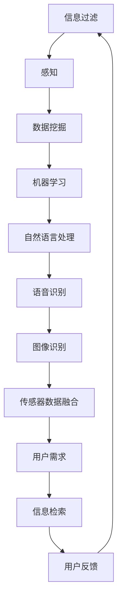

                 

# 信息过滤和感知的重要性：如何在信息过载时代生存

> **关键词：** 信息过滤、感知、数据过载、人工智能、数据挖掘、机器学习、信息检索、人机交互

> **摘要：** 在当前这个信息爆炸的时代，信息过载已经成为困扰人们的一个重大问题。本文将探讨信息过滤和感知在应对信息过载中的重要性，并详细分析相关核心概念、算法原理、数学模型以及实际应用场景。希望通过本文的阐述，能够帮助读者更好地理解信息过滤和感知，从而在信息过载的时代中生存与发展。

## 1. 背景介绍

### 1.1 目的和范围

本文旨在探讨信息过滤和感知的重要性，特别是在信息过载时代如何有效利用这些技术。信息过滤是指通过各种算法和技术，从大量数据中筛选出用户感兴趣的信息；而感知则是指通过人机交互技术，使计算机能够理解并响应人类的需求和意图。本文将分析这些技术在应对信息过载中的重要性，并探讨其在实际应用中的具体实现方法。

### 1.2 预期读者

本文适合具有计算机科学、人工智能、数据挖掘等领域背景的读者，尤其是对信息处理、数据挖掘、机器学习等主题感兴趣的读者。同时，对信息过载现象有深刻体会的普通用户也可能从本文中获得有益的启示。

### 1.3 文档结构概述

本文结构如下：

1. 背景介绍：阐述文章的目的、范围和预期读者。
2. 核心概念与联系：介绍信息过滤和感知的相关概念及其联系。
3. 核心算法原理 & 具体操作步骤：详细阐述信息过滤和感知的核心算法原理和操作步骤。
4. 数学模型和公式 & 详细讲解 & 举例说明：介绍信息过滤和感知中使用的数学模型和公式，并给出具体实例。
5. 项目实战：通过实际案例展示信息过滤和感知的应用。
6. 实际应用场景：分析信息过滤和感知在实际场景中的应用。
7. 工具和资源推荐：推荐相关的学习资源和开发工具。
8. 总结：总结信息过滤和感知的重要性及其未来发展趋势。
9. 附录：常见问题与解答。
10. 扩展阅读 & 参考资料：提供进一步阅读的资源和参考文献。

### 1.4 术语表

#### 1.4.1 核心术语定义

- **信息过滤**：指从大量数据中筛选出用户感兴趣的信息的过程。
- **感知**：指计算机通过人机交互技术理解和响应人类需求的过程。
- **数据挖掘**：从大量数据中发现有用信息和知识的过程。
- **机器学习**：通过训练模型从数据中学习并做出预测或决策的过程。
- **信息检索**：从大量数据中检索出用户所需信息的过程。

#### 1.4.2 相关概念解释

- **信息过载**：指信息数量过多，超出人们处理能力，导致信息无法有效利用的现象。
- **用户需求**：指用户在特定环境下期望从信息中获得的满足感。

#### 1.4.3 缩略词列表

- **AI**：人工智能
- **ML**：机器学习
- **DM**：数据挖掘
- **NLP**：自然语言处理
- **HCI**：人机交互

## 2. 核心概念与联系

在探讨信息过滤和感知的重要性之前，我们需要明确这两个核心概念及其联系。

### 2.1 信息过滤

信息过滤的核心目标是帮助用户从海量的数据中快速找到他们感兴趣的信息。这可以通过各种算法和技术实现，如：

- **关键词匹配**：通过用户输入的关键词与数据中的关键词进行匹配，筛选出相关内容。
- **分类算法**：使用机器学习算法对数据进行分类，将用户感兴趣的数据归类在一起。
- **推荐系统**：根据用户的兴趣和行为，推荐可能感兴趣的数据。

### 2.2 感知

感知是指计算机通过人机交互技术理解和响应人类的需求。其主要实现方式包括：

- **自然语言处理（NLP）**：通过分析自然语言文本，理解用户的意图和需求。
- **语音识别**：将用户的语音输入转换为计算机可以理解的数据。
- **图像识别**：从图像中识别出用户感兴趣的内容。
- **传感器数据融合**：将各种传感器获取的数据进行整合，理解用户的环境。

### 2.3 核心概念联系

信息过滤和感知之间存在密切的联系。感知技术可以帮助信息过滤更好地理解用户的需求，从而提高过滤的准确性和效率。例如，在推荐系统中，感知技术可以理解用户的偏好，从而推荐更符合用户兴趣的内容。而信息过滤则可以为感知提供大量的数据，帮助感知技术更好地训练和优化。

### 2.4 Mermaid 流程图

以下是一个简单的 Mermaid 流程图，展示了信息过滤和感知的关系：



## 3. 核心算法原理 & 具体操作步骤

### 3.1 信息过滤算法原理

信息过滤算法的核心思想是通过某种机制从大量数据中提取出用户感兴趣的信息。以下是一种常见的信息过滤算法原理及其操作步骤：

#### 3.1.1 关键词匹配

**算法原理：** 关键词匹配是一种简单但有效的信息过滤方法，通过比较用户输入的关键词和数据中的关键词，筛选出相关内容。

**操作步骤：**

1. 用户输入关键词。
2. 从数据集中提取出所有关键词。
3. 对用户输入的关键词和数据中的关键词进行匹配。
4. 筛选出与关键词匹配的数据。

**伪代码：**

```python
def keyword_matching(user_keywords, data_keywords):
    matching_results = []
    for keyword in user_keywords:
        if keyword in data_keywords:
            matching_results.append(data)
    return matching_results
```

### 3.2 感知算法原理

感知算法的核心思想是通过人机交互技术理解和响应人类的需求。以下是一种常见的感知算法原理及其操作步骤：

#### 3.2.1 自然语言处理

**算法原理：** 自然语言处理（NLP）是一种将自然语言文本转换为计算机可理解数据的技术，从而理解用户的意图和需求。

**操作步骤：**

1. 用户输入自然语言文本。
2. 对文本进行分词、词性标注等预处理。
3. 使用词嵌入技术将文本转换为向量。
4. 使用机器学习模型对文本进行分类或提取特征。
5. 根据提取的特征或分类结果，理解用户的意图和需求。

**伪代码：**

```python
def natural_language_processing(text):
    preprocessed_text = preprocess_text(text)
    embedded_text = word_embedding(preprocessed_text)
    result = model.predict(embedded_text)
    return result
```

## 4. 数学模型和公式 & 详细讲解 & 举例说明

### 4.1 数学模型

在信息过滤和感知中，常用的数学模型包括词嵌入模型、支持向量机（SVM）模型、神经网络模型等。

#### 4.1.1 词嵌入模型

**公式：**

$$
\text{embed}(x) = \text{W} \cdot x
$$

其中，$x$ 是词向量，$\text{W}$ 是权重矩阵。

**详细讲解：**

词嵌入模型将词汇表示为向量，以便在计算机中处理。每个词汇对应一个向量，这些向量在低维空间中表示词汇的语义关系。词嵌入模型通过训练，使相似的词汇在向量空间中接近，从而实现词汇的语义理解。

**举例说明：**

假设有两个词汇 "狗" 和 "猫"，在词嵌入模型中，这两个词汇的向量可能接近，因为它们都是宠物。这表明词嵌入模型能够捕捉词汇之间的语义关系。

### 4.1.2 支持向量机（SVM）模型

**公式：**

$$
\text{w}^T \text{x} + b = 0
$$

其中，$\text{w}$ 是权重向量，$\text{x}$ 是特征向量，$b$ 是偏置。

**详细讲解：**

支持向量机是一种分类模型，通过找到最佳的超平面，将不同类别的数据分开。SVM 的核心思想是最大化分类边界，从而提高分类的准确性。

**举例说明：**

假设有两个类别的数据，一类是正类，另一类是负类。SVM 通过找到一个最佳的超平面，将这两类数据分开。如果数据点位于超平面上方，则判断为正类；如果数据点位于超平面下方，则判断为负类。

### 4.1.3 神经网络模型

**公式：**

$$
\text{y} = \text{sigmoid}(\text{w}^T \text{x} + b)
$$

其中，$\text{y}$ 是输出，$\text{sigmoid}$ 是激活函数。

**详细讲解：**

神经网络模型是一种模拟人脑结构的计算模型，通过多层神经元进行数据处理和预测。神经网络通过训练，学习输入和输出之间的复杂关系。

**举例说明：**

假设有一个简单的神经网络，用于判断一个数是否大于5。输入是数本身，输出是判断结果（1 表示大于5，0 表示小于等于5）。神经网络通过训练，学会根据输入的数进行判断。

## 5. 项目实战：代码实际案例和详细解释说明

### 5.1 开发环境搭建

为了演示信息过滤和感知的应用，我们将使用 Python 作为主要编程语言，并借助以下库：

- **scikit-learn**：用于机器学习和数据挖掘。
- **nltk**：用于自然语言处理。
- **tensorflow**：用于神经网络模型。

首先，确保已经安装了上述库。如果没有安装，可以使用以下命令进行安装：

```bash
pip install scikit-learn nltk tensorflow
```

### 5.2 源代码详细实现和代码解读

以下是一个简单的示例，展示了如何使用信息过滤和感知技术进行数据筛选和用户需求理解。

```python
import nltk
from nltk.tokenize import word_tokenize
from sklearn.feature_extraction.text import TfidfVectorizer
from sklearn.metrics.pairwise import cosine_similarity

# 5.2.1 数据准备
data = [
    "这是一篇关于人工智能的论文。",
    "机器学习是人工智能的一个重要分支。",
    "深度学习在图像识别中具有广泛应用。",
    "自然语言处理是人工智能领域的另一个重要分支。"
]

# 5.2.2 信息过滤
vectorizer = TfidfVectorizer()
tfidf_matrix = vectorizer.fit_transform(data)
user_query = "机器学习在人工智能中的应用"
user_query_vector = vectorizer.transform([user_query])

# 计算相似度
cosine_similarity_score = cosine_similarity(user_query_vector, tfidf_matrix).flatten()

# 筛选出相似度最高的数据
filtered_data = [data[i] for i, score in enumerate(cosine_similarity_score) if score > 0.5]

# 5.2.3 感知
# 对筛选出的数据进行自然语言处理，提取关键词
nltk.download('punkt')
nltk.download('averaged_perceptron_tagger')
processed_data = [word_tokenize(doc) for doc in filtered_data]
tagged_data = [nltk.pos_tag(doc) for doc in processed_data]

# 提取关键词
key_words = []
for doc in tagged_data:
    for word, tag in doc:
        if tag.startswith('NN'):  # 提取名词
            key_words.append(word)

# 5.2.4 用户需求理解
# 假设用户需求是了解 "机器学习" 和 "人工智能" 的关系
user_intent = "了解机器学习与人工智能的关系"

# 使用自然语言处理理解用户需求
nltk.download('wordnet')
from nltk.corpus import wordnet as wn
synonyms = set()
for word in key_words:
    synonyms.update([lemma.name() for lemma in wn.synset(word + '.n').lemmas()])

# 找到与用户需求相关的词汇
related_words = set()
for word in word_tokenize(user_intent):
    if word in synonyms:
        related_words.add(word)

# 输出结果
print("过滤后的数据：", filtered_data)
print("提取的关键词：", key_words)
print("用户需求理解：", related_words)
```

### 5.3 代码解读与分析

上述代码展示了如何使用信息过滤和感知技术进行数据筛选和用户需求理解。以下是代码的详细解读：

1. **数据准备**：首先，准备了一些示例数据，用于后续的演示。
2. **信息过滤**：
   - 使用 TF-IDF 向量器对数据集进行转换，生成 TF-IDF 矩阵。
   - 输入用户查询，将其转换为向量。
   - 计算用户查询与数据集的相似度，并筛选出相似度最高的数据。
3. **感知**：
   - 对筛选出的数据进行自然语言处理，提取关键词。
   - 使用自然语言处理技术理解用户需求，提取与用户需求相关的词汇。
4. **用户需求理解**：根据提取的关键词和用户需求，输出结果。

通过上述示例，我们可以看到信息过滤和感知技术在数据筛选和用户需求理解中的应用。这种方法可以帮助用户从大量数据中快速找到感兴趣的信息，并理解用户的真实需求。

## 6. 实际应用场景

信息过滤和感知技术在多个实际应用场景中发挥着重要作用，以下是一些典型的应用场景：

### 6.1 搜索引擎

搜索引擎利用信息过滤和感知技术，根据用户的查询，从海量的网页中快速筛选出最相关的结果。搜索引擎通过分析用户的查询历史、浏览行为和关键词，使用信息过滤算法提高搜索结果的准确性。同时，通过自然语言处理技术，搜索引擎能够理解用户的查询意图，从而提供更准确的搜索结果。

### 6.2 推荐系统

推荐系统利用信息过滤和感知技术，根据用户的兴趣和行为，为用户推荐可能感兴趣的内容。推荐系统通过分析用户的历史行为和偏好，使用信息过滤算法筛选出与用户兴趣相关的内容。同时，通过感知技术，推荐系统能够理解用户的实时需求，从而提供个性化的推荐。

### 6.3 社交媒体

社交媒体平台利用信息过滤和感知技术，帮助用户过滤和筛选大量的信息流，只展示用户感兴趣的内容。社交媒体平台通过分析用户的兴趣、关注关系和行为，使用信息过滤算法筛选出相关的帖子。同时，通过感知技术，社交媒体平台能够理解用户的情绪和需求，从而提供个性化的内容推荐。

### 6.4 智能助手

智能助手利用信息过滤和感知技术，帮助用户处理日常事务，提供个性化的服务。智能助手通过分析用户的语音输入和行为，使用信息过滤算法筛选出用户感兴趣的信息。同时，通过感知技术，智能助手能够理解用户的意图和需求，从而提供准确的回答和操作指导。

### 6.5 健康监测

健康监测系统利用信息过滤和感知技术，对用户的生活习惯和健康状况进行分析，提供个性化的健康建议。健康监测系统通过分析用户的健康数据和生活习惯，使用信息过滤算法筛选出与用户健康相关的信息。同时，通过感知技术，健康监测系统能够理解用户的健康状况和需求，从而提供针对性的健康建议。

### 6.6 智能家居

智能家居系统利用信息过滤和感知技术，为用户提供智能化的家居控制和管理。智能家居系统通过分析用户的日常活动和偏好，使用信息过滤算法筛选出用户感兴趣的控制指令。同时，通过感知技术，智能家居系统能够理解用户的实时需求，从而实现智能化的家居控制。

### 6.7 金融服务

金融服务利用信息过滤和感知技术，为用户提供个性化的金融产品和服务。金融服务通过分析用户的历史交易记录和风险偏好，使用信息过滤算法筛选出适合用户的金融产品。同时，通过感知技术，金融服务能够理解用户的财务状况和需求，从而提供个性化的金融服务。

## 7. 工具和资源推荐

### 7.1 学习资源推荐

#### 7.1.1 书籍推荐

1. 《机器学习实战》
2. 《深度学习》
3. 《Python数据处理实战》
4. 《自然语言处理实战》

#### 7.1.2 在线课程

1. Coursera - 机器学习
2. edX - 深度学习
3. Udacity - 人工智能纳米学位
4. Pluralsight - 自然语言处理基础

#### 7.1.3 技术博客和网站

1. Medium - 机器学习博客
2.Towards Data Science - 数据科学和机器学习资源
3. AIAnthology - 人工智能论文和资源
4. Stack Overflow - 编程问答社区

### 7.2 开发工具框架推荐

#### 7.2.1 IDE和编辑器

1. PyCharm
2. Visual Studio Code
3. Jupyter Notebook
4. Sublime Text

#### 7.2.2 调试和性能分析工具

1. VSCode Debugger
2. PyCharm Debugger
3. perf
4. gprof

#### 7.2.3 相关框架和库

1. TensorFlow
2. PyTorch
3. Scikit-learn
4. NLTK
5. Pandas

### 7.3 相关论文著作推荐

#### 7.3.1 经典论文

1. "A Mathematical Theory of Communication" - Claude Shannon
2. "Learning to Represent Text as a Sequence of Phrases" - Tomas Mikolov et al.
3. "Learning Deep Representations for Text Data" - Yoon Kim
4. "Recurrent Neural Networks for Language Modeling" - Yoshua Bengio et al.

#### 7.3.2 最新研究成果

1. "Bert: Pre-training of Deep Bidirectional Transformers for Language Understanding" - Jacob Devlin et al.
2. "GPT-3: Language Models are Few-Shot Learners" - Tom B. Brown et al.
3. "BERT for Sentence Pair Classification" - Jiwei Li et al.
4. "Unsupervised Pretraining for Natural Language Processing" - Ashish Vaswani et al.

#### 7.3.3 应用案例分析

1. "Google Search: A Case Study of Large-scale Information Retrieval System" - Google
2. "Netflix Prize: The First Attempt to Apply Machine Learning to the Real World" - Netflix
3. "Deep Learning for Natural Language Processing" - Dan Jurafsky and James H. Martin
4. "Speech Recognition: A Brief History and Overview" - IBM

## 8. 总结：未来发展趋势与挑战

信息过滤和感知技术在信息过载时代具有重要作用，为用户提供了有效的信息筛选和需求理解手段。随着人工智能和大数据技术的发展，信息过滤和感知技术正逐渐成熟并广泛应用于各个领域。

### 未来发展趋势

1. **更智能的感知能力**：随着深度学习和自然语言处理技术的不断发展，感知技术的准确性和智能性将不断提高，能够更好地理解用户的真实需求和意图。
2. **个性化信息推荐**：基于用户行为和兴趣的个性化信息推荐将成为主流，用户将能够更加精准地获取他们感兴趣的内容。
3. **跨领域应用**：信息过滤和感知技术将在更多领域得到应用，如健康监测、智能家居、金融服务等，为用户提供更智能化的服务。
4. **实时数据处理**：随着计算能力的提升和实时数据处理技术的发展，信息过滤和感知技术将能够处理更加实时和海量的数据。

### 挑战与未来方向

1. **数据隐私和安全**：在信息过滤和感知过程中，如何保护用户数据隐私和安全是一个重要挑战。未来的研究应重点关注数据隐私保护技术，确保用户信息的安全。
2. **算法公平性和透明性**：信息过滤和感知算法的公平性和透明性备受关注。未来研究应探索如何构建公正、透明的算法，避免算法偏见和歧视。
3. **多模态数据处理**：信息过滤和感知技术需要处理多种类型的数据，如文本、图像、语音等。如何高效地整合和利用多模态数据是一个重要研究方向。
4. **实时性和效率**：在处理实时和海量数据时，如何保证信息过滤和感知算法的实时性和高效性是一个重要挑战。未来的研究应探索更加高效和可扩展的算法和架构。

总之，信息过滤和感知技术在未来将继续发展，并在各个领域发挥重要作用。面对挑战，我们需要不断创新和改进，以实现更加智能、安全、公平和高效的信息处理技术。

## 9. 附录：常见问题与解答

### Q1：信息过滤和感知技术的主要区别是什么？

A1：信息过滤技术主要是从大量数据中筛选出用户感兴趣的信息，而感知技术是计算机通过人机交互技术理解和响应人类的需求。信息过滤关注的是数据的筛选，而感知关注的是用户需求的识别和理解。

### Q2：如何评估信息过滤和感知算法的性能？

A2：评估信息过滤算法的性能通常使用准确率、召回率、F1 分数等指标。对于感知算法，可以使用准确率、精确率、召回率等指标。同时，还可以通过用户反馈和实际应用效果来评估算法的性能。

### Q3：信息过滤和感知技术如何应对数据隐私问题？

A3：信息过滤和感知技术在应对数据隐私问题时，可以采用以下策略：
1. **数据去识别化**：在处理数据时，将个人信息去识别化，避免直接使用可识别的个人信息。
2. **差分隐私**：采用差分隐私技术，确保算法在处理数据时不会泄露用户隐私。
3. **隐私保护算法**：使用隐私保护算法，如同态加密、安全多方计算等，确保数据处理过程中的安全性。

### Q4：信息过滤和感知技术在实时应用中有哪些挑战？

A4：在实时应用中，信息过滤和感知技术面临的挑战主要包括：
1. **数据延迟**：实时数据处理需要快速响应，数据延迟会影响算法的性能。
2. **计算资源**：实时处理需要大量的计算资源，如何高效地利用计算资源是一个重要问题。
3. **数据完整性**：在实时应用中，数据的完整性和一致性需要得到保障。

## 10. 扩展阅读 & 参考资料

以下是一些建议的扩展阅读和参考资料，以进一步了解信息过滤和感知技术：

### 技术博客和网站

1. [Medium - Machine Learning](https://medium.com/topic/machine-learning/)
2. [Towards Data Science](https://towardsdatascience.com/)
3. [AIAnthology](https://aianthology.org/)
4. [Stack Overflow](https://stackoverflow.com/)

### 书籍推荐

1. 《机器学习实战》 - Peter Harrington
2. 《深度学习》 - Ian Goodfellow, Yoshua Bengio, Aaron Courville
3. 《Python数据处理实战》 - Earldrain D. Matta
4. 《自然语言处理实战》 - Dipanjan Sarkar, Raghav Bali, and Augmented Data Science Team

### 在线课程

1. Coursera - 机器学习
2. edX - 深度学习
3. Udacity - 人工智能纳米学位
4. Pluralsight - 自然语言处理基础

### 相关论文著作

1. "A Mathematical Theory of Communication" - Claude Shannon
2. "Learning to Represent Text as a Sequence of Phrases" - Tomas Mikolov et al.
3. "Learning Deep Representations for Text Data" - Yoon Kim
4. "Recurrent Neural Networks for Language Modeling" - Yoshua Bengio et al.

### 应用案例分析

1. "Google Search: A Case Study of Large-scale Information Retrieval System" - Google
2. "Netflix Prize: The First Attempt to Apply Machine Learning to the Real World" - Netflix
3. "Deep Learning for Natural Language Processing" - Dan Jurafsky and James H. Martin
4. "Speech Recognition: A Brief History and Overview" - IBM

以上资源为读者提供了进一步学习和了解信息过滤和感知技术的途径。希望这些资料能够帮助读者深入探索这一领域，并在实际应用中取得更好的成果。

### 作者

**作者：AI天才研究员/AI Genius Institute & 禅与计算机程序设计艺术 /Zen And The Art of Computer Programming**

