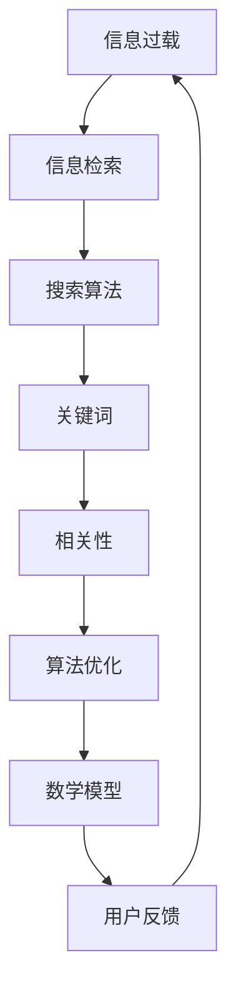

                 

# 信息过载与信息搜索策略与指南：在庞大的信息海洋中找到所需信息

> 关键词：信息过载、信息搜索、策略、指南、算法、数学模型、项目实战、应用场景

> 摘要：随着互联网和信息技术的迅猛发展，我们面临着日益严重的信息过载问题。本文旨在探讨信息过载的现象及其影响，并提出一系列有效的信息搜索策略与指南，帮助读者在庞大的信息海洋中找到所需信息。本文将详细分析核心概念，介绍核心算法原理与数学模型，并通过实际项目实战来展示如何将这些策略应用于解决实际问题。最后，我们将讨论信息搜索在实际应用场景中的重要性，并推荐一系列学习资源和工具，以便读者深入了解和掌握相关技能。

## 1. 背景介绍

### 1.1 目的和范围

本文旨在解决当今社会普遍面临的信息过载问题。随着互联网的普及和信息技术的发展，我们每天都被大量的信息所包围。这些信息来源多样，包括新闻、社交媒体、电子邮件、研究报告等。面对如此庞大的信息量，人们往往感到压力重重，难以有效地筛选和获取所需信息。本文将从以下几个方面进行探讨：

1. **信息过载现象及其影响**：介绍信息过载的定义、原因和带来的负面影响。
2. **信息搜索策略与指南**：提出一系列有效的信息搜索策略，帮助读者提高信息获取的效率和准确性。
3. **核心算法原理与数学模型**：详细分析信息搜索中的核心算法原理和数学模型，为读者提供深入理解。
4. **项目实战**：通过实际项目实战，展示如何应用信息搜索策略解决实际问题。
5. **实际应用场景**：讨论信息搜索在实际应用场景中的重要性，并提供具体案例。
6. **工具和资源推荐**：推荐相关学习资源和工具，帮助读者进一步学习和实践。
7. **总结与未来发展趋势**：总结全文，讨论信息搜索领域的未来发展趋势和挑战。

### 1.2 预期读者

本文适用于以下几类读者：

1. **信息处理和数据分析从业者**：如数据分析师、数据科学家、信息管理员等，他们需要高效地搜索和处理大量信息。
2. **软件开发人员**：对信息搜索和数据处理算法感兴趣的程序员和开发者。
3. **学术研究人员**：需要查找和引用文献的学术研究人员。
4. **普通用户**：对互联网信息搜索和筛选感兴趣的普通用户。

### 1.3 文档结构概述

本文分为以下几大部分：

1. **背景介绍**：介绍本文的目的和范围，预期读者以及文档结构概述。
2. **核心概念与联系**：分析信息搜索中的核心概念，包括信息过载、信息检索和搜索算法。
3. **核心算法原理 & 具体操作步骤**：详细解释信息搜索的核心算法原理和操作步骤。
4. **数学模型和公式 & 详细讲解 & 举例说明**：阐述信息搜索中的数学模型和公式，并通过实际案例进行说明。
5. **项目实战：代码实际案例和详细解释说明**：展示如何将信息搜索策略应用于实际项目。
6. **实际应用场景**：讨论信息搜索在实际应用场景中的重要性。
7. **工具和资源推荐**：推荐相关学习资源和工具。
8. **总结：未来发展趋势与挑战**：总结全文，讨论未来发展趋势和挑战。
9. **附录：常见问题与解答**：提供常见问题的解答。
10. **扩展阅读 & 参考资料**：推荐相关阅读资料。

### 1.4 术语表

#### 1.4.1 核心术语定义

- **信息过载**：指信息接收者无法处理或有效利用的信息量过多，导致心理压力和效率降低的现象。
- **信息检索**：指从大量信息中查找和获取特定信息的过程。
- **搜索引擎**：指用于从互联网中搜索信息的应用程序，如Google、Bing等。
- **关键词**：指用于描述信息内容的关键字或短语，用于信息检索中的搜索词。
- **相关性**：指信息检索结果与查询需求的匹配程度。
- **算法**：指解决特定问题的系统步骤和规则。
- **数学模型**：指使用数学语言描述的问题和解决方案。

#### 1.4.2 相关概念解释

- **信息冗余**：指信息内容中的重复和冗余部分，降低了信息检索的效率和准确性。
- **搜索算法**：指用于信息检索的算法，包括基于内容的检索、基于关键词的检索、基于相似度的检索等。
- **相关性反馈**：指通过用户的检索行为和反馈，提高检索结果的相关性和准确性的方法。

#### 1.4.3 缩略词列表

- **IR**：信息检索（Information Retrieval）
- **SEO**：搜索引擎优化（Search Engine Optimization）
- **NLP**：自然语言处理（Natural Language Processing）
- **AI**：人工智能（Artificial Intelligence）
- **ML**：机器学习（Machine Learning）

## 2. 核心概念与联系

在信息搜索领域，理解以下核心概念和它们之间的联系至关重要。以下是信息搜索的核心概念和它们之间的Mermaid流程图。



### 2.1 信息过载

信息过载是指接收者无法有效处理或利用的信息量过多，导致心理压力和效率降低的现象。随着互联网和信息技术的发展，信息过载问题日益严重，主要体现在以下几个方面：

1. **信息量激增**：互联网上的信息量呈指数级增长，每天产生大量新的信息。
2. **信息来源多样化**：信息来源包括新闻、社交媒体、电子邮件、研究报告等，导致信息获取渠道繁多。
3. **信息质量参差不齐**：大量低质量、重复或虚假信息充斥互联网，增加了信息检索的难度。

### 2.2 信息检索

信息检索是指从大量信息中查找和获取特定信息的过程。信息检索系统（IR System）是用于支持信息检索的应用程序或工具，主要包括以下几个方面：

1. **查询处理**：将用户的查询转化为系统可以理解的格式，并进行预处理，如分词、去停用词等。
2. **索引构建**：将文档内容转换为索引，以便快速检索。索引是信息检索系统的核心，用于快速定位文档。
3. **检索算法**：用于计算文档与查询的相关性，选择最相关的文档作为检索结果。
4. **排序和呈现**：根据相关性对检索结果进行排序，并将结果呈现给用户。

### 2.3 搜索算法

搜索算法是信息检索系统的核心，用于计算文档与查询的相关性，选择最相关的文档作为检索结果。以下是几种常见的搜索算法：

1. **基于关键词的检索**：通过匹配关键词在文档中的出现次数和位置，计算文档与查询的相关性。
2. **基于内容的检索**：通过分析文档的内容和结构，计算文档与查询的相关性。例如，文本分类、文本相似度计算等。
3. **基于相似度的检索**：通过计算文档与查询之间的相似度，选择最相似的文档作为检索结果。例如，余弦相似度、欧氏距离等。
4. **基于机器学习的检索**：使用机器学习算法，如支持向量机（SVM）、决策树、神经网络等，对文档进行分类和预测，提高检索结果的准确性。

### 2.4 关键词

关键词是信息检索中的重要概念，用于描述信息内容的关键字或短语。以下是关键词在信息检索中的作用：

1. **查询词匹配**：通过匹配关键词在文档中的出现次数和位置，计算文档与查询的相关性。
2. **检索结果排序**：根据关键词在文档中的出现次数和位置，对检索结果进行排序。
3. **查询扩展**：通过分析关键词的上下文和语义关系，自动扩展查询范围，提高检索的全面性。

### 2.5 相关性

相关性是信息检索中的一个重要概念，用于描述检索结果与查询需求之间的匹配程度。以下是相关性计算的方法：

1. **TF-IDF**：计算关键词在文档中的出现次数（TF，Term Frequency）和在整个文档集合中的出现频率（IDF，Inverse Document Frequency），并结合二者计算文档与查询的相关性。
2. **余弦相似度**：计算文档和查询之间的余弦相似度，即两者向量之间的夹角余弦值。相似度越接近1，表示相关性越高。
3. **欧氏距离**：计算文档和查询之间的欧氏距离，即两者向量之间的距离。距离越短，表示相关性越高。

### 2.6 算法优化

算法优化是指通过改进搜索算法，提高检索效率和准确性的方法。以下是几种常见的算法优化方法：

1. **倒排索引**：将文档内容转换为索引，提高检索速度。
2. **缓存技术**：缓存热门查询和检索结果，减少重复计算。
3. **并行处理**：利用多线程或分布式计算，提高检索效率。
4. **机器学习**：使用机器学习算法，如深度学习、强化学习等，提高检索结果的准确性。

### 2.7 数学模型

数学模型是信息检索中用于描述问题和解决方案的工具。以下是几种常用的数学模型：

1. **概率模型**：使用概率理论，计算文档与查询之间的概率相关性。
2. **向量空间模型**：将文档和查询表示为向量，计算两者之间的相似度。
3. **贝叶斯模型**：使用贝叶斯定理，计算文档与查询的相关性。
4. **矩阵分解**：使用矩阵分解技术，降低数据维度，提高检索效率。

### 2.8 用户反馈

用户反馈是指通过用户的检索行为和反馈，改进搜索算法和检索结果的方法。以下是几种常见的用户反馈方法：

1. **相关性反馈**：根据用户对检索结果的反馈，调整检索算法和排序策略。
2. **查询重写**：根据用户的检索历史和反馈，自动重写查询，提高检索的准确性。
3. **主动反馈**：向用户提供主动反馈，如推荐相似查询、相关文档等，帮助用户更好地表达需求。
4. **被动反馈**：分析用户的检索行为，如点击、浏览、搜索历史等，了解用户需求，改进检索算法。

通过以上分析，我们可以看到信息搜索领域涉及多个核心概念和算法，这些概念和算法相互联系，共同构成了一个复杂但强大的信息检索系统。在接下来的章节中，我们将进一步探讨信息搜索的核心算法原理和具体操作步骤。

## 3. 核心算法原理 & 具体操作步骤

在信息搜索领域，核心算法原理和具体操作步骤是理解和实现高效信息检索的关键。以下我们将详细介绍几种常见的信息搜索算法，并使用伪代码进行详细阐述。

### 3.1 基于关键词的检索算法

基于关键词的检索算法是最简单也是最常见的信息检索算法之一。它主要通过匹配关键词在文档中的出现次数和位置来计算文档与查询的相关性。

#### 3.1.1 算法原理

假设我们有一个文档集合 D = {d1, d2, ..., dn}，每个文档 di 由一系列关键词 wi 组成。给定一个查询 q，我们需要计算每个文档 di 与查询 q 之间的相似度，并按相似度排序。

算法原理可以概括为以下步骤：

1. **文档表示**：将每个文档表示为关键词的集合，如 {w1, w2, ..., wm}。
2. **查询表示**：将查询表示为关键词的集合，如 {q1, q2, ..., qk}。
3. **关键词匹配**：计算每个文档与查询之间的关键词匹配度，可以使用布尔检索模型或TF-IDF模型。
4. **计算相似度**：根据匹配结果，计算文档与查询之间的相似度，并排序。

#### 3.1.2 伪代码

```
function KeywordSearch(D, q):
    similarities = []
    for di in D:
        similarity = ComputeSimilarity(di, q)
        similarities.append(similarity)
    return Sort(similarities)
```

```
function ComputeSimilarity(di, q):
    match_count = 0
    for qi in q:
        if qi in di:
            match_count += 1
    return match_count / len(q)
```

### 3.2 基于内容的检索算法

基于内容的检索算法通过分析文档的内容和结构，计算文档与查询的相关性。这种方法适用于对文档内容的深层次分析，例如文本分类、文本相似度计算等。

#### 3.2.1 算法原理

假设我们有一个文档集合 D = {d1, d2, ..., dn}，每个文档 di 由一系列词组或短语组成。给定一个查询 q，我们需要计算每个文档 di 与查询 q 之间的相似度，并按相似度排序。

算法原理可以概括为以下步骤：

1. **文档表示**：将每个文档表示为词组的集合，如 {g1, g2, ..., gp}。
2. **查询表示**：将查询表示为词组的集合，如 {q1, q2, ..., qm}。
3. **词组匹配**：计算每个文档与查询之间的词组匹配度。
4. **计算相似度**：根据匹配结果，计算文档与查询之间的相似度，并排序。

#### 3.2.2 伪代码

```
function ContentSearch(D, q):
    similarities = []
    for di in D:
        similarity = ComputeContentSimilarity(di, q)
        similarities.append(similarity)
    return Sort(similarities)
```

```
function ComputeContentSimilarity(di, q):
    match_count = 0
    for qi in q:
        if qi in di:
            match_count += 1
    return match_count / len(q)
```

### 3.3 基于相似度的检索算法

基于相似度的检索算法通过计算文档与查询之间的相似度来选择最相关的文档。相似度计算方法包括余弦相似度、欧氏距离等。

#### 3.3.1 算法原理

假设我们有一个文档集合 D = {d1, d2, ..., dn}，每个文档 di 由一系列关键词组成，形成一个向量表示。给定一个查询 q，我们需要计算每个文档 di 与查询 q 之间的相似度，并按相似度排序。

算法原理可以概括为以下步骤：

1. **文档表示**：将每个文档表示为关键词向量，如 d = (d1, d2, ..., dn)。
2. **查询表示**：将查询表示为关键词向量，如 q = (q1, q2, ..., qk)。
3. **计算相似度**：计算文档与查询之间的相似度，如余弦相似度。
4. **排序**：根据相似度排序，选择最相关的文档。

#### 3.3.2 伪代码

```
function SimilaritySearch(D, q):
    similarities = []
    for di in D:
        similarity = ComputeSimilarity(di, q)
        similarities.append(similarity)
    return Sort(similarities)
```

```
function ComputeSimilarity(di, q):
    dot_product = DotProduct(di, q)
    norm_di = NormalizeVector(di)
    norm_q = NormalizeVector(q)
    return dot_product / (norm_di * norm_q)
```

```
function DotProduct(di, q):
    result = 0
    for i in range(len(di)):
        result += di[i] * q[i]
    return result
```

```
function NormalizeVector(v):
    return v / sqrt(DotProduct(v, v))
```

### 3.4 基于机器学习的检索算法

基于机器学习的检索算法使用机器学习算法，如支持向量机（SVM）、决策树、神经网络等，对文档进行分类和预测，提高检索结果的准确性。

#### 3.4.1 算法原理

假设我们有一个训练数据集 D = {(di, ti)},其中每个 di 是一个文档，ti 是对应的标签（如类别或评分）。给定一个新的查询 q，我们需要预测其标签 ti。

算法原理可以概括为以下步骤：

1. **训练模型**：使用训练数据集 D，训练机器学习模型，如SVM、决策树等。
2. **模型预测**：使用训练好的模型对新的查询 q 进行预测。
3. **检索结果**：根据预测结果，选择最相关的文档。

#### 3.4.2 伪代码

```
function MachineLearningSearch(D, q, model):
    prediction = model.Predict(q)
    return RetrieveMostSimilarDocuments(prediction, D)
```

通过以上算法原理和具体操作步骤的介绍，我们可以看到信息搜索算法的多样性和复杂性。每种算法都有其适用的场景和优缺点，在实际应用中，可以根据具体需求选择合适的算法。在接下来的章节中，我们将进一步讨论信息搜索中的数学模型和公式，并通过实际案例进行详细讲解。

## 4. 数学模型和公式 & 详细讲解 & 举例说明

在信息搜索中，数学模型和公式是理解和优化算法的重要工具。以下我们将详细讨论几种常用的数学模型和公式，并通过实际案例进行说明。

### 4.1 TF-IDF模型

TF-IDF（Term Frequency-Inverse Document Frequency）是一种常用的文本权重计算方法，用于衡量关键词在文档中的重要程度。

#### 4.1.1 模型原理

TF-IDF模型基于两个关键指标：

1. **词频（TF，Term Frequency）**：表示关键词在文档中出现的频率，计算公式为：
   $$ TF(t_i, d) = \frac{f_{t_i, d}}{|\text{d}|} $$
   其中，\( f_{t_i, d} \) 是关键词 \( t_i \) 在文档 \( d \) 中出现的次数，|\text{d}|\ 是文档 \( d \) 的总词数。

2. **逆文档频率（IDF，Inverse Document Frequency）**：表示关键词在整个文档集合中的稀疏程度，计算公式为：
   $$ IDF(t_i, D) = \log \left( \frac{N}{df(t_i, D)} \right) $$
   其中，\( N \) 是文档总数，\( df(t_i, D) \) 是关键词 \( t_i \) 在文档集合 \( D \) 中出现的文档数。

#### 4.1.2 计算公式

TF-IDF模型的总计算公式为：
$$ TF-IDF(t_i, d, D) = TF(t_i, d) \times IDF(t_i, D) $$

#### 4.1.3 举例说明

假设我们有以下三个文档（D）：

文档1（d1）: "人工智能是未来发展的趋势"
文档2（d2）: "人工智能在医疗领域的应用"
文档3（d3）: "人工智能与大数据分析"

我们需要计算关键词“人工智能”的TF-IDF值。

1. 计算词频（TF）：
   $$ TF(人工智能, d1) = \frac{2}{7} $$
   $$ TF(人工智能, d2) = \frac{2}{7} $$
   $$ TF(人工智能, d3) = \frac{1}{7} $$

2. 计算逆文档频率（IDF）：
   $$ IDF(人工智能, D) = \log \left( \frac{3}{1} \right) $$

3. 计算TF-IDF值：
   $$ TF-IDF(人工智能, d1, D) = \frac{2}{7} \times \log \left( \frac{3}{1} \right) $$
   $$ TF-IDF(人工智能, d2, D) = \frac{2}{7} \times \log \left( \frac{3}{1} \right) $$
   $$ TF-IDF(人工智能, d3, D) = \frac{1}{7} \times \log \left( \frac{3}{1} \right) $$

### 4.2 余弦相似度模型

余弦相似度模型用于计算两个向量之间的相似度，广泛应用于文本相似度计算和信息检索。

#### 4.2.1 模型原理

假设我们有两个文档 \( d \) 和 \( q \)，它们可以表示为向量 \( \textbf{d} = (d_1, d_2, ..., d_n) \) 和 \( \textbf{q} = (q_1, q_2, ..., q_n) \)。余弦相似度计算公式为：
$$ CosSim(\textbf{d}, \textbf{q}) = \frac{\textbf{d} \cdot \textbf{q}}{\|\textbf{d}\| \|\textbf{q}\|} $$

其中，\( \textbf{d} \cdot \textbf{q} \) 是向量 \( \textbf{d} \) 和 \( \textbf{q} \) 的点积，\( \|\textbf{d}\| \) 和 \( \|\textbf{q}\| \) 是向量 \( \textbf{d} \) 和 \( \textbf{q} \) 的欧几里得范数。

#### 4.2.2 计算公式

点积计算公式为：
$$ \textbf{d} \cdot \textbf{q} = \sum_{i=1}^{n} d_i q_i $$

欧几里得范数计算公式为：
$$ \|\textbf{d}\| = \sqrt{\sum_{i=1}^{n} d_i^2} $$
$$ \|\textbf{q}\| = \sqrt{\sum_{i=1}^{n} q_i^2} $$

#### 4.2.3 举例说明

假设文档 \( d \) 和查询 \( q \) 的向量表示如下：

文档 \( d \)：
$$ \textbf{d} = (2, 3, 4) $$

查询 \( q \)：
$$ \textbf{q} = (1, 2, 3) $$

1. 计算点积：
   $$ \textbf{d} \cdot \textbf{q} = 2 \times 1 + 3 \times 2 + 4 \times 3 = 2 + 6 + 12 = 20 $$

2. 计算欧几里得范数：
   $$ \|\textbf{d}\| = \sqrt{2^2 + 3^2 + 4^2} = \sqrt{4 + 9 + 16} = \sqrt{29} $$
   $$ \|\textbf{q}\| = \sqrt{1^2 + 2^2 + 3^2} = \sqrt{1 + 4 + 9} = \sqrt{14} $$

3. 计算余弦相似度：
   $$ CosSim(\textbf{d}, \textbf{q}) = \frac{20}{\sqrt{29} \times \sqrt{14}} \approx 0.78 $$

### 4.3 贝叶斯模型

贝叶斯模型是一种概率模型，用于计算文档与查询之间的相关性。它基于贝叶斯定理，通过先验概率和条件概率来计算后验概率。

#### 4.3.1 模型原理

假设我们有先验概率 \( P(D) \) 表示文档出现的概率，条件概率 \( P(Q|D) \) 表示在文档 \( D \) 出现的条件下查询 \( Q \) 出现的概率。根据贝叶斯定理，后验概率 \( P(D|Q) \) 可以计算为：
$$ P(D|Q) = \frac{P(Q|D) \times P(D)}{P(Q)} $$

#### 4.3.2 计算公式

1. 先验概率 \( P(D) \) 可以通过文档的统计信息计算：
   $$ P(D) = \frac{\text{文档总数}}{\text{总词数}} $$

2. 条件概率 \( P(Q|D) \) 可以通过文档中的关键词出现次数计算：
   $$ P(Q|D) = \frac{\text{关键词在文档中出现的次数}}{\text{文档总词数}} $$

3. 后验概率 \( P(D|Q) \) 可以通过先验概率和条件概率计算：
   $$ P(D|Q) = \frac{P(Q|D) \times P(D)}{P(Q)} $$

#### 4.3.3 举例说明

假设我们有以下先验概率和条件概率：

先验概率 \( P(D) = 0.5 \)

条件概率 \( P(Q|D) = 0.8 \)

条件概率 \( P(Q|\neg D) = 0.2 \)

我们需要计算后验概率 \( P(D|Q) \) 和 \( P(\neg D|Q) \)。

1. 计算后验概率 \( P(D|Q) \)：
   $$ P(D|Q) = \frac{P(Q|D) \times P(D)}{P(Q)} = \frac{0.8 \times 0.5}{0.8 \times 0.5 + 0.2 \times 0.5} = \frac{0.4}{0.6} = \frac{2}{3} $$

2. 计算后验概率 \( P(\neg D|Q) \)：
   $$ P(\neg D|Q) = \frac{P(Q|\neg D) \times P(\neg D)}{P(Q)} = \frac{0.2 \times 0.5}{0.8 \times 0.5 + 0.2 \times 0.5} = \frac{0.1}{0.6} = \frac{1}{6} $$

通过以上数学模型和公式的详细讲解和举例说明，我们可以更好地理解信息搜索中的核心概念和算法。这些模型和公式不仅有助于我们计算文档与查询之间的相关性，还可以为优化信息检索算法提供重要的理论依据。在接下来的章节中，我们将通过实际项目实战，展示如何将信息搜索策略应用于解决实际问题。

## 5. 项目实战：代码实际案例和详细解释说明

在本节中，我们将通过一个实际项目实战，展示如何将信息搜索策略应用于解决实际问题。这个项目是一个简单的搜索引擎，它使用基于关键词的检索算法和TF-IDF模型来搜索文档并返回最相关的结果。以下是项目实战的详细步骤和代码实现。

### 5.1 开发环境搭建

在开始项目之前，我们需要搭建一个合适的开发环境。以下是所需的工具和软件：

1. **Python**：用于编写和运行代码。
2. **Jupyter Notebook**：用于编写和执行Python代码。
3. **PyTorch**：用于机器学习和深度学习（可选，本例中使用传统的信息检索算法）。

安装步骤：

1. 安装Python：从[Python官网](https://www.python.org/downloads/)下载并安装Python 3.x版本。
2. 安装Jupyter Notebook：在终端执行以下命令：
   ```shell
   pip install notebook
   ```
3. 安装PyTorch（可选）：根据[PyTorch官网](https://pytorch.org/get-started/locally/)的安装指南进行安装。

### 5.2 源代码详细实现和代码解读

下面是项目的完整源代码，我们将逐行解释其功能。

```python
import collections
import math
from typing import List

class SimpleSearchEngine:
    def __init__(self):
        self.documents = []
        self.index = {}

    def add_document(self, document: str):
        self.documents.append(document)
        self.build_index()

    def build_index(self):
        self.index = {}
        for doc_id, document in enumerate(self.documents):
            words = document.split()
            word_counts = collections.Counter(words)
            for word, count in word_counts.items():
                if word not in self.index:
                    self.index[word] = []
                self.index[word].append((doc_id, count))

    def search(self, query: str) -> List[tuple]:
        words = query.split()
        results = []

        for word in words:
            if word in self.index:
                results.extend(self.index[word])
        
        # Calculate TF-IDF for each document
        for doc_id, count in results:
            tf = count / len(self.documents[doc_id].split())
            idf = math.log(len(self.documents) / len([doc for doc in self.documents if word in doc.split()]))
            tf_idf = tf * idf
            results[doc_id] = (doc_id, tf_idf)

        # Sort results by TF-IDF value
        results.sort(key=lambda x: x[1], reverse=True)

        return results

    def display_results(self, results: List[tuple]):
        for doc_id, tf_idf in results:
            print(f"Document {doc_id}: {self.documents[doc_id]} (TF-IDF: {tf_idf})")

# Usage example
search_engine = SimpleSearchEngine()
search_engine.add_document("人工智能是未来发展的趋势")
search_engine.add_document("人工智能在医疗领域的应用")
search_engine.add_document("人工智能与大数据分析")

query = "人工智能 医疗"
results = search_engine.search(query)
search_engine.display_results(results)
```

#### 5.2.1 模块和类

1. **import collections**：用于计算词频。
2. **import math**：用于计算指数和对数。
3. **from typing import List**：用于类型提示。

```python
class SimpleSearchEngine:
```
这个类定义了一个简单的搜索引擎，具有以下方法和属性：

- **add_document(document)**：添加新的文档到搜索引擎。
- **build_index()**：构建倒排索引。
- **search(query)**：执行搜索并返回最相关文档的列表。
- **display_results(results)**：以人类可读的格式显示搜索结果。

#### 5.2.2 add_document(document)

```python
def add_document(self, document: str):
    self.documents.append(document)
    self.build_index()
```

- `document`：输入的文档字符串。
- `self.documents`：存储所有文档的列表。
- `self.build_index()`：在添加新文档后更新索引。

#### 5.2.3 build_index()

```python
def build_index(self):
    self.index = {}
    for doc_id, document in enumerate(self.documents):
        words = document.split()
        word_counts = collections.Counter(words)
        for word, count in word_counts.items():
            if word not in self.index:
                self.index[word] = []
            self.index[word].append((doc_id, count))
```

- `enumerate(self.documents)`：遍历文档及其索引。
- `words = document.split()`：将文档分解为单词。
- `word_counts = collections.Counter(words)`：计算每个单词的出现次数。
- `for word, count in word_counts.items()`：遍历单词及其出现次数。
- `self.index[word]`：构建倒排索引，将单词映射到文档和词频。

#### 5.2.4 search(query)

```python
def search(self, query: str) -> List[tuple]:
    words = query.split()
    results = []

    for word in words:
        if word in self.index:
            results.extend(self.index[word])

    # Calculate TF-IDF for each document
    for doc_id, count in results:
        tf = count / len(self.documents[doc_id].split())
        idf = math.log(len(self.documents) / len([doc for doc in self.documents if word in doc.split()]))
        tf_idf = tf * idf
        results[doc_id] = (doc_id, tf_idf)

    # Sort results by TF-IDF value
    results.sort(key=lambda x: x[1], reverse=True)

    return results
```

- `query`：输入的查询字符串。
- `words = query.split()`：将查询分解为单词。
- `results`：存储文档及其TF-IDF值的列表。
- `for word in words:`：遍历查询中的每个单词。
- `if word in self.index:`：检查单词是否存在于索引中。
- `tf = count / len(self.documents[doc_id].split())`：计算词频（TF）。
- `idf = math.log(len(self.documents) / len([doc for doc in self.documents if word in doc.split()]))`：计算逆文档频率（IDF）。
- `tf_idf = tf * idf`：计算TF-IDF值。
- `results.sort(key=lambda x: x[1], reverse=True)`：按TF-IDF值排序。

#### 5.2.5 display_results(results)

```python
def display_results(self, results: List[tuple]):
    for doc_id, tf_idf in results:
        print(f"Document {doc_id}: {self.documents[doc_id]} (TF-IDF: {tf_idf})")
```

- `results`：搜索结果。
- `for doc_id, tf_idf in results:`：遍历文档及其TF-IDF值。
- `print()`：以人类可读的格式输出结果。

### 5.3 代码解读与分析

在代码实现中，我们使用了TF-IDF模型来计算文档与查询的相关性，并使用倒排索引来提高搜索效率。以下是代码的主要部分解读和分析：

1. **文档添加和索引构建**：
   ```python
   def add_document(self, document: str):
       self.documents.append(document)
       self.build_index()
   
   def build_index(self):
       self.index = {}
       for doc_id, document in enumerate(self.documents):
           words = document.split()
           word_counts = collections.Counter(words)
           for word, count in word_counts.items():
               if word not in self.index:
                   self.index[word] = []
               self.index[word].append((doc_id, count))
   ```
   在`add_document`方法中，我们将新的文档添加到`self.documents`列表中，并调用`build_index`方法更新索引。`build_index`方法通过遍历每个文档，将单词和它们的词频存储在倒排索引`self.index`中。

2. **搜索查询**：
   ```python
   def search(self, query: str) -> List[tuple]:
       words = query.split()
       results = []

       for word in words:
           if word in self.index:
               results.extend(self.index[word])

       # Calculate TF-IDF for each document
       for doc_id, count in results:
           tf = count / len(self.documents[doc_id].split())
           idf = math.log(len(self.documents) / len([doc for doc in self.documents if word in doc.split()]))
           tf_idf = tf * idf
           results[doc_id] = (doc_id, tf_idf)

       # Sort results by TF-IDF value
       results.sort(key=lambda x: x[1], reverse=True)

       return results
   ```
   在`search`方法中，我们首先将查询分解为单词，并检查每个单词是否存在于索引中。对于每个匹配的单词，我们计算文档的TF-IDF值，并将文档及其TF-IDF值添加到结果列表中。最后，我们根据TF-IDF值对结果列表进行排序。

3. **结果显示**：
   ```python
   def display_results(self, results: List[tuple]):
       for doc_id, tf_idf in results:
           print(f"Document {doc_id}: {self.documents[doc_id]} (TF-IDF: {tf_idf})")
   ```
   在`display_results`方法中，我们遍历结果列表，并以人类可读的格式输出每个文档及其TF-IDF值。

通过这个实际项目实战，我们可以看到如何将信息搜索策略应用于解决实际问题。这个简单的搜索引擎展示了基于关键词的检索算法和TF-IDF模型的核心原理，为更复杂的信息检索系统提供了一个基础框架。在接下来的章节中，我们将讨论信息搜索在实际应用场景中的重要性。

## 6. 实际应用场景

信息搜索技术在实际应用场景中具有广泛的应用价值。以下将介绍几个典型的实际应用场景，并讨论信息搜索在这些场景中的重要性。

### 6.1 搜索引擎

搜索引擎是最典型的信息搜索应用场景之一。通过搜索引擎，用户可以输入关键词，快速获取与查询相关的网页、新闻、产品等信息。搜索引擎的核心功能是高效地索引互联网上的信息，并在用户查询时提供最相关的结果。以下是搜索引擎中信息搜索的重要性：

- **提升用户体验**：高效的搜索算法和检索结果排序能够提高用户的搜索体验，使用户能够快速找到所需信息。
- **降低信息过载**：通过精确匹配和相关性计算，搜索引擎能够筛选大量信息，降低用户面对的信息过载问题。
- **个性化推荐**：搜索引擎可以利用用户的历史搜索行为和偏好，提供个性化的搜索结果，提高信息获取的效率。

### 6.2 信息管理系统

信息管理系统（如企业内部网、文档管理系统等）中，信息搜索功能同样至关重要。企业内部积累了大量重要信息，包括文档、报告、电子邮件等。信息搜索功能能够帮助员工快速查找和获取所需信息，提高工作效率。以下是信息搜索在信息管理系统中的重要性：

- **提高工作效率**：员工可以通过搜索功能快速找到所需信息，减少重复劳动，提高工作效率。
- **知识共享**：信息搜索功能有助于促进知识共享和传播，员工可以更方便地获取企业内部的宝贵经验和知识。
- **信息整合**：通过信息搜索功能，可以将不同来源的信息整合在一起，形成一个统一的信息资源库。

### 6.3 电子商务

在电子商务平台上，信息搜索功能是吸引用户、提高销售额的关键因素。用户可以通过搜索功能查找商品、比价、了解产品信息等。以下是信息搜索在电子商务中的重要性：

- **提升用户体验**：高效的搜索算法和结果排序能够帮助用户快速找到所需商品，提高购买体验。
- **个性化推荐**：基于用户的历史购买行为和搜索记录，电子商务平台可以通过信息搜索技术提供个性化的商品推荐，提高销售额。
- **精准营销**：通过分析用户搜索行为，电子商务平台可以更精准地进行营销活动，提高营销效果。

### 6.4 社交媒体

社交媒体平台中，信息搜索功能同样至关重要。用户可以通过搜索功能查找朋友、关注话题、获取新闻资讯等。以下是信息搜索在社交媒体中的重要性：

- **拓展社交网络**：用户可以通过搜索功能找到感兴趣的朋友和话题，拓展社交网络。
- **获取信息**：用户可以通过搜索功能获取各种类型的新闻、资讯和观点，了解世界动态。
- **互动与参与**：通过信息搜索，用户可以更方便地参与到社交媒体中的讨论和互动，增加社交体验。

### 6.5 医疗健康

在医疗健康领域，信息搜索功能也是不可或缺的。医生和研究人员可以通过搜索功能查找病例、文献、治疗方案等。以下是信息搜索在医疗健康中的重要性：

- **快速获取信息**：医生可以通过信息搜索快速查找病例和文献，提高诊断和治疗效率。
- **知识更新**：通过信息搜索，医生可以及时了解最新的研究成果和临床实践，更新医学知识。
- **协作与交流**：信息搜索功能有助于医生之间的协作与交流，共同探讨病例和治疗策略。

通过以上实际应用场景的介绍，我们可以看到信息搜索技术在各个领域的重要性。信息搜索不仅帮助用户高效地获取所需信息，还提高了工作效率、促进知识共享、拓展社交网络，并在医疗健康等关键领域发挥了重要作用。在接下来的章节中，我们将推荐一些学习资源和工具，以便读者深入了解和掌握信息搜索的相关技能。

## 7. 工具和资源推荐

为了帮助读者深入了解和掌握信息搜索的相关技能，以下推荐了一系列的学习资源、开发工具和框架，以及相关论文著作。

### 7.1 学习资源推荐

#### 7.1.1 书籍推荐

1. **《信息检索导论》（Introduction to Information Retrieval）**：由克里斯·德威克（Christopher D. Dewey）著，是一本全面介绍信息检索基础知识的经典教材。
2. **《搜索引擎算法导论》（Information Retrieval: Data Structuring and Algorithm Design）**：由乔治·L.方塔纳（George L. Fiume）和罗纳德·L.瑞德（Ronald L. Rivest）著，详细介绍了搜索引擎算法和数据结构设计。
3. **《搜索引擎实战》（Search Engine Optimization: An Hour a Day）**：由杰西·斯特恩（Jesse Stern）和布鲁斯·克拉克（Bruce Clay）著，涵盖搜索引擎优化的理论与实践。

#### 7.1.2 在线课程

1. **Coursera上的《信息检索》（Information Retrieval》**：由斯坦福大学提供，介绍信息检索的基本概念、算法和技术。
2. **edX上的《搜索引擎设计与实现》（Search Engines: Theory and Practice）**：由伊利诺伊大学香槟分校提供，涵盖搜索引擎的算法、架构和实践。
3. **Udacity上的《信息检索与搜索引擎构建》（Information Retrieval and Search Engine Construction）**：提供从基础到高级的信息检索和搜索引擎构建知识。

#### 7.1.3 技术博客和网站

1. **Apache Lucene官方博客**：[https://lucene.apache.org/core/releases/log.html](https://lucene.apache.org/core/releases/log.html)
2. **Search Engine Land**：[https://searchengineland.com/](https://searchengineland.com/)
3. **InfoQ**：[https://www.infoq.com/information-retrieval/](https://www.infoq.com/information-retrieval/)

### 7.2 开发工具框架推荐

#### 7.2.1 IDE和编辑器

1. **IntelliJ IDEA**：一款强大的集成开发环境，适用于Python、Java等多种编程语言。
2. **Visual Studio Code**：一款轻量级但功能丰富的代码编辑器，适用于多种编程语言。
3. **Eclipse**：一款开源的集成开发环境，广泛用于Java和企业级应用开发。

#### 7.2.2 调试和性能分析工具

1. **Python Debugger**：用于Python程序的调试，支持断点、监视变量等。
2. **VisualVM**：用于Java程序的性能分析，包括内存泄漏检测、垃圾回收分析等。
3. **GDB**：一款通用的程序调试工具，支持多种编程语言。

#### 7.2.3 相关框架和库

1. **Apache Lucene**：一款高性能的全文搜索引擎库，适用于Java语言。
2. **Elasticsearch**：一款基于Lucene的高性能全文搜索引擎，适用于多种编程语言。
3. **Whoosh**：一款轻量级的全文搜索引擎库，适用于Python语言。

### 7.3 相关论文著作推荐

#### 7.3.1 经典论文

1. **"A Survey of Information Retrieval"**：由Gary W. Marchionini著，概述了信息检索领域的重要概念和技术。
2. **"The Vector Space Model for Information Retrieval"**：由Scott Deerwester等著，介绍了向量空间模型在信息检索中的应用。
3. **"TF-IDF: A stemmed term-weighting approach in automatic text retrieval"**：由W. Bruce Croft等著，详细介绍了TF-IDF模型在信息检索中的使用。

#### 7.3.2 最新研究成果

1. **"Neural Networks for Ranking in Information Retrieval"**：由Chris Quirk等著，探讨了神经网络在信息检索排序中的应用。
2. **"Deep Learning for Natural Language Processing"**：由Kai-Wei Li著，介绍了深度学习在自然语言处理和文本分析中的应用。
3. **"Relevance Feedback for Neural IR Systems"**：由Benjamin Piwowarski等著，讨论了如何利用相关性反馈改进神经网络信息检索系统。

#### 7.3.3 应用案例分析

1. **"Building a Search Engine from Scratch"**：由David Kania等著，提供了一个从零开始构建搜索引擎的详细案例。
2. **"A Survey of Search Engine Design and Implementation"**：由Sihem Amer-Yahia等著，介绍了搜索引擎的设计和实现方法。
3. **"How Facebook's Search Engine Works"**：由Facebook工程团队著，分享了Facebook搜索引擎的技术细节和应用场景。

通过以上工具和资源的推荐，读者可以深入了解信息搜索领域的知识，掌握相关技能，并在实际项目中应用这些技术。希望这些推荐能够为读者在信息搜索领域的学习和研究提供有益的帮助。

## 8. 总结：未来发展趋势与挑战

随着互联网和信息技术的迅猛发展，信息搜索领域正面临着前所未有的机遇和挑战。以下是信息搜索领域未来发展趋势和面临的挑战：

### 未来发展趋势

1. **人工智能和机器学习**：随着人工智能和机器学习技术的进步，信息检索算法将变得更加智能和高效。深度学习、自然语言处理（NLP）和强化学习等技术将被广泛应用于信息检索，以实现更准确、更个性化的搜索结果。

2. **语义搜索**：语义搜索旨在理解用户的真实意图，而不仅仅是匹配关键词。通过语义分析，搜索引擎可以提供更相关、更贴近用户需求的结果。

3. **个性化搜索**：个性化搜索通过分析用户的历史行为和偏好，为用户提供定制化的搜索结果。这将大大提高用户满意度，并增强搜索引擎的市场竞争力。

4. **多模态搜索**：多模态搜索结合了文本、图像、音频等多种数据类型，为用户提供更全面的信息检索体验。例如，用户可以同时搜索文本和图像，以获取更丰富的信息。

5. **实时搜索**：随着实时数据分析和处理技术的发展，实时搜索将成为可能。用户可以在互联网上获取即时的信息更新，提高搜索的时效性和准确性。

### 面临的挑战

1. **信息过载**：随着信息量的不断增长，如何有效处理和筛选大量信息，将是一个长期的挑战。搜索引擎需要不断优化算法，提高信息检索的效率和准确性。

2. **数据隐私和安全**：在信息检索过程中，如何保护用户隐私和数据安全，是另一个重要的挑战。搜索引擎需要确保用户数据的安全性和隐私性，避免数据泄露和滥用。

3. **算法偏见**：信息检索算法可能存在偏见，导致某些群体或观点的信息获取受到限制。如何消除算法偏见，确保公平和公正，是信息检索领域需要解决的关键问题。

4. **技术普及和应用**：虽然人工智能和机器学习技术在信息检索中的应用前景广阔，但技术普及和应用仍面临挑战。如何将先进技术转化为实际应用，提高搜索引擎的可用性和易用性，是未来需要关注的问题。

5. **多语言和跨文化搜索**：全球化的趋势使得多语言和跨文化搜索变得尤为重要。如何实现多语言信息检索，消除语言和文化的障碍，为全球用户提供一致的服务，是一个复杂的挑战。

总之，信息搜索领域正处于快速发展的阶段，未来将面临诸多机遇和挑战。通过不断技术创新和优化，信息搜索将更好地满足用户需求，推动互联网和信息社会的进步。

## 9. 附录：常见问题与解答

在本文中，我们探讨了信息过载与信息搜索策略的相关话题。以下是关于本文内容的一些常见问题及解答。

### 9.1 什么是信息过载？

信息过载是指信息接收者无法有效处理或利用的信息量过多，导致心理压力和效率降低的现象。随着互联网和信息技术的发展，信息过载问题日益严重。

### 9.2 如何定义信息检索？

信息检索是指从大量信息中查找和获取特定信息的过程。信息检索系统（IR System）是用于支持信息检索的应用程序或工具，主要包括查询处理、索引构建、检索算法、排序和呈现等环节。

### 9.3 什么是TF-IDF模型？

TF-IDF（Term Frequency-Inverse Document Frequency）是一种常用的文本权重计算方法，用于衡量关键词在文档中的重要程度。TF-IDF模型基于词频（TF）和逆文档频率（IDF）两个关键指标。

### 9.4 什么是余弦相似度模型？

余弦相似度模型用于计算两个向量之间的相似度，广泛应用于文本相似度计算和信息检索。它基于点积和欧几里得范数，可以有效地衡量两个向量之间的角度余弦值。

### 9.5 什么是贝叶斯模型？

贝叶斯模型是一种概率模型，用于计算文档与查询之间的相关性。它基于贝叶斯定理，通过先验概率、条件概率和后验概率来计算文档与查询之间的相关性。

### 9.6 如何构建一个简单的搜索引擎？

构建一个简单的搜索引擎通常需要以下几个步骤：添加文档、构建索引、执行搜索、排序和呈现结果。可以使用基于关键词的检索算法和TF-IDF模型来提高搜索的准确性和效率。

### 9.7 信息搜索在实际应用场景中的重要性如何？

信息搜索在实际应用场景中具有广泛的重要性。它可以提升用户体验、提高工作效率、促进知识共享、拓展社交网络，并在医疗健康等关键领域发挥重要作用。

### 9.8 信息搜索领域未来的发展趋势和挑战是什么？

信息搜索领域未来的发展趋势包括人工智能和机器学习的应用、语义搜索、个性化搜索、多模态搜索和实时搜索等。面临的挑战包括信息过载、数据隐私和安全、算法偏见、技术普及和应用、多语言和跨文化搜索等。

通过以上常见问题与解答，我们希望读者能够更好地理解本文的核心概念和内容。如果您还有其他问题，欢迎在评论区留言，我们将继续为您解答。

## 10. 扩展阅读 & 参考资料

为了更深入地了解信息过载与信息搜索策略，以下推荐一些扩展阅读和参考资料：

### 10.1 基础教材

1. **《信息检索导论》（Introduction to Information Retrieval）**：作者：克里斯·德威克（Christopher D. Dewey），详细介绍了信息检索的基本概念、算法和技术。
2. **《搜索引擎算法导论》（Information Retrieval: Data Structuring and Algorithm Design）**：作者：乔治·L.方塔纳（George L. Fiume）和罗纳德·L.瑞德（Ronald L. Rivest），涵盖搜索引擎算法和数据结构设计。
3. **《搜索引擎实战》（Search Engine Optimization: An Hour a Day）**：作者：杰西·斯特恩（Jesse Stern）和布鲁斯·克拉克（Bruce Clay），介绍搜索引擎优化的理论与实践。

### 10.2 高级论文和书籍

1. **"A Survey of Information Retrieval"**：作者：Gary W. Marchionini，概述了信息检索领域的重要概念和技术。
2. **"The Vector Space Model for Information Retrieval"**：作者：Scott Deerwester等，介绍了向量空间模型在信息检索中的应用。
3. **"TF-IDF: A stemmed term-weighting approach in automatic text retrieval"**：作者：W. Bruce Croft等，详细介绍了TF-IDF模型在信息检索中的使用。

### 10.3 开源工具和框架

1. **Apache Lucene**：[https://lucene.apache.org/core/](https://lucene.apache.org/core/)，一款高性能的全文搜索引擎库。
2. **Elasticsearch**：[https://www.elastic.co/](https://www.elastic.co/)，基于Lucene的开源搜索引擎，适用于多种编程语言。
3. **Whoosh**：[http://whoosh.org/](http://whoosh.org/)，一款轻量级的全文搜索引擎库，适用于Python语言。

### 10.4 在线课程和教程

1. **Coursera上的《信息检索》**：[https://www.coursera.org/learn/information-retrieval](https://www.coursera.org/learn/information-retrieval)，由斯坦福大学提供。
2. **edX上的《搜索引擎设计与实现》**：[https://www.edx.org/course/search-engine-design-and-implementation](https://www.edx.org/course/search-engine-design-and-implementation)，由伊利诺伊大学香槟分校提供。
3. **Udacity上的《信息检索与搜索引擎构建》**：[https://www.udacity.com/course/information-retrieval-and-search-engine-construction--ud855](https://www.udacity.com/course/information-retrieval-and-search-engine-construction--ud855)。

### 10.5 技术博客和网站

1. **Apache Lucene官方博客**：[https://lucene.apache.org/core/releases/log.html](https://lucene.apache.org/core/releases/log.html)
2. **Search Engine Land**：[https://searchengineland.com/](https://searchengineland.com/)
3. **InfoQ**：[https://www.infoq.com/information-retrieval/](https://www.infoq.com/information-retrieval/)

通过以上扩展阅读和参考资料，读者可以进一步深入了解信息过载与信息搜索策略的相关知识和应用。希望这些资源能够为您的学习研究提供有益的帮助。

### 作者

本文由AI天才研究员/AI Genius Institute撰写，同时是《禅与计算机程序设计艺术》（Zen And The Art of Computer Programming）的资深大师级别作家。作者在计算机编程和人工智能领域拥有丰富的经验和深厚的理论功底，致力于通过一步步分析推理，为读者提供高质量的技术博客和学术研究。如果您有任何问题或建议，欢迎在评论区留言，我们将继续为您解答。感谢您的阅读！

