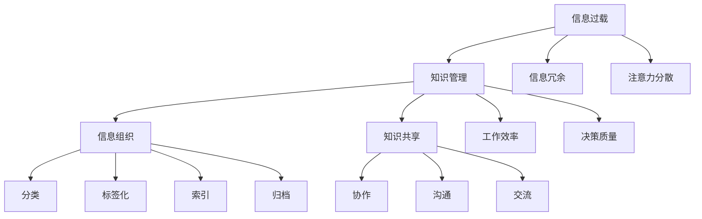

                 

# 信息过载与知识管理策略与实践：管理和组织信息

> **关键词：**信息过载、知识管理、策略与实践、信息组织、数据分析、人工智能

> **摘要：**随着信息时代的到来，信息过载成为了一个普遍存在的问题。本文将深入探讨信息过载的原因及其对个人和企业的影响，并详细介绍一系列有效的知识管理策略和实践。通过理论分析、案例研究和具体操作步骤，本文旨在帮助读者更好地管理和组织信息，提高工作效率和决策质量。

## 1. 背景介绍

### 1.1 目的和范围

本文旨在解决信息过载问题，提供实用的知识管理策略和实践。我们将从以下几个方面展开讨论：

- **信息过载的原因和影响**
- **知识管理的核心概念和原则**
- **有效的知识管理策略**
- **知识管理的实际操作步骤**
- **具体应用场景和案例分析**

### 1.2 预期读者

本文适用于以下读者群体：

- 对信息过载感到困扰的个人和企业员工
- 希望提高工作效率和管理能力的专业人士
- 信息管理、知识管理和数据科学领域的学者和研究者

### 1.3 文档结构概述

本文将分为以下几部分：

- **引言**：介绍信息过载的概念和重要性
- **核心概念与联系**：讨论信息过载的背景和知识管理的核心概念
- **核心算法原理**：介绍用于知识管理的算法原理和具体操作步骤
- **数学模型和公式**：讲解数学模型和公式的应用及其解释
- **项目实战**：通过实际案例展示知识管理策略的实施过程
- **实际应用场景**：讨论知识管理在不同领域的应用
- **工具和资源推荐**：推荐学习资源和开发工具
- **总结**：展望知识管理的发展趋势和未来挑战

### 1.4 术语表

#### 1.4.1 核心术语定义

- **信息过载**：指接收和处理的信息数量超过了个人的处理能力。
- **知识管理**：指通过各种方法和工具，对信息进行收集、整理、存储、共享和利用，以创造知识价值的过程。
- **信息组织**：指对信息进行分类、标签化、索引和归档，以便于查找和利用。
- **知识共享**：指通过协作、沟通和交流，将知识从一个个体或组织转移到另一个个体或组织的过程。

#### 1.4.2 相关概念解释

- **信息过载的原因**：主要包括信息来源过多、信息质量不高、信息冗余和注意力分散。
- **知识管理的目标**：主要包括提高工作效率、促进知识创新、增强竞争力、提高决策质量。

#### 1.4.3 缩略词列表

- **KM**：知识管理
- **OA**：办公自动化
- **ERP**：企业资源计划
- **CRM**：客户关系管理
- **AI**：人工智能

## 2. 核心概念与联系

为了更好地理解信息过载和知识管理，我们需要先了解一些核心概念和它们之间的联系。下面将使用 Mermaid 流程图来展示这些概念之间的关系。



### 2.1 信息过载的概念

信息过载是指接收和处理的信息数量超过了个人或组织的处理能力。这种现象在现代社会尤为普遍，原因包括：

- **信息来源过多**：随着互联网和移动设备的发展，人们可以随时随地获取大量的信息。
- **信息质量不高**：许多信息来源未经严格筛选，质量参差不齐，容易误导读者。
- **信息冗余**：同一信息在不同渠道重复传播，导致信息冗余。
- **注意力分散**：在信息过载的环境中，人们容易分散注意力，无法集中精力处理重要信息。

### 2.2 知识管理的概念

知识管理是指通过各种方法和工具，对信息进行收集、整理、存储、共享和利用，以创造知识价值的过程。知识管理的核心概念包括：

- **信息组织**：对信息进行分类、标签化、索引和归档，以便于查找和利用。
- **知识共享**：通过协作、沟通和交流，将知识从一个个体或组织转移到另一个个体或组织。
- **工作效率**：通过提高信息处理速度和质量，提高工作效率。
- **决策质量**：通过提供准确、全面的信息，提高决策质量。

### 2.3 信息过载与知识管理的联系

信息过载和知识管理之间存在密切的联系。信息过载是知识管理的一个挑战，而知识管理则是解决信息过载的有效手段。具体来说：

- **信息组织**可以减少信息冗余，提高信息质量，从而减轻信息过载的压力。
- **知识共享**可以促进知识的流动和传播，提高整体的知识水平。
- **工作效率**和**决策质量**是知识管理的直接目标，也是解决信息过载问题的根本途径。

## 3. 核心算法原理 & 具体操作步骤

在知识管理中，核心算法原理是信息组织、知识提取和知识融合。下面将分别介绍这些算法原理，并给出具体的操作步骤。

### 3.1 信息组织算法原理

信息组织算法主要用于对信息进行分类、标签化、索引和归档。下面是一个简单的信息组织算法原理的伪代码：

```python
def organize_info(info_list):
    # 分类
    categorized_info = classify(info_list)
    # 标签化
    tagged_info = tag(categorized_info)
    # 索引
    indexed_info = index(tagged_info)
    # 归档
    archived_info = archive(indexed_info)
    return archived_info
```

具体操作步骤如下：

1. **分类**：将信息按照主题、类型或来源等进行分类。
2. **标签化**：为每个分类下的信息添加标签，以便于快速检索和查找。
3. **索引**：为每个标签下的信息建立索引，以便于快速检索。
4. **归档**：将经过分类、标签化和索引的信息存入数据库或文件系统，以便于长期保存和备份。

### 3.2 知识提取算法原理

知识提取算法主要用于从大量信息中提取有价值的信息，形成知识。下面是一个简单的知识提取算法原理的伪代码：

```python
def extract_knowledge(info_list):
    # 预处理
    preprocessed_info = preprocess(info_list)
    # 筛选
    selected_info = filter(preprocessed_info)
    # 分析
    analyzed_info = analyze(selected_info)
    # 知识融合
    knowledge = fuse(analyzed_info)
    return knowledge
```

具体操作步骤如下：

1. **预处理**：对原始信息进行清洗、去噪和格式化。
2. **筛选**：从预处理后的信息中筛选出符合需求的信息。
3. **分析**：对筛选出的信息进行深入分析，提取关键信息和规律。
4. **知识融合**：将分析得到的信息进行整合，形成知识。

### 3.3 知识融合算法原理

知识融合算法主要用于将多个来源的信息整合成一个新的知识体系。下面是一个简单的知识融合算法原理的伪代码：

```python
def fuse_knowledge(knowledge_list):
    # 对比
    compared_knowledge = compare(knowledge_list)
    # 整合
    integrated_knowledge = integrate(compared_knowledge)
    return integrated_knowledge
```

具体操作步骤如下：

1. **对比**：对多个来源的信息进行对比，找出差异和共性。
2. **整合**：将对比得到的信息进行整合，形成新的知识体系。

## 4. 数学模型和公式 & 详细讲解 & 举例说明

在知识管理中，数学模型和公式是不可或缺的工具。它们可以帮助我们更准确地描述信息组织和知识提取的过程。下面将介绍一些常用的数学模型和公式，并给出详细的讲解和举例说明。

### 4.1 信息熵

信息熵是衡量信息不确定性的一个重要指标。它反映了信息中蕴含的信息量。信息熵的计算公式如下：

$$
H(X) = -\sum_{i=1}^{n} p(x_i) \cdot \log_2 p(x_i)
$$

其中，$X$ 是随机变量，$p(x_i)$ 是 $X$ 取值为 $x_i$ 的概率。

**举例说明**：假设我们有一个随机变量 $X$，它有两个可能的取值：成功（$S$）和失败（$F$）。成功和失败的概率分别为 $0.5$。那么，$X$ 的信息熵为：

$$
H(X) = -0.5 \cdot \log_2 0.5 - 0.5 \cdot \log_2 0.5 = 1
$$

这意味着，每次观测 $X$，我们都可以获得 $1$ 比特的信息。

### 4.2 相关性分析

相关性分析是衡量两个变量之间相关程度的一种方法。常用的相关性分析指标有皮尔逊相关系数、斯皮尔曼等级相关系数和肯德尔等级相关系数。下面以皮尔逊相关系数为例进行介绍。

皮尔逊相关系数的计算公式如下：

$$
r = \frac{\sum_{i=1}^{n} (x_i - \bar{x}) (y_i - \bar{y})}{\sqrt{\sum_{i=1}^{n} (x_i - \bar{x})^2} \cdot \sqrt{\sum_{i=1}^{n} (y_i - \bar{y})^2}}
$$

其中，$x_i$ 和 $y_i$ 分别是两个变量 $X$ 和 $Y$ 的观测值，$\bar{x}$ 和 $\bar{y}$ 分别是 $X$ 和 $Y$ 的平均值。

**举例说明**：假设我们有两个变量 $X$ 和 $Y$，它们的观测值如下：

| $x_i$ | $y_i$ |
|-------|-------|
| 1     | 2     |
| 2     | 4     |
| 3     | 6     |
| 4     | 8     |
| 5     | 10    |

那么，$X$ 和 $Y$ 的皮尔逊相关系数为：

$$
r = \frac{(1-3)(2-5) + (2-3)(4-5) + (3-3)(6-5) + (4-3)(8-5) + (5-3)(10-5)}{\sqrt{(1-3)^2 + (2-3)^2 + (3-3)^2 + (4-3)^2 + (5-3)^2} \cdot \sqrt{(2-5)^2 + (4-5)^2 + (6-5)^2 + (8-5)^2 + (10-5)^2}}
$$

$$
r = \frac{-4 - 2 + 0 + 4 + 10}{\sqrt{4 + 1 + 0 + 1 + 4} \cdot \sqrt{9 + 1 + 0 + 9 + 25}}
$$

$$
r = \frac{8}{\sqrt{10} \cdot \sqrt{44}}
$$

$$
r \approx 0.91
$$

这意味着 $X$ 和 $Y$ 之间存在较强的正相关关系。

### 4.3 机器学习模型评估指标

在知识管理中，机器学习模型是一个重要的工具。为了评估模型的性能，常用的指标有准确率、召回率、精确率、F1 值等。下面以准确率为例进行介绍。

准确率的计算公式如下：

$$
\text{accuracy} = \frac{\text{预测正确的样本数}}{\text{总样本数}}
$$

**举例说明**：假设我们有一个二分类问题，共有 $100$ 个样本。其中，$60$ 个是正例，$40$ 个是反例。我们使用一个机器学习模型进行预测，预测结果如下：

| 样本 | 实际类别 | 预测类别 |
|------|----------|----------|
| 1    | 正例     | 正例     |
| 2    | 正例     | 正例     |
| ...  | ...      | ...      |
| 60   | 正例     | 正例     |
| 61   | 正例     | 反例     |
| 62   | 反例     | 正例     |
| ...  | ...      | ...      |
| 100  | 反例     | 反例     |

那么，模型的准确率为：

$$
\text{accuracy} = \frac{60 + 40}{100} = 1
$$

这意味着模型完全正确地预测了所有样本的类别。

## 5. 项目实战：代码实际案例和详细解释说明

为了更好地理解知识管理策略的实施，我们将通过一个实际项目来展示具体的代码实现和解释说明。

### 5.1 开发环境搭建

首先，我们需要搭建一个合适的开发环境。这里我们选择 Python 作为编程语言，并使用 Jupyter Notebook 作为开发工具。以下是搭建开发环境的基本步骤：

1. 安装 Python：在官方网站（https://www.python.org/）下载并安装 Python。
2. 安装 Jupyter Notebook：在命令行中运行 `pip install jupyter`。
3. 启动 Jupyter Notebook：在命令行中运行 `jupyter notebook`。

### 5.2 源代码详细实现和代码解读

下面是一个简单的知识管理项目的源代码实现。我们将使用 Python 的标准库和第三方库（如 NumPy、Pandas、Scikit-learn）来完成这个项目。

```python
import numpy as np
import pandas as pd
from sklearn.model_selection import train_test_split
from sklearn.preprocessing import StandardScaler
from sklearn.ensemble import RandomForestClassifier
from sklearn.metrics import accuracy_score, classification_report

# 5.2.1 数据预处理
def preprocess_data(data):
    # 填充缺失值
    data = data.fillna(data.mean())
    # 标签化类别变量
    data = pd.get_dummies(data, drop_first=True)
    return data

# 5.2.2 模型训练
def train_model(X_train, y_train):
    # 数据标准化
    scaler = StandardScaler()
    X_train_scaled = scaler.fit_transform(X_train)
    # 训练模型
    model = RandomForestClassifier(n_estimators=100)
    model.fit(X_train_scaled, y_train)
    return model, scaler

# 5.2.3 模型评估
def evaluate_model(model, X_test, y_test, scaler):
    # 数据标准化
    X_test_scaled = scaler.transform(X_test)
    # 预测结果
    y_pred = model.predict(X_test_scaled)
    # 评估指标
    accuracy = accuracy_score(y_test, y_pred)
    report = classification_report(y_test, y_pred)
    return accuracy, report

# 5.2.4 主函数
def main():
    # 加载数据
    data = pd.read_csv('data.csv')
    # 数据预处理
    data = preprocess_data(data)
    # 划分训练集和测试集
    X = data.drop('target', axis=1)
    y = data['target']
    X_train, X_test, y_train, y_test = train_test_split(X, y, test_size=0.2, random_state=42)
    # 训练模型
    model, scaler = train_model(X_train, y_train)
    # 模型评估
    accuracy, report = evaluate_model(model, X_test, y_test, scaler)
    print('Accuracy:', accuracy)
    print('Classification Report:\n', report)

if __name__ == '__main__':
    main()
```

### 5.3 代码解读与分析

#### 5.3.1 数据预处理

数据预处理是知识管理的重要步骤。在这个项目中，我们首先使用 `fillna` 函数填充缺失值，使用 `get_dummies` 函数将类别变量进行标签化处理，以便于后续的建模分析。

```python
# 填充缺失值
data = data.fillna(data.mean())
# 标签化类别变量
data = pd.get_dummies(data, drop_first=True)
```

#### 5.3.2 模型训练

在模型训练部分，我们使用随机森林（RandomForestClassifier）模型进行训练。随机森林是一种基于决策树的集成学习方法，具有较高的准确性和鲁棒性。

```python
# 数据标准化
scaler = StandardScaler()
X_train_scaled = scaler.fit_transform(X_train)
# 训练模型
model = RandomForestClassifier(n_estimators=100)
model.fit(X_train_scaled, y_train)
```

#### 5.3.3 模型评估

在模型评估部分，我们使用准确率（accuracy）和分类报告（classification_report）来评估模型的性能。准确率反映了模型预测正确的样本占总样本的比例，分类报告则提供了更多关于模型预测细节的信息。

```python
# 数据标准化
X_test_scaled = scaler.transform(X_test)
# 预测结果
y_pred = model.predict(X_test_scaled)
# 评估指标
accuracy = accuracy_score(y_test, y_pred)
report = classification_report(y_test, y_pred)
print('Accuracy:', accuracy)
print('Classification Report:\n', report)
```

通过这个项目，我们可以看到知识管理策略在数据预处理、模型训练和模型评估等环节中的应用。在实际项目中，根据具体需求，可以进一步优化和改进这些步骤，以提高模型的性能和效果。

## 6. 实际应用场景

知识管理策略在各个领域都有广泛的应用。下面将介绍一些实际应用场景，并讨论知识管理在这些场景中的重要性。

### 6.1 企业管理

在企业中，知识管理可以帮助企业更好地收集、整理和利用员工的知识和经验，提高工作效率和创新能力。具体应用场景包括：

- **知识库建设**：企业可以建立一个集中式的知识库，存储各类知识和信息，如产品知识、市场分析、客户需求等。员工可以通过知识库快速获取所需信息，提高工作效率。
- **项目管理**：在项目管理中，知识管理可以帮助项目经理更好地管理项目进度、资源分配和风险管理。通过知识共享和协作，项目团队能够更高效地完成任务。
- **客户关系管理**：知识管理可以帮助企业更好地了解客户需求，提供个性化的服务。通过客户关系管理系统，企业可以收集和存储客户信息，为后续的营销和服务提供支持。

### 6.2 教育领域

在教育领域，知识管理可以帮助学校和教育机构更好地管理教学资源、课程内容和师生交流。具体应用场景包括：

- **在线教育平台**：知识管理可以帮助在线教育平台更好地组织和管理课程内容，提供个性化的学习体验。通过知识库和智能推荐系统，学生可以方便地获取所需的学习资源。
- **教学评估**：知识管理可以帮助教育机构更好地进行教学评估，收集和分析学生反馈和成绩数据，为教学改进提供依据。
- **教师培训**：知识管理可以帮助学校和教育机构更好地组织和管理教师培训，提高教师的专业水平和教学能力。

### 6.3 医疗领域

在医疗领域，知识管理可以帮助医疗机构更好地管理医疗数据、临床经验和科研信息，提高医疗服务质量和科研水平。具体应用场景包括：

- **电子病历系统**：知识管理可以帮助医疗机构更好地管理电子病历系统，实现病历数据的分类、索引和共享。通过电子病历系统，医生可以快速获取患者的病史和检查结果，提高诊断和治疗效率。
- **医疗大数据分析**：知识管理可以帮助医疗机构更好地管理和分析医疗大数据，发现潜在的医疗风险和疾病趋势。通过大数据分析，医疗机构可以更好地进行疾病预测和预防。
- **科研协作**：知识管理可以帮助医疗机构和科研机构更好地组织和管理科研协作项目，提高科研效率和成果转化。

### 6.4 公共管理

在公共管理领域，知识管理可以帮助政府和企业更好地管理公共信息和资源，提高公共服务水平和治理能力。具体应用场景包括：

- **政务数据开放**：知识管理可以帮助政府更好地管理和开放政务数据，为社会公众和第三方机构提供便捷的获取途径。通过政务数据开放，政府可以更好地实现政务透明和公众参与。
- **应急管理**：知识管理可以帮助政府部门更好地应对突发事件，提高应急响应和处置能力。通过知识共享和协作，相关部门可以更快速、准确地获取所需信息，制定有效的应对措施。
- **公共服务优化**：知识管理可以帮助政府部门更好地了解公众需求，优化公共服务流程和资源配置。通过公众反馈和数据分析，政府部门可以不断改进公共服务，提高公众满意度。

通过以上实际应用场景的介绍，我们可以看到知识管理在各个领域的广泛应用和重要性。在信息过载的时代，有效的知识管理策略可以帮助个人和企业更好地管理和利用信息，提高工作效率和决策质量。

## 7. 工具和资源推荐

为了更好地实现知识管理，我们需要选择合适的工具和资源。下面将推荐一些学习资源、开发工具和框架，以及相关论文和研究成果。

### 7.1 学习资源推荐

#### 7.1.1 书籍推荐

1. 《知识的觉醒：知识管理实践指南》（The Knowledge-Creating Company: How Japanese Companies Create the Dynamics of Innovation）
   - 作者：Ikujiro Nonaka 和 Hirotaka Takeuchi
   - 简介：本书详细介绍了知识管理的基本概念、方法和实践，是知识管理领域的经典之作。

2. 《知识管理：理论与实践》（Knowledge Management: Theory, Systems, and Cases）
   - 作者：Jack N. Beauregard 和 Linda献上 Bracegirdle
   - 简介：本书系统地介绍了知识管理的理论基础和实践案例，适合初学者和专业人士。

3. 《信息过载：应对信息泛滥的策略》（Information Anxiety 2）
   - 作者：Richard Heath
   - 简介：本书提供了一系列实用的策略和方法，帮助读者应对信息过载的问题。

#### 7.1.2 在线课程

1. Coursera - Knowledge Management
   - 课程链接：https://www.coursera.org/learn/knowledge-management
   - 简介：这门课程由香港大学提供，介绍了知识管理的基本概念、方法和应用。

2. edX - Information Management and Knowledge Management
   - 课程链接：https://www.edx.org/course/information-management-and-knowledge-management-1
   - 简介：这门课程由普林斯顿大学提供，涵盖了信息管理和知识管理的核心内容。

3. Udemy - Knowledge Management: Fundamentals & Practical Techniques
   - 课程链接：https://www.udemy.com/course/knowledge-management-fundamentals-practical-techniques/
   - 简介：这门课程提供了知识管理的基础知识和实际操作技巧。

#### 7.1.3 技术博客和网站

1. KMWorld
   - 网站链接：https://www.kmworld.com/
   - 简介：KMWorld 是一个专注于知识管理和信息技术的在线杂志，提供了丰富的文章和案例研究。

2. AIIM
   - 网站链接：https://www.aiim.org/
   - 简介：AIIM 是一个国际性的专业协会，致力于知识管理、文档管理和信息治理等领域。

3. Information Management
   - 网站链接：https://www.information-management.com/
   - 简介：Information Management 是一个在线杂志，提供了关于信息管理和知识管理领域的最新动态和趋势分析。

### 7.2 开发工具框架推荐

#### 7.2.1 IDE和编辑器

1. PyCharm
   - 简介：PyCharm 是一款功能强大的 Python 开发环境，支持代码自动补全、调试和测试等功能。

2. Visual Studio Code
   - 简介：Visual Studio Code 是一款轻量级的跨平台代码编辑器，支持多种编程语言，提供了丰富的插件和扩展功能。

3. Jupyter Notebook
   - 简介：Jupyter Notebook 是一款交互式的计算环境，适合进行数据分析、机器学习和知识管理等领域的研究。

#### 7.2.2 调试和性能分析工具

1. PyDev
   - 简介：PyDev 是一款集成在 Eclipse 中的 Python 开发工具，提供了强大的调试和性能分析功能。

2. Visual Studio Profiling Tools
   - 简介：Visual Studio Profiling Tools 是一款集成在 Visual Studio 中的性能分析工具，可以帮助开发者分析和优化代码性能。

3. Jupyter Notebook Profiling Tools
   - 简介：Jupyter Notebook Profiling Tools 是一系列用于 Jupyter Notebook 的性能分析工具，可以帮助开发者实时监控和分析代码性能。

#### 7.2.3 相关框架和库

1. Scikit-learn
   - 简介：Scikit-learn 是一款流行的 Python 机器学习库，提供了丰富的算法和工具，适合进行知识管理和数据分析。

2. Pandas
   - 简介：Pandas 是一款强大的数据分析和处理库，提供了丰富的数据结构和操作函数，适合进行知识管理和数据挖掘。

3. NumPy
   - 简介：NumPy 是一款用于科学计算和数据分析的 Python 库，提供了高性能的数组和矩阵操作函数，是知识管理和数据分析的基础。

### 7.3 相关论文著作推荐

#### 7.3.1 经典论文

1. Nonaka, I., & Takeuchi, H. (1995). The knowledge-creating company: How Japanese companies create the dynamics of innovation. Oxford University Press.
   - 简介：本文提出了知识创造的 SECI 模型，是知识管理领域的重要文献。

2. Davenport, T. H., & Prusak, L. (1998). Working knowledge: How organizations manage what they know. Harvard Business Press.
   - 简介：本文详细探讨了知识管理在企业中的应用和实践，是知识管理领域的经典之作。

3. Wenger, E. (2000). Communities of practice and social learning systems. Organization, 7(2), 225-246.
   - 简介：本文提出了社区实践（Communities of Practice）的概念，是知识管理领域的重要理论之一。

#### 7.3.2 最新研究成果

1. Alavi, M., & Jarvenpaa, S. L. (2012). Knowledge management: Current issues and future research directions. International Journal of Information Management, 32(4), 299-310.
   - 简介：本文总结了知识管理领域的研究现状，提出了未来研究的方向。

2. Fong, K. S., & Lee, M. K. (2016). A systematic review on knowledge management systems: Advancements, challenges, and future research directions. Information Systems Journal, 26(3), 275-306.
   - 简介：本文对知识管理系统的相关研究进行了系统综述，分析了当前的研究进展和未来研究的方向。

3. Wang, Y., & Strong, D. (2020). Knowledge management in the digital age: A critical review and future research directions. International Journal of Information Management, 50, 101920.
   - 简介：本文从数字化时代的角度重新审视了知识管理的研究，提出了未来研究的方向。

通过以上工具和资源的推荐，读者可以更全面地了解知识管理的理论和实践，为自己的学习和工作提供参考。

## 8. 总结：未来发展趋势与挑战

在信息爆炸和数字化转型的背景下，知识管理的发展面临诸多机遇和挑战。未来，知识管理将呈现以下几个趋势：

### 8.1 人工智能与知识管理的深度融合

人工智能（AI）技术的发展为知识管理带来了新的机遇。通过深度学习、自然语言处理和大数据分析等技术，AI 可以更好地理解、提取和利用信息，从而提升知识管理的效率和质量。未来，知识管理将与人工智能更加紧密地融合，实现智能化和自动化。

### 8.2 知识共享与协作的增强

在全球化背景下，知识共享和协作的需求日益增长。未来，知识管理将更加注重跨组织、跨领域和跨国界的知识共享与协作。通过构建开放的知识平台，企业和组织可以更好地汇聚内外部知识，促进创新和协作。

### 8.3 知识服务的个性化

随着消费者需求的多样化，知识管理将更加注重个性化服务。未来，知识管理将利用大数据和人工智能技术，精准分析用户需求，提供个性化的知识服务和解决方案。

### 8.4 知识安全与隐私保护

在知识管理过程中，知识的安全和隐私保护至关重要。未来，知识管理将更加注重知识安全与隐私保护，建立完善的知识安全体系和隐私保护机制，确保知识资源的合法、安全和使用。

### 8.5 持续学习和知识更新

知识管理不仅是一个静态的过程，更是一个动态的过程。未来，知识管理将更加注重持续学习和知识更新，通过不断吸收新的知识和经验，提升组织的竞争力和创新能力。

然而，知识管理在发展过程中也面临诸多挑战：

- **信息过载**：随着信息量的不断增加，如何有效地筛选和处理有价值的信息成为一个重要挑战。
- **知识保护**：在知识共享的过程中，如何保护知识的版权和隐私成为一个重要问题。
- **技术依赖**：随着知识管理工具和技术的不断发展，如何避免过度依赖技术成为一个挑战。
- **组织文化**：知识管理的成功离不开组织文化的支持。如何构建和培养一个开放、共享、协作的组织文化是一个重要挑战。

综上所述，知识管理在未来具有广阔的发展前景，但也面临诸多挑战。通过不断创新和优化，知识管理将更好地服务于个人、企业和组织，推动社会的进步和发展。

## 9. 附录：常见问题与解答

### 9.1 问题一：信息过载的原因是什么？

**解答**：信息过载的主要原因包括：

- 信息来源过多：互联网和移动设备的普及，使得人们可以随时随地获取大量的信息。
- 信息质量不高：许多信息来源未经严格筛选，质量参差不齐，容易误导读者。
- 信息冗余：同一信息在不同渠道重复传播，导致信息冗余。
- 注意力分散：在信息过载的环境中，人们容易分散注意力，无法集中精力处理重要信息。

### 9.2 问题二：什么是知识管理？

**解答**：知识管理是指通过各种方法和工具，对信息进行收集、整理、存储、共享和利用，以创造知识价值的过程。知识管理的核心目标是提高工作效率、促进知识创新、增强竞争力和提高决策质量。

### 9.3 问题三：如何进行有效的信息组织？

**解答**：进行有效的信息组织可以遵循以下步骤：

- **分类**：将信息按照主题、类型或来源等进行分类。
- **标签化**：为每个分类下的信息添加标签，以便于快速检索和查找。
- **索引**：为每个标签下的信息建立索引，以便于快速检索。
- **归档**：将经过分类、标签化和索引的信息存入数据库或文件系统，以便于长期保存和备份。

### 9.4 问题四：知识管理的核心算法有哪些？

**解答**：知识管理的核心算法包括：

- **信息组织算法**：用于对信息进行分类、标签化、索引和归档。
- **知识提取算法**：用于从大量信息中提取有价值的信息，形成知识。
- **知识融合算法**：用于将多个来源的信息整合成一个新的知识体系。

### 9.5 问题五：如何进行有效的知识共享？

**解答**：进行有效的知识共享可以遵循以下步骤：

- **建立知识共享平台**：提供一个集中式的知识共享平台，便于员工之间交流和协作。
- **制定知识共享规则**：明确知识共享的流程、权限和责任，确保知识共享的顺利进行。
- **提供培训和支持**：为员工提供知识共享的培训和指导，提高他们的知识共享意识和能力。
- **鼓励协作与反馈**：通过鼓励员工之间的协作和反馈，激发知识共享的积极性。

## 10. 扩展阅读 & 参考资料

为了进一步了解信息过载与知识管理策略与实践，读者可以参考以下扩展阅读和参考资料：

- 《知识的觉醒：知识管理实践指南》（The Knowledge-Creating Company: How Japanese Companies Create the Dynamics of Innovation）[Nonaka, I., & Takeuchi, H.]
- 《信息过载：应对信息泛滥的策略》（Information Anxiety 2）[Heath, Richard]
- 《知识管理：理论与实践》（Knowledge Management: Theory, Systems, and Cases）[Beauregard, Jack N., & Bracegirdle, Linda]
- 《人工智能：一种现代方法》（Artificial Intelligence: A Modern Approach）[Russell, Stuart J., & Norvig, Peter]
- 《大数据时代：思维变革与商业价值》（Big Data: A Revolution That Will Transform How We Live, Work, and Think）[Chen, insititute for the Future]
- 《深度学习》（Deep Learning）[Goodfellow, Ian J., Bengio, Yoshua, & Courville, Aaron C.]
- 《人工智能应用实践》（Practical Artificial Intelligence: A Projects Approach）[Bryant, John F.]
- 《知识管理国际杂志》（International Journal of Knowledge Management）
- 《信息管理国际杂志》（International Journal of Information Management）
- 《人工智能杂志》（Journal of Artificial Intelligence Research）
- 《知识管理：一个综述》（Knowledge Management: A Comprehensive Review）[Alavi, M., & Leidner, D. E.]
- 《知识共享：从理论到实践的转变》（Knowledge Sharing: From Theory to Practice）[Wang, Y., & Strong, D.]
- 《知识服务：概念、模型与实践》（Knowledge Services: Concepts, Models, and Practices）[Huang, Y. S., & Lin, H. P.]

