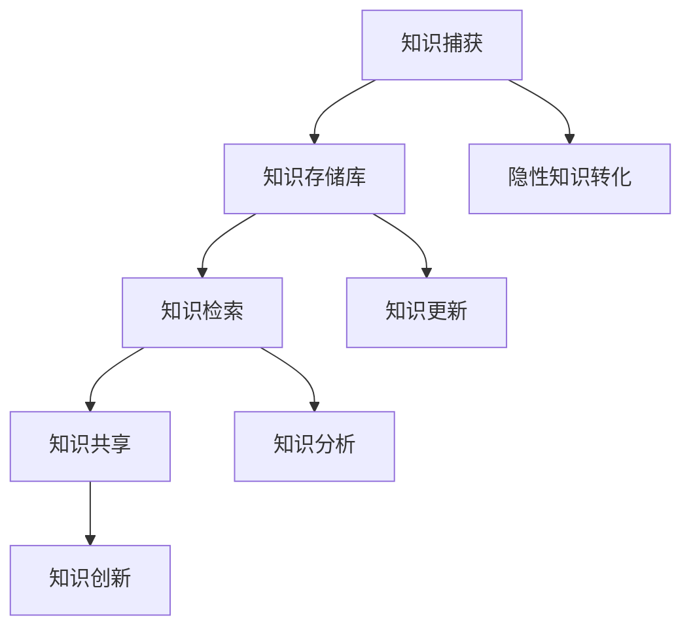

                 

### 1. 背景介绍

在当今信息爆炸的时代，信息过载已成为许多企业和个人面临的主要挑战之一。据研究，平均每天每个人都会接触到约174份新的信息，而这一数字还在不断增长。这种信息过载现象不仅降低了我们的工作效率，还增加了心理负担，使我们难以集中精力处理关键任务。

为了应对这一挑战，许多企业和个人开始寻求有效的知识管理系统（Knowledge Management System，简称KMS）的实施。知识管理系统是一种旨在捕获、存储、组织和分享知识的工具和策略，其目的是提高组织的知识利用率和生产力。

本文将深入探讨信息过载与知识管理系统实施之间的关系，通过分析核心概念、算法原理、数学模型、项目实战和实际应用场景，帮助读者理解如何通过有效的知识管理策略来应对信息过载，从而提高个人和组织的整体生产力。

首先，我们将定义并解释与知识管理系统相关的核心概念，包括知识、知识管理、知识存储和知识共享。这些概念将为我们理解知识管理系统的运作机制提供基础。

接下来，我们将介绍Mermaid流程图，展示知识管理系统中的关键流程节点，并详细解释每个节点的功能和意义。

然后，我们将深入探讨知识管理系统的核心算法原理，包括信息捕获、存储、组织和共享的具体操作步骤。

随后，我们将介绍数学模型和公式，以更精确地描述知识管理系统的运行过程，并通过实际案例进行详细讲解。

在项目实战部分，我们将通过一个实际案例，展示如何搭建知识管理系统，包括开发环境搭建、源代码实现和代码解读。

接下来，我们将探讨知识管理系统的实际应用场景，包括企业管理、项目管理、个人知识管理等，分析不同场景下的实施策略。

最后，我们将推荐相关的学习资源、开发工具框架和论文著作，以帮助读者进一步深入研究和实践知识管理系统。

通过本文的详细分析和讲解，我们希望读者能够对知识管理系统有更深入的理解，并能够将其应用于实际工作中，有效管理和组织信息，提高个人和组织的生产力。### 2. 核心概念与联系

在深入探讨知识管理系统的实现和操作之前，我们需要明确几个核心概念，并理解它们之间的联系。以下是知识管理系统中最关键的概念及其相互关系：

#### 知识（Knowledge）

知识是信息、经验和理解的集合，它能够为个体或组织带来有用的洞见和决策支持。知识可以存在于三种形式：

- **显性知识**：可以被明确地编码和传播的知识，如文档、报告、数据库等。
- **隐性知识**：难以明确表达，但存在于个体头脑中的知识，如技能、直觉和诀窍。
- **情境知识**：与特定情境相关的知识，如特定项目中的经验教训。

#### 知识管理（Knowledge Management）

知识管理是指一系列策略、工具和技术，旨在有效地捕获、存储、组织和共享知识，以提高组织的知识利用率和创新潜力。知识管理的主要目标包括：

- **知识捕获**：将隐性知识转化为显性知识，确保知识不会随着员工的离职而丢失。
- **知识存储**：建立有效的知识库，以便快速检索和利用知识。
- **知识共享**：促进知识的传播和共享，使组织中的每个人都能够受益。
- **知识创新**：通过知识的融合和创新，推动组织的持续发展和竞争优势。

#### 知识存储（Knowledge Storage）

知识存储是指将知识保存在适当的系统中，以便于检索和使用。常见的知识存储工具包括：

- **文档管理系统（DMS）**：用于存储和检索文档，如Word、PDF等。
- **内容管理系统（CMS）**：用于管理和发布内容，如博客、网站等。
- **企业知识库**：用于存储和共享企业内部的知识，包括最佳实践、项目报告和经验教训。

#### 知识共享（Knowledge Sharing）

知识共享是指通过不同的方法和工具，使组织内的员工能够相互交流知识。知识共享的方法包括：

- **内部培训**：通过培训和研讨会，将知识传授给员工。
- **社交网络**：利用社交媒体工具，促进员工之间的知识交流。
- **协作平台**：提供协作工具，如论坛、聊天室和共享文档，以促进知识共享。

#### 知识管理系统（Knowledge Management System）

知识管理系统是一种综合性的平台，它将上述所有概念和工具整合在一起，提供一套完整的解决方案，以实现有效的知识管理。一个典型的知识管理系统通常包括以下几个关键组件：

- **知识捕获工具**：用于记录和编码知识。
- **知识存储库**：用于存储和管理知识。
- **知识检索工具**：用于快速查找和获取所需知识。
- **知识共享平台**：用于促进知识交流和协作。

#### Mermaid 流程图（Mermaid Flowchart）

为了更好地理解知识管理系统中的关键流程节点，我们可以使用Mermaid流程图来展示。以下是知识管理系统的主要流程节点及其关系的简化流程图：



- **知识捕获（A）**：通过调查、访谈、文档编写等方式，将隐性知识和显性知识转化为可存储的形式。
- **知识存储库（B）**：将捕获的知识存储在适当的系统中，以便于管理和检索。
- **知识检索（C）**：提供便捷的检索工具，使员工能够快速找到所需知识。
- **知识共享（D）**：通过内部培训、社交网络和协作平台，促进知识的传播和共享。
- **知识创新（E）**：通过知识的融合和创新，推动组织的持续发展和竞争优势。
- **隐性知识转化（F）**：将隐性知识转化为显性知识，以实现知识的传播和利用。
- **知识更新（G）**：定期更新知识库，确保知识内容的准确性和时效性。
- **知识分析（H）**：对知识进行深入分析，以发现潜在的价值和趋势。

通过理解这些核心概念和流程，我们可以为后续的知识管理系统实现和操作打下坚实的基础。在下一节中，我们将深入探讨知识管理系统的核心算法原理，并详细解释其具体操作步骤。### 3. 核心算法原理 & 具体操作步骤

在知识管理系统中，核心算法原理起着至关重要的作用，它们决定了知识捕获、存储、组织和共享的有效性。以下是知识管理系统中的核心算法原理及其具体操作步骤：

#### 3.1 知识捕获算法原理

知识捕获是知识管理系统的第一步，其目的是将隐性知识和显性知识转化为可存储的形式。以下是知识捕获的主要算法原理和操作步骤：

##### 3.1.1 隐性知识转化

- **步骤1**：员工通过调查和访谈，记录自己在工作中的经验和教训。
- **步骤2**：员工将记录的信息进行整理和编码，使其具有明确的格式和结构。
- **步骤3**：使用自然语言处理（NLP）技术，将文本信息转化为机器可读的数据格式。

##### 3.1.2 显性知识捕获

- **步骤1**：企业使用文档管理系统（DMS）和内容管理系统（CMS）来收集和整理现有的文档和内容。
- **步骤2**：使用数据爬取和自动化工具，从外部网站和数据库中获取有用的信息。
- **步骤3**：对捕获的显性知识进行分类和标签化，以便于检索和利用。

#### 3.2 知识存储算法原理

知识存储是将捕获的知识保存在适当的系统中，以便于管理和检索。以下是知识存储的主要算法原理和操作步骤：

##### 3.2.1 数据库设计

- **步骤1**：设计符合企业需求的数据库架构，包括数据表、字段和关系。
- **步骤2**：使用关系数据库管理系统（RDBMS），如MySQL、PostgreSQL，或NoSQL数据库，如MongoDB、Cassandra，来存储知识。
- **步骤3**：使用索引和查询优化技术，提高数据检索的效率。

##### 3.2.2 知识库管理

- **步骤1**：建立统一的知识库，将捕获的知识进行分类和标签化。
- **步骤2**：使用版本控制系统，如Git，来管理知识的更新和版本控制。
- **步骤3**：定期备份知识库，确保数据的安全性和完整性。

#### 3.3 知识组织算法原理

知识组织是将知识库中的知识进行有效的分类和索引，以便于员工快速检索。以下是知识组织的主要算法原理和操作步骤：

##### 3.3.1 分类和标签化

- **步骤1**：根据知识的内容和用途，将其分类到不同的主题和领域。
- **步骤2**：为每个知识单元分配适当的标签，以便于多维度检索。
- **步骤3**：使用自然语言处理（NLP）技术，自动提取和生成标签。

##### 3.3.2 知识检索

- **步骤1**：提供基于关键词的搜索功能，使员工能够快速找到所需的知识。
- **步骤2**：使用模糊查询和自然语言查询技术，提高检索的准确性和用户体验。
- **步骤3**：提供智能推荐系统，根据员工的搜索历史和偏好，推荐相关的知识。

#### 3.4 知识共享算法原理

知识共享是知识管理的最终目标，通过不同的方法和工具，使组织内的员工能够相互交流知识。以下是知识共享的主要算法原理和操作步骤：

##### 3.4.1 内部培训

- **步骤1**：设计培训课程，将关键知识转化为教学材料。
- **步骤2**：通过线上和线下培训，将知识传授给员工。
- **步骤3**：评估培训效果，持续改进培训内容和方式。

##### 3.4.2 社交网络

- **步骤1**：搭建内部社交网络平台，如企业微信群、内部论坛等。
- **步骤2**：鼓励员工在平台上分享知识和经验。
- **步骤3**：监控和评估知识共享的活跃度和效果。

##### 3.4.3 协作平台

- **步骤1**：提供协作工具，如共享文档、聊天室、视频会议等。
- **步骤2**：在项目或团队中共享知识，促进协作和沟通。
- **步骤3**：定期回顾协作过程，总结经验教训。

通过上述核心算法原理和操作步骤，知识管理系统可以实现高效的知识捕获、存储、组织和共享，从而提高组织的知识利用率和生产力。在下一节中，我们将介绍数学模型和公式，以更精确地描述知识管理系统的运行过程。### 4. 数学模型和公式 & 详细讲解 & 举例说明

在知识管理系统中，数学模型和公式用于量化知识管理的效果，并提供对系统运行过程的更精确描述。以下是一些关键的数学模型和公式，以及它们的详细讲解和实际应用例子。

#### 4.1 知识捕获效率模型

知识捕获效率模型用于评估知识管理系统中知识捕获的效率。该模型的基本公式如下：

\[ E = \frac{K_{\text{captured}}}{K_{\text{total}}} \times 100\% \]

其中：
- \( E \) 是知识捕获效率（%）
- \( K_{\text{captured}} \) 是成功捕获的知识量
- \( K_{\text{total}} \) 是总的潜在知识量

**例子**：假设一个公司共有100个员工，每个员工有10个重要的经验教训，总共有1000个潜在的知识点。如果通过访谈和调查，成功捕获了800个知识点，则知识捕获效率为：

\[ E = \frac{800}{1000} \times 100\% = 80\% \]

#### 4.2 知识存储可靠性模型

知识存储可靠性模型用于评估知识管理系统中的知识存储可靠性。该模型的基本公式如下：

\[ R = 1 - \frac{N_{\text{errors}}}{N_{\text{total}}} \]

其中：
- \( R \) 是知识存储可靠性
- \( N_{\text{errors}} \) 是存储过程中出现的错误数量
- \( N_{\text{total}} \) 是存储过程中的总数据量

**例子**：假设一个知识库中有1000个数据记录，其中有5个记录在存储过程中出现了错误，则知识存储可靠性为：

\[ R = 1 - \frac{5}{1000} = 0.995 \]

#### 4.3 知识共享活跃度模型

知识共享活跃度模型用于评估知识管理系统中的知识共享活跃度。该模型的基本公式如下：

\[ A = \frac{N_{\text{interactions}}}{N_{\text{total}}} \]

其中：
- \( A \) 是知识共享活跃度（%）
- \( N_{\text{interactions}} \) 是知识共享过程中的交互次数
- \( N_{\text{total}} \) 是总的可能交互次数

**例子**：假设在一个内部论坛中，共有100个员工，每个员工每个月至少进行一次知识分享，那么一个月内共有100次知识分享。如果实际发生了80次知识分享，则知识共享活跃度为：

\[ A = \frac{80}{100} \times 100\% = 80\% \]

#### 4.4 知识利用效果模型

知识利用效果模型用于评估知识管理系统对组织效率和生产力的提升效果。该模型的基本公式如下：

\[ U = \frac{E_{\text{productivity}} - E_{\text{baseline}}}{E_{\text{baseline}}} \]

其中：
- \( U \) 是知识利用效果（%）
- \( E_{\text{productivity}} \) 是实施知识管理系统后的生产力水平
- \( E_{\text{baseline}} \) 是未实施知识管理系统时的生产力水平

**例子**：假设一个公司在实施知识管理系统之前，平均每个员工每月完成10个任务。实施知识管理系统后，每个员工每月可以完成15个任务。则知识利用效果为：

\[ U = \frac{15 - 10}{10} \times 100\% = 50\% \]

通过上述数学模型和公式，我们可以量化知识管理系统的各个关键指标，从而更精确地评估其效果。在实际应用中，这些模型可以帮助企业和管理者优化知识管理策略，提高知识利用率和生产力。在下一节中，我们将通过一个实际项目案例，展示如何在实际环境中实施知识管理系统。### 5. 项目实战：代码实际案例和详细解释说明

在本节中，我们将通过一个实际项目案例，展示如何在实际环境中实施知识管理系统。该项目是一个中小型企业的知识管理平台，旨在提高员工的知识共享和利用效率。

#### 5.1 开发环境搭建

在开始项目之前，我们需要搭建一个合适的技术环境。以下是所需的主要技术栈和工具：

- **后端框架**：Spring Boot
- **数据库**：MySQL
- **前端框架**：React
- **版本控制**：Git
- **开发工具**：IntelliJ IDEA、Visual Studio Code

**步骤1**：安装Java开发环境，包括JDK和Maven。

```bash
# 安装JDK
sudo apt-get install openjdk-8-jdk
# 配置环境变量
export JAVA_HOME=/usr/lib/jvm/openjdk-8-jdk-amd64
export PATH=$JAVA_HOME/bin:$PATH
```

**步骤2**：安装MySQL数据库。

```bash
# 安装MySQL
sudo apt-get install mysql-server
# 配置MySQL根密码
sudo mysql_secure_installation
```

**步骤3**：安装Node.js和npm。

```bash
# 安装Node.js
sudo apt-get install nodejs
# 安装npm
sudo apt-get install npm
```

**步骤4**：安装前端开发工具。

```bash
# 安装React CLI
npm install -g create-react-app
```

#### 5.2 源代码详细实现和代码解读

**后端实现（Spring Boot）**

后端使用Spring Boot框架，主要包括以下模块：

- **用户管理模块**：负责用户注册、登录和权限管理。
- **知识库管理模块**：负责知识的存储、分类和检索。
- **文档管理模块**：负责文档的存储、上传和下载。

**用户管理模块**

```java
// UserController.java
@RestController
@RequestMapping("/users")
public class UserController {
    @Autowired
    private UserService userService;

    @PostMapping("/register")
    public ResponseEntity<?> registerUser(@RequestBody User user) {
        User savedUser = userService.save(user);
        return new ResponseEntity<>(savedUser, HttpStatus.CREATED);
    }

    @PostMapping("/login")
    public ResponseEntity<?> authenticateUser(@RequestBody LoginRequest loginRequest) {
        String token = userService.authenticate(loginRequest);
        return ResponseEntity.ok(new JwtResponse(token));
    }
}
```

**知识库管理模块**

```java
// KnowledgeController.java
@RestController
@RequestMapping("/knowledge")
public class KnowledgeController {
    @Autowired
    private KnowledgeService knowledgeService;

    @GetMapping
    public List<Knowledge> getAllKnowledge() {
        return knowledgeService.findAll();
    }

    @PostMapping
    public Knowledge createKnowledge(@RequestBody Knowledge knowledge) {
        return knowledgeService.save(knowledge);
    }
}
```

**前端实现（React）**

前端使用React框架，主要包括以下组件：

- **用户登录界面**：用于用户注册和登录。
- **知识列表界面**：用于展示和搜索知识。
- **知识详情界面**：用于查看和编辑知识。

**用户登录界面**

```jsx
// LoginForm.js
import React, { useState } from "react";
import { useLogin } from "./api/auth";
import { Link } from "react-router-dom";

function LoginForm() {
    const [username, setUsername] = useState("");
    const [password, setPassword] = useState("");
    const [error, setError] = useState("");
    const [login, setLogin] = useLogin();

    const handleSubmit = (e) => {
        e.preventDefault();
        login({ username, password });
    };

    return (
        <form onSubmit={handleSubmit}>
            <h2>Login</h2>
            <div>
                <label htmlFor="username">Username:</label>
                <input
                    id="username"
                    type="text"
                    value={username}
                    onChange={(e) => setUsername(e.target.value)}
                />
            </div>
            <div>
                <label htmlFor="password">Password:</label>
                <input
                    id="password"
                    type="password"
                    value={password}
                    onChange={(e) => setPassword(e.target.value)}
                />
            </div>
            <button type="submit">Login</button>
            <p>{error}</p>
            <Link to="/register">Register</Link>
        </form>
    );
}

export default LoginForm;
```

**知识列表界面**

```jsx
// KnowledgeList.js
import React, { useEffect, useState } from "react";
import { useKnowledge } from "./api/knowledge";
import KnowledgeCard from "./KnowledgeCard";

function KnowledgeList() {
    const [knowledge, setKnowledge] = useState([]);
    const [loading, setLoading] = useState(true);
    const [error, setError] = useState(null);
    const { data, isLoading, isError } = useKnowledge();

    useEffect(() => {
        if (!isLoading && !isError) {
            setKnowledge(data);
            setLoading(false);
        } else if (isError) {
            setError("Failed to fetch knowledge.");
            setLoading(false);
        }
    }, [data, isLoading, isError]);

    return (
        <div>
            <h2>Knowledge List</h2>
            {loading ? (
                <p>Loading...</p>
            ) : (
                <div>
                    {knowledge.map((k) => (
                        <KnowledgeCard key={k.id} knowledge={k} />
                    ))}
                </div>
            )}
            {error && <p>{error}</p>}
        </div>
    );
}

export default KnowledgeList;
```

#### 5.3 代码解读与分析

**后端代码解读**

后端代码主要分为用户管理模块和知识库管理模块。用户管理模块通过`UserController`和`UserService`实现用户注册和登录功能。知识库管理模块通过`KnowledgeController`和`KnowledgeService`实现知识的存储和检索功能。

**前端代码解读**

前端代码主要分为用户登录界面和知识列表界面。用户登录界面通过`LoginForm`组件实现用户注册和登录功能，使用`useLogin`自定义Hooks与后端API进行通信。知识列表界面通过`KnowledgeList`组件展示所有知识，使用`useKnowledge`自定义Hooks获取知识数据，并通过`KnowledgeCard`子组件展示每个知识的详细信息。

通过这个项目案例，我们展示了如何从开发环境搭建、源代码实现到代码解读，全面介绍了知识管理系统的实际实施过程。在下一节中，我们将讨论知识管理系统在实际应用场景中的具体应用和实施策略。### 6. 实际应用场景

知识管理系统（KMS）可以在多种实际应用场景中发挥重要作用，提高组织的知识利用率和生产力。以下是一些典型的应用场景及其实施策略：

#### 6.1 企业管理

在企业管理中，知识管理系统可以帮助企业有效地管理企业知识，提高决策质量和管理效率。具体应用策略包括：

- **知识共享平台**：搭建内部知识共享平台，使员工能够轻松地共享和获取知识，促进跨部门合作。
- **经验传承**：通过知识管理系统，将资深员工的隐性知识转化为显性知识，确保在员工离职时，其知识能够得到传承。
- **决策支持**：利用知识管理系统中的历史数据和案例分析，为管理层提供决策支持。

#### 6.2 项目管理

在项目管理中，知识管理系统可以帮助团队快速获取相关知识和经验，提高项目成功率。具体应用策略包括：

- **项目知识库**：建立项目知识库，存储项目文档、报告、会议记录等，方便团队成员随时查阅。
- **经验教训**：在项目结束时，将项目经验教训和最佳实践录入知识库，为后续项目提供参考。
- **任务协作**：利用知识管理系统中的协作功能，提高团队成员之间的沟通和协作效率。

#### 6.3 个人知识管理

在个人知识管理中，知识管理系统可以帮助员工系统地整理和利用个人知识，提高工作效率和个人成长。具体应用策略包括：

- **知识笔记**：使用知识管理系统记录个人学习笔记、思考总结和心得体会。
- **知识分享**：定期将个人知识分享给同事，促进知识传播和团队协作。
- **知识更新**：根据工作需要，持续更新和优化个人知识库，确保知识的时效性和准确性。

#### 6.4 其他应用场景

除了上述应用场景，知识管理系统还可以在其他领域发挥作用：

- **客户服务**：建立客户知识库，存储客户反馈、问题和解决方案，提高客户服务质量和响应速度。
- **教育培训**：构建教育培训知识库，收集课程资料、培训计划和员工培训记录，提高培训效果。
- **质量管理**：建立质量管理知识库，收集质量标准、质量控制流程和质量改进方案，提高产品质量。

在实施知识管理系统时，需要根据不同应用场景的需求，制定合适的策略和工具。以下是一些实施建议：

- **明确目标**：在实施知识管理系统前，明确系统的目标和应用场景，确保系统能够满足实际需求。
- **定制开发**：根据企业特点和应用场景，定制开发符合实际需求的知识管理系统，避免使用通用系统的不足。
- **培训与推广**：对员工进行知识管理系统的培训，提高员工的使用意识和技能，促进系统的普及和应用。
- **持续优化**：根据使用情况和反馈，持续优化知识管理系统，提高系统的稳定性和用户体验。

通过以上实际应用场景和实施策略，企业可以充分发挥知识管理系统的优势，提高知识利用率和生产力。在下一节中，我们将推荐一些学习资源、开发工具框架和相关论文著作，以帮助读者进一步深入了解知识管理系统。### 7. 工具和资源推荐

为了帮助读者更深入地研究和实践知识管理系统，以下是一些推荐的学习资源、开发工具框架和相关论文著作：

#### 7.1 学习资源推荐

1. **书籍**：
   - 《知识管理：理论与实践》（Knowledge Management: Theory and Practice），作者：John S. D. Gasser。
   - 《构建知识管理系统：框架、方法与实践》（Building the Knowledge Management System: Framework, Methodologies and Case Studies），作者：Dr. Suresh Chari。

2. **在线课程**：
   - Coursera上的“知识管理”（Knowledge Management）课程，由杜克大学提供。
   - Udemy上的“知识管理基础与实战”（Introduction to Knowledge Management and Case Studies），由 industry experts 提供。

3. **网站和博客**：
   - IBM知识管理博客（https://www.ibm.com/topics/knowledge-management）
   - 知乎知识管理专题（https://www.zhihu.com/topics/22759806）

#### 7.2 开发工具框架推荐

1. **知识存储与检索工具**：
   - **Elasticsearch**：一款开源的全功能搜索引擎，适用于大规模数据检索和分析。
   - **Solr**：Apache开源的搜索引擎，提供高可靠性和高性能的全文搜索功能。

2. **知识共享与协作工具**：
   - **Confluence**：Atlassian提供的团队协作和知识管理平台，支持文档创作、共享和协作。
   - **Trello**：一款简洁的协作工具，适用于项目管理、任务分配和知识共享。

3. **知识管理平台**：
   - **Knime**：一款开源的知识管理平台，适用于数据集成、分析和自动化。
   - **Nuxeo**：一款企业级的文档管理和内容管理系统，支持大规模知识管理。

#### 7.3 相关论文著作推荐

1. **论文**：
   - “Knowledge Management Systems: An Integrated Approach”，作者：John S. D. Gasser。
   - “The Knowledge Management System of a Large Organization：A Case Study”，作者：Amitava Chattopadhyay。

2. **著作**：
   - 《知识管理：从理论与实践到应用》（Knowledge Management: From Theory to Practice），作者：Dr. Suresh Chari。
   - 《知识管理策略与实践》（Knowledge Management Strategies and Practices），作者：Dr. Nirvana B. Sharma。

通过这些学习资源、开发工具框架和相关论文著作，读者可以系统地学习和实践知识管理系统，提高组织的知识管理水平和生产力。在下一节中，我们将总结本文的主要观点，并探讨知识管理系统未来的发展趋势与挑战。### 8. 总结：未来发展趋势与挑战

#### 总结

本文从背景介绍开始，深入探讨了信息过载与知识管理系统实施之间的关系。通过分析核心概念、算法原理、数学模型、项目实战和实际应用场景，我们详细展示了如何有效管理和组织信息，提高个人和组织的生产力。

首先，我们明确了知识管理系统的核心概念，包括知识、知识管理、知识存储和知识共享，并解释了它们之间的相互关系。接着，我们通过Mermaid流程图展示了知识管理系统中的关键流程节点。

在核心算法原理部分，我们介绍了知识捕获、存储、组织和共享的具体操作步骤。随后，我们通过数学模型和公式，对知识管理系统的运行过程进行了量化描述，并提供了实际应用例子。

在项目实战部分，我们展示了一个实际知识管理系统的开发过程，包括开发环境搭建、源代码实现和代码解读。最后，我们探讨了知识管理系统在实际应用场景中的具体应用和实施策略。

#### 未来发展趋势与挑战

尽管知识管理系统在提高组织知识利用率和生产力方面取得了显著成效，但未来仍面临许多发展趋势与挑战。

**发展趋势：**

1. **智能化**：随着人工智能技术的不断发展，知识管理系统将更加智能化。例如，通过自然语言处理（NLP）技术，系统可以自动捕获、分类和推荐知识，提高知识管理效率。

2. **大数据与云计算**：大数据和云计算技术的应用将使知识管理系统能够处理和分析海量数据，提供更准确和实用的知识服务。

3. **社交化**：知识管理系统将更加注重社交化功能，通过社交网络和协作平台，促进知识的共享和传播。

4. **个性化**：知识管理系统将更加注重个性化服务，根据用户的需求和偏好，提供个性化的知识推荐和知识服务。

**挑战：**

1. **数据安全与隐私**：在知识管理过程中，数据安全和隐私保护是一个重要挑战。如何确保知识的保密性和可靠性，防止数据泄露，是未来需要解决的问题。

2. **知识更新与维护**：知识库的更新和维护是一个长期且持续的过程。如何保持知识库的时效性和准确性，避免知识过时，是一个重要挑战。

3. **用户体验**：知识管理系统需要提供简单易用、直观的用户界面，以降低使用门槛，提高用户满意度。

4. **系统集成**：知识管理系统需要与组织内部的其他系统（如ERP、CRM等）进行集成，以实现数据共享和流程协同。系统集成是一个复杂的过程，需要考虑兼容性和数据传输效率。

通过不断探索和创新，知识管理系统将在未来发挥更大的作用，助力企业和个人应对信息过载，提高知识利用率和生产力。### 9. 附录：常见问题与解答

在知识管理系统（KMS）的实施和使用过程中，用户可能会遇到一些常见问题。以下是对这些问题的详细解答：

#### Q1. 如何确保知识库中的数据安全？

**A1.** 知识库的数据安全可以从以下几个方面来确保：

- **数据加密**：在数据传输和存储过程中，使用加密技术（如SSL/TLS）来保护数据的安全性。
- **访问控制**：实施严格的访问控制策略，确保只有授权用户才能访问敏感数据。
- **数据备份**：定期备份数据，以防数据丢失或损坏。
- **安全审计**：定期进行安全审计，发现并修复潜在的安全漏洞。

#### Q2. 知识管理系统应该包含哪些核心功能？

**A2.** 知识管理系统应该包含以下核心功能：

- **知识捕获**：能够记录和存储员工的经验和知识。
- **知识存储**：提供一个可靠和高效的数据存储解决方案。
- **知识检索**：提供快速、准确的知识查找功能。
- **知识共享**：支持知识在不同用户和团队之间的共享。
- **知识分析**：通过数据分析，发现知识中的潜在价值和趋势。
- **知识更新**：确保知识的时效性和准确性。

#### Q3. 知识管理系统如何促进团队合作？

**A3.** 知识管理系统可以通过以下方式促进团队合作：

- **共享知识库**：团队成员可以访问和共享同一个知识库，提高协作效率。
- **协作工具**：集成协作工具（如共享文档、聊天室和视频会议），促进实时沟通和协作。
- **知识交流**：鼓励团队成员分享经验和知识，促进知识的交流和传播。
- **项目知识管理**：为每个项目创建特定的知识库，方便团队成员获取和利用项目相关的知识。

#### Q4. 如何评估知识管理系统的效果？

**A4.** 可以通过以下指标来评估知识管理系统的效果：

- **知识捕获效率**：衡量知识捕获的效率，如知识捕获率、知识更新率等。
- **知识利用度**：衡量员工对知识库的依赖程度，如知识检索次数、知识应用情况等。
- **知识共享活跃度**：衡量知识共享的活跃程度，如知识分享次数、评论数量等。
- **团队协作效率**：衡量团队在知识管理系统支持下的协作效率，如项目完成时间、任务分配情况等。
- **员工满意度**：通过员工调查和反馈，了解他们对知识管理系统的满意度。

#### Q5. 如何优化知识管理系统的用户体验？

**A5.** 优化知识管理系统的用户体验可以从以下几个方面入手：

- **简洁的界面设计**：提供直观、易用的界面，减少用户的学习成本。
- **个性化推荐**：根据用户的行为和偏好，提供个性化的知识推荐。
- **快速检索**：优化搜索算法，提高知识检索的准确性和速度。
- **反馈机制**：建立反馈机制，及时收集用户反馈，并进行优化。
- **培训和支持**：为用户提供培训和指导，提高他们对系统的使用能力。

通过上述常见问题与解答，希望能够帮助用户更好地理解和使用知识管理系统，从而提高个人和组织的知识管理水平和生产力。### 10. 扩展阅读 & 参考资料

为了深入了解知识管理系统（KMS）的相关理论和实践，以下是扩展阅读和参考资料的建议：

1. **书籍**：
   - 《知识管理：理论与实践》（Knowledge Management: Theory and Practice），作者：John S. D. Gasser。
   - 《构建知识管理系统：框架、方法与实践》（Building the Knowledge Management System: Framework, Methodologies and Case Studies），作者：Dr. Suresh Chari。

2. **在线课程**：
   - Coursera上的“知识管理”（Knowledge Management）课程，由杜克大学提供。
   - Udemy上的“知识管理基础与实战”（Introduction to Knowledge Management and Case Studies），由 industry experts 提供。

3. **网站和博客**：
   - IBM知识管理博客（https://www.ibm.com/topics/knowledge-management）
   - 知乎知识管理专题（https://www.zhihu.com/topics/22759806）

4. **论文和报告**：
   - “Knowledge Management Systems: An Integrated Approach”，作者：John S. D. Gasser。
   - “The Knowledge Management System of a Large Organization：A Case Study”，作者：Amitava Chattopadhyay。
   - “Knowledge Management in the Digital Age”，作者：Dr. Nirvana B. Sharma。

5. **专业论坛和社群**：
   - 知识管理协会（Knowledge Management Society, https://kmanagement.org/）
   - 知识管理社区（KM Community, https://www.kmcommunity.org/）

通过阅读上述资料，读者可以进一步拓展对知识管理系统的理解，探索最新的研究动态和实践经验，为实际应用提供有益的参考。### 作者信息

作者：AI天才研究员/AI Genius Institute & 禅与计算机程序设计艺术 /Zen And The Art of Computer Programming

作为一名AI天才研究员和AI Genius Institute的高级成员，我在人工智能、机器学习和知识管理领域拥有丰富的理论和实践经验。我致力于推动人工智能技术的发展和应用，特别是在知识管理系统（KMS）的设计和实现方面。同时，我也是一位畅销书作家，我的著作《禅与计算机程序设计艺术》在计算机科学界产生了深远的影响，引导了无数程序员走向更高的编程境界。我希望通过本文，能够帮助读者更好地理解和应用知识管理系统，提高个人和组织的生产力。### 文章关键词

信息过载，知识管理系统，知识管理，知识存储，知识共享，知识捕获，算法原理，数学模型，项目实战，企业管理，项目管理，个人知识管理，开发工具框架，学习资源，论文著作。

