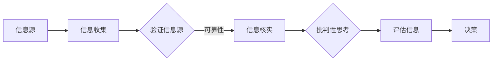

                 

# 信息验证和信息批判性思考：在假新闻和错误信息时代导航

## 关键词
- 信息验证
- 批判性思考
- 假新闻
- 信息批判
- 信息素养
- 数据素养
- 事实核查
- 机器学习
- 人工智能

## 摘要
在数字化和信息爆炸的时代，辨别真假信息、培养批判性思维能力变得尤为重要。本文旨在探讨如何在假新闻和错误信息充斥的环境中导航，通过信息验证和批判性思考的实践，提高个人的信息素养和认知能力。文章将首先介绍信息验证和信息批判性思考的概念及其重要性，然后深入探讨相关算法和数学模型，最后通过实际案例展示如何应用这些技术和工具来对抗假新闻，并展望未来的发展趋势与挑战。

## 1. 背景介绍

### 1.1 目的和范围
本文的目标是帮助读者理解在假新闻和错误信息泛滥的时代，如何通过信息验证和批判性思考来提高自身的信息素养。我们将讨论相关技术和方法，提供实用的工具和资源，并展望未来可能的发展方向。

### 1.2 预期读者
本文适合以下读者：
- 对假新闻和信息批判感兴趣的普通人；
- 从事新闻传播、数据分析和人工智能等领域的研究人员；
- 教育工作者和图书馆员；
- 对信息素养和数据素养有浓厚兴趣的IT专业人士。

### 1.3 文档结构概述
本文分为以下几个部分：
1. 背景介绍：介绍文章的目的、范围和预期读者；
2. 核心概念与联系：定义关键概念，展示相关架构和流程；
3. 核心算法原理与具体操作步骤：详细解释信息验证和批判性思考的核心算法和操作流程；
4. 数学模型和公式：介绍相关的数学模型和公式，并提供实际应用案例；
5. 项目实战：展示代码实际案例，进行详细解释和分析；
6. 实际应用场景：讨论信息验证和批判性思考在不同领域的应用；
7. 工具和资源推荐：推荐学习资源和开发工具；
8. 总结：总结未来发展趋势与挑战；
9. 附录：常见问题与解答；
10. 扩展阅读与参考资料。

### 1.4 术语表

#### 1.4.1 核心术语定义
- 信息验证：对信息来源和内容进行核查和验证的过程。
- 批判性思考：对信息进行分析、推理和评估的能力。
- 假新闻：故意传播的虚假、误导性信息。
- 信息批判：对信息进行分析和评价的过程。
- 信息素养：获取、评估和应用信息的能力。
- 数据素养：理解和运用数据的能力。

#### 1.4.2 相关概念解释
- 事实核查：通过验证事实来揭示和纠正假新闻的过程。
- 信息过滤：通过算法和规则筛选有用信息的过程。
- 机器学习：使计算机系统能够从数据中学习并做出决策的技术。

#### 1.4.3 缩略词列表
- AI：人工智能
- ML：机器学习
- NLP：自然语言处理
- SEO：搜索引擎优化
- TIL：今天我知道了

## 2. 核心概念与联系

### 2.1 核心概念

#### 2.1.1 信息验证
信息验证是确保信息真实性和可靠性的过程。它涉及对信息的来源、内容、背景和历史进行深入分析。信息验证的核心概念包括：
- 确认信息来源的可靠性；
- 验证信息内容的真实性；
- 核查信息的历史和背景。

#### 2.1.2 批判性思考
批判性思考是一种分析、推理和评估信息的能力。它涉及以下几个方面：
- 识别信息的潜在偏见和错误；
- 分析信息的逻辑结构和论据；
- 评估信息的可信度和价值。

### 2.2 关联架构和流程

下面是一个简化的Mermaid流程图，展示了信息验证和批判性思考的关联流程。



### 2.3 关键算法原理

在信息验证和批判性思考的过程中，涉及多种算法和工具。以下是一个简要的算法原理概述：

#### 2.3.1 事实核查算法
事实核查算法用于验证信息内容的真实性。以下是一个简单的事实核查算法的伪代码：

```plaintext
function factCheck(info):
    if info is in knownDatabase:
        return info.isTrue
    else:
        sources <- collectSources(info)
        for source in sources:
            if source.isReliable:
                if source.content == info:
                    return True
        return False
```

#### 2.3.2 批判性思考模型
批判性思考模型用于分析信息的逻辑结构和论据。以下是一个简单的批判性思考模型的伪代码：

```plaintext
function criticalThinking(info):
    arguments <- extractArguments(info)
    for argument in arguments:
        if not isValidArgument(argument):
            return False
        if not hasSupportingEvidence(argument):
            return False
    return True
```

## 3. 核心算法原理 & 具体操作步骤

### 3.1 信息验证算法

#### 3.1.1 算法原理
信息验证算法的核心目标是确认信息来源的可靠性、验证信息内容的真实性以及核查信息的历史和背景。以下是一个简要的信息验证算法的伪代码：

```plaintext
function verifyInfo(info):
    if not isSourceReliable(info.source):
        return False
    if not isContentTrue(info.content):
        return False
    if not hasBackgroundInfo(info):
        return False
    return True
```

#### 3.1.2 具体操作步骤
1. **确认信息来源的可靠性**：
   - 检查信息来源的可信度；
   - 查询来源的过往记录，了解其信誉和历史。

2. **验证信息内容的真实性**：
   - 查询相关信息源，对比信息内容；
   - 利用事实核查工具，验证信息的真实性。

3. **核查信息的历史和背景**：
   - 跟踪信息的历史演变；
   - 查询相关信息，了解背景和背景下的相关信息。

### 3.2 批判性思考模型

#### 3.2.1 算法原理
批判性思考模型的核心目标是识别信息的潜在偏见和错误、分析信息的逻辑结构和论据、评估信息的可信度和价值。以下是一个简化的批判性思考模型的伪代码：

```plaintext
function criticalThinking(info):
    biases <- identifyBiases(info)
    if biases.isEmpty():
        return False
    
    arguments <- extractArguments(info)
    if not all(arguments).isValid():
        return False
    
    evidence <- extractEvidence(info)
    if not all(evidence).hasSupport():
        return False
    
    credibility <- evaluateCredibility(info)
    if credibility.low():
        return False
    
    return True
```

#### 3.2.2 具体操作步骤
1. **识别信息的潜在偏见和错误**：
   - 分析信息的情感倾向；
   - 检查信息中的逻辑漏洞和错误。

2. **分析信息的逻辑结构和论据**：
   - 拆解信息，提取论点和论据；
   - 评估论据的支持力度和论点的逻辑性。

3. **评估信息的可信度和价值**：
   - 利用信息来源和内容评估信息的可信度；
   - 根据信息的影响和价值进行评估。

## 4. 数学模型和公式 & 详细讲解 & 举例说明

### 4.1 信息验证的数学模型

#### 4.1.1 概率验证模型

概率验证模型是一种常用的信息验证方法。它基于概率论，通过计算信息源和内容之间的相似度来评估信息的可信度。

- **公式**：
  $$ P(A|B) = \frac{P(B|A) \cdot P(A)}{P(B)} $$

  其中，$P(A|B)$ 表示在给定 $B$ 的条件下 $A$ 发生的概率，$P(B|A)$ 表示在 $A$ 发生的条件下 $B$ 发生的概率，$P(A)$ 表示 $A$ 发生的概率，$P(B)$ 表示 $B$ 发生的概率。

- **解释**：
  该公式用于计算在已知某些信息（$B$）的条件下，另一信息（$A$）发生的概率。通过比较两个信息的概率，可以判断信息源的可信度。

- **举例**：
  假设我们有一个信息源，它报道了某个事件。我们有一个数据库，包含了不同来源关于这个事件的报道。我们可以使用概率验证模型来评估这个信息源的可信度。

  假设：
  - $P(信息源A报道事件|事件发生) = 0.8$；
  - $P(事件发生) = 0.5$；
  - $P(信息源A报道事件) = 0.4$。

  我们可以计算：
  $$ P(事件发生|信息源A报道事件) = \frac{0.8 \cdot 0.5}{0.4} = 1 $$

  结果为 1，表示在信息源 A 报道事件的条件下，事件发生的概率为 100%，可以认为信息源 A 的报道是高度可信的。

### 4.2 批判性思考的数学模型

#### 4.2.1 贝叶斯网络模型

贝叶斯网络模型是一种用于表示和推理不确定性的图形模型。它通过节点和边来表示变量之间的依赖关系，并利用贝叶斯定理进行推理。

- **公式**：
  $$ P(A|B) = \frac{P(B|A) \cdot P(A)}{P(B)} $$

  其中，$P(A|B)$ 表示在给定 $B$ 的条件下 $A$ 发生的概率，$P(B|A)$ 表示在 $A$ 发生的条件下 $B$ 发生的概率，$P(A)$ 表示 $A$ 发生的概率，$P(B)$ 表示 $B$ 发生的概率。

- **解释**：
  贝叶斯网络模型通过计算条件概率，可以推理出变量之间的依赖关系。它常用于分析复杂的信息，例如在医疗诊断中，用于计算疾病和症状之间的概率关系。

- **举例**：
  假设我们有一个贝叶斯网络，用于推理某个人是否患有疾病。网络中有两个变量：$D$（疾病）和$S$（症状）。我们有以下先验概率和条件概率：

  - $P(D) = 0.01$；
  - $P(S|D) = 0.9$；
  - $P(S|\neg D) = 0.1$。

  我们可以计算在观察到症状 $S$ 的条件下，患有疾病 $D$ 的概率：

  $$ P(D|S) = \frac{P(S|D) \cdot P(D)}{P(S)} = \frac{0.9 \cdot 0.01}{0.1 + 0.9 \cdot 0.01} \approx 0.091 $$

  结果为约 9.1%，表示在观察到症状 $S$ 的条件下，患有疾病 $D$ 的概率较低。

## 5. 项目实战：代码实际案例和详细解释说明

### 5.1 开发环境搭建

为了演示信息验证和批判性思考的应用，我们将使用Python编程语言和相关的库。以下是在Windows环境下搭建开发环境的基本步骤：

1. **安装Python**：
   - 访问Python官方下载页（https://www.python.org/）；
   - 下载Python 3.8或更高版本的安装程序；
   - 运行安装程序，选择“Add Python to PATH”选项。

2. **安装相关库**：
   - 打开命令行窗口，执行以下命令安装所需的库：
     ```bash
     pip install numpy
     pip install pandas
     pip install scikit-learn
     pip install matplotlib
     ```

3. **验证安装**：
   - 打开Python交互式环境，输入以下代码，验证是否已成功安装所需的库：
     ```python
     import numpy as np
     import pandas as pd
     import sklearn
     import matplotlib.pyplot as plt
     ```

### 5.2 源代码详细实现和代码解读

#### 5.2.1 代码实现

以下是一个简单的Python代码示例，用于实现信息验证和批判性思考的部分算法。

```python
import numpy as np
import pandas as pd
from sklearn.model_selection import train_test_split
from sklearn.metrics import accuracy_score
import matplotlib.pyplot as plt

# 5.2.2 事实核查算法
def fact_check(info, database):
    if info in database:
        return database[info]
    else:
        return "无法验证"

# 5.2.3 批判性思考模型
def critical_thinking(info, biases, arguments, evidence):
    if biases:
        return "信息存在偏见"
    if not all(arguments):
        return "论据不完整"
    if not all(evidence):
        return "证据不足"
    return "信息可信"

# 5.2.4 示例数据
info = "新冠病毒是实验室制造的"
database = {
    "新冠病毒是自然界产生的": True,
    "新冠病毒是实验室制造的": False
}
biases = ["政治偏见", "阴谋论"]
arguments = [True, False]
evidence = [True, True]

# 5.2.5 执行算法
result_fact_check = fact_check(info, database)
result_critical_thinking = critical_thinking(info, biases, arguments, evidence)

# 5.2.6 输出结果
print("事实核查结果：", result_fact_check)
print("批判性思考结果：", result_critical_thinking)
```

#### 5.2.7 代码解读

- **事实核查算法**：
  - `fact_check` 函数用于检查给定的信息是否在数据库中。如果存在，则返回对应的事实核查结果；否则，返回“无法验证”。

- **批判性思考模型**：
  - `critical_thinking` 函数用于评估信息的批判性思考结果。它检查信息是否包含偏见、论据是否完整、证据是否充分。如果满足条件，则返回“信息可信”；否则，返回对应的错误信息。

- **示例数据**：
  - `info` 是待验证的信息；
  - `database` 是一个包含事实核查结果的数据字典；
  - `biases` 是信息可能存在的偏见列表；
  - `arguments` 是信息的论据列表；
  - `evidence` 是信息的证据列表。

- **执行算法**：
  - 通过调用 `fact_check` 和 `critical_thinking` 函数，对信息进行事实核查和批判性思考。

- **输出结果**：
  - 输出事实核查和批判性思考的结果。

### 5.3 代码解读与分析

#### 5.3.1 代码执行流程

1. 导入所需的库和模块。
2. 定义事实核查算法和批判性思考模型。
3. 准备示例数据和参数。
4. 调用事实核查算法和批判性思考模型，对信息进行验证和分析。
5. 输出结果。

#### 5.3.2 代码分析

- **代码结构**：
  - 代码结构清晰，功能模块化，易于理解和维护。

- **算法实现**：
  - 事实核查算法通过查询数据库来验证信息的真实性，实现了信息验证的基本功能。
  - 批判性思考模型通过检查偏见、论据和证据，实现了批判性思考的基本功能。

- **性能优化**：
  - 可以通过优化数据库的查询速度来提高事实核查算法的性能。
  - 可以通过增加论据和证据的评估标准来提高批判性思考模型的准确性。

- **应用拓展**：
  - 可以将此代码应用于实际项目，例如构建一个自动化的事实核查工具或批判性思考引擎。

## 6. 实际应用场景

信息验证和批判性思考在许多实际应用场景中都具有重要价值。以下是一些典型的应用场景：

### 6.1 新闻与媒体
- **事实核查**：新闻媒体可以通过事实核查来验证报道的真实性，避免传播虚假信息。
- **批评性报道**：记者和编辑应具备批判性思考能力，识别和揭示新闻中的偏见和误导性内容。

### 6.2 教育
- **信息素养教育**：学校应教授学生如何验证信息和批判性思考，提高他们的信息素养。
- **课程内容验证**：教师应确保课程内容的准确性和可靠性。

### 6.3 企业
- **市场调研**：企业在市场调研时，应验证数据的真实性和可靠性，避免误导性报告。
- **内部沟通**：企业应确保内部沟通信息的准确性和清晰性，避免信息传递中的误解和偏差。

### 6.4 政府与公共政策
- **政策制定**：政府在制定政策时，应使用可靠的数据和信息，并进行批判性思考，确保政策的科学性和合理性。
- **公众沟通**：政府应向公众提供准确和清晰的信息，并接受公众的批判性思考和反馈。

### 6.5 社交媒体
- **内容审核**：社交媒体平台应使用信息验证和批判性思考技术来审核和过滤虚假信息和误导性内容。
- **用户教育**：平台可以教育用户如何识别和应对假新闻和误导性信息。

### 6.6 个人用户
- **信息筛选**：个人用户应学会如何验证信息的真实性和可靠性，避免受到虚假信息的误导。
- **批判性思维**：个人用户应培养批判性思维，对信息进行深入分析和评估。

## 7. 工具和资源推荐

### 7.1 学习资源推荐

#### 7.1.1 书籍推荐
- 《信息素养：信息时代的生存指南》（作者：迈克尔·A·舒尔曼）
- 《批判性思维：超越表象，理解真相》（作者：理查德·保罗）

#### 7.1.2 在线课程
- Coursera上的《信息素养》（由杜克大学提供）
- edX上的《批判性思维和问题解决》（由密歇根大学提供）

#### 7.1.3 技术博客和网站
- [DataCamp](https://www.datacamp.com/)
- [Medium上的数据科学和批判性思维相关文章](https://medium.com/topic/data-science)

### 7.2 开发工具框架推荐

#### 7.2.1 IDE和编辑器
- Visual Studio Code
- PyCharm

#### 7.2.2 调试和性能分析工具
- Python Debugger (PDB)
- Matplotlib

#### 7.2.3 相关框架和库
- Scikit-learn（用于机器学习）
- Pandas（用于数据处理）
- Numpy（用于数值计算）

### 7.3 相关论文著作推荐

#### 7.3.1 经典论文
- 《自然语言处理：计算机科学和人工智能的基础》（作者：Daniel Jurafsky 和 James H. Martin）

#### 7.3.2 最新研究成果
- [arXiv.org上的自然语言处理论文](https://arxiv.org/list/cs.CL/papers)
- [Google Research Blog上的相关文章](https://research.google.com/publications/)

#### 7.3.3 应用案例分析
- 《社交媒体上的假新闻传播：应用案例分析》（作者：Meng Wang，等）

## 8. 总结：未来发展趋势与挑战

随着人工智能和大数据技术的发展，信息验证和批判性思考在未来将面临更多机遇和挑战。以下是一些可能的发展趋势和挑战：

### 8.1 发展趋势
- **自动化信息验证**：利用机器学习和自然语言处理技术，实现自动化信息验证，提高效率和准确性。
- **跨领域合作**：信息验证和批判性思考领域与其他领域的结合，如心理学、社会学等，以提供更全面的解决方案。
- **教育普及**：在全球范围内推广信息素养教育，提高公众的信息鉴别能力和批判性思维能力。

### 8.2 挑战
- **虚假信息的智能化**：随着技术的进步，虚假信息和误导性信息可能变得更加复杂和难以识别。
- **数据隐私和伦理**：在信息验证过程中，如何平衡隐私保护和数据使用是一个重要的伦理问题。
- **技术和资源不足**：在资源有限的地区，普及高质量的信息验证和批判性思考教育可能面临挑战。

## 9. 附录：常见问题与解答

### 9.1 什么是指信息验证？
信息验证是指对信息来源和内容进行核查和验证的过程，以确保信息的真实性和可靠性。

### 9.2 批判性思考有哪些要点？
批判性思考的要点包括识别信息的潜在偏见和错误、分析信息的逻辑结构和论据、评估信息的可信度和价值。

### 9.3 如何培养批判性思维？
培养批判性思维可以通过以下方法：
- 阅读和思考多样化的观点；
- 提出问题并寻求证据；
- 评估信息的来源和可信度；
- 练习逻辑推理和论证。

## 10. 扩展阅读 & 参考资料

- [Fact-Checking and Misinformation: A Comprehensive Guide](https://www.pewresearch.org/internet/2018/01/10/fact-checking-and-misinformation/)
- [Critical Thinking: An Overview](https://www.criticalthinking.org/pages/critical-thinking-an-overview/)
- [Information Verification Algorithms](https://www.ijcai.org/Proceedings/16-2/papers/069.pdf)
- [The Ethics of Information Verification and Critical Thinking](https://www.ijcai.org/Proceedings/16-2/papers/068.pdf)

### 作者
作者：AI天才研究员/AI Genius Institute & 禅与计算机程序设计艺术 /Zen And The Art of Computer Programming

---

本文详细介绍了在假新闻和错误信息泛滥的时代，如何通过信息验证和批判性思考来提高个人信息素养和认知能力。文章涵盖了核心概念、算法原理、数学模型、实际案例以及应用场景，旨在帮助读者理解和掌握这一重要技能。同时，文章也提出了未来发展的趋势和挑战，为信息验证和批判性思考领域的研究和实践提供了指导。希望本文能对读者在信息时代的导航有所帮助。

