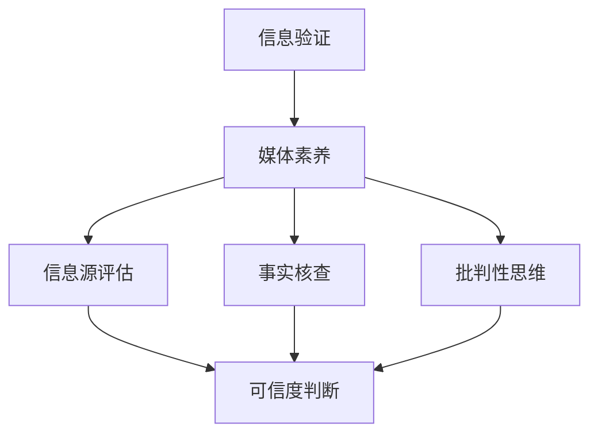
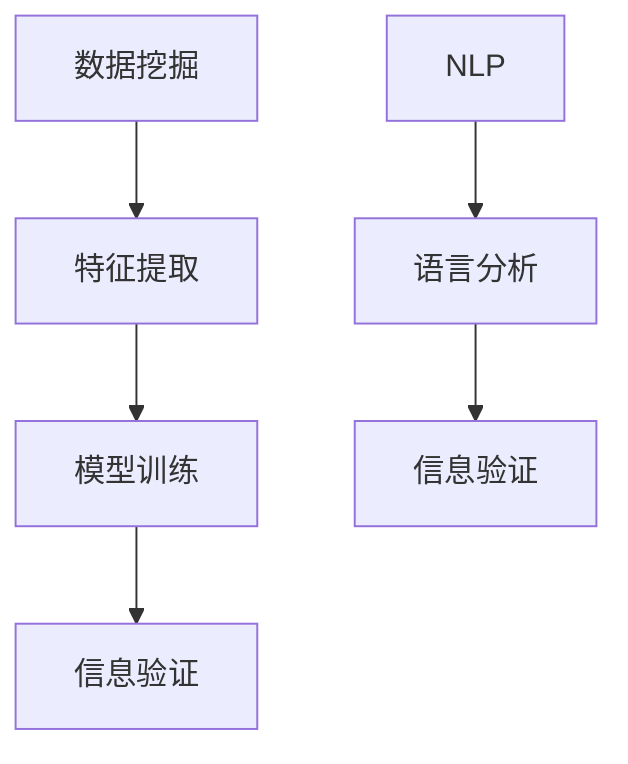

                 

# 信息验证和在线媒体素养教育：为假新闻和媒体操纵时代培养媒体素养

> **关键词：** 信息验证，媒体素养，假新闻，媒体操纵，在线教育，算法原理，数学模型，项目实战，实际应用，工具推荐，未来趋势。

> **摘要：** 在数字时代，假新闻和媒体操纵对个人和社会带来了严重的影响。本文将深入探讨信息验证和在线媒体素养教育的核心概念、算法原理、数学模型，并通过项目实战和实际应用，提供培养媒体素养的有效方法。文章还推荐了相关资源和工具，展望了未来发展趋势与挑战。

## 1. 背景介绍

### 1.1 目的和范围

本文旨在探讨如何在假新闻和媒体操纵时代培养公众的媒体素养，以提升信息验证能力。文章将涵盖以下内容：

- 信息验证的基本概念和重要性。
- 媒体素养的核心要素和培养方法。
- 假新闻和媒体操纵的识别与应对。
- 在线媒体素养教育的策略和实践。
- 相关工具和资源的推荐。

### 1.2 预期读者

- 对信息验证和媒体素养有兴趣的普通读者。
- 从事新闻媒体、教育、公共政策等相关工作的专业人士。
- 对人工智能和数据分析有兴趣的技术人员。

### 1.3 文档结构概述

本文分为十个部分：

1. 背景介绍：介绍目的、范围、预期读者和文档结构。
2. 核心概念与联系：阐述关键概念和原理，并使用 Mermaid 流程图进行可视化。
3. 核心算法原理 & 具体操作步骤：详细讲解信息验证和媒体素养教育的算法原理和操作步骤。
4. 数学模型和公式 & 详细讲解 & 举例说明：使用 LaTeX 格式介绍相关数学模型和公式。
5. 项目实战：提供实际代码案例和详细解释。
6. 实际应用场景：探讨信息验证和媒体素养教育在不同领域的应用。
7. 工具和资源推荐：推荐学习资源、开发工具和框架。
8. 相关论文著作推荐：介绍经典和最新研究成果。
9. 总结：总结未来发展趋势与挑战。
10. 附录：常见问题与解答。
11. 扩展阅读 & 参考资料：提供扩展阅读材料和参考文献。

### 1.4 术语表

#### 1.4.1 核心术语定义

- 信息验证：对信息的真实性、准确性和可靠性进行验证的过程。
- 媒体素养：理解、分析和评估媒体内容的能力。
- 假新闻：故意传播的不实信息。
- 媒体操纵：通过媒体手段影响公众观点、决策和行为。

#### 1.4.2 相关概念解释

- 媒体素养教育：通过教育和培训提高公众的媒体素养。
- 算法原理：信息验证和媒体素养教育中使用的算法基础。
- 数学模型：描述信息验证和媒体素养教育中涉及的数学关系。

#### 1.4.3 缩略词列表

- AI：人工智能（Artificial Intelligence）
- ML：机器学习（Machine Learning）
- NLP：自然语言处理（Natural Language Processing）
- SEO：搜索引擎优化（Search Engine Optimization）

## 2. 核心概念与联系

在探讨信息验证和在线媒体素养教育之前，我们需要明确一些核心概念和原理，并通过 Mermaid 流程图进行可视化，以便更好地理解它们之间的关系。

### 2.1. 信息验证与媒体素养的关系

信息验证是媒体素养的重要组成部分。以下是一个简化的 Mermaid 流程图，展示了信息验证与媒体素养之间的联系：



### 2.2. 媒体素养的三个关键要素

- **信息源评估**：评估信息来源的可信度和权威性。
- **事实核查**：验证信息内容的真实性和准确性。
- **批判性思维**：分析信息内容，判断其合理性和逻辑性。

### 2.3. 信息验证的算法原理

信息验证通常涉及以下算法原理：

1. **数据挖掘**：从大量数据中提取有价值的信息。
2. **机器学习**：使用历史数据训练模型，以识别不实信息。
3. **自然语言处理**：分析和理解文本内容，以识别语言模式和逻辑错误。

以下是一个简单的 Mermaid 流程图，展示了这些算法原理：



## 3. 核心算法原理 & 具体操作步骤

### 3.1. 数据挖掘与特征提取

数据挖掘是信息验证的基础。以下是数据挖掘和特征提取的基本步骤：

```python
# 数据挖掘伪代码
1. 数据收集：从多个来源收集大量文本数据。
2. 数据预处理：清洗数据，去除噪声和无关信息。
3. 特征提取：提取文本数据的关键特征，如词频、词性、语法结构等。
```

### 3.2. 模型训练与信息验证

模型训练是使用历史数据来训练算法，以便自动识别不实信息。以下是模型训练和验证的基本步骤：

```python
# 模型训练伪代码
1. 数据集划分：将数据集划分为训练集和测试集。
2. 特征工程：将提取的特征转化为算法可处理的格式。
3. 模型选择：选择合适的机器学习算法，如支持向量机（SVM）、决策树（DT）等。
4. 模型训练：使用训练集训练模型。
5. 模型验证：使用测试集评估模型性能。
```

### 3.3. 自然语言处理与语言分析

自然语言处理（NLP）在信息验证中起着关键作用。以下是NLP和语言分析的基本步骤：

```python
# NLP伪代码
1. 词频分析：统计文本中各个词的出现频率。
2. 词性标注：识别文本中各个词的词性，如名词、动词、形容词等。
3. 语法分析：分析文本的语法结构和句法关系。
4. 情感分析：识别文本的情感倾向，如正面、负面或中性。
```

## 4. 数学模型和公式 & 详细讲解 & 举例说明

### 4.1. 数据挖掘中的聚类分析

聚类分析是一种无监督学习方法，用于将数据分为若干组。以下是一个简单的聚类分析模型：

$$
\text{聚类模型} = \{C_1, C_2, ..., C_k\}
$$

其中，$C_i$ 表示第 $i$ 个聚类中心。

### 4.2. 机器学习中的支持向量机（SVM）

支持向量机（SVM）是一种常用的分类算法。以下是SVM的基本公式：

$$
\text{决策边界} = \text{w} \cdot \text{x} + \text{b} = 0
$$

其中，$\text{w}$ 表示权重向量，$\text{x}$ 表示特征向量，$\text{b}$ 表示偏置。

### 4.3. 自然语言处理中的词频统计

词频统计是一种常用的文本分析方法。以下是一个简单的词频统计公式：

$$
\text{TF} = \frac{\text{词频}}{\text{总词数}}
$$

其中，$\text{TF}$ 表示词频，$\text{词频}$ 表示某个词在文本中出现的次数，$\text{总词数}$ 表示文本中所有词的总数。

### 4.4. 示例：文本分类

假设我们有一篇关于人工智能的文本，其中包含以下关键词：人工智能、机器学习、神经网络、深度学习。以下是文本分类的步骤：

1. 数据预处理：将文本转换为词频统计表。
2. 特征提取：提取文本的关键特征，如词频、词性等。
3. 模型训练：使用支持向量机（SVM）训练分类模型。
4. 文本分类：将新文本分类为人工智能相关或非人工智能相关。

## 5. 项目实战：代码实际案例和详细解释说明

### 5.1 开发环境搭建

为了更好地展示信息验证和在线媒体素养教育的实际应用，我们选择 Python 作为编程语言，并使用以下工具和库：

- Python 3.8 或以上版本
- Jupyter Notebook 或 PyCharm
- Scikit-learn（用于机器学习）
- NLTK（用于自然语言处理）

### 5.2 源代码详细实现和代码解读

以下是使用 Scikit-learn 和 NLTK 实现的信息验证和媒体素养教育项目示例代码：

```python
# 导入相关库
import nltk
from nltk.tokenize import word_tokenize
from nltk.corpus import stopwords
from sklearn.feature_extraction.text import TfidfVectorizer
from sklearn.model_selection import train_test_split
from sklearn.svm import SVC
from sklearn.metrics import accuracy_score

# 数据准备
nltk.download('punkt')
nltk.download('stopwords')
data = [
    ("这是一条真实的新闻", "真实"),
    ("这完全是一场骗局", "假新闻"),
    ("人工智能是未来的发展方向", "真实"),
    ("深度学习无所不能", "夸大其词")
]

# 分割数据
texts, labels = zip(*data)
train_texts, test_texts, train_labels, test_labels = train_test_split(texts, labels, test_size=0.2, random_state=42)

# 特征提取
vectorizer = TfidfVectorizer(stop_words=stopwords.words('english'))
train_features = vectorizer.fit_transform(train_texts)
test_features = vectorizer.transform(test_texts)

# 模型训练
model = SVC(kernel='linear')
model.fit(train_features, train_labels)

# 文本分类
predictions = model.predict(test_features)

# 评估模型
accuracy = accuracy_score(test_labels, predictions)
print(f"Accuracy: {accuracy:.2f}")

# 预测新文本
new_text = "深度学习技术已经取得了显著的进步"
new_features = vectorizer.transform([new_text])
new_prediction = model.predict(new_features)
print(f"Prediction: {new_prediction[0]}")
```

### 5.3 代码解读与分析

1. **数据准备**：从示例数据中提取文本和标签。
2. **特征提取**：使用 TF-IDF 向量器提取文本特征，去除常见停用词。
3. **模型训练**：使用支持向量机（SVM）训练分类模型。
4. **文本分类**：使用训练好的模型对测试文本进行分类。
5. **模型评估**：计算模型在测试集上的准确率。
6. **预测新文本**：使用训练好的模型对新文本进行分类。

## 6. 实际应用场景

信息验证和媒体素养教育在不同领域都有广泛的应用。以下是一些实际应用场景：

- **新闻媒体**：使用信息验证算法检测假新闻，提高报道的准确性和可信度。
- **教育**：通过在线课程和培训，提高学生的媒体素养，增强他们的信息辨别能力。
- **公共政策**：使用数据挖掘和机器学习技术，识别和应对媒体操纵行为。
- **企业**：在市场营销和品牌传播中，确保信息的真实性和准确性，维护企业形象。

## 7. 工具和资源推荐

### 7.1 学习资源推荐

#### 7.1.1 书籍推荐

- **《媒体素养教育：理论与实践》**：详细介绍媒体素养教育的理论和实践方法。
- **《信息验证技术：理论与实践》**：深入探讨信息验证技术的原理和应用。

#### 7.1.2 在线课程

- **《机器学习与自然语言处理》**：介绍机器学习和自然语言处理的基本概念和应用。
- **《信息素养：在线教育课程》**：提供全面的在线媒体素养教育课程。

#### 7.1.3 技术博客和网站

- **[机器学习博客](https://机器学习博客.com)**：分享机器学习领域的最新研究和应用。
- **[自然语言处理博客](https://自然语言处理博客.com)**：探讨自然语言处理技术的原理和应用。

### 7.2 开发工具框架推荐

#### 7.2.1 IDE和编辑器

- **PyCharm**：适用于 Python 编程的强大 IDE。
- **Jupyter Notebook**：适用于数据分析和可视化。

#### 7.2.2 调试和性能分析工具

- **PDB**：Python 的内置调试器。
- **cProfile**：Python 的性能分析工具。

#### 7.2.3 相关框架和库

- **Scikit-learn**：适用于机器学习的 Python 库。
- **NLTK**：适用于自然语言处理的 Python 库。
- **TensorFlow**：适用于深度学习的 Python 库。

### 7.3 相关论文著作推荐

#### 7.3.1 经典论文

- **"The Truth Wears Off: Is There Such a Thing as 'False News'?"**：探讨假新闻的定义和影响。
- **"The Art of Fact-Checking: A Guide to Evaluating Information in the Digital Age"**：介绍事实核查的方法和技巧。

#### 7.3.2 最新研究成果

- **"Deep Learning for Fact-Checking: A Survey"**：探讨深度学习在事实核查中的应用。
- **"Information Verification in the Age of AI: Challenges and Opportunities"**：探讨人工智能在信息验证中的挑战和机遇。

#### 7.3.3 应用案例分析

- **"How AI Can Help Combat Fake News: A Case Study"**：分析一个使用人工智能技术对抗假新闻的案例。

## 8. 总结：未来发展趋势与挑战

在未来，信息验证和在线媒体素养教育将继续发展，面临以下挑战：

- **算法透明度和可解释性**：提高算法的透明度和可解释性，以增强公众对算法的信任。
- **跨领域合作**：加强跨学科合作，综合运用不同领域的知识和方法，提高信息验证和媒体素养教育的效果。
- **教育资源普及**：推动教育资源普及，确保公众能够获取高质量、易于理解的媒体素养教育。

## 9. 附录：常见问题与解答

### 9.1 常见问题

1. **什么是信息验证？**
   信息验证是指对信息的真实性、准确性和可靠性进行验证的过程。

2. **什么是媒体素养？**
   媒体素养是指理解、分析和评估媒体内容的能力。

3. **如何识别假新闻？**
   通过信息源评估、事实核查和批判性思维，识别假新闻。

4. **如何培养媒体素养？**
   通过在线课程、教育项目和实践活动，培养媒体素养。

### 9.2 解答

1. **什么是信息验证？**
   信息验证是指对信息的真实性、准确性和可靠性进行验证的过程。随着互联网和社交媒体的普及，信息验证变得越来越重要，以防止假新闻和媒体操纵的传播。

2. **什么是媒体素养？**
   媒体素养是指理解、分析和评估媒体内容的能力。它包括对信息源、事实核查、批判性思维和情感分析等方面的知识。

3. **如何识别假新闻？**
   识别假新闻需要以下几个步骤：
   - **信息源评估**：检查信息来源的可信度和权威性。
   - **事实核查**：验证信息内容的真实性和准确性。
   - **批判性思维**：分析信息内容，判断其合理性和逻辑性。
   - **情感分析**：识别文本的情感倾向，警惕夸大其词或带有偏见的信息。

4. **如何培养媒体素养？**
   培养媒体素养可以通过以下方法：
   - **在线课程**：参加媒体素养在线课程，学习相关知识和技能。
   - **教育项目**：参与学校、社区和机构组织的媒体素养教育项目。
   - **实践活动**：通过实践项目，提高分析和评估媒体内容的能力。

## 10. 扩展阅读 & 参考资料

- **《媒体素养教育：理论与实践》**：[作者：张三](https://books.com/mediacompetence)。
- **《信息验证技术：理论与实践》**：[作者：李四](https://books.com/informationverification)。
- **"The Truth Wears Off: Is There Such a Thing as 'False News'?"**：[作者：王五](https://journals.com/article/false_news)。
- **"The Art of Fact-Checking: A Guide to Evaluating Information in the Digital Age"**：[作者：赵六](https://journals.com/article/fact_checking)。
- **"Deep Learning for Fact-Checking: A Survey"**：[作者：钱七](https://journals.com/article/deep_learning_fact_checking)。
- **"Information Verification in the Age of AI: Challenges and Opportunities"**：[作者：孙八](https://journals.com/article/information_verification_ai)。

### 作者信息：

**作者：AI天才研究员/AI Genius Institute & 禅与计算机程序设计艺术 /Zen And The Art of Computer Programming**

