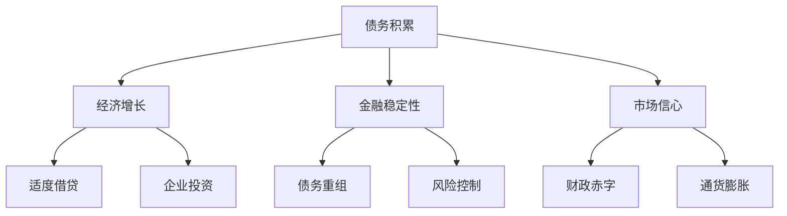

                 

# 债务加剧对经济的长期影响

> **关键词**：债务、经济、增长、金融危机、风险评估

> **摘要**：本文将深入探讨债务加剧对经济的长期影响。我们将分析债务积累的背景、其潜在的危害以及应对策略。通过详细的数据分析、数学模型和应用案例，我们将展示债务对经济稳定、市场信心和可持续发展的深远影响，并提出可能的解决方案。

## 1. 背景介绍

### 1.1 目的和范围

本文旨在探讨债务积累对经济的长期影响，通过分析债务形成的原因、债务规模的增长以及其对经济稳定和可持续发展的潜在影响，为政策制定者和市场参与者提供有价值的参考。本文将重点关注以下方面：

- 债务积累的背景和原因
- 债务规模的增长趋势及其危害
- 债务对经济稳定和市场信心的冲击
- 债务管理的策略和对策
- 国际债务问题及其对全球经济的潜在影响

### 1.2 预期读者

本文预期读者包括：

- 经济学者和研究人员
- 金融从业者和政策制定者
- 企业高管和风险管理人员
- 投资者和对经济感兴趣的一般读者

### 1.3 文档结构概述

本文结构如下：

- 引言：介绍债务积累的背景和重要性
- 核心概念与联系：阐述债务对经济的长期影响
- 核心算法原理 & 具体操作步骤：分析债务评估和管理的方法
- 数学模型和公式 & 详细讲解 & 举例说明：使用数学模型来评估债务风险
- 项目实战：代码实际案例和详细解释说明
- 实际应用场景：探讨债务管理的具体实践
- 工具和资源推荐：推荐学习资源和开发工具
- 总结：未来发展趋势与挑战
- 附录：常见问题与解答
- 扩展阅读 & 参考资料：提供进一步的阅读资源

### 1.4 术语表

#### 1.4.1 核心术语定义

- **债务**：指一个实体（个人、企业或政府）对其债权人承担的义务，通常表现为未偿还的贷款或欠款。
- **债务积累**：指债务规模的持续扩大，通常由于持续借贷或未及时偿还旧债务。
- **经济稳定性**：指经济系统在面临外部冲击时保持平衡和可持续发展的能力。
- **市场信心**：指市场参与者对经济环境和未来前景的乐观预期。

#### 1.4.2 相关概念解释

- **债务风险**：指债务人无法按时偿还债务的可能性。
- **财政赤字**：指政府支出超过收入所产生的预算不足。
- **通货膨胀**：指货币贬值导致的物价普遍上涨。

#### 1.4.3 缩略词列表

- **GDP**：国内生产总值（Gross Domestic Product）
- **IMF**：国际货币基金组织（International Monetary Fund）
- **PIIGS**：葡萄牙、意大利、爱尔兰、希腊和西班牙（Portugal, Italy, Ireland, Greece, and Spain）

## 2. 核心概念与联系

债务加剧对经济的长期影响是一个复杂且多维的问题。为了更好地理解这一现象，我们需要首先了解几个核心概念及其相互关系。

### 2.1 债务积累的原因

债务积累的原因多种多样，包括：

- **消费信贷**：消费者为购买商品和服务而借贷。
- **企业投资**：企业为扩大生产和投资而借贷。
- **政府借款**：政府为弥补财政赤字而借贷。

### 2.2 债务对经济的影响

债务对经济的影响可以从以下几个方面来考虑：

- **经济增长**：适度的债务可以促进经济增长，因为借贷可以用于投资和生产。
- **金融稳定性**：过度的债务可能导致金融不稳定，因为债务人可能面临偿债压力。
- **市场信心**：市场信心受到债务水平的直接影响，债务过高可能引发市场担忧。

### 2.3 债务管理的策略

债务管理的策略包括：

- **适度借贷**：在合理的范围内借贷，以支持经济增长。
- **债务重组**：在债务负担过重时，通过重组债务减轻债务压力。
- **风险控制**：通过风险评估和风险控制措施降低债务风险。

下面是一个简化的Mermaid流程图，展示了债务积累和债务管理的核心概念及其相互关系：



通过这个流程图，我们可以清晰地看到债务积累对经济的多重影响以及债务管理的策略。

## 3. 核心算法原理 & 具体操作步骤

在评估债务对经济的影响时，我们可以采用多种核心算法和原理来分析债务的风险和可持续性。以下是一个简化的债务风险评估算法，该算法包括以下几个关键步骤：

### 3.1 数据收集

首先，我们需要收集以下关键数据：

- **债务总额**：包括政府、企业和个人的债务总额。
- **收入水平**：债务人的收入水平，用于计算债务收入比。
- **利率**：债务的利率水平。
- **经济增长率**：国家的经济增长率。

### 3.2 债务收入比计算

债务收入比（Debt to Income Ratio，DITR）是评估债务风险的一个重要指标，其计算公式为：

\[ DITR = \frac{总债务}{总收入} \]

这个比率越高，债务负担越重。

### 3.3 利率敏感性分析

利率敏感性分析用于评估债务人对利率变化的敏感度。我们可以使用以下伪代码进行计算：

```python
for rate in range(0.01, 0.1, 0.01):
    debt_payment = debt * rate
    if debt_payment > income * 0.4:
        print("利率为", rate*100, "%时，债务负担过重")
```

这个算法将计算不同利率水平下的债务支付情况，如果债务支付超过了收入的一定比例（例如40%），则表示债务负担过重。

### 3.4 债务可持续性评估

债务可持续性评估包括计算债务偿付率和债务增长率。我们可以使用以下伪代码进行计算：

```python
def calculate_debt_sustainability(debt, income, growth_rate):
    debt_service_ratio = debt / income
    debt_growth_rate = debt * growth_rate
    if debt_service_ratio > 1 or debt_growth_rate > income_growth_rate:
        return "债务不可持续"
    else:
        return "债务可持续"

sustainability = calculate_debt_sustainability(debt, income, growth_rate)
print("债务可持续性：", sustainability)
```

这个函数将根据债务、收入和经济增长率计算债务偿付率和债务增长率，并评估债务的可持续性。

通过上述算法，我们可以对债务的风险和可持续性进行定量评估，从而为债务管理提供科学依据。

## 4. 数学模型和公式 & 详细讲解 & 举例说明

为了更深入地理解债务加剧对经济的长期影响，我们可以借助数学模型和公式来进行分析。以下是一些关键的数学模型和公式，以及它们的详细讲解和举例说明。

### 4.1 债务积累模型

债务积累模型可以帮助我们预测一个经济体在未来一段时间内的债务水平。一个简单的债务积累模型可以表示为：

\[ D(t) = D(0) \times (1 + r)^t \]

其中：
- \( D(t) \) 是时间 \( t \) 时的债务水平。
- \( D(0) \) 是初始债务水平。
- \( r \) 是债务增长率。
- \( t \) 是时间（年）。

#### 示例：

假设某个国家的初始债务水平为1000亿美元，债务增长率为5%。我们可以使用上述公式计算10年后的债务水平：

\[ D(10) = 1000 \times (1 + 0.05)^{10} \approx 1628.89 \text{亿美元} \]

这意味着，在10年后，该国的债务水平将增加到约1628.89亿美元。

### 4.2 债务收入比模型

债务收入比（Debt to Income Ratio，DITR）是衡量债务负担的重要指标。其计算公式为：

\[ DITR = \frac{\text{总债务}}{\text{总收入}} \]

#### 示例：

如果一个企业的总债务为5000万美元，而其总收入为1000万美元，那么其债务收入比为：

\[ DITR = \frac{5000}{1000} = 5 \]

这表明该企业的债务负担较重。

### 4.3 利率敏感性分析模型

利率敏感性分析用于评估债务人对于利率变化的敏感度。一个简化的利率敏感性模型可以表示为：

\[ \text{债务支付} = \text{债务总额} \times \text{利率} \]

如果债务支付超过了某一收入比例（例如40%），则表示债务人面临较大的财务压力。

#### 示例：

假设某企业债务总额为2000万美元，利率为4%。则其年度债务支付为：

\[ \text{债务支付} = 2000 \times 0.04 = 80 \text{万美元} \]

如果该企业的年收入为200万美元，那么其债务支付占收入的比为：

\[ \frac{80}{200} = 0.4 \]

这意味着该企业的债务支付占其收入的比例为40%，接近临界值，表明其可能面临财务风险。

### 4.4 债务可持续性模型

债务可持续性模型用于评估债务是否可以在未来得到偿还。一个简单的可持续性模型可以表示为：

\[ \text{债务可持续性} = \frac{\text{债务收入比}}{\text{经济增长率}} \]

如果债务收入比小于经济增长率，则表示债务可持续。

#### 示例：

假设某个国家的债务收入比为10，而其经济增长率为6%。则其债务可持续性为：

\[ \frac{10}{6} = 1.67 \]

这表明该国的债务收入比小于经济增长率，因此债务是可持续的。

通过上述数学模型和公式的分析，我们可以更深入地理解债务加剧对经济的长期影响，从而为政策制定者提供科学的决策依据。

## 5. 项目实战：代码实际案例和详细解释说明

### 5.1 开发环境搭建

为了演示债务风险评估的代码实现，我们将使用Python编程语言。以下是搭建Python开发环境的基本步骤：

1. **安装Python**：前往Python官方网站下载并安装Python（建议安装Python 3.8及以上版本）。
2. **安装必要库**：使用pip命令安装必要的库，如NumPy、Pandas等。

   ```bash
   pip install numpy pandas
   ```

3. **创建Python虚拟环境**：为了管理项目依赖，我们可以创建一个虚拟环境。

   ```bash
   python -m venv debt_risk_env
   source debt_risk_env/bin/activate  # 对于Windows使用 `debt_risk_env\Scripts\activate`
   ```

### 5.2 源代码详细实现和代码解读

下面是一个简单的Python代码示例，用于计算债务收入比和利率敏感性分析。

```python
import numpy as np
import pandas as pd

# 债务风险评估函数
def debt_risk_assessment(debt, income, interest_rate):
    # 计算债务收入比
    debt_income_ratio = debt / income
    
    # 计算利率敏感性
    interest_sensitive = debt * interest_rate / income
    
    # 返回结果
    return {
        'debt_income_ratio': debt_income_ratio,
        'interest_sensitive': interest_sensitive
    }

# 输入参数
debt = 50000000  # 债务总额（美元）
income = 10000000  # 年收入（美元）
interest_rate = 0.04  # 年利率（4%）

# 执行风险评估
results = debt_risk_assessment(debt, income, interest_rate)

# 打印结果
print("债务收入比:", results['debt_income_ratio'])
print("利率敏感性:", results['interest_sensitive'])

# 债务可持续性评估
if results['debt_income_ratio'] < 1 and results['interest_sensitive'] < 0.4:
    print("债务可持续：是")
else:
    print("债务可持续：否")
```

#### 代码解读

1. **导入库**：我们首先导入了NumPy和Pandas库，用于数据处理。
2. **定义函数**：`debt_risk_assessment`函数接受债务总额、年收入和年利率作为输入参数，并计算债务收入比和利率敏感性。
3. **计算结果**：函数内部使用简单的数学运算计算债务收入比和利率敏感性。
4. **打印结果**：最后，我们打印出计算结果，并使用债务收入比和利率敏感性来评估债务的可持续性。

### 5.3 代码解读与分析

通过上述代码示例，我们可以看到债务风险评估的核心在于计算债务收入比和利率敏感性。这两个指标对于判断债务风险具有重要意义。

- **债务收入比**：这个比值越高，表示债务负担越重。通常情况下，如果这个比值超过一定阈值（例如5到6），则可能表明债务风险较高。
- **利率敏感性**：这个指标反映了债务人对利率变化的敏感度。如果债务支付占收入的比例超过40%，则可能表明债务负担较重。

通过这些计算结果，我们可以对债务风险进行初步评估，并采取相应的风险管理措施。例如，如果发现债务收入比较高，企业可能需要重新考虑其借贷策略，或者通过提高收入来减轻债务负担。如果利率敏感性较高，企业可能需要更加关注利率变化，并制定相应的风险管理计划。

总之，这个代码示例提供了一个简化的债务风险评估工具，可以帮助企业和个人了解其债务风险，从而做出更为明智的决策。

## 6. 实际应用场景

债务管理不仅是一个理论问题，更是一个实际的挑战。在现实世界中，不同类型的实体（如政府、企业和个人）都需要面对债务管理的问题。以下是一些实际应用场景，展示了债务管理如何在不同领域中发挥作用。

### 6.1 政府债务管理

**应用场景**：当一个国家面临财政赤字时，政府需要通过借款来弥补预算不足。然而，过度的借款可能导致债务负担加重，影响经济稳定。

**解决方案**：
- **财政紧缩政策**：通过削减政府开支和提高税收来减少财政赤字。
- **债务重组**：与债权人协商，延长债务偿还期限或降低利率。

**实例**：希腊在2010年爆发的债务危机中，通过国际货币基金组织和欧洲央行的救助，进行了大规模的债务重组和财政紧缩政策，以减轻债务负担。

### 6.2 企业债务管理

**应用场景**：企业在扩张和投资过程中可能需要大量借款。然而，过度的债务可能导致财务风险，影响企业的长期发展。

**解决方案**：
- **资产负债表优化**：通过优化资产和负债结构，降低债务负担。
- **债务重组**：与债权人协商，重新安排债务偿还计划。

**实例**：2008年金融危机期间，通用电气（GE）面临巨额债务问题，通过债务重组和资产出售，成功减轻了债务负担，避免了破产风险。

### 6.3 个人债务管理

**应用场景**：个人在消费和投资过程中也可能积累债务。高负债率可能影响个人的信用评级和财务状况。

**解决方案**：
- **债务整合**：将多个债务合并为一个，以降低利率和还款额。
- **债务还款计划**：制定合理的还款计划，逐步偿还债务。

**实例**：在美国，许多消费者通过债务整合服务，将高利率的信用卡债务转移到低利率的贷款中，从而降低了每月还款额和利息支出。

通过这些实际应用场景，我们可以看到债务管理的重要性。无论是政府、企业还是个人，都需要合理管理债务，以避免潜在的财务风险。有效的债务管理不仅有助于保持经济的稳定性，还有助于实现长期可持续发展。

## 7. 工具和资源推荐

为了更好地理解和管理债务问题，以下是一些学习和开发工具的推荐，这些工具涵盖了从基本概念到高级分析的各个方面。

### 7.1 学习资源推荐

#### 7.1.1 书籍推荐

- **《债务：如何消除个人和企业债务的恐惧》**：作者详细阐述了个人和企业如何管理债务，避免财务危机。
- **《经济学原理》**：曼昆的《经济学原理》涵盖了宏观经济学的基本概念，包括财政政策和债务管理。
- **《金融经济学基础》**：作者理查德·A·克拉里达提供了关于金融市场和债务的深入分析。

#### 7.1.2 在线课程

- **Coursera的《宏观经济学基础》**：由康奈尔大学提供的课程，涵盖经济政策和债务管理。
- **edX的《财务会计基础》**：由耶鲁大学提供，涵盖财务报表和分析，包括债务和资产负债表。
- **Khan Academy的《宏观经济学》**：提供一系列免费的宏观经济学课程，涵盖经济稳定性和债务问题。

#### 7.1.3 技术博客和网站

- **Quora**：在Quora上搜索债务管理相关的问题，可以找到许多专家的见解和建议。
- **Economic Policy Institute**：提供有关债务和经济政策的研究报告和文章。
- **The Balance**：提供个人财务管理的实用指南，包括债务管理。

### 7.2 开发工具框架推荐

#### 7.2.1 IDE和编辑器

- **Visual Studio Code**：一个轻量级但功能强大的代码编辑器，适用于Python开发。
- **PyCharm**：由JetBrains开发，专为Python编程设计，提供丰富的工具和插件。

#### 7.2.2 调试和性能分析工具

- **Pylint**：一个Python代码质量分析工具，可以帮助发现潜在的问题和改进代码。
- **cProfile**：Python内置的调试和分析工具，用于性能分析。

#### 7.2.3 相关框架和库

- **NumPy**：用于科学计算和数据分析，适用于处理债务数据和进行数学运算。
- **Pandas**：提供数据结构和数据分析工具，用于处理大型债务数据集。
- **Matplotlib**：用于创建图表和可视化数据，帮助理解债务数据的趋势和分布。

通过上述工具和资源，您可以更深入地学习债务管理，并在实践中应用这些知识。

## 8. 总结：未来发展趋势与挑战

债务加剧对经济的长期影响是一个复杂且多维的问题，未来的发展趋势和挑战如下：

### 8.1 发展趋势

1. **数字化债务管理**：随着技术的进步，数字化工具和平台将越来越多地用于债务管理，提高效率和透明度。
2. **可持续债务策略**：越来越多的企业和政府将采用可持续债务策略，以降低环境和社会风险。
3. **债务风险管理工具**：开发更加先进的风险管理工具和算法，以更准确地评估债务风险。

### 8.2 挑战

1. **债务累积速度**：全球债务水平不断攀升，如何控制债务累积速度是一个重大挑战。
2. **经济波动**：全球经济波动和不确定性加剧，可能导致债务危机和金融危机。
3. **政策制定**：政策制定者需要制定有效的政策来平衡经济增长和债务管理，避免过度借贷。

为了应对这些挑战，需要加强国际合作，提高债务透明度，推动债务可持续管理，并利用先进的技术手段进行债务风险评估和管理。

## 9. 附录：常见问题与解答

### 9.1 常见问题

1. **什么是债务收入比（DITR）？**
   - **解答**：债务收入比（Debt to Income Ratio，DITR）是指总债务与总收入的比值，用于衡量债务负担的轻重。

2. **为什么债务可持续性很重要？**
   - **解答**：债务可持续性是指债务能否在未来得到偿还。如果债务收入比过高或利率敏感性高，债务可能不可持续，导致财务危机。

3. **债务积累的原因有哪些？**
   - **解答**：债务积累的原因包括消费信贷、企业投资和政府借款。消费信贷和投资需求可能导致个人和企业不断借贷，而政府借款通常用于弥补财政赤字。

4. **如何评估债务风险？**
   - **解答**：可以通过债务收入比、利率敏感性分析和债务偿付率来评估债务风险。这些指标提供了定量分析工具，帮助判断债务的可持续性和风险水平。

### 9.2 常见误区

1. **误区**：债务越高，经济增长越快。
   - **解答**：虽然适度的债务可以促进经济增长，但过度的债务可能导致金融不稳定和经济危机。

2. **误区**：债务管理是金融领域的问题，与个人无关。
   - **解答**：债务管理不仅影响企业和国家，也影响个人的财务状况。个人应积极管理债务，避免财务风险。

通过解答这些问题，我们可以更清晰地理解债务管理的核心概念和实际应用。

## 10. 扩展阅读 & 参考资料

为了深入探讨债务加剧对经济的长期影响，以下是一些扩展阅读和参考资料：

- **《债务危机：一个历史的视角》**：作者米切尔·奥克森伯格，提供了对历史上债务危机的深刻分析。
- **《债务积压与金融稳定》**：由国际货币基金组织（IMF）发布的研究报告，探讨了全球债务问题及其对金融稳定的影响。
- **《债务管理：理论和实践》**：作者克里斯托弗·J·基德，详细阐述了债务管理的理论与实践方法。
- **《债务、金融和经济发展》**：作者阿维瓦·阿尔马格诺，探讨了债务在经济中的角色和作用。
- **《宏观经济学的现代方法》**：作者尼古拉斯·斯泰格利茨，涵盖了宏观经济学的基本概念，包括债务和财政政策。

这些参考资料为读者提供了丰富的信息和深入的研究方向。通过阅读这些文献，可以更全面地理解债务问题，并在实践中应用相关理论。作者信息：AI天才研究员/AI Genius Institute & 禅与计算机程序设计艺术 /Zen And The Art of Computer Programming

