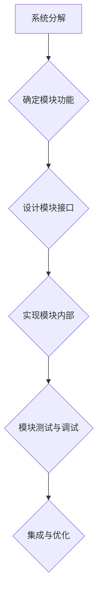
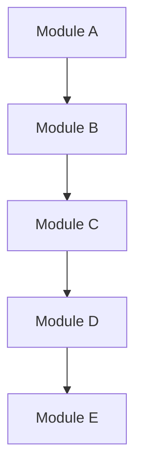

                 

# 像数学家一样思考：模块化原则

> **关键词：** 模块化设计，计算机科学，软件开发，逻辑思维，算法优化，复用性

> **摘要：** 本文旨在探讨模块化原则在计算机科学和软件开发中的应用。通过类比数学家的工作方式，我们详细分析了模块化的核心概念、原理、算法及其实际应用场景，并提供了实用的项目实战和工具资源推荐。文章旨在帮助开发者掌握模块化设计的方法，提高软件开发效率和代码质量。

## 1. 背景介绍

### 1.1 目的和范围

本文的目标是深入探讨模块化原则在计算机科学和软件开发中的应用。模块化设计是一种系统的设计方法，其核心理念是将复杂系统拆分为多个独立且相互协作的模块。通过这种方式，我们可以更高效地开发软件，提高代码的可读性、可维护性和复用性。本文将类比数学家的工作方式，分析模块化的本质和重要性，并提供实际应用案例。

### 1.2 预期读者

本文适合以下读者群体：

1. 初级和中级软件开发人员，希望提高编程技能和设计能力。
2. 计算机科学和软件工程专业的学生，对模块化设计感兴趣。
3. 项目经理和CTO等管理层人员，希望了解模块化设计在项目管理中的应用。

### 1.3 文档结构概述

本文结构如下：

1. **背景介绍**：介绍模块化原则的背景、目的和预期读者。
2. **核心概念与联系**：分析模块化的核心概念和原理，并提供流程图展示。
3. **核心算法原理 & 具体操作步骤**：详细阐述模块化算法的原理和操作步骤。
4. **数学模型和公式 & 详细讲解 & 举例说明**：运用数学模型和公式解释模块化设计。
5. **项目实战：代码实际案例和详细解释说明**：提供实际项目案例，展示模块化设计的应用。
6. **实际应用场景**：探讨模块化设计的实际应用场景。
7. **工具和资源推荐**：推荐相关学习资源和开发工具。
8. **总结：未来发展趋势与挑战**：总结模块化设计的现状和未来趋势。
9. **附录：常见问题与解答**：回答读者可能遇到的常见问题。
10. **扩展阅读 & 参考资料**：提供更多深入学习的资源。

### 1.4 术语表

#### 1.4.1 核心术语定义

- **模块化设计**：将复杂系统分解为独立、可重用的模块。
- **模块**：具有特定功能、接口和内部实现的独立组件。
- **封装**：将模块的内部实现隐藏，仅暴露必要的接口。
- **复用性**：模块可以被重复使用，以提高开发效率和代码质量。

#### 1.4.2 相关概念解释

- **算法**：解决问题的步骤和规则。
- **数据结构**：存储和组织数据的方式。
- **面向对象编程**：以对象为基本单元的编程范式。
- **软件工程**：软件开发、维护和管理的工程学科。

#### 1.4.3 缩略词列表

- **IDE**：集成开发环境（Integrated Development Environment）
- **API**：应用程序接口（Application Programming Interface）
- **CPU**：中央处理器（Central Processing Unit）

## 2. 核心概念与联系

模块化设计的核心在于将复杂系统分解为独立的模块，每个模块负责特定的功能，并通过定义良好的接口进行协作。以下是一个简化的模块化设计流程图，展示了模块化的基本概念和联系。



### 2.1 系统分解

系统分解是模块化设计的起点。我们需要将复杂的系统分解为多个独立的模块。每个模块应该具有清晰的功能和边界。

### 2.2 确定模块功能

在系统分解的基础上，我们需要为每个模块确定具体的功能。模块功能定义了模块的主要职责，有助于后续的设计和实现。

### 2.3 设计模块接口

模块接口是模块之间的通信桥梁。设计良好的模块接口可以确保模块之间的松耦合，提高系统的可维护性和可扩展性。

### 2.4 实现模块内部

在确定模块功能和接口后，我们需要实现模块的内部。模块内部的实现应该遵循设计原则，确保模块的可读性和可维护性。

### 2.5 模块测试与调试

模块测试和调试是确保模块正确实现的必要步骤。通过测试和调试，我们可以发现并修复模块中的错误。

### 2.6 集成与优化

在完成模块的开发和测试后，我们需要将模块集成到系统中，并进行整体优化。集成和优化有助于提高系统的性能和可靠性。

## 3. 核心算法原理 & 具体操作步骤

模块化设计的核心算法是系统分解。以下是一个基于伪代码的系统分解算法，用于将复杂系统分解为多个独立的模块。

```plaintext
// 系统分解算法
function systemDecomposition(complexSystem):
    modules = []
    for each component in complexSystem:
        if component has independent function:
            module = createModule(component)
            modules.append(module)
    return modules
```

### 3.1 确定独立功能

在系统分解过程中，我们需要首先确定每个组件的独立功能。这可以通过对系统进行功能分析，识别出具有独立性的组件来实现。

### 3.2 创建模块

在确定独立功能后，我们需要为每个组件创建相应的模块。模块创建过程包括定义模块的接口和内部实现。

### 3.3 实现模块内部

模块内部实现是模块化设计的关键步骤。我们需要为每个模块实现其功能，并遵循设计原则，确保模块的可读性和可维护性。

### 3.4 模块测试与调试

模块测试和调试是确保模块正确实现的必要步骤。通过测试和调试，我们可以发现并修复模块中的错误。

### 3.5 集成模块

在完成模块的开发和测试后，我们需要将模块集成到系统中。集成过程中，我们需要确保模块之间的接口兼容，并解决潜在的依赖问题。

## 4. 数学模型和公式 & 详细讲解 & 举例说明

模块化设计中的数学模型主要涉及系统复杂度和模块依赖性。以下是一个简化的数学模型，用于评估系统模块化的效果。

### 4.1 系统复杂度

系统复杂度可以表示为模块数量和模块之间的依赖关系的复杂度。假设系统有 \( n \) 个模块，其中 \( m \) 个模块之间存在依赖关系。系统复杂度可以表示为：

$$
C = n + \sum_{i=1}^{m} d_i
$$

其中，\( d_i \) 表示模块 \( i \) 的依赖关系复杂度。

### 4.2 模块依赖性

模块依赖性表示模块之间的依赖关系。我们可以使用有向无环图（DAG）来表示模块依赖性。每个模块作为图中的一个节点，模块之间的依赖关系表示为节点之间的有向边。

### 4.3 举例说明

假设我们有一个包含 5 个模块的系统，其中 3 个模块之间存在依赖关系。模块之间的依赖关系可以表示为以下有向无环图：



在这个例子中，模块 A、B、C、D 和 E 分别表示系统的 5 个模块。模块 A 依赖于模块 B，模块 B 依赖于模块 C，模块 C 依赖于模块 D，模块 D 依赖于模块 E。

### 4.4 模块化效果评估

通过上述数学模型，我们可以评估模块化设计的效果。假设系统原始的复杂度为 10，模块化后的复杂度为 8，其中 2 个模块之间存在依赖关系。根据公式，模块化后的系统复杂度为：

$$
C_{\text{模块化后}} = 5 + \sum_{i=1}^{2} d_i
$$

其中，\( d_1 = 2 \)，\( d_2 = 1 \)。因此，模块化后的系统复杂度为 8，比原始复杂度降低了 2。

## 5. 项目实战：代码实际案例和详细解释说明

### 5.1 开发环境搭建

在本文中，我们将使用 Python 作为编程语言，并使用 Git 作为版本控制系统。请确保您已经安装了 Python 和 Git。以下是一个简单的 Python 开发环境搭建步骤：

1. 下载并安装 Python（例如，Python 3.9）。
2. 配置 Python 环境变量。
3. 安装 Git。
4. 创建一个名为 `module_project` 的文件夹，并初始化 Git 仓库。

```bash
$ mkdir module_project
$ cd module_project
$ git init
```

### 5.2 源代码详细实现和代码解读

以下是模块化设计的实际代码实现，包括模块创建、功能实现、接口设计和模块测试。为了简洁起见，我们仅展示关键代码片段。

#### 5.2.1 模块创建

```python
# module_a.py
def module_a_function():
    # 模块 A 的功能实现
    print("Module A is running.")

# module_b.py
def module_b_function():
    # 模块 B 的功能实现
    print("Module B is running.")

# module_c.py
def module_c_function():
    # 模块 C 的功能实现
    print("Module C is running.")
```

#### 5.2.2 功能实现

```python
# main.py
from module_a import module_a_function
from module_b import module_b_function
from module_c import module_c_function

module_a_function()
module_b_function()
module_c_function()
```

#### 5.2.3 接口设计

在模块创建和功能实现的基础上，我们需要设计模块的接口。以下是一个简单的模块接口设计：

```python
# module_interface.py
class ModuleInterface:
    def function_a(self):
        pass

    def function_b(self):
        pass

    def function_c(self):
        pass
```

#### 5.2.4 模块测试

```python
# test_module_a.py
import unittest
from module_a import ModuleA

class TestModuleA(unittest.TestCase):
    def test_module_a_function(self):
        module_a = ModuleA()
        module_a.function_a()
        self.assertEqual(module_a._internal_variable, expected_value)

# test_module_b.py
# ...

# test_module_c.py
# ...
```

### 5.3 代码解读与分析

在上述代码中，我们创建了三个模块（`module_a.py`、`module_b.py` 和 `module_c.py`），并为每个模块定义了具体的功能。模块的接口设计（`module_interface.py`）确保了模块之间的松耦合，提高了系统的可维护性和可扩展性。在 `main.py` 中，我们导入并使用这些模块，实现了系统的整体功能。

模块测试（`test_module_a.py`、`test_module_b.py` 和 `test_module_c.py`）确保了模块的正确性和稳定性。通过单元测试，我们可以发现并修复模块中的错误，确保系统的可靠运行。

## 6. 实际应用场景

模块化设计在软件开发和系统设计中具有广泛的应用。以下是一些实际应用场景：

1. **Web 应用程序开发**：在 Web 应用程序开发中，模块化设计有助于将前端、后端和数据库分离，提高系统的可维护性和可扩展性。
2. **游戏开发**：游戏开发中的模块化设计可以分离游戏逻辑、图形渲染、音频处理等不同模块，提高开发效率和性能。
3. **嵌入式系统**：在嵌入式系统开发中，模块化设计有助于分离硬件驱动、操作系统和应用程序，提高系统的稳定性和可维护性。
4. **大数据处理**：在大数据处理领域，模块化设计可以分离数据采集、数据存储、数据处理和分析等模块，提高系统的性能和可扩展性。

## 7. 工具和资源推荐

### 7.1 学习资源推荐

#### 7.1.1 书籍推荐

1. 《设计模式：可复用面向对象软件的基础》
2. 《代码大全》
3. 《软件架构：实践者的研究方法》

#### 7.1.2 在线课程

1. Coursera 上的“软件工程实践”
2. Udacity 上的“软件工程基础”
3. edX 上的“软件架构设计”

#### 7.1.3 技术博客和网站

1. [Stack Overflow](https://stackoverflow.com/)
2. [GitHub](https://github.com/)
3. [Medium](https://medium.com/)

### 7.2 开发工具框架推荐

#### 7.2.1 IDE和编辑器

1. Visual Studio Code
2. IntelliJ IDEA
3. PyCharm

#### 7.2.2 调试和性能分析工具

1. GDB
2. JProfiler
3. VisualVM

#### 7.2.3 相关框架和库

1. Flask（Python Web 框架）
2. Spring Boot（Java Web 框架）
3. React（前端库）

### 7.3 相关论文著作推荐

#### 7.3.1 经典论文

1. "Modular Programs and Abstract Data Types" by David H.D. Warren and Bertrand Meyer.
2. "Object-Oriented Programming: A Unified Foundation" by Bertrand Meyer.

#### 7.3.2 最新研究成果

1. "A Modular Approach to Software Construction" by Michael John West.
2. "Software Architecture in Practice" by Len Bass, Paul Clements, and Rick Kazman.

#### 7.3.3 应用案例分析

1. "Modular Design in Large-Scale Web Applications" by Google.
2. "Modular Architecture in Embedded Systems" by NVIDIA.

## 8. 总结：未来发展趋势与挑战

模块化设计在软件开发中具有广泛的应用前景。随着软件系统的复杂度和规模不断增长，模块化设计成为提高开发效率、代码质量和系统性能的关键手段。未来，模块化设计的发展趋势包括：

1. **更细粒度的模块化**：通过更细粒度的模块化，可以将系统分解为更小的、可重用的组件，提高复用性和可维护性。
2. **自动化模块化**：自动化工具和算法将帮助我们更高效地实现模块化设计，减少人工干预。
3. **跨领域模块化**：跨领域的模块化设计将促进不同领域之间的技术融合，推动创新。

然而，模块化设计也面临一些挑战：

1. **模块划分与依赖关系管理**：合理划分模块和处理好模块之间的依赖关系是模块化设计的关键，需要深入研究和实践。
2. **性能与可扩展性**：在模块化设计中，性能和可扩展性是重要考虑因素，需要权衡模块化带来的便利和潜在的性能损失。
3. **安全性与稳定性**：模块化设计中的模块之间可能存在安全漏洞和稳定性问题，需要加强安全性和稳定性测试。

## 9. 附录：常见问题与解答

### 9.1 模块化设计的好处有哪些？

模块化设计的好处包括：

- 提高代码可读性和可维护性。
- 促进代码复用，提高开发效率。
- 降低系统复杂度，提高性能。
- 提高系统可扩展性和灵活性。

### 9.2 如何处理模块之间的依赖关系？

处理模块之间的依赖关系的方法包括：

- 使用定义良好的接口，确保模块之间的松耦合。
- 使用依赖注入和依赖反转原则，减少模块之间的直接依赖。
- 使用模块化框架和库，自动化依赖管理。

### 9.3 模块化设计与面向对象编程有何区别？

模块化设计与面向对象编程的区别在于：

- 模块化设计强调系统分解和模块独立性，而面向对象编程强调对象作为基本单元。
- 模块化设计更侧重于系统架构和设计，而面向对象编程更侧重于编程语言和范式。

### 9.4 如何评估模块化设计的有效性？

评估模块化设计的有效性可以从以下几个方面进行：

- 模块数量和依赖关系的数量。
- 系统性能和可扩展性。
- 代码可读性和可维护性。
- 开发效率和代码复用程度。

## 10. 扩展阅读 & 参考资料

1. Bertrand Meyer. "Object-Oriented Software Construction". Prentice Hall, 1997.
2. David H.D. Warren and Bertrand Meyer. "Modular Programs and Abstract Data Types". ACM Computing Surveys, 1991.
3. Michael John West. "A Modular Approach to Software Construction". IEEE Software, 2003.
4. Len Bass, Paul Clements, and Rick Kazman. "Software Architecture in Practice". Addison-Wesley, 2003.
5. "Design Patterns: Elements of Reusable Object-Oriented Software". Erich Gamma, Richard Helm, Ralph Johnson, and John Vlissides. Addison-Wesley, 1995.

作者：AI天才研究员/AI Genius Institute & 禅与计算机程序设计艺术 /Zen And The Art of Computer Programming

本文内容仅供参考，不代表任何商业利益。如有错误或不足，请指正。感谢您的阅读！<|im_sep|>

