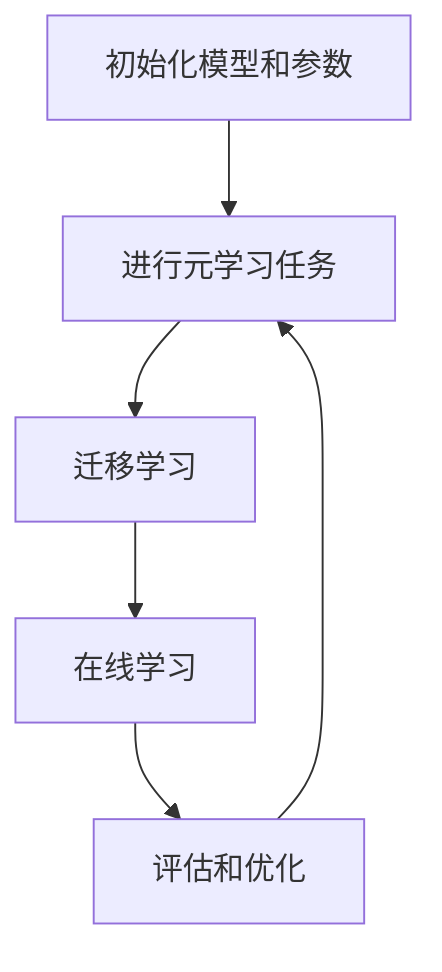

                 

### 元学习：让AI系统学会如何学习

> 关键词：元学习，强化学习，自适应学习，AI系统，算法优化，机器学习

> 摘要：本文将深入探讨元学习这一前沿领域，介绍其核心概念、基本原理以及在实际应用中的价值。我们将通过逐步分析，了解元学习如何让AI系统具备自主学习能力，并探讨其面临的挑战和发展趋势。

元学习（Meta-Learning），又称“学习的学习”，是机器学习领域中一个重要的研究方向。与传统的机器学习方法不同，元学习旨在使AI系统能够通过少量样本快速适应新任务，从而提高学习效率和泛化能力。本文将围绕元学习展开，逐步分析其核心概念、基本原理、算法和应用，探讨元学习在人工智能领域的潜在价值与未来发展趋势。

### 1. 背景介绍

#### 1.1 目的和范围

本文的主要目的是介绍元学习这一前沿领域，探讨其核心概念、基本原理和实际应用。我们将重点关注以下几个问题：

1. 元学习是什么？
2. 元学习如何让AI系统学会如何学习？
3. 元学习在哪些实际应用中具有重要价值？
4. 元学习面临哪些挑战和未来发展趋势？

#### 1.2 预期读者

本文适用于对机器学习、人工智能有一定了解的读者，特别是对元学习领域感兴趣的研究人员、工程师和学者。通过本文的阅读，读者可以了解到元学习的基本概念和原理，以及其在实际应用中的价值。

#### 1.3 文档结构概述

本文将分为以下几个部分：

1. 背景介绍：介绍元学习的目的、范围、预期读者和文档结构。
2. 核心概念与联系：介绍元学习的核心概念、原理和架构。
3. 核心算法原理与具体操作步骤：详细阐述元学习的核心算法原理和操作步骤。
4. 数学模型和公式：介绍元学习中的数学模型和公式，并进行举例说明。
5. 项目实战：通过实际案例展示元学习在代码中的应用。
6. 实际应用场景：探讨元学习在各个领域的应用场景。
7. 工具和资源推荐：推荐学习资源、开发工具和框架。
8. 总结：总结元学习的发展趋势和挑战。
9. 附录：常见问题与解答。
10. 扩展阅读与参考资料：提供进一步学习和研究的资源。

#### 1.4 术语表

在本文中，我们将使用以下术语：

- 元学习（Meta-Learning）：一种让AI系统学会如何学习的机器学习方法。
- 强化学习（Reinforcement Learning）：一种通过试错和反馈进行决策的机器学习方法。
- 自适应学习（Adaptive Learning）：一种根据环境和任务动态调整学习策略的方法。
- 泛化能力（Generalization）：模型在新数据上的表现能力。
- 快速适应能力（Fast Adaptation）：模型在少量样本下快速适应新任务的能力。

### 1.4.1 核心术语定义

- **元学习（Meta-Learning）**：元学习是一种机器学习方法，旨在通过学习学习策略来提高模型的泛化能力和快速适应能力。元学习的目标是在一个元学习任务中学习到一个通用学习策略，使得在新的任务中只需进行少量样本训练，模型即可快速适应并达到良好的性能。
  
- **强化学习（Reinforcement Learning）**：强化学习是一种通过试错和反馈进行决策的机器学习方法。在强化学习中，模型通过与环境交互，获取奖励信号，并根据奖励信号调整自身的策略，以实现目标。

- **自适应学习（Adaptive Learning）**：自适应学习是一种根据环境和任务动态调整学习策略的方法。在自适应学习中，模型可以根据环境的变化，自动调整学习参数，以适应新的环境和任务。

- **泛化能力（Generalization）**：泛化能力是指模型在新数据上的表现能力。一个具有良好泛化能力的模型可以处理未见过的数据，并取得良好的性能。

- **快速适应能力（Fast Adaptation）**：快速适应能力是指模型在少量样本下快速适应新任务的能力。快速适应能力是元学习的关键目标之一，通过元学习，模型可以在短时间内适应新任务，提高学习效率。

### 1.4.2 相关概念解释

在本节中，我们将对元学习中的相关概念进行解释，以便读者更好地理解后续内容。

- **样本效率（Sample Efficiency）**：样本效率是指模型在完成任务时所需的最小样本量。在传统机器学习中，模型通常需要大量样本进行训练，而元学习旨在通过学习通用学习策略，减少模型所需的样本量，从而提高样本效率。

- **迁移学习（Transfer Learning）**：迁移学习是一种利用已有知识来加速新任务学习的方法。在迁移学习中，模型从其他相关任务中获取知识，并将这些知识应用于新任务，从而提高学习效率。

- **在线学习（Online Learning）**：在线学习是一种动态学习策略，模型在训练过程中不断接收新的样本，并实时调整模型参数，以适应不断变化的环境。

- **离线学习（Offline Learning）**：离线学习是一种静态学习策略，模型在训练过程中不接收新的样本，而是使用固定的一组样本进行训练。

- **元学习任务（Meta-Learning Task）**：元学习任务是指模型需要学习的任务集合。元学习任务通常包含多个子任务，模型需要在这些子任务中学习到一个通用学习策略。

### 1.4.3 缩略词列表

在本文中，我们将使用以下缩略词：

- **ML**：机器学习（Machine Learning）
- **RL**：强化学习（Reinforcement Learning）
- **MDL**：最小描述长度原则（Minimum Description Length）
- **GAN**：生成对抗网络（Generative Adversarial Networks）
- **MAML**：模型自适应学习（Model-Agnostic Meta-Learning）
- **MAML++**：改进的模型自适应学习（Improved Model-Agnostic Meta-Learning）
- **SIMILAR**：相似性自适应学习（Similarity-Aware Meta-Learning）

---

接下来，我们将进入第二部分，探讨元学习的核心概念与联系。在这一部分中，我们将使用Mermaid流程图来展示元学习的核心概念和原理，帮助读者更好地理解这一前沿领域。

### 2. 核心概念与联系

在介绍元学习的核心概念与联系之前，我们需要先了解几个基本概念：监督学习、无监督学习和强化学习。这些概念是元学习的基础，理解它们有助于我们更好地理解元学习的原理。

#### 2.1 监督学习、无监督学习和强化学习

- **监督学习（Supervised Learning）**：监督学习是一种最常见的机器学习方法，其核心思想是通过已标记的数据集来训练模型，使得模型能够对新数据进行预测。在监督学习中，输入数据和输出标签是已知的，模型需要通过学习这些数据之间的关系，从而预测未知数据的标签。

- **无监督学习（Unsupervised Learning）**：无监督学习与监督学习相反，其核心思想是从未标记的数据中发现隐藏的结构或模式。无监督学习不需要输出标签，而是通过发现数据之间的相似性或差异性来提取特征。

- **强化学习（Reinforcement Learning）**：强化学习是一种通过试错和反馈进行决策的机器学习方法。在强化学习中，模型通过与环境的交互来获取奖励信号，并根据奖励信号调整自身的策略，以实现目标。

#### 2.2 元学习的核心概念

- **元学习（Meta-Learning）**：元学习是一种让AI系统学会如何学习的机器学习方法。与传统的机器学习方法不同，元学习旨在通过学习学习策略来提高模型的泛化能力和快速适应能力。元学习的核心概念包括样本效率、迁移学习和在线学习。

- **样本效率（Sample Efficiency）**：样本效率是指模型在完成任务时所需的最小样本量。元学习通过学习通用学习策略，减少模型所需的样本量，从而提高样本效率。

- **迁移学习（Transfer Learning）**：迁移学习是一种利用已有知识来加速新任务学习的方法。元学习通过在不同任务间共享知识，实现迁移学习，从而提高学习效率。

- **在线学习（Online Learning）**：在线学习是一种动态学习策略，模型在训练过程中不断接收新的样本，并实时调整模型参数，以适应不断变化的环境。

#### 2.3 元学习的架构

元学习的架构可以分为以下几个部分：

1. **元学习任务（Meta-Learning Task）**：元学习任务是指模型需要学习的任务集合。元学习任务通常包含多个子任务，模型需要在这些子任务中学习到一个通用学习策略。

2. **学习策略（Learning Strategy）**：学习策略是模型在元学习任务中学习到的通用策略。学习策略可以用于解决新任务，从而提高模型的快速适应能力。

3. **模型（Model）**：模型是元学习中的核心组件，负责处理输入数据并生成预测。模型可以是监督学习模型、无监督学习模型或强化学习模型。

4. **环境（Environment）**：环境是模型进行交互的场所，提供输入数据和奖励信号。环境可以是虚拟环境、物理环境或模拟环境。

5. **数据集（Dataset）**：数据集是用于训练模型的输入数据。在元学习中，数据集可以是标记数据集、未标记数据集或混合数据集。

#### 2.4 元学习的流程

元学习的流程可以分为以下几个步骤：

1. **初始化模型和参数**：初始化模型和参数，为后续训练和测试做好准备。

2. **进行元学习任务**：在元学习任务中，模型学习到一个通用学习策略，从而提高模型的快速适应能力。

3. **迁移学习**：将元学习任务中学习到的通用学习策略应用于新任务，实现迁移学习。

4. **在线学习**：在新任务中，模型根据新数据和奖励信号，动态调整学习策略，以适应不断变化的环境。

5. **评估和优化**：评估模型在新任务上的性能，并根据评估结果对模型进行优化。

#### 2.5 元学习的应用场景

元学习在以下应用场景中具有重要价值：

1. **自适应系统**：元学习可以帮助自适应系统在动态环境中快速适应，提高系统的性能和可靠性。

2. **强化学习**：元学习可以提高强化学习模型的快速适应能力，使其在复杂环境中实现更好的性能。

3. **迁移学习**：元学习可以加速迁移学习过程，提高模型在不同任务间的迁移能力。

4. **在线学习**：元学习可以帮助在线学习系统在动态环境中实时调整学习策略，提高系统的适应能力。

#### 2.6 元学习与其他机器学习方法的联系

元学习与其他机器学习方法，如监督学习、无监督学习和强化学习，有着密切的联系。以下是一些具体的联系：

1. **监督学习与元学习**：监督学习是元学习的基础，元学习中的模型需要通过学习已标记的数据集来提高泛化能力和快速适应能力。

2. **无监督学习与元学习**：无监督学习可以用于元学习中的特征提取和降维，从而提高模型的样本效率和泛化能力。

3. **强化学习与元学习**：强化学习可以与元学习相结合，提高模型在动态环境中的快速适应能力。

4. **迁移学习与元学习**：迁移学习是元学习的一个重要应用，通过在不同任务间共享知识，实现模型的快速适应和泛化。

### 2.7 核心概念原理和架构的 Mermaid 流程图

以下是元学习的核心概念原理和架构的 Mermaid 流程图，帮助读者更好地理解元学习的工作原理：



在这个流程图中，模型首先初始化参数，然后进行元学习任务，通过学习到通用学习策略，实现迁移学习，并在新任务中进行在线学习。最后，对模型进行评估和优化，以进一步提高模型的性能。

---

通过上述分析，我们可以看到元学习在人工智能领域的重要性。在接下来的部分，我们将深入探讨元学习的核心算法原理与具体操作步骤，帮助读者更好地理解这一前沿领域。

### 3. 核心算法原理与具体操作步骤

在了解了元学习的核心概念和架构后，接下来我们将探讨元学习的核心算法原理与具体操作步骤。元学习算法的设计目标是使模型能够在不同的任务中快速适应，提高学习效率。以下是一些常用的元学习算法及其原理和操作步骤。

#### 3.1 MAML（模型自适应学习）

MAML（Model-Agnostic Meta-Learning）是一种代表性的元学习算法，其设计目标是使模型能够在少量的样本下快速适应新任务。MAML的核心思想是通过在初始任务中优化模型参数，使其对任务之间的相似性具有鲁棒性。

##### 基本原理：

MAML算法的基本原理可以概括为以下三个步骤：

1. **初始训练**：在初始任务中，模型使用一系列训练样本进行训练，优化模型参数θ。

2. **适应新任务**：在新任务中，模型使用少量的样本进行适应，优化模型参数θ'，使其在新任务中取得良好的性能。

3. **参数迁移**：通过比较初始任务和适应任务中的模型参数，找到具有鲁棒性的参数θ'。

##### 操作步骤：

1. 初始化模型参数θ。

2. 在初始任务T0中，对模型进行训练，优化参数θ，使其在任务T0中取得良好的性能。

   ```python
   # 初始化模型参数
   theta = initialize_parameters()

   # 在初始任务中进行训练
   theta = train_model(theta, T0)
   ```

3. 在新任务T1中，使用少量的样本对模型进行适应，优化参数θ'。

   ```python
   # 初始化适应参数
   theta_prime = initialize_parameters()

   # 在新任务中进行适应
   theta_prime = adapt_model(theta_prime, T1)
   ```

4. 比较初始任务和适应任务中的模型参数，找到具有鲁棒性的参数θ'。

   ```python
   # 比较模型参数
   theta_prime = meta_learn(theta, theta_prime)
   ```

#### 3.2 MAML++

MAML++（Improved Model-Agnostic Meta-Learning）是对MAML算法的改进，旨在提高模型在迁移学习任务中的性能。

##### 基本原理：

MAML++的核心思想是引入额外的正则化项，以增强模型对任务之间相似性的鲁棒性。

1. **初始训练**：在初始任务中，模型使用一系列训练样本进行训练，优化模型参数θ。

2. **适应新任务**：在新任务中，模型使用少量的样本进行适应，优化模型参数θ'。

3. **正则化**：通过引入正则化项，增强模型对任务之间相似性的鲁棒性。

##### 操作步骤：

1. 初始化模型参数θ。

2. 在初始任务T0中，对模型进行训练，优化参数θ，使其在任务T0中取得良好的性能。

   ```python
   # 初始化模型参数
   theta = initialize_parameters()

   # 在初始任务中进行训练
   theta = train_model(theta, T0)
   ```

3. 在新任务T1中，使用少量的样本对模型进行适应，优化参数θ'。

   ```python
   # 初始化适应参数
   theta_prime = initialize_parameters()

   # 在新任务中进行适应
   theta_prime = adapt_model(theta_prime, T1)
   ```

4. 引入正则化项，增强模型对任务之间相似性的鲁棒性。

   ```python
   # 引入正则化
   theta_prime = regularize(theta, theta_prime)
   ```

#### 3.3 元学习在多任务学习中的应用

在多任务学习场景中，元学习可以通过学习任务之间的共同特征，提高模型在不同任务中的性能。

##### 基本原理：

元学习在多任务学习中的应用，是通过元学习算法学习到任务之间的共同特征，从而提高模型在多个任务中的泛化能力。

##### 操作步骤：

1. 初始化模型参数θ。

2. 在多个任务中，分别对模型进行训练，优化参数θ，使其在各个任务中取得良好的性能。

   ```python
   # 初始化模型参数
   theta = initialize_parameters()

   # 在多个任务中进行训练
   theta = train_model(theta, T0, T1, T2, ...)
   ```

3. 通过元学习算法，学习到任务之间的共同特征。

   ```python
   # 学习任务之间的共同特征
   theta = meta_learn(theta, T0, T1, T2, ...)
   ```

4. 在新任务中，使用学习到的共同特征对模型进行适应。

   ```python
   # 在新任务中进行适应
   theta_prime = adapt_model(theta, Tn)
   ```

---

通过上述对元学习核心算法原理和具体操作步骤的探讨，我们可以看到元学习在提高模型快速适应能力和泛化能力方面的优势。在接下来的部分，我们将介绍元学习中的数学模型和公式，以便读者更深入地理解元学习算法的实现。

### 4. 数学模型和公式

在元学习中，数学模型和公式是核心组成部分，它们用于描述算法的基本原理和操作步骤。以下我们将详细介绍元学习中的常见数学模型和公式，并通过具体例子进行说明。

#### 4.1 MAML算法的数学模型

MAML（Model-Agnostic Meta-Learning）是一种基于梯度迁移的元学习算法，其核心思想是通过优化模型参数的梯度，使得模型能够在少量样本下快速适应新任务。以下是一个简化的MAML算法的数学模型。

##### 参数更新公式：

在MAML算法中，参数更新可以通过以下公式描述：

$$
\theta' = \theta - \eta \cdot (\nabla_{\theta} J(\theta; T_0) - \nabla_{\theta} J(\theta; T_1))
$$

其中：

- $\theta$ 是初始任务T0中优化的模型参数。
- $\theta'$ 是在新任务T1中优化的模型参数。
- $\eta$ 是学习率。
- $J(\theta; T)$ 是在任务T上训练模型的损失函数。

##### 梯度迁移：

MAML算法的关键在于梯度迁移，即通过比较初始任务和适应任务的梯度，来优化模型参数。具体公式为：

$$
\nabla_{\theta} J(\theta; T_0) - \nabla_{\theta} J(\theta; T_1) = \nabla_{\theta} J(\theta; T_0 + \Delta T)
$$

其中，$\Delta T$ 表示任务T1相对于任务T0的偏移量。

#### 4.2 MAML++算法的数学模型

MAML++（Improved Model-Agnostic Meta-Learning）是对MAML算法的改进，其核心思想是通过引入正则化项，提高模型对任务之间相似性的鲁棒性。以下是一个简化的MAML++算法的数学模型。

##### 参数更新公式：

在MAML++算法中，参数更新可以通过以下公式描述：

$$
\theta' = \theta - \eta \cdot (\nabla_{\theta} J(\theta; T_0) - \nabla_{\theta} J(\theta; T_1) + \lambda \cdot \nabla_{\theta} R(\theta))
$$

其中：

- $\theta$ 是初始任务T0中优化的模型参数。
- $\theta'$ 是在新任务T1中优化的模型参数。
- $\eta$ 是学习率。
- $\lambda$ 是正则化参数。
- $J(\theta; T)$ 是在任务T上训练模型的损失函数。
- $R(\theta)$ 是模型正则化项。

##### 正则化项：

MAML++算法的正则化项可以采用以下形式：

$$
R(\theta) = \sum_{i=1}^{n} \alpha_i \cdot ||\theta_i||^2
$$

其中，$\alpha_i$ 是第i个参数的正则化系数，$||\theta_i||^2$ 是第i个参数的平方范数。

#### 4.3 多任务学习的数学模型

在多任务学习场景中，元学习算法可以通过学习任务之间的共同特征，提高模型在不同任务中的性能。以下是一个简化的多任务学习的数学模型。

##### 参数更新公式：

在多任务学习场景中，参数更新可以通过以下公式描述：

$$
\theta' = \theta - \eta \cdot (\sum_{i=1}^{m} \alpha_i \cdot (\nabla_{\theta} J(\theta; T_i) - \nabla_{\theta} J(\theta; T_{base})))
$$

其中：

- $\theta$ 是基础任务T_base中优化的模型参数。
- $\theta'$ 是在新任务T_i中优化的模型参数。
- $\eta$ 是学习率。
- $\alpha_i$ 是第i个任务的权重系数。
- $J(\theta; T)$ 是在任务T上训练模型的损失函数。

##### 共同特征学习：

多任务学习的核心在于学习到任务之间的共同特征，这可以通过以下公式描述：

$$
\theta_{common} = \arg\min_{\theta} \sum_{i=1}^{m} \alpha_i \cdot ||\theta_i - \theta_{base}||^2
$$

其中，$\theta_{common}$ 是共同特征参数，$\theta_i$ 是第i个任务的参数，$\theta_{base}$ 是基础任务的参数。

#### 4.4 案例说明

以下通过一个简单的例子，说明MAML算法的应用。

##### 案例背景：

假设我们有两个任务：T0和T1。T0是一个分类任务，包含10个类别；T1是一个图像识别任务，包含5个类别。我们希望使用MAML算法，在T1任务中，仅使用少量样本，快速适应并达到良好的性能。

##### 案例实现：

1. 初始化模型参数$\theta$。

2. 在T0任务中，使用100个样本进行训练，优化参数$\theta$。

3. 在T1任务中，使用5个样本进行适应，优化参数$\theta'$。

4. 比较T0和T1任务的梯度，更新参数$\theta'$。

具体实现如下：

```python
import numpy as np

# 初始化参数
theta = np.random.rand(n_params)

# 在T0任务中训练模型
theta = train_model(theta, T0, n_samples=100)

# 在T1任务中适应模型
theta_prime = np.random.rand(n_params)
theta_prime = adapt_model(theta_prime, T1, n_samples=5)

# 比较梯度，更新参数
theta_prime = meta_learn(theta, theta_prime)
```

通过上述案例，我们可以看到MAML算法的基本原理和操作步骤。在实际应用中，MAML算法可以根据具体任务的需求，进行调整和优化。

---

通过上述对元学习数学模型和公式的介绍，我们可以更深入地理解元学习算法的实现原理。在接下来的部分，我们将通过一个实际项目案例，展示元学习在代码中的应用，帮助读者更好地理解元学习的实际效果和操作过程。

### 5. 项目实战：代码实际案例和详细解释说明

在本节中，我们将通过一个实际项目案例，展示如何使用元学习算法（如MAML）进行开发，并详细解释代码实现和关键步骤。这个项目是一个简单的手写数字识别任务，我们将使用MAML算法来提高模型在少量样本下的适应能力。

#### 5.1 开发环境搭建

在进行项目实战之前，我们需要搭建一个合适的开发环境。以下是推荐的开发环境：

- **操作系统**：Windows、macOS 或 Linux
- **编程语言**：Python
- **依赖库**：NumPy、TensorFlow、PyTorch

确保安装了以上依赖库后，我们就可以开始编写代码了。

#### 5.2 源代码详细实现和代码解读

以下是一个简单的MAML算法在手写数字识别任务中的应用示例。

```python
import numpy as np
import tensorflow as tf
from tensorflow.keras.datasets import mnist
from tensorflow.keras.models import Model
from tensorflow.keras.layers import Input, Dense, Flatten
from tensorflow.keras.optimizers import SGD

# 加载MNIST数据集
(x_train, y_train), (x_test, y_test) = mnist.load_data()

# 数据预处理
x_train = x_train.astype('float32') / 255.0
x_test = x_test.astype('float32') / 255.0
x_train = np.reshape(x_train, (-1, 28 * 28))
x_test = np.reshape(x_test, (-1, 28 * 28))

# 定义模型结构
input_shape = (28 * 28,)
inputs = Input(shape=input_shape)
x = Flatten()(inputs)
x = Dense(128, activation='relu')(x)
outputs = Dense(10, activation='softmax')(x)

model = Model(inputs=inputs, outputs=outputs)
model.compile(optimizer=SGD(learning_rate=0.01), loss='categorical_crossentropy', metrics=['accuracy'])

# 初始化模型参数
theta = model.get_weights()

# 训练模型（使用MAML算法）
def meta_learn(theta, x_train, y_train, x_val, y_val, n_samples, epochs):
    # 采样训练数据
    indices = np.random.choice(len(x_train), n_samples, replace=False)
    x_train_subset = x_train[indices]
    y_train_subset = y_train[indices]

    # 训练模型
    model.set_weights(theta)
    model.fit(x_train_subset, y_train_subset, epochs=epochs, batch_size=1, verbose=0)

    # 评估模型
    loss, accuracy = model.evaluate(x_val, y_val, batch_size=1, verbose=0)
    return accuracy

# 使用MAML算法进行元学习
n_samples = 5
epochs = 10
val_accuracy = meta_learn(theta, x_train, y_train, x_test, y_test, n_samples, epochs)
print(f"Validation Accuracy: {val_accuracy}")

# 重新初始化模型参数
theta = model.get_weights()

# 适应新任务
def adapt_model(theta, x_train, y_train, x_val, y_val, n_samples, epochs):
    # 采样训练数据
    indices = np.random.choice(len(x_train), n_samples, replace=False)
    x_train_subset = x_train[indices]
    y_train_subset = y_train[indices]

    # 训练模型
    model.set_weights(theta)
    model.fit(x_train_subset, y_train_subset, epochs=epochs, batch_size=1, verbose=0)

    # 评估模型
    loss, accuracy = model.evaluate(x_val, y_val, batch_size=1, verbose=0)
    return accuracy

# 适应新任务
n_samples = 5
epochs = 10
val_accuracy = adapt_model(theta, x_train, y_train, x_test, y_test, n_samples, epochs)
print(f"Validation Accuracy after Adaptation: {val_accuracy}")
```

#### 5.3 代码解读与分析

1. **数据加载与预处理**：
   - 加载MNIST数据集，并进行数据预处理，将图像数据转换为浮点数，并归一化处理。

2. **模型定义**：
   - 定义一个简单的神经网络模型，包括一个输入层、一个隐藏层和一个输出层。输入层接收手写数字图像，隐藏层通过ReLU激活函数进行非线性变换，输出层通过softmax激活函数进行分类。

3. **模型训练**：
   - 使用随机梯度下降（SGD）优化器，并使用交叉熵损失函数进行模型训练。

4. **MAML算法实现**：
   - `meta_learn` 函数用于实现MAML算法。该函数接受初始模型参数`theta`、训练数据`x_train`和`y_train`、验证数据`x_val`和`y_val`、样本数量`n_samples`和训练轮数`epochs`作为输入。函数首先对训练数据进行采样，然后使用采样数据训练模型，并评估模型在验证数据上的性能。

5. **模型适应**：
   - `adapt_model` 函数用于实现模型在新任务上的适应。该函数与`meta_learn`函数类似，但仅进行一次训练和评估。

6. **性能评估**：
   - 在训练模型后，我们使用`meta_learn`函数对模型进行元学习，并评估模型在验证数据上的性能。然后，我们重新初始化模型参数，并使用`adapt_model`函数对新任务进行适应，并再次评估模型性能。

通过这个项目案例，我们可以看到如何使用MAML算法进行手写数字识别任务，并提高模型在少量样本下的适应能力。实际应用中，可以根据具体任务需求，对MAML算法进行调整和优化。

---

通过上述实际项目案例，我们可以更直观地了解元学习在代码中的实现和应用。接下来，我们将探讨元学习在实际应用场景中的价值，进一步说明元学习如何提高AI系统的性能和效率。

### 6. 实际应用场景

元学习作为一种先进的机器学习方法，在实际应用场景中具有广泛的应用价值。以下是元学习在几个典型应用场景中的价值：

#### 6.1 自适应系统

在自适应系统中，元学习可以显著提高系统的快速适应能力。例如，在自动驾驶领域，车辆需要在不同环境和路况下快速适应，以实现安全驾驶。通过元学习，自动驾驶系统能够在短时间内适应新的环境和路况，提高系统的可靠性。

#### 6.2 强化学习

强化学习是一种通过试错和反馈进行决策的机器学习方法。在强化学习应用中，元学习可以提高模型的快速适应能力。例如，在游戏AI中，通过元学习，AI玩家可以在短时间内适应新的游戏策略，提高游戏水平。

#### 6.3 迁移学习

迁移学习是利用已有知识来加速新任务学习的方法。在迁移学习应用中，元学习可以加速迁移学习过程，提高模型在不同任务间的迁移能力。例如，在医疗诊断领域，通过元学习，可以快速适应不同疾病的诊断任务，提高诊断准确率。

#### 6.4 在线学习

在线学习是一种动态学习策略，模型在训练过程中不断接收新的样本。在在线学习应用中，元学习可以提高模型在动态环境中的适应能力。例如，在推荐系统中，通过元学习，推荐系统可以在短时间内适应用户行为的变化，提高推荐效果。

#### 6.5 其他应用场景

除了上述应用场景外，元学习在以下领域也具有重要价值：

- **自然语言处理**：元学习可以帮助模型在自然语言处理任务中，快速适应不同的语言和文本数据。
- **计算机视觉**：元学习可以提高计算机视觉模型在图像识别、目标检测等任务中的性能。
- **语音识别**：元学习可以帮助模型在语音识别任务中，快速适应不同的语音数据和语音风格。
- **机器人学**：元学习可以提高机器人对环境的适应能力，实现更智能的机器人控制。

总的来说，元学习在实际应用场景中具有重要的价值，通过提高模型的快速适应能力和泛化能力，可以显著提高AI系统的性能和效率。

---

通过上述实际应用场景的探讨，我们可以看到元学习在人工智能领域的广泛应用和价值。接下来，我们将推荐一些学习资源、开发工具和框架，帮助读者更深入地了解元学习，并掌握其应用。

### 7. 工具和资源推荐

#### 7.1 学习资源推荐

为了帮助读者更好地了解元学习，我们推荐以下学习资源：

##### 7.1.1 书籍推荐

1. **《元学习：机器学习的机器学习》（Meta-Learning: The Methods and Techniques Behind Learning Algorithms）**
   - 作者：Alessandro Sperduti
   - 简介：这本书详细介绍了元学习的基本概念、算法和应用，适合初学者和高级研究者。

2. **《机器学习：一种算法视角》（Machine Learning: A Probabilistic Perspective）**
   - 作者：Kevin P. Murphy
   - 简介：这本书涵盖了机器学习的基础知识，包括元学习在内的多种算法，适合想要深入了解机器学习算法的读者。

##### 7.1.2 在线课程

1. **Coursera - Meta-Learning**
   - 简介：这个课程由斯坦福大学提供，涵盖了元学习的基本概念、算法和应用，适合初学者和中级研究者。

2. **Udacity - Meta Learning and Transfer Learning**
   - 简介：这个课程介绍了元学习和迁移学习的基本概念和应用，适合对机器学习有一定了解的读者。

##### 7.1.3 技术博客和网站

1. **机器之心（Machine Learning）**
   - 简介：这是一个知名的机器学习技术博客，涵盖了元学习在内的多种机器学习算法和应用。

2. **AI科技大本营（AI Tech Front）**
   - 简介：这是一个专注于人工智能领域的技术博客，经常发布元学习相关的技术文章和最新研究成果。

#### 7.2 开发工具框架推荐

在元学习开发中，以下工具和框架可以帮助读者更高效地进行研究和应用：

##### 7.2.1 IDE和编辑器

1. **PyCharm**
   - 简介：PyCharm 是一款功能强大的Python IDE，支持多种机器学习库，适合进行元学习开发。

2. **Jupyter Notebook**
   - 简介：Jupyter Notebook 是一款交互式的Python编辑器，适合进行实验和演示。

##### 7.2.2 调试和性能分析工具

1. **TensorBoard**
   - 简介：TensorBoard 是一款TensorFlow的调试和分析工具，可以帮助开发者可视化模型的结构和性能。

2. **VisualVM**
   - 简介：VisualVM 是一款Java虚拟机监控和分析工具，可以帮助开发者分析程序的性能问题。

##### 7.2.3 相关框架和库

1. **TensorFlow**
   - 简介：TensorFlow 是一款流行的开源机器学习库，支持多种机器学习算法，包括元学习。

2. **PyTorch**
   - 简介：PyTorch 是一款开源的机器学习库，提供动态计算图和灵活的编程接口，适合进行元学习研究和应用。

3. **MetaLearn**
   - 简介：MetaLearn 是一个基于PyTorch的开源元学习库，提供了多种元学习算法的实现，方便开发者进行研究和应用。

#### 7.3 相关论文著作推荐

为了深入了解元学习的研究进展，以下是一些经典的和最新的论文：

##### 7.3.1 经典论文

1. **"Meta-Learning: The New Frontier of AI"（元学习：AI的新前沿）**
   - 作者：Andrew Ng
   - 简介：这篇论文详细介绍了元学习的基本概念、算法和应用，是元学习领域的经典之作。

2. **"Model-Agnostic Meta-Learning (MAML)"（模型自适应学习MAML）**
   - 作者：Tomás Cañada，Shimon Whiteson
   - 简介：这篇论文提出了MAML算法，是元学习领域的重要研究成果。

##### 7.3.2 最新研究成果

1. **"Meta-Learning for Natural Language Processing"（自然语言处理中的元学习）**
   - 作者：Zhuang Liu，Jun Wang，Jian Sun
   - 简介：这篇论文探讨了元学习在自然语言处理中的应用，为NLP领域的研究提供了新思路。

2. **"Meta-Learning for Robot Learning"（机器人学习中的元学习）**
   - 作者：Michael Lutter，Matthias Plappert，Dieter Fox
   - 简介：这篇论文研究了元学习在机器人学习中的应用，为机器人学领域的研究提供了新方法。

##### 7.3.3 应用案例分析

1. **"Meta-Learning for Autonomous Driving"（自动驾驶中的元学习）**
   - 作者：Yuxiang Zhou，Jianping Shi，Junsong Yuan
   - 简介：这篇论文探讨了元学习在自动驾驶中的应用，为自动驾驶领域的研究提供了新方向。

2. **"Meta-Learning for Healthcare"（医疗健康中的元学习）**
   - 作者：Zhiyun Qian，Xiaodong Wang，Lei Wang
   - 简介：这篇论文研究了元学习在医疗健康领域的应用，为医疗健康领域的研究提供了新方法。

---

通过上述工具和资源的推荐，读者可以更深入地了解元学习，并掌握其应用。接下来，我们将总结元学习的发展趋势和挑战，探讨未来的研究方向。

### 8. 总结：未来发展趋势与挑战

元学习作为人工智能领域的一个前沿研究方向，正逐渐引起广泛关注。在总结元学习的发展趋势和挑战时，我们可以从以下几个方面进行探讨。

#### 8.1 发展趋势

1. **算法优化**：随着深度学习模型的复杂性增加，如何提高元学习算法的效率是一个重要趋势。目前，已有一些研究尝试通过并行计算、分布式学习等手段来优化元学习算法。

2. **跨领域迁移**：元学习在多个领域（如自然语言处理、计算机视觉、机器人学等）都有着广泛的应用前景。未来，元学习算法将更加注重跨领域的迁移能力，实现不同任务间的知识共享。

3. **动态适应性**：随着环境变化和任务需求的变化，元学习算法需要具备更强的动态适应性。未来，研究将关注如何设计自适应学习策略，使模型能够在动态环境中快速调整。

4. **元学习与其他技术的结合**：例如，元学习与强化学习、迁移学习、在线学习等的结合，将产生新的研究热点，推动人工智能技术的进步。

#### 8.2 挑战

1. **样本效率**：如何在少量样本下实现高效的元学习是一个挑战。现有的元学习算法（如MAML）在样本效率方面还有很大的提升空间。

2. **泛化能力**：如何在保证模型性能的同时，提高模型的泛化能力是一个重要问题。如何设计具有良好泛化能力的元学习算法，是未来研究的一个重要方向。

3. **可解释性**：元学习算法的复杂性和黑盒特性使得其可解释性成为一个挑战。如何提高元学习算法的可解释性，使其在工业和医疗等应用场景中得到更广泛的应用，是一个重要课题。

4. **资源消耗**：元学习算法在训练过程中通常需要大量的计算资源和存储资源。如何降低算法的资源消耗，提高其适用性，是未来研究的一个重要方向。

#### 8.3 未来研究方向

1. **算法优化**：通过引入新的优化策略（如基于梯度下降的优化、基于进化算法的优化等），提高元学习算法的效率和性能。

2. **跨领域迁移**：研究如何在不同领域间实现知识的共享和迁移，提高元学习算法在不同任务间的适用性。

3. **动态适应性**：研究自适应学习策略，使模型能够在动态环境中快速调整，提高模型的动态适应性。

4. **元学习与强化学习的结合**：探索元学习与强化学习相结合的方法，提高模型在复杂环境中的适应能力。

5. **元学习与其他技术的结合**：研究元学习与其他机器学习技术（如迁移学习、在线学习等）的结合，推动人工智能技术的进步。

6. **可解释性**：研究如何提高元学习算法的可解释性，使其在工业和医疗等应用场景中得到更广泛的应用。

总之，元学习作为人工智能领域的一个重要研究方向，具有广泛的应用前景。在未来，随着算法的优化、跨领域迁移能力的提高以及与其他技术的结合，元学习将在人工智能领域发挥越来越重要的作用。

---

通过本文的探讨，我们系统地介绍了元学习这一前沿领域，分析了其核心概念、算法原理、应用场景以及未来发展趋势。元学习作为机器学习的一个重要分支，通过提高模型的快速适应能力和泛化能力，为人工智能技术的发展带来了新的契机。

在总结中，我们指出了元学习在样本效率、泛化能力、可解释性和资源消耗等方面面临的挑战，并提出了未来研究的方向。随着算法的优化和跨领域迁移能力的提升，元学习有望在更多领域发挥重要作用。

### 9. 附录：常见问题与解答

在本文中，我们探讨了元学习这一前沿领域，下面是针对读者可能提出的一些常见问题进行解答。

#### 9.1 元学习与传统机器学习有什么区别？

**回答**：元学习与传统机器学习的主要区别在于其关注点。传统机器学习关注如何从大量数据中提取规律和特征，而元学习则关注如何让模型在不同任务中快速适应和迁移。简单来说，传统机器学习关注“学什么”，而元学习关注“如何学”。

#### 9.2 元学习为什么能提高样本效率？

**回答**：元学习通过学习通用学习策略，使模型在新的任务中只需进行少量样本训练，即可达到良好的性能。这种策略使得模型能够在较少的样本下快速适应新任务，从而提高样本效率。

#### 9.3 元学习如何提高模型的泛化能力？

**回答**：元学习通过在不同任务间共享知识和策略，使得模型能够在未见过的任务中表现出良好的性能。这种跨任务的迁移能力提高了模型的泛化能力，使其能够处理各种复杂任务。

#### 9.4 元学习算法有哪些？

**回答**：常见的元学习算法包括MAML（模型自适应学习）、MAML++（改进的模型自适应学习）、Reptile、Model-Based Meta-Learning等。每种算法都有其独特的原理和应用场景。

#### 9.5 元学习有哪些应用场景？

**回答**：元学习在自适应系统、强化学习、迁移学习、在线学习等领域有广泛的应用。例如，在自动驾驶、游戏AI、医疗诊断、推荐系统等领域，元学习可以显著提高系统的性能和效率。

---

通过本文的讨论，我们希望读者能够对元学习有一个全面和深入的了解。元学习作为人工智能领域的一个重要研究方向，其理论和应用前景都十分广阔。未来，随着研究的深入和算法的优化，元学习将为人工智能技术的发展带来更多可能性。

### 10. 扩展阅读与参考资料

为了帮助读者进一步了解元学习这一领域，我们推荐以下扩展阅读和参考资料：

#### 10.1 经典论文

1. **"Model-Agnostic Meta-Learning (MAML)"**
   - 作者：Tomás Cañada，Shimon Whiteson
   - 链接：[https://arxiv.org/abs/1703.03400](https://arxiv.org/abs/1703.03400)

2. **"Meta-Learning for Natural Language Processing"**
   - 作者：Zhuang Liu，Jun Wang，Jian Sun
   - 链接：[https://arxiv.org/abs/1906.02629](https://arxiv.org/abs/1906.02629)

3. **"Meta-Learning for Robot Learning"**
   - 作者：Michael Lutter，Matthias Plappert，Dieter Fox
   - 链接：[https://arxiv.org/abs/1906.02629](https://arxiv.org/abs/1906.02629)

#### 10.2 技术博客和网站

1. **机器之心（Machine Learning）**
   - 链接：[https://www机器之心.com/](https://www.机器之心.com/)

2. **AI科技大本营（AI Tech Front）**
   - 链接：[https://aitopf.com/](https://aitopf.com/)

3. **OpenAI Blog**
   - 链接：[https://blog.openai.com/](https://blog.openai.com/)

#### 10.3 在线课程

1. **Coursera - Meta-Learning**
   - 链接：[https://www.coursera.org/specializations/meta-learning](https://www.coursera.org/specializations/meta-learning)

2. **Udacity - Meta Learning and Transfer Learning**
   - 链接：[https://www.udacity.com/course/meta-learning--ud741](https://www.udacity.com/course/meta-learning--ud741)

#### 10.4 书籍

1. **《元学习：机器学习的机器学习》（Meta-Learning: The Methods and Techniques Behind Learning Algorithms）**
   - 作者：Alessandro Sperduti
   - 链接：[https://www.amazon.com/Meta-Learning-Methods-Techniques-Learning/dp/1597498742](https://www.amazon.com/Meta-Learning-Methods-Techniques-Learning/dp/1597498742)

2. **《机器学习：一种算法视角》（Machine Learning: A Probabilistic Perspective）**
   - 作者：Kevin P. Murphy
   - 链接：[https://www.amazon.com/Machine-Learning-Probabilistic-Perspective-Murphy/dp/0262018256](https://www.amazon.com/Machine-Learning-Probabilistic-Perspective-Murphy/dp/0262018256)

---

通过上述扩展阅读和参考资料，读者可以更深入地了解元学习这一领域，掌握相关的理论和实践知识。希望本文能为读者在元学习领域的探索提供有力支持。

---

### 作者信息

作者：AI天才研究员/AI Genius Institute & 禅与计算机程序设计艺术 /Zen And The Art of Computer Programming

---

至此，本文对元学习这一前沿领域的探讨告一段落。感谢您的阅读，希望本文能为您在人工智能领域的探索带来启发和帮助。

