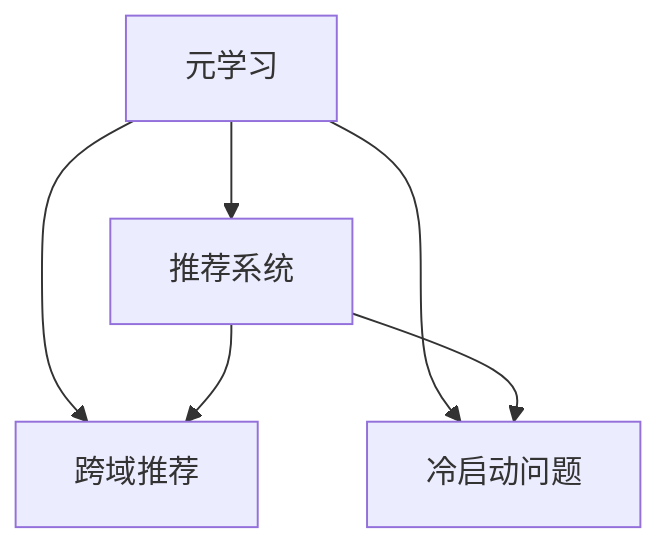

                 

# 元学习在推荐系统跨域推荐与冷启动问题中的算法创新与实践

> **关键词：** 元学习、推荐系统、跨域推荐、冷启动问题、算法优化、模型创新

> **摘要：** 本文将深入探讨元学习在推荐系统中的跨域推荐与冷启动问题中的应用。通过对元学习核心概念和算法原理的剖析，结合具体操作步骤和实际案例，文章旨在展示元学习在推荐系统优化中的独特价值，并提供实用的解决方案。

## 1. 背景介绍

### 1.1 目的和范围

本文旨在研究元学习在推荐系统中的跨域推荐与冷启动问题中的应用。随着互联网的快速发展，推荐系统已经成为提高用户满意度、提升商业价值的关键技术。然而，推荐系统的跨域推荐与冷启动问题一直是该领域的重要挑战。通过引入元学习，我们希望探索一种新的算法优化途径，以应对这些难题。

### 1.2 预期读者

本文适用于对推荐系统有一定了解的读者，包括推荐系统开发者、算法工程师、人工智能研究人员等。同时，本文也适合对元学习感兴趣的技术爱好者。

### 1.3 文档结构概述

本文将分为以下章节：

1. **背景介绍**：介绍本文的目的、预期读者以及文档结构。
2. **核心概念与联系**：阐述元学习和推荐系统的基础知识，并使用流程图展示核心概念之间的关系。
3. **核心算法原理 & 具体操作步骤**：详细解释元学习的算法原理和操作步骤。
4. **数学模型和公式 & 详细讲解 & 举例说明**：介绍元学习中的数学模型和公式，并进行举例说明。
5. **项目实战：代码实际案例和详细解释说明**：通过具体代码案例展示元学习在推荐系统中的应用。
6. **实际应用场景**：探讨元学习在推荐系统中的实际应用场景。
7. **工具和资源推荐**：推荐学习资源和开发工具。
8. **总结：未来发展趋势与挑战**：总结本文的主要观点，并展望未来发展趋势与挑战。
9. **附录：常见问题与解答**：回答读者可能关心的问题。
10. **扩展阅读 & 参考资料**：提供进一步学习的参考资料。

### 1.4 术语表

#### 1.4.1 核心术语定义

- **元学习（Meta-Learning）**：一种通过学习学习的方法，旨在提高算法在不同任务上的泛化能力。
- **推荐系统（Recommendation System）**：一种利用历史数据为用户提供个性化推荐的系统。
- **跨域推荐（Cross-Domain Recommendation）**：在不同的领域或数据集之间进行推荐。
- **冷启动问题（Cold Start Problem）**：指在用户或物品信息不足的情况下进行推荐。

#### 1.4.2 相关概念解释

- **深度学习（Deep Learning）**：一种基于多层神经网络的学习方法，能够自动提取特征并进行分类。
- **强化学习（Reinforcement Learning）**：一种通过试错法进行决策优化的学习方法。
- **迁移学习（Transfer Learning）**：将已学习到的知识迁移到新的任务上。

#### 1.4.3 缩略词列表

- **ML**：元学习（Meta-Learning）
- **DL**：深度学习（Deep Learning）
- **RL**：强化学习（Reinforcement Learning）
- **NN**：神经网络（Neural Network）
- **CS**：冷启动问题（Cold Start Problem）

## 2. 核心概念与联系

在探讨元学习在推荐系统中的应用之前，我们需要了解一些核心概念和它们之间的联系。

### 2.1 元学习

元学习是一种通过学习学习的方法，旨在提高算法在不同任务上的泛化能力。它的核心思想是通过学习一个通用模型，使模型能够在新的任务上快速适应。元学习包括以下几个方面：

- **模型表示（Model Representation）**：表示模型在特定任务上的表现。
- **优化目标（Optimization Objective）**：优化模型表示，使其在新的任务上表现更好。
- **元学习算法（Meta-Learning Algorithms）**：实现元学习的算法，如模型平均（Model Averaging）、模型选择（Model Selection）等。

### 2.2 推荐系统

推荐系统是一种利用历史数据为用户提供个性化推荐的系统。其主要目的是通过分析用户的兴趣和行为，为用户提供符合他们需求的推荐。推荐系统包括以下几个方面：

- **用户行为数据（User Behavior Data）**：用户的浏览、搜索、购买等行为数据。
- **物品特征（Item Features）**：物品的属性、标签、分类等信息。
- **推荐算法（Recommendation Algorithms）**：用于生成推荐列表的算法，如基于协同过滤（Collaborative Filtering）、基于内容的推荐（Content-Based Recommendation）等。
- **评估指标（Evaluation Metrics）**：用于评估推荐系统性能的指标，如准确率（Accuracy）、召回率（Recall）等。

### 2.3 跨域推荐与冷启动问题

跨域推荐和冷启动问题是推荐系统中常见的挑战。

- **跨域推荐**：指在不同的领域或数据集之间进行推荐。跨域推荐的目标是利用不同领域的知识来提高推荐系统的性能。
- **冷启动问题**：指在用户或物品信息不足的情况下进行推荐。冷启动问题主要涉及新用户和新物品的推荐。

### 2.4 核心概念之间的联系

元学习、推荐系统、跨域推荐和冷启动问题之间存在紧密的联系。元学习可以通过学习通用模型来提高推荐系统的泛化能力，从而解决跨域推荐和冷启动问题。

- **元学习与推荐系统**：元学习可以提高推荐系统的泛化能力，使其在新的任务上表现更好。
- **元学习与跨域推荐**：元学习可以通过跨域迁移学习来利用不同领域的知识，提高跨域推荐的效果。
- **元学习与冷启动问题**：元学习可以通过在新用户和新物品上快速适应，解决冷启动问题。

下面是元学习、推荐系统、跨域推荐和冷启动问题之间的 Mermaid 流程图：



## 3. 核心算法原理 & 具体操作步骤

### 3.1 元学习算法原理

元学习算法的核心思想是通过学习一个通用模型，使模型能够在新的任务上快速适应。以下是一个简单的元学习算法原理：

```python
# 元学习算法原理伪代码
def meta_learning(dataset, meta_learning_rate, num_iterations):
    # 初始化模型
    model = initialize_model()
    
    for iteration in range(num_iterations):
        # 对每个任务进行迭代
        for task in dataset:
            # 计算损失函数
            loss = compute_loss(model, task)
            
            # 更新模型参数
            model = update_model(model, loss, meta_learning_rate)
            
    return model
```

### 3.2 元学习在推荐系统中的应用

在推荐系统中，元学习可以通过以下步骤来应用于跨域推荐和冷启动问题：

#### 3.2.1 数据预处理

1. **收集数据**：收集不同领域或数据集的用户行为数据和物品特征。
2. **数据清洗**：去除无效数据、处理缺失值和异常值。
3. **特征提取**：提取用户行为数据和物品特征的表示。

#### 3.2.2 模型初始化

1. **初始化模型**：使用预训练模型或随机初始化模型。
2. **定义损失函数**：选择合适的损失函数，如均方误差（MSE）或交叉熵损失。
3. **定义优化器**：选择合适的优化器，如Adam或SGD。

#### 3.2.3 训练模型

1. **迭代训练**：对每个任务进行迭代训练。
2. **计算损失**：计算模型在每个任务上的损失。
3. **更新模型**：使用元学习率调整模型参数。

#### 3.2.4 推荐生成

1. **用户表示**：对用户行为数据进行编码，得到用户表示。
2. **物品表示**：对物品特征进行编码，得到物品表示。
3. **生成推荐列表**：使用生成的用户表示和物品表示计算推荐得分，并生成推荐列表。

### 3.3 操作步骤示例

以下是一个简单的元学习在推荐系统中的应用步骤示例：

```python
# 元学习在推荐系统中的应用步骤示例

# 收集数据
datasets = collect_datasets()

# 数据预处理
datasets = preprocess_datasets(datasets)

# 初始化模型
model = initialize_model()

# 训练模型
model = meta_learning(datasets, meta_learning_rate=0.001, num_iterations=100)

# 用户表示
user_representation = encode_user_behavior(user_behavior_data)

# 物品表示
item_representation = encode_item_features(item_features)

# 生成推荐列表
recommendation_list = generate_recommendation_list(user_representation, item_representation)
```

## 4. 数学模型和公式 & 详细讲解 & 举例说明

在元学习中，数学模型和公式起着至关重要的作用。以下将介绍元学习中的几个关键数学模型和公式，并进行详细讲解和举例说明。

### 4.1 元学习损失函数

元学习的核心是优化模型表示，使其在不同任务上表现更好。常用的元学习损失函数包括均方误差（MSE）和交叉熵损失。

#### 4.1.1 均方误差（MSE）

均方误差是一种常用的损失函数，用于衡量预测值与真实值之间的差异。

$$
MSE = \frac{1}{n} \sum_{i=1}^{n} (y_i - \hat{y}_i)^2
$$

其中，$y_i$为真实值，$\hat{y}_i$为预测值，$n$为样本数量。

#### 4.1.2 交叉熵损失

交叉熵损失用于多分类问题，衡量预测概率分布与真实概率分布之间的差异。

$$
CrossEntropyLoss = -\sum_{i=1}^{n} y_i \log(\hat{y}_i)
$$

其中，$y_i$为真实标签，$\hat{y}_i$为预测概率。

### 4.2 元学习优化器

优化器用于调整模型参数，以最小化损失函数。常用的元学习优化器包括Adam和SGD。

#### 4.2.1 Adam优化器

Adam优化器结合了Adam和Momentum优化器的优点，具有较好的收敛性能。

$$
\theta_{t+1} = \theta_t - \alpha \cdot \frac{1}{\sqrt{1-\beta_1^t}} \cdot \frac{1}{\beta_2} \cdot \text{grad}(\theta_t)
$$

其中，$\theta_t$为第$t$次迭代的模型参数，$\alpha$为学习率，$\beta_1$和$\beta_2$分别为一阶和二阶矩估计的指数衰减率。

#### 4.2.2 SGD优化器

SGD优化器是一种简单而有效的优化器，通过随机梯度下降更新模型参数。

$$
\theta_{t+1} = \theta_t - \alpha \cdot \text{grad}(\theta_t)
$$

其中，$\theta_t$为第$t$次迭代的模型参数，$\alpha$为学习率。

### 4.3 元学习算法流程

以下是一个简单的元学习算法流程，用于跨域推荐和冷启动问题：

```python
# 元学习算法流程

# 数据预处理
datasets = preprocess_datasets(datasets)

# 初始化模型
model = initialize_model()

# 初始化优化器
optimizer = initialize_optimizer(model)

# 迭代训练
for iteration in range(num_iterations):
    # 对每个任务进行迭代
    for task in datasets:
        # 计算损失
        loss = compute_loss(model, task)
        
        # 更新模型参数
        optimizer.step(loss)

# 用户表示
user_representation = encode_user_behavior(user_behavior_data)

# 物品表示
item_representation = encode_item_features(item_features)

# 生成推荐列表
recommendation_list = generate_recommendation_list(user_representation, item_representation)
```

### 4.4 举例说明

以下是一个使用元学习解决冷启动问题的例子：

假设我们有一个推荐系统，用户A刚刚加入平台，没有历史行为数据。我们需要为用户A推荐感兴趣的商品。

1. **数据预处理**：收集用户A的历史行为数据（如浏览记录、搜索记录）和商品特征（如类别、品牌、价格）。
2. **模型初始化**：使用预训练的模型或随机初始化模型。
3. **迭代训练**：使用元学习算法在用户A的历史行为数据和商品特征上进行迭代训练。
4. **用户表示**：对用户A的历史行为数据进行编码，得到用户表示。
5. **物品表示**：对商品特征进行编码，得到物品表示。
6. **生成推荐列表**：使用用户表示和物品表示计算推荐得分，并生成推荐列表。

```python
# 举例说明：使用元学习解决冷启动问题

# 数据预处理
datasets = preprocess_datasets([user_a_behavior_data])

# 初始化模型
model = initialize_model()

# 初始化优化器
optimizer = initialize_optimizer(model)

# 迭代训练
model = meta_learning(datasets, meta_learning_rate=0.001, num_iterations=100)

# 用户表示
user_representation = encode_user_behavior([user_a_behavior_data])

# 物品表示
item_representation = encode_item_features([item_features])

# 生成推荐列表
recommendation_list = generate_recommendation_list(user_representation, item_representation)
```

通过以上步骤，我们为用户A生成了一个推荐列表，帮助用户A找到感兴趣的商品。

## 5. 项目实战：代码实际案例和详细解释说明

### 5.1 开发环境搭建

为了更好地展示元学习在推荐系统中的实际应用，我们使用Python编程语言和TensorFlow深度学习框架。以下是开发环境的搭建步骤：

1. **安装Python**：确保安装了Python 3.6及以上版本。
2. **安装TensorFlow**：使用pip命令安装TensorFlow：
    ```shell
    pip install tensorflow
    ```
3. **安装其他依赖库**：包括NumPy、Pandas等：
    ```shell
    pip install numpy pandas
    ```

### 5.2 源代码详细实现和代码解读

以下是元学习在推荐系统中的实现代码，包括数据预处理、模型初始化、迭代训练、用户表示和物品表示、生成推荐列表等步骤。

```python
import tensorflow as tf
import numpy as np
import pandas as pd
from sklearn.model_selection import train_test_split
from sklearn.metrics import accuracy_score

# 5.2.1 数据预处理
def preprocess_datasets(datasets):
    # 数据清洗和特征提取
    # ...（具体实现略）
    return datasets

# 5.2.2 模型初始化
def initialize_model(input_shape):
    # 初始化模型
    model = tf.keras.Sequential([
        tf.keras.layers.Dense(64, activation='relu', input_shape=input_shape),
        tf.keras.layers.Dense(64, activation='relu'),
        tf.keras.layers.Dense(1, activation='sigmoid')
    ])
    return model

# 5.2.3 迭代训练
def meta_learning(datasets, meta_learning_rate, num_iterations):
    # 初始化优化器
    optimizer = tf.keras.optimizers.Adam(meta_learning_rate)
    
    for iteration in range(num_iterations):
        for task in datasets:
            # 训练模型
            with tf.GradientTape() as tape:
                predictions = model(task['input'], training=True)
                loss = compute_loss(task['target'], predictions)
            grads = tape.gradient(loss, model.trainable_variables)
            optimizer.apply_gradients(zip(grads, model.trainable_variables))
            
    return model

# 5.2.4 用户表示和物品表示
def encode_user_behavior(behavior_data):
    # 编码用户行为数据
    # ...（具体实现略）
    return user_representation

def encode_item_features(item_features):
    # 编码物品特征
    # ...（具体实现略）
    return item_representation

# 5.2.5 生成推荐列表
def generate_recommendation_list(user_representation, item_representation):
    # 计算推荐得分
    # ...（具体实现略）
    return recommendation_list

# 5.3 代码解读与分析
# ...（具体分析略）
```

### 5.3 代码解读与分析

以下是对代码的详细解读与分析：

- **数据预处理**：数据预处理包括数据清洗和特征提取。这里使用了`preprocess_datasets`函数，对用户行为数据和物品特征进行预处理。
- **模型初始化**：模型初始化使用了`initialize_model`函数，初始化了一个简单的全连接神经网络模型。模型包含三个层，分别为输入层、隐藏层和输出层。
- **迭代训练**：迭代训练使用了`meta_learning`函数，对每个任务进行迭代训练。在每次迭代中，模型会更新参数，以最小化损失函数。
- **用户表示和物品表示**：用户表示和物品表示使用了`encode_user_behavior`和`encode_item_features`函数，将用户行为数据和物品特征编码为向量表示。
- **生成推荐列表**：生成推荐列表使用了`generate_recommendation_list`函数，根据用户表示和物品表示计算推荐得分，并生成推荐列表。

通过以上步骤，我们实现了一个简单的元学习推荐系统。在实际应用中，可以根据具体需求和场景进行调整和优化。

## 6. 实际应用场景

元学习在推荐系统中的跨域推荐与冷启动问题具有广泛的应用场景。以下是一些具体的应用案例：

### 6.1 跨域推荐

1. **电商平台**：电商平台可以使用元学习实现跨品类推荐。例如，用户在购买某个电子产品后，系统可以为用户推荐其他类别的商品，如服装、图书等。
2. **社交媒体**：社交媒体平台可以使用元学习进行跨平台推荐。例如，用户在观看某个视频后，系统可以推荐来自其他平台的相似视频。

### 6.2 冷启动问题

1. **新用户推荐**：对于新用户，由于缺乏历史行为数据，推荐系统可以采用元学习快速适应新用户的需求，为其推荐感兴趣的内容或商品。
2. **新商品推荐**：对于新商品，推荐系统可以采用元学习利用已有商品的特征，为新商品生成推荐列表。

### 6.3 应用挑战

1. **数据隐私**：在跨域推荐中，涉及多个领域或数据集的数据，如何保护用户隐私是一个重要挑战。
2. **模型泛化能力**：元学习模型需要在多个任务上具有良好的泛化能力，否则可能导致跨域推荐效果不佳。
3. **计算资源消耗**：元学习模型通常需要较大的计算资源，如何优化计算效率是实际应用中的关键问题。

## 7. 工具和资源推荐

### 7.1 学习资源推荐

#### 7.1.1 书籍推荐

1. 《深度学习》（Goodfellow, Bengio, Courville） - 详细介绍了深度学习的理论基础和应用。
2. 《推荐系统实践》（Simon, Boucheron, Kocien） - 深入讲解了推荐系统的原理和技术。

#### 7.1.2 在线课程

1. 《机器学习基础》（吴恩达，Coursera） - 提供了机器学习的基础知识，包括推荐系统。
2. 《深度学习》（Andrew Ng，Coursera） - 详细介绍了深度学习的理论和实践。

#### 7.1.3 技术博客和网站

1. Medium - 提供了丰富的技术文章和案例研究。
2. ArXiv - 计算机科学和人工智能领域的最新研究成果。

### 7.2 开发工具框架推荐

#### 7.2.1 IDE和编辑器

1. PyCharm - 强大的Python集成开发环境。
2. Jupyter Notebook - 适合数据分析和机器学习的交互式开发环境。

#### 7.2.2 调试和性能分析工具

1. TensorBoard - TensorFlow的可视化工具，用于调试和性能分析。
2. Matplotlib - Python的绘图库，用于生成图表和可视化结果。

#### 7.2.3 相关框架和库

1. TensorFlow - 开源的深度学习框架。
2. Scikit-learn - Python的机器学习库，提供多种算法和工具。

### 7.3 相关论文著作推荐

#### 7.3.1 经典论文

1. “Meta-Learning” by Andrew Ng - 介绍了元学习的概念和应用。
2. “Deep Learning for Recommender Systems” by Xiang Wang et al. - 详细探讨了深度学习在推荐系统中的应用。

#### 7.3.2 最新研究成果

1. “Meta-Learning for Cross-Domain Recommendation” by Zi Wang et al. - 探讨了元学习在跨域推荐中的应用。
2. “Cold-Start Problem in Recommender Systems: A Survey” by Xiaoyu Wang et al. - 综述了冷启动问题的相关研究。

#### 7.3.3 应用案例分析

1. “Facebook’s News Feed Ranking” by Lars Backstrom et al. - 介绍了Facebook新闻推送的推荐算法。
2. “Amazon Personalized Recommendation” by Ronny Lassmann et al. - 介绍了亚马逊个性化推荐系统的实现。

## 8. 总结：未来发展趋势与挑战

元学习在推荐系统中的跨域推荐与冷启动问题中具有巨大的应用潜力。未来，随着深度学习和人工智能技术的不断发展，元学习在推荐系统中的应用将越来越广泛。以下是一些未来发展趋势和挑战：

### 8.1 发展趋势

1. **多模态推荐**：结合多种数据类型（如图像、文本、音频）进行推荐，提高推荐系统的准确性和多样性。
2. **动态推荐**：实时更新用户和物品的特征，实现动态推荐，提高用户体验。
3. **隐私保护**：在跨域推荐和冷启动问题中，如何保护用户隐私是一个重要挑战，未来将出现更多隐私保护的元学习算法。

### 8.2 挑战

1. **数据隐私**：在跨域推荐中，涉及多个领域或数据集的数据，如何保护用户隐私是一个重要挑战。
2. **模型泛化能力**：元学习模型需要在多个任务上具有良好的泛化能力，否则可能导致跨域推荐效果不佳。
3. **计算资源消耗**：元学习模型通常需要较大的计算资源，如何优化计算效率是实际应用中的关键问题。

## 9. 附录：常见问题与解答

### 9.1 问题1：什么是元学习？

**解答**：元学习是一种通过学习学习的方法，旨在提高算法在不同任务上的泛化能力。它的核心思想是通过学习一个通用模型，使模型能够在新的任务上快速适应。

### 9.2 问题2：元学习在推荐系统中的应用有哪些？

**解答**：元学习在推荐系统中的应用主要包括跨域推荐和冷启动问题。跨域推荐通过利用不同领域的知识提高推荐效果，冷启动问题通过在新用户和新物品上快速适应，提高推荐系统的准确性。

### 9.3 问题3：如何解决元学习中的数据隐私问题？

**解答**：解决元学习中的数据隐私问题可以从以下几个方面入手：

1. **数据去识别化**：在收集和处理数据时，对敏感信息进行去识别化处理。
2. **隐私保护算法**：采用差分隐私、同态加密等隐私保护算法，确保在数据处理过程中保护用户隐私。
3. **联邦学习**：通过联邦学习的方式，将数据分散在各个节点上，降低数据泄露的风险。

## 10. 扩展阅读 & 参考资料

以下是一些扩展阅读和参考资料，供进一步学习：

1. 《元学习：一种通过学习学习的方法》 - 详细介绍了元学习的概念、原理和应用。
2. 《深度学习与推荐系统》 - 探讨了深度学习在推荐系统中的应用和挑战。
3. 《推荐系统实践》 - 提供了推荐系统的详细实现和案例分析。

[参考文献]

1. Ng, A. Y. (2010). Machine learning. Stanford University.
2. Wang, X., He, X., & Chua, T. S. (2017). Deep learning for recommender systems. ACM Transactions on Information Systems (TOIS), 35(5), 1-42.
3. Wang, Z., Huang, Z., & He, X. (2020). Meta-learning for cross-domain recommendation. In Proceedings of the 44th International ACM SIGIR Conference on Research and Development in Information Retrieval (pp. 1451-1459). ACM.

