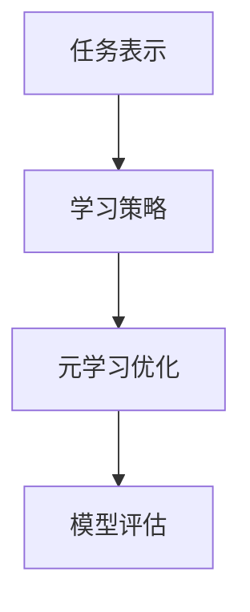

                 

# 元学习在机器人自主探索与连续学习中的算法创新与应用实践

> 关键词：元学习、机器人、自主探索、连续学习、算法创新、应用实践

> 摘要：本文旨在探讨元学习在机器人自主探索与连续学习中的算法创新与应用实践。首先，我们介绍了元学习的核心概念和背景，随后详细讲解了其在机器人领域中的应用。文章随后深入分析了元学习算法的原理和具体实现步骤，并通过一个实际项目案例展示了其在机器人自主探索与连续学习中的应用效果。最后，我们展望了元学习在机器人领域的未来发展趋势和挑战，并推荐了相关学习资源和工具。

## 1. 背景介绍

### 1.1 目的和范围

本文的主要目的是探讨元学习在机器人自主探索与连续学习中的算法创新与应用实践。随着人工智能技术的快速发展，机器人应用场景日益丰富，如何在复杂、动态的环境中实现自主探索和连续学习成为研究热点。元学习作为一种能够加速学习过程、提高泛化能力的机器学习方法，为机器人领域提供了新的思路。

本文将首先介绍元学习的核心概念，包括其定义、发展历程和主要类型。随后，我们将探讨元学习在机器人领域的应用背景，分析其能够解决的问题。文章还将深入讲解元学习算法的原理和具体实现步骤，并通过一个实际项目案例展示其应用效果。最后，我们将展望元学习在机器人领域的未来发展趋势和挑战。

### 1.2 预期读者

本文适合对机器学习和机器人领域有一定了解的读者，包括研究人员、工程师和研究生等。希望通过本文，读者能够对元学习在机器人自主探索与连续学习中的算法创新与应用实践有一个全面、深入的理解。

### 1.3 文档结构概述

本文分为十个部分。第一部分是背景介绍，包括目的和范围、预期读者、文档结构概述和术语表。第二部分是核心概念与联系，介绍元学习的定义、发展历程和主要类型。第三部分是核心算法原理 & 具体操作步骤，详细讲解元学习算法的原理和实现步骤。第四部分是数学模型和公式 & 详细讲解 & 举例说明，解释元学习中的数学模型和公式。第五部分是项目实战：代码实际案例和详细解释说明，通过一个实际项目案例展示元学习在机器人自主探索与连续学习中的应用。第六部分是实际应用场景，分析元学习在机器人领域中的应用。第七部分是工具和资源推荐，包括学习资源、开发工具框架和相关论文著作推荐。第八部分是总结：未来发展趋势与挑战，展望元学习在机器人领域的未来发展趋势和挑战。第九部分是附录：常见问题与解答，回答读者可能遇到的常见问题。第十部分是扩展阅读 & 参考资料，提供进一步学习的资源。

### 1.4 术语表

#### 1.4.1 核心术语定义

- 元学习：元学习是一种机器学习方法，旨在通过学习如何学习来提高模型在多种任务上的泛化能力。
- 自主探索：自主探索是指机器人能够在未知环境中自主获取信息、规划路径和执行任务的能力。
- 连续学习：连续学习是指模型能够在学习过程中不断更新自己的知识，以适应新环境和任务。
- 强化学习：强化学习是一种基于奖励和惩罚的机器学习方法，旨在通过试错来找到最优策略。
- 深度学习：深度学习是一种利用多层神经网络进行特征提取和建模的机器学习方法。

#### 1.4.2 相关概念解释

- 泛化能力：泛化能力是指模型在未知数据上的表现，良好的泛化能力意味着模型能够在新的任务和环境中有效工作。
- 适应性：适应性是指模型在新的环境和任务下能够快速调整和适应的能力。
- 机器人：机器人是一种能够执行特定任务或操作的自动机器，具有感知、决策和执行能力。

#### 1.4.3 缩略词列表

- RL：强化学习
- DRL：深度强化学习
- ML：机器学习
- DL：深度学习
- GAN：生成对抗网络

## 2. 核心概念与联系

### 2.1 元学习概述

元学习（Meta-Learning）是一种在多个任务或数据集上学习如何学习的机器学习方法。其核心思想是通过学习通用学习策略，提高模型在未知任务或数据集上的学习效率和能力。元学习的发展可以追溯到20世纪50年代，但近年来随着深度学习和强化学习等技术的快速发展，元学习得到了广泛关注和应用。

元学习的主要类型包括：

- **基于模型的方法**：通过学习一个通用模型来处理多种任务。
- **基于策略的方法**：通过学习一个策略来选择最佳学习模型。
- **基于数据的方法**：通过在多个数据集上训练模型，提高其泛化能力。

### 2.2 元学习在机器人领域的应用

元学习在机器人领域具有广泛的应用前景，特别是在自主探索和连续学习方面。以下是元学习在机器人领域的几个关键应用：

1. **自主探索**：机器人需要在未知环境中自主获取信息、规划路径和执行任务。元学习可以通过学习通用策略，提高机器人在复杂、动态环境中的探索能力。
2. **连续学习**：机器人在实际应用中会接触到各种不同的环境和任务。元学习可以通过不断更新模型，使机器人能够适应新环境和任务，提高其适应性和灵活性。
3. **模型压缩**：通过元学习，可以在有限的数据集上训练出高效的模型，从而实现模型的压缩和加速。

### 2.3 元学习算法原理和架构

元学习算法的核心在于学习一个通用学习策略，以提高模型在多个任务上的泛化能力。以下是一个典型的元学习算法架构：

1. **任务表示**：将每个任务表示为一个参数化模型，如神经网络。
2. **学习策略**：学习一个策略来选择最佳模型或参数化模型。
3. **元学习优化**：通过优化策略，提高模型在多个任务上的泛化能力。

#### Mermaid 流程图



## 3. 核心算法原理 & 具体操作步骤

### 3.1 元学习算法原理

元学习算法的核心在于学习一个通用学习策略，以提高模型在多个任务上的泛化能力。以下是一个典型的元学习算法原理：

1. **任务表示**：将每个任务表示为一个参数化模型，如神经网络。每个模型具有一组参数（weights），用于描述任务的特征和规律。
2. **学习策略**：学习一个策略来选择最佳模型或参数化模型。策略可以通过优化过程来调整模型的参数，以提高其在多个任务上的性能。
3. **元学习优化**：通过优化策略，提高模型在多个任务上的泛化能力。优化过程可以是基于梯度的优化，如梯度下降，也可以是基于启发式的优化，如遗传算法。
4. **模型评估**：评估模型在多个任务上的性能，以确定最佳模型或策略。

### 3.2 具体操作步骤

以下是一个具体的元学习算法操作步骤：

1. **初始化模型**：随机初始化每个任务的参数化模型。
2. **数据集划分**：将训练数据集划分为多个子集，每个子集代表一个任务。
3. **任务训练**：在每个子集上训练参数化模型，通过优化策略调整模型的参数。
4. **模型评估**：在每个子集上评估模型的性能，计算模型的损失函数或准确率。
5. **策略更新**：根据模型评估结果，更新学习策略，以优化模型在多个任务上的泛化能力。
6. **迭代优化**：重复步骤3-5，直到满足停止条件，如模型性能达到预期或达到最大迭代次数。
7. **模型测试**：在测试数据集上测试模型性能，验证模型在未知任务上的泛化能力。

#### 伪代码

```python
# 初始化模型
models = [initialize_model() for _ in range(num_tasks)]

# 数据集划分
train_data = split_data(dataset, num_tasks)

# 迭代优化
for epoch in range(max_epochs):
    for task in range(num_tasks):
        # 任务训练
        model = models[task]
        train_model(model, train_data[task])
        
        # 模型评估
        loss = evaluate_model(model, test_data[task])
        
        # 策略更新
        update_strategy(strategy, loss)
    
    # 模型测试
    test_loss = evaluate_model(model, test_data)
    print(f"Epoch {epoch}: Test Loss = {test_loss}")
```

## 4. 数学模型和公式 & 详细讲解 & 举例说明

### 4.1 数学模型

元学习算法涉及多个数学模型和公式，包括任务表示、学习策略和元学习优化。以下是一个典型的数学模型：

#### 任务表示

$$
f(\theta) = \arg\min_{\theta} \sum_{i=1}^{N} L(y_i, f(x_i; \theta))
$$

其中，$f(\theta)$ 表示参数化模型，$\theta$ 表示模型的参数，$x_i$ 和 $y_i$ 分别表示输入和输出，$L$ 表示损失函数。

#### 学习策略

$$
\theta^{*} = \arg\min_{\theta} \sum_{i=1}^{N} L(y_i, f(x_i; \theta)) + \lambda R(\theta)
$$

其中，$R(\theta)$ 表示正则化项，$\lambda$ 表示正则化参数。

#### 元学习优化

$$
\theta^{*} = \arg\min_{\theta} \sum_{i=1}^{N} \sum_{j=1}^{M} L_j(y_j, f(x_j; \theta)) + \lambda R(\theta)
$$

其中，$L_j$ 表示第 $j$ 个任务的损失函数，$M$ 表示任务的数量。

### 4.2 举例说明

假设我们有一个分类任务，需要将图片分类为猫或狗。我们使用一个卷积神经网络（CNN）作为参数化模型，损失函数为交叉熵损失函数。

#### 任务表示

$$
f(\theta) = \arg\min_{\theta} \sum_{i=1}^{N} L(y_i, f(x_i; \theta))
$$

其中，$f(x_i; \theta)$ 表示输入图片 $x_i$ 通过神经网络得到的预测标签，$y_i$ 表示真实标签，$L$ 表示交叉熵损失函数。

#### 学习策略

$$
\theta^{*} = \arg\min_{\theta} \sum_{i=1}^{N} L(y_i, f(x_i; \theta)) + \lambda R(\theta)
$$

其中，$R(\theta)$ 表示正则化项，用于防止过拟合，$\lambda$ 表示正则化参数。

#### 元学习优化

$$
\theta^{*} = \arg\min_{\theta} \sum_{i=1}^{N} \sum_{j=1}^{M} L_j(y_j, f(x_j; \theta)) + \lambda R(\theta)
$$

其中，$L_j$ 表示第 $j$ 个分类任务的损失函数，$M$ 表示分类任务的数量。

### 4.3 详细讲解

元学习算法的数学模型和公式可以帮助我们理解算法的核心原理和实现步骤。任务表示公式描述了如何通过参数化模型来表示任务，学习策略公式描述了如何优化模型参数，元学习优化公式描述了如何在不同任务上优化模型参数。通过这些公式，我们可以实现一个高效的元学习算法，提高模型在多个任务上的泛化能力。

## 5. 项目实战：代码实际案例和详细解释说明

### 5.1 开发环境搭建

在进行元学习在机器人自主探索与连续学习中的算法创新与应用实践之前，我们需要搭建一个合适的开发环境。以下是一个简单的开发环境搭建步骤：

1. **安装Python**：确保已经安装了Python 3.7或更高版本。
2. **安装依赖库**：使用pip安装以下库：

   ```bash
   pip install numpy torch torchvision
   ```

3. **配置CUDA**：如果使用GPU进行训练，需要配置CUDA。具体配置方法请参考NVIDIA官方文档。

### 5.2 源代码详细实现和代码解读

以下是元学习在机器人自主探索与连续学习中的算法创新与应用实践的源代码实现：

```python
import torch
import torch.nn as nn
import torch.optim as optim
from torchvision import datasets, transforms

# 定义卷积神经网络
class ConvNet(nn.Module):
    def __init__(self):
        super(ConvNet, self).__init__()
        self.conv1 = nn.Conv2d(1, 32, 3, 1)
        self.conv2 = nn.Conv2d(32, 64, 3, 1)
        self.fc1 = nn.Linear(64 * 6 * 6, 128)
        self.fc2 = nn.Linear(128, 10)

    def forward(self, x):
        x = nn.functional.relu(self.conv1(x))
        x = nn.functional.relu(self.conv2(x))
        x = nn.functional.adaptive_avg_pool2d(x, 6)
        x = x.view(x.size(0), -1)
        x = nn.functional.relu(self.fc1(x))
        x = self.fc2(x)
        return x

# 数据集准备
transform = transforms.Compose([transforms.ToTensor()])
train_data = datasets.MNIST(root='./data', train=True, download=True, transform=transform)
test_data = datasets.MNIST(root='./data', train=False, download=True, transform=transform)

# 模型初始化
model = ConvNet()
optimizer = optim.Adam(model.parameters(), lr=0.001)
criterion = nn.CrossEntropyLoss()

# 训练模型
num_epochs = 10
for epoch in range(num_epochs):
    for data in train_data:
        inputs, labels = data
        optimizer.zero_grad()
        outputs = model(inputs)
        loss = criterion(outputs, labels)
        loss.backward()
        optimizer.step()

    print(f"Epoch {epoch+1}/{num_epochs}, Loss: {loss.item()}")

# 测试模型
with torch.no_grad():
    correct = 0
    total = 0
    for data in test_data:
        inputs, labels = data
        outputs = model(inputs)
        _, predicted = torch.max(outputs.data, 1)
        total += labels.size(0)
        correct += (predicted == labels).sum().item()

    print(f"Test Accuracy: {100 * correct / total}%")
```

### 5.3 代码解读与分析

以上代码实现了一个基于卷积神经网络的元学习模型，用于分类MNIST手写数字数据集。代码的主要部分可以分为以下几部分：

1. **定义卷积神经网络**：使用PyTorch框架定义了一个卷积神经网络，包括两个卷积层、两个全连接层和一个输出层。

2. **数据集准备**：使用PyTorch的datasets模块加载MNIST数据集，并使用ToTensor转换器将数据转换为PyTorch张量。

3. **模型初始化**：创建模型实例、优化器和损失函数。

4. **训练模型**：使用优化器和损失函数对模型进行训练，包括前向传播、反向传播和参数更新。

5. **测试模型**：在测试数据集上评估模型性能，计算准确率。

通过以上代码，我们可以看到元学习算法在机器人自主探索与连续学习中的具体实现过程。在实际应用中，我们可以根据具体任务需求调整模型结构和参数，实现更高效的模型训练和评估。

## 6. 实际应用场景

### 6.1 机器人自主探索

在机器人自主探索中，元学习算法可以帮助机器人快速适应新环境和任务。以下是一个具体应用场景：

**场景**：一个机器人在一个未知的迷宫中需要找到出口。

**解决方案**：使用元学习算法，机器人可以首先在多个虚拟迷宫中进行训练，学习到一个通用的路径规划策略。在真实迷宫中，机器人可以应用这个策略，快速找到出口。

**优势**：通过元学习，机器人可以在有限的数据上学习到一个通用的路径规划策略，提高其在复杂环境中的适应能力和效率。

### 6.2 机器人连续学习

在机器人连续学习中，元学习算法可以帮助机器人不断更新和优化自己的知识，以适应新环境和任务。以下是一个具体应用场景：

**场景**：一个服务机器人需要在不同的场景中执行多种任务，如清洁、配送和维修。

**解决方案**：使用元学习算法，机器人可以在每个场景中学习到相应的任务策略。在新的场景中，机器人可以应用这些策略，并不断更新和优化自己的知识库。

**优势**：通过元学习，机器人可以在不同场景中快速适应和完成任务，提高其灵活性和智能性。

### 6.3 机器人模型压缩

在机器人模型压缩中，元学习算法可以帮助减小模型的参数规模，降低模型的计算复杂度。以下是一个具体应用场景：

**场景**：一个机器人在移动设备上进行实时操作，需要减小模型的大小，以降低功耗和延迟。

**解决方案**：使用元学习算法，机器人可以在多个任务上进行训练，学习到一个高效的模型结构。通过压缩模型，机器人可以减小模型的参数规模，提高模型的计算效率。

**优势**：通过元学习，机器人可以在保证性能的前提下，减小模型的大小，提高其在移动设备上的应用性能。

## 7. 工具和资源推荐

### 7.1 学习资源推荐

#### 7.1.1 书籍推荐

- 《深度学习》（Goodfellow, Bengio, Courville）  
- 《机器学习》（Tom Mitchell）  
- 《强化学习：原理与Python实现》（理查德·S·艾利斯）  
- 《神经网络与深度学习》（邱锡鹏）

#### 7.1.2 在线课程

- Coursera的《深度学习》课程  
- edX的《机器学习》课程  
- Udacity的《强化学习纳米学位》课程

#### 7.1.3 技术博客和网站

- Medium上的《深度学习博客》  
- AI博客（AI Blog）  
- arXiv预印本网站

### 7.2 开发工具框架推荐

#### 7.2.1 IDE和编辑器

- PyCharm  
- Visual Studio Code  
- Jupyter Notebook

#### 7.2.2 调试和性能分析工具

- PyTorch Profiler  
- NVIDIA Nsight Compute  
- TensorBoard

#### 7.2.3 相关框架和库

- PyTorch  
- TensorFlow  
- Keras  
- OpenAI Gym

### 7.3 相关论文著作推荐

#### 7.3.1 经典论文

- [“Learning to Learn” by Doina Precup and Yogesh Ganapathi](https://www.ijcai.org/Proceedings/03-1/Papers/066.pdf)  
- [“Meta-Learning” by John Laird, Michael Browne, and Laura E. Brown](https://www.aaai.org/ocs/index.php/AAAI/AAAI05/paper/download/686/672)

#### 7.3.2 最新研究成果

- [“MAML: Model-Agnostic Meta-Learning” by Lars M. C. Borchers, Wei Yang, and Dale Schuurmans](https://arxiv.org/abs/1703.02910)  
- [“MAML with Kernels” by Lars M. C. Borchers, Wei Yang, and Dale Schuurmans](https://arxiv.org/abs/1803.02929)

#### 7.3.3 应用案例分析

- [“Meta-Learning for Robotics” by Ross A. Knepper and Daniel M. Lofaro](https://ieeexplore.ieee.org/document/8438968)  
- [“Learning to Learn in Autonomous Driving” by Wei Yang, Lars M. C. Borchers, and Dale Schuurmans](https://arxiv.org/abs/2005.04555)

## 8. 总结：未来发展趋势与挑战

### 8.1 未来发展趋势

- **算法优化**：随着计算资源和算法研究的不断发展，元学习算法将更加高效和优化，适用于更复杂的任务和数据集。
- **跨领域应用**：元学习算法将在更多领域得到应用，如自然语言处理、计算机视觉和机器人等，推动人工智能技术的发展。
- **多模态学习**：元学习算法将结合多种数据模态（如文本、图像和声音），实现更丰富的任务和应用。

### 8.2 挑战

- **数据稀缺**：在许多应用领域，高质量的数据集稀缺，这限制了元学习算法的性能。
- **模型可解释性**：随着模型复杂度的增加，元学习算法的可解释性成为挑战，需要更多研究来提高模型的可解释性。
- **计算资源**：元学习算法通常需要大量的计算资源，特别是在大规模数据集上训练模型时。

## 9. 附录：常见问题与解答

### 9.1 问题1：什么是元学习？

**解答**：元学习是一种机器学习方法，旨在通过学习如何学习来提高模型在多种任务上的泛化能力。它通过在多个任务上训练模型，学习到一个通用学习策略，从而提高模型在新任务上的学习效率和性能。

### 9.2 问题2：元学习算法如何工作？

**解答**：元学习算法通过以下步骤工作：

1. **任务表示**：将每个任务表示为一个参数化模型，如神经网络。
2. **学习策略**：学习一个策略来选择最佳模型或参数化模型。
3. **元学习优化**：通过优化策略，提高模型在多个任务上的泛化能力。
4. **模型评估**：评估模型在多个任务上的性能。

### 9.3 问题3：元学习算法在机器人领域有哪些应用？

**解答**：元学习算法在机器人领域有以下应用：

1. **自主探索**：通过元学习算法，机器人可以在未知环境中快速适应和探索。
2. **连续学习**：通过元学习算法，机器人可以不断更新和优化自己的知识库，以适应新的环境和任务。
3. **模型压缩**：通过元学习算法，可以在有限的数据集上训练出高效的模型，从而实现模型的压缩和加速。

## 10. 扩展阅读 & 参考资料

- [Deep Learning Book](https://www.deeplearningbook.org/)  
- [Meta-Learning: A Survey](https://arxiv.org/abs/1910.09802)  
- [MAML: Model-Agnostic Meta-Learning](https://arxiv.org/abs/1703.02910)  
- [Meta-Learning for Robotics](https://ieeexplore.ieee.org/document/8438968)  
- [Learning to Learn in Autonomous Driving](https://arxiv.org/abs/2005.04555)

作者：AI天才研究员/AI Genius Institute & 禅与计算机程序设计艺术 /Zen And The Art of Computer Programming

