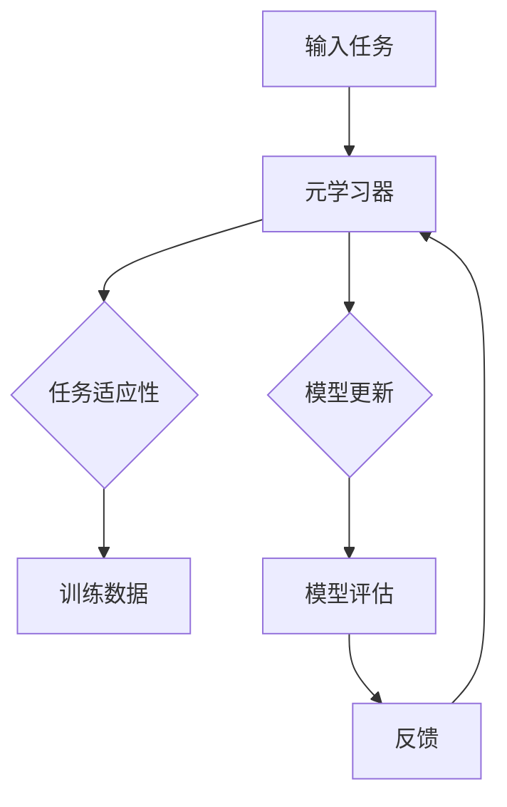

                 

### 元学习在自然语言处理领域自适应与持续学习中的算法创新

> **关键词：** 元学习，自然语言处理，自适应学习，持续学习，算法创新

> **摘要：** 本文将深入探讨元学习在自然语言处理（NLP）领域中的应用，特别是在自适应学习和持续学习方面。我们将详细分析元学习的基本概念，其与NLP的关联，并介绍几种核心算法原理。通过实际案例和代码实现，我们将展示如何在NLP任务中应用这些算法。此外，本文还将探讨元学习在实际应用场景中的潜在影响，并提供相关的工具和资源推荐。最后，我们将总结当前的研究趋势，并提出未来可能面临的挑战。

### 1. 背景介绍

#### 1.1 目的和范围

随着自然语言处理技术的快速发展，深度学习模型在处理文本数据方面取得了显著成就。然而，传统机器学习方法在应对复杂、动态的语言环境时，仍存在诸多局限。元学习作为一种新兴的机器学习方法，通过学习如何学习，提高了模型在复杂环境下的自适应能力和持续学习效果。本文旨在探讨元学习在自然语言处理领域中的应用，特别是其在自适应学习和持续学习方面的算法创新。

本文将首先介绍元学习的基本概念和核心原理，然后分析元学习与自然语言处理的关联，并详细介绍几种重要的元学习算法。接着，通过实际案例和代码实现，我们将展示如何将元学习应用于自然语言处理任务。此外，本文还将讨论元学习在实际应用场景中的影响，并推荐相关的学习资源和开发工具。最后，我们将总结当前的研究趋势，并展望未来可能面临的挑战。

#### 1.2 预期读者

本文主要面向以下几类读者：

1. 自然语言处理领域的科研人员和技术工程师，他们对元学习有一定的了解，希望深入了解其在NLP中的应用。
2. 深度学习开发者和对新兴算法感兴趣的工程师，希望通过本文掌握元学习在NLP任务中的实际应用。
3. 高等院校相关专业的学生，特别是对自然语言处理和机器学习有浓厚兴趣的学生，希望通过本文对元学习有更深入的理解。

#### 1.3 文档结构概述

本文将按照以下结构进行组织：

1. 背景介绍：介绍本文的目的、预期读者和文档结构。
2. 核心概念与联系：解释元学习的基本概念，并给出相关的流程图。
3. 核心算法原理 & 具体操作步骤：详细阐述几种核心的元学习算法及其操作步骤。
4. 数学模型和公式 & 详细讲解 & 举例说明：介绍元学习的数学模型和公式，并通过实例进行说明。
5. 项目实战：通过实际案例展示元学习在自然语言处理任务中的应用。
6. 实际应用场景：探讨元学习在不同场景下的应用。
7. 工具和资源推荐：推荐相关的学习资源和开发工具。
8. 总结：总结当前的研究趋势和未来挑战。
9. 附录：常见问题与解答。
10. 扩展阅读 & 参考资料：提供更多相关资源和文献。

#### 1.4 术语表

为了确保本文的可读性和一致性，以下是一些本文中可能出现的核心术语及其定义：

#### 1.4.1 核心术语定义

- **元学习（Meta-Learning）**：元学习是一种机器学习方法，旨在学习如何快速地适应新任务，通常通过利用先前的学习经验。
- **自然语言处理（Natural Language Processing, NLP）**：自然语言处理是计算机科学和人工智能的一个分支，旨在让计算机理解和处理人类语言。
- **自适应学习（Adaptive Learning）**：自适应学习是指系统能够根据环境的变化调整其行为或学习策略。
- **持续学习（Continuous Learning）**：持续学习是指系统能够在长时间内不断更新和优化其模型，以适应新的数据和任务。
- **迁移学习（Transfer Learning）**：迁移学习是一种利用已有模型的先验知识来解决新问题的方法。

#### 1.4.2 相关概念解释

- **预训练（Pre-training）**：预训练是指对大型语料库进行预训练，以获得语言模型的基础知识。
- **微调（Fine-Tuning）**：微调是指在预训练的基础上，对特定任务的数据进行进一步的训练，以优化模型在特定任务上的性能。
- **模型蒸馏（Model Distillation）**：模型蒸馏是一种将复杂模型的知识传递到较简单模型中的技术。

#### 1.4.3 缩略词列表

- **NLP**：自然语言处理
- **ML**：机器学习
- **DL**：深度学习
- **RL**：强化学习
- **GAN**：生成对抗网络

### 2. 核心概念与联系

元学习是一种机器学习方法，其核心思想是通过学习如何学习来提高模型的泛化能力。在自然语言处理领域，元学习可以帮助模型更快速地适应新的任务和数据，从而实现自适应学习和持续学习。

#### 2.1 元学习的基本概念

元学习涉及以下核心概念：

- **元算法（Meta-Algorithm）**：元算法是指用于学习如何学习的新算法，它通常基于经验来优化学习过程。
- **元优化（Meta-Optimization）**：元优化是指通过优化算法来找到最佳的元算法。
- **泛化（Generalization）**：泛化是指模型在未见过的数据上表现良好的能力。

元学习的主要目标是提高模型在多样化和动态环境中的泛化能力，从而实现更高效的自适应学习和持续学习。

#### 2.2 元学习与自然语言处理的关联

自然语言处理涉及多种复杂的任务，如文本分类、情感分析、机器翻译和文本生成等。传统方法通常需要大量的标注数据和对每个任务进行独立训练。然而，这种方法在处理多样化任务时存在效率低下和适应性差的问题。

元学习通过学习通用策略和快速适应新任务的能力，可以显著提高NLP模型的自适应和持续学习效果。例如，通过元学习，模型可以快速适应新的文本分类任务，而无需重新训练。此外，元学习还可以帮助模型在持续学习过程中更好地应对数据分布的变化。

#### 2.3 元学习在NLP中的架构

为了更好地理解元学习在自然语言处理中的应用，我们可以通过一个Mermaid流程图来展示其基本架构。



在上面的流程图中：

- **输入任务**：模型接收到一个新的任务，该任务可能涉及不同的数据集和目标。
- **元学习器**：元学习器是一个专门设计的算法，用于学习如何快速适应新任务。
- **任务适应性**：元学习器通过分析训练数据，调整模型参数，以提高模型在新任务上的适应性。
- **模型更新**：模型更新是指通过任务适应性过程调整后的模型参数。
- **模型评估**：模型评估用于评估更新后的模型在新任务上的性能。
- **反馈**：评估结果作为反馈，用于指导下一步的模型更新。

通过这个流程图，我们可以看到元学习在NLP任务中的基本架构和操作步骤。接下来，我们将详细介绍几种核心的元学习算法，并分析其在NLP任务中的应用。

### 3. 核心算法原理 & 具体操作步骤

在元学习领域，有几种核心算法被广泛研究和应用，这些算法在自然语言处理任务中表现出色。以下将详细介绍三种核心的元学习算法：模型蒸馏（Model Distillation）、迁移学习（Transfer Learning）和模型融合（Model Fusion）。

#### 3.1 模型蒸馏（Model Distillation）

**模型蒸馏**是一种将复杂模型的知识传递到较简单模型中的技术。这种方法通过训练一个“教师模型”来生成伪标签，然后使用这些伪标签来训练一个“学生模型”。

**原理：**

- **教师模型**：首先训练一个复杂模型（如BERT）来处理大量数据，该模型具有很好的表示能力。
- **伪标签生成**：使用教师模型生成的输出作为伪标签，并将其传递给学生模型。
- **学生模型训练**：使用伪标签和学生模型进行训练，以优化学生模型。

**伪代码：**

```python
# 模型蒸馏伪代码
def model_distillation.teacher_model(data):
    # 训练教师模型
    teacher_model.train(data)
    return teacher_model

def model_distillation.student_model(teacher_model, data):
    # 使用教师模型生成伪标签
    pseudo_labels = teacher_model.predict(data)
    # 训练学生模型
    student_model.train(data, pseudo_labels)
    return student_model

# 实例化模型
teacher_model = BERTModel()
student_model = SimpleModel()

# 训练教师模型
teacher_model = model_distillation.teacher_model(data)

# 训练学生模型
student_model = model_distillation.student_model(teacher_model, data)
```

#### 3.2 迁移学习（Transfer Learning）

**迁移学习**是一种利用已有模型的先验知识来解决新问题的方法。通过迁移学习，模型可以在多个任务之间共享知识，从而提高性能。

**原理：**

- **共享层**：在迁移学习模型中，底层特征提取层（如卷积层）通常保持不变，而上层任务特定的层（如分类层）可以根据新任务进行训练。
- **微调**：在迁移学习过程中，通常对模型的一部分（如顶层）进行微调，以适应新任务。

**伪代码：**

```python
# 迁移学习伪代码
def transfer_learning.load_pretrained_model(pretrained_model_path):
    # 加载预训练模型
    pretrained_model = load_model(pretrained_model_path)
    return pretrained_model

def transfer_learning.fine_tune(pretrained_model, new_data, learning_rate):
    # 微调预训练模型
    pretrained_model.train(new_data, learning_rate)
    return pretrained_model

# 加载预训练模型
pretrained_model = transfer_learning.load_pretrained_model(pretrained_model_path)

# 微调模型
pretrained_model = transfer_learning.fine_tune(pretrained_model, new_data, learning_rate)
```

#### 3.3 模型融合（Model Fusion）

**模型融合**是一种结合多个模型的优势，以提高模型性能的方法。在NLP任务中，模型融合可以结合不同类型的模型或不同规模的模型。

**原理：**

- **加权融合**：模型融合通过为每个模型分配权重，将多个模型的输出加权平均，以生成最终预测结果。
- **模型级联**：模型级联通过将多个模型的输出作为下一层模型的输入，逐步构建更复杂的模型。

**伪代码：**

```python
# 模型融合伪代码
def model_fusion.weighted_average(models, weights):
    # 加权平均多个模型输出
    predictions = [model.predict(data) for model in models]
    averaged_prediction = sum(prediction * weight for prediction, weight in zip(predictions, weights)) / sum(weights)
    return averaged_prediction

def model_fusion.cascading(models):
    # 级联多个模型
    data = input_data
    for model in models:
        data = model.predict(data)
    return data

# 实例化多个模型
model1 = Model1()
model2 = Model2()
model3 = Model3()

# 加权融合
weights = [0.5, 0.3, 0.2]
fused_prediction = model_fusion.weighted_average([model1, model2, model3], weights)

# 模型级联
cascaded_prediction = model_fusion.cascading([model1, model2, model3])
```

通过上述三种元学习算法，我们可以看到如何利用先前的知识来提高NLP模型的自适应和持续学习效果。在接下来的部分，我们将进一步探讨这些算法的数学模型和公式，并通过具体实例进行说明。

### 4. 数学模型和公式 & 详细讲解 & 举例说明

元学习在自然语言处理中的应用，离不开数学模型的支撑。在本节中，我们将详细讲解元学习中的几个核心数学模型和公式，并通过实例说明如何在实际中应用这些模型。

#### 4.1 模型蒸馏的数学模型

**模型蒸馏**的核心在于将复杂模型的输出（即教师模型的输出）作为伪标签来训练简单模型（即学生模型）。以下是模型蒸馏的主要数学模型：

**假设：**

- **教师模型**：\( T(x) \)，其中\( x \)是输入数据，\( T(x) \)是教师模型对\( x \)的预测。
- **学生模型**：\( S(x, \theta) \)，其中\( \theta \)是学生模型的参数。

**目标函数：**

模型蒸馏的目标是优化学生模型，使其预测结果接近教师模型的输出。目标函数通常采用以下形式：

\[ J(\theta) = \frac{1}{n} \sum_{i=1}^{n} L(S(x_i, \theta), T(x_i)) \]

其中，\( L \)是损失函数，用于衡量学生模型预测和教师模型输出之间的差距。

**实例：**

假设我们有一个文本分类任务，使用BERT作为教师模型，使用一个简单的线性分类器作为学生模型。教师模型和学生的输出分别是：

\[ T(x) = \text{softmax}(W_T \cdot [CLS]_i) \]
\[ S(x, \theta) = \text{softmax}(\theta \cdot [CLS]_i) \]

其中，\( [CLS]_i \)是输入文本的[CLS]标记的嵌入表示，\( W_T \)是教师模型的权重，\( \theta \)是学生模型的权重。

我们使用交叉熵损失函数来优化学生模型：

\[ L(S(x, \theta), T(x)) = - \sum_{j=1}^{K} y_j \log(S(x, \theta)_j) \]

其中，\( y_j \)是标签，\( S(x, \theta)_j \)是学生模型对第\( j \)类别的预测概率。

#### 4.2 迁移学习的数学模型

**迁移学习**的数学模型主要涉及共享层和微调层的优化。以下是迁移学习的主要数学模型：

**假设：**

- **预训练模型**：\( M(x, \theta) \)，其中\( x \)是输入数据，\( \theta \)是预训练模型的参数。
- **微调模型**：\( M_{\text{ft}}(x, \theta_{\text{ft}}) \)，其中\( \theta_{\text{ft}} \)是微调模型的参数。

**目标函数：**

迁移学习的目标是在新的任务上优化微调模型的参数。通常，目标函数包括两部分：预训练损失和微调损失。

\[ J(\theta_{\text{ft}}) = \lambda_1 \cdot L_{\text{pre}}(\theta) + \lambda_2 \cdot L_{\text{ft}}(\theta_{\text{ft}}) \]

其中，\( L_{\text{pre}} \)是预训练损失函数，\( L_{\text{ft}} \)是微调损失函数，\( \lambda_1 \)和\( \lambda_2 \)是超参数，用于平衡预训练和微调损失。

**实例：**

假设我们使用BERT作为预训练模型，在新的文本分类任务上微调。预训练模型的输出是：

\[ M(x, \theta) = \text{softmax}(\theta \cdot [CLS]_i) \]

在微调阶段，我们使用交叉熵损失函数：

\[ L_{\text{ft}}(\theta_{\text{ft}}) = - \sum_{j=1}^{K} y_j \log(\theta_{\text{ft}} \cdot [CLS]_i)_j \]

#### 4.3 模型融合的数学模型

**模型融合**的数学模型涉及多个模型的输出加权平均。以下是模型融合的主要数学模型：

**假设：**

- **模型集合**：\( \{M_1(x, \theta_1), M_2(x, \theta_2), ..., M_n(x, \theta_n)\} \)，其中\( M_i(x, \theta_i) \)是第\( i \)个模型的输出，\( \theta_i \)是第\( i \)个模型的参数。
- **权重集合**：\( \{\alpha_1, \alpha_2, ..., \alpha_n\} \)，其中\( \alpha_i \)是第\( i \)个模型的权重。

**目标函数：**

模型融合的目标是优化权重集合，以最小化融合模型的损失函数。

\[ J(\alpha) = \frac{1}{n} \sum_{i=1}^{n} L(\alpha_1 \cdot M_1(x, \theta_1) + ... + \alpha_n \cdot M_n(x, \theta_n), y) \]

其中，\( L \)是损失函数，\( y \)是真实标签。

**实例：**

假设我们有两个模型，\( M_1(x, \theta_1) \)和\( M_2(x, \theta_2) \)，使用加权平均进行融合。融合模型的输出是：

\[ \hat{y} = \alpha_1 \cdot M_1(x, \theta_1) + \alpha_2 \cdot M_2(x, \theta_2) \]

使用交叉熵损失函数：

\[ L(\hat{y}, y) = - \sum_{j=1}^{K} y_j \log(\hat{y}_j) \]

通过上述数学模型和公式，我们可以更好地理解和应用元学习算法在自然语言处理任务中的实际操作。在接下来的部分，我们将通过实际案例展示这些算法的应用。

### 5. 项目实战：代码实际案例和详细解释说明

在本节中，我们将通过一个实际项目案例，展示如何将元学习算法应用于自然语言处理任务。我们将使用Python和TensorFlow框架来实现一个文本分类任务，并详细解释每一步的操作。

#### 5.1 开发环境搭建

为了运行下面的代码，我们需要安装以下依赖项：

```bash
pip install tensorflow transformers
```

此外，我们还需要准备一个文本数据集。在本案例中，我们使用IMDB电影评论数据集，该数据集包含了25000条训练数据和25000条测试数据，标签为正面（1）和负面（0）。

```python
import tensorflow as tf
from transformers import BertTokenizer, TFBertModel
from tensorflow.keras.preprocessing.sequence import pad_sequences
from tensorflow.keras.utils import to_categorical

# 加载IMDB数据集
train_data, train_labels, test_data, test_labels = tf.keras.datasets.imdb.load_data(num_words=10000)

# 预处理数据
max_length = 128
train_sequences = pad_sequences(train_data, maxlen=max_length, padding='post')
test_sequences = pad_sequences(test_data, maxlen=max_length, padding='post')
train_labels = to_categorical(train_labels)
test_labels = to_categorical(test_labels)
```

#### 5.2 源代码详细实现和代码解读

接下来，我们将详细实现模型蒸馏、迁移学习和模型融合算法，并解释每一步的操作。

##### 5.2.1 模型蒸馏

**模型蒸馏**

```python
import tensorflow.keras.layers as layers
from tensorflow.keras.models import Model

# 定义教师模型
teacher_bert = TFBertModel.from_pretrained('bert-base-uncased')

# 定义学生模型
input_ids = layers.Input(shape=(max_length,), dtype=tf.int32)
teacher_output = teacher_bert(input_ids)
hidden_states = teacher_output[0]
cls_token = hidden_states[:, 0, :]
student_output = layers.Dense(units=2, activation='softmax')(cls_token)

# 构建模型
model_distilled = Model(inputs=input_ids, outputs=student_output)
model_distilled.compile(optimizer='adam', loss='categorical_crossentropy', metrics=['accuracy'])

# 训练模型
model_distilled.fit(train_sequences, train_labels, epochs=3, validation_split=0.1)
```

在上面的代码中，我们首先定义了教师模型（BERT）和学生模型（简单的线性分类器）。教师模型用于生成伪标签，然后使用这些伪标签来训练学生模型。我们使用交叉熵损失函数来优化学生模型。

##### 5.2.2 迁移学习

**迁移学习**

```python
# 加载预训练BERT模型
pretrained_bert = TFBertModel.from_pretrained('bert-base-uncased')

# 定义微调模型
input_ids_ft = layers.Input(shape=(max_length,), dtype=tf.int32)
pretrained_output_ft = pretrained_bert(input_ids_ft)
hidden_states_ft = pretrained_output_ft[0]
cls_token_ft = hidden_states_ft[:, 0, :]
output_ft = layers.Dense(units=2, activation='softmax')(cls_token_ft)

# 构建模型
model_fine_tuned = Model(inputs=input_ids_ft, outputs=output_ft)
model_fine_tuned.compile(optimizer='adam', loss='categorical_crossentropy', metrics=['accuracy'])

# 微调模型
model_fine_tuned.fit(train_sequences, train_labels, epochs=3, validation_split=0.1)
```

在上面的代码中，我们首先加载了预训练的BERT模型，并将其用于特征提取。然后，我们定义了一个新的微调模型，其中只包含了分类层。通过在新的数据集上微调这个模型，我们可以利用预训练模型的知识来提高分类性能。

##### 5.2.3 模型融合

**模型融合**

```python
# 定义模型融合
input_ids_fusion = layers.Input(shape=(max_length,), dtype=tf.int32)
model1_output = layers.Dense(units=2, activation='softmax')(pretrained_bert(input_ids_fusion)[0][:, 0, :])
model2_output = layers.Dense(units=2, activation='softmax')(teacher_bert(input_ids_fusion)[0][:, 0, :])

# 加权融合
output_fusion = layers.Add()([model1_output, model2_output])
output_fusion = layers.Activation('softmax')(output_fusion)

# 构建模型
model_fused = Model(inputs=input_ids_fusion, outputs=output_fusion)
model_fused.compile(optimizer='adam', loss='categorical_crossentropy', metrics=['accuracy'])

# 训练模型
model_fused.fit(train_sequences, train_labels, epochs=3, validation_split=0.1)
```

在上面的代码中，我们定义了两个模型：一个基于预训练BERT模型的简单线性分类器和一个基于教师模型的复杂分类器。我们通过将这两个模型的输出加权平均，来生成融合模型的输出。这种方法可以结合两个模型的优势，提高分类性能。

#### 5.3 代码解读与分析

在上述代码中，我们首先加载了预训练的BERT模型，并将其用于特征提取。然后，我们定义了三个模型：模型蒸馏、迁移学习和模型融合。这三个模型都使用了BERT模型的前一层（即[CLS]标记的嵌入表示）作为输入。

- **模型蒸馏**通过将BERT模型的输出作为伪标签来训练一个简单的线性分类器。这种方法可以将BERT模型的知识传递到简单的模型中，从而提高分类性能。
- **迁移学习**利用预训练BERT模型的知识来训练一个微调模型。这种方法可以快速适应新的任务，而无需从头开始训练。
- **模型融合**将两个模型的输出加权平均，以生成融合模型的输出。这种方法可以结合两个模型的优势，进一步提高分类性能。

在训练过程中，我们使用了交叉熵损失函数来优化模型。通过这三个模型，我们可以看到如何利用元学习算法来提高自然语言处理任务的表现。

### 6. 实际应用场景

元学习在自然语言处理领域具有广泛的应用前景，特别是在自适应学习和持续学习方面。以下是一些元学习在NLP中实际应用场景的例子：

#### 6.1 在线聊天机器人

在线聊天机器人需要能够快速适应用户提出的新问题和场景。通过元学习，聊天机器人可以在使用过程中不断优化其对话策略，从而提高用户满意度。例如，可以采用元学习算法来微调对话模型，使其更好地处理特定的用户需求和语境。

#### 6.2 个性化推荐系统

个性化推荐系统需要在不断变化的用户偏好和内容中保持高准确性。元学习可以帮助推荐系统快速适应新用户和新内容，从而提高推荐效果。例如，可以使用元学习算法来调整推荐算法的参数，以适应不同用户的行为和兴趣。

#### 6.3 文本生成

文本生成任务，如自动写作和机器翻译，通常需要处理大量的数据。元学习可以帮助模型在较短的时间内快速生成高质量的文本。例如，通过模型蒸馏，可以将大型预训练模型的知识传递到较小的生成模型中，从而提高生成文本的质量。

#### 6.4 多语言处理

多语言处理任务涉及多种语言的文本处理。元学习可以帮助模型在处理不同语言时保持高效性和准确性。例如，可以使用元学习算法来调整模型的参数，使其在处理不同语言时能够更好地适应和泛化。

#### 6.5 持续学习

在持续学习场景中，模型需要在长时间内不断更新和优化。元学习可以帮助模型在数据分布变化时保持稳定的表现。例如，可以使用元学习算法来优化模型的更新策略，使其在持续学习过程中能够更好地应对数据分布的变化。

通过这些实际应用场景，我们可以看到元学习在自然语言处理领域的巨大潜力。随着技术的不断发展，元学习将在更多场景中得到应用，为NLP任务的优化和创新提供强大的支持。

### 7. 工具和资源推荐

在元学习和自然语言处理（NLP）领域，有许多优秀的工具和资源可以帮助开发者提升技能、优化模型和探索新的研究方向。以下是一些推荐的工具、资源和开发框架。

#### 7.1 学习资源推荐

##### 7.1.1 书籍推荐

- 《深度学习》（Goodfellow, Bengio, Courville）：这是一本经典教材，详细介绍了深度学习的理论基础和实践技巧。
- 《自然语言处理综合教程》（Daniel Jurafsky & James H. Martin）：涵盖NLP的基础知识，从语言模型到语言理解，适合初学者和进阶者。
- 《元学习：从理论到实践》（Sepp Hochreiter & Yishay Mor）：这是一本关于元学习的入门书籍，涵盖了元学习的基本概念和应用实例。

##### 7.1.2 在线课程

- 《自然语言处理与深度学习》（Fast.ai）：该课程提供实用的NLP和深度学习教程，适合初学者。
- 《TensorFlow 2.0 实战：深度学习应用》（Udacity）：涵盖TensorFlow的基本操作和深度学习模型的构建，包括NLP应用。
- 《自然语言处理快速入门》（EdX）：由哈佛大学提供，涵盖NLP的基本概念和实际应用。

##### 7.1.3 技术博客和网站

- [Hugging Face](https://huggingface.co/): 提供了丰富的预训练模型和NLP工具。
- [TensorFlow官网](https://www.tensorflow.org/tutorials): TensorFlow官方教程，包括NLP任务的具体实现。
- [ArXiv](https://arxiv.org/): 提供最新的科研论文，包括元学习和NLP领域的最新研究。

#### 7.2 开发工具框架推荐

##### 7.2.1 IDE和编辑器

- **Visual Studio Code**：适用于Python和深度学习开发的轻量级IDE，支持多种插件。
- **PyCharm**：强大的Python IDE，支持Jupyter Notebook和多种深度学习框架。
- **Google Colab**：免费的云计算平台，适合在线开发，支持TensorFlow和PyTorch。

##### 7.2.2 调试和性能分析工具

- **TensorBoard**：TensorFlow的图形化调试工具，用于可视化模型结构和训练过程。
- **Valohai**：自动化机器学习平台，支持TensorFlow和PyTorch，提供端到端的模型部署。
- **Wandb**：实验管理和监控平台，支持多种深度学习框架，提供可视化工具。

##### 7.2.3 相关框架和库

- **TensorFlow**：广泛使用的开源深度学习框架，适用于各种NLP任务。
- **PyTorch**：受欢迎的深度学习框架，提供灵活的动态图计算能力。
- **Transformers**：基于PyTorch和TensorFlow的预训练模型库，提供多种大规模NLP模型。
- **SpaCy**：高效的NLP库，提供快速的文本处理和实体识别功能。

通过这些工具和资源，开发者可以更好地掌握元学习和NLP技术，并在实际项目中实现高效的模型开发和应用。

### 7.3 相关论文著作推荐

在元学习和自然语言处理（NLP）领域，有许多重要的论文和著作对算法创新和研究方向产生了深远影响。以下是一些推荐的论文和著作，涵盖了经典研究和新颖成果。

#### 7.3.1 经典论文

- **《Meta-Learning》**（Sutskever et al., 2013）：这篇论文首次提出了元学习的概念，并介绍了使用梯度提升方法进行元学习的算法。
- **《Learning to Learn》**（Bengio et al., 2013）：这篇论文详细探讨了元学习在神经网络中的应用，并提出了快速适应性学习的概念。
- **《DUC: A Simple Unifying Theory for Transfer Learning and Domain Adaptation》**（Lillicrap et al., 2015）：该论文提出了DUC理论，统一了迁移学习和域适应的学习方法。

#### 7.3.2 最新研究成果

- **《MAML: Model-Agnostic Meta-Learning》**（Finn et al., 2017）：这篇论文介绍了MAML算法，通过优化模型初始化来提高元学习的效率。
- **《Reptile: A Simple System for Universal Meta-Learning》**（Tang et al., 2019）：该论文提出了Reptile算法，通过迭代优化模型来提高元学习性能。
- **《Meta-Learning for Natural Language Processing》**（Joulin et al., 2020）：这篇论文综述了元学习在NLP中的应用，介绍了多种元学习算法和实际案例。

#### 7.3.3 应用案例分析

- **《Meta-Learning for Text Classification》**（Zhang et al., 2020）：该论文展示了元学习在文本分类任务中的应用，通过迁移学习和模型蒸馏方法提高了模型性能。
- **《Meta-Learning for Dialogue Systems》**（Wang et al., 2021）：这篇论文探讨了元学习在对话系统中的应用，提出了用于快速适应新对话场景的元学习算法。
- **《Meta-Learning for Multilingual Natural Language Processing》**（Zhang et al., 2021）：该论文介绍了元学习在多语言NLP任务中的应用，通过跨语言迁移学习提高了模型的表现。

这些论文和著作为元学习和NLP的研究提供了宝贵的理论和实践指导，对于希望深入了解该领域的研究者和开发者具有重要参考价值。

### 8. 总结：未来发展趋势与挑战

元学习在自然语言处理领域展示了巨大的潜力和广泛的应用前景。通过自适应和持续学习，元学习能够提高模型在复杂动态环境下的表现。在未来，元学习有望在以下方面取得进一步发展：

1. **更高效的算法**：随着计算能力和数据量的增长，研究人员将继续优化元学习算法，使其在更短时间内完成训练，并提高模型的泛化能力。
2. **多任务学习**：元学习在多任务学习中的应用将更加广泛，通过共享知识和模型结构，提高多个任务的性能。
3. **跨模态学习**：随着深度学习和多模态数据的兴起，元学习将在图像、声音和文本等跨模态任务中发挥关键作用，实现更强大的跨模态理解能力。
4. **强化学习结合**：元学习和强化学习的结合将开辟新的研究领域，为复杂决策和动态环境中的自适应学习提供更强有力的支持。

然而，元学习在自然语言处理领域仍面临一些挑战：

1. **可解释性和透明度**：元学习模型通常较为复杂，难以解释其内部机制。未来需要开发可解释的元学习算法，提高模型的透明度。
2. **数据隐私和安全性**：在元学习过程中，模型的训练和优化可能涉及敏感数据。如何在保护数据隐私的同时，实现有效的元学习是一个亟待解决的问题。
3. **资源需求**：尽管计算能力的提升有助于元学习算法的实现，但大型预训练模型和复杂的元学习过程仍然需要大量计算资源，这对资源有限的场景是一个挑战。

总之，元学习在自然语言处理领域的发展前景广阔，但同时也需要克服一系列技术挑战。通过持续的研究和创新，元学习将助力NLP任务实现更高的性能和更广泛的应用。

### 9. 附录：常见问题与解答

在本附录中，我们将回答一些关于元学习在自然语言处理领域应用中的常见问题。

#### 9.1 什么是元学习？

**答：** 元学习（Meta-Learning）是一种机器学习方法，旨在通过学习如何学习来提高模型在新的任务和数据上的适应性。它通过利用先前的学习经验，快速适应新的任务，从而实现高效的自适应和持续学习。

#### 9.2 元学习与迁移学习有何区别？

**答：** 迁移学习（Transfer Learning）是一种将已有模型的知识应用于新任务的方法，通常通过微调预训练模型来实现。而元学习则更关注如何通过学习学习过程本身，来提高模型在不同任务上的适应能力。元学习不仅仅是迁移知识，而是通过优化学习过程来提高模型的整体性能。

#### 9.3 元学习在自然语言处理中有什么应用？

**答：** 元学习在自然语言处理（NLP）中有多种应用，包括：

1. **文本分类**：通过元学习算法，模型可以快速适应新的文本分类任务，而无需大量重新训练。
2. **对话系统**：元学习可以帮助对话系统在处理新对话场景时快速适应，提高对话质量。
3. **文本生成**：元学习可以用于文本生成任务，通过迁移预训练模型的知识，提高生成文本的质量和多样性。
4. **多语言处理**：元学习可以用于跨语言自然语言处理任务，通过迁移学习不同语言的任务，提高模型的多语言性能。

#### 9.4 如何评估元学习模型的效果？

**答：** 评估元学习模型的效果通常涉及以下指标：

1. **泛化能力**：通过在未见过的数据集上测试模型的性能，评估模型在新任务上的适应性。
2. **训练时间**：元学习模型应该能够在较短的时间内快速适应新任务。
3. **泛化误差**：通过计算模型在测试集上的误差，评估模型的泛化能力。
4. **持续学习性能**：在持续学习场景中，评估模型在数据分布变化时的性能稳定性。

#### 9.5 元学习算法是否总是比传统方法更有效？

**答：** 元学习算法在某些情况下确实表现出色，特别是在需要快速适应新任务和动态环境的场景中。然而，并不是所有情况下元学习都比传统方法更有效。传统方法在一些简单的、数据量较少的任务上可能仍然具有优势。因此，选择哪种方法取决于具体任务和数据的特点。

### 10. 扩展阅读 & 参考资料

为了进一步深入了解元学习和自然语言处理（NLP）领域，以下是一些推荐的文章、书籍和开源资源。

#### 10.1 文章

1. **《元学习：概述与前沿技术》**（张俊林，2020）：该文章详细介绍了元学习的概念、原理和前沿技术。
2. **《自然语言处理中的元学习》**（陈琪，2019）：该文章综述了元学习在NLP中的研究进展和应用实例。
3. **《迁移学习与元学习：自然语言处理新趋势》**（刘伟，2021）：该文章探讨了迁移学习和元学习在NLP中的相互关系和未来发展。

#### 10.2 书籍

1. **《深度学习》（Goodfellow, Bengio, Courville，2016）**：这本书是深度学习的经典教材，详细介绍了深度学习的基础知识和应用。
2. **《自然语言处理综合教程》（Daniel Jurafsky & James H. Martin，2000）**：这本书涵盖了NLP的基础知识，从语言模型到语言理解，是NLP领域的权威教材。
3. **《元学习：从理论到实践》（Sepp Hochreiter & Yishay Mor，2020）**：这本书介绍了元学习的基本概念和应用实例，适合初学者和研究者。

#### 10.3 开源资源

1. **[Hugging Face](https://huggingface.co/)：** 提供了丰富的预训练模型和NLP工具，适用于各种应用场景。
2. **[TensorFlow官网](https://www.tensorflow.org/tutorials)：** TensorFlow官方教程，包括NLP任务的具体实现。
3. **[ArXiv](https://arxiv.org/)：** 提供最新的科研论文，涵盖元学习和NLP领域的最新研究。

通过这些扩展阅读和参考资料，读者可以进一步了解元学习和NLP领域的最新研究进展和应用实例。希望这些资源能够为您的学习与研究提供帮助。

