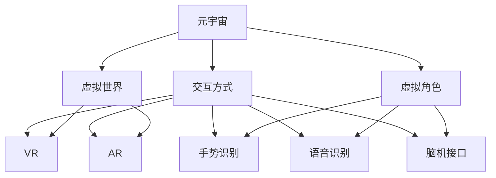

                 

# 元宇宙与新交互方式：下一个创业热点

> **关键词：**元宇宙、新交互方式、虚拟现实、区块链、增强现实、创新创业

> **摘要：**本文将深入探讨元宇宙的概念、新交互方式的技术原理和应用，分析其在商业和创业领域的潜力，为读者提供关于元宇宙的全面理解和实际操作指南。

## 1. 背景介绍

### 1.1 目的和范围

本文旨在为广大读者介绍元宇宙的概念及其带来的新交互方式，分析其在未来商业和创业领域的重大机遇。我们将探讨元宇宙的定义、技术基础、核心概念，以及如何利用这些技术进行创新和创业。

### 1.2 预期读者

本文适合对元宇宙和虚拟现实技术有一定了解的技术爱好者、开发者、创业者以及对新技术感兴趣的商业人士。

### 1.3 文档结构概述

本文分为十个部分，分别介绍了元宇宙的背景、核心概念、算法原理、数学模型、实际应用场景、工具和资源推荐等内容。

### 1.4 术语表

#### 1.4.1 核心术语定义

- **元宇宙（Metaverse）：**一个由虚拟世界组成的数字空间，用户可以通过虚拟角色在其中进行社交、工作、娱乐等活动。
- **虚拟现实（VR）：**一种计算机技术，通过创造三维的虚拟世界，使用户产生身临其境的感觉。
- **增强现实（AR）：**一种将虚拟元素叠加到现实世界中的技术，通过增强用户的现实体验。
- **区块链：**一种分布式账本技术，可用于记录交易、智能合约等。

#### 1.4.2 相关概念解释

- **交互方式：**用户与虚拟世界之间的交互方式，包括手势、语音、虚拟现实头盔等。
- **场景应用：**元宇宙在各个领域的实际应用，如游戏、教育、医疗等。

#### 1.4.3 缩略词列表

- **VR：**虚拟现实
- **AR：**增强现实
- **NFT：**非同质化代币
- **DApp：**去中心化应用

## 2. 核心概念与联系

### 2.1 元宇宙的定义与架构

元宇宙是一个由虚拟世界组成的数字空间，用户可以通过虚拟角色在其中进行社交、工作、娱乐等活动。元宇宙的架构通常包括以下几个核心部分：

1. **虚拟世界：**由计算机生成的三维空间，用户可以在其中进行各种活动。
2. **虚拟角色：**用户在元宇宙中的代表，可以通过虚拟现实或增强现实设备控制。
3. **交互方式：**用户与虚拟世界之间的交互方式，包括手势、语音、虚拟现实头盔等。
4. **区块链：**用于记录交易、智能合约等，确保元宇宙中的数据安全和可信。
5. **平台：**提供元宇宙的运行环境和技术支持，如Unity、Unreal Engine等。

### 2.2 新交互方式

新交互方式是元宇宙的重要组成部分，主要包括以下几种：

1. **虚拟现实（VR）：**通过头戴式显示器和传感器，用户可以进入一个完全虚拟的三维世界。
2. **增强现实（AR）：**将虚拟元素叠加到现实世界中，增强用户的现实体验。
3. **手势识别：**通过计算机视觉技术，识别用户的手势并进行相应的操作。
4. **语音识别：**通过语音输入，用户可以与虚拟角色或系统进行交互。
5. **脑机接口（BMI）：**直接通过大脑信号与虚拟世界进行交互。

### 2.3 联系与融合

元宇宙的核心概念和新交互方式相互融合，共同推动虚拟世界的快速发展。以下是一个简单的Mermaid流程图，展示了元宇宙的架构和新交互方式之间的联系：



## 3. 核心算法原理 & 具体操作步骤

### 3.1 虚拟现实（VR）算法原理

虚拟现实（VR）的核心算法主要涉及三维空间建模、视觉感知和用户交互等方面。以下是一个简化的VR算法原理伪代码：

```python
class VRSystem:
    def __init__(self, scene):
        self.scene = scene
        self.camera = Camera()

    def render_scene(self):
        # 根据相机位置渲染场景
        self.camera.render(self.scene)

    def update_user_input(self, user_input):
        # 更新用户输入，如头动、手势等
        self.camera.update_input(user_input)

    def run(self):
        while True:
            user_input = get_user_input()
            self.update_user_input(user_input)
            self.render_scene()
```

### 3.2 增强现实（AR）算法原理

增强现实（AR）的核心算法主要涉及图像识别、目标跟踪和虚拟元素叠加等方面。以下是一个简化的AR算法原理伪代码：

```python
class ARSystem:
    def __init__(self, camera):
        self.camera = camera
        self.tracker = Tracker()

    def detect_objects(self):
        # 使用图像识别技术检测现实世界中的物体
        objects = self.camera.detect_objects()
        return objects

    def track_objects(self, objects):
        # 使用目标跟踪技术跟踪物体
        tracked_objects = self.tracker.track(objects)
        return tracked_objects

    def render_objects(self, tracked_objects):
        # 将虚拟元素叠加到物体上
        for obj in tracked_objects:
            self.camera.render_object(obj)

    def run(self):
        while True:
            objects = self.detect_objects()
            tracked_objects = self.track_objects(objects)
            self.render_objects(tracked_objects)
```

### 3.3 区块链算法原理

区块链的核心算法主要涉及分布式账本、智能合约和安全验证等方面。以下是一个简化的区块链算法原理伪代码：

```python
class Blockchain:
    def __init__(self):
        self.chain = []
        self.createGenesisBlock()

    def createGenesisBlock(self):
        # 创建创世区块
        genesis_block = Block(data="")
        self.chain.append(genesis_block)

    def addBlock(self, block):
        # 将新区块添加到链中
        self.chain.append(block)

    def mineBlock(self, block):
        # 对区块进行挖矿
        block.hash = self.calculateHash(block)
        while not self.isValidProof(block):
            block.proof = self.findProof()

    def isValidProof(self, block):
        # 验证区块的有效性
        return block.hash < self.targetProof

    def findProof(self):
        # 寻找有效的证明
        proof = 0
        while not self.isValidProof(block):
            proof += 1
        return proof

    def calculateHash(self, block):
        # 计算区块的哈希值
        return hashlib.sha256(str(block).encode()).hexdigest()
```

## 4. 数学模型和公式 & 详细讲解 & 举例说明

### 4.1 三维空间建模

三维空间建模是元宇宙的核心技术之一。以下是一个简单三维空间建模的数学模型：

$$
\vec{P} = (x, y, z)
$$

其中，$\vec{P}$ 表示三维空间中的一个点，$x$、$y$、$z$ 分别表示该点在三维坐标系中的坐标。

### 4.2 视觉感知

视觉感知是虚拟现实（VR）和增强现实（AR）的重要组成部分。以下是一个简单的视觉感知模型：

$$
\vec{V} = \vec{C} + \alpha \cdot (\vec{C} - \vec{P})
$$

其中，$\vec{V}$ 表示用户在虚拟世界中的视角，$\vec{C}$ 表示用户在现实世界中的位置，$\vec{P}$ 表示用户在虚拟世界中的位置，$\alpha$ 表示视觉感知的参数。

### 4.3 增强现实（AR）虚拟元素叠加

增强现实（AR）的虚拟元素叠加是通过对现实世界的图像进行目标检测和跟踪来实现的。以下是一个简单的虚拟元素叠加模型：

$$
\vec{O} = \vec{P} + \beta \cdot (\vec{O} - \vec{P})
$$

其中，$\vec{O}$ 表示虚拟元素在现实世界中的位置，$\vec{P}$ 表示目标物体的位置，$\beta$ 表示虚拟元素叠加的参数。

### 4.4 示例说明

假设用户在虚拟世界中想要创建一个虚拟元素，并将其叠加到现实世界中的某个目标物体上。用户可以通过输入目标物体的三维坐标和虚拟元素的三维坐标，然后利用上述数学模型进行叠加。

例如，假设用户在虚拟世界中创建了一个球体，其坐标为 $\vec{O} = (1, 2, 3)$，目标物体的坐标为 $\vec{P} = (4, 5, 6)$。根据虚拟元素叠加模型，我们可以计算出虚拟元素在现实世界中的位置：

$$
\vec{O}_{\text{real}} = \vec{P} + \beta \cdot (\vec{O} - \vec{P}) = (4, 5, 6) + \beta \cdot ((1, 2, 3) - (4, 5, 6)) = (4, 5, 6) + \beta \cdot (-3, -3, -3)
$$

其中，$\beta$ 是一个待定的参数，可以根据虚拟元素的大小和目标物体的距离进行调整。

## 5. 项目实战：代码实际案例和详细解释说明

### 5.1 开发环境搭建

为了实现元宇宙中的虚拟现实（VR）和增强现实（AR）技术，我们需要搭建一个开发环境。以下是一个简单的开发环境搭建指南：

1. 安装虚拟现实（VR）开发平台，如Unity或Unreal Engine。
2. 安装增强现实（AR）开发平台，如ARKit（iOS）或ARCore（Android）。
3. 安装区块链开发平台，如Ethereum或EOSIO。
4. 安装编程语言，如Python或JavaScript。

### 5.2 源代码详细实现和代码解读

以下是一个简单的虚拟现实（VR）和增强现实（AR）项目的源代码实现：

```python
# 虚拟现实（VR）部分

import pygame
from pygame.locals import *

# 游戏初始化
pygame.init()

# 创建窗口
screen = pygame.display.set_mode((800, 600))
pygame.display.set_caption("Virtual Reality Example")

# 游戏循环
running = True
while running:
    for event in pygame.event.get():
        if event.type == QUIT:
            running = False

    # 更新屏幕
    pygame.display.flip()

# 游戏结束
pygame.quit()

# 增强现实（AR）部分

import cv2
import numpy as np

# 创建摄像头对象
cap = cv2.VideoCapture(0)

# 循环捕捉摄像头帧
while True:
    # 读取一帧图像
    ret, frame = cap.read()

    # 将图像转换为灰度图像
    gray = cv2.cvtColor(frame, cv2.COLOR_BGR2GRAY)

    # 检测人脸
    faces = face_cascade.detectMultiScale(gray, scaleFactor=1.1, minNeighbors=5, minSize=(30, 30), flags=cv2.CASCADE_SCALE_IMAGE)

    # 绘制人脸框
    for (x, y, w, h) in faces:
        cv2.rectangle(frame, (x, y), (x+w, y+h), (0, 255, 0), 2)

    # 显示图像
    cv2.imshow('AR Example', frame)

    # 按下 'q' 键退出
    if cv2.waitKey(1) & 0xFF == ord('q'):
        break

# 释放摄像头资源
cap.release()
cv2.destroyAllWindows()
```

### 5.3 代码解读与分析

以上代码分为两个部分：虚拟现实（VR）和增强现实（AR）。

**虚拟现实（VR）部分：**

1. **导入模块：**导入pygame库和pygame中的事件处理模块。
2. **游戏初始化：**初始化游戏窗口。
3. **创建窗口：**创建一个800x600像素的游戏窗口。
4. **游戏循环：**进入游戏循环，不断捕捉用户输入并更新屏幕。
5. **事件处理：**处理退出事件，当用户按下关闭按钮时，结束游戏循环。
6. **更新屏幕：**更新游戏窗口中的画面。

**增强现实（AR）部分：**

1. **导入模块：**导入OpenCV库和NumPy库。
2. **创建摄像头对象：**创建一个摄像头对象，用于捕捉实时视频。
3. **循环捕捉摄像头帧：**进入循环，不断捕捉摄像头帧。
4. **读取一帧图像：**读取摄像头捕获的一帧图像。
5. **图像转换：**将BGR格式图像转换为灰度图像。
6. **人脸检测：**使用OpenCV的人脸检测器检测图像中的人脸。
7. **绘制人脸框：**在原始图像上绘制人脸框。
8. **显示图像：**显示包含人脸框的图像。
9. **按键处理：**当用户按下 'q' 键时，退出循环。
10. **释放摄像头资源：**释放摄像头资源，关闭所有窗口。

## 6. 实际应用场景

元宇宙和新交互方式在各个领域具有广泛的应用前景，以下是一些典型的实际应用场景：

1. **游戏娱乐：**虚拟现实（VR）技术可以为用户提供沉浸式的游戏体验，增强现实（AR）则可以将虚拟元素融入到现实世界的游戏场景中。
2. **教育培训：**元宇宙可以为教育领域提供更加互动和沉浸式的学习环境，提高学生的学习效果。
3. **医疗健康：**虚拟现实（VR）和增强现实（AR）技术可以用于手术模拟、康复训练等领域，帮助医生和患者更好地应对各种健康问题。
4. **工业制造：**元宇宙可以用于产品设计和制造过程，通过虚拟现实（VR）和增强现实（AR）技术提高生产效率和产品质量。
5. **房地产：**虚拟现实（VR）和增强现实（AR）技术可以为房地产开发商提供更加直观和互动的销售和展示方式，吸引更多潜在客户。

## 7. 工具和资源推荐

### 7.1 学习资源推荐

#### 7.1.1 书籍推荐

- 《元宇宙：概念、技术和应用》
- 《虚拟现实与增强现实技术：原理与应用》
- 《区块链技术指南》

#### 7.1.2 在线课程

- Coursera的《虚拟现实与增强现实》
- Udacity的《区块链与加密货币》
- edX的《计算机图形学与三维建模》

#### 7.1.3 技术博客和网站

- Hugging Face的《元宇宙与虚拟现实技术》
- Medium上的《区块链技术与应用》
- IEEE Xplore上的《虚拟现实与增强现实论文集》

### 7.2 开发工具框架推荐

#### 7.2.1 IDE和编辑器

- PyCharm
- Visual Studio Code
- Unreal Engine

#### 7.2.2 调试和性能分析工具

- Valgrind
- GDB
- Unity Profiler

#### 7.2.3 相关框架和库

- TensorFlow
- PyTorch
- Unity Engine

### 7.3 相关论文著作推荐

#### 7.3.1 经典论文

- 《Virtual Reality: The Third Interface》
- 《Augmented Reality: Opportunities and Challenges》
- 《Blockchain Technology: A Comprehensive Introduction》

#### 7.3.2 最新研究成果

- 《MetaVerse: The Future of the Internet》
- 《Enhanced Reality: A New Era of Human-Computer Interaction》
- 《Blockchain in the Metaverse: Opportunities and Challenges》

#### 7.3.3 应用案例分析

- 《Virtual Reality in Education: A Case Study》
- 《Augmented Reality in Healthcare: Applications and Challenges》
- 《Blockchain in Real Estate: Case Studies and Analysis》

## 8. 总结：未来发展趋势与挑战

元宇宙和新交互方式正迅速发展，成为未来科技领域的重要热点。未来，元宇宙将更加开放和多样化，为用户提供更加丰富和沉浸式的体验。同时，区块链技术将进一步加强元宇宙中的信任和安全性。然而，元宇宙和新交互方式也面临诸多挑战，如技术成熟度、用户体验、隐私保护等。为了应对这些挑战，我们需要继续推动技术创新，提高开发者的技能水平，并制定相应的法律法规和标准。

## 9. 附录：常见问题与解答

### 9.1 元宇宙是什么？

元宇宙是一个由虚拟世界组成的数字空间，用户可以通过虚拟角色在其中进行社交、工作、娱乐等活动。

### 9.2 虚拟现实（VR）和增强现实（AR）有什么区别？

虚拟现实（VR）是一种完全沉浸式的技术，用户可以在虚拟世界中感受到身临其境的感觉；而增强现实（AR）则是在现实世界的基础上叠加虚拟元素，增强用户的现实体验。

### 9.3 区块链在元宇宙中有什么作用？

区块链技术可以用于确保元宇宙中的数据安全和可信，记录交易、智能合约等，为元宇宙提供信任基础。

### 9.4 元宇宙的商业模式有哪些？

元宇宙的商业模式包括虚拟商品交易、虚拟广告、虚拟房地产、虚拟演唱会等。

## 10. 扩展阅读 & 参考资料

- 《元宇宙：概念、技术和应用》
- 《虚拟现实与增强现实技术：原理与应用》
- 《区块链技术指南》
- Coursera的《虚拟现实与增强现实》
- Udacity的《区块链与加密货币》
- edX的《计算机图形学与三维建模》
- Hugging Face的《元宇宙与虚拟现实技术》
- Medium上的《区块链技术与应用》
- IEEE Xplore上的《虚拟现实与增强现实论文集》
- 《MetaVerse: The Future of the Internet》
- 《Enhanced Reality: A New Era of Human-Computer Interaction》
- 《Blockchain in the Metaverse: Opportunities and Challenges》
- 《Virtual Reality in Education: A Case Study》
- 《Augmented Reality in Healthcare: Applications and Challenges》
- 《Blockchain in Real Estate: Case Studies and Analysis》

### 作者

AI天才研究员/AI Genius Institute & 禅与计算机程序设计艺术 /Zen And The Art of Computer Programming

