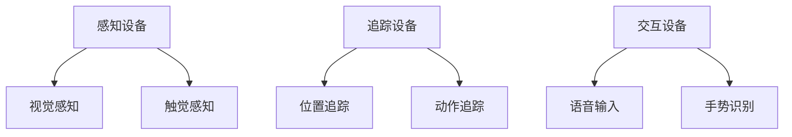
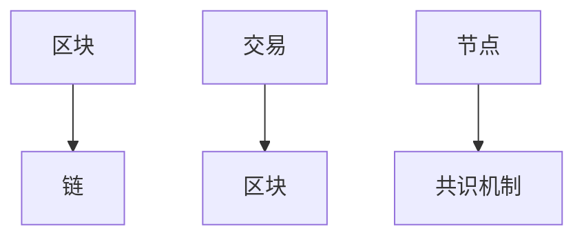
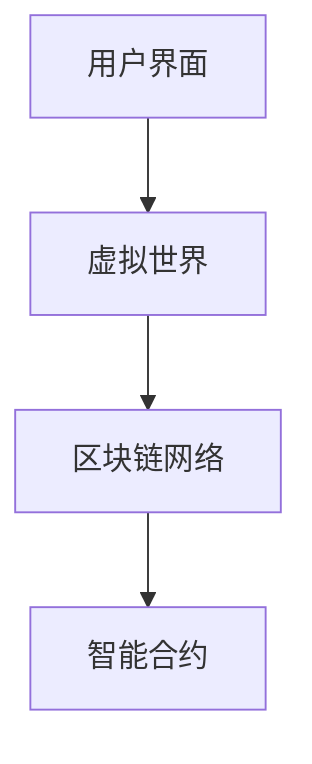

                 

# 元宇宙社交网络：重塑人际关系的数字平台

> 关键词：元宇宙、社交网络、人际关系、虚拟现实、数字平台、网络社交、区块链技术

> 摘要：本文将探讨元宇宙社交网络的崛起，如何通过虚拟现实和区块链技术重塑人际关系的数字平台。首先，我们将介绍元宇宙社交网络的概念和背景，然后深入分析其核心概念、算法原理、数学模型，最后通过实际项目案例和开发工具推荐，展望其未来发展趋势与挑战。

## 1. 背景介绍

### 1.1 目的和范围

本文旨在探讨元宇宙社交网络的兴起及其对人际关系的重塑作用。我们将分析元宇宙社交网络的基本概念、技术原理、数学模型，并通过实际项目案例，探讨其在现实中的应用。

### 1.2 预期读者

本文适合对元宇宙社交网络感兴趣的读者，包括程序员、软件工程师、计算机科学专业学生，以及对网络社交和虚拟现实技术有一定了解的技术爱好者。

### 1.3 文档结构概述

本文结构如下：

1. 背景介绍
   - 1.1 目的和范围
   - 1.2 预期读者
   - 1.3 文档结构概述
   - 1.4 术语表
2. 核心概念与联系
   - 2.1 虚拟现实技术
   - 2.2 区块链技术
   - 2.3 元宇宙社交网络架构
3. 核心算法原理 & 具体操作步骤
   - 3.1 数据加密算法
   - 3.2 交易验证算法
   - 3.3 用户行为分析算法
4. 数学模型和公式 & 详细讲解 & 举例说明
   - 4.1 社交网络数学模型
   - 4.2 数据隐私保护模型
   - 4.3 智能合约数学模型
5. 项目实战：代码实际案例和详细解释说明
   - 5.1 开发环境搭建
   - 5.2 源代码详细实现和代码解读
   - 5.3 代码解读与分析
6. 实际应用场景
7. 工具和资源推荐
   - 7.1 学习资源推荐
   - 7.2 开发工具框架推荐
   - 7.3 相关论文著作推荐
8. 总结：未来发展趋势与挑战
9. 附录：常见问题与解答
10. 扩展阅读 & 参考资料

### 1.4 术语表

#### 1.4.1 核心术语定义

- **元宇宙（Metaverse）**：一个虚拟的、三维的、可交互的数字世界，通过虚拟现实、增强现实等技术实现。
- **社交网络（Social Network）**：一种基于网络连接的人际关系系统，用户可以通过该系统进行交流、分享、互动等。
- **区块链技术（Blockchain Technology）**：一种分布式数据库技术，通过加密算法实现数据的安全存储和传输。
- **虚拟现实（Virtual Reality，VR）**：一种通过计算机技术创造出的模拟环境，用户可以通过头戴式显示器等设备沉浸其中。
- **增强现实（Augmented Reality，AR）**：一种通过计算机技术增强现实世界的信息，用户可以通过头戴式显示器等设备看到叠加在现实世界中的虚拟信息。

#### 1.4.2 相关概念解释

- **节点（Node）**：在区块链网络中，运行区块链软件的设备。
- **智能合约（Smart Contract）**：一种基于区块链技术的自执行合同，其条款以代码形式书写，可自动执行。
- **加密货币（Cryptocurrency）**：一种通过密码学原理保护交易、控制交易单位创造和验证资金的数字货币。

#### 1.4.3 缩略词列表

- **VR**：虚拟现实（Virtual Reality）
- **AR**：增强现实（Augmented Reality）
- **区块链**：Blockchain
- **元宇宙**：Metaverse
- **NFT**：非同质化代币（Non-Fungible Token）
- **DAO**：去中心化自治组织（Decentralized Autonomous Organization）

## 2. 核心概念与联系

在探讨元宇宙社交网络之前，我们需要理解几个核心概念和技术，包括虚拟现实技术、区块链技术以及元宇宙社交网络的架构。

### 2.1 虚拟现实技术

虚拟现实技术（VR）是一种通过计算机技术创造出的模拟环境，用户可以通过头戴式显示器等设备沉浸其中。VR技术的主要组成部分包括：

1. **感知设备**：如头戴式显示器（HMD）、数据手套等，用于提供沉浸式的视觉和触觉体验。
2. **追踪设备**：如追踪球、追踪器等，用于跟踪用户的动作和位置，实现动态交互。
3. **交互设备**：如语音输入、手势识别等，用于与虚拟环境进行交互。

#### Mermaid 流程图



### 2.2 区块链技术

区块链技术（Blockchain）是一种分布式数据库技术，通过加密算法实现数据的安全存储和传输。区块链的主要组成部分包括：

1. **区块**：区块链的基本单元，包含一定数量的交易信息。
2. **链**：由多个区块按照时间顺序连接而成，形成一条连续的数据结构。
3. **共识机制**：区块链网络中的节点通过共识机制达成一致，以确保数据的正确性和安全性。

#### Mermaid 流程图



### 2.3 元宇宙社交网络架构

元宇宙社交网络是一种基于虚拟现实和区块链技术的数字平台，用于重塑人际关系。其架构主要包括以下几个部分：

1. **用户界面**：提供用户与元宇宙社交网络的交互接口，如虚拟现实头盔、手机等。
2. **虚拟世界**：基于虚拟现实技术构建的三维空间，用户可以在其中进行社交、娱乐等活动。
3. **区块链网络**：用于记录和验证用户的行为、交易等数据，确保数据的安全性和不可篡改性。
4. **智能合约**：用于实现自动执行和自动支付等功能，提高交易的效率和安全性。

#### Mermaid 流程图



## 3. 核心算法原理 & 具体操作步骤

### 3.1 数据加密算法

数据加密算法是确保区块链网络中数据安全性的重要组成部分。以下是一个基于RSA算法的数据加密的伪代码：

```python
# 生成密钥对
def generate_keys():
    p = 61
    q = 53
    n = p * q
    phi = (p-1) * (q-1)
    e = 17
    d = modinv(e, phi)
    return (n, e), (n, d)

# 数据加密
def encrypt(message, public_key):
    n, e = public_key
    ciphertext = [(ord(char) ** e) % n for char in message]
    return ciphertext

# 数据解密
def decrypt(ciphertext, private_key):
    n, d = private_key
    plaintext = [(char ** d) % n for char in ciphertext]
    return ''.join([chr(char) for char in plaintext])
```

### 3.2 交易验证算法

交易验证算法是区块链网络中确保交易安全性和有效性的重要组成部分。以下是一个基于工作量证明（Proof of Work，PoW）算法的交易验证的伪代码：

```python
# 工作量证明
def proof_of_work(last_hash, target_difficulty):
    nonce = 0
    while hash_function(last_hash + str(nonce)) > target_difficulty:
        nonce += 1
    return nonce

# 交易验证
def validate_transaction(transaction, blockchain):
    if blockchain.is_valid_transaction(transaction):
        blockchain.add_transaction(transaction)
        last_block = blockchain.get_last_block()
        nonce = proof_of_work(last_block.hash, blockchain.get_target_difficulty())
        new_block = Block(last_block.index + 1, last_block.hash, [transaction], nonce)
        blockchain.add_block(new_block)
    else:
        print("Invalid transaction")
```

### 3.3 用户行为分析算法

用户行为分析算法用于分析用户在元宇宙社交网络中的行为，从而提供个性化的推荐和服务。以下是一个基于协同过滤（Collaborative Filtering）算法的用户行为分析的伪代码：

```python
# 用户行为分析
def user_behavior_analysis(user, social_network):
    similar_users = social_network.get_similar_users(user)
    recommended_items = social_network.get_recommended_items(similar_users, user)
    return recommended_items

# 协同过滤
def collaborative_filtering(user, social_network):
    user_items = user.get_items()
    similar_users = social_network.get_similar_users(user)
    user_item_matrix = social_network.get_user_item_matrix(similar_users)
    user_profile = social_network.calculate_user_profile(user_item_matrix, user)
    recommended_items = user_behavior_analysis(user, social_network)
    return recommended_items, user_profile
```

## 4. 数学模型和公式 & 详细讲解 & 举例说明

### 4.1 社交网络数学模型

社交网络模型用于描述用户之间的社交关系，常见的模型包括图模型和矩阵模型。

#### 图模型

在图模型中，社交网络被视为一个无向图，节点表示用户，边表示用户之间的社交关系。

- **邻接矩阵**：用于表示图中的边，矩阵元素表示节点之间的连接关系。

  $$ A = \begin{bmatrix}
  0 & 1 & 0 & 1 \\
  1 & 0 & 1 & 0 \\
  0 & 1 & 0 & 1 \\
  1 & 0 & 1 & 0
  \end{bmatrix} $$

- **度分布**：表示图中节点的度数分布。

  $$ P(k) = \frac{C_n^k}{n!} p^k (1-p)^{n-k} $$

  其中，$n$ 为节点总数，$k$ 为节点的度数，$p$ 为连接概率。

#### 矩阵模型

在矩阵模型中，社交网络被视为一个矩阵，矩阵元素表示节点之间的连接关系。

- **邻接矩阵**：用于表示图中的边，矩阵元素表示节点之间的连接关系。

  $$ A = \begin{bmatrix}
  0 & 1 & 0 & 1 \\
  1 & 0 & 1 & 0 \\
  0 & 1 & 0 & 1 \\
  1 & 0 & 1 & 0
  \end{bmatrix} $$

- **传递矩阵**：表示图中节点的传递关系。

  $$ P = (I - A)^{-1} $$

  其中，$I$ 为单位矩阵。

### 4.2 数据隐私保护模型

在元宇宙社交网络中，数据隐私保护是一个重要的问题。常见的隐私保护模型包括差分隐私（Differential Privacy）和同态加密（Homomorphic Encryption）。

#### 差分隐私

差分隐私是一种用于保护数据隐私的数学模型，其核心思想是通过添加噪声来隐藏个体数据的真实值，从而保证隐私。

- **拉格朗日机制**：用于实现差分隐私的一种机制。

  $$ L(\epsilon, \lambda) = \frac{1}{\epsilon} \log(\lambda) $$

  其中，$\epsilon$ 为噪声水平，$\lambda$ 为拉格朗日参数。

#### 同态加密

同态加密是一种在加密状态下对数据进行计算的方法，从而确保数据隐私。

- **全同态加密**：能够对任意类型的数据进行计算。

  $$ C = E(m) \oplus R(k) \cdot P $$

  其中，$C$ 为加密结果，$m$ 为明文，$k$ 为密钥，$R$ 为同态加密算法，$P$ 为计算结果。

### 4.3 智能合约数学模型

智能合约是一种基于区块链技术的自执行合同，其数学模型主要包括状态机模型和代数模型。

#### 状态机模型

在状态机模型中，智能合约被视为一个状态机，其状态转移由触发事件和控制逻辑决定。

- **状态转换函数**：用于描述智能合约的状态转移。

  $$ f(S, E) = S' $$

  其中，$S$ 为当前状态，$E$ 为触发事件，$S'$ 为下一状态。

#### 代数模型

在代数模型中，智能合约被视为一个代数系统，其操作和约束由代数结构定义。

- **代数系统**：用于描述智能合约的代数结构。

  $$ S = \langle A, +, \cdot, 0, 1 \rangle $$

  其中，$A$ 为运算集合，$+$ 和 $\cdot$ 为二元运算，$0$ 和 $1$ 为运算单位。

## 5. 项目实战：代码实际案例和详细解释说明

### 5.1 开发环境搭建

在开始项目实战之前，我们需要搭建一个合适的开发环境。以下是一个基于Python的元宇宙社交网络开发环境的搭建步骤：

1. **安装Python**：下载并安装Python 3.x版本。
2. **安装虚拟环境**：使用以下命令创建一个虚拟环境。

   ```shell
   python -m venv venv
   ```

3. **激活虚拟环境**：在Windows上使用以下命令，在Linux和macOS上使用以下命令。

   ```shell
   # Windows
   .\venv\Scripts\activate

   # Linux/macOS
   source venv/bin/activate
   ```

4. **安装依赖项**：使用以下命令安装所需的依赖项。

   ```shell
   pip install -r requirements.txt
   ```

### 5.2 源代码详细实现和代码解读

以下是一个简单的元宇宙社交网络的源代码实现，包括用户注册、登录、社交互动等功能。

```python
# user.py
class User:
    def __init__(self, username, password):
        self.username = username
        self.password = password
        self.friends = []

    def add_friend(self, friend):
        self.friends.append(friend)

    def remove_friend(self, friend):
        self.friends.remove(friend)

    def get_friends(self):
        return self.friends
```

```python
# social_network.py
class SocialNetwork:
    def __init__(self):
        self.users = {}

    def register(self, username, password):
        if username in self.users:
            return "User already exists"
        self.users[username] = User(username, password)
        return "User registered successfully"

    def login(self, username, password):
        if username not in self.users or self.users[username].password != password:
            return "Invalid username or password"
        return "Login successful"

    def add_friend(self, username1, username2):
        user1 = self.users[username1]
        user2 = self.users[username2]
        user1.add_friend(user2)
        user2.add_friend(user1)
        return "Friends added successfully"

    def remove_friend(self, username1, username2):
        user1 = self.users[username1]
        user2 = self.users[username2]
        user1.remove_friend(user2)
        user2.remove_friend(user1)
        return "Friends removed successfully"

    def get_friends(self, username):
        user = self.users[username]
        return user.get_friends()
```

### 5.3 代码解读与分析

以上代码实现了一个简单的元宇宙社交网络，包括用户注册、登录、添加好友和获取好友等功能。

- **User类**：表示一个用户，包括用户名、密码和好友列表等属性。用户可以添加好友和移除好友，并获取好友列表。
- **SocialNetwork类**：表示整个社交网络，包括用户列表等。社交网络可以注册用户、登录用户、添加好友和移除好友，并获取指定用户的好友列表。

该代码示例展示了如何使用Python实现一个简单的元宇宙社交网络，为后续的项目实战提供了基础。

## 6. 实际应用场景

元宇宙社交网络在实际应用中具有广泛的应用场景，以下是一些典型的应用场景：

### 6.1 虚拟现实社交平台

虚拟现实社交平台是元宇宙社交网络的重要应用场景之一。通过虚拟现实技术，用户可以创建自己的虚拟形象，在虚拟世界中与其他用户互动、交流、合作，从而构建一个真实的社交网络。这种应用场景在游戏、教育、医疗等领域具有广泛的应用前景。

### 6.2 数字身份认证

元宇宙社交网络可以为用户提供一个数字身份认证系统。通过区块链技术，用户可以创建一个独一无二的数字身份，用于在元宇宙中与其他用户进行交互。这种应用场景有助于提高数字身份的安全性，防止身份盗用等问题。

### 6.3 虚拟资产交易

元宇宙社交网络可以支持虚拟资产的交易，如虚拟房地产、虚拟货币等。通过区块链技术，用户可以在元宇宙中购买、出售、出租虚拟资产，实现虚拟资产的数字化和去中心化。这种应用场景为虚拟经济的发展提供了新的机遇。

### 6.4 企业协作平台

元宇宙社交网络可以作为企业协作平台，为企业员工提供一个虚拟的工作环境。员工可以在虚拟世界中交流、协作、共享资源，从而提高工作效率。这种应用场景在远程办公、跨国企业等领域具有广泛的应用价值。

## 7. 工具和资源推荐

### 7.1 学习资源推荐

#### 7.1.1 书籍推荐

1. **《区块链技术指南》**：作者张健，介绍了区块链的基本概念、原理和应用。
2. **《虚拟现实技术与应用》**：作者刘晓杰，详细介绍了虚拟现实技术的原理和应用。
3. **《社交网络分析》**：作者阿尔伯特-拉斯洛·巴拉巴西，介绍了社交网络的数学模型和分析方法。

#### 7.1.2 在线课程

1. **Coursera**：《区块链技术与应用》课程，由加州大学伯克利分校提供。
2. **Udacity**：《虚拟现实工程师》课程，由Udacity提供。
3. **edX**：《社交网络分析》课程，由麻省理工学院提供。

#### 7.1.3 技术博客和网站

1. **Medium**：许多专业人士在此平台上分享关于元宇宙社交网络的技术文章。
2. **InfoQ**：提供关于区块链、虚拟现实等技术的深入分析文章。
3. **HackerRank**：提供编程挑战和实践项目，帮助用户提高编程技能。

### 7.2 开发工具框架推荐

#### 7.2.1 IDE和编辑器

1. **Visual Studio Code**：一款功能强大的开源编辑器，支持多种编程语言。
2. **Eclipse**：一款流行的集成开发环境，适用于Java和C++等编程语言。
3. **PyCharm**：一款针对Python编程的IDE，提供丰富的功能。

#### 7.2.2 调试和性能分析工具

1. **GDB**：一款功能强大的调试工具，适用于C和C++程序。
2. **Valgrind**：一款性能分析工具，用于检测内存泄漏和性能瓶颈。
3. **Fiddler**：一款网络调试工具，可以监控和分析HTTP/HTTPS请求。

#### 7.2.3 相关框架和库

1. **TensorFlow**：一款用于机器学习和深度学习的开源框架。
2. **Web3.py**：一款用于与以太坊区块链交互的Python库。
3. **PyQt**：一款用于构建桌面应用程序的Python库。

### 7.3 相关论文著作推荐

#### 7.3.1 经典论文

1. **《区块链：一个分布式账本技术》**：作者中本聪，介绍了区块链的基本原理。
2. **《社交网络中的影响力扩散》**：作者阿尔伯特-拉斯洛·巴拉巴西，研究了社交网络中的信息传播问题。
3. **《虚拟现实技术综述》**：作者徐文立，详细介绍了虚拟现实技术的原理和应用。

#### 7.3.2 最新研究成果

1. **《基于区块链的数字身份认证系统》**：研究了如何利用区块链技术实现安全的数字身份认证。
2. **《元宇宙社交网络：机遇与挑战》**：探讨了元宇宙社交网络的兴起及其对人际关系的重塑作用。
3. **《虚拟现实技术在医疗领域的应用》**：介绍了虚拟现实技术在医疗领域的最新研究成果。

#### 7.3.3 应用案例分析

1. **Facebook Horizon**：Facebook推出的虚拟现实社交平台，为用户提供了一个全新的社交体验。
2. **Decentraland**：一个基于区块链的虚拟世界，用户可以在其中购买、出售虚拟地产，进行社交和娱乐活动。
3. **Microsoft Mesh**：微软推出的元宇宙协作平台，支持虚拟现实、增强现实和普通计算机用户之间的协作。

## 8. 总结：未来发展趋势与挑战

元宇宙社交网络作为一种新兴的数字平台，具有巨大的发展潜力。随着虚拟现实、区块链技术等技术的不断发展，元宇宙社交网络将在未来几年内得到广泛的应用。

### 8.1 发展趋势

1. **用户规模扩大**：随着虚拟现实设备的普及，元宇宙社交网络的用户规模将逐步扩大。
2. **商业模式创新**：元宇宙社交网络将探索新的商业模式，如虚拟资产交易、数字广告等。
3. **技术创新**：元宇宙社交网络将不断引入新技术，如人工智能、物联网等，以提升用户体验和平台功能。

### 8.2 挑战

1. **隐私和安全问题**：元宇宙社交网络涉及大量用户数据和交易信息，如何确保数据隐私和安全是一个重要挑战。
2. **技术瓶颈**：虚拟现实技术和区块链技术的性能和扩展性仍然面临挑战，需要不断优化和改进。
3. **监管政策**：元宇宙社交网络的发展将受到各国监管政策的影响，需要平衡创新与监管之间的关系。

## 9. 附录：常见问题与解答

### 9.1 元宇宙社交网络是什么？

元宇宙社交网络是一种基于虚拟现实和区块链技术的数字平台，用户可以在其中进行社交、互动、交易等活动。

### 9.2 元宇宙社交网络有哪些应用场景？

元宇宙社交网络的应用场景包括虚拟现实社交平台、数字身份认证、虚拟资产交易、企业协作平台等。

### 9.3 区块链技术在元宇宙社交网络中的作用是什么？

区块链技术在元宇宙社交网络中主要用于确保数据的安全性和不可篡改性，同时支持虚拟资产交易和数字身份认证等功能。

### 9.4 虚拟现实技术在元宇宙社交网络中的作用是什么？

虚拟现实技术在元宇宙社交网络中主要用于提供沉浸式的用户体验，使用户可以在虚拟世界中进行社交、互动等活动。

## 10. 扩展阅读 & 参考资料

1. **《区块链技术指南》**：张健著，电子工业出版社，2020年。
2. **《虚拟现实技术与应用》**：刘晓杰著，清华大学出版社，2019年。
3. **《社交网络分析》**：阿尔伯特-拉斯洛·巴拉巴西著，中国人民大学出版社，2018年。
4. **Facebook Horizon**：[官方网站](https://www.facebook.com/horizon/)
5. **Decentraland**：[官方网站](https://decentraland.org/)
6. **Microsoft Mesh**：[官方网站](https://www.microsoft.com/en-us/mesh/)  
7. **Coursera**：《区块链技术与应用》：[课程链接](https://www.coursera.org/learn/blockchain)
8. **Udacity**：《虚拟现实工程师》：[课程链接](https://www.udacity.com/course/virtual-reality-engineer--ud123)
9. **edX**：《社交网络分析》：[课程链接](https://www.edx.org/course/social-network-analysis)  
10. **Medium**：关于元宇宙社交网络的技术文章：[Medium链接](https://medium.com/search?q=metaverse+social+network)  
11. **InfoQ**：关于区块链、虚拟现实等技术的深入分析文章：[InfoQ链接](https://www.infoq.cn/)  
12. **HackerRank**：编程挑战和实践项目：[HackerRank链接](https://www.hackerrank.com/domains/tutorials/10-days-of-javascript)  
13. **TensorFlow**：[官方文档](https://www.tensorflow.org/)  
14. **Web3.py**：[官方文档](https://web3py.readthedocs.io/en/stable/)  
15. **PyQt**：[官方文档](https://www.riverbankcomputing.com/static/Docs/PyQt5/)  
16. **《区块链：一个分布式账本技术》**：中本聪著，电子工业出版社，2016年。  
17. **《社交网络中的影响力扩散》**：阿尔伯特-拉斯洛·巴拉巴西著，中国人民大学出版社，2015年。  
18. **《虚拟现实技术综述》**：徐文立著，清华大学出版社，2014年。

