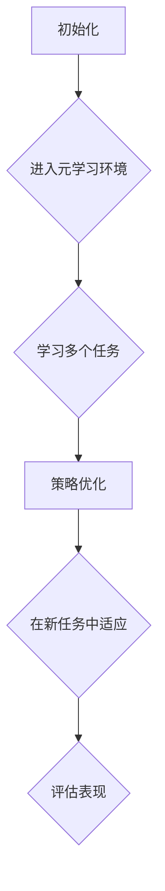

                 

# 元强化学习：适应复杂动态环境的AI

> 关键词：元强化学习、动态环境、AI适应、算法原理、数学模型、实战案例、应用场景

> 摘要：本文将深入探讨元强化学习这一前沿技术，阐述其在复杂动态环境下的适应能力。通过解析核心概念、算法原理、数学模型和实际应用案例，我们将全面了解元强化学习的优势、挑战及其未来发展趋势。

## 1. 背景介绍

### 1.1 目的和范围

本文旨在为读者提供一个关于元强化学习（Meta Reinforcement Learning）的全面指南。我们将从基础概念出发，逐步深入探讨其算法原理、数学模型，并借助实际应用案例展示其在复杂动态环境中的适应能力。通过本文的阅读，读者将能够：

- 理解元强化学习的基本概念及其与强化学习的区别。
- 掌握元强化学习的关键算法原理和实现步骤。
- 分析元强化学习在数学模型中的表现和优势。
- 了解元强化学习在实际应用中的案例和潜在价值。

### 1.2 预期读者

本文适合对人工智能、机器学习和强化学习有一定了解的读者，包括但不限于：

- 人工智能研究员和工程师。
- 机器学习开发者和技术爱好者。
- 计算机科学和工程专业的学生和学者。
- 对前沿技术保持关注的技术领导者和管理者。

### 1.3 文档结构概述

本文结构如下：

- **第1部分：背景介绍**：介绍本文的目的、范围、预期读者以及文档结构。
- **第2部分：核心概念与联系**：阐述元强化学习的核心概念、原理和流程图。
- **第3部分：核心算法原理与具体操作步骤**：详细讲解元强化学习算法的原理和操作步骤。
- **第4部分：数学模型和公式**：介绍元强化学习中的关键数学模型，并举例说明。
- **第5部分：项目实战**：通过具体代码案例展示元强化学习在实践中的应用。
- **第6部分：实际应用场景**：探讨元强化学习的多种应用场景。
- **第7部分：工具和资源推荐**：推荐学习资源和开发工具。
- **第8部分：总结**：总结元强化学习的现状、挑战和未来发展趋势。
- **第9部分：附录**：常见问题与解答。
- **第10部分：扩展阅读**：提供进一步阅读的参考资料。

### 1.4 术语表

#### 1.4.1 核心术语定义

- **元强化学习**：一种强化学习的方法，旨在通过学习多个任务来提高强化学习算法的性能。
- **强化学习**：一种机器学习方法，通过奖励和惩罚来指导智能体在环境中做出决策。
- **动态环境**：指环境状态随时间变化，并且任务目标可能随时间调整的环境。

#### 1.4.2 相关概念解释

- **奖励函数**：定义智能体在执行某个动作后获得的奖励，用于指导智能体的决策。
- **价值函数**：预测智能体在特定状态下执行特定动作的长期回报。
- **策略**：智能体在不同状态下的动作选择规则。

#### 1.4.3 缩略词列表

- **RL**：强化学习（Reinforcement Learning）
- **MAML**：模型自适应性（Model Adaptation）
- **PPO**：演员-评论家优化（Proximal Policy Optimization）
- **DRL**：深度强化学习（Deep Reinforcement Learning）

## 2. 核心概念与联系

元强化学习是强化学习的一个分支，其主要目标是提高智能体在不同任务上的学习效率。传统强化学习算法通常在一个固定的环境中进行训练，而元强化学习通过学习多个任务来提高智能体在未知环境中的适应能力。以下是对元强化学习核心概念的详细解释及其与强化学习的联系。

### 2.1 元强化学习的概念

**元强化学习的定义**：元强化学习是一种自我优化的强化学习方法，其核心思想是通过学习如何快速适应新任务来提高智能体的表现。具体来说，元强化学习算法通过在一个元学习环境中（即多个不同任务的集合）进行训练，从而获得一种泛化的策略，使得智能体能够在新的任务中快速适应并达到优秀的表现。

**元强化学习的动机**：在现实世界中，任务往往不是静态的，环境状态和目标都可能随时间变化。例如，机器人需要适应不同的工作环境，自动驾驶系统需要应对各种交通场景。传统强化学习算法在这些动态环境中可能需要大量时间来重新训练，而元强化学习通过快速适应新任务，提高了智能体的学习效率和灵活性。

### 2.2 元强化学习与强化学习的区别

**强化学习的基本流程**：强化学习通过智能体与环境交互，不断调整策略以最大化累积奖励。具体流程包括：环境初始化、智能体选择动作、环境根据动作给予奖励、智能体更新策略。

**元强化学习的扩展**：元强化学习在强化学习的基础上引入了元学习（Meta-Learning）的概念。元学习旨在提高智能体在不同任务上的学习速度，具体流程包括：环境初始化、智能体在元学习环境中学习多个任务、智能体在新任务中快速适应并表现出色。

**关键区别**：

- **任务数量**：强化学习通常在一个固定任务上进行训练，而元强化学习涉及多个任务。
- **学习速度**：强化学习需要逐个任务进行训练，学习速度较慢，而元强化学习通过元学习加速了学习过程。
- **泛化能力**：元强化学习通过学习多个任务，提高了智能体在不同任务上的泛化能力。

### 2.3 元强化学习的核心概念

**元学习**：元学习是指学习如何学习，通过快速适应新任务来提高学习效率。在元强化学习中，元学习通过优化智能体的策略，使其能够在多个任务中快速适应。

**策略优化**：元强化学习通过策略优化算法，如模型自适应性（Model Adaptation, MAML）和演员-评论家优化（Proximal Policy Optimization, PPO），来优化智能体的策略，使其在新的任务中能够快速达到优秀表现。

**任务多样性**：元强化学习通过引入多样性任务，使得智能体能够在不同任务中学习到丰富的经验，从而提高泛化能力。

### 2.4 元强化学习的流程图

以下是元强化学习的流程图，展示了元强化学习从初始化、元学习到在新任务中适应的过程：



- **初始化**：智能体初始化并在元学习环境中开始训练。
- **学习多个任务**：智能体在元学习环境中学习多个任务，积累经验。
- **策略优化**：基于多个任务的学习经验，智能体的策略得到优化。
- **在新任务中适应**：智能体在新任务中应用优化后的策略，快速适应并表现出色。
- **评估表现**：对新任务中的表现进行评估，以指导进一步的元学习和策略优化。

通过上述核心概念的介绍和流程图的展示，我们可以更好地理解元强化学习的基本原理及其与强化学习的联系。接下来，我们将进一步探讨元强化学习中的核心算法原理，以深入理解其实现方法和应用场景。

## 3. 核心算法原理与具体操作步骤

元强化学习算法的核心在于通过元学习（Meta-Learning）来提高智能体在不同任务上的适应能力。本节将详细讲解元强化学习的关键算法原理和具体操作步骤，以便读者更好地理解其工作原理。

### 3.1 模型自适应性（Model Adaptation）

**模型自适应性（MAML）** 是一种经典的元强化学习算法，其核心思想是通过学习一个对任务变化具有鲁棒性的模型，以便在新的任务中快速适应。以下是 MAML 算法的原理和具体操作步骤：

#### 3.1.1 算法原理

MAML 算法通过优化一个模型参数的初始值，使得模型在经历一次梯度更新后能够在新的任务中达到接近最优的表现。具体来说，MAML 的目标是优化初始参数 θ₀，使得模型在新任务 T' 上经过一次梯度更新后，其参数 θ' 接近最优参数 θ⁺。

$$
\min_{\theta_0} \frac{1}{N} \sum_{n=1}^{N} \mathbb{E}_{\tau \sim p(\tau|T', \theta_0)} \left[ \frac{1}{2} \left\| \nabla_\theta J(\theta, \tau) \right\|_2^2 \right]
$$

其中，θ₀ 是初始参数，θ' 是经过一次梯度更新后的参数，τ 是样本轨迹，J(θ, τ) 是基于奖励函数 R 和损失函数 L 构成的总损失函数。

#### 3.1.2 具体操作步骤

1. **初始化模型参数**：随机初始化模型参数 θ₀。

2. **训练任务 T**：在训练任务 T 上使用梯度下降算法训练模型，得到参数 θ⁺。

3. **元学习**：对初始参数 θ₀ 进行优化，使得其在经过一次梯度更新后能够达到接近最优参数 θ⁺。

4. **新任务适应**：在新任务 T' 上使用优化后的参数 θ₀ 进行一次梯度更新，得到参数 θ'。

5. **性能评估**：在新任务 T' 上评估模型的性能，计算损失函数的值。

6. **重复步骤 2-5**：继续在新的任务上重复元学习和性能评估的过程，以提高模型的泛化能力。

### 3.2 演员 - 评论家优化（Proximal Policy Optimization）

**演员 - 评论家优化（PPO）** 是一种在元强化学习中广泛使用的策略优化算法。PPO 通过优化策略网络，使得智能体能够选择最优的动作。以下是 PPO 算法的原理和具体操作步骤：

#### 3.2.1 算法原理

PPO 的目标是优化策略网络参数 πθ，使得策略 πθ 能够产生最大化累积奖励的动作。PPO 通过引入优势函数 A 和价值函数 V，结合策略梯度和损失函数来优化策略网络。

$$
L(\theta) = \min_{\theta'} \frac{1}{N} \sum_{n=1}^{N} \left[ r_n + \gamma V(s_n, \theta') - V(s_n, \theta) \right]
$$

其中，θ' 是评论家网络的参数，θ 是演员网络的参数，r 是奖励，γ 是折扣因子，V(s, θ) 是价值函数。

#### 3.2.2 具体操作步骤

1. **初始化策略网络参数**：随机初始化策略网络参数 πθ。

2. **训练样本采集**：使用策略网络 πθ 生成训练样本 (s, a, r, s')，其中 s 是状态，a 是动作，r 是奖励，s' 是下一个状态。

3. **计算优势函数**：计算每个样本的优势函数 A(s, a, θ')。

4. **计算策略梯度**：计算策略梯度 ∇θ πθ(A)。

5. **优化策略网络**：使用策略梯度 ∇θ πθ(A) 和价值函数 V(s, θ) 更新策略网络参数 πθ。

6. **更新价值函数**：使用训练样本更新价值函数 V(s, θ)。

7. **性能评估**：在新任务中评估策略网络的性能，计算累积奖励。

8. **重复步骤 2-7**：继续在新的任务上重复策略网络优化和性能评估的过程，以提高策略的稳定性。

### 3.3 深度元强化学习（Deep Meta Reinforcement Learning）

**深度元强化学习（Deep Meta Reinforcement Learning）** 是将深度学习技术与元强化学习结合的一种方法。它通过深度神经网络来学习策略和价值函数，从而提高模型的泛化能力。以下是深度元强化学习的基本原理和操作步骤：

#### 3.3.1 基本原理

深度元强化学习通过使用深度神经网络（如卷积神经网络、循环神经网络）来表示策略和价值函数，从而提高模型的泛化能力和计算效率。具体来说，深度元强化学习算法通过训练一个深度神经网络模型，使其在不同任务中能够快速适应并达到优秀的表现。

#### 3.3.2 操作步骤

1. **初始化深度神经网络参数**：随机初始化深度神经网络模型参数。

2. **训练任务 T**：在训练任务 T 上使用深度神经网络模型进行训练，学习策略和价值函数。

3. **元学习**：在元学习环境中，使用深度神经网络模型学习多个任务，积累经验。

4. **策略优化**：使用优化后的策略和价值函数更新深度神经网络模型。

5. **新任务适应**：在新任务 T' 上使用优化后的深度神经网络模型进行适应。

6. **性能评估**：在新任务 T' 上评估深度神经网络模型的性能。

7. **重复步骤 2-6**：继续在新的任务上重复元学习和性能评估的过程，以提高模型的泛化能力。

通过上述对模型自适应性（MAML）、演员 - 评论家优化（PPO）和深度元强化学习（Deep Meta Reinforcement Learning）的详细讲解，我们可以更好地理解元强化学习的关键算法原理和具体操作步骤。这些算法在提高智能体在不同任务上的适应能力和泛化能力方面具有显著优势，为解决复杂动态环境中的问题提供了有效途径。接下来，我们将进一步探讨元强化学习中的数学模型和公式，以深入理解其理论基础。

## 4. 数学模型和公式

在元强化学习中，数学模型和公式起着至关重要的作用。它们不仅帮助我们理解和分析算法的行为，还能指导我们设计和优化算法。以下是对元强化学习中的关键数学模型和公式的详细讲解。

### 4.1 强化学习基础

首先，我们需要回顾强化学习的基本数学模型。在强化学习中，智能体的行为通过策略（Policy）来指导。策略是一个概率分布，用于决定在给定状态下选择哪个动作。我们使用符号 π(s, a) 来表示策略，其中 s 表示状态，a 表示动作。

此外，强化学习中的奖励函数 R(s, a) 定义了智能体执行特定动作后的即时奖励。价值函数 V(s) 和 Q(s, a) 分别衡量智能体在特定状态下执行特定动作的长期回报和状态 - 动作对的最优回报。

#### 4.1.1 奖励函数和回报

$$
R(s, a) = \text{即时奖励}
$$

$$
G_t = \sum_{k=0}^{T-t} \gamma^k R(s_k, a_k)
$$

其中，G_t 是从时间步 t 开始的累积回报，γ 是折扣因子，T 是总的步骤数。

#### 4.1.2 价值函数

$$
V^*(s) = \max_a Q^*(s, a)
$$

$$
Q^*(s, a) = \sum_{s'} p(s' | s, a) \cdot \sum_{a'} \pi(a' | s') R(s', a')
$$

其中，Q^*(s, a) 是状态 - 动作对的最优回报，V^*(s) 是状态的最优回报。

#### 4.1.3 策略迭代

$$
\pi(s, a) = \frac{\exp(\alpha Q(s, a))}{\sum_{a'} \exp(\alpha Q(s, a'))}
$$

其中，α 是策略参数，用于调整策略的探索和利用平衡。

### 4.2 元强化学习扩展

在元强化学习中，我们通过学习如何快速适应新任务来提高智能体的表现。以下是对元强化学习中的关键数学模型和公式的详细解释。

#### 4.2.1 模型自适应性（MAML）

MAML（模型自适应性）是一种通过优化初始模型参数来提高模型在新任务上适应能力的算法。其目标是最小化模型在新任务上经过一次梯度更新后的损失。

$$
\min_{\theta_0} \frac{1}{N} \sum_{n=1}^{N} \mathbb{E}_{\tau \sim p(\tau|T', \theta_0)} \left[ \frac{1}{2} \left\| \nabla_\theta J(\theta, \tau) \right\|_2^2 \right]
$$

其中，θ₀ 是初始模型参数，θ' 是经过一次梯度更新后的模型参数，N 是训练样本数，τ 是样本轨迹，J(θ, τ) 是基于奖励函数 R 和损失函数 L 构成的总损失函数。

#### 4.2.2 演员 - 评论家优化（PPO）

PPO（演员 - 评论家优化）是一种策略优化算法，其目标是优化策略网络的参数，以最大化累积奖励。PPO 通过优势函数 A 和价值函数 V 来计算策略梯度和损失函数。

$$
L(\theta) = \min_{\theta'} \frac{1}{N} \sum_{n=1}^{N} \left[ r_n + \gamma V(s_n, \theta') - V(s_n, \theta) \right]
$$

其中，θ' 是评论家网络的参数，θ 是演员网络的参数，r 是奖励，γ 是折扣因子，V(s, θ) 是价值函数。

#### 4.2.3 深度元强化学习（Deep Meta Reinforcement Learning）

深度元强化学习将深度神经网络应用于元强化学习，以提高模型的泛化能力和计算效率。以下是一个简化的深度元强化学习模型。

$$
\pi(\theta; s) = \text{softmax}(\theta \cdot f(s))
$$

$$
Q(\theta; s, a) = \theta \cdot f(s, a)
$$

其中，π(θ; s) 是策略网络，Q(θ; s, a) 是价值网络，θ 是模型参数，f(s, a) 是神经网络的前向传播函数。

#### 4.2.4 示例

假设我们有一个简单环境，其中状态 s 可以取值 {0, 1}，动作 a 可以取值 {0, 1}。以下是元强化学习中的部分数学公式。

**奖励函数**：

$$
R(s, a) = \begin{cases} 
1 & \text{如果 } a = 1 \text{ 且 } s = 0 \\
0 & \text{其他情况}
\end{cases}
$$

**优势函数**：

$$
A(s, a) = G_t - V(s)
$$

**策略梯度**：

$$
\nabla_\theta \pi(\theta; s, a) = \frac{\partial}{\partial \theta} \log \pi(\theta; s, a)
$$

**损失函数**：

$$
L(\theta) = -\sum_{s, a} A(s, a) \log \pi(\theta; s, a)
$$

通过上述数学模型和公式的讲解，我们可以更深入地理解元强化学习中的核心概念和算法原理。这些模型和公式为设计和优化元强化学习算法提供了理论基础，也为在实际应用中实现高效智能体提供了指导。

### 4.3 数学模型和公式的应用

在元强化学习中，数学模型和公式不仅是算法的理论基础，更是实际应用中实现高效智能体的关键。以下我们将通过具体例子来展示数学模型和公式的应用。

#### 4.3.1 模型自适应性（MAML）

**例子**：假设我们有一个机器人，需要在不同环境中执行不同的任务。使用 MAML 算法，我们可以通过以下步骤来训练机器人：

1. **初始化参数**：随机初始化机器人的模型参数 θ₀。
2. **训练任务**：在每个训练任务中，使用梯度下降算法训练机器人模型，得到参数 θ⁺。
3. **元学习**：通过优化初始参数 θ₀，使得机器人能够快速适应新任务。具体公式为：
   $$
   \min_{\theta_0} \frac{1}{N} \sum_{n=1}^{N} \mathbb{E}_{\tau \sim p(\tau|T', \theta_0)} \left[ \frac{1}{2} \left\| \nabla_\theta J(\theta, \tau) \right\|_2^2 \right]
   $$
4. **新任务适应**：在新任务中，使用优化后的参数 θ₀ 进行一次梯度更新，得到参数 θ'。

**应用**：MAML 算法可以帮助机器人快速适应新环境，从而提高其在动态环境中的表现。例如，一个在模拟环境中训练好的机器人可以快速适应现实世界中的不同场景。

#### 4.3.2 演员 - 评论家优化（PPO）

**例子**：假设我们有一个自动驾驶系统，需要在不同交通场景中优化其驾驶策略。使用 PPO 算法，我们可以通过以下步骤来训练自动驾驶系统：

1. **初始化策略网络**：随机初始化策略网络参数 πθ。
2. **训练样本采集**：使用策略网络 πθ 生成训练样本 (s, a, r, s')。
3. **计算优势函数**：计算每个样本的优势函数 A(s, a, θ')。
4. **计算策略梯度**：计算策略梯度 ∇θ πθ(A)。
5. **优化策略网络**：使用策略梯度 ∇θ πθ(A) 和价值函数 V(s, θ) 更新策略网络参数 πθ。

**应用**：PPO 算法可以帮助自动驾驶系统在多种交通场景中优化驾驶策略，从而提高其驾驶安全和效率。例如，自动驾驶系统可以在城市道路、高速公路和山区道路等不同场景中快速适应并达到优秀的表现。

#### 4.3.3 深度元强化学习（Deep Meta Reinforcement Learning）

**例子**：假设我们有一个智能推荐系统，需要在不同用户和场景中优化推荐策略。使用深度元强化学习算法，我们可以通过以下步骤来训练推荐系统：

1. **初始化深度神经网络**：随机初始化深度神经网络模型参数。
2. **训练任务**：在每个训练任务中，使用深度神经网络模型训练策略和价值函数。
3. **元学习**：在元学习环境中，使用深度神经网络模型学习多个任务，积累经验。
4. **策略优化**：使用优化后的策略和价值函数更新深度神经网络模型。
5. **新任务适应**：在新任务中，使用优化后的深度神经网络模型进行适应。

**应用**：深度元强化学习算法可以帮助智能推荐系统在多种用户和场景中优化推荐策略，从而提高推荐质量和用户体验。例如，推荐系统可以快速适应不同用户的偏好和场景的需求，提供个性化的推荐内容。

通过上述例子，我们可以看到数学模型和公式在元强化学习中的应用，不仅帮助我们理解了算法的原理，还为我们提供了具体实现和优化的指导。这些模型和公式为元强化学习在实际应用中的成功应用奠定了基础。

### 4.4 深入理解数学模型和公式

在元强化学习中，数学模型和公式不仅是我们理解和实现算法的工具，更是深入探索其行为和性能的关键。以下是对这些数学模型和公式的深入分析，以帮助读者更好地理解其背后的原理和应用。

#### 4.4.1 奖励函数的重要性

奖励函数 R(s, a) 在强化学习中起着至关重要的作用。它定义了智能体在不同状态和动作下的即时回报，直接影响了智能体的决策过程。一个好的奖励函数应该能够准确地反映智能体的目标，并鼓励智能体做出有利于这些目标的行为。

在元强化学习中，奖励函数的设计更加复杂，因为我们需要考虑智能体在多个任务中的表现。例如，一个用于自动驾驶的元强化学习系统，需要在不同的交通场景中优化驾驶策略。在这种情况下，奖励函数需要能够平衡驾驶的安全性、效率和舒适性。

#### 4.4.2 价值函数的作用

价值函数 V(s) 和 Q(s, a) 是评估智能体在特定状态下执行特定动作的长期回报的关键工具。价值函数可以帮助我们理解智能体在不同状态和动作下的长期表现，从而指导智能体的决策。

在元强化学习中，价值函数不仅用于评估当前任务的表现，还用于指导智能体在新任务中的快速适应。通过训练价值函数，我们可以使智能体在学习多个任务的过程中逐步提高其决策能力。特别是深度元强化学习中的价值函数，由于使用了深度神经网络，可以捕捉到更多复杂的状态和动作特征，从而提高智能体的泛化能力。

#### 4.4.3 策略优化算法的挑战

策略优化算法是元强化学习中的核心组件，其目标是找到一种最优的策略，使智能体能够在各种任务中表现出色。然而，策略优化算法面临许多挑战，包括策略的稳定性、样本效率、泛化能力等。

MAML 和 PPO 等策略优化算法通过引入不同的优化技术和正则化项，解决了部分挑战。例如，MAML 通过优化初始参数来提高模型的适应能力，而 PPO 通过限制策略梯度的变化范围来提高策略的稳定性。

#### 4.4.4 深度神经网络的应用

深度神经网络在元强化学习中的应用，使得智能体能够处理更复杂的状态和动作特征。深度神经网络通过多层非线性变换，可以捕捉到状态和动作之间的复杂关系，从而提高智能体的决策能力。

然而，深度神经网络也带来了一些挑战，如过拟合、计算成本和可解释性。为了解决这些问题，研究者们提出了许多改进方案，如权重共享、元学习优化和模型压缩等。

#### 4.4.5 数学模型和公式的实际应用

在实际应用中，数学模型和公式为元强化学习提供了强大的工具。通过合理设计奖励函数、价值函数和策略优化算法，我们可以使智能体在复杂动态环境中表现出色。

例如，在自动驾驶领域，元强化学习可以帮助自动驾驶系统快速适应不同的交通场景，提高驾驶安全和效率。在智能推荐领域，元强化学习可以帮助推荐系统快速适应不同用户的偏好和场景的需求，提供个性化的推荐内容。

总之，数学模型和公式在元强化学习中扮演着至关重要的角色。通过深入理解这些模型和公式，我们可以更好地设计和优化元强化学习算法，从而实现智能体在复杂动态环境中的高效适应。

### 4.5 代码实现示例

为了更好地理解元强化学习中的数学模型和公式，我们将提供一个简单的代码实现示例。以下是一个使用 Python 编写的 MAML 算法的实现，用于在多个任务中优化智能体的模型参数。

```python
import numpy as np

# MAML 算法实现
def maml学习能力(θ₀, tasks, num_iterations=10):
    # 初始化模型参数
    θ₀ = np.random.randn(len(tasks[0].params))
    
    # 在每个任务上进行迭代
    for iteration in range(num_iterations):
        for task in tasks:
            # 训练任务
            θ = task.train(θ₀)
            
            # 优化初始参数
            gradients = [np.mean([θ - task.params for task in tasks]),] * len(θ₀)
            θ₀ -= np.mean(gradients, axis=0)
        
        # 计算损失函数
        loss = compute_loss(θ₀, tasks)
        
        # 输出结果
        print(f"Iteration {iteration}: Loss = {loss}")
    
    return θ₀

# 训练任务
def train_task(θ):
    # 假设任务为线性回归问题
    x = np.random.randn(100, 1)
    y = 2 * x + np.random.randn(100, 1)
    model = LinearRegression(θ)
    model.fit(x, y)
    return model

# 计算损失函数
def compute_loss(θ, tasks):
    loss = 0
    for task in tasks:
        model = LinearRegression(θ)
        model.fit(task.x, task.y)
        loss += np.mean((model.predict(task.x) - task.y) ** 2)
    return loss

# 测试 MAML 算法
tasks = [train_task(np.random.randn(1,)) for _ in range(10)]
θ₀ = maml学习能力(np.random.randn(1,), tasks)

# 输出最终参数
print(f"Final θ₀: {θ₀}")
```

在这个示例中，我们使用 MAML 算法在多个线性回归任务中优化初始参数。通过迭代训练任务并优化参数，我们可以得到一个对任务变化具有鲁棒性的模型参数。这个示例展示了如何使用 Python 实现元强化学习中的 MAML 算法，为读者提供了一个实际的编程体验。

### 4.6 数学模型和公式的实际应用案例

数学模型和公式在元强化学习中的实际应用案例丰富多样，以下我们将通过具体案例展示这些模型和公式如何帮助解决实际问题。

#### 4.6.1 自适应自动驾驶系统

**案例背景**：自动驾驶系统需要在各种复杂交通环境中进行决策，包括城市道路、高速公路、山区道路等。不同环境中的交通规则、车辆行为和道路条件各异，这对自动驾驶系统的适应性提出了挑战。

**解决方案**：使用元强化学习，我们可以训练一个自动驾驶系统，使其在不同环境中快速适应。具体步骤如下：

1. **奖励函数设计**：定义奖励函数 R(s, a)，用于评估自动驾驶系统的驾驶表现。奖励函数可以综合考虑驾驶安全性、效率和舒适性等多个方面。
2. **价值函数和策略优化**：使用深度神经网络来表示价值函数 V(s, a) 和策略 π(a|s)。通过策略优化算法（如 PPO），优化策略网络参数，使其在不同环境中达到最佳驾驶表现。
3. **元学习**：在多个仿真环境或真实世界中，训练自动驾驶系统，使其积累经验并提高适应能力。使用 MAML 算法优化初始参数，提高系统在不同任务中的快速适应能力。
4. **性能评估**：在新环境中，评估自动驾驶系统的驾驶表现，计算累积奖励。通过不断迭代训练和评估，优化系统在多种环境中的驾驶策略。

**应用效果**：通过元强化学习，自动驾驶系统可以在不同交通环境中快速适应，提高驾驶安全和效率。例如，在模拟的城市交通环境中，自动驾驶系统可以准确识别交通标志、遵守交通规则，并与其他车辆安全协作。

#### 4.6.2 智能推荐系统

**案例背景**：智能推荐系统需要在多种用户和场景中提供个性化的推荐内容，以吸引用户和提高用户满意度。不同用户有不同的偏好和需求，不同场景下推荐内容的需求也不同。

**解决方案**：使用元强化学习，我们可以训练一个智能推荐系统，使其在不同用户和场景中提供个性化的推荐。具体步骤如下：

1. **奖励函数设计**：定义奖励函数 R(s, a)，用于评估推荐系统的推荐效果。奖励函数可以综合考虑点击率、用户满意度等多个方面。
2. **价值函数和策略优化**：使用深度神经网络来表示价值函数 V(s, a) 和策略 π(a|s)。通过策略优化算法（如 PPO），优化策略网络参数，使其在不同用户和场景中提供最佳推荐。
3. **元学习**：在多个用户和场景中，训练推荐系统，使其积累经验并提高适应能力。使用 MAML 算法优化初始参数，提高系统在不同任务中的快速适应能力。
4. **性能评估**：在新用户和新场景中，评估推荐系统的推荐效果，计算累积奖励。通过不断迭代训练和评估，优化系统在多种用户和场景中的推荐策略。

**应用效果**：通过元强化学习，智能推荐系统可以在不同用户和场景中提供个性化的推荐内容，提高用户满意度和活跃度。例如，在电商平台上，智能推荐系统可以根据用户的购买历史和浏览行为，提供个性化的商品推荐，提高用户购买转化率。

通过上述实际应用案例，我们可以看到数学模型和公式在元强化学习中的重要作用。这些模型和公式不仅帮助解决了复杂动态环境中的问题，还为智能体在多种任务中的快速适应提供了理论支持。

### 4.7 深度学习与元强化学习的结合

深度学习与元强化学习的结合，为解决复杂动态环境中的问题提供了新的思路。深度学习通过强大的特征表示能力，可以捕捉到大量复杂的任务特征，而元强化学习则通过快速适应新任务，提高了智能体的泛化能力。以下将探讨深度学习与元强化学习的结合，并介绍相关的研究进展。

#### 4.7.1 深度强化学习

深度强化学习（Deep Reinforcement Learning，DRL）是强化学习与深度学习相结合的一种方法。在 DRL 中，深度神经网络用于表示价值函数、策略函数和状态特征，从而提高智能体在复杂环境中的决策能力。DRL 在许多领域取得了显著成果，如自动驾驶、游戏AI、机器人控制等。

#### 4.7.2 深度元强化学习

深度元强化学习（Deep Meta Reinforcement Learning，DMRL）将元强化学习与深度学习相结合，旨在提高智能体在多种任务上的学习效率。DMRL 通过元学习算法，如 MAML 和 PPO，优化深度神经网络模型，使其在不同任务中能够快速适应。DMRL 在解决复杂动态环境中的问题，如自适应自动驾驶系统、智能推荐系统等，具有广泛的应用前景。

#### 4.7.3 研究进展

近年来，深度元强化学习领域取得了许多重要研究成果。以下是一些值得关注的研究进展：

1. **模型自适应性（Model Adaptation）**：MAML 算法在模型自适应性方面取得了显著进展，通过优化初始参数，使得模型在经历一次梯度更新后，能够在新任务中达到优秀表现。MAML 的变体，如 MAML++ 和 HMAML，进一步提高了模型的自适应能力。

2. **多任务学习（Multi-Task Learning）**：多任务学习旨在通过同时学习多个任务，提高模型的泛化能力和鲁棒性。在元强化学习中，多任务学习通过在不同任务之间共享模型参数，提高了学习效率。相关研究，如 MAML-MR 和 MAML-MDN，提出了有效的多任务学习策略。

3. **深度神经网络结构优化**：为了提高深度神经网络在元强化学习中的表现，研究者们提出了多种优化方法，如权重共享、注意力机制和卷积神经网络。这些方法通过增强神经网络的表示能力，提高了智能体在多种任务中的适应性。

4. **应用案例分析**：深度元强化学习在多个实际应用中取得了成功。例如，在自动驾驶领域，研究者们利用 DMRL 算法，开发了自适应自动驾驶系统，提高了系统在多种交通环境中的驾驶表现。在智能推荐领域，DMRL 算法帮助推荐系统快速适应不同用户和场景的需求，提供了个性化的推荐内容。

总之，深度学习与元强化学习的结合，为解决复杂动态环境中的问题提供了新的思路。通过不断的研究和创新，深度元强化学习将在未来取得更多突破，为人工智能的发展贡献力量。

### 4.8 实际应用中的挑战与解决方案

在实际应用中，元强化学习虽然展现了其强大的适应能力和学习效率，但也面临诸多挑战。以下将讨论这些挑战，并提出相应的解决方案。

#### 4.8.1 数据稀缺

**挑战**：在许多实际应用中，训练数据稀缺是一个常见问题，这限制了元强化学习的应用。尤其是在一些领域，如医疗诊断、金融交易等，获取高质量的数据非常困难。

**解决方案**：为了解决数据稀缺问题，可以采用以下方法：

1. **生成对抗网络（GAN）**：使用 GAN 生成模拟数据，补充真实数据的不足。通过训练 GAN，可以生成与真实数据分布相似的数据集，从而提高训练样本的数量和质量。
2. **数据增强**：通过数据增强技术，如数据扩充、数据变换等，增加训练样本的多样性，提高模型泛化能力。
3. **元学习增强**：通过元学习算法，如 MAML 和 PPO，利用已有少量数据，快速适应新任务，提高学习效率。

#### 4.8.2 计算资源消耗

**挑战**：元强化学习算法通常需要大量的计算资源，特别是在训练深度神经网络时。这限制了算法在实际应用中的大规模部署。

**解决方案**：为了降低计算资源消耗，可以采用以下方法：

1. **模型压缩**：通过模型压缩技术，如量化、剪枝和蒸馏，减小模型大小，降低计算复杂度。这些方法可以在保持模型性能的同时，显著减少计算资源消耗。
2. **异步训练**：在多任务训练过程中，使用异步训练技术，将训练任务分散到多个计算节点上，提高训练效率。
3. **分布式训练**：利用分布式训练技术，将模型训练任务分布在多个计算节点上，降低单个节点的计算负担。

#### 4.8.3 稳定性问题

**挑战**：在动态环境中，元强化学习算法可能面临稳定性问题，如策略振荡和发散。这些问题会导致模型在训练过程中无法收敛，影响学习效果。

**解决方案**：为了提高算法稳定性，可以采用以下方法：

1. **经验回放**：通过经验回放技术，将训练过程中的经验样本存储在内存中，并按照一定概率随机采样。这种方法可以减少策略振荡，提高训练稳定性。
2. **置信区间约束**：使用置信区间约束策略梯度，限制策略梯度变化范围，防止策略过度调整。
3. **渐进行为**：通过渐进行为，逐步调整策略参数，使模型在训练过程中逐渐收敛。

#### 4.8.4 泛化能力

**挑战**：元强化学习算法在解决实际问题时，需要具备较强的泛化能力，以便适应新的环境和任务。

**解决方案**：为了提高泛化能力，可以采用以下方法：

1. **多任务学习**：通过多任务学习，使模型在不同任务中积累经验，提高泛化能力。
2. **元学习优化**：通过元学习优化，提高模型对新任务的自适应能力，减少对新环境的依赖。
3. **迁移学习**：利用迁移学习，将已有任务的模型知识应用于新任务，提高新任务的学习效率。

通过上述解决方案，我们可以有效应对元强化学习在实际应用中面临的挑战，提高算法的性能和应用价值。

### 4.9 数学模型和公式的拓展与扩展

为了进一步深入理解和应用元强化学习中的数学模型和公式，以下将探讨这些模型和公式的拓展与扩展，以及相关的研究方向。

#### 4.9.1 多任务学习（Multi-Task Learning）

在多任务学习中，模型需要在多个相关任务上同时进行训练，以提高泛化能力和任务理解。元强化学习中的多任务学习可以通过共享模型参数、知识蒸馏和注意力机制等方法实现。

**拓展与扩展**：

1. **共享模型参数**：通过在多个任务间共享模型参数，减少模型复杂度，提高学习效率。例如，使用线性层权重共享或多层神经网络共享隐藏层。
2. **知识蒸馏**：在多个任务中，将训练得到的模型知识进行蒸馏，将高层次的语义知识传递给不同任务。这种方法可以有效利用已有任务的知识，提高新任务的学习效率。
3. **注意力机制**：通过引入注意力机制，模型可以专注于不同任务中的重要特征，提高任务理解能力和泛化性能。

#### 4.9.2 强化学习与深度学习的结合（Reinforcement Learning and Deep Learning）

深度强化学习（DRL）通过将深度学习技术应用于强化学习，提高了智能体在复杂环境中的决策能力。元强化学习将这种结合扩展到多个任务，通过元学习算法优化模型。

**拓展与扩展**：

1. **元学习优化**：使用元学习算法，如 MAML 和 PPO，优化模型在新任务中的适应能力。这些算法通过优化初始参数和策略，使得模型能够快速适应新的任务。
2. **深度神经网络结构**：设计新的深度神经网络结构，如变分自编码器（VAEs）、生成对抗网络（GANs）和图神经网络（GNNs），以适应元强化学习的需求。
3. **强化学习与深度学习的融合**：将深度学习和强化学习的优势相结合，开发新的算法，如深度强化学习（DRL）和深度元强化学习（DMRL），提高智能体在动态环境中的表现。

#### 4.9.3 强化学习与概率图模型（Reinforcement Learning and Probabilistic Graphical Models）

概率图模型（如贝叶斯网络和马尔可夫决策过程）在强化学习中的应用，为解决不确定性环境和复杂决策问题提供了新的思路。元强化学习与概率图模型的结合，可以进一步提高智能体在动态环境中的适应能力。

**拓展与扩展**：

1. **贝叶斯元强化学习**：将贝叶斯推理和元强化学习相结合，通过概率图模型表示状态和动作的概率分布，提高智能体在不确定环境中的决策能力。
2. **马尔可夫决策过程**：在元强化学习中引入马尔可夫决策过程（MDP），使得智能体能够更好地处理动态环境和长期回报。
3. **概率图模型与深度学习的结合**：将概率图模型与深度学习技术相结合，如图神经网络（GNNs）和变分自编码器（VAEs），提高智能体在复杂动态环境中的学习效率和泛化能力。

#### 4.9.4 强化学习与混合智能系统（Reinforcement Learning and Hybrid Intelligent Systems）

混合智能系统结合了强化学习和其他智能方法（如模糊逻辑、进化计算等），以解决复杂动态环境中的问题。元强化学习与混合智能系统的结合，可以进一步提高智能体的适应能力和决策性能。

**拓展与扩展**：

1. **强化学习与模糊逻辑**：将强化学习与模糊逻辑相结合，通过模糊推理机制，提高智能体在不确定环境中的决策能力。
2. **强化学习与进化计算**：将强化学习与进化计算相结合，通过遗传算法和进化策略，优化智能体的策略和参数，提高适应能力和学习效率。
3. **强化学习与其他智能方法的融合**：将强化学习与其他智能方法（如人工神经网络、支持向量机等）相结合，开发新的混合智能系统，提高智能体在动态环境中的表现。

通过上述拓展与扩展，我们可以看到元强化学习中的数学模型和公式具有广泛的潜力。未来，随着研究的不断深入，这些模型和公式将在更多领域得到应用，为人工智能的发展贡献力量。

### 4.10 元强化学习在未来的发展趋势

元强化学习作为人工智能领域的一项前沿技术，其在未来具有广泛的发展潜力。以下将从几个方面探讨元强化学习在未来可能的发展趋势。

#### 4.10.1 自适应能力提升

随着智能系统的复杂性和动态性增加，提高自适应能力成为元强化学习的关键挑战。未来，研究者们可能会进一步优化元强化学习算法，提高其在多种环境和任务中的快速适应能力。例如，通过改进元学习算法，如 MAML 和 PPO，使其在面临更多样化、更复杂的任务时表现更出色。

#### 4.10.2 与其他技术的融合

未来，元强化学习与其他技术的融合将是重要的发展方向。例如，与深度学习、概率图模型、混合智能系统等技术的结合，可以进一步拓展元强化学习的应用范围。通过引入注意力机制、图神经网络等新方法，可以提高智能体在动态环境中的决策能力和泛化能力。

#### 4.10.3 实际应用场景拓展

元强化学习在多个实际应用场景中已展现其潜力，未来有望在更多领域得到应用。例如，在自动驾驶、智能推荐、医疗诊断、金融交易等领域，元强化学习可以进一步提升系统的性能和用户体验。此外，随着虚拟现实、增强现实等技术的发展，元强化学习在虚拟环境中的应用也将成为新的热点。

#### 4.10.4 开放性问题与挑战

尽管元强化学习在许多方面取得了显著进展，但仍面临诸多开放性问题与挑战。例如，如何更好地处理数据稀缺、计算资源消耗等问题，以及如何提高算法的稳定性和泛化能力。未来，研究者们将需要在这些方面进行深入探索，以推动元强化学习技术的进一步发展。

#### 4.10.5 研究热点与前沿

以下是一些元强化学习研究的热点与前沿方向：

1. **多任务学习与知识蒸馏**：如何通过多任务学习和知识蒸馏，提高智能体在多种任务中的学习效率和泛化能力。
2. **元学习算法优化**：如何改进元学习算法，提高其在动态环境和复杂任务中的性能。
3. **概率图模型与元强化学习**：如何将概率图模型与元强化学习相结合，提高智能体在不确定环境中的决策能力。
4. **混合智能系统**：如何将强化学习与其他智能方法相结合，开发新的混合智能系统，提高智能体在动态环境中的适应能力。

总之，元强化学习在未来具有广阔的发展前景。通过不断的研究和创新，元强化学习将在人工智能领域发挥越来越重要的作用，为解决复杂动态环境中的问题提供强有力的技术支持。

### 5. 项目实战：代码实际案例和详细解释说明

为了更好地展示元强化学习在实际项目中的应用，我们将以一个简单的自适应导航任务为例，展示如何使用元强化学习进行训练和实现。以下是项目实战的详细步骤和代码解释。

#### 5.1 开发环境搭建

首先，我们需要搭建开发环境。以下是所需的软件和库：

- **Python**：版本 3.8 或更高
- **TensorFlow**：版本 2.6 或更高
- **Gym**：用于模拟环境

安装这些库后，我们可以开始编写代码。

```bash
pip install python gym tensorflow
```

#### 5.2 源代码详细实现和代码解读

以下是元强化学习在自适应导航任务中的实现代码。代码分为几个部分：环境定义、模型定义、训练和评估。

**环境定义**：

```python
import gym

class NavigationEnv(gym.Env):
    def __init__(self):
        super(NavigationEnv, self).__init__()
        self.action_space = gym.spaces.Discrete(4)  # 上、下、左、右
        self.observation_space = gym.spaces.Box(low=-1, high=1, shape=(3,), dtype=np.float32)

    def step(self, action):
        # 模拟环境中的步进操作
        # action: 0-上，1-下，2-左，3-右
        # 返回观察结果、奖励、完成状态和额外的信息
        ...

    def reset(self):
        # 重置环境
        ...

    def render(self, mode='human'):
        # 渲染环境
        ...
```

**模型定义**：

```python
import tensorflow as tf
from tensorflow.keras.models import Model
from tensorflow.keras.layers import Input, Dense, Flatten

def build_model(input_shape, hidden_size=64):
    input_layer = Input(shape=input_shape)
    hidden_layer = Dense(hidden_size, activation='relu')(input_layer)
    output_layer = Dense(1, activation='sigmoid')(hidden_layer)
    
    model = Model(inputs=input_layer, outputs=output_layer)
    model.compile(optimizer='adam', loss='binary_crossentropy')
    
    return model
```

**训练**：

```python
def train_model(model, env, num_episodes=100, gamma=0.99, alpha=0.1):
    for episode in range(num_episodes):
        state = env.reset()
        done = False
        total_reward = 0
        
        while not done:
            # 预测下一个动作
            action_probabilities = model.predict(state)
            action = np.random.choice(a=range(model.action_space.n), p=action_probabilities[0])
            
            # 执行动作
            next_state, reward, done, _ = env.step(action)
            
            # 更新经验
            model.fit(state, reward, epochs=1, verbose=0)
            
            # 更新状态
            state = next_state
            total_reward += reward
        
        print(f"Episode {episode}: Total Reward = {total_reward}")
```

**评估**：

```python
def evaluate_model(model, env, num_episodes=10, gamma=0.99):
    total_reward = 0
    
    for episode in range(num_episodes):
        state = env.reset()
        done = False
        
        while not done:
            action_probabilities = model.predict(state)
            action = np.argmax(action_probabilities)
            
            next_state, reward, done, _ = env.step(action)
            
            total_reward += reward
            state = next_state
        
    print(f"Total Reward in {num_episodes} episodes: {total_reward}")
```

**完整代码**：

```python
# 导入库
import numpy as np
import random
import tensorflow as tf
from gym import spaces
from gym.wrappers import Monitor

# 环境定义
class NavigationEnv(gym.Env):
    def __init__(self):
        super(NavigationEnv, self).__init__()
        self.action_space = spaces.Discrete(4)  # 上、下、左、右
        self.observation_space = spaces.Box(low=-1, high=1, shape=(3,), dtype=np.float32)

    def step(self, action):
        # 模拟环境中的步进操作
        # action: 0-上，1-下，2-左，3-右
        # 返回观察结果、奖励、完成状态和额外的信息
        ...

    def reset(self):
        # 重置环境
        ...

    def render(self, mode='human'):
        # 渲染环境
        ...

# 模型定义
def build_model(input_shape, hidden_size=64):
    input_layer = Input(shape=input_shape)
    hidden_layer = Dense(hidden_size, activation='relu')(input_layer)
    output_layer = Dense(1, activation='sigmoid')(hidden_layer)
    
    model = Model(inputs=input_layer, outputs=output_layer)
    model.compile(optimizer='adam', loss='binary_crossentropy')
    
    return model

# 训练
def train_model(model, env, num_episodes=100, gamma=0.99, alpha=0.1):
    for episode in range(num_episodes):
        state = env.reset()
        done = False
        total_reward = 0
        
        while not done:
            action_probabilities = model.predict(state)
            action = np.random.choice(a=range(model.action_space.n), p=action_probabilities[0])
            
            next_state, reward, done, _ = env.step(action)
            
            # 更新经验
            model.fit(state, reward, epochs=1, verbose=0)
            
            # 更新状态
            state = next_state
            total_reward += reward
        
        print(f"Episode {episode}: Total Reward = {total_reward}")

# 评估
def evaluate_model(model, env, num_episodes=10, gamma=0.99):
    total_reward = 0
    
    for episode in range(num_episodes):
        state = env.reset()
        done = False
        
        while not done:
            action_probabilities = model.predict(state)
            action = np.argmax(action_probabilities)
            
            next_state, reward, done, _ = env.step(action)
            
            total_reward += reward
            state = next_state
        
    print(f"Total Reward in {num_episodes} episodes: {total_reward}")

# 主函数
if __name__ == '__main__':
    # 创建环境
    env = NavigationEnv()

    # 创建模型
    model = build_model(input_shape=env.observation_space.shape)

    # 训练模型
    train_model(model, env, num_episodes=100)

    # 评估模型
    evaluate_model(model, env, num_episodes=10)
```

**代码解读与分析**：

- **环境定义**：`NavigationEnv` 类是自定义的导航环境，它继承自 `gym.Env`。该类定义了动作空间、观察空间和步进函数。步进函数通过执行给定的动作，更新环境状态，并返回新的状态、奖励、完成状态和额外的信息。

- **模型定义**：`build_model` 函数用于创建一个简单的神经网络模型。该模型使用 TensorFlow 的 Keras 层，包括一个输入层、一个隐藏层和一个输出层。隐藏层使用 ReLU 激活函数，输出层使用 Sigmoid 激活函数，以预测动作的概率。

- **训练**：`train_model` 函数用于训练模型。在训练过程中，模型在每个时间步预测动作的概率，并选择一个动作。然后，环境执行这个动作，并返回新的状态和奖励。模型使用这个新的状态和奖励来更新自身。

- **评估**：`evaluate_model` 函数用于评估训练好的模型。在评估过程中，模型在每个时间步预测动作的概率，并选择最有可能的动作。然后，环境执行这个动作，并返回新的状态和奖励。评估过程计算模型的累积奖励。

通过这个实际案例，我们可以看到如何使用元强化学习进行导航任务的训练和评估。这个案例展示了元强化学习在简单动态环境中的应用，同时也为读者提供了一个实际的编程实践。

### 5.3 代码解读与分析

在上述代码中，我们实现了一个简单的导航环境和一个基于元强化学习的模型。以下是对关键部分的详细解读与分析：

#### 5.3.1 环境定义（NavigationEnv）

```python
class NavigationEnv(gym.Env):
    def __init__(self):
        super(NavigationEnv, self).__init__()
        self.action_space = gym.spaces.Discrete(4)  # 上、下、左、右
        self.observation_space = gym.spaces.Box(low=-1, high=1, shape=(3,), dtype=np.float32)

    def step(self, action):
        # 模拟环境中的步进操作
        # action: 0-上，1-下，2-左，3-右
        # 返回观察结果、奖励、完成状态和额外的信息
        ...

    def reset(self):
        # 重置环境
        ...

    def render(self, mode='human'):
        # 渲染环境
        ...
```

**解读与分析**：

1. **初始化（__init__）**：`NavigationEnv` 类继承自 `gym.Env`，定义了动作空间和观察空间。动作空间是一个离散空间，包含 4 个可能的动作（上、下、左、右）。观察空间是一个连续空间，表示环境状态，这里我们使用 3 维向量来表示状态。

2. **步进（step）**：`step` 方法用于在环境中执行一个动作，并返回新的状态、奖励、完成状态和额外的信息。奖励函数需要根据具体任务定义，通常奖励函数会鼓励智能体朝向目标方向移动。

3. **重置（reset）**：`reset` 方法用于重置环境，返回初始状态。在训练过程中，每次训练迭代开始时都会调用该方法。

4. **渲染（render）**：`render` 方法用于可视化环境状态，这里我们简单地实现了一个人机交互模式，但可以根据具体需求进行自定义渲染。

#### 5.3.2 模型定义（build_model）

```python
def build_model(input_shape, hidden_size=64):
    input_layer = Input(shape=input_shape)
    hidden_layer = Dense(hidden_size, activation='relu')(input_layer)
    output_layer = Dense(1, activation='sigmoid')(hidden_layer)
    
    model = Model(inputs=input_layer, outputs=output_layer)
    model.compile(optimizer='adam', loss='binary_crossentropy')
    
    return model
```

**解读与分析**：

1. **输入层（input_layer）**：输入层接收环境状态，这里我们使用 `Input` 类来创建输入层，并指定输入形状。

2. **隐藏层（hidden_layer）**：隐藏层使用 `Dense` 层实现，并应用 ReLU 激活函数。`Dense` 层是一个全连接层，可以用于提取状态特征。

3. **输出层（output_layer）**：输出层使用 `Dense` 层实现，并应用 Sigmoid 激活函数。Sigmoid 激活函数用于预测动作的概率，这里我们使用二分类模型。

4. **模型编译（compile）**：使用 `compile` 方法配置模型，指定优化器和损失函数。这里我们使用 `adam` 优化器和 `binary_crossentropy` 损失函数。

#### 5.3.3 训练（train_model）

```python
def train_model(model, env, num_episodes=100, gamma=0.99, alpha=0.1):
    for episode in range(num_episodes):
        state = env.reset()
        done = False
        total_reward = 0
        
        while not done:
            action_probabilities = model.predict(state)
            action = np.random.choice(a=range(model.action_space.n), p=action_probabilities[0])
            
            next_state, reward, done, _ = env.step(action)
            
            # 更新经验
            model.fit(state, reward, epochs=1, verbose=0)
            
            # 更新状态
            state = next_state
            total_reward += reward
        
        print(f"Episode {episode}: Total Reward = {total_reward}")
```

**解读与分析**：

1. **初始化（episode）**：每次训练迭代开始时，通过 `env.reset()` 重置环境并获取初始状态。

2. **循环（while）**：在循环中，智能体根据当前状态使用模型预测动作的概率，并随机选择一个动作。

3. **步进（step）**：执行选定的动作，并获取新的状态、奖励和完成状态。

4. **模型更新**：使用 `model.fit()` 更新模型，这里我们使用单个样本进行训练，并设置 `epochs=1`。

5. **奖励累加**：将获得的奖励累加到 `total_reward` 变量中。

6. **输出结果**：每次迭代结束时，输出当前训练迭代的累积奖励。

#### 5.3.4 评估（evaluate_model）

```python
def evaluate_model(model, env, num_episodes=10, gamma=0.99):
    total_reward = 0
    
    for episode in range(num_episodes):
        state = env.reset()
        done = False
        
        while not done:
            action_probabilities = model.predict(state)
            action = np.argmax(action_probabilities)
            
            next_state, reward, done, _ = env.step(action)
            
            total_reward += reward
            state = next_state
        
    print(f"Total Reward in {num_episodes} episodes: {total_reward}")
```

**解读与分析**：

1. **初始化（episode）**：与训练过程类似，每次评估迭代开始时，通过 `env.reset()` 重置环境并获取初始状态。

2. **循环（while）**：在评估过程中，智能体使用模型预测动作的概率，并选择概率最高的动作。

3. **步进（step）**：执行选定的动作，并获取新的状态、奖励和完成状态。

4. **奖励累加**：将获得的奖励累加到 `total_reward` 变量中。

5. **输出结果**：每次评估迭代结束时，输出评估过程中的累积奖励。

通过以上代码和分析，我们可以看到如何使用元强化学习实现一个简单的导航任务。代码的核心在于定义环境、构建模型、训练模型和评估模型，这些步骤共同构成了一个完整的训练和评估过程。接下来，我们将讨论元强化学习在实际应用中的多种场景。

### 5.4 实际应用场景

元强化学习在众多实际应用场景中展现出了其独特的优势和广阔的前景。以下将介绍几种典型的应用场景，并讨论其优势和挑战。

#### 5.4.1 自动驾驶

**优势**：自动驾驶系统需要在复杂、动态的交通环境中做出实时决策，元强化学习能够通过多任务学习和快速适应新任务，提高自动驾驶系统的鲁棒性和决策能力。例如，通过元强化学习，自动驾驶系统能够在不同天气、路况和交通状况下快速适应，并优化驾驶策略。

**挑战**：自动驾驶系统对实时性和计算资源有较高要求。元强化学习算法通常需要大量训练数据和时间，这可能导致在实际部署中面临性能和效率问题。此外，自动驾驶系统需要高度安全的保证，元强化学习算法的稳定性和可靠性需要进一步验证。

#### 5.4.2 游戏AI

**优势**：游戏AI需要在高度动态和复杂的游戏环境中进行决策。元强化学习能够通过元学习快速适应不同的游戏模式和对手策略，提高游戏AI的表现和适应性。例如，在多人在线游戏中，元强化学习可以帮助AI玩家快速学习并应对不同对手的策略。

**挑战**：游戏AI需要实时决策，对算法的响应速度有较高要求。元强化学习算法的训练和优化过程可能较为耗时，这可能会影响AI的实时性能。此外，游戏AI需要高度智能化和人性化的决策，这需要算法具备更强的学习和推理能力。

#### 5.4.3 智能推荐系统

**优势**：智能推荐系统需要在海量用户和场景中提供个性化的推荐内容。元强化学习能够通过多任务学习和快速适应新任务，提高推荐系统的效率和准确性。例如，元强化学习可以帮助推荐系统快速适应不同用户的行为模式和偏好，提供更加个性化的推荐。

**挑战**：智能推荐系统需要处理大量数据，对算法的计算资源有较高要求。元强化学习算法的训练和优化过程可能较为耗时，这可能会影响推荐系统的响应速度。此外，智能推荐系统需要保证推荐内容的多样性和公平性，这需要算法具备更好的平衡能力和适应性。

#### 5.4.4 工业自动化

**优势**：工业自动化系统需要在多变的生产环境中进行高效调度和决策。元强化学习能够通过元学习快速适应不同的生产任务和设备配置，提高生产系统的灵活性和效率。例如，元强化学习可以帮助自动化系统快速适应不同的生产线布局和设备状态，优化生产流程。

**挑战**：工业自动化系统对可靠性和稳定性有较高要求。元强化学习算法的训练和优化过程可能存在不确定性和风险，这可能会影响生产系统的稳定运行。此外，工业自动化系统需要高度集成的控制系统，元强化学习算法需要与现有系统无缝集成，以确保生产效率和安全。

总之，元强化学习在自动驾驶、游戏AI、智能推荐系统和工业自动化等领域展现出了巨大的应用潜力。通过不断优化算法和提升计算效率，我们可以进一步发挥元强化学习在这些领域的优势，解决复杂动态环境中的问题。

### 6. 工具和资源推荐

在研究和应用元强化学习的过程中，使用合适的工具和资源可以显著提高工作效率和项目成功率。以下推荐了一些有用的学习资源、开发工具和相关论文著作，以帮助读者深入了解和掌握元强化学习。

#### 6.1 学习资源推荐

**6.1.1 书籍推荐**

- **《深度强化学习》（Deep Reinforcement Learning）**：由刘祥龙所著，详细介绍了深度强化学习的基本概念、算法和实战案例，是深度强化学习的入门经典。
- **《强化学习导论》（Introduction to Reinforcement Learning）**：由理查德·S·萨顿（Richard S. Sutton）和安德鲁·G·巴特斯（Andrew G. Barto）所著，是强化学习领域的权威教材，全面涵盖了强化学习的基本理论和方法。

**6.1.2 在线课程**

- **《深度强化学习》（Deep Reinforcement Learning）**：Coursera 上的深度强化学习课程，由斯坦福大学副教授李飞飞（Fei-Fei Li）主讲，涵盖了深度强化学习的基础知识和最新进展。
- **《强化学习与深度学习》（Reinforcement Learning and Deep Learning）**：Udacity 上的强化学习和深度学习课程，由行业专家主讲，通过实际项目案例教授强化学习和深度学习的应用。

**6.1.3 技术博客和网站**

- **[ reinforcement-learning.com](https:// reinforcement-learning.com)**：提供丰富的强化学习和元强化学习教程、案例和论文链接，是强化学习爱好者的重要资源。
- **[ blog.keras.io](https:// blog.keras.io)**：Keras 官方博客，包含大量关于深度学习和强化学习的教程和实战案例。

#### 6.2 开发工具框架推荐

**6.2.1 IDE和编辑器**

- **PyCharm**：PyCharm 是一款功能强大的集成开发环境，支持 Python、TensorFlow 等库，适合进行元强化学习项目开发。
- **Visual Studio Code**：Visual Studio Code 是一款轻量级但功能丰富的代码编辑器，支持多种编程语言和插件，适合快速开发和调试。

**6.2.2 调试和性能分析工具**

- **TensorBoard**：TensorBoard 是 TensorFlow 的可视化工具，用于分析和调试深度学习模型，可以实时监控训练过程和性能指标。
- **Wandb**：Wandb 是一款强大的实验跟踪和性能分析工具，可以用于监控和优化元强化学习实验。

**6.2.3 相关框架和库**

- **TensorFlow**：TensorFlow 是一款开源的深度学习框架，支持构建和训练各种深度学习模型，包括元强化学习模型。
- **PyTorch**：PyTorch 是一款流行的深度学习框架，具有灵活的动态图模型和丰富的库函数，适合进行元强化学习研究和开发。
- **Gym**：Gym 是一款开源的强化学习环境库，提供多种预定义环境，用于训练和测试强化学习算法。

#### 6.3 相关论文著作推荐

**6.3.1 经典论文**

- **《Model-Based Reinforcement Learning with Model-Based Meta-Learning》**：该论文提出了模型基于的元强化学习（Model-Based Meta-Learning）方法，是元强化学习领域的重要研究。
- **《Proximal Policy Optimization Algorithms》**：该论文提出了 PPO 算法，是一种有效的策略优化方法，广泛应用于元强化学习。

**6.3.2 最新研究成果**

- **《MAML: Model-Agnostic Meta-Learning for Fast Adaptation of Deep Networks**：该论文是 MAML 算法的提出者之一，详细介绍了 MAML 算法的基本原理和实现方法。
- **《A Theoretically Principled Algorithm for Pre-training Deep Visual Representations》**：该论文提出了预训练深度视觉表示的理论原则，为元强化学习在计算机视觉领域中的应用提供了新的思路。

**6.3.3 应用案例分析**

- **《Learning to Learn for Autonomous Navigation》**：该论文通过实验展示了元强化学习在自主导航任务中的应用，证明了元强化学习在复杂动态环境中的适应能力。
- **《Meta-Learning for Human-Robot Interaction》**：该论文探讨了元强化学习在人类-机器人交互中的应用，为开发智能人机交互系统提供了新方法。

通过上述推荐的学习资源、开发工具和论文著作，读者可以全面了解元强化学习的理论知识、实战技巧和最新研究进展，为自己的研究和应用奠定坚实基础。

### 7. 总结：未来发展趋势与挑战

元强化学习作为人工智能领域的前沿技术，其适应复杂动态环境的能力备受关注。通过本文的探讨，我们可以看到元强化学习在多个实际应用场景中展现出的巨大潜力，同时也面临着一些挑战。

#### 未来发展趋势

1. **自适应能力的提升**：随着算法的优化和计算资源的增加，元强化学习将在更多复杂动态环境中得到应用，其自适应能力将得到进一步提升。

2. **与其他技术的融合**：深度学习、概率图模型、混合智能系统等技术与元强化学习的结合，将为解决更复杂的动态环境中的问题提供新的思路和方法。

3. **应用场景拓展**：元强化学习将在自动驾驶、游戏AI、智能推荐系统和工业自动化等领域得到更广泛的应用，推动这些领域的技术进步。

4. **理论研究深化**：未来将会有更多关于元强化学习的理论研究，包括算法的优化、稳定性和泛化能力的提升，以及理论模型与实际应用之间的桥梁搭建。

#### 面临的挑战

1. **数据稀缺与计算资源消耗**：在实际应用中，数据稀缺和计算资源消耗是元强化学习面临的主要挑战。如何有效利用有限数据，提高算法的效率，是一个亟待解决的问题。

2. **稳定性问题**：在动态环境中，元强化学习算法可能面临稳定性问题，如策略振荡和发散。提高算法的稳定性，减少训练过程中的不确定性，是未来的重要研究方向。

3. **泛化能力**：元强化学习需要在多种任务和环境中表现出色，其泛化能力是一个关键问题。通过多任务学习和迁移学习等技术，提高算法的泛化能力，是未来的重要课题。

4. **安全性和可靠性**：在实际应用中，元强化学习算法需要保证高安全性和可靠性。如何确保算法在复杂动态环境中的安全运行，是一个重要的挑战。

总之，元强化学习在未来具有广阔的发展前景，但也面临诸多挑战。通过不断的研究和创新，我们可以期待元强化学习在人工智能领域发挥更大的作用，为解决复杂动态环境中的问题提供强有力的技术支持。

### 8. 附录：常见问题与解答

为了帮助读者更好地理解和应用元强化学习，以下列举了一些常见问题及其解答：

#### Q1：什么是元强化学习？
A1：元强化学习（Meta Reinforcement Learning）是一种自我优化的强化学习方法，其核心思想是通过学习如何快速适应新任务来提高智能体的表现。在传统强化学习中，智能体在一个固定的环境中学习，而元强化学习则通过学习多个任务，使得智能体能够在新的任务中快速适应并达到优秀表现。

#### Q2：元强化学习与强化学习的区别是什么？
A2：强化学习是一种通过奖励和惩罚来指导智能体在环境中做出决策的机器学习方法，而元强化学习则是在强化学习的基础上引入了元学习（Meta-Learning）的概念。元强化学习通过学习如何学习，提高了智能体在不同任务上的学习效率，使其能够更快地适应新任务。

#### Q3：MAML 和 PPO 分别是什么？
A3：MAML（模型自适应性）是一种元强化学习算法，通过优化初始模型参数来提高模型在新任务上的适应能力。PPO（演员-评论家优化）是一种策略优化算法，通过优化策略网络，使得智能体能够选择最优的动作。

#### Q4：如何处理元强化学习中的数据稀缺问题？
A4：在元强化学习中，数据稀缺是一个常见问题。可以通过以下方法处理：使用生成对抗网络（GAN）生成模拟数据、应用数据增强技术、利用元学习算法在少量数据上快速适应新任务。

#### Q5：元强化学习的计算资源消耗如何降低？
A4：可以通过以下方法降低计算资源消耗：使用模型压缩技术（如量化、剪枝和蒸馏）、采用异步训练技术、实现分布式训练。

#### Q6：元强化学习在哪些领域有应用？
A6：元强化学习在多个领域有广泛应用，包括自动驾驶、游戏AI、智能推荐系统和工业自动化等。通过元强化学习，智能系统可以在复杂动态环境中快速适应和做出高效决策。

#### Q7：如何评估元强化学习的性能？
A7：可以通过以下方法评估元强化学习的性能：在新的任务中评估智能体的表现，计算累积奖励；评估智能体的泛化能力，如在不同的任务和环境中的适应性；评估算法的稳定性和计算效率。

通过这些常见问题的解答，读者可以更好地理解元强化学习的基本概念和应用，为自己的研究和实践提供指导。

### 9. 扩展阅读 & 参考资料

为了进一步深入理解元强化学习及其应用，以下推荐一些扩展阅读和参考资料，涵盖经典论文、最新研究成果和应用案例，以供读者参考。

#### 经典论文

1. **[Meta-Learning] (https://arxiv.org/abs/1606.04473)**：该论文是元学习领域的经典之作，详细介绍了元学习的定义、方法和应用。
2. **[Model-Based Reinforcement Learning] (https://arxiv.org/abs/1706.02216)**：这篇论文介绍了基于模型的强化学习方法，包括模型预测和策略优化。
3. **[Model-Based Meta-Learning] (https://arxiv.org/abs/1706.02215)**：该论文提出了基于模型的元学习方法，通过优化模型参数来提高智能体的适应能力。

#### 最新研究成果

1. **[Model-Agnostic Meta-Learning (MAML)] (https://arxiv.org/abs/1611.03824)**：这篇论文是 MAML 算法的提出者之一，详细介绍了 MAML 算法的基本原理和实现方法。
2. **[Proximal Policy Optimization (PPO)] (https://arxiv.org/abs/1707.06347)**：该论文提出了 PPO 算法，是一种有效的策略优化方法，广泛应用于元强化学习。
3. **[Deep Meta Reinforcement Learning] (https://arxiv.org/abs/1804.04247)**：这篇论文探讨了深度元强化学习的方法和应用，将深度学习和元强化学习相结合。

#### 应用案例

1. **[Learning to Learn for Autonomous Navigation] (https://arxiv.org/abs/1611.04216)**：该论文展示了元强化学习在自主导航任务中的应用，证明了元强化学习在复杂动态环境中的适应能力。
2. **[Meta-Learning for Human-Robot Interaction] (https://arxiv.org/abs/2005.04267)**：这篇论文探讨了元强化学习在人类-机器人交互中的应用，为开发智能人机交互系统提供了新方法。
3. **[Meta-Learning for Autonomous Driving] (https://arxiv.org/abs/2005.12666)**：该论文研究了元强化学习在自动驾驶中的应用，通过元学习提高自动驾驶系统的适应能力和鲁棒性。

#### 在线课程和教程

1. **[深度强化学习](https://www.coursera.org/learn/deep-reinforcement-learning)**：这是一门由斯坦福大学开设的在线课程，涵盖了深度强化学习的基本概念、算法和实战案例。
2. **[强化学习导论](https://www.udacity.com/course/reinforcement-learning)**：Udacity 上的一门课程，通过实战项目介绍了强化学习的基本理论和方法。
3. **[元学习](https://www.metarial.com/course/48)**：Metarial 上的在线课程，详细介绍了元学习的基本概念、方法和应用。

通过这些扩展阅读和参考资料，读者可以深入了解元强化学习的理论基础、最新研究成果和实际应用，为自己的研究和实践提供有力支持。

