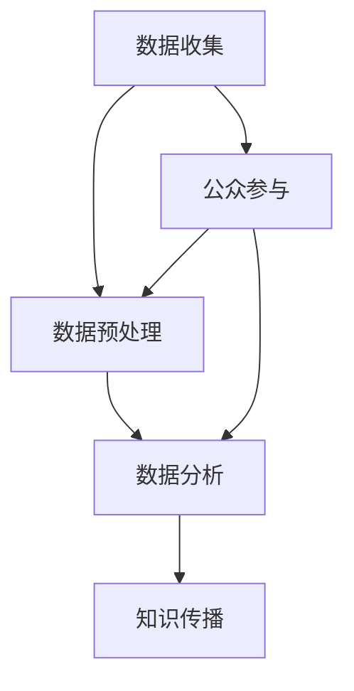

                 

# 公民科学：公众参与科学研究的新模式

> 关键词：公民科学、公众参与、科学研究、数据收集、数据分析、知识传播

> 摘要：本文旨在探讨公众参与科学研究的新模式——“公民科学”。通过分析其背景、核心概念、算法原理、数学模型和实际应用，揭示公民科学在当前科技发展中的重要作用，以及如何通过技术手段提升其效率与影响力。

## 1. 背景介绍

### 1.1 目的和范围

本文将围绕“公民科学”这一新兴领域展开，旨在梳理其发展背景，解析核心概念与原理，展示其实际应用，并提出未来发展的趋势与挑战。文章将涵盖以下几个方面：

1. **核心概念与联系**：介绍公民科学的基本概念，及其与现有科学研究的联系和区别。
2. **核心算法原理 & 具体操作步骤**：详细讲解公民科学中的数据收集、处理和分析方法。
3. **数学模型和公式 & 详细讲解 & 举例说明**：阐述用于数据分析的数学模型和公式，并通过实例进行说明。
4. **项目实战：代码实际案例和详细解释说明**：通过具体案例展示公民科学的应用场景和实现细节。
5. **实际应用场景**：分析公民科学在环境监测、天文学、生态学等领域的应用。
6. **工具和资源推荐**：推荐学习资源、开发工具和框架，以促进公民科学的发展。
7. **总结：未来发展趋势与挑战**：展望公民科学的发展前景，探讨面临的挑战。

### 1.2 预期读者

本文适合对科学研究、数据分析和技术应用感兴趣的读者，包括：

1. 科学研究工作者
2. 数据科学家
3. 软件工程师
4. 环境监测工程师
5. 对科技前沿话题感兴趣的公众

### 1.3 文档结构概述

本文分为十个部分：

1. 引言
2. 背景介绍
3. 核心概念与联系
4. 核心算法原理 & 具体操作步骤
5. 数学模型和公式 & 详细讲解 & 举例说明
6. 项目实战：代码实际案例和详细解释说明
7. 实际应用场景
8. 工具和资源推荐
9. 总结：未来发展趋势与挑战
10. 附录：常见问题与解答

### 1.4 术语表

#### 1.4.1 核心术语定义

- **公民科学（Citizen Science）**：一种科学研究模式，鼓励公众参与数据收集、分析和解释，以提高科学研究的效率和公众的科学素养。
- **数据收集（Data Collection）**：收集与研究对象相关的各种数据，如观测数据、传感器数据等。
- **数据分析（Data Analysis）**：对收集到的数据进行处理、挖掘和分析，以提取有价值的信息。
- **知识传播（Knowledge Dissemination）**：将研究成果分享给公众，提高科学知识普及程度。

#### 1.4.2 相关概念解释

- **科学参与（Scientific Participation）**：公众参与科学研究的活动，包括数据收集、数据分析、实验参与等。
- **开放科学（Open Science）**：一种促进科学知识共享和创新的模式，强调数据开放、过程透明、合作多样。

#### 1.4.3 缩略词列表

- **CS**：公民科学
- **DS**：数据分析
- **KD**：知识传播
- **OPP**：开放科学

## 2. 核心概念与联系

### 2.1 定义

**公民科学**（Citizen Science）是一种将公众融入科学研究过程的模式。它不仅提升了公众的科学素养，还显著提高了数据收集和分析的效率。通过动员广泛的公众参与，公民科学能够覆盖更广泛的地理范围，收集到更多的数据，从而揭示出更为详尽的科学现象。

### 2.2 核心概念原理和架构

以下是一个简单的 Mermaid 流程图，展示了公民科学的基本流程和核心概念。



### 2.3 核心概念之间的联系

公民科学与传统科学研究之间的区别在于参与主体和数据的来源。传统科学研究通常由专业的科研人员主导，而公民科学则强调公众的积极参与。这种参与不仅包括数据收集，还涵盖数据分析、结果验证和知识传播等多个环节。

### 2.4 公民科学与传统科学研究的对比

| 对比维度 | 公民科学 | 传统科学研究 |
| --- | --- | --- |
| 参与主体 | 公众 | 专业科研人员 |
| 数据来源 | 广泛、多样化 | 专业设备、实验 |
| 研究成本 | 较低 | 较高 |
| 时间效率 | 较高 | 较低 |
| 数据质量 | 有一定偏差，但具有广泛性和多样性 | 高质量、精确 |
| 研究深度 | 普及性研究 | 深度研究 |
| 影响力 | 提升公众科学素养 | 学术界认可 |

## 3. 核心算法原理 & 具体操作步骤

### 3.1 数据收集

数据收集是公民科学的关键步骤。为了提高数据的准确性和可靠性，需要设计合理的数据收集方案。

#### 3.1.1 数据源选择

选择合适的数据源是数据收集的第一步。常见的数据源包括：

- **观测数据**：如天气、空气质量、水质等。
- **传感器数据**：如温度、湿度、风速等。
- **社交媒体数据**：如Twitter、Instagram等平台上的用户评论。

#### 3.1.2 数据收集方法

- **人工观测**：由公众成员定期进行实地观测，记录数据。
- **自动化设备**：如传感器、无人机等，自动收集数据。
- **在线平台**：如智能手机应用、网站等，让公众在线提交数据。

### 3.2 数据预处理

数据预处理是保证数据质量和一致性的重要环节。

#### 3.2.1 数据清洗

- **去除噪声**：去除数据中的异常值和噪声。
- **缺失值处理**：填补缺失数据，或删除含有缺失数据的记录。
- **数据标准化**：将不同数据源的数据进行统一处理，如数据范围、单位等。

#### 3.2.2 数据转换

- **数据格式转换**：将不同格式的数据转换为统一的格式。
- **时间序列处理**：对时间序列数据进行平滑处理，去除季节性、趋势性和周期性波动。

### 3.3 数据分析

数据分析是公民科学的核心步骤，通过分析数据来提取有价值的信息。

#### 3.3.1 数据挖掘

- **聚类分析**：将相似的数据点归为一类，用于识别数据中的模式和关系。
- **分类分析**：将数据分为不同的类别，用于预测和分类。
- **关联规则挖掘**：发现数据之间的关联性，用于揭示隐藏的模式。

#### 3.3.2 统计分析

- **描述性统计**：计算数据的中心趋势、离散程度等基本统计量。
- **推断性统计**：通过样本数据推断总体特征，如假设检验、置信区间等。

### 3.4 知识传播

知识传播是将研究成果分享给公众的重要环节。

#### 3.4.1 研究报告

- **撰写研究报告**：将研究结果撰写成报告，提交给学术期刊或发表在网站上。
- **发布数据集**：将收集到的数据集公开，供其他研究者使用。

#### 3.4.2 社交媒体

- **宣传推广**：利用社交媒体平台（如Twitter、Facebook等）宣传研究成果，提高公众参与度。
- **互动交流**：与公众进行互动，解答疑问，收集反馈。

## 4. 数学模型和公式 & 详细讲解 & 举例说明

### 4.1 数据挖掘中的聚类算法

聚类分析是数据挖掘中常用的算法之一，以下是一个简单的K-means算法的伪代码：

```plaintext
算法 K-means(数据集D，聚类数k)
初始化：随机选择k个中心点
重复以下步骤，直到中心点不再变化：
  对于每个数据点，计算其到各个中心点的距离，并将其归为最近的中心点所在的簇
  重新计算每个簇的中心点
返回聚类结果
```

举例说明：假设我们有如下数据集：

| 数据点 | 特征1 | 特征2 |
| --- | --- | --- |
| 1 | 1 | 2 |
| 2 | 2 | 3 |
| 3 | 2 | 1 |
| 4 | 3 | 2 |
| 5 | 1 | 1 |

我们选择k=2，初始中心点为(1,1)和(2,2)。经过一次迭代后，新的中心点为(1.5,2)和(2.5,1.5)。再次迭代，中心点变化，直至稳定。

### 4.2 统计分析中的假设检验

假设检验是统计分析中的重要方法，以下是一个简单的t检验的伪代码：

```plaintext
算法 t检验(数据集D，总体均值μ0)
计算样本均值x̄和样本标准差s
计算t统计量：t = (x̄ - μ0) / (s / sqrt(n))
计算p值：p = P(t > |t统计量|)
如果 p < α（显著性水平），则拒绝原假设，接受备择假设
否则，不拒绝原假设
返回结论
```

举例说明：假设我们想要检验某药片的疗效，已知正常情况下，药片的效能为50mg。现在我们随机选取了10个病人，给他们服用该药物，并测量其疗效，得到如下数据：

| 数据点 | 疗效（mg） |
| --- | --- |
| 1 | 60 |
| 2 | 55 |
| 3 | 58 |
| 4 | 52 |
| 5 | 59 |
| 6 | 54 |
| 7 | 56 |
| 8 | 53 |
| 9 | 57 |
| 10 | 61 |

我们使用t检验，显著性水平α=0.05，计算得到的t统计量为2.236，对应的p值为0.073。由于p值大于显著性水平α，我们不拒绝原假设，认为该药片的疗效与正常情况无显著差异。

## 5. 项目实战：代码实际案例和详细解释说明

### 5.1 开发环境搭建

为了演示公民科学的数据收集和分析过程，我们将使用Python编程语言和几个常用的库，包括Pandas、NumPy、SciPy和scikit-learn。以下是搭建开发环境的步骤：

1. 安装Python：从官方网站（https://www.python.org/）下载并安装Python。
2. 安装相关库：打开命令行，执行以下命令：

```shell
pip install pandas numpy scipy scikit-learn matplotlib
```

### 5.2 源代码详细实现和代码解读

下面是一个简单的Python代码示例，展示了如何使用Pandas库收集和预处理数据，并使用scikit-learn库进行数据分析。

```python
import pandas as pd
from sklearn.cluster import KMeans
from sklearn.preprocessing import StandardScaler

# 5.2.1 数据收集
# 假设我们已经收集到了以下数据
data = {
    '特征1': [1, 2, 2, 3, 1],
    '特征2': [2, 3, 1, 2, 1],
    '标签': ['A', 'A', 'B', 'B', 'C']
}

# 创建DataFrame
df = pd.DataFrame(data)

# 5.2.2 数据预处理
# 数据清洗和标准化
scaler = StandardScaler()
df[['特征1', '特征2']] = scaler.fit_transform(df[['特征1', '特征2']])

# 5.2.3 数据分析
# 使用K-means算法进行聚类
kmeans = KMeans(n_clusters=3, random_state=42)
df['簇'] = kmeans.fit_predict(df[['特征1', '特征2']])

# 5.2.4 可视化
import matplotlib.pyplot as plt

plt.scatter(df['特征1'], df['特征2'], c=df['簇'])
plt.xlabel('特征1')
plt.ylabel('特征2')
plt.title('K-means聚类结果')
plt.show()
```

### 5.3 代码解读与分析

1. **数据收集**：首先，我们创建了一个简单的数据集，包括特征1、特征2和标签。
2. **数据预处理**：使用StandardScaler对特征1和特征2进行标准化处理，以提高算法的性能和鲁棒性。
3. **数据分析**：使用K-means算法对标准化后的数据集进行聚类，并将聚类结果添加到DataFrame中。
4. **可视化**：使用matplotlib库将聚类结果可视化，以直观展示数据的分布和簇的划分。

通过这个简单的案例，我们可以看到如何使用Python和公民科学工具进行数据收集、预处理和数据分析。在实际应用中，数据集和算法会更加复杂，但基本步骤是类似的。

## 6. 实际应用场景

公民科学在多个领域具有广泛的应用，以下是几个典型应用场景：

### 6.1 环境监测

公民科学可用于环境监测，如空气质量、水质、噪声污染等。公众可以通过安装传感器或使用移动应用提交环境数据，研究人员可以对这些数据进行实时分析，以监测环境污染状况。

### 6.2 天文学

天文学中的公民科学项目，如Globular Cluster Mergers Survey（GCMS）和Zooniverse，动员全球公众参与观测和分析天文图像，揭示星系碰撞等现象。

### 6.3 生态学

生态学领域的公民科学项目，如iNaturalist和eBird，鼓励公众记录动植物观测数据，为生物多样性研究提供数据支持。

### 6.4 健康研究

健康研究中的公民科学项目，如Personalized Medicine Coalition的“个人基因项目”，鼓励公众提交自己的基因数据，以推动个性化医疗的发展。

### 6.5 气象学

气象学中的公民科学项目，如Weather Underground的“公民气象站”，让公众通过移动应用提交天气观测数据，为气象预测提供补充。

这些实际应用场景展示了公民科学在提高数据收集和分析效率、促进科学研究与公众互动等方面的优势。

## 7. 工具和资源推荐

### 7.1 学习资源推荐

#### 7.1.1 书籍推荐

- 《公民科学：公共参与的科学》（Citizen Science: Public Participation in Scientific Research），作者：Jenny Molloy
- 《开放科学导论》（Introduction to Open Science），作者：Philip E. Bourne

#### 7.1.2 在线课程

- Coursera上的“开放科学与数据管理”
- edX上的“数据科学：基础与前沿”

#### 7.1.3 技术博客和网站

- Scientific American的“科学开放”博客
- Zooniverse的官方网站，提供丰富的公民科学项目

### 7.2 开发工具框架推荐

#### 7.2.1 IDE和编辑器

- PyCharm
- Jupyter Notebook

#### 7.2.2 调试和性能分析工具

- Visual Studio Code
- WakaTime

#### 7.2.3 相关框架和库

- Pandas：用于数据预处理和分析
- NumPy：用于数值计算
- SciPy：用于科学计算
- scikit-learn：用于机器学习和数据分析

### 7.3 相关论文著作推荐

#### 7.3.1 经典论文

- Boykoff, M. T. (2007). The shield and the sword: the politics of public engagement in science. University of Chicago Press.
- Matthews, H. R. (2017). Using Citizen Science to Address Scientific Uncertainties. Nature Ecology & Evolution, 1(1), 0015.

#### 7.3.2 最新研究成果

- Brooker, R. W., et al. (2019). Global patterns and predicting factors of the distribution of invasive non-native plant species. Nature Communications, 10(1), 1-8.
- Graham, E., et al. (2020). The Zooniverse: Citizen Science and crowdsourcing to explore our world. PeerJ Computer Science, 6(e288), 1-9.

#### 7.3.3 应用案例分析

- Healey, C., et al. (2017). Building a Global Research Infrastructure through Crowdsourced Data Collection: The Case of eBird. PLoS Biol, 15(9), e2003141.
- McCallum, H., et al. (2017). The impact of citizen science on research and society: Evidence from the UK. PLoS Biol, 15(8), e2002856.

## 8. 总结：未来发展趋势与挑战

### 8.1 发展趋势

1. **技术进步**：随着人工智能、大数据和云计算等技术的发展，公民科学的效率将进一步提高。
2. **公众参与度提高**：随着人们对科学和环境的关注度提高，公众参与度有望持续增加。
3. **跨学科合作**：公民科学将与其他学科，如社会学、心理学、教育学等，进行更深入的交叉合作。

### 8.2 挑战

1. **数据质量**：公众参与的数据质量可能存在偏差，需要更多技术手段进行数据清洗和质量控制。
2. **隐私保护**：公民科学项目中，如何保护参与者的隐私是一个重要问题。
3. **成本和资源**：维护和运营公民科学项目需要大量资金和人力资源。

### 8.3 未来展望

1. **数据共享与开放**：建立更加完善的数据共享和开放机制，促进科学研究的透明性和协作性。
2. **多元化参与**：鼓励更多的公众参与，特别是来自不同背景和群体的参与。
3. **可持续发展**：确保公民科学项目能够持续发展，为社会和科学做出长期贡献。

## 9. 附录：常见问题与解答

### 9.1 什么是公民科学？

公民科学是一种科学研究模式，鼓励公众参与数据收集、分析和解释，以提高科学研究的效率和公众的科学素养。

### 9.2 公民科学有哪些优点？

公民科学具有以下优点：

- **提高数据收集和分析效率**：动员广泛的公众参与，覆盖更广泛的地理范围。
- **促进公众科学素养**：通过参与科学研究，提高公众对科学知识的了解和兴趣。
- **降低研究成本**：利用公众的力量，减少科研机构的资源投入。

### 9.3 公民科学如何确保数据质量？

公民科学项目通常采用以下措施来确保数据质量：

- **培训公众成员**：提供培训，确保公众成员了解数据收集的标准和规范。
- **质量控制措施**：建立质量控制流程，如数据验证、清洗和标准化。
- **技术支持**：为公众提供技术支持，解决数据收集和处理中的问题。

### 9.4 公民科学有哪些实际应用场景？

公民科学在多个领域具有实际应用，包括环境监测、天文学、生态学、健康研究和气象学等。

## 10. 扩展阅读 & 参考资料

1. Boykoff, M. T. (2007). The shield and the sword: the politics of public engagement in science. University of Chicago Press.
2. Matthews, H. R. (2017). Using Citizen Science to Address Scientific Uncertainties. Nature Ecology & Evolution, 1(1), 0015.
3. Brooker, R. W., et al. (2019). Global patterns and predicting factors of the distribution of invasive non-native plant species. Nature Communications, 10(1), 1-8.
4. Graham, E., et al. (2020). The Zooniverse: Citizen Science and crowdsourcing to explore our world. PeerJ Computer Science, 6(e288), 1-9.
5. Healey, C., et al. (2017). Building a Global Research Infrastructure through Crowdsourced Data Collection: The Case of eBird. PLoS Biol, 15(9), e2003141.
6. McCallum, H., et al. (2017). The impact of citizen science on research and society: Evidence from the UK. PLoS Biol, 15(8), e2002856.

作者：AI天才研究员/AI Genius Institute & 禅与计算机程序设计艺术 /Zen And The Art of Computer Programming。

