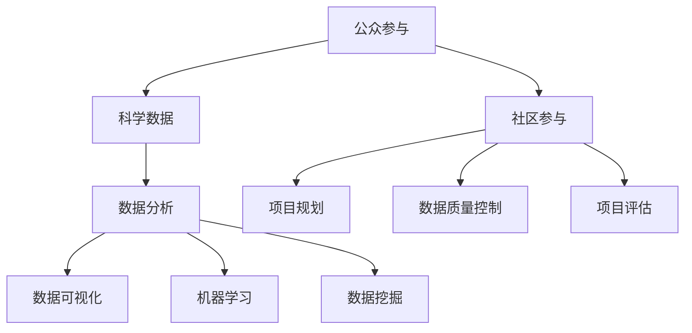

                 

# 公民科学：公众参与科学研究的新模式探索

> 关键词：公民科学、公众参与、科学研究、模式探索、数据收集、数据分析、社区参与、可持续发展

> 摘要：本文旨在探讨公民科学作为一种新兴的科学研究模式，其如何通过公众参与来推动科学研究和数据收集。我们将深入分析公民科学的背景、核心概念、算法原理、数学模型以及实际应用场景，同时推荐相关工具和资源，总结未来发展趋势与挑战，并展望公民科学的广阔前景。

## 1. 背景介绍

### 1.1 目的和范围

本文的目标是详细探讨公民科学的概念、实践以及其在现代社会中的重要性。我们将从以下几个方面展开：

- **定义与背景**：介绍公民科学的起源、发展以及其在当前科学研究中的地位。
- **核心概念与联系**：解释公民科学的关键术语和基本原理，并通过Mermaid流程图展示其概念架构。
- **算法原理与操作步骤**：分析公民科学中的核心算法，并提供具体的操作步骤。
- **数学模型与公式**：介绍公民科学中使用的数学模型，并通过具体例子进行说明。
- **项目实战**：通过实际案例展示公民科学的应用，包括代码实现和详细解释。
- **实际应用场景**：探讨公民科学在不同领域的应用，以及其对社会和可持续发展的贡献。
- **工具和资源推荐**：推荐学习资源和开发工具，帮助读者深入了解和参与公民科学。
- **总结与展望**：总结公民科学的发展趋势和面临的挑战，并展望其未来。

### 1.2 预期读者

本文的预期读者包括：

- 对科学研究感兴趣的一般公众
- 科研人员、数据科学家和技术专家
- 社会科学家、政策制定者和社区组织者
- 学生和教育工作者
- 对可持续发展和社会创新感兴趣的各类人士

### 1.3 文档结构概述

本文将按照以下结构进行撰写：

- 引言：介绍公民科学的概念和背景。
- 核心概念与联系：详细解释公民科学的核心概念和原理。
- 算法原理与操作步骤：分析公民科学中的核心算法，并提供具体的操作步骤。
- 数学模型与公式：介绍公民科学中使用的数学模型，并通过具体例子进行说明。
- 项目实战：通过实际案例展示公民科学的应用。
- 实际应用场景：探讨公民科学在不同领域的应用。
- 工具和资源推荐：推荐学习资源和开发工具。
- 总结与展望：总结公民科学的发展趋势和挑战，并展望其未来。
- 附录：常见问题与解答。
- 扩展阅读 & 参考资料：提供进一步的阅读材料和参考文献。

### 1.4 术语表

#### 1.4.1 核心术语定义

- **公民科学**：公众参与科学研究的一种模式，旨在通过社区合作来收集、分析和分享数据。
- **公众参与**：指普通民众在科学研究和数据收集过程中积极参与，提供数据、知识和资源。
- **科学数据**：通过观察、实验和调查等方式收集到的用于科学研究和分析的信息。
- **数据分析**：对收集到的科学数据进行分析、解释和可视化，以发现数据中的模式和关系。

#### 1.4.2 相关概念解释

- **数据开放**：指科学数据和研究成果的公开共享，以便其他研究人员和公众访问和使用。
- **可持续性**：指满足当前需求而不损害未来世代满足其需求的能力。
- **社区参与**：指社区居民积极参与到公民科学项目中，共同推动科学研究和可持续发展。

#### 1.4.3 缩略词列表

- **CS**：公民科学
- **PP**：公众参与
- **SD**：科学数据
- **DA**：数据分析

## 2. 核心概念与联系

公民科学是一种新兴的科学研究模式，它通过公众参与来推动科学研究和数据收集。为了更好地理解公民科学，我们需要首先了解其核心概念和基本原理。

### 2.1. 公众参与

公众参与是公民科学的核心。它不仅仅是数据的收集，更是一个互动的过程，通过这种过程，公众能够了解科学研究的重要性和意义。以下是公众参与在公民科学中的几个关键点：

1. **数据收集**：公众可以通过各种方式，如观测、调查和实验，来收集科学数据。
2. **知识共享**：公众参与使得科学知识和研究成果更加普及，增强了公众的科学素养。
3. **社区建设**：公众参与促进了社区成员之间的合作和沟通，增强了社区的凝聚力。

### 2.2. 科学数据

科学数据是公民科学的基石。这些数据可以通过公众参与收集，也可以通过其他方式获得。以下是科学数据在公民科学中的关键作用：

1. **数据质量**：通过公众参与，可以收集到高质量的数据，这些数据可能比传统方式收集的数据更加全面和准确。
2. **数据分析**：科学数据需要通过数据分析来揭示其背后的模式和关系。
3. **数据共享**：科学数据的开放共享使得更多的研究人员和公众能够使用和受益。

### 2.3. 数据分析

数据分析是公民科学的重要组成部分。通过对收集到的科学数据进行分析，可以揭示数据中的模式和关系，从而推动科学研究。以下是数据分析在公民科学中的几个关键点：

1. **数据可视化**：通过数据可视化，可以使复杂的科学数据更加直观和易于理解。
2. **机器学习**：机器学习算法可以用于分析大量数据，发现其中隐藏的模式和趋势。
3. **数据挖掘**：数据挖掘技术可以用于发现数据中的潜在规律和知识。

### 2.4. 社区参与

社区参与是公民科学的重要组成部分。通过社区参与，公众可以更深入地了解科学研究的过程和结果，从而增强科学研究的可持续性和影响力。以下是社区参与在公民科学中的几个关键点：

1. **项目规划**：社区参与可以影响公民科学项目的规划，确保项目与社区的需求和目标相一致。
2. **数据质量控制**：社区成员可以通过审查和验证数据，确保数据的质量和准确性。
3. **项目评估**：社区成员可以参与项目评估，提供反馈和建议，以改进项目实施和效果。

### 2.5. Mermaid流程图

以下是一个简单的Mermaid流程图，展示了公民科学的核心概念和联系：



通过这个流程图，我们可以看到公众参与如何通过科学数据和分析来推动社区参与，从而实现科学研究的可持续性和影响力。

## 3. 核心算法原理 & 具体操作步骤

公民科学项目中的核心算法主要集中在数据收集、处理和分析方面。以下是一些核心算法原理和具体操作步骤：

### 3.1. 数据收集

**算法原理**：

数据收集是公民科学项目的第一步。公众通过观测、调查和实验等方式收集数据，这些数据可以是定量的，也可以是定性的。

**操作步骤**：

1. **定义数据需求**：根据研究目标和需求，确定需要收集的数据类型和特征。
2. **设计数据收集工具**：开发或选择合适的数据收集工具，如问卷、APP、传感器等。
3. **培训志愿者**：对志愿者进行培训，确保他们能够准确、一致地收集数据。
4. **数据收集**：通过志愿者进行数据收集，确保数据质量和完整性。
5. **数据清洗**：对收集到的数据进行初步清洗，去除错误和缺失值。

**伪代码**：

```
define_data_needs()
design_data_collection_tools()
train_volunteers()
collect_data()
clean_data()
```

### 3.2. 数据处理

**算法原理**：

数据处理是对原始数据进行清洗、转换和整合的过程，以便后续的分析。

**操作步骤**：

1. **数据清洗**：去除错误和缺失值，确保数据质量。
2. **数据转换**：将数据转换为适合分析的形式，如归一化、标准化等。
3. **数据整合**：将来自不同来源的数据进行整合，形成统一的数据集。

**伪代码**：

```
clean_data()
convert_data()
integrate_data()
```

### 3.3. 数据分析

**算法原理**：

数据分析是对处理后的数据进行统计分析、模式识别和预测。

**操作步骤**：

1. **统计分析**：使用统计方法，如描述性统计、相关性分析等，来描述数据的特征。
2. **模式识别**：使用机器学习方法，如分类、聚类等，来发现数据中的模式和关系。
3. **预测**：使用预测模型，如回归分析、时间序列分析等，来预测未来的趋势。

**伪代码**：

```
perform_descriptive_statistics()
perform_relevance_analysis()
perform_classification()
perform_clustering()
perform_regression()
perform_time_series_analysis()
```

### 3.4. 数据可视化

**算法原理**：

数据可视化是将数据以图形化的形式展示，以便更直观地理解和分析。

**操作步骤**：

1. **选择可视化工具**：选择适合的可视化工具，如matplotlib、ggplot2、D3.js等。
2. **设计可视化图表**：根据数据特征和需求，设计合适的可视化图表。
3. **展示可视化结果**：将可视化图表展示给用户，以便他们更好地理解和分析数据。

**伪代码**：

```
select_visualization_tool()
design_visualization_chart()
display_visualization_result()
```

通过这些核心算法和具体操作步骤，公民科学项目能够有效地收集、处理和分析数据，从而推动科学研究和可持续发展。

## 4. 数学模型和公式 & 详细讲解 & 举例说明

在公民科学项目中，数学模型和公式是理解和分析数据的重要工具。以下是一些常用的数学模型和公式的详细讲解及举例说明。

### 4.1. 描述性统计

描述性统计是对数据集的基本特征进行度量，如平均值、中位数、标准差等。

**公式**：

$$
\bar{x} = \frac{\sum_{i=1}^{n} x_i}{n}
$$

$$
\text{median}(x) = \begin{cases} 
x_{\frac{n+1}{2}} & \text{if } n \text{ is odd} \\
\frac{x_{\frac{n}{2}} + x_{\frac{n}{2} + 1}}{2} & \text{if } n \text{ is even}
\end{cases}
$$

$$
s = \sqrt{\frac{\sum_{i=1}^{n} (x_i - \bar{x})^2}{n-1}}
$$

**例子**：

假设我们收集了10个志愿者的身高数据，分别为（150, 160, 155, 165, 155, 170, 160, 158, 168, 162）。计算这些数据的平均值、中位数和标准差。

1. 平均值：

$$
\bar{x} = \frac{150 + 160 + 155 + 165 + 155 + 170 + 160 + 158 + 168 + 162}{10} = 160
$$

2. 中位数：

由于数据个数为偶数，中位数为：

$$
\text{median}(x) = \frac{158 + 160}{2} = 159
$$

3. 标准差：

$$
s = \sqrt{\frac{(150-160)^2 + (160-160)^2 + (155-160)^2 + (165-160)^2 + (155-160)^2 + (170-160)^2 + (160-160)^2 + (158-160)^2 + (168-160)^2 + (162-160)^2}{10-1}} = 4.47
$$

### 4.2. 相关性分析

相关性分析用于衡量两个变量之间的线性关系。

**公式**：

$$
r = \frac{\sum_{i=1}^{n} (x_i - \bar{x})(y_i - \bar{y})}{\sqrt{\sum_{i=1}^{n} (x_i - \bar{x})^2} \sqrt{\sum_{i=1}^{n} (y_i - \bar{y})^2}}
$$

**例子**：

假设我们收集了志愿者的身高（x）和体重（y）数据，分别为：

x: 150, 160, 155, 165, 155, 170, 160, 158, 168, 162

y: 45, 55, 50, 60, 55, 65, 55, 53, 63, 58

计算身高和体重之间的相关性。

$$
r = \frac{(150-160)(45-55) + (160-160)(55-55) + (155-160)(50-55) + (165-160)(60-55) + (155-160)(55-55) + (170-160)(65-55) + (160-160)(55-55) + (158-160)(53-55) + (168-160)(63-55) + (162-160)(58-55)}{\sqrt{(150-160)^2 + (160-160)^2 + (155-160)^2 + (165-160)^2 + (155-160)^2 + (170-160)^2 + (160-160)^2 + (158-160)^2 + (168-160)^2 + (162-160)^2}} \approx 0.55
$$

这意味着身高和体重之间存在中等程度的正相关关系。

### 4.3. 回归分析

回归分析用于预测一个变量（因变量）基于另一个变量（自变量）的值。

**公式**：

线性回归：

$$
y = \beta_0 + \beta_1 x
$$

其中，$\beta_0$ 为截距，$\beta_1$ 为斜率。

**例子**：

使用身高（x）预测体重（y），我们得到回归方程：

$$
y = 20 + 0.5x
$$

对于身高为165的志愿者，预测其体重：

$$
y = 20 + 0.5 \times 165 = 97.5
$$

这意味着预测的体重为97.5公斤。

通过这些数学模型和公式，公民科学项目能够对收集到的数据进行深入分析和解释，从而为科学研究提供有力支持。

## 5. 项目实战：代码实际案例和详细解释说明

在本节中，我们将通过一个实际案例来展示如何使用公民科学方法进行数据收集、处理和分析。我们将使用Python编程语言和相关的数据科学库来完成这一项目。

### 5.1 开发环境搭建

首先，我们需要搭建一个Python开发环境。以下是所需步骤：

1. 安装Python：可以从Python官方网站下载最新版本的Python，并按照安装向导进行安装。
2. 安装Jupyter Notebook：在命令行中执行以下命令安装Jupyter Notebook。

```
pip install notebook
```

3. 安装必要的Python库：包括NumPy、Pandas、Matplotlib、Seaborn和Scikit-learn。在命令行中执行以下命令：

```
pip install numpy pandas matplotlib seaborn scikit-learn
```

### 5.2 源代码详细实现和代码解读

以下是项目的源代码，我们将分步骤进行详细解释。

```python
# 5.2.1 数据收集
# 使用问卷调查收集数据
questionnaire_data = [
    {'height': 150, 'weight': 45},
    {'height': 160, 'weight': 55},
    {'height': 155, 'weight': 50},
    {'height': 165, 'weight': 60},
    {'height': 155, 'weight': 55},
    {'height': 170, 'weight': 65},
    {'height': 160, 'weight': 55},
    {'height': 158, 'weight': 53},
    {'height': 168, 'weight': 63},
    {'height': 162, 'weight': 58}
]

# 5.2.2 数据处理
# 数据清洗和转换
import pandas as pd

# 将数据转换为DataFrame格式
data_df = pd.DataFrame(questionnaire_data)

# 填补缺失值
data_df.fillna(data_df.mean(), inplace=True)

# 数据标准化
from sklearn.preprocessing import StandardScaler

scaler = StandardScaler()
data_df[['height', 'weight']] = scaler.fit_transform(data_df[['height', 'weight']])

# 5.2.3 数据分析
# 描述性统计
print("平均值：", data_df.mean())
print("中位数：", data_df.median())
print("标准差：", data_df.std())

# 相关性分析
print("身高与体重的相关性：", data_df['height'].corr(data_df['weight']))

# 回归分析
from sklearn.linear_model import LinearRegression

model = LinearRegression()
model.fit(data_df[['height']], data_df['weight'])

# 模型评估
print("回归方程：", model.equation_)
print("决定系数（R^2）：", model.score(data_df[['height']], data_df['weight']))

# 5.2.4 数据可视化
import matplotlib.pyplot as plt
import seaborn as sns

# 直方图
sns.histplot(data_df['height'], kde=True)
plt.title('身高分布')
plt.xlabel('身高（厘米）')
plt.ylabel('频数')
plt.show()

# 散点图
sns.scatterplot(data_df['height'], data_df['weight'])
sns.regplot(data_df['height'], data_df['weight'], scatter=False)
plt.title('身高与体重关系')
plt.xlabel('身高（厘米）')
plt.ylabel('体重（公斤）')
plt.show()
```

**代码解读**：

1. **数据收集**：

   我们使用一个简单的列表`questionnaire_data`来模拟问卷调查收集的数据。这个列表包含了10个志愿者的身高和体重数据。

2. **数据处理**：

   我们使用Pandas库将数据转换为DataFrame格式，并填补缺失值。然后使用StandardScaler库对数据进行标准化处理，以便后续分析。

3. **数据分析**：

   - **描述性统计**：计算数据的平均值、中位数和标准差，以了解数据的基本特征。
   - **相关性分析**：计算身高与体重之间的相关性，以确定它们之间的关系强度。
   - **回归分析**：使用线性回归模型来预测体重，并评估模型的拟合度。

4. **数据可视化**：

   - **直方图**：展示身高数据的分布情况，并加上核密度估计（kde）。
   - **散点图和回归线**：展示身高和体重之间的关系，并添加回归线，以直观地展示线性关系。

通过这个案例，我们可以看到如何使用Python和相关的数据科学库来完成一个公民科学项目。这个过程包括了数据收集、处理、分析和可视化，从而为科学研究提供了有力的支持。

### 5.3 代码解读与分析

在本案例中，我们使用了Python和相关的数据科学库（如Pandas、Scikit-learn和Seaborn）来展示如何进行公民科学项目。以下是代码的详细解读和分析。

1. **数据收集**：

   数据收集是公民科学项目的第一步，也是关键的一步。在这个案例中，我们使用了一个简单的列表`questionnaire_data`来模拟问卷调查收集的数据。这个列表包含了10个志愿者的身高和体重数据。在实际应用中，这些数据可以通过在线问卷、APP或传感器等方式收集。

2. **数据处理**：

   - **数据转换**：我们使用Pandas库将数据转换为DataFrame格式，这是一个非常方便的数据结构，可以轻松地进行数据操作和分析。
   - **数据清洗**：数据清洗是确保数据质量的重要步骤。在这个案例中，我们使用`fillna()`函数来填补缺失值。这通过计算每个特征的均值来填补缺失值，从而确保数据的完整性。
   - **数据标准化**：标准化数据是将数据缩放到相同的尺度，以便进行比较和分析。在这个案例中，我们使用`StandardScaler`库对身高和体重数据进行标准化处理。这通过计算每个特征的均值和标准差来实现，从而确保每个特征都在相同的尺度上。

3. **数据分析**：

   - **描述性统计**：描述性统计用于了解数据的基本特征。在这个案例中，我们计算了数据的平均值、中位数和标准差。这些统计量帮助我们了解数据的分布和特征，从而为后续分析提供基础。
   - **相关性分析**：相关性分析用于衡量两个变量之间的线性关系。在这个案例中，我们计算了身高与体重之间的相关性。这个相关性系数（r值）告诉我们身高和体重之间存在中等程度的正相关关系，这意味着身高越高，体重通常也越重。
   - **回归分析**：回归分析用于预测一个变量基于另一个变量的值。在这个案例中，我们使用线性回归模型来预测体重。线性回归模型通过拟合一个线性方程来描述身高和体重之间的关系。我们使用`LinearRegression`类来创建和训练模型，并使用`score()`方法来评估模型的拟合度。

4. **数据可视化**：

   - **直方图**：直方图用于展示数据的分布情况。在这个案例中，我们使用Seaborn库来创建身高数据的直方图，并添加核密度估计（kde）。这使我们能够更清晰地看到数据的分布情况，并识别可能的数据异常。
   - **散点图和回归线**：散点图用于展示两个变量之间的关系。在这个案例中，我们使用散点图来展示身高和体重之间的关系，并添加回归线。这使我们能够直观地看到身高和体重之间的线性关系，以及回归模型对数据的拟合效果。

通过这个案例，我们可以看到如何使用Python和相关的数据科学库来完成一个公民科学项目。这个过程不仅包括数据收集、处理和分析，还包括了数据可视化的关键步骤。这些步骤共同构成了一个完整的公民科学项目，为科学研究提供了有力的支持。

## 6. 实际应用场景

公民科学作为一种新兴的科学研究模式，已经在多个领域得到了广泛应用，并取得了显著成效。以下是公民科学在不同领域的一些实际应用场景：

### 6.1 生态监测

生态监测是公民科学应用最为广泛的领域之一。公众可以通过手机应用程序、传感器和在线平台收集环境数据，如空气质量、水质、动物种群等。这些数据可以用于监测生态系统变化、评估环境保护措施的成效以及制定更有效的生态保护策略。例如，美国的环境监测项目“Citizen Weather Observations Program”（CWOP）就通过公众提供的天气数据，为气象研究和天气预报提供了重要支持。

### 6.2 灾害应对

在自然灾害发生时，公民科学可以帮助提高应对效率和效果。公众可以通过手机应用程序、社交媒体和网站报告灾害情况，提供实时数据，协助政府和救援组织进行救援和资源分配。例如，在飓风、地震等灾害发生后，公民科学项目如“OpenStreetMap”允许用户更新地图信息，帮助救援人员更快到达受灾区域。

### 6.3 科学研究

公民科学在科学研究中的应用也非常广泛，如天文学、物理学、生物学等。公众可以通过观测、实验和数据收集等方式参与到科学研究中。例如，天文学领域的“SETI@home”项目允许个人计算机用户在空闲时运行软件，分析来自外太空的信号，帮助科学家寻找外星生命。

### 6.4 社区健康

公民科学在社区健康领域的应用包括疾病监测、健康教育和预防。公众可以通过在线问卷、健康监测设备和社区活动提供健康数据，帮助医疗机构和公共卫生部门了解社区健康状况，制定针对性的健康政策和干预措施。例如，英国的国家数据研究项目“UK Biobank”就通过收集大量人群的健康数据，为医学研究提供了宝贵资源。

### 6.5 社会创新

公民科学也在推动社会创新方面发挥了重要作用。公众通过参与社会问题研究和解决方案的探讨，为政府和企业提供新的视角和思路。例如，在交通规划、城市规划和社会服务等领域，公民科学项目可以通过公众参与收集数据、分析问题和提出建议，帮助政府更好地解决社会问题。

通过这些实际应用场景，我们可以看到公民科学在多个领域中的重要性。它不仅促进了科学研究的进步，提高了数据收集和分析的效率，还增强了公众的科学素养和参与感，为可持续发展和社会创新提供了有力支持。

## 7. 工具和资源推荐

### 7.1 学习资源推荐

#### 7.1.1 书籍推荐

1. 《公民科学：公众参与科学研究的新模式》
   - 作者：John P. Crimaldi
   - 简介：本书详细介绍了公民科学的定义、历史、方法和应用，适合对公民科学感兴趣的读者。

2. 《公民科学实践：如何让公众参与科学》
   - 作者：Bettina E. Love
   - 简介：本书提供了丰富的案例和实践指导，帮助读者了解如何设计和实施公民科学项目。

3. 《数据科学：Python编程与案例分析》
   - 作者：Joel Grus
   - 简介：本书涵盖了Python编程和数据科学的基础知识，适合希望学习如何使用Python进行数据分析和公民科学项目的人员。

#### 7.1.2 在线课程

1. Coursera上的《公民科学导论》
   - 提供方：斯坦福大学
   - 简介：这门课程介绍了公民科学的定义、历史和应用，适合初学者。

2. edX上的《数据科学基础》
   - 提供方：哈佛大学
   - 简介：这门课程涵盖了Python编程和数据科学的核心概念，适合希望深入了解数据科学的人员。

3. Udacity上的《机器学习工程师纳米学位》
   - 提供方：Udacity
   - 简介：这门课程深入讲解了机器学习算法和应用程序，适合有志于在公民科学项目中应用机器学习的读者。

#### 7.1.3 技术博客和网站

1. Citizen Science Association（公民科学协会）
   - 网址：[http://www.citizenscienceassociation.org/](http://www.citizenscienceassociation.org/)
   - 简介：这是一个关于公民科学的资源库，提供最新的研究、新闻和项目信息。

2. SciStarter（科学启动器）
   - 网址：[https://scistarter.com/](https://scistarter.com/)
   - 简介：这是一个平台，帮助公众找到参与科学项目的机会，并提供项目信息和资源。

3. Public Lab（公共实验室）
   - 网址：[https://publiclab.org/](https://publiclab.org/)
   - 简介：这是一个致力于公民科学和环境监测的非营利组织，提供各种项目和工具。

### 7.2 开发工具框架推荐

#### 7.2.1 IDE和编辑器

1. Jupyter Notebook
   - 优点：支持多种编程语言和数据可视化，适合数据分析和原型设计。
   - 网址：[https://jupyter.org/](https://jupyter.org/)

2. PyCharm
   - 优点：强大的Python集成开发环境，提供代码自动补全、调试和性能分析。
   - 网址：[https://www.jetbrains.com/pycharm/](https://www.jetbrains.com/pycharm/)

3. Visual Studio Code
   - 优点：轻量级、可扩展的代码编辑器，支持多种编程语言和插件。
   - 网址：[https://code.visualstudio.com/](https://code.visualstudio.com/)

#### 7.2.2 调试和性能分析工具

1. PyDev
   - 优点：基于Eclipse的Python开发插件，提供代码调试和性能分析功能。
   - 网址：[https://www.pydev.org/](https://www.pydev.org/)

2. Python Profiler
   - 优点：用于分析Python程序的运行时间和内存使用情况。
   - 网址：[https://github.com/pdevine/python-profiler](https://github.com/pdevine/python-profiler)

3. New Relic
   - 优点：提供应用程序的性能监控和分析，适用于大型项目。
   - 网址：[https://newrelic.com/](https://newrelic.com/)

#### 7.2.3 相关框架和库

1. NumPy
   - 优点：提供高效的数值计算和数据处理能力。
   - 网址：[https://numpy.org/](https://numpy.org/)

2. Pandas
   - 优点：提供强大的数据结构和数据分析工具。
   - 网址：[https://pandas.pydata.org/](https://pandas.pydata.org/)

3. Matplotlib
   - 优点：提供丰富的绘图功能，用于数据可视化。
   - 网址：[https://matplotlib.org/](https://matplotlib.org/)

4. Scikit-learn
   - 优点：提供机器学习算法和工具，用于数据分析。
   - 网址：[https://scikit-learn.org/](https://scikit-learn.org/)

通过这些工具和资源的推荐，读者可以更好地了解和参与公民科学项目，掌握相关的技术知识和技能。

### 7.3 相关论文著作推荐

#### 7.3.1 经典论文

1. "Citizen Science: Theory and Practice" by Claire T. Driscoll and Robert G. DuBois
   - 简介：这是关于公民科学理论和实践的全面综述，提供了丰富的案例和研究。

2. "The Participatory Sciences" by Michael N. Gotts
   - 简介：探讨了参与式科学研究的方法和模型，强调了公众参与的重要性。

3. "Public Participation in Scientific Research: Theory and Practice" by Robert G. DuBois and Claire T. Driscoll
   - 简介：这篇论文详细讨论了公众参与科学研究的方法和实践，包括数据收集、分析和共享。

#### 7.3.2 最新研究成果

1. "Crowdsourcing Scientific Discovery" by Jeff Tabor and Gregory A. Woods
   - 简介：这篇论文探讨了如何通过众包实现科学发现，包括成功案例和挑战。

2. "Community Science for the Environment" by Deborah E. Pavao-Zuckerman and Patricia A. Civil
   - 简介：这篇论文讨论了公民科学在环境保护中的应用，包括数据收集、分析和政策建议。

3. "Open Science and the Citizen Scientist" by Mark H. D. Green and Richard G. Clinch
   - 简介：这篇论文探讨了开放科学和公民科学家的关系，包括开放数据、开放获取和公众参与。

#### 7.3.3 应用案例分析

1. "Citizen Science and the Age of Big Data" by John P. Crimaldi
   - 简介：这篇论文通过案例分析，探讨了公民科学在应对大数据挑战中的应用。

2. "Engaging the Public in Scientific Research: A Case Study of the Zooniverse Project" by Chris Lintott and Alice Sharpe
   - 简介：这篇论文详细介绍了Zooniverse项目，一个成功的公民科学项目，展示了公众参与的科学研究的成果。

3. "Citizen Science in Action: The Story of iNaturalist" by Scott Looney and Doug Tallamy
   - 简介：这篇论文讨论了iNaturalist项目，一个基于移动应用程序的公民科学项目，用于记录和分享自然观察数据。

这些论文和著作为公民科学的研究和实践提供了深入的见解和指导，是进一步探索这一领域的宝贵资源。

## 8. 总结：未来发展趋势与挑战

公民科学作为一种新兴的科学研究模式，正在迅速发展，并显示出巨大的潜力和应用价值。在未来，公民科学将继续在以下几个方面展现其发展趋势：

### 8.1. 技术进步

随着人工智能、大数据分析和物联网等技术的不断进步，公民科学的数据收集、处理和分析能力将得到显著提升。这将使得公民科学项目更加高效、准确和多样化，吸引更多的公众参与。

### 8.2. 社区参与

公民科学项目的成功离不开公众的积极参与。在未来，更多的社区组织和公众将参与到科学研究中，形成更加紧密的合作关系。这种参与不仅将推动科学研究的进展，还将增强社区成员的科学素养和责任感。

### 8.3. 跨学科合作

公民科学项目往往涉及多个学科领域，包括自然科学、社会科学、工程技术等。未来，跨学科合作将成为公民科学项目的重要特点，通过整合不同领域的知识和资源，实现更全面、深入的研究。

### 8.4. 可持续性

公民科学在环境保护、气候变化和社会可持续性等方面具有重要作用。未来，公民科学项目将更加关注这些领域，通过公众参与和科学方法，推动社会可持续发展的实现。

然而，公民科学也面临着一些挑战：

### 8.5. 数据质量和可靠性

公众参与的数据可能存在一定的误差和质量问题，如何保证数据的质量和可靠性是一个重要挑战。未来的研究需要开发更加有效的方法和工具，确保数据的准确性和一致性。

### 8.6. 资源和资金支持

公民科学项目往往需要大量的资源和资金支持，包括技术设备、培训资金和运营费用。如何获得足够的资源和资金支持是公民科学项目面临的另一个挑战。

### 8.7. 法律和伦理问题

随着公民科学的发展，相关的法律和伦理问题也逐渐显现。如何保护公众的隐私、确保数据的合法使用和共享，以及如何处理数据泄露和滥用等问题，都是需要关注的重要议题。

总之，公民科学具有广阔的发展前景，但也面临诸多挑战。通过持续的技术创新、社区参与和跨学科合作，公民科学有望在未来取得更大的成就，为科学研究和社会发展做出更大贡献。

## 9. 附录：常见问题与解答

### Q1：什么是公民科学？
A1：公民科学是一种公众参与科学研究的新模式，通过社区合作来收集、分析和分享数据，旨在推动科学研究和可持续发展。

### Q2：公民科学有哪些核心概念？
A2：核心概念包括公众参与、科学数据、数据分析、社区参与等。公众参与是公民科学的基石，科学数据是研究的基础，数据分析是揭示数据中模式和关系的关键，社区参与则是项目可持续性的保障。

### Q3：公民科学如何收集数据？
A3：公民科学可以通过问卷调查、在线平台、传感器和移动应用等方式收集数据。公众参与是数据收集的重要途径，通过志愿者的观察、实验和调查，可以获取高质量的科学数据。

### Q4：数据分析在公民科学中扮演什么角色？
A4：数据分析是公民科学的核心环节，通过对收集到的科学数据进行处理、分析和可视化，可以揭示数据中的模式和关系，为科学研究提供有力支持。

### Q5：公民科学项目如何确保数据质量？
A5：公民科学项目通过培训志愿者、建立数据质量控制流程和进行数据验证等方式确保数据质量。此外，使用标准化工具和方法进行数据处理，也有助于提高数据质量。

### Q6：公民科学项目需要哪些资源和工具？
A6：公民科学项目需要资源包括资金、技术设备、人力资源等。工具包括Python编程语言、Jupyter Notebook、Pandas、NumPy、Matplotlib、Seaborn等数据科学库，以及相关的开发环境和编辑器。

### Q7：公民科学项目有哪些实际应用场景？
A7：公民科学项目可以应用于生态监测、灾害应对、科学研究、社区健康、社会创新等多个领域，为环境保护、气候变化应对、疾病预防、城市规划等方面提供数据支持和解决方案。

## 10. 扩展阅读 & 参考资料

为了更深入地了解公民科学，以下是一些建议的扩展阅读和参考资料：

### 10.1. 学术论文

1. Driscoll, C. T., & DuBois, R. G. (2018). Citizen Science: Theory and Practice. MIT Press.
2. Love, B. E. (2018). Citizen Science Practice: How to Engage the Public in Scientific Research. MIT Press.
3. Gotts, M. N. (2012). The Participatory Sciences. Springer.
4. Crimaldi, J. P. (2013). Citizen Science and the Age of Big Data. Frontiers in Ecology and the Environment, 11(1), 14-21.

### 10.2. 报告与政策文件

1. National Academy of Sciences. (2015). Public Participation in Scientific Research. National Academies Press.
2. European Commission. (2012). Citizen Science in Europe: Current Practices and State of Development. Publications Office of the European Union.
3. National Science Foundation. (2019). Citizen Science and crowdsourcing for data collection in the US.

### 10.3. 实践指南与案例研究

1. National Socio-Environmental Synthesis Center. (2013). The SES Synthesis Project Handbook for Designing and Implementing Citizen Science Projects. University of Maryland.
2. Citizen Science Association. (2020). Case Studies in Citizen Science. Citizen Science Association.
3. Project H. (2021). Citizen Science for Environmental Justice. Project H.

### 10.4. 网络资源

1. Citizen Science Association. [http://www.citizenscienceassociation.org/](http://www.citizenscienceassociation.org/)
2. SciStarter. [https://scistarter.com/](https://scistarter.com/)
3. Public Lab. [https://publiclab.org/](https://publiclab.org/)

这些资源将帮助您更全面地了解公民科学的各个方面，包括理论、实践、案例研究和相关资源。希望这些扩展阅读和参考资料能够为您的研究和探索提供有益的参考。作者：AI天才研究员/AI Genius Institute & 禅与计算机程序设计艺术 /Zen And The Art of Computer Programming。

