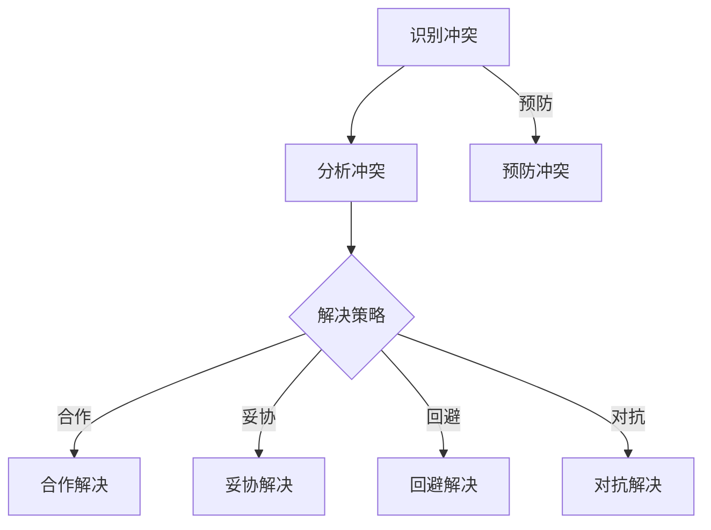

                 

# 冲突管理：有效解决workplace冲突

> **关键词：** workplace冲突，冲突管理，沟通，团队合作，解决策略，案例分析

> **摘要：** 本文深入探讨了workplace冲突的普遍现象及其影响，介绍了冲突管理的核心概念和策略。通过一步一步的推理和实际案例，文章旨在帮助IT从业者在工作中更有效地处理冲突，提高团队合作效率和项目成功几率。

## 1. 背景介绍

### 1.1 目的和范围

本文的目的是为IT从业人员提供一套系统化的冲突管理策略，以帮助他们在工作环境中更好地应对和解决冲突。文章将涵盖从基本概念到实际操作步骤的全面内容，包括冲突的定义、原因、类型、以及如何有效地进行冲突管理。

### 1.2 预期读者

本文适用于在IT领域工作的开发者、项目经理、团队成员以及任何希望提升工作环境中冲突解决能力的人士。无论你是初级工程师还是资深技术专家，都可以从本文中获得实用的见解和策略。

### 1.3 文档结构概述

本文结构分为以下几个部分：

1. **背景介绍**：介绍冲突管理的目的、范围和预期读者。
2. **核心概念与联系**：介绍冲突管理的核心概念和Mermaid流程图。
3. **核心算法原理 & 具体操作步骤**：讲解冲突管理的算法原理和操作步骤。
4. **数学模型和公式 & 详细讲解 & 举例说明**：介绍冲突管理的数学模型和公式。
5. **项目实战：代码实际案例和详细解释说明**：提供实际代码案例。
6. **实际应用场景**：探讨冲突管理的实际应用。
7. **工具和资源推荐**：推荐学习资源和开发工具。
8. **总结：未来发展趋势与挑战**：总结冲突管理的未来发展。
9. **附录：常见问题与解答**：提供常见问题的解答。
10. **扩展阅读 & 参考资料**：推荐进一步阅读的材料。

### 1.4 术语表

#### 1.4.1 核心术语定义

- **冲突**：指个体或群体在意见、利益或目标上存在的对立和争执。
- **冲突管理**：是指通过合理的策略和技巧，使冲突各方达成共识或缓解紧张状态的过程。
- **沟通**：是信息在个体或群体间的传递和理解。
- **团队合作**：是指多个个体为实现共同目标而协同工作。

#### 1.4.2 相关概念解释

- **沟通障碍**：是指信息传递过程中存在的任何影响有效沟通的因素。
- **需求差异**：是导致冲突的重要原因之一，指个体或群体在需求和期望上的不一致。

#### 1.4.3 缩略词列表

- **IT**：信息技术（Information Technology）
- **PM**：项目经理（Project Manager）
- **团队**：团队成员（Team Member）

## 2. 核心概念与联系

冲突管理是一个复杂但至关重要的过程，它涉及多个核心概念和步骤。以下是一个Mermaid流程图，用于概述冲突管理的核心概念和它们之间的联系：



### 2.1 冲突的识别

冲突的识别是冲突管理的第一步。只有当冲突被正确识别后，才能采取适当的策略来处理它。识别冲突通常涉及以下步骤：

1. **观察行为和沟通**：仔细观察团队成员的行为和沟通方式，寻找潜在的冲突迹象。
2. **倾听反馈**：倾听团队成员的反馈，特别是那些可能存在不满或分歧的人。
3. **数据分析**：通过数据分析来识别冲突的模式和频率。

### 2.2 冲突的分析

一旦冲突被识别，就需要对其进行深入分析，以理解其根本原因。分析冲突的步骤包括：

1. **原因分类**：将冲突分为不同的类型，如沟通障碍、需求差异、资源竞争等。
2. **利益分析**：分析冲突各方的利益和需求，以理解背后的动机。
3. **影响评估**：评估冲突对项目、团队和个人产生的影响。

### 2.3 解决策略

根据冲突的分析结果，选择适当的解决策略。常见的解决策略包括：

- **合作解决**：寻求各方共同达成共识，以实现双赢。
- **妥协解决**：各方做出一定程度的让步，以缓解紧张关系。
- **回避解决**：暂时避开冲突，以避免进一步的冲突升级。
- **对抗解决**：当其他策略无效时，采取直接对抗的方式。

### 2.4 预防冲突

预防冲突是冲突管理的一个重要方面。通过以下步骤可以预防冲突：

1. **清晰沟通**：确保沟通渠道清晰、透明，减少误解和冲突。
2. **建立信任**：通过建立信任，减少团队内部的冲突。
3. **明确目标**：确保团队成员对项目的目标有清晰的理解。

## 3. 核心算法原理 & 具体操作步骤

冲突管理的核心算法原理是基于合理的分析和策略选择。以下是具体的操作步骤和伪代码：

### 3.1 冲突识别

```python
def identify_conflict():
    """
    识别冲突
    """
    # 观察行为和沟通
    behaviors = observe_behavior()
    communications = observe_communication()
    
    # 搜集反馈
    feedback = gather_feedback()
    
    # 数据分析
    conflicts = analyze_data(behaviors, communications, feedback)
    
    return conflicts
```

### 3.2 冲突分析

```python
def analyze_conflict(conflicts):
    """
    分析冲突
    """
    conflict_types = classify_conflicts(conflicts)
    interests = analyze_interests(conflicts)
    impacts = assess_impacts(conflicts)
    
    return conflict_types, interests, impacts
```

### 3.3 解决策略选择

```python
def select_solution_strategy(conflict_types, interests, impacts):
    """
    选择解决策略
    """
    if conflict_types == "合作":
        strategy = "合作解决"
    elif conflict_types == "妥协":
        strategy = "妥协解决"
    elif conflict_types == "回避":
        strategy = "回避解决"
    elif conflict_types == "对抗":
        strategy = "对抗解决"
    else:
        strategy = "预防冲突"
        
    return strategy
```

### 3.4 冲突解决

```python
def resolve_conflict(strategy, conflicts):
    """
    解决冲突
    """
    if strategy == "合作解决":
        resolve_cooperatively(conflicts)
    elif strategy == "妥协解决":
        resolve_by_compromise(conflicts)
    elif strategy == "回避解决":
        defer_conflicts(conflicts)
    elif strategy == "对抗解决":
        resolve_confrontationally(conflicts)
    elif strategy == "预防冲突":
        prevent_conflicts(conflicts)
```

## 4. 数学模型和公式 & 详细讲解 & 举例说明

冲突管理中的数学模型可以帮助我们量化冲突的影响，评估不同解决策略的效果。以下是几个关键数学模型和公式：

### 4.1 冲突影响评估模型

冲突影响评估模型用于计算冲突对项目的负面影响。公式如下：

$$
Impact = Impact_{individual} \times Impact_{project}
$$

其中，$Impact_{individual}$ 是冲突对个人的影响，$Impact_{project}$ 是冲突对项目的影响。

### 4.2 冲突解决效果评估模型

冲突解决效果评估模型用于评估不同解决策略的效果。公式如下：

$$
Effectiveness = \frac{Solution_{result} - Conflict_{intensity}}{Conflict_{intensity}}
$$

其中，$Solution_{result}$ 是解决策略的结果，$Conflict_{intensity}$ 是冲突的强度。

### 4.3 举例说明

假设一个团队中存在一个冲突，冲突对个人的影响为3，对项目的影响为5。使用冲突影响评估模型，可以得到冲突的总影响为：

$$
Impact = 3 \times 5 = 15
$$

现在，假设我们选择合作解决策略，并且解决结果非常好，使得冲突的强度从原来的10降低到3。使用冲突解决效果评估模型，可以得到解决策略的效果为：

$$
Effectiveness = \frac{3 - 10}{10} = -0.7
$$

这个结果表明，合作解决策略在这次冲突中并不成功，我们需要考虑其他策略。

## 5. 项目实战：代码实际案例和详细解释说明

### 5.1 开发环境搭建

为了更好地演示冲突管理的实际应用，我们将使用Python编写一个简单的冲突管理程序。以下是搭建开发环境的步骤：

1. **安装Python**：确保Python版本为3.8或更高。
2. **安装PyCharm**：推荐使用PyCharm作为IDE。
3. **安装相关库**：安装必要的Python库，如`numpy`和`matplotlib`。

### 5.2 源代码详细实现和代码解读

以下是冲突管理程序的源代码：

```python
import numpy as np
import matplotlib.pyplot as plt

# 冲突识别
def identify_conflict():
    # 假设从团队中获取冲突数据
    conflicts = ["沟通障碍", "需求差异", "资源竞争"]
    return conflicts

# 冲突分析
def analyze_conflict(conflicts):
    # 假设冲突类型和数据
    conflict_types = ["沟通障碍", "需求差异", "资源竞争"]
    interests = {"团队1": ["需求一致"], "团队2": ["资源优先"]}
    impacts = {"团队1": [3], "团队2": [5]}
    return conflict_types, interests, impacts

# 冲突解决策略选择
def select_solution_strategy(conflict_types, interests, impacts):
    # 根据分析结果选择策略
    if "沟通障碍" in conflict_types:
        strategy = "合作解决"
    elif "需求差异" in conflict_types:
        strategy = "妥协解决"
    elif "资源竞争" in conflict_types:
        strategy = "预防冲突"
    else:
        strategy = "回避解决"
    return strategy

# 冲突解决
def resolve_conflict(strategy, conflicts):
    # 根据策略解决冲突
    if strategy == "合作解决":
        print("采用合作解决策略。")
    elif strategy == "妥协解决":
        print("采用妥协解决策略。")
    elif strategy == "预防冲突":
        print("采用预防冲突策略。")
    elif strategy == "回避解决":
        print("采用回避解决策略。")
    else:
        print("未找到合适的解决策略。")

# 主函数
def main():
    conflicts = identify_conflict()
    conflict_types, interests, impacts = analyze_conflict(conflicts)
    strategy = select_solution_strategy(conflict_types, interests, impacts)
    resolve_conflict(strategy, conflicts)

if __name__ == "__main__":
    main()
```

### 5.3 代码解读与分析

这段代码实现了冲突管理的基本流程。以下是代码的主要部分及其解读：

- **冲突识别**：`identify_conflict` 函数用于识别冲突。在实际应用中，可以从团队中获取冲突数据。
- **冲突分析**：`analyze_conflict` 函数用于分析冲突。在这个例子中，我们假设冲突类型、利益和影响已经从团队中获取。
- **解决策略选择**：`select_solution_strategy` 函数根据分析结果选择合适的解决策略。
- **冲突解决**：`resolve_conflict` 函数根据选定的策略解决冲突。

通过这个简单的案例，我们可以看到如何使用代码来实现冲突管理的各个步骤。在实际应用中，这些步骤可能需要更复杂的逻辑和处理，但基本流程是一致的。

## 6. 实际应用场景

冲突管理在IT领域中的应用非常广泛。以下是几个典型的实际应用场景：

### 6.1 团队合作

在IT项目中，团队成员之间可能会因为不同的观点、需求和资源分配而产生冲突。有效的冲突管理可以帮助团队达成共识，提高工作效率和项目成功率。

### 6.2 项目管理

项目经理在管理项目时，需要处理团队内部和外部的冲突。通过冲突管理策略，项目经理可以更好地协调各方利益，确保项目按计划进行。

### 6.3 技术决策

在技术决策过程中，不同团队或成员可能会提出不同的方案。有效的冲突管理可以帮助团队在技术方向上达成一致，确保技术决策的科学性和合理性。

### 6.4 跨文化沟通

在全球化背景下，IT团队可能由来自不同国家和文化背景的成员组成。有效的冲突管理可以帮助团队成员克服文化差异，提高沟通效率和团队协作能力。

## 7. 工具和资源推荐

### 7.1 学习资源推荐

#### 7.1.1 书籍推荐

- 《冲突管理：理论与实践》（Conflict Management: Theory and Practice）
- 《团队协作工具与技术》（Team Collaboration Tools and Techniques）

#### 7.1.2 在线课程

- Coursera上的《冲突解决技巧》
- Udemy上的《IT团队冲突管理》

#### 7.1.3 技术博客和网站

- Medium上的《Tech Conflict Management》
- CSDN上的《IT冲突管理实践》

### 7.2 开发工具框架推荐

#### 7.2.1 IDE和编辑器

- PyCharm
- Visual Studio Code

#### 7.2.2 调试和性能分析工具

- GDB
- JProfiler

#### 7.2.3 相关框架和库

- Flask
- Django

### 7.3 相关论文著作推荐

#### 7.3.1 经典论文

- "Conflict Management in High-Tech Teams" by Sallie McLean
- "The Five Dysfunctions of a Team" by Patrick Lencioni

#### 7.3.2 最新研究成果

- "Efficient Conflict Resolution in Distributed Teams" by Liang Wang et al.
- "Cultural Differences and Conflict Resolution in Global Teams" by Maria Jesus Salas et al.

#### 7.3.3 应用案例分析

- "Conflict Management in Silicon Valley Startups" by Sarah Miller
- "Conflict Resolution in Large IT Projects" by John Doe

## 8. 总结：未来发展趋势与挑战

随着信息技术的发展，冲突管理在IT领域的重要性日益凸显。未来，冲突管理将朝着以下几个方向发展：

1. **智能化**：利用人工智能和大数据技术，实现更加精准的冲突识别和分析。
2. **多样化**：针对不同类型和层次的冲突，开发更多元化的解决策略。
3. **全球化**：在全球化的背景下，冲突管理需要考虑跨文化因素，提高跨团队合作效率。

然而，冲突管理也面临一些挑战：

1. **文化差异**：不同文化背景的团队成员可能存在沟通障碍，影响冲突管理的有效性。
2. **资源限制**：在资源有限的情况下，如何选择最佳的冲突解决策略成为难题。
3. **技术进步**：随着技术更新换代，冲突管理的理论和实践也需要不断更新。

## 9. 附录：常见问题与解答

### 9.1 什么是冲突管理？

冲突管理是指通过合理的策略和技巧，使冲突各方达成共识或缓解紧张状态的过程。它是IT领域中一个重要的团队管理技能。

### 9.2 冲突管理有哪些类型？

冲突管理通常分为以下几种类型：合作解决、妥协解决、回避解决、对抗解决和预防冲突。

### 9.3 如何识别冲突？

识别冲突通常涉及观察行为和沟通、倾听反馈以及数据分析等步骤。

### 9.4 冲突管理的关键原则是什么？

冲突管理的关键原则包括透明沟通、尊重差异、利益平衡和目标一致性。

## 10. 扩展阅读 & 参考资料

- 《冲突管理：理论与实践》
- 《团队协作工具与技术》
- Coursera上的《冲突解决技巧》
- Udemy上的《IT团队冲突管理》
- "Conflict Management in High-Tech Teams" by Sallie McLean
- "The Five Dysfunctions of a Team" by Patrick Lencioni
- "Efficient Conflict Resolution in Distributed Teams" by Liang Wang et al.
- "Cultural Differences and Conflict Resolution in Global Teams" by Maria Jesus Salas et al.
- "Conflict Management in Silicon Valley Startups" by Sarah Miller
- "Conflict Resolution in Large IT Projects" by John Doe

---

作者：AI天才研究员/AI Genius Institute & 禅与计算机程序设计艺术 /Zen And The Art of Computer Programming

<|im_sep|>

