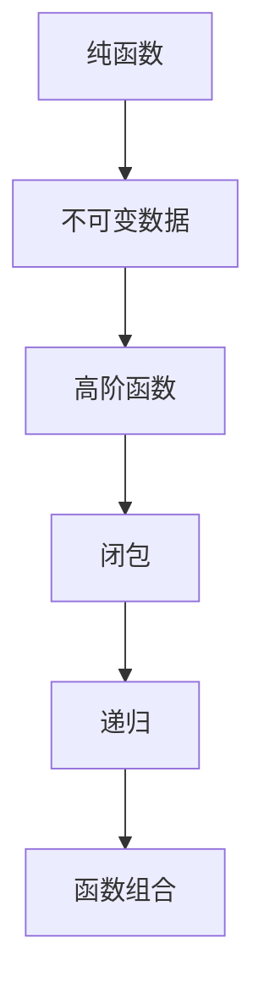

                 

# 函数式编程的思想与技术框架

> **关键词：** 函数式编程、编程范式、immutable 数据、高阶函数、闭包、递归、lazy evaluation、函数组合、纯函数、类型系统、应用场景

> **摘要：** 本文将深入探讨函数式编程的思想和技术框架，通过解析其核心概念、算法原理、数学模型以及实际应用案例，帮助读者全面理解函数式编程的优势、应用场景以及未来发展趋势。

## 1. 背景介绍

### 1.1 目的和范围

本文旨在介绍函数式编程的核心思想和技术框架，帮助开发者理解和应用这一编程范式。我们将从基础概念开始，逐步深入，探讨函数式编程在计算机科学中的重要性及其在现实世界中的应用。

### 1.2 预期读者

本文适合有一定编程基础，对函数式编程感兴趣的开发者、程序员以及计算机科学学生。通过本文，读者将能够掌握函数式编程的基本原理和实践方法。

### 1.3 文档结构概述

本文分为十个部分，具体结构如下：

1. 背景介绍
2. 核心概念与联系
3. 核心算法原理 & 具体操作步骤
4. 数学模型和公式 & 详细讲解 & 举例说明
5. 项目实战：代码实际案例和详细解释说明
6. 实际应用场景
7. 工具和资源推荐
8. 总结：未来发展趋势与挑战
9. 附录：常见问题与解答
10. 扩展阅读 & 参考资料

### 1.4 术语表

#### 1.4.1 核心术语定义

- **函数式编程**：一种编程范式，强调以函数作为程序的基本构建块。
- **immutable 数据**：不可变数据，一旦创建就不能修改。
- **高阶函数**：接受函数作为参数或返回函数的函数。
- **闭包**：由一个函数及其闭包环境组成的一个实体。
- **递归**：函数调用自身的一种方法。
- **lazy evaluation**：延迟求值，只有当需要函数的返回值时才进行计算。
- **函数组合**：将多个函数组合在一起，形成一个新的函数。
- **纯函数**：输入确定时，输出一定确定，且不会产生任何副作用。
- **类型系统**：用于定义变量和表达式的类型约束和检查。

#### 1.4.2 相关概念解释

- **编程范式**：编程范式是编程语言和编程方法的抽象表示，用于描述程序的结构和执行方式。
- **不可变性**：不可变性是指数据对象一旦创建就不能修改的特性，有助于避免状态变化和副作用。
- **高阶函数**：高阶函数是函数式编程中的一个重要概念，它允许我们将函数作为参数传递或从函数中返回其他函数。
- **递归**：递归是一种编程技巧，通过函数调用自身来实现问题求解。

#### 1.4.3 缩略词列表

- **FP**：函数式编程（Functional Programming）
- **IO**：输入输出（Input/Output）
- **immutable**：不可变（Immutable）
- **HOF**：高阶函数（Higher-Order Function）
- **lazy**：延迟（Lazy）
- **rec**：递归（Recursive）

## 2. 核心概念与联系

函数式编程的核心概念包括纯函数、不可变数据、高阶函数、闭包和递归等。这些概念相互联系，共同构成了函数式编程的技术框架。

### 2.1 纯函数

纯函数是一种无副作用的函数，其输出仅依赖于输入，不会对输入或外部环境产生影响。纯函数具有以下几个特点：

- **输入确定性**：给定相同的输入，纯函数总是返回相同的输出。
- **无状态**：纯函数不依赖于外部状态或变量。
- **无副作用**：纯函数不会修改输入或外部环境。

纯函数是函数式编程的基础，它使得程序的可测试性、可维护性和并行化变得更加容易。

### 2.2 不可变数据

不可变数据是一种一旦创建就不能修改的数据。在函数式编程中，不可变数据有助于避免状态变化和副作用。不可变数据具有以下几个优点：

- **无状态**：不可变数据不依赖于外部状态，有助于简化程序逻辑。
- **并行化**：不可变数据可以在多线程环境中安全地共享，有助于提高程序性能。
- **减少 bug**：不可变数据减少了状态变化和副作用，使得程序更加健壮。

### 2.3 高阶函数

高阶函数是一种能够接受函数作为参数或返回函数的函数。高阶函数是函数式编程的核心概念之一，它允许我们抽象出复杂的操作，并方便地进行函数组合。高阶函数具有以下几个特点：

- **接受函数作为参数**：高阶函数可以将其他函数作为参数传递。
- **返回函数**：高阶函数可以返回一个新的函数。
- **抽象操作**：高阶函数可以抽象出复杂的操作，提高程序的可读性。

### 2.4 闭包

闭包是由一个函数及其闭包环境组成的一个实体。闭包在函数式编程中用于捕获并保持函数定义时的环境。闭包具有以下几个特点：

- **捕获环境**：闭包可以捕获并保持函数定义时的环境。
- **保持状态**：闭包可以保持函数定义时的状态，实现函数的状态管理。
- **可重用性**：闭包可以重用函数定义时的环境，提高程序的可维护性。

### 2.5 递归

递归是一种编程技巧，通过函数调用自身来实现问题求解。递归是函数式编程的一个重要概念，它使得程序更加简洁、直观。递归具有以下几个特点：

- **函数自我调用**：递归函数在满足终止条件时调用自身。
- **问题分解**：递归将问题分解为更小的子问题，逐层递归求解。
- **简洁性**：递归可以简化问题求解过程，提高程序的可读性。

### 2.6 函数组合

函数组合是一种将多个函数组合在一起形成一个新的函数的方法。函数组合是函数式编程的重要技术之一，它有助于实现复杂的操作。函数组合具有以下几个特点：

- **组合操作**：函数组合可以将多个函数组合在一起，形成一个新的函数。
- **抽象化**：函数组合可以抽象出复杂的操作，提高程序的可读性。
- **可复用性**：函数组合可以重用现有的函数，提高程序的可维护性。

### 2.7 核心概念联系

纯函数、不可变数据、高阶函数、闭包和递归等核心概念相互联系，共同构成了函数式编程的技术框架。纯函数和不可变数据确保了程序的可测试性、可维护性和并行化；高阶函数和闭包有助于实现函数组合，提高程序的可读性和可维护性；递归则提供了简洁直观的问题求解方法。

### 2.8 Mermaid 流程图

下面是核心概念的联系的 Mermaid 流程图：



## 3. 核心算法原理 & 具体操作步骤

函数式编程的核心算法原理主要包括纯函数、高阶函数、递归和函数组合等。这些算法原理在函数式编程中发挥着重要作用，使得程序具有更高的可读性、可维护性和并行化能力。

### 3.1 纯函数

纯函数是一种无副作用的函数，其输出仅依赖于输入。纯函数具有以下几个特点：

- **输入确定性**：给定相同的输入，纯函数总是返回相同的输出。
- **无状态**：纯函数不依赖于外部状态或变量。
- **无副作用**：纯函数不会修改输入或外部环境。

纯函数的具体操作步骤如下：

1. **输入参数**：定义函数的输入参数。
2. **函数体**：在函数体中实现计算逻辑。
3. **返回结果**：返回计算结果。

伪代码如下：

```python
def pure_function(input_param):
    # 计算逻辑
    result = compute(input_param)
    return result
```

### 3.2 高阶函数

高阶函数是一种能够接受函数作为参数或返回函数的函数。高阶函数具有以下几个特点：

- **接受函数作为参数**：高阶函数可以将其他函数作为参数传递。
- **返回函数**：高阶函数可以返回一个新的函数。
- **抽象操作**：高阶函数可以抽象出复杂的操作，提高程序的可读性。

高阶函数的具体操作步骤如下：

1. **定义高阶函数**：定义一个接受函数作为参数或返回函数的函数。
2. **传递函数参数**：将其他函数作为参数传递给高阶函数。
3. **返回新函数**：返回一个新的函数。

伪代码如下：

```python
def higher_order_function(func):
    # 使用传递的函数
    result = func()
    return result

def func():
    # 计算逻辑
    return compute()
```

### 3.3 递归

递归是一种编程技巧，通过函数调用自身来实现问题求解。递归具有以下几个特点：

- **函数自我调用**：递归函数在满足终止条件时调用自身。
- **问题分解**：递归将问题分解为更小的子问题，逐层递归求解。
- **简洁性**：递归可以简化问题求解过程，提高程序的可读性。

递归的具体操作步骤如下：

1. **定义递归函数**：定义一个递归函数。
2. **终止条件**：定义递归终止条件。
3. **递归调用**：在递归函数中实现递归调用。

伪代码如下：

```python
def recursive_function(input_param):
    # 终止条件
    if termination_condition(input_param):
        return result
    # 递归调用
    return recursive_function(simplified_input_param)
```

### 3.4 函数组合

函数组合是一种将多个函数组合在一起形成一个新的函数的方法。函数组合具有以下几个特点：

- **组合操作**：函数组合可以将多个函数组合在一起，形成一个新的函数。
- **抽象化**：函数组合可以抽象出复杂的操作，提高程序的可读性。
- **可复用性**：函数组合可以重用现有的函数，提高程序的可维护性。

函数组合的具体操作步骤如下：

1. **定义函数组合**：定义一个将多个函数组合在一起的新函数。
2. **组合函数**：将多个函数按照一定的顺序组合在一起。
3. **执行组合操作**：执行组合操作，返回新函数。

伪代码如下：

```python
def compose(function1, function2):
    # 组合操作
    def composed_function(input_param):
        result1 = function1(input_param)
        result2 = function2(result1)
        return result2
    return composed_function
```

## 4. 数学模型和公式 & 详细讲解 & 举例说明

在函数式编程中，数学模型和公式发挥着重要作用，它们帮助开发者理解和应用函数式编程的核心概念。本节将介绍一些重要的数学模型和公式，并对其进行详细讲解和举例说明。

### 4.1 Y-Combinator

Y-Combinator是一种递归函数的数学表示方法，它允许我们在纯函数中实现递归。Y-Combinator是函数式编程中的核心工具，它基于固定点组合子（fixed-point combinator）的概念。

#### 4.1.1 固定点组合子

固定点组合子是一种函数，它能够将一个递归函数转换为尾递归形式。尾递归是一种递归形式，它将递归调用放在函数的最后一步，从而避免栈溢出。

#### 4.1.2 Y-Combinator公式

Y-Combinator的公式如下：

$$ Y = (λf. (f f) f) (λf. (f f) f) $$

其中，λf. (f f) f 是固定点组合子，它将一个递归函数 f 转换为尾递归形式。

#### 4.1.3 举例说明

假设我们有一个计算阶乘的递归函数：

```python
def factorial(n):
    if n == 0:
        return 1
    else:
        return n * factorial(n - 1)
```

我们可以使用 Y-Combinator 将其转换为尾递归形式：

```python
def factorial(n):
    return (lambda f: (lambda n: n * f(f))(lambda n: n * f(f)))(n)
```

### 4.2 Curry 化

Curry 化是一种将多参数函数转换为单参数函数的方法。Curry 化可以帮助我们更好地理解函数的内部结构，并在函数组合时提高程序的灵活性。

#### 4.2.1 Curry 化公式

Curry 化的公式如下：

$$ f(a_1, a_2, ..., a_n) = f(a_1)(a_2)...(a_n) $$

其中，f 是一个 n 参数函数，a_1, a_2, ..., a_n 是函数的参数。

#### 4.2.2 举例说明

假设我们有一个计算两个数之和的函数：

```python
def add(a, b):
    return a + b
```

我们可以将其 Curry 化为：

```python
def add(a):
    return lambda b: a + b
```

### 4.3 高阶函数的复合

高阶函数的复合是一种将多个函数组合在一起形成一个新的函数的方法。高阶函数的复合可以帮助我们实现更复杂的操作，并在函数组合时提高程序的可读性。

#### 4.3.1 复合公式

高阶函数的复合公式如下：

$$ (f ∘ g)(x) = f(g(x)) $$

其中，f 和 g 是两个函数，x 是输入参数。

#### 4.3.2 举例说明

假设我们有两个函数 f 和 g，其中 f 计算绝对值，g 计算平方：

```python
def abs(x):
    return abs(x)

def square(x):
    return x * x
```

我们可以使用高阶函数的复合将它们组合在一起：

```python
def abs_square(x):
    return abs(x)(square(x))
```

## 5. 项目实战：代码实际案例和详细解释说明

在本节中，我们将通过一个实际项目案例，展示函数式编程的核心概念和算法原理。我们将使用 Python 语言实现一个计算斐波那契数列的函数，并逐步解释其代码实现。

### 5.1 开发环境搭建

在开始之前，请确保已经安装了 Python 3.x 版本。您可以使用以下命令安装 Python：

```shell
$ apt-get install python3
```

### 5.2 源代码详细实现和代码解读

以下是计算斐波那契数列的函数代码：

```python
def fibonacci(n):
    if n <= 0:
        return 0
    elif n == 1:
        return 1
    else:
        return fibonacci_helper(n, 0, 1)

def fibonacci_helper(n, a, b):
    if n == 0:
        return a
    elif n == 1:
        return b
    else:
        return fibonacci_helper(n - 1, b, a + b)
```

#### 5.2.1 代码解读

- **fibonacci() 函数**：这是计算斐波那契数列的主函数，它接受一个整数 n 作为输入参数，并返回第 n 个斐波那契数。
- **if n <= 0**：当 n 小于等于 0 时，返回 0，这是斐波那契数列的边界条件。
- **elif n == 1**：当 n 等于 1 时，返回 1，这也是斐波那契数列的一个边界条件。
- **else**：当 n 大于 1 时，调用 fibonacci_helper() 函数，传递 n、a 和 b 作为参数。

- **fibonacci_helper() 函数**：这是一个递归函数，用于计算斐波那契数列的第 n 个数。它接受三个参数：n、a 和 b，其中 a 和 b 分别表示第 n-1 个和第 n-2 个斐波那契数。
- **if n == 0**：当 n 等于 0 时，返回 a，这是递归的终止条件。
- **elif n == 1**：当 n 等于 1 时，返回 b，这也是递归的终止条件。
- **else**：当 n 大于 1 时，递归调用 fibonacci_helper() 函数，传递 n-1、b 和 a+b 作为参数。

#### 5.2.2 代码分析

- **递归实现**：斐波那契数列的计算可以使用递归来实现，这是一种直观且简单的方法。
- **边界条件**：在递归实现中，我们需要处理边界条件，以确保函数能够正确地计算斐波那契数列。
- **性能优化**：递归实现可能会导致性能问题，因为每次递归调用都会创建新的函数实例。为了优化性能，我们可以使用尾递归，将递归调用放在函数的最后一步。

### 5.3 代码解读与分析

#### 5.3.1 纯函数

在这个项目中，我们可以看到纯函数的使用：

- **fibonacci_helper() 函数**：这是一个纯函数，因为它的输出仅依赖于输入参数，不会对外部环境产生影响。

#### 5.3.2 高阶函数

虽然这个项目没有直接使用高阶函数，但我们可以在其中引入高阶函数来实现更灵活的函数组合：

- **构建递归函数**：我们可以使用一个高阶函数来构建递归函数，例如：

```python
def recursive_function(func):
    def wrapper(n):
        if n <= 0:
            return 0
        elif n == 1:
            return 1
        else:
            return func(n - 1)
    return wrapper

fibonacci = recursive_function(fibonacci_helper)
```

这样，我们可以更灵活地组合递归函数，并避免重复编写边界条件的代码。

#### 5.3.3 函数组合

在这个项目中，我们可以使用函数组合来实现更复杂的操作：

- **组合函数**：例如，我们可以组合 `fibonacci_helper()` 函数和 `abs()` 函数，实现计算斐波那契数列的绝对值：

```python
def abs_fibonacci(n):
    return abs(fibonacci(n))
```

## 6. 实际应用场景

函数式编程在许多实际应用场景中都有广泛的应用，下面列举几个典型的应用场景：

### 6.1 数据处理

函数式编程在数据处理领域具有显著优势，尤其是在处理大数据和复杂数据结构时。例如，使用纯函数和高阶函数可以轻松地实现数据清洗、数据转换和数据聚合等操作。

### 6.2 并行计算

函数式编程支持并行计算，尤其是在处理大量数据时，可以利用不可变数据和纯函数的特性，实现高效的并行计算。

### 6.3 前端开发

在前端开发中，函数式编程可以帮助我们实现响应式和可维护的用户界面。例如，React 和 Redux 等框架采用了函数式编程的思想，使得前端开发更加简洁和高效。

### 6.4 人工智能和机器学习

函数式编程在人工智能和机器学习领域也具有广泛的应用，例如，TensorFlow 和 PyTorch 等框架采用了函数式编程的思想，使得深度学习模型的设计和实现更加简洁和高效。

### 6.5 操作系统

在操作系统中，函数式编程可以用于实现并发控制和资源管理，例如，Linux 操作系统中的内核部分采用了函数式编程的思想。

## 7. 工具和资源推荐

### 7.1 学习资源推荐

#### 7.1.1 书籍推荐

- 《函数式编程基础》（ Functional Programming Foundations: Advanced Applications with Haskell ） by Richard Bird
- 《函数式编程思维》（ Functional Thinking: The Essential Guide to Learn Functional Programming with Examples ） by Miguel Garcia
- 《Scala for the Impatient》 by Bill Venners

#### 7.1.2 在线课程

- 《函数式编程入门》（ Functional Programming for Beginners ） by Codecademy
- 《Scala入门与进阶》（ Scala for the Impatient ） by Pluralsight
- 《Haskell入门教程》（ Haskell Programming from First Principles ） by Chris Allen

#### 7.1.3 技术博客和网站

- [函数式编程联盟](http://www.functionalprogramming.cn/)
- [函数式编程指南](https://functionalprogrammingguide.com/)
- [Scala中文社区](https://www.scala-lang.cn/)

### 7.2 开发工具框架推荐

#### 7.2.1 IDE和编辑器

- IntelliJ IDEA
- Visual Studio Code
- Sublime Text

#### 7.2.2 调试和性能分析工具

- JUnit
- Apache JMeter
- ScalaTest

#### 7.2.3 相关框架和库

- React
- Redux
- TensorFlow
- PyTorch

### 7.3 相关论文著作推荐

- 《函数式编程：基础与应用》（ Functional Programming: Application and Theory ） by Wouter Swierstra
- 《函数式编程范式应用》（ Applications of Functional Programming ） by Simon Peyton Jones
- 《函数式编程实战》（ Real-World Functional Programming ） by Tomas Petricek

## 8. 总结：未来发展趋势与挑战

函数式编程作为一种编程范式，在未来将继续发挥重要作用。随着大数据、人工智能和云计算等领域的快速发展，函数式编程的应用场景将更加广泛。然而，函数式编程也面临着一些挑战，如学习曲线较陡、与面向对象编程的兼容性等。为了推动函数式编程的发展，需要进一步优化编程语言和工具，降低学习门槛，提高开发效率。

## 9. 附录：常见问题与解答

### 9.1 什么是函数式编程？

函数式编程是一种编程范式，它强调以函数作为程序的基本构建块，并通过纯函数、不可变数据、高阶函数等概念实现程序设计。

### 9.2 函数式编程有哪些优点？

函数式编程具有以下优点：

- 纯函数和不可变数据提高程序的可测试性和可维护性。
- 高阶函数和函数组合提高程序的可读性和可扩展性。
- 支持并行计算，提高程序性能。
- 简化状态管理和副作用。

### 9.3 函数式编程与面向对象编程有什么区别？

函数式编程和面向对象编程是两种不同的编程范式，其主要区别在于：

- 程序组织方式：面向对象编程基于对象和类，函数式编程基于函数和集合。
- 数据管理方式：面向对象编程使用状态和对象属性管理数据，函数式编程使用不可变数据和高阶函数管理数据。
- 副作用处理：面向对象编程中副作用较为常见，函数式编程通过纯函数和不可变数据减少副作用。

### 9.4 函数式编程适用于哪些场景？

函数式编程适用于以下场景：

- 数据处理：如大数据处理、复杂数据结构处理等。
- 并行计算：如分布式计算、并发控制等。
- 前端开发：如响应式前端框架、组件化开发等。
- 人工智能和机器学习：如深度学习框架、神经网络建模等。

## 10. 扩展阅读 & 参考资料

- [《函数式编程入门教程》](https://www.functionalprogrammingguide.com/)
- [《Scala函数式编程》](https://www.scala-lang.org/)
- [《Python函数式编程》](https://docs.python.org/3/library/functions.html)
- [《函数式编程思维》](https://www.miguel-garcia.com/functional-thinking/)
- [《函数式编程范式应用》](https://www.amazon.com/Functional-Programming-Applications-Theory-Practical/dp/0137135498) 作者：Simon Peyton Jones
- [《函数式编程实战》](https://www.amazon.com/Real-World-Functional-Programming-Examples/dp/1492034435) 作者：Tomas Petricek

