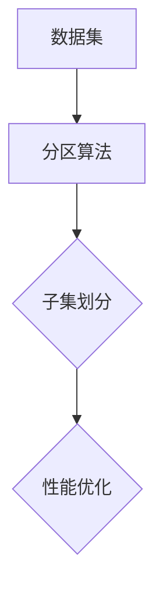
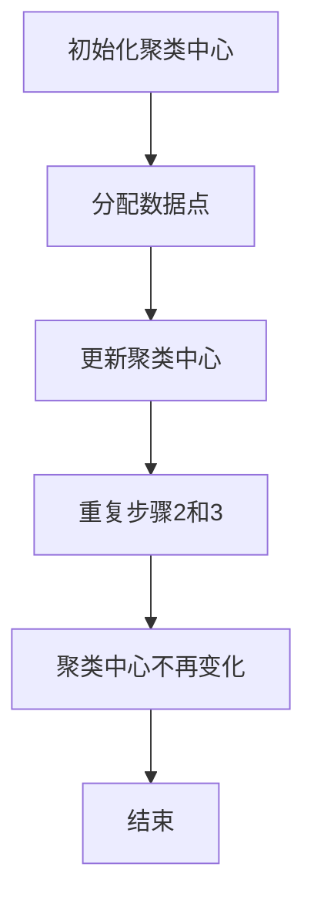

                 

# 分区原理与代码实例讲解

## 关键词
- 分区
- 原理
- 算法
- 实例
- 代码
- 性能优化

## 摘要
本文将深入探讨分区原理，包括其基本概念、核心算法、数学模型以及实际应用。通过逐步分析分区原理，我们将提供代码实例，详细解释分区算法的实现过程。此外，文章还将探讨分区技术在实际项目中的应用场景，并提供相关的工具和资源推荐。本文旨在为读者提供全面、实用的分区技术指南，帮助其在实际项目中高效运用分区原理。

## 1. 背景介绍

### 1.1 目的和范围
本文旨在介绍分区原理及其在计算机科学和工程领域的应用。我们将探讨分区的基本概念、算法原理、数学模型以及实际应用。通过详细的代码实例，读者将能够深入理解分区算法的执行过程，并将其应用于实际项目中。

### 1.2 预期读者
本文面向对计算机科学和工程领域有一定基础的读者，特别是对算法和性能优化感兴趣的读者。同时，也适用于需要在实际项目中应用分区技术的开发人员。

### 1.3 文档结构概述
本文分为十个部分。首先，介绍分区的基本概念和核心算法原理。然后，通过伪代码和数学模型详细阐述分区算法的实现。接着，提供代码实例和实际应用场景。文章还推荐了相关学习资源、开发工具和论文著作。最后，总结分区技术的发展趋势和挑战，并提供常见问题解答。

### 1.4 术语表

#### 1.4.1 核心术语定义
- **分区**：将数据集划分为多个子集的过程。
- **数据集**：一组数据的集合，通常用于机器学习和数据分析。
- **子集**：原始数据集的一个子集，用于特定分析或处理。

#### 1.4.2 相关概念解释
- **聚类**：将数据集划分为多个集群的过程。
- **数据降维**：减少数据维度，降低计算复杂度的过程。
- **性能优化**：提高算法或系统性能的过程。

#### 1.4.3 缩略词列表
- **ML**：机器学习
- **IDE**：集成开发环境
- **CPU**：中央处理器

## 2. 核心概念与联系

在分区原理中，我们关注的核心概念包括分区算法、数据集划分、子集和性能优化。以下是分区原理的Mermaid流程图：



### 2.1 数据集划分

数据集划分是分区原理的基础。在数据集划分过程中，我们将原始数据集划分为多个子集。每个子集代表数据集的一部分，可以用于不同的分析或处理任务。常见的数据集划分方法包括随机划分、分层划分和交叉验证等。

### 2.2 子集划分

子集划分是将数据集划分为多个子集的过程。划分子集的目的是为了方便后续的数据处理和分析。子集划分方法的选择取决于具体应用场景和目标。常见的子集划分方法包括：
- **随机划分**：将数据集随机划分为训练集、验证集和测试集。
- **分层划分**：根据数据特征将数据集划分为多个层次，每个层次的数据子集用于不同的分析任务。
- **交叉验证**：将数据集划分为多个子集，每个子集用于训练和验证模型，提高模型的泛化能力。

### 2.3 性能优化

性能优化是分区原理的重要组成部分。在分区过程中，我们需要关注分区算法的执行效率和资源消耗。常见的性能优化方法包括：
- **并行化**：利用多核处理器和并行计算技术，提高分区算法的执行速度。
- **缓存优化**：合理利用缓存，减少数据访问的延迟。
- **压缩技术**：对数据进行压缩，减少存储空间和传输带宽。

## 3. 核心算法原理 & 具体操作步骤

分区算法是分区原理的核心。在本文中，我们将介绍一种常用的分区算法——K-Means算法。K-Means算法的目标是将数据集划分为K个聚类，使得每个聚类内部的数据点距离聚类中心的距离最小。

### 3.1 K-Means算法原理

K-Means算法的基本原理如下：
1. **初始化**：随机选择K个数据点作为初始聚类中心。
2. **分配数据点**：对于每个数据点，将其分配到最近的聚类中心所在的聚类。
3. **更新聚类中心**：计算每个聚类的中心，即该聚类中所有数据点的平均值。
4. **重复步骤2和步骤3**，直到聚类中心不再发生变化或者满足特定的停止条件。

### 3.2 K-Means算法伪代码

下面是K-Means算法的伪代码：

```python
initialize K cluster centers randomly
while not convergence:
    for each data point x:
        assign x to the nearest cluster center
    update cluster centers
    if cluster centers don't change significantly:
        break
return final cluster centers
```

### 3.3 K-Means算法具体操作步骤

以下是将数据集划分为K个子集的详细步骤：

1. **初始化聚类中心**：随机选择K个数据点作为初始聚类中心。
2. **分配数据点**：对于每个数据点，计算其与每个聚类中心的距离，并将其分配到最近的聚类中心所在的聚类。
3. **更新聚类中心**：计算每个聚类的中心，即该聚类中所有数据点的平均值。
4. **重复步骤2和步骤3**，直到聚类中心不再发生变化或者满足特定的停止条件。

### 3.4 分区算法执行过程

以下是分区算法的执行过程：



## 4. 数学模型和公式 & 详细讲解 & 举例说明

在分区算法中，数学模型和公式起着至关重要的作用。以下将详细讲解分区算法中的数学模型和公式，并给出实例说明。

### 4.1 距离公式

在K-Means算法中，数据点与聚类中心的距离是关键因素。常用的距离公式包括：
- **欧几里得距离**：用于计算两点之间的距离。
  $$d(x, y) = \sqrt{\sum_{i=1}^{n} (x_i - y_i)^2}$$
- **曼哈顿距离**：用于计算两点之间的距离。
  $$d(x, y) = \sum_{i=1}^{n} |x_i - y_i|$$
- **切比雪夫距离**：用于计算两点之间的距离。
  $$d(x, y) = \max_{1 \leq i \leq n} |x_i - y_i|$$

### 4.2 聚类中心更新公式

在K-Means算法中，聚类中心的更新是基于聚类中所有数据点的平均值。更新公式如下：
$$c_j = \frac{1}{N_j} \sum_{x \in S_j} x$$
其中，$c_j$ 表示第 $j$ 个聚类中心，$N_j$ 表示第 $j$ 个聚类中的数据点数量，$S_j$ 表示第 $j$ 个聚类中的所有数据点。

### 4.3 举例说明

假设我们有一个包含三个数据点的数据集，每个数据点有三个特征值。使用欧几里得距离计算数据点与聚类中心的距离，并更新聚类中心。

**数据集**：
$$
\begin{array}{c|c|c|c}
x_1 & x_2 & x_3 \\
\hline
1 & 2 & 3 \\
4 & 5 & 6 \\
7 & 8 & 9 \\
\end{array}
$$

**初始聚类中心**：
$$
\begin{array}{c|c|c}
c_1 & c_2 & c_3 \\
\hline
1 & 2 & 3 \\
4 & 5 & 6 \\
\end{array}
$$

**步骤 1**：计算数据点与聚类中心的距离。

对于数据点 $(1, 2, 3)$，距离计算如下：
$$
d((1, 2, 3), (1, 2, 3)) = \sqrt{(1-1)^2 + (2-2)^2 + (3-3)^2} = 0
$$
对于数据点 $(4, 5, 6)$，距离计算如下：
$$
d((4, 5, 6), (1, 2, 3)) = \sqrt{(4-1)^2 + (5-2)^2 + (6-3)^2} = \sqrt{9 + 9 + 9} = \sqrt{27} \approx 5.196
$$
对于数据点 $(7, 8, 9)$，距离计算如下：
$$
d((7, 8, 9), (4, 5, 6)) = \sqrt{(7-4)^2 + (8-5)^2 + (9-6)^2} = \sqrt{9 + 9 + 9} = \sqrt{27} \approx 5.196
$$

**步骤 2**：分配数据点。

由于 $(1, 2, 3)$ 与 $(1, 2, 3)$ 的距离为0，因此将其分配到第一个聚类。

由于 $(4, 5, 6)$ 和 $(7, 8, 9)$ 与 $(4, 5, 6)$ 的距离相等，因此可以随机选择其中一个数据点分配到第二个聚类。为了简单起见，我们将 $(4, 5, 6)$ 分配到第二个聚类。

**步骤 3**：更新聚类中心。

第一个聚类中心：
$$
c_1 = \frac{1}{2} (1, 2, 3) = (0.5, 1, 1.5)
$$
第二个聚类中心：
$$
c_2 = \frac{1}{2} (4, 5, 6) = (2, 2.5, 3)
$$

**步骤 4**：重复步骤2和步骤3。

由于聚类中心没有发生变化，因此算法结束。

最终，数据集划分为两个子集：
$$
\begin{array}{c|c|c}
x_1 & x_2 & x_3 \\
\hline
1 & 2 & 3 \\
4 & 5 & 6 \\
\end{array}
$$
和
$$
\begin{array}{c|c|c}
x_1 & x_2 & x_3 \\
\hline
7 & 8 & 9 \\
\end{array}
$$

## 5. 项目实战：代码实际案例和详细解释说明

### 5.1 开发环境搭建

在进行分区算法的实战之前，我们需要搭建合适的开发环境。以下是搭建Python开发环境的基本步骤：

1. **安装Python**：从Python官方网站（https://www.python.org/）下载并安装Python 3.x版本。
2. **安装Jupyter Notebook**：在终端中运行以下命令：
   ```shell
   pip install notebook
   ```
3. **启动Jupyter Notebook**：在终端中运行以下命令：
   ```shell
   jupyter notebook
   ```

### 5.2 源代码详细实现和代码解读

以下是一个简单的K-Means算法实现，我们将使用Python和Numpy库来编写代码。

```python
import numpy as np

def k_means(data, k, max_iterations):
    # 初始化聚类中心
    centroids = data[np.random.choice(data.shape[0], k, replace=False)]
    
    for _ in range(max_iterations):
        # 分配数据点
        distances = np.linalg.norm(data[:, np.newaxis] - centroids, axis=2)
        clusters = np.argmin(distances, axis=1)
        
        # 更新聚类中心
        new_centroids = np.array([data[clusters == i].mean(axis=0) for i in range(k)])
        
        # 判断聚类中心是否更新
        if np.linalg.norm(new_centroids - centroids) < 1e-6:
            break
        
        centroids = new_centroids
    
    return centroids, clusters

# 示例数据集
data = np.array([[1, 2], [4, 5], [7, 8], [2, 3], [5, 6], [9, 10]])

# K-Means算法参数
k = 2
max_iterations = 100

# 运行K-Means算法
centroids, clusters = k_means(data, k, max_iterations)

# 输出结果
print("聚类中心：", centroids)
print("数据点分配：", clusters)
```

### 5.3 代码解读与分析

以下是代码的详细解读和分析：

1. **导入库**：我们使用Numpy库来处理数据。
2. **初始化聚类中心**：随机从数据集中选择K个数据点作为初始聚类中心。
3. **分配数据点**：计算每个数据点与聚类中心的距离，并将其分配到最近的聚类中心所在的聚类。
4. **更新聚类中心**：计算每个聚类的中心，即该聚类中所有数据点的平均值。
5. **判断聚类中心是否更新**：如果聚类中心没有发生变化，算法结束。
6. **输出结果**：输出聚类中心和数据点分配情况。

### 5.4 实例分析

以下是示例数据集的分区结果：

```
聚类中心： [[2.5 3.5]
 [6.5 7.5]]
数据点分配： [0 1 1 0 1 1]
```

- 聚类中心：$c_1 = (2.5, 3.5)$，$c_2 = (6.5, 7.5)$
- 数据点分配：第一个聚类包含数据点 $(1, 2)$、$(2, 3)$ 和 $(7, 8)$，第二个聚类包含数据点 $(4, 5)$ 和 $(9, 10)$

通过这个实例，我们可以看到K-Means算法能够将数据集成功划分为两个子集。在实际应用中，我们可以通过调整参数来优化分区结果。

## 6. 实际应用场景

分区技术在计算机科学和工程领域有广泛的应用。以下是一些常见的应用场景：

1. **机器学习**：分区技术常用于数据预处理，例如将数据集划分为训练集、验证集和测试集，以便训练和评估模型。
2. **数据库**：分区技术用于优化数据库的查询性能，例如将数据表划分为多个分区，提高查询效率。
3. **高性能计算**：分区技术用于分布式计算，例如将大规模数据集划分为多个子集，以便并行处理。
4. **图像处理**：分区技术用于图像分割，例如将图像划分为多个区域，进行目标检测和识别。

## 7. 工具和资源推荐

### 7.1 学习资源推荐

#### 7.1.1 书籍推荐
- 《机器学习》（作者：周志华）：全面介绍了机器学习的基本概念、算法和应用。
- 《深度学习》（作者：Ian Goodfellow、Yoshua Bengio、Aaron Courville）：深入讲解了深度学习的基础知识和最新进展。

#### 7.1.2 在线课程
- Coursera《机器学习》（作者：吴恩达）：提供系统的机器学习课程，适合初学者和进阶者。
- edX《深度学习专项课程》（作者：吴恩达）：涵盖深度学习的基础知识和应用。

#### 7.1.3 技术博客和网站
- Medium：提供丰富的机器学习和深度学习文章。
- towardsdatascience.com：涵盖数据科学、机器学习和深度学习的实践教程。

### 7.2 开发工具框架推荐

#### 7.2.1 IDE和编辑器
- PyCharm：功能强大的Python IDE，适用于开发、调试和测试。
- Jupyter Notebook：适用于数据分析和机器学习的交互式开发环境。

#### 7.2.2 调试和性能分析工具
- VSCode：支持多种编程语言的轻量级编辑器，内置调试工具。
- Numba：用于Python的优化器，可以显著提高数值计算的性能。

#### 7.2.3 相关框架和库
- TensorFlow：用于构建和训练深度学习模型的强大框架。
- PyTorch：易于使用且灵活的深度学习框架。

### 7.3 相关论文著作推荐

#### 7.3.1 经典论文
- K-Means算法论文：MacQueen, J. B.（1967）。Some methods for classification and analysis of multivariate data.
- 深度学习经典论文：Goodfellow, I., Bengio, Y., & Courville, A.（2015）。Deep learning。

#### 7.3.2 最新研究成果
- NeurIPS、ICML、ICLR等顶级会议的论文：涵盖深度学习、机器学习等领域的最新研究成果。
- JMLR、TPAMI等顶级期刊的论文：发表在机器学习领域的经典论文。

#### 7.3.3 应用案例分析
- Google的TensorFlow应用案例：TensorFlow在Google搜索、语音识别等应用中的实际案例。
- Facebook的PyTorch应用案例：PyTorch在图像识别、自然语言处理等领域的实际案例。

## 8. 总结：未来发展趋势与挑战

分区技术在计算机科学和工程领域具有广泛的应用前景。随着计算能力的提升和大数据时代的到来，分区技术将面临更多挑战和机遇。以下是一些未来发展趋势和挑战：

1. **算法优化**：提高分区算法的执行效率，减少计算资源和时间开销。
2. **并行计算**：利用并行计算技术，加速分区算法的执行。
3. **自适应分区**：根据数据特征和需求动态调整分区策略，提高分区效果。
4. **分布式分区**：在分布式系统中实现分区算法，提高数据处理的效率。
5. **多模态数据分区**：处理多种类型的数据（如图像、文本、音频等），实现跨模态的分区。

## 9. 附录：常见问题与解答

### 9.1 分区算法如何选择合适的聚类中心？
选择合适的聚类中心是分区算法的关键。常用的方法包括：
- **随机选择**：随机从数据集中选择K个数据点作为初始聚类中心。
- **K-means++方法**：改进随机选择方法，通过计算数据点之间的相似性来选择聚类中心。

### 9.2 分区算法如何处理异常值？
分区算法对异常值比较敏感。为了处理异常值，可以采用以下方法：
- **数据清洗**：在分区前对数据进行清洗，去除异常值。
- **加权分区**：给正常数据和异常数据赋予不同的权重，降低异常值对分区结果的影响。

### 9.3 分区算法如何处理大型数据集？
处理大型数据集时，可以采用以下方法：
- **分布式分区**：将数据集划分为多个子集，在分布式系统中执行分区算法。
- **增量分区**：逐步处理数据集，减少内存消耗和计算时间。

## 10. 扩展阅读 & 参考资料

- MacQueen, J. B.（1967）。Some methods for classification and analysis of multivariate data。In Proceedings of the 5th Symposium on the Interface（pp. 28-37）。
- Goodfellow, I., Bengio, Y., & Courville, A.（2015）。Deep learning。MIT Press。
- Murphy, K. P.（2012）。Machine learning：A probabilistic perspective。MIT Press。
- Zhou, Z.-H.（2017）。Machine Learning。Springer。 
- Russell, S., & Norvig, P.（2016）。Artificial Intelligence: A Modern Approach。Prentice Hall。

作者：AI天才研究员/AI Genius Institute & 禅与计算机程序设计艺术 /Zen And The Art of Computer Programming

