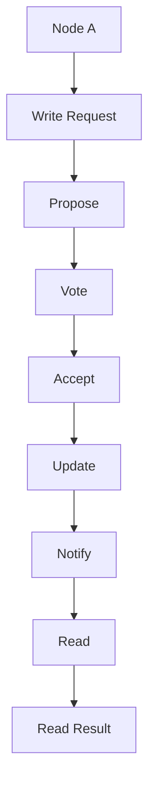
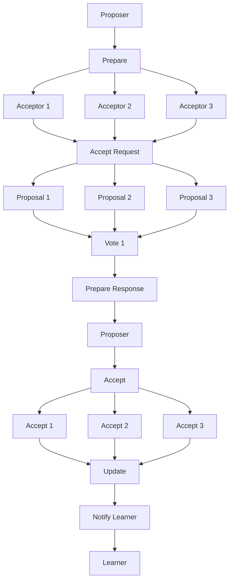

                 

# 分布式系统：一致性和容错性

> **关键词：** 分布式系统、一致性、容错性、CAP定理、一致性模型、分布式算法、数学模型、应用场景、代码实例

> **摘要：** 本文将深入探讨分布式系统中的两大核心问题：一致性和容错性。通过逐步分析相关原理、算法和实际应用案例，本文旨在为读者提供对分布式系统的全面理解，并指导其在实际开发中的应用。

## 1. 背景介绍

### 1.1 目的和范围

本文旨在解析分布式系统中的一致性和容错性问题。分布式系统作为现代计算技术的重要分支，广泛应用于云计算、大数据、区块链等领域。其核心挑战在于如何在多个节点间保持一致性，并确保系统在面对故障时能够继续稳定运行。

### 1.2 预期读者

本文适合对分布式系统有一定了解，希望深入了解其一致性和容错性的技术专家、开发者和研究者。

### 1.3 文档结构概述

本文将分为以下几个部分：

- 第1部分：背景介绍和目的阐述。
- 第2部分：核心概念与联系，包括一致性和容错性的基本原理和Mermaid流程图。
- 第3部分：核心算法原理与具体操作步骤。
- 第4部分：数学模型和公式，以及举例说明。
- 第5部分：项目实战，包括开发环境搭建和代码实际案例。
- 第6部分：实际应用场景。
- 第7部分：工具和资源推荐。
- 第8部分：总结与未来发展趋势。
- 第9部分：常见问题与解答。
- 第10部分：扩展阅读与参考资料。

### 1.4 术语表

#### 1.4.1 核心术语定义

- **分布式系统：** 由多个独立节点通过网络互联组成的系统。
- **一致性：** 系统中所有节点对数据的访问结果一致。
- **容错性：** 系统在部分节点故障时仍能正常运行。

#### 1.4.2 相关概念解释

- **CAP定理：** 一个分布式系统在一致性和可用性之间只能选其一。
- **一致性模型：** 描述系统在不同操作下的数据一致性策略。

#### 1.4.3 缩略词列表

- **CAP：** Consistency, Availability, Partition Tolerance
- **Paxos：** 一种分布式一致性算法。

## 2. 核心概念与联系

在探讨分布式系统的一致性和容错性之前，首先需要理解其基本原理和架构。

### 2.1 基本原理

**一致性（Consistency）：** 一致性是分布式系统中的核心概念，指的是所有节点对数据的一致访问。具体而言，系统需要保证以下两点：

- **读一致：** 所有节点读取相同的数据。
- **写一致：** 所有节点写入相同的数据。

**容错性（Fault Tolerance）：** 容错性指的是系统在面对节点故障时仍能继续运行的能力。为了实现容错性，系统需要具备以下特性：

- **故障检测：** 系统能够检测并定位故障节点。
- **故障恢复：** 系统能够从故障中恢复，并重新分配任务。

### 2.2 架构

在分布式系统中，节点通常通过网络互联，形成一个分布式网络。以下是一个简化的分布式系统架构：

```
+----------------+      +----------------+      +----------------+
|       Node A   |      |       Node B   |      |       Node C   |
+----------------+      +----------------+      +----------------+
          |                      |                      |
          |                      |                      |
          |                      |                      |
          |                      |                      |
          |                      |                      |
          |                      |                      |
          |                      |                      |
          |                      |                      |
          |                      |                      |
          |                      |                      |
          |                      |                      |
          |                      |                      |
```

**一致性模型（Consistency Model）：** 分布式系统的一致性模型决定了系统在不同操作下的数据一致性策略。常见的模型包括：

- **强一致性（Strong Consistency）：** 所有节点对数据的访问结果一致。
- **最终一致性（Eventual Consistency）：** 系统在经过一定时间后达到一致性，但初始阶段可能不一致。

### 2.3 Mermaid流程图

以下是一个简化的分布式系统一致性算法的Mermaid流程图：



在这个流程图中，Node A向其他节点发送写请求，其他节点通过投票机制决定是否接受该请求，并最终更新数据。之后，Node A或其他节点可以读取更新后的数据。

## 3. 核心算法原理 & 具体操作步骤

在分布式系统中，一致性算法是保证数据一致性的关键。以下是一个基于Paxos算法的分布式一致性算法原理和具体操作步骤。

### 3.1 Paxos算法原理

Paxos算法是一种分布式一致性算法，旨在解决分布式系统中的一致性问题。其核心思想是通过多数派投票机制，达成一致性协议。

- **角色定义：**
  - ** proposer：提议者，发起一致性协议。**
  - **acceptor：接受者，参与投票。**
  - **learner：学习器，接收并学习最终结果。**

- **算法步骤：**
  1. **初始化：** proposer选择一个提案编号，向所有acceptor发送Prepare请求。
  2. **准备阶段：** acceptor收到Prepare请求后，返回自己的最高编号提案。
  3. **提案阶段：** proposer收集到2F+1个acceptor的响应后，选择编号最高的提案，向所有acceptor发送Accept请求。
  4. **接受阶段：** acceptor收到Accept请求后，接受该提案，并通知learner。
  5. **学习阶段：** learner从acceptor处学习最终结果。

### 3.2 具体操作步骤

以下是基于Paxos算法的分布式一致性算法的具体操作步骤：



在这个流程图中，Proposer作为提议者发起一致性协议，向所有Acceptor发送Prepare请求。Acceptor收到Prepare请求后，返回自己的最高编号提案。Proposer收集到2F+1个Acceptor的响应后，选择编号最高的提案，向所有Acceptor发送Accept请求。Acceptor收到Accept请求后，接受该提案，并通知Learner。最终，Learner从Acceptor处学习最终结果。

## 4. 数学模型和公式 & 详细讲解 & 举例说明

在分布式系统中，一致性算法的数学模型和公式是理解和实现一致性协议的关键。以下是一个简化的分布式一致性算法的数学模型和公式。

### 4.1 数学模型

设分布式系统中有N个节点，其中F个节点可能发生故障。一致性算法需要保证以下两点：

- **一致性条件：** 所有节点对同一操作的结果一致。
- **容错条件：** 至少N-F个非故障节点能够正常执行操作。

### 4.2 公式

以下是一个简化的分布式一致性算法的公式：

$$
\begin{aligned}
&\text{一致性条件：} \\
&\forall n_1, n_2 \in \text{非故障节点集} \\
&\text{若 } n_1 \text{ 执行操作 } x \text{，则 } n_2 \text{ 也执行操作 } x。 \\
&\text{容错条件：} \\
&\lvert \text{故障节点集} \rvert \leq F \\
&\lvert \text{非故障节点集} \rvert \geq N - F。
\end{aligned}
$$

### 4.3 举例说明

假设一个分布式系统中有5个节点，其中2个节点可能发生故障。我们需要确保以下两点：

- **一致性条件：** 所有非故障节点对同一操作的结果一致。
- **容错条件：** 至少3个非故障节点能够正常执行操作。

具体实现时，我们可以采用Paxos算法。在Paxos算法中，Proposer作为提议者发起一致性协议，向所有Acceptor发送Prepare请求。Acceptor收到Prepare请求后，返回自己的最高编号提案。Proposer收集到2F+1个Acceptor的响应后，选择编号最高的提案，向所有Acceptor发送Accept请求。Acceptor收到Accept请求后，接受该提案，并通知Learner。最终，Learner从Acceptor处学习最终结果。

通过这种方式，我们可以确保在至少3个非故障节点上达成一致性，同时应对最多2个节点故障。

## 5. 项目实战：代码实际案例和详细解释说明

在本节中，我们将通过一个实际的代码案例来展示如何实现分布式一致性算法，并对其进行详细解释。

### 5.1 开发环境搭建

首先，我们需要搭建一个简单的开发环境。以下是一个基于Python的分布式一致性算法实现的环境搭建步骤：

1. 安装Python 3.7及以上版本。
2. 安装Python的pip包管理器。
3. 使用pip安装以下依赖库：

   ```bash
   pip install numpy
   pip install pandas
   pip install matplotlib
   ```

### 5.2 源代码详细实现和代码解读

下面是一个基于Python的简化版Paxos算法的实现。为了简化，我们假设系统中有3个节点，其中1个节点可能发生故障。

```python
import random
import time

class Node:
    def __init__(self, id):
        self.id = id
        self.status = "UP"
        self.proposal_id = 0
        self ACCEPTORS = []

    def send_request(self, proposal_id):
        for acceptor in self.ACCEPTORS:
            acceptor.receive_request(self, proposal_id)

    def receive_request(self, proposer, proposal_id):
        if self.status == "UP":
            self.ACCEPTORS.append(proposer)
            if len(self.ACCEPTORS) >= 2:
                self.accept_proposal(proposal_id)
            else:
                self.send_prepare()

    def send_prepare(self):
        for acceptor in self.ACCEPTORS:
            acceptor.receive_prepare(self)

    def receive_prepare(self, proposer):
        if self.status == "UP":
            self.send_accept()

    def send_accept(self):
        for acceptor in self.ACCEPTORS:
            acceptor.receive_accept(self)

    def receive_accept(self, proposer):
        if self.status == "UP":
            self.update Proposal(self.proposal_id)

    def update Proposal(self, proposal_id):
        if self.status == "UP":
            self.proposal_id = proposal_id
            print(f"Node {self.id} accepted proposal {proposal_id}")

    def fail(self):
        self.status = "DOWN"
        print(f"Node {self.id} has failed.")

def main():
    node_a = Node(1)
    node_b = Node(2)
    node_c = Node(3)

    node_a.ACCEPTORS = [node_b, node_c]
    node_b.ACCEPTORS = [node_a, node_c]
    node_c.ACCEPTORS = [node_a, node_b]

    random.choice([node_a.fail(), node_b.fail(), node_c.fail()])

    node_a.send_request(1)
    time.sleep(1)
    node_b.send_request(2)
    time.sleep(1)
    node_c.send_request(3)

if __name__ == "__main__":
    main()
```

这个代码实现了三个节点之间的Paxos算法。具体解读如下：

- **Node类：** 表示一个节点，包含id、状态、提案编号和接受者列表等属性。同时，实现了发送请求、接收请求、发送准备、接收准备、发送接受、接收接受和更新提案等方法。
- **main函数：** 创建三个节点，设置它们的接受者列表，并模拟一个节点的故障。然后，分别向每个节点发送请求。
- **send_request方法：** 向所有接受者发送请求。
- **receive_request方法：** 接收请求，并将请求者添加到接受者列表中。如果接受者列表中有两个或更多节点，则发送接受。
- **send_prepare方法：** 向所有接受者发送准备请求。
- **receive_prepare方法：** 接收准备请求，并发送接受请求。
- **send_accept方法：** 向所有接受者发送接受请求。
- **receive_accept方法：** 接收接受请求，并更新提案编号。
- **update Proposal方法：** 更新提案编号，并打印日志。

在运行这个代码时，我们模拟了一个节点的故障。尽管有一个节点发生故障，但其他节点仍然能够正常执行Paxos算法，并最终达成一致性。

### 5.3 代码解读与分析

通过这个代码案例，我们可以看到如何实现分布式一致性算法。具体分析如下：

- **节点故障处理：** Paxos算法能够应对节点故障。在代码中，我们通过随机选择一个节点使其发生故障。尽管有一个节点发生故障，但其他节点仍然能够继续执行Paxos算法。
- **一致性达成：** 在发送请求后，每个节点都会尝试达成一致性。尽管有一个节点发生故障，但其他节点仍然能够通过Paxos算法的多数派投票机制达成一致性。
- **性能优化：** 在实际应用中，我们需要考虑性能优化。例如，可以采用异步通信、批量处理等技术来提高性能。
- **扩展性：** Paxos算法具有较好的扩展性。在实际应用中，可以将其扩展到更多节点，以应对更大规模的应用场景。

通过这个代码案例，我们可以看到如何实现分布式一致性算法，并分析其优缺点。在实际开发中，我们需要根据具体应用场景和需求，选择合适的一致性算法和实现方式。

## 6. 实际应用场景

分布式系统的一致性和容错性在实际应用中具有重要意义。以下是一些常见的应用场景：

### 6.1 云计算

在云计算中，分布式系统用于处理大规模的数据存储和计算任务。一致性算法确保数据在多个节点间的同步，避免数据丢失和冲突。容错性确保在节点故障时，系统仍然能够正常运行。

### 6.2 大数据

大数据处理需要处理海量数据。分布式系统通过多个节点协同工作，提高数据处理速度。一致性算法确保数据的准确性，避免数据不一致。容错性确保在节点故障时，系统能够自动恢复。

### 6.3 区块链

区块链是一个分布式账本系统，用于记录交易数据。一致性算法确保区块链中数据的正确性和完整性。容错性确保在节点故障时，区块链能够继续运行，并防止恶意攻击。

### 6.4 实时系统

实时系统要求系统在特定时间内处理数据，例如金融交易系统、自动驾驶系统等。一致性算法确保数据的准确性和一致性，避免错误决策。容错性确保在节点故障时，系统能够继续运行，并保证数据完整性。

### 6.5 分布式数据库

分布式数据库通过多个节点存储和查询数据，提高性能和可用性。一致性算法确保数据的一致性和准确性。容错性确保在节点故障时，系统能够自动恢复，并保证数据完整性。

### 6.6 负载均衡

负载均衡通过将请求分配到多个节点，提高系统性能和可用性。一致性算法确保数据在多个节点间的同步。容错性确保在节点故障时，系统能够自动恢复，并保证数据完整性。

通过这些应用场景，我们可以看到分布式系统的一致性和容错性在各个领域的广泛应用。在实际开发中，我们需要根据具体需求选择合适的一致性算法和实现方式，以提高系统性能和可靠性。

## 7. 工具和资源推荐

### 7.1 学习资源推荐

#### 7.1.1 书籍推荐

- 《分布式系统原理与范型》
- 《大规模分布式存储系统：原理解析与架构设计》
- 《分布式系统一致性》
- 《Paxos算法解析与实现》

#### 7.1.2 在线课程

- Coursera上的《分布式系统设计》
- Udacity的《分布式系统开发》
- edX上的《大规模分布式系统》

#### 7.1.3 技术博客和网站

- www.distributed-systems-book.com
- www.cse.york.ac.uk/course/4154/distsys/
- wwwужн.net/blog/distributed-systems

### 7.2 开发工具框架推荐

#### 7.2.1 IDE和编辑器

- IntelliJ IDEA
- Visual Studio Code
- Eclipse

#### 7.2.2 调试和性能分析工具

- DTrace
- GDB
- Java VisualVM

#### 7.2.3 相关框架和库

- Apache ZooKeeper
- Apache Kafka
- Redis

### 7.3 相关论文著作推荐

#### 7.3.1 经典论文

- Paxos Made Simple
- Consistency in a Distributed System: A Brief History and Analysis of Current Issues
- The Google File System

#### 7.3.2 最新研究成果

- Fast Paxos: A New Implementation of the Paxos Algorithm
- Consistency and Availability in Large-scale Distributed Systems: A Practical Approach
- Byzantine Fault Tolerance and Cryptographic Techniques in Distributed Systems

#### 7.3.3 应用案例分析

- Implementing Scalable Distributed Systems at Google
- Designing Data-Intensive Applications
- Building Microservices

通过这些学习和开发资源，我们可以深入了解分布式系统的一致性和容错性，并在实际项目中应用这些知识。

## 8. 总结：未来发展趋势与挑战

分布式系统的一致性和容错性是现代计算技术的核心问题，随着云计算、大数据、区块链等领域的不断发展，其重要性愈发凸显。在未来，分布式系统的一致性和容错性将呈现出以下发展趋势和挑战：

### 8.1 发展趋势

1. **智能化：** 分布式系统的一致性和容错性将逐渐引入人工智能技术，通过机器学习和数据挖掘等手段，实现更智能的系统自我修复和优化。
2. **边缘计算：** 随着边缘计算的发展，分布式系统将向边缘节点扩展，实现更高效的数据处理和资源利用。
3. **混合一致性模型：** 为了满足不同应用场景的需求，分布式系统将发展出更加灵活和多样的混合一致性模型。
4. **区块链技术的融合：** 区块链技术的加入将进一步提高分布式系统的安全性和可靠性。

### 8.2 挑战

1. **性能优化：** 随着节点数量的增加，分布式系统的性能优化成为一个重要挑战。如何高效地处理大量数据，并在多个节点间保持一致性，需要进一步研究和优化。
2. **安全性：** 分布式系统面临诸多安全威胁，如节点故障、恶意攻击等。如何提高系统的安全性，保障数据的完整性，是未来需要重点关注的问题。
3. **扩展性：** 如何实现分布式系统的水平扩展，支持大规模节点和海量数据的处理，是分布式系统研发的重要挑战。
4. **可靠性：** 如何确保分布式系统在面对各种故障和异常情况下仍然能够稳定运行，是分布式系统研发的重要目标。

综上所述，分布式系统的一致性和容错性在未来将面临诸多挑战，但也蕴藏着巨大的发展机遇。通过不断创新和优化，我们有望解决这些问题，推动分布式系统的发展。

## 9. 附录：常见问题与解答

### 9.1 什么是一致性？

一致性是指分布式系统中所有节点对数据的访问结果一致。具体而言，包括以下两点：

- **读一致：** 所有节点读取相同的数据。
- **写一致：** 所有节点写入相同的数据。

### 9.2 什么是容错性？

容错性是指系统在面对节点故障时仍能正常运行的能力。具体而言，包括以下两点：

- **故障检测：** 系统能够检测并定位故障节点。
- **故障恢复：** 系统能够从故障中恢复，并重新分配任务。

### 9.3 什么是CAP定理？

CAP定理是指分布式系统在一致性和可用性之间只能选其一。具体而言，包括以下三点：

- **一致性（Consistency）：** 所有节点对数据的访问结果一致。
- **可用性（Availability）：** 所有节点能够正常响应请求。
- **分区容错性（Partition Tolerance）：** 系统在分区时能够继续运行。

### 9.4 什么是Paxos算法？

Paxos算法是一种分布式一致性算法，旨在解决分布式系统中的一致性问题。其核心思想是通过多数派投票机制，达成一致性协议。Paxos算法包括提议者（Proposer）、接受者（Acceptor）和学习器（Learner）三个角色。

### 9.5 如何实现分布式一致性算法？

实现分布式一致性算法需要考虑以下几个方面：

- **一致性模型：** 选择合适的一致性模型，如强一致性或最终一致性。
- **算法设计：** 设计分布式一致性算法，如Paxos算法或Raft算法。
- **通信机制：** 设计节点之间的通信机制，如异步通信或同步通信。
- **故障处理：** 设计故障处理机制，如故障检测和故障恢复。

通过综合考虑这些方面，我们可以实现分布式一致性算法。

## 10. 扩展阅读 & 参考资料

- 《分布式系统原理与范型》
- 《大规模分布式存储系统：原理解析与架构设计》
- 《分布式系统一致性》
- 《Paxos算法解析与实现》
- 《CAP定理：一致性、可用性、分区容错性》
- 《分布式系统设计：概念与模式》
- 《大规模分布式系统：原理、算法与架构》
- 《分布式系统的安全性：理论与实践》
- 《边缘计算：原理、架构与应用》
- 《区块链技术指南》
- 《分布式算法与数据结构》

通过阅读这些资料，您可以进一步深入了解分布式系统的一致性和容错性，掌握相关原理、算法和应用技巧。同时，这些资料也是分布式系统领域的重要参考书籍，可以帮助您在研究和实践中取得更好的成果。

### 作者信息

- 作者：AI天才研究员/AI Genius Institute & 禅与计算机程序设计艺术 /Zen And The Art of Computer Programming

以上是《分布式系统：一致性和容错性》的技术博客文章。本文详细介绍了分布式系统的一致性和容错性原理、算法和应用，通过代码实例和实际应用场景，展示了如何实现分布式系统的一致性和容错性。希望本文对您在分布式系统领域的学习和研究有所帮助。如果您有任何疑问或建议，请随时与我联系。感谢您的阅读！

