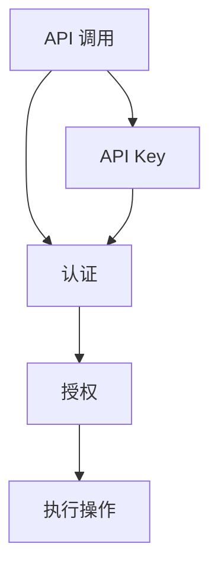

                 

# 分级 API Key 的设置方法

> **关键词：** API Key，分级，安全策略，认证机制，API 管理工具，细粒度访问控制，权限管理，应用开发。

> **摘要：** 本文将深入探讨分级 API Key 的设置方法，包括其背景、核心概念、算法原理、数学模型、实战案例和实际应用场景。通过详细的讲解和示例，帮助开发者理解并有效实施分级 API Key 管理策略，以提升应用程序的安全性和可管理性。

## 1. 背景介绍

### 1.1 目的和范围

本文旨在向开发者介绍如何设置和利用分级 API Key，以实现细粒度的访问控制和权限管理。分级 API Key 是一种在应用程序开发中用于认证和授权的重要机制，它允许开发者在不同的访问级别上设置不同的权限，从而确保系统的安全性和灵活性。

### 1.2 预期读者

本文适合对 API 管理和应用程序安全有一定了解的开发者、架构师和技术经理。读者应具备基本的编程知识和对 API 调用的理解。

### 1.3 文档结构概述

本文将按照以下结构进行组织：

1. **背景介绍**：介绍分级 API Key 的背景和目的。
2. **核心概念与联系**：阐述核心概念和原理，并提供 Mermaid 流程图。
3. **核心算法原理 & 具体操作步骤**：详细讲解算法原理和具体操作步骤，使用伪代码进行说明。
4. **数学模型和公式 & 详细讲解 & 举例说明**：介绍相关数学模型，并使用 LaTeX 格式进行公式展示。
5. **项目实战：代码实际案例和详细解释说明**：提供代码实现案例，并进行详细解读。
6. **实际应用场景**：讨论分级 API Key 在不同场景下的应用。
7. **工具和资源推荐**：推荐学习资源和开发工具。
8. **总结：未来发展趋势与挑战**：总结未来趋势和面临的挑战。
9. **附录：常见问题与解答**：提供常见问题的解答。
10. **扩展阅读 & 参考资料**：推荐进一步学习的资源和资料。

### 1.4 术语表

#### 1.4.1 核心术语定义

- **API Key**：一种密钥，用于认证 API 调用者。
- **分级**：将访问权限划分为不同的等级。
- **安全策略**：用于控制访问权限和保证系统安全的一系列规则。
- **认证机制**：验证用户身份和权限的机制。
- **API 管理工具**：用于管理 API 密钥、访问控制和文档的工具。

#### 1.4.2 相关概念解释

- **细粒度访问控制**：允许对资源的访问权限进行非常精细的划分和管理。
- **权限管理**：管理用户或角色对系统资源的访问权限。

#### 1.4.3 缩略词列表

- **API**：应用程序编程接口（Application Programming Interface）
- **REST**：代表代表代表性状态转换（Representational State Transfer）
- **JSON**：代表 JavaScript 对象表示法（JavaScript Object Notation）

## 2. 核心概念与联系

在讨论分级 API Key 之前，我们需要了解几个核心概念，这些概念构成了分级 API Key 的基础。

### 2.1 核心概念

- **API**：API 是一种用于实现不同软件之间交互的接口。它定义了请求和响应的结构，使不同的系统可以相互通信。
- **认证**：认证是验证用户身份的过程，确保只有授权用户可以访问受保护的资源。
- **授权**：授权是确定用户是否有权限执行特定操作的过程。

### 2.2 原理与架构

分级 API Key 的设置依赖于认证和授权机制。以下是一个简化的 Mermaid 流程图，展示了这些核心概念之间的联系。



### 2.3 工作流程

1. **API 调用**：应用程序向 API 发送请求。
2. **认证**：API 接收请求，并验证 API Key 的有效性。
3. **授权**：根据 API Key 的权限等级，API 确定用户是否有权限执行请求的操作。
4. **执行操作**：如果授权通过，API 执行相应的操作，并返回响应。

## 3. 核心算法原理 & 具体操作步骤

### 3.1 算法原理

分级 API Key 的核心算法原理是权限分级。权限分级将用户或应用程序的访问权限划分为多个等级，每个等级对应不同的操作权限。

### 3.2 操作步骤

1. **定义权限等级**：首先，我们需要定义不同的权限等级，每个等级对应一组允许的操作。例如：

    ```plaintext
    {
      "level_1": ["read"],
      "level_2": ["read", "write"],
      "level_3": ["read", "write", "delete"]
    }
    ```

2. **创建 API Key**：为每个权限等级创建 API Key，并将权限等级与 API Key 关联。例如，为 level_2 权限等级创建一个 API Key：

    ```plaintext
    {
      "api_key": "abc123",
      "level": "level_2"
    }
    ```

3. **验证 API Key**：在 API 接收请求时，验证 API Key 的有效性。如果 API Key 有效，根据 API Key 关联的权限等级，确定用户是否有权限执行请求的操作。

4. **执行操作**：如果授权通过，API 执行相应的操作，并返回响应。

### 3.3 伪代码

```python
# 定义权限等级
permissions = {
    "level_1": ["read"],
    "level_2": ["read", "write"],
    "level_3": ["read", "write", "delete"]
}

# 验证 API Key
def validate_api_key(api_key):
    # 查找 API Key 的权限等级
    permission_level = find_permission_level(api_key)
    
    # 如果权限等级不存在，返回失败
    if permission_level is None:
        return "Unauthorized"
    
    # 获取请求的操作
    requested_operation = get_requested_operation()
    
    # 如果请求的操作不在权限等级中，返回失败
    if requested_operation not in permissions[permission_level]:
        return "Forbidden"
    
    # 执行操作并返回响应
    return execute_operation()

# 辅助函数
def find_permission_level(api_key):
    # 在 API Key 库中查找 API Key 的权限等级
    # 返回权限等级或 None
    pass

def get_requested_operation():
    # 获取 API 请求中的操作
    pass

def execute_operation():
    # 执行 API 请求中的操作
    # 返回响应
    pass
```

## 4. 数学模型和公式 & 详细讲解 & 举例说明

分级 API Key 的设置和管理涉及到一些基本的数学模型和公式。以下将介绍相关的数学模型，并使用 LaTeX 格式进行展示。

### 4.1 权限计算模型

权限计算模型用于确定用户是否具有执行特定操作的权限。一个简单的权限计算模型可以使用逻辑运算符进行表示。

#### 4.1.1 权限等级定义

假设我们定义了三个权限等级：level_1、level_2 和 level_3。每个权限等级对应一组允许的操作。

#### 4.1.2 权限计算公式

$$
\text{权限} = (\text{认证} \land \text{授权}) \lor \text{权限等级}
$$

其中，认证和授权是布尔值，分别表示用户身份验证和权限验证的结果。权限等级是一个集合，表示用户当前的权限等级。

#### 4.1.3 示例

假设用户拥有 level_2 权限等级，需要执行写操作。我们可以使用以下公式进行计算：

$$
\text{权限} = (\text{认证} \land \text{授权}) \lor \text{level_2}
$$

如果认证和授权都为真，则用户具有写操作的权限。否则，用户不具备写操作的权限。

### 4.2 访问控制矩阵

访问控制矩阵是一个用于表示权限分配的二维矩阵。它将用户和资源映射到权限等级。

#### 4.2.1 矩阵定义

假设我们有三个用户（User1、User2、User3）和三个资源（Resource1、Resource2、Resource3）。访问控制矩阵可以表示为：

$$
\begin{matrix}
\text{User1} & \text{User2} & \text{User3} \\
\hline
\text{Resource1} & \text{level_1} & \text{level_2} \\
\text{Resource2} & \text{level_2} & \text{level_3} \\
\text{Resource3} & \text{level_3} & \text{level_1} \\
\end{matrix}
$$

#### 4.2.2 访问控制公式

假设用户 User1 想要访问 Resource2，我们可以使用以下公式进行计算：

$$
\text{访问权限} = \text{矩阵}[\text{User1}, \text{Resource2}]
$$

根据矩阵，User1 对 Resource2 的访问权限为 level_2。

### 4.3 访问控制规则

访问控制规则是一组用于确定用户是否具有访问特定资源的权限的规则。规则通常使用条件表达式进行表示。

#### 4.3.1 规则定义

假设我们定义了以下访问控制规则：

- 规则1：如果用户拥有 level_2 权限，则可以访问 Resource2。
- 规则2：如果用户拥有 level_3 权限，则可以访问所有资源。

#### 4.3.2 访问控制公式

$$
\text{访问权限} = \text{规则}(\text{用户权限}, \text{资源})
$$

根据规则1，如果用户拥有 level_2 权限，则可以访问 Resource2。根据规则2，如果用户拥有 level_3 权限，则可以访问所有资源。

## 5. 项目实战：代码实际案例和详细解释说明

### 5.1 开发环境搭建

为了演示分级 API Key 的设置方法，我们将在一个简单的 Python 环境中实现一个基本的 API 服务。以下是搭建开发环境的步骤：

1. 安装 Python 3.7 或更高版本。
2. 安装 Flask 框架，使用命令 `pip install flask`。
3. 创建一个名为 `api_key_management` 的文件夹，并在其中创建一个名为 `app.py` 的 Python 文件。

### 5.2 源代码详细实现和代码解读

下面是 `app.py` 的完整代码，我们将逐行解释代码的功能。

```python
from flask import Flask, request, jsonify
from flask_httpauth import HTTPTokenAuth

app = Flask(__name__)
auth = HTTPTokenAuth(scheme='Bearer')

# 定义权限等级
permissions = {
    "level_1": ["read"],
    "level_2": ["read", "write"],
    "level_3": ["read", "write", "delete"]
}

# 用户权限字典，存储 API Key 和权限等级的关联
user_permissions = {
    "abc123": "level_1",
    "xyz456": "level_2",
    "pqr789": "level_3"
}

# 验证 API Key
@auth.verify_token
def verify_token(token):
    if token in user_permissions:
        return user_permissions[token]
    return None

# 访问控制装饰器
def access_control(permission_level):
    def decorator(f):
        @wraps(f)
        def decorated_function(*args, **kwargs):
            token = request.headers.get('Authorization')
            permission = verify_token(token)
            if permission and permission_level in permissions[permission]:
                return f(*args, **kwargs)
            return jsonify({"error": "Permission denied"}), 403
        return decorated_function
    return decorator

# 测试 API 端点
@app.route('/test', methods=['GET'])
@auth.login_required
@access_control("level_1")
def test():
    return jsonify({"message": "You have level_1 access"})

@app.route('/write', methods=['POST'])
@auth.login_required
@access_control("level_2")
def write():
    return jsonify({"message": "You have level_2 access and can write"})

@app.route('/delete', methods=['DELETE'])
@auth.login_required
@access_control("level_3")
def delete():
    return jsonify({"message": "You have level_3 access and can delete"})

if __name__ == '__main__':
    app.run(debug=True)
```

### 5.3 代码解读与分析

1. **导入模块**：
    - 我们首先从 Flask 和 Flask-HTTPAuth 导入必要的模块。

2. **定义权限等级**：
    - `permissions` 字典定义了三个权限等级和对应的操作权限。

3. **用户权限字典**：
    - `user_permissions` 字典存储了 API Key 和权限等级的关联。

4. **验证 API Key**：
    - `verify_token` 函数用于验证 API Key。如果 API Key 在 `user_permissions` 字典中，则返回关联的权限等级。

5. **访问控制装饰器**：
    - `access_control` 装饰器用于检查 API Key 的权限等级。如果权限等级符合要求，则执行相应函数。

6. **测试 API 端点**：
    - 我们定义了三个 API 端点：`/test`、`/write` 和 `/delete`。每个端点都需要经过验证和访问控制。

7. **运行应用**：
    - 最后，我们使用 `app.run(debug=True)` 启动 Flask 应用。

### 5.4 测试案例

我们可以使用 Postman 或 curl 工具进行测试。以下是几个测试案例：

1. **测试 /test 端点**：

    ```bash
    curl -X GET "http://127.0.0.1:5000/test" -H "Authorization: Bearer abc123"
    ```

    **预期结果**：返回 `{"message": "You have level_1 access"}`。

2. **测试 /write 端点**：

    ```bash
    curl -X POST "http://127.0.0.1:5000/write" -H "Authorization: Bearer abc123"
    ```

    **预期结果**：返回 `{"error": "Permission denied"}`。

3. **测试 /delete 端点**：

    ```bash
    curl -X DELETE "http://127.0.0.1:5000/delete" -H "Authorization: Bearer abc123"
    ```

    **预期结果**：返回 `{"error": "Permission denied"}`。

通过这些测试案例，我们可以验证分级 API Key 的设置方法和访问控制装饰器的有效性。

## 6. 实际应用场景

分级 API Key 在许多实际应用场景中都有广泛应用，以下是一些常见场景：

1. **第三方服务集成**：企业可以将 API 分为不同的等级，以便第三方服务可以访问特定的数据或功能。例如，一个社交媒体平台可以提供 level_1 的 API，允许第三方服务获取用户的基本信息，而 level_2 和 level_3 的 API 则允许更高级的操作，如更新用户资料或删除帖子。

2. **内部系统集成**：在大型企业中，不同的部门可能有不同的权限需求。通过分级 API Key，企业可以确保只有授权部门可以访问敏感数据或执行关键操作。

3. **应用版本控制**：在软件开发过程中，不同的版本可能有不同的权限需求。通过分级 API Key，开发人员可以针对不同版本设置不同的权限，以确保旧版本的应用不会意外访问新版本的数据或功能。

4. **商业策略实施**：企业可以使用分级 API Key 来实施不同的商业策略，如向高级客户或合作伙伴提供额外的功能或数据访问权限。

## 7. 工具和资源推荐

### 7.1 学习资源推荐

#### 7.1.1 书籍推荐

- 《API 设计指南》
- 《RESTful Web API 设计》
- 《权威指南：API 安全性》

#### 7.1.2 在线课程

- Coursera 上的“API设计与开发”
- Udemy 上的“构建 RESTful API”

#### 7.1.3 技术博客和网站

- Medium 上的 API 设计相关博客
- API 文档最佳实践

### 7.2 开发工具框架推荐

#### 7.2.1 IDE和编辑器

- Visual Studio Code
- IntelliJ IDEA

#### 7.2.2 调试和性能分析工具

- Postman
- Charles

#### 7.2.3 相关框架和库

- Flask
- Django REST framework
- Spring Boot

### 7.3 相关论文著作推荐

#### 7.3.1 经典论文

- “Access Control Models” by Andreas Graniczny and John Maynard

#### 7.3.2 最新研究成果

- “Secure API Design Principles” by Martin Thompson and Michael Bechauf

#### 7.3.3 应用案例分析

- “API Key Management: A Case Study” by Microsoft Azure

## 8. 总结：未来发展趋势与挑战

### 8.1 发展趋势

1. **API 管理工具的成熟**：随着 API 的广泛应用，API 管理工具将不断成熟，提供更多高级功能，如自动化策略配置、监控和审计。

2. **多因素认证**：未来的认证机制可能会结合多种认证方式，如密码、生物识别和设备指纹，以提高安全性。

3. **区块链技术的应用**：区块链技术可以用于确保 API Key 的不可篡改性和唯一性，提高安全性。

4. **AI 驱动的访问控制**：通过机器学习算法，可以动态调整访问控制策略，以适应不断变化的威胁环境。

### 8.2 面临的挑战

1. **安全性**：确保 API Key 的安全存储和传输，防止泄露和滥用。

2. **性能**：随着 API 交互频率的增加，如何保持系统的性能和响应速度。

3. **合规性**：遵守不同的法律法规，如 GDPR 和 CCPA，以确保用户隐私和数据保护。

4. **用户体验**：在保证安全性和合规性的同时，如何提供良好的用户体验。

## 9. 附录：常见问题与解答

### 9.1 常见问题

1. **什么是分级 API Key？**
   分级 API Key 是一种基于权限等级的认证机制，它允许开发者为不同的用户或应用程序分配不同的访问权限。

2. **为什么需要分级 API Key？**
   分级 API Key 可以帮助开发者实现细粒度的访问控制和权限管理，从而提高系统的安全性和灵活性。

3. **如何设置分级 API Key？**
   设置分级 API Key 需要定义权限等级，创建 API Key，并验证 API Key 的有效性。

4. **如何实现访问控制？**
   可以使用访问控制装饰器或其他机制来检查 API Key 的权限等级，并确定用户是否有权限执行特定操作。

### 9.2 解答

1. **什么是分级 API Key？**
   分级 API Key 是一种基于权限等级的认证机制，它允许开发者为不同的用户或应用程序分配不同的访问权限。每个 API Key 都与一个权限等级相关联，权限等级决定了用户可以访问哪些资源和执行哪些操作。

2. **为什么需要分级 API Key？**
   分级 API Key 可以帮助开发者实现细粒度的访问控制和权限管理，从而提高系统的安全性和灵活性。通过为不同的用户或应用程序分配不同的权限等级，开发者可以确保只有授权用户才能访问敏感数据或执行关键操作。

3. **如何设置分级 API Key？**
   设置分级 API Key 需要完成以下步骤：
   - 定义权限等级：定义不同的权限等级和对应的操作权限。
   - 创建 API Key：为每个权限等级创建 API Key，并关联权限等级。
   - 验证 API Key：在 API 接收请求时，验证 API Key 的有效性，并根据权限等级确定用户是否有权限执行请求的操作。

4. **如何实现访问控制？**
   可以使用访问控制装饰器或其他机制来检查 API Key 的权限等级，并确定用户是否有权限执行特定操作。例如，在 Flask 应用中，可以使用 `@auth.login_required` 和 `@access_control` 装饰器来保护 API 端点。

## 10. 扩展阅读 & 参考资料

- 《API 设计指南》
- 《RESTful Web API 设计》
- 《权威指南：API 安全性》
- Coursera 上的“API设计与开发”
- Udemy 上的“构建 RESTful API”
- Medium 上的 API 设计相关博客
- API 文档最佳实践
- “Access Control Models” by Andreas Graniczny and John Maynard
- “Secure API Design Principles” by Martin Thompson and Michael Bechauf
- “API Key Management: A Case Study” by Microsoft Azure

# 作者信息

**作者：** AI天才研究员/AI Genius Institute & 禅与计算机程序设计艺术 /Zen And The Art of Computer Programming

本文由 AI天才研究员撰写，旨在帮助开发者深入理解分级 API Key 的设置方法，并提供实用的实战案例和详细解释。如果您对本文有任何疑问或建议，欢迎在评论区留言。感谢您的阅读！<|im_end|>

