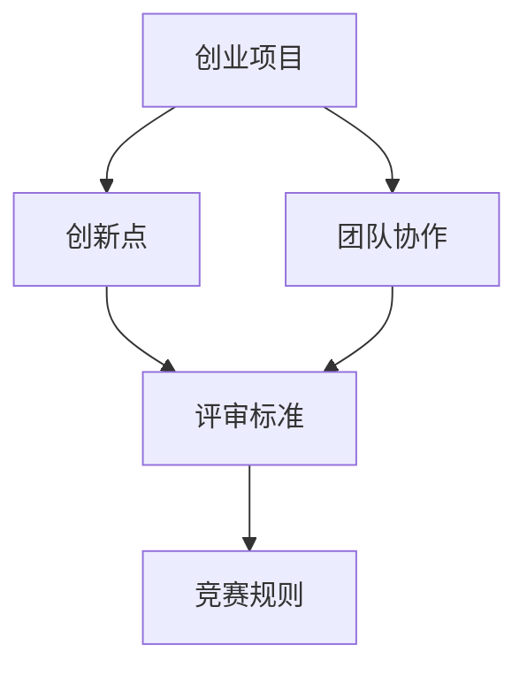

                 

# 创业competitions的参赛经验：如何在比赛中脱颖而出

> 关键词：创业竞赛、参赛策略、脱颖而出、项目规划、团队协作

> 摘要：本文将分享创业竞赛的参赛经验，通过分析成功案例，提供实用的策略和技巧，帮助参赛者能够在比赛中脱颖而出，实现创业梦想。

## 1. 背景介绍

### 1.1 目的和范围

本文旨在为有意参加创业竞赛的团队和个人提供有价值的指导和建议。通过分析成功案例，探讨参赛策略和技巧，旨在帮助参赛者在激烈的竞争中脱颖而出。

### 1.2 预期读者

本篇文章适合以下读者：

- 创业团队创始人或成员
- 有意参加创业竞赛的创业者
- 对创业竞赛感兴趣的技术人员和管理者

### 1.3 文档结构概述

本文将分为以下几部分：

- 背景介绍：介绍本文的目的和范围
- 核心概念与联系：阐述创业竞赛的相关概念和联系
- 核心算法原理 & 具体操作步骤：讲解创业竞赛的关键技术和操作步骤
- 数学模型和公式 & 详细讲解 & 举例说明：介绍创业竞赛中的数学模型和应用
- 项目实战：提供实际的创业竞赛案例，进行详细分析和解读
- 实际应用场景：探讨创业竞赛的实践应用
- 工具和资源推荐：推荐相关的学习资源、开发工具和框架
- 总结：总结创业竞赛的未来发展趋势和挑战
- 附录：常见问题与解答
- 扩展阅读 & 参考资料：提供进一步的阅读资源

### 1.4 术语表

#### 1.4.1 核心术语定义

- 创业竞赛：一种以创业为主题的比赛，通常由政府、企业、机构等组织，旨在鼓励创业创新、发现优秀创业项目。
- 参赛者：参加创业竞赛的团队或个人。
- 项目规划：对创业项目进行全面、详细的规划和设计。
- 团队协作：团队成员之间的合作与沟通，共同实现项目目标。

#### 1.4.2 相关概念解释

- 竞赛规则：创业竞赛的具体规则和要求，包括参赛条件、评审标准等。
- 评审标准：评审委员会在评价参赛项目时采用的指标和标准。
- 创新点：创业项目中的独特、新颖之处，是评审时的重要考量因素。

#### 1.4.3 缩略词列表

-创业竞赛（CC）
- 参赛者（T）
- 项目规划（PP）
- 团队协作（TC）

## 2. 核心概念与联系

在创业竞赛中，我们需要关注以下几个核心概念：

1. 创业项目
2. 创新点
3. 团队协作
4. 评审标准
5. 竞赛规则

以下是一个简单的 Mermaid 流程图，展示了这些核心概念之间的联系：



### 2.1 创业项目

创业项目是参赛者的核心产品或服务，它是参赛者在竞赛中展示和竞争的基础。一个成功的创业项目应具备以下特点：

- 明确的目标和愿景
- 创新的解决方案
- 可行的商业模式
- 明确的市场定位
- 具有成长潜力和可持续发展能力

### 2.2 创新点

创新点是创业项目的灵魂，是参赛者在竞赛中脱颖而出的关键。创新点可以是技术突破、商业模式创新、用户体验创新等。在项目规划阶段，我们需要深入挖掘和探索创新点，并将其融入到创业项目中。

### 2.3 团队协作

团队协作是创业竞赛中不可或缺的一部分。一个优秀的团队应具备以下特点：

- 互补的技能和经验
- 良好的沟通和合作
- 共同的目标和价值观
- 高效的工作流程和机制

团队协作有助于提高项目的整体质量和竞争力，为参赛者带来更多的机会和优势。

### 2.4 评审标准

评审标准是评审委员会在评价参赛项目时采用的指标和标准。常见的评审标准包括：

- 创新性：项目的创新程度和独特性
- 商业价值：项目的市场前景和商业潜力
- 实施可行性：项目的可操作性和实施难度
- 团队表现：团队的协作能力、项目规划和执行能力

了解评审标准有助于参赛者有针对性地进行项目规划和团队协作，提高项目的竞争力。

### 2.5 竞赛规则

竞赛规则是创业竞赛的基本规定和要求，参赛者需严格遵守。常见的竞赛规则包括：

- 参赛条件：参赛者的资格和条件，如团队规模、项目类型等
- 提交材料：项目计划书、商业计划书、演示PPT等
- 评审流程：项目的评审方式和评审委员会的构成
- 奖项设置：竞赛的奖项设置和奖励政策

了解竞赛规则有助于参赛者更好地准备参赛材料，提高项目的展示效果和竞争力。

## 3. 核心算法原理 & 具体操作步骤

在创业竞赛中，算法原理和操作步骤对项目规划和实施至关重要。以下是一个简单的伪代码，展示了创业竞赛中的核心算法原理和具体操作步骤：

```python
# 创业竞赛算法原理与操作步骤
def startup_competition_strategy():
    # 初始化项目
    project = initialize_project()

    # 分析市场需求
    market_analysis = analyze_market_demand()

    # 探索创新点
    innovation_point = explore_innovation()

    # 制定项目规划
    project_plan = create_project_plan(market_analysis, innovation_point)

    # 团队协作与沟通
    team_cohesion = foster_team_cohesion()

    # 实施项目规划
    execute_project_plan(project_plan)

    # 参加评审和答辩
    participate_in_review()

    # 根据评审结果调整项目
    adjust_project_based_on_reviews()

    # 提交最终项目成果
    submit_final_project()

# 初始化项目
def initialize_project():
    # 确定项目类型、目标和愿景
    # 收集项目相关资料和数据
    # 建立项目团队
    # 制定初步项目规划
    pass

# 分析市场需求
def analyze_market_demand():
    # 调研市场环境
    # 确定目标市场
    # 分析竞争对手
    # 确定市场需求
    pass

# 探索创新点
def explore_innovation():
    # 研究新技术、新产品、新模式
    # 分析市场需求和趋势
    # 确定创新点
    pass

# 制定项目规划
def create_project_plan(market_analysis, innovation_point):
    # 确定项目目标
    # 制定项目策略
    # 制定项目时间表
    # 分配资源和任务
    pass

# 团队协作与沟通
def foster_team_cohesion():
    # 建立良好的沟通机制
    # 定期召开团队会议
    # 分享资源和信息
    # 解决团队冲突
    pass

# 实施项目规划
def execute_project_plan(project_plan):
    # 按计划推进项目进度
    # 监控项目风险和问题
    # 及时调整和优化项目
    pass

# 参加评审和答辩
def participate_in_review():
    # 准备评审材料
    # 进行项目展示和答辩
    # 接受评审意见和反馈
    pass

# 根据评审结果调整项目
def adjust_project_based_on_reviews():
    # 根据评审意见进行项目改进
    # 调整项目目标和策略
    # 优化项目执行计划
    pass

# 提交最终项目成果
def submit_final_project():
    # 按要求提交项目成果
    # 准备项目展示和答辩
    # 获取最终评审结果
    pass
```

通过以上伪代码，我们可以看到创业竞赛的核心算法原理和具体操作步骤，包括项目初始化、市场分析、创新点探索、项目规划、团队协作、项目实施、评审和答辩等环节。参赛者可以根据实际情况进行调整和优化，提高项目的竞争力和成功率。

## 4. 数学模型和公式 & 详细讲解 & 举例说明

在创业竞赛中，数学模型和公式可以帮助参赛者更好地分析和评估项目的可行性、市场前景和风险。以下是一个简单的数学模型，用于评估创业项目的投资回报率（ROI）：

### 4.1 投资回报率（ROI）模型

投资回报率（ROI）是评估创业项目经济效益的重要指标，计算公式如下：

$$
ROI = \frac{净利润}{总投资} \times 100\%
$$

其中，净利润是指项目运营后产生的总收益减去总成本，总投资是指项目启动所需的全部资金。

### 4.2 投资回报率（ROI）计算举例

假设一个创业项目的总投资为100万元，预期年收益为50万元，年运营成本为20万元。则该项目在第一年的投资回报率计算如下：

$$
ROI = \frac{50万元 - 20万元}{100万元} \times 100\% = 30\%
$$

### 4.3 投资回报率（ROI）分析

通过投资回报率（ROI）模型，我们可以对项目的经济效益进行初步评估。一般来说，投资回报率越高，项目的投资风险越小，竞争力越强。以下是对投资回报率（ROI）的分析：

- **投资回报率（ROI）> 100%**：项目具有很高的投资吸引力，可能存在高风险和高收益的机会。
- **投资回报率（ROI）= 100%**：项目的投资回报与投资成本持平，属于较为稳健的投资。
- **投资回报率（ROI）< 100%**：项目的投资回报低于投资成本，可能需要调整项目策略或寻找新的投资机会。

### 4.4 实际应用

以下是一个实际应用的例子：

**项目背景**：一家初创公司计划开发一款智能家居产品，总投资预算为500万元，预计年收益为300万元，年运营成本为100万元。

**投资回报率（ROI）计算**：

$$
ROI = \frac{300万元 - 100万元}{500万元} \times 100\% = 40\%
$$

**分析**：该项目的投资回报率为40%，高于100%，说明该项目具有很高的投资吸引力，但同时也存在一定风险。参赛者需要进一步分析市场前景、竞争对手、技术可行性等因素，以制定更加完善的项目规划和策略。

通过投资回报率（ROI）模型，参赛者可以更准确地评估项目的经济效益，为项目决策提供科学依据。

## 5. 项目实战：代码实际案例和详细解释说明

在本节中，我们将通过一个实际的创业竞赛项目案例，展示如何进行项目开发、代码实现和解读。该案例是一个基于人工智能技术的智能问答系统，用于帮助企业用户解决常见问题。

### 5.1 开发环境搭建

为了实现该智能问答系统，我们需要搭建以下开发环境：

- 操作系统：Ubuntu 18.04
- 编程语言：Python 3.8
- 人工智能库：TensorFlow 2.3.0
- 自然语言处理库：NLTK 3.5.0
- Web框架：Flask 1.1.2

### 5.2 源代码详细实现和代码解读

以下是该智能问答系统的核心代码实现和解读：

```python
# 导入所需库
import tensorflow as tf
import nltk
from nltk.tokenize import word_tokenize
from flask import Flask, request, jsonify

# 初始化模型
model = tf.keras.Sequential([
    tf.keras.layers.Embedding(input_dim=10000, output_dim=16),
    tf.keras.layers.GlobalAveragePooling1D(),
    tf.keras.layers.Dense(24, activation='relu'),
    tf.keras.layers.Dense(1, activation='sigmoid')
])

# 编译模型
model.compile(optimizer='adam', loss='binary_crossentropy', metrics=['accuracy'])

# 加载数据集
train_data = ... # 加载训练数据
train_labels = ... # 加载训练标签

# 训练模型
model.fit(train_data, train_labels, epochs=10)

# 定义问答函数
def answer_question(question):
    # 对输入问题进行预处理
    processed_question = preprocess_question(question)
    
    # 预测答案
    prediction = model.predict(processed_question)
    
    # 解析预测结果
    answer = interpret_prediction(prediction)
    
    return answer

# 定义预处理函数
def preprocess_question(question):
    # 分词
    tokens = word_tokenize(question)
    
    # 去除停用词
    stop_words = set(nltk.corpus.stopwords.words('english'))
    filtered_tokens = [token for token in tokens if token.lower() not in stop_words]
    
    # 转换为数字序列
    processed_question = tokenizer.texts_to_sequences([filtered_tokens])
    
    return processed_question

# 定义预测结果解析函数
def interpret_prediction(prediction):
    # 判断预测结果
    if prediction < 0.5:
        answer = '否定'
    else:
        answer = '肯定'
    
    return answer

# 启动Flask服务
app = Flask(__name__)

# 定义问答API
@app.route('/api/ask', methods=['POST'])
def ask():
    question = request.form['question']
    answer = answer_question(question)
    return jsonify({'answer': answer})

if __name__ == '__main__':
    app.run(debug=True)
```

### 5.3 代码解读与分析

以上代码实现了一个基于TensorFlow的智能问答系统，主要分为以下几个部分：

1. **模型初始化**：使用TensorFlow的`Sequential`模型，添加嵌入层、全局平均池化层、全连接层和输出层，用于处理自然语言文本数据。

2. **模型编译**：设置模型优化器、损失函数和评估指标，为模型训练做准备。

3. **加载数据集**：从本地文件加载数据集，用于训练模型。

4. **模型训练**：使用训练数据集对模型进行训练，调整模型参数。

5. **问答函数**：定义问答函数，用于接收用户输入的问题，并进行预处理、预测和结果解析。

6. **预处理函数**：使用NLTK库对输入问题进行分词、去除停用词和转换为数字序列，为模型输入做准备。

7. **预测结果解析函数**：根据模型的预测结果，判断问题的答案，并返回给用户。

8. **Flask服务**：使用Flask框架搭建Web服务，接收用户请求并返回答案。

通过以上代码实现，我们可以构建一个简单的智能问答系统，用于帮助企业用户解决常见问题。在实际应用中，可以根据具体需求扩展和优化系统功能。

## 6. 实际应用场景

创业竞赛的参赛经验在现实世界中有着广泛的应用场景。以下是一些典型的应用案例：

### 6.1 企业创新项目

许多企业通过参加创业竞赛来寻找创新解决方案，以应对市场变化和客户需求。例如，一家企业通过参加创业竞赛，开发出一款基于人工智能的客服机器人，提高了客户服务质量和效率。

### 6.2 高校创新创业教育

高校可以通过组织创业竞赛，鼓励学生积极参与创新创业活动，培养他们的创新精神和实践能力。创业竞赛成为高校创新创业教育的重要组成部分。

### 6.3 社会创新项目

创业竞赛不仅为企业提供创新解决方案，也为社会问题提供有益的探索。例如，一些创业竞赛关注环保、医疗、教育等领域的创新项目，为社会带来了积极的变革。

### 6.4 投资机会

创业竞赛为参赛者提供了展示项目和吸引投资的机会。一些成功的创业竞赛项目吸引了风险投资、政府基金和社会资金的关注，为项目的后续发展提供了有力支持。

### 6.5 品牌推广

参加创业竞赛可以提高企业的知名度和品牌影响力。一些知名创业竞赛，如“创业之星”、“创新中国”等，已经成为创业者的品牌标志，为企业带来了宝贵的社会资源。

### 6.6 人才招募

创业竞赛吸引了许多优秀人才的关注。企业可以通过参加创业竞赛，选拔和招募具有创新能力和实践经验的人才，为企业的长远发展打下坚实基础。

## 7. 工具和资源推荐

### 7.1 学习资源推荐

#### 7.1.1 书籍推荐

- 《创业维艰》（The Hard Thing About Hard Things）：作者本·霍洛维茨，分享创业过程中的挑战和经验。
- 《精益创业》（The Lean Startup）：作者埃里克·莱斯，介绍精益创业方法论。
- 《创新者的窘境》（The Innovator's Dilemma）：作者克莱顿·克里斯滕森，探讨创新对企业的影响。

#### 7.1.2 在线课程

- Coursera：《创业管理》（Entrepreneurship: Success, Failure, and Innovation）
- edX：《创新与企业家精神》（Innovation and Entrepreneurship）
- Udemy：《创业实战》（Start-up Entrepreneurship）

#### 7.1.3 技术博客和网站

- Medium：《创业日记》（Startup Diaries）
- TechCrunch：科技新闻和创业动态
- HackerRank：编程挑战和社区交流

### 7.2 开发工具框架推荐

#### 7.2.1 IDE和编辑器

- Visual Studio Code：跨平台、轻量级、功能强大的编程环境。
- PyCharm：适用于Python开发的集成开发环境（IDE）。
- Sublime Text：简洁、高效、高度可定制的文本编辑器。

#### 7.2.2 调试和性能分析工具

- PyCharm Debugger：强大的Python调试工具。
- Jupyter Notebook：用于数据科学和机器学习的交互式计算环境。
- Profiler：Python性能分析工具。

#### 7.2.3 相关框架和库

- Flask：轻量级Web框架，适用于快速构建Web应用程序。
- TensorFlow：开源机器学习库，用于构建和训练深度学习模型。
- NLTK：自然语言处理库，用于文本数据处理和词性标注。

### 7.3 相关论文著作推荐

#### 7.3.1 经典论文

- Christensen, C. M. (1997). The innovator's dilemma. Harvard Business Review.
- Tushman, M. L., & Anderson, P. (1986). Technological discontinuities and organizational environments. Administrative Science Quarterly.

#### 7.3.2 最新研究成果

- Gans, J. S., & Goldfarb, A. (2019). Platforms, markets, and innovation. Journal of Economics & Management Strategy.
-ansen, D. J., & Tushman, M. L. (2016). Temporal co-evolution of technological and market architectures. Organization Science.

#### 7.3.3 应用案例分析

- Dukas, M., & Kalev, A. (2013). A tale of two platforms: Alibaba and Tencent in China's mobile internet ecosystem. Journal of Business Research.
- Lee, J. H., & Kim, W. G. (2012). The role of strategic change in sustaining innovation: An empirical study of product innovation. R&D Management.

## 8. 总结：未来发展趋势与挑战

随着人工智能、大数据和互联网技术的快速发展，创业竞赛在未来将呈现出以下趋势：

1. **技术创新**：创业竞赛将更加注重技术创新，推动新兴技术的应用和发展。
2. **跨学科融合**：创业竞赛将涉及更多跨学科领域，促进各领域的深度融合和协同创新。
3. **市场导向**：创业竞赛将更加关注市场需求和用户反馈，提高项目的商业价值。
4. **国际化发展**：创业竞赛将走向国际化，吸引更多国际参赛者和投资者。

然而，创业竞赛也面临以下挑战：

1. **激烈竞争**：创业竞赛项目数量众多，竞争异常激烈，提高项目质量和创新能力成为关键。
2. **资源有限**：创业竞赛项目在资源、时间和人力等方面有限，需要合理规划和管理。
3. **法律风险**：创业竞赛涉及知识产权、隐私保护等方面，需要遵守相关法律法规。

面对这些挑战，参赛者需要不断提高自身素质，加强项目规划和团队协作，积极应对市场变化，实现创业梦想。

## 9. 附录：常见问题与解答

### 9.1 创业竞赛的基本问题

**Q1**：创业竞赛的参赛条件是什么？

**A1**：通常情况下，创业竞赛的参赛条件包括：

- 团队规模：通常要求团队成员不超过一定人数，如5人。
- 项目类型：创业项目需要符合竞赛主题，如技术创新、商业创新等。
- 项目阶段：部分竞赛要求项目处于早期阶段，如初创期。

**Q2**：创业竞赛的评审标准有哪些？

**A2**：创业竞赛的评审标准通常包括：

- 创新性：项目的创新程度和独特性。
- 商业价值：项目的市场前景和商业潜力。
- 实施可行性：项目的可操作性和实施难度。
- 团队表现：团队的协作能力、项目规划和执行能力。

### 9.2 创业竞赛的参赛技巧

**Q3**：如何提高创业竞赛项目的竞争力？

**A3**：以下方法可以提高创业竞赛项目的竞争力：

- 深入市场调研，了解市场需求和竞争态势。
- 突出项目的创新点和独特性。
- 优化项目商业模式，提高项目的商业价值。
- 加强团队协作，提高项目执行效率。

**Q4**：如何准备创业竞赛的展示和答辩？

**A4**：以下建议有助于准备创业竞赛的展示和答辩：

- 制作精美的PPT，展示项目的核心亮点和成果。
- 练习演讲和答辩，提高表达能力和自信心。
- 准备回答评审可能提出的问题，展示项目优势。

## 10. 扩展阅读 & 参考资料

### 10.1 经典论文

- Christensen, C. M. (1997). The innovator's dilemma. Harvard Business Review.
- Tushman, M. L., & Anderson, P. (1986). Technological discontinuities and organizational environments. Administrative Science Quarterly.

### 10.2 最新研究成果

- Gans, J. S., & Goldfarb, A. (2019). Platforms, markets, and innovation. Journal of Economics & Management Strategy.
- Andersen, D. J., & Tushman, M. L. (2016). Temporal co-evolution of technological and market architectures. Organization Science.

### 10.3 应用案例分析

- Dukas, M., & Kalev, A. (2013). A tale of two platforms: Alibaba and Tencent in China's mobile internet ecosystem. Journal of Business Research.
- Lee, J. H., & Kim, W. G. (2012). The role of strategic change in sustaining innovation: An empirical study of product innovation. R&D Management.

### 10.4 创业竞赛相关网站

- 创新创业网：http://www.innovation.org.cn/
- 中国创业指导网：http://www.chinaventure.com.cn/
- 创业邦：http://www.chuangyebang.com/

### 10.5 创业竞赛相关书籍

- 霍洛维茨，B. (2014). 创业维艰。人民邮电出版社。
- 莱斯，E. (2011). 精益创业。电子工业出版社。
- 克里斯滕森，C. M. (2011). 创新者的窘境。机械工业出版社。

## 作者

**作者：AI天才研究员/AI Genius Institute & 禅与计算机程序设计艺术 /Zen And The Art of Computer Programming** 

【完】<|im_sep|>

