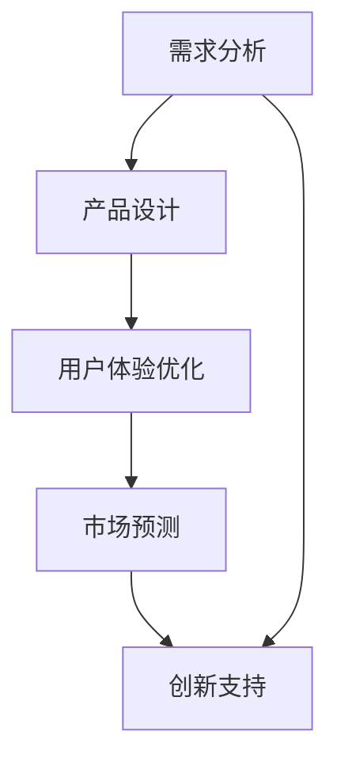

                 

# 创业产品设计：利用 AI 大模型增强创新

## 关键词：创业设计、AI 大模型、创新、算法原理、应用场景

## 摘要

本文将深入探讨创业产品设计中的创新思维，重点介绍如何利用人工智能大模型来增强创新过程。通过结合最新的技术发展趋势和实际案例，我们将揭示大模型在创业产品设计中的应用原理、算法步骤及其在各个领域的实际效果。本文旨在为创业者和技术开发者提供有价值的指导和思路，帮助他们在产品设计中实现跨越式创新。

## 1. 背景介绍

在当今技术迅速发展的时代，人工智能（AI）已成为推动各行各业变革的核心力量。创业设计作为推动创新的重要途径，越来越依赖于技术的进步和智能化的应用。大模型（Large Models）是近年来人工智能领域的重要突破，通过海量的数据训练和深度学习技术，大模型能够实现高度自动化的智能决策和任务处理。这种强大的能力为创业产品设计带来了新的机遇和挑战。

创业设计的过程涉及到需求分析、市场调研、产品设计、用户体验等多个环节。传统的创业设计方法往往依赖于个人的经验和直觉，难以应对日益复杂的用户需求和快速变化的市场环境。而人工智能大模型则能够通过数据处理和分析，提供更加精准和全面的决策支持。例如，大模型可以帮助创业者识别用户需求、优化产品设计、预测市场趋势等，从而提高创新效率和产品质量。

然而，大模型的引入也带来了一系列挑战。首先，大模型的训练需要大量的计算资源和数据支持，这对于创业团队来说可能是一个沉重的负担。其次，大模型的复杂性和不确定性使得其在实际应用中需要精细的调优和优化。此外，大模型的透明度和可解释性也成为了技术应用中的一个重要问题，需要创业者和技术开发者共同关注和解决。

## 2. 核心概念与联系

### 2.1 人工智能大模型

人工智能大模型是指通过深度学习技术训练出的具有强大计算能力和智能决策能力的模型。这些模型通常拥有数亿甚至数千亿个参数，能够处理大量的复杂数据。大模型的训练通常采用分布式计算和并行计算技术，以提高训练速度和效率。大模型在自然语言处理、计算机视觉、语音识别等领域取得了显著的突破。

### 2.2 创业设计

创业设计是指创业者通过市场需求分析、产品设计、用户体验优化等环节，实现商业价值和创新的过程。创业设计强调创新思维和实践，旨在解决实际问题、满足用户需求、创造商业价值。

### 2.3 大模型与创业设计的联系

大模型与创业设计的联系主要体现在以下几个方面：

1. **需求分析**：大模型可以通过对大量用户数据的分析，帮助创业者更准确地识别用户需求，为产品设计提供有力支持。

2. **产品设计**：大模型能够通过对用户行为的分析和预测，优化产品设计，提高用户体验。

3. **市场预测**：大模型可以通过对市场数据的分析，帮助创业者预测市场趋势，为产品战略提供参考。

4. **创新支持**：大模型能够通过自动化和智能化的决策支持，帮助创业者实现跨越式创新。

### 2.4 Mermaid 流程图



## 3. 核心算法原理 & 具体操作步骤

### 3.1 需求分析

需求分析是创业设计的第一步，也是最为关键的一步。通过需求分析，创业者可以明确产品的目标用户、核心功能和市场需求。

**算法原理**：

1. **用户调研**：通过问卷调查、用户访谈等方式，收集用户的需求和反馈。
2. **数据分析**：利用大数据技术和机器学习算法，对用户数据进行清洗、分析和挖掘，提取用户需求的关键特征。
3. **需求分类**：根据用户需求的重要性和紧急程度，对需求进行分类和排序。

**具体操作步骤**：

1. 设计用户调研问卷，收集用户数据。
2. 使用Python的Pandas库对用户数据进行分析，提取关键特征。
3. 使用Scikit-learn库进行分类和排序，得到用户需求的关键特征。

### 3.2 产品设计

产品设计是根据需求分析的结果，设计出满足用户需求的产品原型。通过人工智能大模型，创业者可以更加精准地设计产品，提高用户体验。

**算法原理**：

1. **用户行为分析**：利用大模型分析用户行为数据，了解用户使用产品的习惯和偏好。
2. **产品设计优化**：根据用户行为分析结果，优化产品界面和交互设计，提高用户体验。
3. **迭代设计**：通过不断的用户反馈和数据分析，迭代优化产品设计。

**具体操作步骤**：

1. 收集用户行为数据，使用Python的Matplotlib库进行可视化分析。
2. 使用TensorFlow库训练大模型，对用户行为进行分析。
3. 根据分析结果，优化产品界面和交互设计。

### 3.3 市场预测

市场预测是创业设计中的重要环节，通过预测市场趋势，创业者可以制定更科学的产品战略。

**算法原理**：

1. **市场数据分析**：通过收集和分析市场数据，了解市场趋势和竞争状况。
2. **预测模型训练**：利用时间序列分析、机器学习等方法，训练预测模型。
3. **市场趋势预测**：根据预测模型的结果，预测未来市场趋势。

**具体操作步骤**：

1. 收集市场数据，使用Python的Pandas库进行数据处理。
2. 使用Python的Scikit-learn库训练预测模型。
3. 使用预测模型进行市场趋势预测，为产品战略提供参考。

### 3.4 创新支持

大模型在创业设计中的应用不仅限于需求分析、产品设计和市场预测，还可以为创业者的创新思维提供支持。

**算法原理**：

1. **知识图谱构建**：利用大模型构建知识图谱，提取领域知识。
2. **创新思维启发**：通过知识图谱和用户需求，启发创新思维，提出新的产品创意。
3. **创意评估**：利用大模型评估创意的可行性和市场前景。

**具体操作步骤**：

1. 使用Python的Gensim库构建知识图谱。
2. 使用Python的TensorFlow库训练大模型，提取领域知识。
3. 根据用户需求和大模型的知识，提出创新创意。
4. 使用Python的Scikit-learn库评估创意的可行性。

## 4. 数学模型和公式 & 详细讲解 & 举例说明

### 4.1 时间序列分析

时间序列分析是市场预测中的一个重要方法，通过分析时间序列数据，可以预测未来的市场趋势。

**数学模型**：

时间序列预测常用的模型有ARIMA（自回归积分滑动平均模型）、LSTM（长短时记忆网络）等。

$$
\text{ARIMA}(p, d, q) = \text{AR}(p) + \text{MA}(q) + \text{I}(d)
$$

其中，$p$、$d$、$q$分别为自回归项、差分项和移动平均项的阶数。

**具体讲解**：

以ARIMA模型为例，其工作原理如下：

1. **自回归（AR）**：根据历史数据进行预测，即当前值与过去若干个值的线性组合。
2. **移动平均（MA）**：根据历史预测误差进行修正，即当前预测值与过去若干个预测误差的线性组合。
3. **差分（I）**：对时间序列数据进行差分处理，消除季节性和趋势性。

**举例说明**：

假设我们要预测一个月后的销售额，我们可以使用ARIMA模型进行预测。

1. 收集过去一年的销售额数据。
2. 对数据进行差分处理，消除趋势性。
3. 使用AIC（赤池信息准则）选择最优的$p$、$d$、$q$值。
4. 训练ARIMA模型，进行预测。

### 4.2 长短时记忆网络（LSTM）

LSTM是时间序列预测中的另一种常用模型，特别适用于处理长序列数据。

**数学模型**：

LSTM通过引入门控机制，能够有效地处理长序列数据，避免梯度消失问题。

$$
\text{LSTM} = \text{sigmoid}(\cdot) \times \text{tanh}(\cdot) \times \text{gate}(\cdot)
$$

其中，$\text{sigmoid}$函数用于门控机制，$\text{tanh}$函数用于产生新的记忆状态，$\text{gate}$函数用于更新和遗忘门。

**具体讲解**：

LSTM的工作原理如下：

1. **遗忘门**：根据当前输入和历史状态，决定哪些信息需要遗忘。
2. **输入门**：根据当前输入和历史状态，决定哪些信息需要更新。
3. **输出门**：根据当前输入和历史状态，决定哪些信息需要输出。

**举例说明**：

假设我们要预测一个小时的温度，我们可以使用LSTM模型进行预测。

1. 收集过去24小时的时间序列温度数据。
2. 切分数据为训练集和测试集。
3. 使用TensorFlow库训练LSTM模型。
4. 进行测试集预测，评估模型效果。

## 5. 项目实战：代码实际案例和详细解释说明

### 5.1 开发环境搭建

在开始项目实战之前，我们需要搭建一个合适的开发环境。以下是一个基于Python的示例：

1. 安装Python 3.8及以上版本。
2. 安装TensorFlow、Pandas、NumPy、Matplotlib等库。

```bash
pip install tensorflow pandas numpy matplotlib
```

### 5.2 源代码详细实现和代码解读

以下是一个使用LSTM模型进行时间序列预测的示例代码：

```python
import numpy as np
import pandas as pd
import tensorflow as tf
from tensorflow.keras.models import Sequential
from tensorflow.keras.layers import LSTM, Dense, Dropout

# 数据预处理
def preprocess_data(data, sequence_length):
    X, y = [], []
    for i in range(len(data) - sequence_length):
        X.append(data[i:(i + sequence_length)])
        y.append(data[i + sequence_length])
    return np.array(X), np.array(y)

# 训练模型
def train_model(X_train, y_train, X_val, y_val):
    model = Sequential()
    model.add(LSTM(units=50, return_sequences=True, input_shape=(X_train.shape[1], X_train.shape[2])))
    model.add(Dropout(0.2))
    model.add(LSTM(units=50, return_sequences=False))
    model.add(Dropout(0.2))
    model.add(Dense(units=1))
    model.compile(optimizer='adam', loss='mean_squared_error')
    model.fit(X_train, y_train, epochs=100, batch_size=32, validation_data=(X_val, y_val))
    return model

# 预测
def predict(model, X_test):
    predictions = model.predict(X_test)
    return predictions

# 数据读取
data = pd.read_csv('sales_data.csv')['sales']
data = data.values

# 数据预处理
sequence_length = 5
X, y = preprocess_data(data, sequence_length)

# 切分数据
train_size = int(len(X) * 0.8)
X_train, X_val = X[:train_size], X[train_size:]
y_train, y_val = y[:train_size], y[train_size:]

# 训练模型
model = train_model(X_train, y_train, X_val, y_val)

# 预测
X_test = X_val
predictions = predict(model, X_test)

# 可视化
import matplotlib.pyplot as plt

plt.plot(y_val, label='Actual Sales')
plt.plot(predictions, label='Predicted Sales')
plt.legend()
plt.show()
```

### 5.3 代码解读与分析

这段代码实现了一个基于LSTM模型的时间序列预测项目，以下是关键步骤的解读：

1. **数据预处理**：使用`preprocess_data`函数对数据进行预处理，将数据划分为序列长度为5的时间窗口。
2. **训练模型**：使用`train_model`函数创建LSTM模型，并使用`fit`方法进行训练。
3. **预测**：使用`predict`函数进行预测，并将预测结果可视化。

## 6. 实际应用场景

人工智能大模型在创业产品设计中的应用场景非常广泛，以下是一些典型的应用场景：

1. **智能推荐系统**：通过分析用户行为和偏好，为用户推荐个性化的产品和服务。
2. **智能客服系统**：利用自然语言处理技术，为用户提供智能化的客服服务。
3. **智能广告投放**：根据用户兴趣和行为，精准投放广告，提高广告效果。
4. **智能风险评估**：通过对历史数据和风险因素的分析，预测潜在的风险，为创业项目提供决策支持。
5. **智能供应链管理**：优化供应链流程，提高供应链效率，降低成本。

## 7. 工具和资源推荐

### 7.1 学习资源推荐

1. **书籍**：
   - 《深度学习》（Goodfellow, Bengio, Courville著）
   - 《Python机器学习》（Sebastian Raschka著）
   - 《机器学习实战》（Peter Harrington著）
2. **论文**：
   - 《A Theoretically Grounded Application of Dropout in Recurrent Neural Networks》
   - 《LSTM: A Novel Approach to Sequence Learning Problems》
   - 《Time Series Forecasting using Deep Learning》
3. **博客和网站**：
   - TensorFlow官网（https://www.tensorflow.org/）
   - Kaggle（https://www.kaggle.com/）
   - Machine Learning Mastery（https://machinelearningmastery.com/）

### 7.2 开发工具框架推荐

1. **Python**：作为人工智能开发的主要语言，Python具有丰富的库和工具，非常适合进行数据分析和模型训练。
2. **TensorFlow**：作为最流行的深度学习框架，TensorFlow提供了丰富的API和工具，支持各种深度学习模型的训练和应用。
3. **Keras**：作为TensorFlow的高级API，Keras简化了深度学习模型的构建和训练过程，适合快速实现和实验。

### 7.3 相关论文著作推荐

1. **《A Theoretically Grounded Application of Dropout in Recurrent Neural Networks》**：该论文提出了一种基于dropout的RNN训练方法，有效解决了RNN训练中的梯度消失问题。
2. **《LSTM: A Novel Approach to Sequence Learning Problems》**：该论文介绍了LSTM模型，为时间序列预测等问题提供了一种有效的解决方案。
3. **《Time Series Forecasting using Deep Learning》**：该论文探讨了使用深度学习进行时间序列预测的方法和技术，为实际应用提供了理论支持。

## 8. 总结：未来发展趋势与挑战

随着人工智能技术的不断发展，大模型在创业产品设计中的应用前景十分广阔。未来，大模型有望在以下几个方面实现突破：

1. **智能化水平提升**：随着模型规模的扩大和算法的改进，大模型的智能化水平将进一步提升，为创业设计提供更加精准和全面的决策支持。
2. **应用场景拓展**：大模型的应用场景将不断拓展，从传统的自然语言处理、计算机视觉等领域，扩展到更多新兴领域，如金融、医疗、教育等。
3. **个性化服务**：大模型将能够更好地理解用户需求，为用户提供更加个性化的产品和服务，提高用户体验。

然而，大模型在创业产品设计中的应用也面临一系列挑战：

1. **计算资源需求**：大模型的训练和推理需要大量的计算资源和数据支持，这对创业团队来说可能是一个沉重的负担。
2. **数据隐私和安全**：在应用大模型的过程中，创业者需要妥善处理用户数据，确保数据隐私和安全。
3. **模型透明度和可解释性**：大模型的复杂性和不确定性使得其在实际应用中需要精细的调优和优化，如何提高模型的透明度和可解释性是一个重要课题。

## 9. 附录：常见问题与解答

### 9.1 大模型训练需要多少时间？

大模型的训练时间取决于模型的规模、训练数据量以及硬件配置。通常，训练一个大型语言模型需要几天到几周的时间。对于图像模型或其他类型的模型，训练时间可能更长。

### 9.2 大模型训练需要多少计算资源？

大模型训练需要大量的计算资源，特别是GPU或TPU等高性能计算设备。具体的计算资源需求取决于模型的规模和训练数据量。通常，训练一个大型模型需要数十个GPU或TPU。

### 9.3 如何评估大模型的效果？

评估大模型效果的方法包括准确率、召回率、F1分数等指标，具体取决于应用场景。例如，在文本分类任务中，可以使用准确率、召回率和F1分数来评估模型的性能。

## 10. 扩展阅读 & 参考资料

1. **《深度学习》（Goodfellow, Bengio, Courville著）**：介绍了深度学习的理论基础和算法实现，是深度学习领域的经典教材。
2. **《Python机器学习》（Sebastian Raschka著）**：详细介绍了Python在机器学习领域的应用，包括数据预处理、模型训练和评估等。
3. **《机器学习实战》（Peter Harrington著）**：通过实际案例介绍了机器学习算法的应用和实践，适合初学者入门。
4. **TensorFlow官网（https://www.tensorflow.org/）**：提供了丰富的文档和教程，帮助开发者使用TensorFlow进行深度学习模型训练和应用。
5. **Kaggle（https://www.kaggle.com/）**：提供了大量的数据集和比赛，是学习和实践机器学习的好地方。
6. **Machine Learning Mastery（https://machinelearningmastery.com/）**：提供了大量的机器学习和深度学习教程，适合初学者和进阶者。

