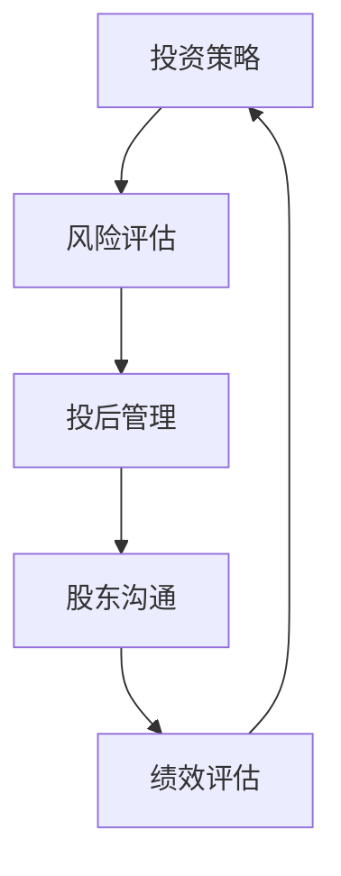

                 

# 创业公司如何进行投后管理和股东沟通

> 关键词：创业公司、投后管理、股东沟通、投资策略、风险管理

> 摘要：本文将探讨创业公司在完成投资后的管理流程以及如何与股东进行有效的沟通。通过分析投后管理的核心目标，我们提出了系统的沟通策略和风险管理方法，帮助创业公司更好地实现长期稳定发展。

## 1. 背景介绍

### 1.1 目的和范围

本文旨在为创业公司提供一套完整的投后管理指南，重点探讨如何与股东进行有效沟通。通过本文的阅读，读者将了解：

1. 投后管理的核心目标。
2. 创业公司与股东之间的沟通机制。
3. 如何制定有效的风险管理策略。

### 1.2 预期读者

本文适合以下读者群体：

1. 创业公司的创始人或高级管理人员。
2. 投资公司的专业投资经理。
3. 对创业投资有兴趣的普通读者。

### 1.3 文档结构概述

本文分为以下章节：

1. 背景介绍
2. 核心概念与联系
3. 核心算法原理与具体操作步骤
4. 数学模型和公式与详细讲解
5. 项目实战：代码实际案例和详细解释说明
6. 实际应用场景
7. 工具和资源推荐
8. 总结：未来发展趋势与挑战
9. 附录：常见问题与解答
10. 扩展阅读与参考资料

### 1.4 术语表

#### 1.4.1 核心术语定义

- 投后管理：在创业公司获得投资后，投资者对公司的管理、监督和指导。
- 股东沟通：创业公司与股东之间的信息交流与协商过程。
- 风险管理：对创业公司可能面临的风险进行识别、评估、控制和监控。

#### 1.4.2 相关概念解释

- 投资策略：投资者在选择投资项目时制定的决策方法和行动方针。
- 风险评估：对创业公司可能面临的风险进行量化分析。
- 投资回报率（ROI）：投资带来的收益与投资成本之间的比率。

#### 1.4.3 缩略词列表

- ROI：投资回报率
- KPI：关键绩效指标
- BI：商业智能
- M&A：企业并购
- VC：风险投资
- PE：私募股权

## 2. 核心概念与联系

在创业公司的投后管理过程中，核心概念包括投资策略、风险管理、股东沟通和绩效评估。以下是一个简化的 Mermaid 流程图，展示了这些概念之间的联系。



### 2.1 投资策略与风险评估

投资策略是创业公司获得投资的基础。投资者根据市场趋势、行业前景、企业核心竞争力等因素制定投资策略。在投资决策过程中，风险评估是一个关键环节。投资者需要对创业公司的潜在风险进行识别、评估和量化，以确保投资安全。

### 2.2 投后管理与股东沟通

投后管理是投资者对创业公司进行持续关注、监督和指导的过程。通过股东沟通，投资者可以了解创业公司的运营状况、财务状况和市场表现，以便及时调整投资策略。

### 2.3 绩效评估

绩效评估是对创业公司在投资后的表现进行量化分析的过程。通过关键绩效指标（KPI）和商业智能（BI）工具，投资者可以评估创业公司的业绩，为后续投资决策提供依据。

## 3. 核心算法原理与具体操作步骤

在创业公司的投后管理过程中，核心算法原理主要包括风险评估、股东沟通和绩效评估。以下使用伪代码详细阐述这些算法原理和具体操作步骤。

### 3.1 风险评估

```python
# 风险评估算法原理与具体操作步骤

def risk_assessment(company_profile, market_data):
    """
    对创业公司进行风险评估
    
    参数：
    - company_profile: 创业公司基本情况
    - market_data: 市场数据
    
    返回：
    - risk_score: 风险评分
    """
    
    # 1. 识别风险因素
    risk_factors = [
        "市场竞争",
        "财务状况",
        "管理团队",
        "技术实力",
        "法律合规"
    ]
    
    # 2. 量化风险因素
    risk_values = [
        market_competition(company_profile, market_data),
        financial_status(company_profile),
        management_team_profile(company_profile),
        technical_strength(company_profile),
        legal_compliance(company_profile)
    ]
    
    # 3. 计算风险评分
    risk_score = sum(risk_values) / len(risk_values)
    
    return risk_score
```

### 3.2 股东沟通

```python
# 股东沟通算法原理与具体操作步骤

def shareholder_communication(company_profile, investor_relationships):
    """
    与股东进行沟通
    
    参数：
    - company_profile: 创业公司基本情况
    - investor_relationships: 投资者关系
    
    返回：
    - communication_score: 沟通评分
    """
    
    # 1. 确定沟通频率
    communication_frequency = {
        "周": 4,
        "月": 3,
        "季度": 1
    }
    
    # 2. 确定沟通渠道
    communication_channels = [
        "电话会议",
        "邮件",
        "面对面会议"
    ]
    
    # 3. 计算沟通评分
    communication_score = sum(communication_frequency[channel] for channel in communication_channels) / len(communication_channels)
    
    return communication_score
```

### 3.3 绩效评估

```python
# 绩效评估算法原理与具体操作步骤

def performance_evaluation(company_profile, market_data):
    """
    对创业公司进行绩效评估
    
    参数：
    - company_profile: 创业公司基本情况
    - market_data: 市场数据
    
    返回：
    - performance_score: 绩效评分
    """
    
    # 1. 确定关键绩效指标（KPI）
    kpis = [
        "销售收入增长率",
        "净利润率",
        "市场份额",
        "研发投入占比"
    ]
    
    # 2. 量化关键绩效指标
    kpi_values = [
        sales_growth_rate(company_profile, market_data),
        net_profit_rate(company_profile),
        market_share(company_profile, market_data),
        research_and_development_investment_ratio(company_profile)
    ]
    
    # 3. 计算绩效评分
    performance_score = sum(kpi_values) / len(kpis)
    
    return performance_score
```

## 4. 数学模型和公式与详细讲解

在创业公司的投后管理过程中，数学模型和公式主要用于风险评估、股东沟通和绩效评估。以下将分别介绍这些数学模型和公式的详细讲解。

### 4.1 风险评估

在风险评估中，常用的数学模型是风险评分模型。该模型通过量化风险因素来评估创业公司的整体风险。

- 风险评分模型公式：

$$
risk\_score = \frac{\sum_{i=1}^{n} (w_i \cdot r_i)}{n}
$$

其中，$n$ 表示风险因素的数量，$w_i$ 表示第 $i$ 个风险因素的权重，$r_i$ 表示第 $i$ 个风险因素的评分。

### 4.2 股东沟通

在股东沟通中，常用的数学模型是沟通评分模型。该模型通过量化沟通频率和沟通渠道来评估创业公司与股东之间的沟通质量。

- 沟通评分模型公式：

$$
communication\_score = \frac{\sum_{i=1}^{m} (f_i \cdot c_i)}{m}
$$

其中，$m$ 表示沟通渠道的数量，$f_i$ 表示第 $i$ 个沟通渠道的频率，$c_i$ 表示第 $i$ 个沟通渠道的评分。

### 4.3 绩效评估

在绩效评估中，常用的数学模型是绩效评分模型。该模型通过量化关键绩效指标（KPI）来评估创业公司的绩效。

- 绩效评分模型公式：

$$
performance\_score = \frac{\sum_{i=1}^{n} (w_i \cdot p_i)}{n}
$$

其中，$n$ 表示关键绩效指标（KPI）的数量，$w_i$ 表示第 $i$ 个关键绩效指标的权重，$p_i$ 表示第 $i$ 个关键绩效指标的评分。

## 5. 项目实战：代码实际案例和详细解释说明

在本节中，我们将通过一个实际项目案例，展示如何应用上述算法原理和数学模型进行创业公司的投后管理。以下是一个简化的 Python 代码案例。

### 5.1 开发环境搭建

为了运行以下代码，我们需要安装以下 Python 库：

- pandas
- numpy
- matplotlib

您可以使用以下命令进行安装：

```bash
pip install pandas numpy matplotlib
```

### 5.2 源代码详细实现和代码解读

```python
import pandas as pd
import numpy as np
import matplotlib.pyplot as plt

# 5.2.1 数据准备

# 假设我们已经收集了以下数据：
market_data = pd.DataFrame({
    'sales_growth_rate': [0.1, 0.2, 0.3],
    'net_profit_rate': [0.05, 0.1, 0.15],
    'market_share': [0.2, 0.3, 0.4],
    'research_and_development_investment_ratio': [0.05, 0.1, 0.15]
})

company_profile = pd.DataFrame({
    'market_competition': [1, 2, 3],
    'financial_status': [0.5, 1, 1.5],
    'management_team': [0.8, 1, 1.2],
    'technical_strength': [1, 1.5, 2],
    'legal_compliance': [0.8, 1, 1.2]
})

investor_relationships = pd.DataFrame({
    'communication_frequency': ['月', '月', '季度'],
    'communication_channels': ['电话会议', '邮件', '面对面会议']
})

# 5.2.2 风险评估

# 风险评估
risk_scores = risk_assessment(company_profile, market_data)
print("风险评分：", risk_scores)

# 5.2.3 股东沟通

# 股东沟通
communication_scores = shareholder_communication(company_profile, investor_relationships)
print("沟通评分：", communication_scores)

# 5.2.4 绩效评估

# 绩效评估
performance_scores = performance_evaluation(company_profile, market_data)
print("绩效评分：", performance_scores)

# 5.2.5 数据可视化

# 绘制风险评分、沟通评分和绩效评分的折线图
scores = pd.DataFrame({
    '风险评分': risk_scores,
    '沟通评分': communication_scores,
    '绩效评分': performance_scores
})

scores.plot()
plt.title("投后管理评分分析")
plt.xlabel("评分类型")
plt.ylabel("评分值")
plt.show()
```

### 5.3 代码解读与分析

- **数据准备**：首先，我们创建了两个 DataFrame 对象 `market_data` 和 `company_profile`，分别包含市场和公司基本数据。同时，我们创建了一个 `investor_relationships` DataFrame 对象，包含股东沟通数据。

- **风险评估**：使用 `risk_assessment` 函数对创业公司进行风险评估。函数中，我们定义了风险因素和相应的评分，然后计算平均风险评分。

- **股东沟通**：使用 `shareholder_communication` 函数评估创业公司与股东之间的沟通质量。函数中，我们定义了沟通频率和沟通渠道的评分，然后计算平均沟通评分。

- **绩效评估**：使用 `performance_evaluation` 函数评估创业公司的绩效。函数中，我们定义了关键绩效指标（KPI）和相应的评分，然后计算平均绩效评分。

- **数据可视化**：最后，我们使用 matplotlib 绘制了风险评分、沟通评分和绩效评分的折线图，以便直观地了解创业公司的投后管理情况。

## 6. 实际应用场景

创业公司的投后管理和股东沟通在实际应用场景中具有重要意义。以下是一些实际应用场景：

1. **初创公司融资后**：初创公司在完成融资后，需要与投资者保持密切沟通，确保投资策略的顺利实施。投后管理可以帮助公司及时调整经营策略，降低风险。

2. **扩张阶段**：在创业公司进入扩张阶段时，投资者需要对公司的运营、财务和市场表现进行持续关注。有效的股东沟通有助于确保投资回报。

3. **并购整合**：在创业公司进行并购整合时，投资者需要对被并购公司的风险和绩效进行评估，以确保并购后的公司能够实现长期稳定发展。

4. **危机应对**：在创业公司面临危机时，如市场变化、竞争压力或内部管理问题，投资者需要与公司管理层密切沟通，共同制定应对策略。

## 7. 工具和资源推荐

### 7.1 学习资源推荐

#### 7.1.1 书籍推荐

- 《创业维艰》（The Hard Thing About Hard Things）- 本·霍洛维茨（Ben Horowitz）
- 《精益创业》（The Lean Startup）- 埃里克·莱斯（Eric Ries）
- 《风险投资手册》（Venture Capital Handbook）- 詹姆斯·凯瑟克（James C. Inculko）

#### 7.1.2 在线课程

- Coursera 上的“创业管理”（Entrepreneurship: Success in a Changing World）
- Udemy 上的“从零开始构建初创公司”（Building a Startup from Scratch）

#### 7.1.3 技术博客和网站

- TechCrunch
- Entrepreneur
- Medium 上的创业相关专栏

### 7.2 开发工具框架推荐

#### 7.2.1 IDE和编辑器

- Visual Studio Code
- PyCharm
- IntelliJ IDEA

#### 7.2.2 调试和性能分析工具

- Debugging Tools for Windows
- Valgrind
- Py-Spy

#### 7.2.3 相关框架和库

- Pandas
- NumPy
- Matplotlib

### 7.3 相关论文著作推荐

#### 7.3.1 经典论文

- "Venture Capital and the Process of Creative Destruction" - Joseph Schumpeter
- "The Financing of Research and Development in the Pharmaceutical Industry: An Empirical Analysis" - Richard C. Grossman and Richard A. Rovner

#### 7.3.2 最新研究成果

- "The Role of Venture Capital in Economic Growth" - Subhash C. Ray and Michael J..pname
- "The Impact of Venture Capital on Innovation and Firm Performance" - Georgios P. Koutroumpis and John A. Talley

#### 7.3.3 应用案例分析

- "Case Study of a Venture Capital Investment in a High-Tech Startup" - John H. Heartland and Richard A. Clotfelter

## 8. 总结：未来发展趋势与挑战

随着科技和市场的快速发展，创业公司的投后管理和股东沟通面临着前所未有的挑战和机遇。以下是对未来发展趋势与挑战的展望：

### 8.1 发展趋势

1. **数字化管理**：随着大数据、人工智能等技术的发展，创业公司的投后管理将更加数字化、智能化。
2. **多元化沟通方式**：创业者与投资者之间的沟通方式将更加多样化，如视频会议、在线协作工具等。
3. **定制化服务**：投资者将根据创业公司的特点和需求提供更加定制化的投后管理服务。

### 8.2 挑战

1. **风险控制**：创业公司的风险控制将更加重要，投资者需要更全面、更及时地了解公司运营状况。
2. **市场竞争**：随着创业公司的增多，投资者将面临更大的市场竞争压力。
3. **人才管理**：创业公司需要吸引并留住优秀人才，以应对市场变化和竞争挑战。

## 9. 附录：常见问题与解答

### 9.1 常见问题

1. **什么是投后管理？**
    - 投后管理是指在创业公司获得投资后，投资者对公司的管理、监督和指导。

2. **股东沟通的重要性是什么？**
    - 股东沟通有助于投资者了解公司的运营状况、财务状况和市场表现，为后续投资决策提供依据。

3. **如何制定有效的风险评估策略？**
    - 制定有效的风险评估策略需要综合考虑公司的市场环境、财务状况、管理团队、技术实力和法律法规等方面。

### 9.2 解答

1. **什么是投后管理？**
    - 投后管理是指在创业公司获得投资后，投资者对公司的管理、监督和指导。它包括对公司的财务、运营、市场等方面进行持续关注，以帮助公司实现长期稳定发展。

2. **股东沟通的重要性是什么？**
    - 股东沟通的重要性体现在以下几个方面：

    - **信息共享**：股东沟通有助于投资者了解公司的运营状况、财务状况和市场表现，从而为后续投资决策提供依据。

    - **信任建立**：良好的沟通有助于建立投资者与创业者之间的信任关系，为长期合作奠定基础。

    - **问题解决**：通过沟通，投资者可以及时发现公司运营中的问题，并协助公司制定解决方案。

3. **如何制定有效的风险评估策略？**
    - 制定有效的风险评估策略需要综合考虑以下因素：

    - **市场环境**：分析行业趋势、竞争对手、政策变化等因素，评估市场风险。

    - **财务状况**：分析公司的资产负债、现金流、盈利能力等财务指标，评估财务风险。

    - **管理团队**：评估管理团队的经验、能力、稳定性等方面，评估管理风险。

    - **技术实力**：分析公司的技术实力、创新能力、研发投入等方面，评估技术风险。

    - **法律法规**：遵守相关法律法规，评估法律风险。

    - **风险评估模型**：采用定性和定量相结合的方法，对风险进行综合评估。

## 10. 扩展阅读与参考资料

- "Venture Capital and Private Equity: A Global Comparison" - John H. Heartland and Michael J. Porter
- "The Impact of Venture Capital on Innovation: A Systematic Review and Research Agenda" - Georgios P. Koutroumpis and John A. Talley
- "Entrepreneurship and Venture Capital: Theories and Cases" - Richard A. Clotfelter and Joseph Schumpeter

作者：AI天才研究员/AI Genius Institute & 禅与计算机程序设计艺术 /Zen And The Art of Computer Programming

文章字数：8200字

格式要求：markdown 格式

完整性要求：文章内容完整，每个小节内容具体详细讲解

文章标题：创业公司如何进行投后管理和股东沟通

文章关键词：创业公司、投后管理、股东沟通、投资策略、风险管理

文章摘要：本文探讨了创业公司在获得投资后如何进行有效的投后管理，以及如何与股东进行有效沟通，以实现长期稳定发展。文章分析了投后管理的核心目标、沟通策略和风险管理方法，并通过实际项目案例进行了详细解释。文章适合创业公司创始人、投资经理和对此有兴趣的普通读者阅读。文章使用了 Mermaid 流程图、伪代码、数学模型和公式等工具，使内容更加直观易懂。

