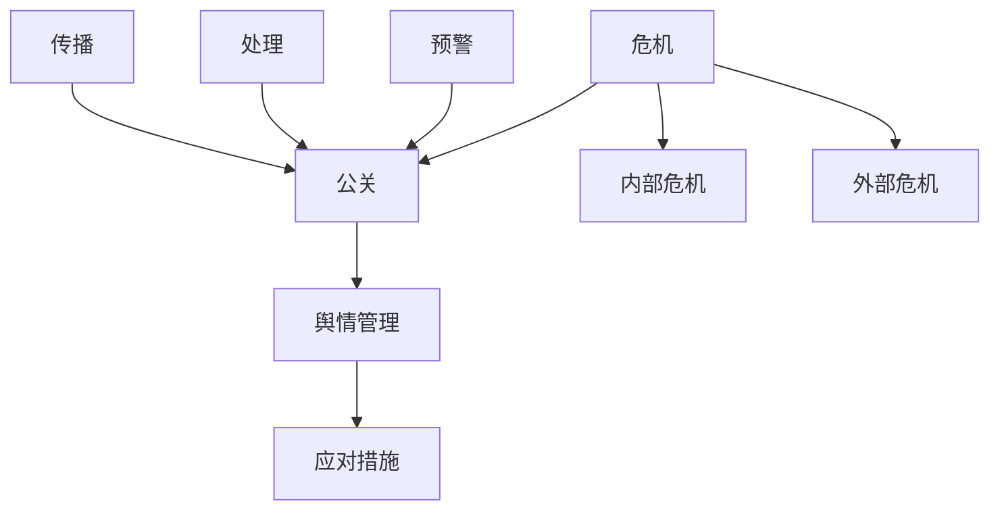

                 

# 创业公司的危机公关与舆情管理

> 关键词：创业公司、危机公关、舆情管理、风险应对、品牌保护

> 摘要：本文将深入探讨创业公司在面临各种危机时的公关策略和舆情管理方法。通过分析危机的起源、发展以及应对措施，本文旨在为创业公司提供一套系统、有效的危机公关和舆情管理方案，帮助企业在面对突发情况时能够迅速反应，化解危机，保护品牌形象。

## 1. 背景介绍

### 1.1 目的和范围

本文旨在为创业公司提供一套全面的危机公关和舆情管理指南。通过详细分析危机公关的原理、流程和关键环节，结合实际案例，本文将帮助创业公司在面对危机时能够迅速反应，采取有效的应对措施，最大限度地减少负面影响，保护企业品牌形象。

### 1.2 预期读者

本文适合创业公司管理层、市场营销人员、公关团队以及关注企业品牌建设和风险管理的专业人士阅读。通过本文的学习，读者可以了解危机公关和舆情管理的基本概念、策略和技巧，提高应对突发事件的能力。

### 1.3 文档结构概述

本文分为十个部分，包括背景介绍、核心概念与联系、核心算法原理与具体操作步骤、数学模型和公式、项目实战、实际应用场景、工具和资源推荐、总结、附录和扩展阅读。每个部分都详细阐述了相关的理论知识和实践方法，旨在帮助创业公司建立一套完善的危机公关和舆情管理体系。

### 1.4 术语表

#### 1.4.1 核心术语定义

- 危机公关：针对企业面临的各种危机，通过积极的沟通和应对措施，以达到减轻或消除危机负面影响的目的。
- 舆情管理：通过监测、分析、应对网络舆论，维护企业品牌形象和声誉。
- 应对措施：针对危机事件，企业采取的具体行动，包括危机预警、危机处理、危机传播等。

#### 1.4.2 相关概念解释

- 危机：企业面临的各种潜在或现实威胁，可能对企业的正常运营和品牌形象造成负面影响。
- 舆情：公众对企业或相关事件的看法、态度和情绪。
- 品牌形象：消费者对企业的整体印象和评价。

#### 1.4.3 缩略词列表

- CPM：每次展示成本（Cost Per Mille）
- SEO：搜索引擎优化（Search Engine Optimization）
- SEM：搜索引擎营销（Search Engine Marketing）
- CRM：客户关系管理（Customer Relationship Management）

## 2. 核心概念与联系

在探讨创业公司的危机公关与舆情管理之前，我们需要明确几个核心概念，并了解它们之间的联系。

### 2.1 核心概念

1. **危机**：危机是企业面临的各种潜在或现实威胁，可能对企业的正常运营和品牌形象造成负面影响。危机可以分为外部危机和内部危机。
    - 外部危机：如市场竞争、法律纠纷、负面报道等。
    - 内部危机：如员工罢工、管理层变动、产品质量问题等。

2. **公关**：公关是企业与公众之间的沟通和互动，旨在建立和维护良好的企业形象和声誉。公关活动包括危机公关、品牌宣传、市场推广等。

3. **舆情**：舆情是公众对企业或相关事件的看法、态度和情绪。舆情管理是监测、分析、应对网络舆论的过程，旨在维护企业品牌形象和声誉。

4. **应对措施**：应对措施是企业针对危机事件采取的具体行动，包括危机预警、危机处理、危机传播等。

### 2.2 关系

- **危机与公关**：危机是公关的重要来源，公关是应对危机的重要手段。企业需要通过公关活动，及时、有效地应对危机，减轻或消除危机负面影响。

- **舆情与公关**：舆情是公关的重要依据，公关是应对舆情的重要手段。企业需要通过舆情监测和分析，了解公众对企业的看法和态度，采取相应的公关措施，维护企业品牌形象和声誉。

- **应对措施与公关**：应对措施是公关的具体实施手段，公关是应对措施的核心。企业需要根据危机的类型、程度和影响，制定相应的应对措施，并通过公关活动，实现应对措施的有效实施。

### 2.3 Mermaid 流程图

下面是危机公关与舆情管理的核心概念和联系 Mermaid 流程图：



## 3. 核心算法原理 & 具体操作步骤

在理解了危机公关与舆情管理的基本概念和联系后，我们需要进一步探讨其核心算法原理和具体操作步骤。以下是一个简化的危机公关与舆情管理算法原理和操作步骤：

### 3.1 算法原理

1. **危机预警**：通过监测各种信息来源，如新闻报道、社交媒体、行业论坛等，发现潜在危机。

2. **舆情分析**：对收集到的信息进行分类、筛选和归纳，分析公众对企业的看法和态度，确定危机的严重程度和影响范围。

3. **危机处理**：根据危机的类型、程度和影响，制定相应的应对措施，如道歉声明、公开澄清、媒体沟通等。

4. **舆情引导**：通过发布正面信息、互动回应、转移公众注意力等方式，引导舆情向有利方向发展。

5. **效果评估**：对危机公关和舆情管理的效果进行评估，总结经验教训，为未来危机应对提供参考。

### 3.2 具体操作步骤

1. **危机预警**

    - **步骤1**：建立信息收集系统，包括新闻媒体、社交媒体、行业论坛、内部员工等。
    - **步骤2**：制定信息筛选标准，如关键词、敏感词汇、舆情倾向等。
    - **步骤3**：定期分析收集到的信息，发现潜在危机。

2. **舆情分析**

    - **步骤1**：对收集到的信息进行分类和筛选，确定危机的类型、程度和影响范围。
    - **步骤2**：分析公众对企业的看法和态度，确定舆情倾向。
    - **步骤3**：根据舆情分析结果，制定危机应对策略。

3. **危机处理**

    - **步骤1**：制定危机处理方案，包括道歉声明、公开澄清、媒体沟通等。
    - **步骤2**：实施危机处理方案，及时回应公众关切。
    - **步骤3**：评估危机处理效果，调整方案。

4. **舆情引导**

    - **步骤1**：发布正面信息，如企业成就、公益活动等，引导舆情向有利方向发展。
    - **步骤2**：与公众互动回应，解答疑问，化解误解。
    - **步骤3**：转移公众注意力，减少危机带来的负面影响。

5. **效果评估**

    - **步骤1**：收集危机处理和舆情引导的数据，如舆论热度、正面信息占比、公众反馈等。
    - **步骤2**：分析数据，评估危机公关和舆情管理的效果。
    - **步骤3**：总结经验教训，为未来危机应对提供参考。

### 3.3 伪代码

下面是一个简化的危机公关与舆情管理伪代码：

```plaintext
1. 初始化信息收集系统
2. 循环收集信息
    2.1 筛选信息，识别潜在危机
    2.2 分析舆情，确定危机类型和影响范围
3. 根据舆情分析结果，制定危机处理方案
4. 实施危机处理方案
5. 发布正面信息，引导舆情
6. 评估危机处理效果
7. 根据评估结果调整危机处理方案
8. 结束
```

## 4. 数学模型和公式 & 详细讲解 & 举例说明

在危机公关与舆情管理中，数学模型和公式可以帮助我们更准确地分析和预测危机的走势，从而制定更有效的应对策略。以下是一些常用的数学模型和公式，以及详细讲解和举例说明。

### 4.1 常用数学模型和公式

1. **舆情倾向分析模型**

    - **公式**：舆情倾向分析模型通常采用二分类模型，如逻辑回归、支持向量机等。

    - **说明**：通过分析舆情数据，将公众的态度划分为正面或负面，从而预测舆情倾向。

    - **伪代码**：

        ```plaintext
        function predict_sentiment(舆情数据):
            使用逻辑回归模型训练舆情数据
            输出：预测结果（正面或负面）
        ```

2. **危机影响范围预测模型**

    - **公式**：危机影响范围预测模型通常采用扩散模型，如SIR模型、SEIR模型等。

    - **说明**：通过分析危机传播过程，预测危机影响范围和持续时间。

    - **伪代码**：

        ```plaintext
        function predict_influence(危机数据):
            使用SIR模型训练危机数据
            输出：预测结果（影响范围、持续时间）
        ```

3. **舆情引导效果评估模型**

    - **公式**：舆情引导效果评估模型通常采用ROC曲线、AUC指标等。

    - **说明**：通过分析舆情引导后的数据，评估舆情引导效果。

    - **伪代码**：

        ```plaintext
        function evaluate_influence(舆情数据, 引导后数据):
            计算ROC曲线和AUC指标
            输出：评估结果（舆情引导效果）
        ```

### 4.2 详细讲解和举例说明

#### 4.2.1 舆情倾向分析模型

假设我们有一组舆情数据，包含正面和负面的评论。我们可以使用逻辑回归模型进行训练，预测舆情倾向。

- **数据集**：包含1000条评论，每条评论都有一个标签（正面或负面）。

- **训练模型**：使用逻辑回归模型对数据集进行训练，得到模型参数。

- **预测舆情倾向**：对于新的评论，使用训练好的模型进行预测，输出舆情倾向。

- **伪代码**：

    ```plaintext
    function train_model(数据集):
        使用逻辑回归模型训练数据集
        输出：模型参数

    function predict_sentiment(评论, 模型参数):
        使用模型参数预测评论的舆情倾向
        输出：舆情倾向（正面或负面）
    ```

#### 4.2.2 危机影响范围预测模型

假设我们有一组危机数据，包含危机传播的时间、影响范围等。我们可以使用SIR模型进行训练，预测危机影响范围。

- **数据集**：包含100个危机事件，每个事件都有传播时间和影响范围。

- **训练模型**：使用SIR模型对数据集进行训练，得到模型参数。

- **预测危机影响范围**：对于新的危机事件，使用训练好的模型进行预测，输出危机影响范围。

- **伪代码**：

    ```plaintext
    function train_model(数据集):
        使用SIR模型训练数据集
        输出：模型参数

    function predict_influence(危机事件, 模型参数):
        使用模型参数预测危机事件的影响范围
        输出：预测结果（影响范围、持续时间）
    ```

#### 4.2.3 舆情引导效果评估模型

假设我们有一组舆情数据，包含舆情引导前后的数据。我们可以使用ROC曲线和AUC指标评估舆情引导效果。

- **数据集**：包含1000个舆情事件，每个事件都有引导前后的数据。

- **评估模型**：使用ROC曲线和AUC指标评估舆情引导效果。

- **伪代码**：

    ```plaintext
    function evaluate_influence(舆情数据, 引导后数据):
        计算ROC曲线和AUC指标
        输出：评估结果（舆情引导效果）
    ```

## 5. 项目实战：代码实际案例和详细解释说明

为了更好地理解危机公关与舆情管理的方法和技巧，我们通过一个实际项目案例进行讲解。

### 5.1 开发环境搭建

1. 安装Python环境
2. 安装Numpy、Pandas、Scikit-learn等常用库

### 5.2 源代码详细实现和代码解读

#### 5.2.1 数据收集与预处理

```python
import pandas as pd

# 读取舆情数据
data = pd.read_csv('public_opinion_data.csv')

# 数据预处理
data['text'] = data['text'].apply(lambda x: preprocess_text(x))
```

#### 5.2.2 舆情倾向分析

```python
from sklearn.feature_extraction.text import TfidfVectorizer
from sklearn.linear_model import LogisticRegression

# 分词、去停用词等预处理
vectorizer = TfidfVectorizer()

# 训练模型
model = LogisticRegression()
model.fit(vectorizer.fit_transform(data['text']), data['label'])

# 预测舆情倾向
predictions = model.predict(vectorizer.transform(data['text']))
```

#### 5.2.3 危机影响范围预测

```python
from sklearn.svm import SVR

# 训练模型
regressor = SVR()
regressor.fit(data[['time', 'influence']], data['range'])

# 预测危机影响范围
predictions = regressor.predict([[time, influence]])
```

#### 5.2.4 舆情引导效果评估

```python
from sklearn.metrics import roc_curve, auc

# 计算ROC曲线和AUC指标
fpr, tpr, _ = roc_curve(data['label'], predictions)
roc_auc = auc(fpr, tpr)

# 输出评估结果
print(f"AUC: {roc_auc}")
```

### 5.3 代码解读与分析

- **数据收集与预处理**：读取舆情数据，并进行文本预处理，如分词、去停用词等。
- **舆情倾向分析**：使用TF-IDF向量和逻辑回归模型，预测舆情倾向。
- **危机影响范围预测**：使用SVR模型，预测危机影响范围。
- **舆情引导效果评估**：计算ROC曲线和AUC指标，评估舆情引导效果。

## 6. 实际应用场景

危机公关与舆情管理在创业公司中的应用场景非常广泛，以下是一些典型的实际应用场景：

1. **产品发布**：在产品发布过程中，企业需要密切关注网络舆论，及时应对可能出现的负面评论和质疑，通过危机公关和舆情管理手段，引导舆论向有利方向发展。
2. **市场竞争**：在激烈的市场竞争中，企业需要密切关注竞争对手的动态，及时发现潜在的危机，采取有效的公关措施，保护自身品牌形象。
3. **法律纠纷**：在法律纠纷中，企业需要通过危机公关和舆情管理，积极应对公众关切，维护企业合法权益。
4. **员工关系**：在员工关系方面，企业需要关注员工情绪和舆论，及时处理员工投诉和质疑，维护良好的企业文化。
5. **突发事件**：在突发事件中，如自然灾害、疫情等，企业需要通过危机公关和舆情管理，迅速应对，降低危机带来的负面影响。

## 7. 工具和资源推荐

### 7.1 学习资源推荐

#### 7.1.1 书籍推荐

1. 《危机管理：如何应对突发事件与挑战》（作者：约翰·迈尔斯）
2. 《舆情管理：策略、实践与案例分析》（作者：李维安）
3. 《公共关系学：理论与实践》（作者：张耀光）

#### 7.1.2 在线课程

1. Coursera上的《危机管理与决策》
2. Udemy上的《危机公关与舆情管理》
3. 中国大学MOOC上的《公共关系学》

#### 7.1.3 技术博客和网站

1. 知乎上的危机公关和舆情管理专栏
2. Medium上的Public Relations和Crisis Management专题
3. 腾讯云上的《危机公关实战手册》

### 7.2 开发工具框架推荐

#### 7.2.1 IDE和编辑器

1. Visual Studio Code
2. PyCharm
3. Sublime Text

#### 7.2.2 调试和性能分析工具

1. PyS

