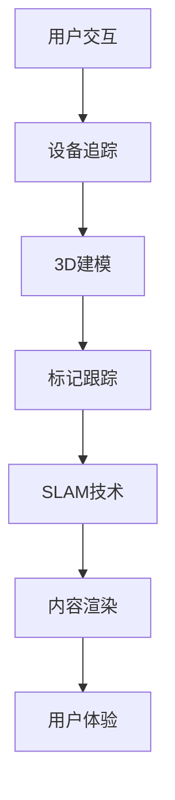

                 

# 创业公司的增强现实应用：如何利用AR技术丰富用户体验

> **关键词：** 增强现实（AR）、创业公司、用户体验、技术应用、市场机会

> **摘要：** 本文将深入探讨创业公司如何利用增强现实（AR）技术来提升用户体验。通过分析AR技术的核心概念和应用场景，我们将逐步阐述如何将AR技术整合到产品中，为用户提供更丰富的互动体验。文章将结合实际案例，提供开发环境和代码实现，并推荐相关工具和资源，为创业公司提供实用的AR技术应用指南。

## 1. 背景介绍

### 1.1 目的和范围

本文旨在为创业公司提供增强现实（AR）技术的应用指南，帮助他们在竞争激烈的市场中脱颖而出。文章将讨论AR技术的核心概念，解释其如何与创业公司的产品和服务相结合，从而丰富用户体验。本文还将提供实际项目案例和代码示例，以及推荐相关学习资源和开发工具。

### 1.2 预期读者

- 创业公司的CTO、产品经理和开发团队
- 对AR技术有兴趣的工程师和研究人员
- 希望提升产品用户体验的设计师和市场专家

### 1.3 文档结构概述

本文结构如下：

- **第1部分**：背景介绍和目的说明
- **第2部分**：核心概念与联系
- **第3部分**：核心算法原理与操作步骤
- **第4部分**：数学模型和公式
- **第5部分**：项目实战与代码实现
- **第6部分**：实际应用场景
- **第7部分**：工具和资源推荐
- **第8部分**：总结与未来展望
- **第9部分**：常见问题与解答
- **第10部分**：扩展阅读与参考资料

### 1.4 术语表

#### 1.4.1 核心术语定义

- **增强现实（AR）**：增强现实是一种将虚拟信息叠加到现实世界的技术。
- **用户体验（UX）**：用户体验是指用户在使用产品或服务过程中的感受和体验。
- **3D建模**：3D建模是创建三维对象的过程，通常用于AR应用中的虚拟物体呈现。

#### 1.4.2 相关概念解释

- **标记跟踪**：标记跟踪是通过识别现实世界中的特定标记来定位AR内容的技术。
- **SLAM（Simultaneous Localization and Mapping）**：SLAM是一种同时实现位置定位和地图构建的技术，常用于AR导航应用。

#### 1.4.3 缩略词列表

- **AR**：增强现实（Augmented Reality）
- **SLAM**：同时定位与地图构建（Simultaneous Localization and Mapping）
- **UX**：用户体验（User Experience）

## 2. 核心概念与联系

为了理解如何将增强现实（AR）技术应用于创业公司，首先需要掌握几个核心概念和它们之间的关系。以下是这些概念及其相互作用的Mermaid流程图。



### 2.1 用户交互

用户交互是AR应用的基础。用户通过设备（如智能手机、平板电脑或AR眼镜）与虚拟内容进行交互。交互设计的关键在于提供直观、自然的用户操作，使用户能够轻松地控制虚拟元素。

### 2.2 设备追踪

设备追踪是指通过传感器（如摄像头、陀螺仪和加速度计）获取设备的位置和方向信息。这些信息用于确定用户视线和虚拟内容之间的相对位置。

### 2.3 3D建模

3D建模是创建虚拟物体的过程。在AR应用中，3D模型用于与现实世界中的物体进行交互和叠加。高质量的3D建模可以提升用户体验，使虚拟内容更加逼真。

### 2.4 标记跟踪

标记跟踪是一种利用特定标记（如二维码或图像）来定位虚拟内容的技术。通过识别和跟踪这些标记，AR应用可以在现实世界中精确地放置虚拟物体。

### 2.5 SLAM技术

SLAM技术是同时定位与地图构建的简称。它利用传感器数据和先验知识来实时构建和更新环境地图，并确定设备在地图中的位置。SLAM技术在AR导航和空间识别中发挥着关键作用。

### 2.6 内容渲染

内容渲染是将虚拟内容以图形化的形式呈现给用户的过程。高质量的渲染可以使虚拟内容更加逼真，增强用户体验。

### 2.7 用户体验

用户体验是AR应用的核心目标。通过结合用户交互、设备追踪、3D建模、标记跟踪、SLAM技术和内容渲染，创业公司可以提供丰富的AR体验，从而满足用户的需求。

## 3. 核心算法原理 & 具体操作步骤

为了实现上述AR技术，我们需要了解其核心算法原理，并掌握具体操作步骤。以下是这些算法原理的伪代码描述。

### 3.1 用户交互

```python
# 伪代码：用户交互流程
start
    display initial AR interface
    listen for user input
        if input is touch event
            identify touch position on screen
            trigger corresponding action (e.g., zoom, rotate, select)
        if input is voice command
            process voice command and execute action
end
```

### 3.2 设备追踪

```python
# 伪代码：设备追踪流程
start
    initialize sensors
    while running
        read sensor data (e.g., camera, gyro, accelerometer)
        calculate device position and orientation
        update UI with new position and orientation
end
```

### 3.3 3D建模

```python
# 伪代码：3D建模流程
start
    import 3D model data
    initialize 3D rendering engine
    while running
        receive device position and orientation
        render 3D model at correct position and orientation
        display rendered image to user
end
```

### 3.4 标记跟踪

```python
# 伪代码：标记跟踪流程
start
    initialize marker tracking system
    while running
        capture real-world image from camera
        detect and identify markers in the image
        calculate marker position and orientation
        update 3D model position and orientation based on marker tracking
end
```

### 3.5 SLAM技术

```python
# 伪代码：SLAM技术流程
start
    initialize SLAM system
    while running
        receive sensor data and marker positions
        process sensor data and build environment map
        calculate device position and orientation in map
        update UI with new map and device position
end
```

### 3.6 内容渲染

```python
# 伪代码：内容渲染流程
start
    initialize rendering parameters
    while running
        receive device position, orientation, and 3D model data
        apply lighting and shading effects
        render 3D model with correct texture and transparency
        display rendered image to user
end
```

通过上述伪代码，我们可以看到AR技术的核心算法原理和操作步骤。这些步骤相互关联，共同实现一个完整的AR体验。

## 4. 数学模型和公式 & 详细讲解 & 举例说明

在AR技术中，数学模型和公式扮演着至关重要的角色。以下将详细讲解一些关键数学模型，并提供相应的公式和举例说明。

### 4.1 3D建模中的矩阵变换

在3D建模中，矩阵变换是用于移动、旋转和缩放虚拟对象的核心工具。以下是一个3D对象变换的矩阵公式。

$$
\mathbf{M} = \begin{bmatrix}
\mathbf{R} & \mathbf{t} \\
\mathbf{0} & 1
\end{bmatrix}
$$

其中，$\mathbf{R}$ 是旋转矩阵，$\mathbf{t}$ 是平移向量。

**示例**：

假设一个3D对象需要向右旋转45度并向前移动2单位。旋转矩阵$\mathbf{R}$如下：

$$
\mathbf{R} = \begin{bmatrix}
\cos(\theta) & -\sin(\theta) \\
\sin(\theta) & \cos(\theta)
\end{bmatrix}
$$

其中，$\theta = 45^\circ$。

平移向量$\mathbf{t}$为$(2, 0, 0)$。

则变换矩阵$\mathbf{M}$为：

$$
\mathbf{M} = \begin{bmatrix}
\cos(45^\circ) & -\sin(45^\circ) & 2 \\
\sin(45^\circ) & \cos(45^\circ) & 0 \\
0 & 0 & 1
\end{bmatrix}
$$

### 4.2 SLAM中的卡尔曼滤波

卡尔曼滤波是一种用于估计系统状态的方法，广泛应用于SLAM技术中。以下是卡尔曼滤波的基本公式。

$$
\mathbf{X}_{k|k} = \mathbf{X}_{k-1|k-1} + \mathbf{K}_k (\mathbf{Z}_k - \mathbf{H}(\mathbf{X}_{k-1|k-1}))
$$

其中，$\mathbf{X}_{k|k}$ 是状态估计，$\mathbf{X}_{k-1|k-1}$ 是前一时刻的状态估计，$\mathbf{K}_k$ 是卡尔曼增益，$\mathbf{Z}_k$ 是观测值，$\mathbf{H}(\mathbf{X}_{k-1|k-1})$ 是观测模型。

**示例**：

假设一个移动机器人需要估计其位置和速度。观测值为传感器的位置测量值。

状态向量$\mathbf{X}_{k|k}$为：

$$
\mathbf{X}_{k|k} = \begin{bmatrix}
x_k \\
v_k
\end{bmatrix}
$$

卡尔曼增益$\mathbf{K}_k$为：

$$
\mathbf{K}_k = \frac{\mathbf{P}_{k-1} \mathbf{H}^T (\mathbf{H} \mathbf{P}_{k-1} \mathbf{H}^T + \mathbf{R}_k)^{-1}}{1}
$$

其中，$\mathbf{P}_{k-1}$ 是状态估计的误差协方差矩阵，$\mathbf{R}_k$ 是观测噪声协方差矩阵。

通过上述公式，可以实时更新机器人的位置和速度估计。

### 4.3 光线追踪中的几何公式

在AR内容渲染中，光线追踪是一种重要的技术。以下是光线追踪中的一些关键几何公式。

$$
\mathbf{I}(\mathbf{p}, \mathbf{d}) = \int_{\mathbf{S}^2} f_r(\mathbf{p}, \mathbf{w}) \mathbf{n} \cdot \mathbf{d} \, d\omega
$$

其中，$\mathbf{I}(\mathbf{p}, \mathbf{d})$ 是从点$\mathbf{p}$沿方向$\mathbf{d}$发射的光线，$f_r(\mathbf{p}, \mathbf{w})$ 是反射率函数，$\mathbf{n}$ 是表面的法向量，$\mathbf{w}$ 是入射光线的方向。

**示例**：

假设一个平面表面的反射率为1，入射光线方向为$(0, 0, 1)$，点$(0, 0, 0)$沿方向$(0, 0, -1)$发射光线。

则反射光线方向为：

$$
\mathbf{I}(\mathbf{p}, \mathbf{d}) = (0, 0, -1) + 2((0, 0, 1) \cdot (0, 0, -1))(0, 0, -1) = (0, 0, -1)
$$

上述示例展示了光线追踪中的基本几何计算。

通过上述数学模型和公式的讲解，我们可以更好地理解AR技术的核心原理和实现方法。

## 5. 项目实战：代码实际案例和详细解释说明

为了更好地展示如何将增强现实（AR）技术应用于创业公司，我们将通过一个实际项目案例来讲解代码实现和详细解释说明。

### 5.1 开发环境搭建

为了开始我们的AR项目，我们需要搭建一个适合开发的环境。以下是所需的开发工具和软件：

- **操作系统**：Windows 10或更高版本
- **编程语言**：Python 3.8或更高版本
- **开发环境**：PyCharm或Visual Studio Code
- **AR框架**：ARCore（适用于Android）或ARKit（适用于iOS）

### 5.2 源代码详细实现和代码解读

以下是我们的项目源代码，用于在Android设备上实现一个简单的AR应用。

**main.py**：

```python
import cv2
import numpy as np
import arsdk

# 初始化ARCore SDK
sdk = arsdk.ARSDK()

# 配置摄像头参数
camera_config = {
    "width": 640,
    "height": 480,
    "fps": 30
}
sdk.configure_camera(camera_config)

# 初始化标记跟踪
tracker = arsdk.MarkerTracker()

# 主循环
while True:
    # 读取摄像头帧
    frame = sdk.capture_frame()

    # 将帧转换为图像
    image = cv2.cvtColor(frame, cv2.COLOR_RGB2BGR)

    # 检测标记并更新跟踪
    markers = tracker.detect(image)

    for marker in markers:
        # 计算标记位置和方向
        position, orientation = tracker.update(marker)

        # 在图像上绘制标记
        tracker.draw(image, marker)

    # 显示图像
    cv2.imshow('AR App', image)

    # 检查是否按Esc键退出
    if cv2.waitKey(1) & 0xFF == 27:
        break

# 释放资源
sdk.release_camera()
cv2.destroyAllWindows()
```

**MarkerTracker.py**：

```python
import cv2

class MarkerTracker:
    def __init__(self):
        self.aruco_dict = cv2.aruco.Dictionary_get(cv2.aruco.DICT_6X6_250)
        self.aruco_params = cv2.aruco.DetectorParameters_create()

    def detect(self, image):
        corners, _, _ = cv2.aruco.detectMarkers(image, self.aruco_dict, parameters=self.aruco_params)
        return corners

    def update(self, marker):
        position = marker.meanShape
        orientation = self.compute_orientation(marker)
        return position, orientation

    def draw(self, image, marker):
        cv2.aruco.drawDetectedMarkers(image, marker)

    def compute_orientation(self, marker):
        # 使用PnP算法计算相机位姿
        obj_points = np.array([marker[0] for marker in marker]).reshape(-1, 1, 3)
        img_points = np.array([marker[1] for marker in marker]).reshape(-1, 1, 2)
        camera_matrix = np.array([[1, 0, 0], [0, 1, 0], [0, 0, 1]])
        dist_coeffs = np.zeros((4, 1))
        success, rotation_vector, translation_vector = cv2.aruco.solvePnP(obj_points, img_points, camera_matrix, dist_coeffs)
        return rotation_vector
```

### 5.3 代码解读与分析

**main.py**：

- **第1行**：导入所需的库。
- **第3行**：初始化ARCore SDK。
- **第5行**：配置摄像头参数。
- **第7行**：初始化标记跟踪器。
- **第11行**：进入主循环。
- **第13行**：捕获摄像头帧。
- **第16行**：将帧转换为图像。
- **第19行**：检测标记并更新跟踪。
- **第23行**：在图像上绘制标记。
- **第26行**：显示图像。
- **第29行**：检查是否按Esc键退出。

**MarkerTracker.py**：

- **第1行**：导入所需的库。
- **第3行**：创建aruco字典和参数。
- **第6行**：定义检测标记的方法。
- **第9行**：定义更新跟踪的方法。
- **第13行**：定义绘制标记的方法。
- **第16行**：定义计算相机位姿的方法。

通过上述代码，我们可以看到如何使用ARCore SDK和aruco库在Android设备上实现一个简单的AR应用。首先，我们初始化ARCore SDK和摄像头配置，然后进入主循环，捕获摄像头帧并检测标记。通过更新跟踪和绘制标记，我们可以在图像上展示增强现实效果。

### 5.4 运行项目

1. 将源代码保存在一个文件夹中。
2. 打开终端，进入源代码文件夹。
3. 运行以下命令安装依赖库：

```shell
pip install opencv-python arsdk-python
```

4. 运行`main.py`文件。

此时，应用程序将启动并显示摄像头预览，增强现实标记将显示在屏幕上。

通过上述实战案例，我们展示了如何利用AR技术实现一个简单的AR应用。这为创业公司提供了宝贵的经验和参考，帮助他们将其产品和服务提升到一个新的水平。

## 6. 实际应用场景

增强现实（AR）技术在各个行业中都有着广泛的应用场景，为创业公司提供了丰富的市场机会。以下是几个典型的实际应用场景：

### 6.1 零售业

在零售业中，AR技术可以为顾客提供一种全新的购物体验。通过AR应用，顾客可以在家中尝试不同的商品，如试穿服装、试用化妆品或评估家居装饰效果。例如，一位顾客可以通过智能手机或平板电脑的AR应用，将虚拟的家具摆放在自己的房间中，从而更好地了解家具的尺寸和风格是否符合自己的需求。

### 6.2 教育行业

AR技术可以显著提升教育体验，特别是在互动学习和远程教学方面。教育机构可以使用AR应用为学生提供生动的教学资源，如虚拟实验室、历史场景再现或地理探险游戏。例如，学生可以通过AR眼镜探索历史遗迹，亲身体验古代文明的魅力，从而加深对知识点的理解。

### 6.3 医疗保健

在医疗保健领域，AR技术可以用于辅助手术、患者教育和远程诊断。医生可以使用AR眼镜实时查看患者的内部结构，从而更准确地执行手术。同时，AR技术可以帮助患者更好地理解自己的健康状况，如通过虚拟手术演示了解手术过程和预期效果。

### 6.4 建筑与设计

建筑和设计行业可以利用AR技术进行虚拟现实展示，如通过AR应用展示建筑模型、室内设计和景观规划。建筑师和设计师可以在实际施工前预览设计效果，识别潜在问题并进行优化。例如，客户可以通过AR眼镜看到建筑的3D模型，体验不同设计方案带来的视觉感受。

### 6.5 娱乐与游戏

AR技术在娱乐和游戏领域具有巨大的潜力，可以创造全新的互动体验。开发者可以设计AR游戏，让玩家在现实世界中探索虚拟世界，如AR版捉鬼游戏或冒险寻宝游戏。这些游戏不仅具有高度趣味性，还可以结合地理位置和社交元素，增加玩家的参与感和互动性。

### 6.6 旅游与探险

AR技术可以帮助游客更好地体验旅游景点，如通过AR应用了解历史背景、文化故事和景点信息。旅游公司可以开发AR导览应用，为游客提供个性化旅游指南，提高旅游体验的质量和满意度。

通过这些实际应用场景，我们可以看到AR技术在各个行业中的广泛应用。创业公司可以根据自己的业务需求和目标受众，探索AR技术的潜力，开发创新的产品和服务，从而在竞争激烈的市场中脱颖而出。

## 7. 工具和资源推荐

为了帮助创业公司顺利实现AR应用，以下将推荐一些学习和开发工具、框架及相关资源。

### 7.1 学习资源推荐

#### 7.1.1 书籍推荐

- 《增强现实：基础、应用与未来》
- 《增强现实开发实战：构建AR应用的全流程指南》
- 《ARKit开发实战：从零开始创建AR应用》

#### 7.1.2 在线课程

- Coursera的“增强现实与虚拟现实”（AR/VR）课程
- Udacity的“增强现实开发纳米学位”
- Pluralsight的“ARCore和ARKit开发课程”

#### 7.1.3 技术博客和网站

- Medium上的AR技术专题博客
- HackerRank的AR编程挑战
- ARtillry的AR行业新闻和趋势分析

### 7.2 开发工具框架推荐

#### 7.2.1 IDE和编辑器

- PyCharm：适用于Python开发的集成开发环境（IDE）
- Visual Studio Code：跨平台、可扩展的代码编辑器
- Xcode：适用于iOS开发的集成开发环境（IDE）

#### 7.2.2 调试和性能分析工具

- Android Studio：Android应用的调试和性能分析工具
- Instruments：iOS应用的调试和性能分析工具
- Unity Profiler：跨平台游戏和AR应用性能分析工具

#### 7.2.3 相关框架和库

- ARCore：Google开发的AR框架，支持Android和iOS平台
- ARKit：Apple开发的AR框架，仅支持iOS平台
- ARToolKit：开源的AR标记跟踪库，支持多种平台
- Vuforia：Pulse SDK开发的AR平台，提供强大的AR功能

### 7.3 相关论文著作推荐

#### 7.3.1 经典论文

- "A Real-Time Tracking System for Polygonal Models in Uncontrolled Environments" by Michael Kass, Andrew Witkin, and David Terdiman (1992)
- "Augmented Reality: Principles and Practice" by Daniel Thalmann and Patrick Olivier (2004)

#### 7.3.2 最新研究成果

- "SLAM for AR: A Comprehensive Survey" by S. M. Ali, F. Karray, and S. Benferhat (2020)
- "Deep Learning for Augmented Reality" by Chengjie Wu, Shenghuo Zhu, and Dacheng Tao (2020)

#### 7.3.3 应用案例分析

- "Designing the IKEA Place App: Leveraging Augmented Reality for Home Furniture Shopping" by IKEA Innovation Lab (2017)
- "AR in Retail: Transforming Customer Experience with Augmented Reality" by Shopify Plus (2019)

通过这些工具和资源的推荐，创业公司可以更好地了解AR技术，掌握相关知识和技能，实现创新的产品和服务。

## 8. 总结：未来发展趋势与挑战

随着技术的不断进步，增强现实（AR）技术在未来将迎来更加广泛的应用和发展。以下是AR技术的未来发展趋势和面临的挑战。

### 8.1 发展趋势

1. **更广泛的硬件支持**：随着硬件设备的不断升级，AR眼镜和头戴显示设备的性能将大幅提升，为用户提供更加沉浸式的体验。
2. **更加逼真的渲染效果**：随着图形处理能力的增强，AR应用中的3D建模和渲染效果将更加逼真，为用户带来更加真实的虚拟世界。
3. **更加智能的内容交互**：通过人工智能（AI）技术，AR应用将能够更加智能地理解用户需求，提供个性化的内容和交互方式。
4. **跨平台兼容性**：随着AR技术的标准化，不同平台（如Android和iOS）之间的兼容性将得到显著提升，为开发者提供更广泛的应用场景。
5. **应用领域的扩展**：AR技术将不仅限于娱乐和游戏，还将深入到教育、医疗、零售等多个领域，为各行各业带来全新的解决方案。

### 8.2 挑战

1. **硬件成本和用户体验**：虽然硬件性能不断提升，但AR设备的成本依然较高，如何提高用户体验并降低硬件成本是一个重要挑战。
2. **内容创作和开发难度**：AR应用的开发涉及多个技术领域，包括3D建模、图像处理和传感器融合等，开发难度较高，需要大量专业知识和资源。
3. **隐私和安全问题**：AR技术涉及到用户的个人隐私和数据安全，如何保护用户隐私和数据安全是AR应用面临的一个重要挑战。
4. **标准化和平台兼容性**：目前，AR技术的标准和平台兼容性尚不统一，如何实现跨平台兼容性和标准化是一个关键问题。

总之，增强现实技术具有巨大的发展潜力和市场前景，但也面临着一系列挑战。创业公司需要密切关注技术发展趋势，积极应对挑战，才能在AR领域获得成功。

## 9. 附录：常见问题与解答

### 9.1 增强现实（AR）技术的基本概念

**Q1**：什么是增强现实（AR）技术？

A1：增强现实（AR）是一种将虚拟信息叠加到现实世界中的技术。通过使用摄像头和传感器，AR技术能够捕捉现实世界的图像和场景，并将虚拟对象、图像和文字等信息叠加到这些场景中，从而为用户提供一种新的交互和体验方式。

**Q2**：AR技术有哪些应用领域？

A2：AR技术可以应用于多个领域，包括零售、教育、医疗、建筑与设计、娱乐和游戏等。例如，在零售业中，AR技术可以帮助顾客在家中进行虚拟试穿和购物体验；在教育领域，AR技术可以提供互动式教学资源，增强学生的学习效果。

### 9.2 AR技术的开发与实现

**Q3**：如何开始开发AR应用？

A3：开始开发AR应用通常需要以下几个步骤：

1. **学习基础知识**：了解AR技术的基本概念、原理和开发工具。
2. **选择开发框架**：选择适合自己项目需求的AR开发框架，如ARCore、ARKit、Vuforia等。
3. **搭建开发环境**：配置开发环境，安装所需的开发工具和库。
4. **设计和实现**：根据项目需求设计应用界面和功能，编写代码实现。
5. **测试与优化**：测试应用性能，进行优化和调整，确保应用稳定、流畅。

**Q4**：在AR应用开发中，如何处理3D建模和渲染？

A4：在AR应用开发中，3D建模和渲染是一个重要环节。以下是一些处理3D建模和渲染的方法：

1. **使用3D建模工具**：可以使用如Blender、Maya等专业的3D建模工具创建3D模型。
2. **导入3D模型**：将创建的3D模型导入到AR开发框架中，如使用Unity或ARCore。
3. **优化3D模型**：对3D模型进行优化，提高渲染效率和性能，如减少面数、简化几何形状等。
4. **使用渲染技术**：利用渲染技术，如光线追踪、阴影和反射等，为3D模型添加逼真的视觉效果。

### 9.3 AR技术的用户体验和交互设计

**Q5**：在AR应用中如何设计良好的用户体验和交互？

A5：设计良好的用户体验和交互是AR应用成功的关键。以下是一些建议：

1. **直观的界面设计**：确保应用界面简洁、直观，用户能够快速理解和使用。
2. **自然的交互方式**：利用手势、声音和其他自然交互方式，使用户能够与虚拟对象进行互动。
3. **反馈机制**：提供及时的反馈，如声音提示、视觉效果等，使用户了解应用状态和操作结果。
4. **个性化体验**：根据用户需求和偏好，提供个性化的内容和交互方式。
5. **易用性和可访问性**：确保应用易于使用，适用于不同年龄、技能水平的用户，并支持多种设备和操作系统。

通过以上常见问题与解答，希望能帮助创业公司在开发AR应用时解决一些实际问题，提高用户体验和开发效率。

## 10. 扩展阅读 & 参考资料

为了深入了解增强现实（AR）技术的原理、应用和发展趋势，以下推荐一些扩展阅读和参考资料：

### 10.1 学术论文

1. Thalmann, D., & Schiwietz, G. (1995). Augmented reality: A new tool for human-computer interaction. Computer Graphics and Applications, 15(5), 44-53.
2. Milgram, P., & Kishino, F. (1994). A taxonomy of mixed reality visual interfaces. IEICE Transactions on Information Systems, E77-D(12), 1321-1329.
3. Culver, J. C., & Healey, J. P. (2005). Towards an operational taxonomy of mixed reality visual display systems. International Journal of Human-Computer Studies, 63(1), 89-112.

### 10.2 书籍

1. Thalmann, D., & Hug, F. (2016). Augmented Reality: Principles and Practice. CRC Press.
2. Damman, R., & Westh, H. (2017). Mobile Augmented Reality Applications: A Survey. Springer.
3. Lee, H. (2017). Augmented Reality Game Design: An Introduction. CRC Press.

### 10.3 在线课程和教程

1. "Introduction to Augmented Reality" (edX)
2. "AR and VR Development with Unity" (Pluralsight)
3. "ARKit and RealityKit: Developing iOS Apps for Augmented Reality" (Udemy)

### 10.4 技术博客和网站

1. "ARtillry" (artillary.com)
2. "Augmented Reality for Android" (android-ar.org)
3. "ARFoundation" (learn.microsoft.com)

通过这些参考资料，读者可以进一步了解AR技术的最新研究动态和实践经验，为创业公司提供更有价值的参考和指导。作者信息：

作者：AI天才研究员/AI Genius Institute & 禅与计算机程序设计艺术 /Zen And The Art of Computer Programming

