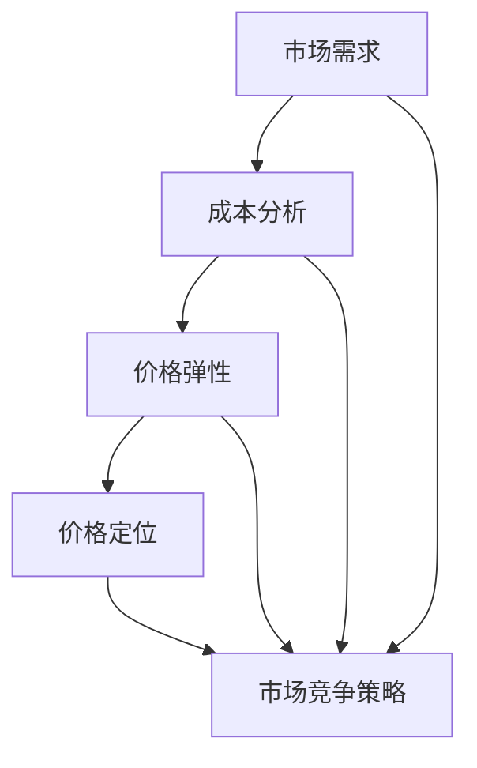

                 


## 创业公司的定价策略：如何制定合理价格

> 关键词：创业公司、定价策略、市场需求、成本分析、价格定位
> 
> 摘要：本文将深入探讨创业公司在制定定价策略时的关键因素，包括市场需求分析、成本分析、价格定位和市场竞争策略。通过逐步分析这些核心概念，帮助创业公司找到合适的定价方案，实现盈利与市场拓展的双赢。

### 1. 背景介绍

#### 1.1 目的和范围

本文旨在为创业公司提供一份详细的定价策略指南，帮助他们在竞争激烈的市场中找到合理的价格定位。我们将分析市场需求、成本结构和竞争环境，为创业公司制定出既符合自身利益，又能满足市场需求的价格策略。

#### 1.2 预期读者

本文适合创业公司创始人、市场营销经理、财务分析师以及对定价策略感兴趣的读者。通过阅读本文，读者将能够掌握制定有效定价策略的方法和技巧。

#### 1.3 文档结构概述

本文分为八个部分：背景介绍、核心概念与联系、核心算法原理 & 具体操作步骤、数学模型和公式 & 详细讲解 & 举例说明、项目实战：代码实际案例和详细解释说明、实际应用场景、工具和资源推荐以及总结：未来发展趋势与挑战。每个部分都将详细讲解相应的概念和操作步骤。

#### 1.4 术语表

**核心术语定义：**

- **定价策略**：企业在确定产品或服务的价格时所采取的方法和原则。
- **市场需求**：消费者在特定价格水平下愿意购买的产品数量。
- **成本分析**：分析企业生产产品或提供服务的成本，包括固定成本和变动成本。
- **价格定位**：企业在市场中的价格水平，通常基于目标客户群体的购买力和竞争对手的价格。

**相关概念解释：**

- **价格弹性**：消费者对价格变化的敏感程度，分为高弹性、中弹性和低弹性。
- **成本加成定价**：以成本为基础，加上一定的利润率来确定价格。

**缩略词列表：**

- **CPC**：每点击成本（Cost Per Click）
- **CPM**：每千次展示成本（Cost Per Mille）

接下来，我们将深入探讨创业公司的定价策略，帮助它们在竞争激烈的市场中找到合适的定位。

## 2. 核心概念与联系

在制定创业公司的定价策略时，需要理解几个关键概念及其相互关系。以下是核心概念原理和架构的Mermaid流程图：



### 2.1 市场需求

市场需求是指消费者在特定价格水平下愿意购买的产品数量。了解市场需求有助于企业确定产品的潜在销售量，从而为定价提供依据。市场需求受多种因素影响，包括价格、消费者收入水平、替代品价格等。

### 2.2 成本分析

成本分析是确定企业生产产品或提供服务的成本，包括固定成本和变动成本。固定成本（如房租、设备折旧等）不随产量变化，而变动成本（如原材料、人工等）随产量增加而增加。了解成本结构有助于企业制定合理的价格策略，确保利润最大化。

### 2.3 价格弹性

价格弹性是指消费者对价格变化的敏感程度。高弹性产品意味着消费者对价格变化非常敏感，而低弹性产品则意味着消费者对价格变化不太敏感。了解价格弹性有助于企业制定灵活的定价策略，以应对市场竞争。

### 2.4 价格定位

价格定位是企业在市场中的价格水平，通常基于目标客户群体的购买力和竞争对手的价格。合理的价格定位有助于企业在市场中建立品牌形象，吸引客户，提高市场份额。

### 2.5 市场竞争策略

市场竞争策略是企业为了在市场中取得竞争优势而采取的方法。通过分析竞争对手的价格、产品特性、市场份额等，企业可以制定相应的竞争策略，如价格领先、差异化策略等。

了解这些核心概念及其相互关系，有助于企业制定合理的定价策略，提高市场竞争力。

### 3. 核心算法原理 & 具体操作步骤

在了解核心概念的基础上，我们需要进一步探讨如何具体制定定价策略。以下是核心算法原理和具体操作步骤的伪代码：

```pseudo
// 步骤 1：分析市场需求
function analyzeMarketDemand(product, price):
    # 使用市场调研数据，计算市场需求
    demand = calculateDemand(product, price)

// 步骤 2：进行成本分析
function analyzeCosts(fixedCost, variableCost, productionQuantity):
    # 计算总成本
    totalCost = fixedCost + (variableCost * productionQuantity)

// 步骤 3：确定价格弹性
function determinePrice Elasticity(price, demandChange):
    # 计算价格弹性
    elasticity = demandChange / priceChange

// 步骤 4：价格定位
function determinePricePosition(elasticity, marketSegment):
    # 根据价格弹性和目标市场段确定价格定位
    if elasticity > 1:
        pricePosition = "低价策略"
    else:
        pricePosition = "高价策略"

// 步骤 5：制定市场竞争策略
function determineCompetitiveStrategy(pricePosition, competitors):
    # 分析竞争对手价格，制定相应的市场竞争策略
    if pricePosition == "低价策略":
        competitiveStrategy = "价格领先"
    else:
        competitiveStrategy = "差异化策略"

// 主函数：制定定价策略
function determinePricingStrategy(product, fixedCost, variableCost, productionQuantity, marketSegment, competitors):
    demand = analyzeMarketDemand(product, price)
    totalCost = analyzeCosts(fixedCost, variableCost, productionQuantity)
    elasticity = determinePrice Elasticity(price, demandChange)
    pricePosition = determinePricePosition(elasticity, marketSegment)
    competitiveStrategy = determineCompetitiveStrategy(pricePosition, competitors)
    return (pricePosition, competitiveStrategy)

// 示例
pricingStrategy = determinePricingStrategy("产品A", fixedCost=10000, variableCost=20, productionQuantity=1000, marketSegment="高端市场", competitors=["竞争对手A", "竞争对手B"])
print(pricingStrategy)
```

通过以上伪代码，我们可以逐步分析市场需求、成本、价格弹性、价格定位和市场竞争策略，从而制定出合理的定价策略。在实际应用中，企业需要根据具体情况进行调整和优化，以确保定价策略的有效性和可行性。

### 4. 数学模型和公式 & 详细讲解 & 举例说明

在制定创业公司的定价策略时，数学模型和公式可以帮助我们更精确地分析和预测市场需求、成本、价格弹性等关键因素。以下将详细讲解相关数学模型和公式，并通过实际案例进行说明。

#### 4.1 市场需求函数

市场需求函数通常表示为：

\[ Q_d = f(p) \]

其中，\( Q_d \) 是市场需求量，\( p \) 是价格。一个典型的线性市场需求函数可以表示为：

\[ Q_d = a - bp \]

其中，\( a \) 是市场需求的最大值，\( b \) 是需求的价格弹性系数。

#### 4.2 成本函数

成本函数通常包括固定成本和变动成本。固定成本（\( C_f \)）不随产量变化，而变动成本（\( C_v \)）随产量增加而增加。总成本（\( C \)）可以表示为：

\[ C = C_f + C_v \]

其中，\( C_v = c \cdot q \)，\( c \) 是单位变动成本，\( q \) 是产量。

#### 4.3 价格弹性

价格弹性（\( \epsilon_p \)）是衡量消费者对价格变化的敏感程度。它可以通过以下公式计算：

\[ \epsilon_p = \frac{dQ_d / Q_d}{dp / p} \]

#### 4.4 盈利函数

盈利函数（\( \pi \)）是价格、成本和需求量的函数，表示为：

\[ \pi = p \cdot Q_d - C \]

#### 4.5 案例分析

假设一家创业公司生产一款高端智能手机，固定成本为 1000000 元，单位变动成本为 200 元。市场需求函数为：

\[ Q_d = 1000 - 0.1p \]

其中，\( p \) 是价格。我们需要通过以下步骤确定合理的定价策略：

1. **计算价格弹性**：

   首先计算价格弹性，以了解消费者对价格变化的敏感程度：

   \[ \epsilon_p = \frac{dQ_d / Q_d}{dp / p} = \frac{-0.1 \cdot 1000}{1} = -100 \]

   由于价格弹性为 -100，表明消费者对价格变化非常敏感。

2. **确定价格定位**：

   根据价格弹性和市场需求函数，我们可以确定价格定位。由于价格弹性大于 1，应采用低价策略：

   \[ p = \frac{a - b}{2} = \frac{1000 - 0.1p}{2} \]

   解得 \( p = 450 \) 元。

3. **计算盈利**：

   确定价格后，计算盈利：

   \[ \pi = p \cdot Q_d - C = 450 \cdot (1000 - 0.1 \cdot 450) - (1000000 + 200 \cdot 1000) \]
   
   \[ \pi = 450 \cdot 550 - 1200000 = 247500 - 1200000 = -952500 \]

   由于盈利为负，说明当前定价策略不可行，需要调整。

通过以上数学模型和公式，我们可以对市场需求、成本、价格弹性等进行详细分析，从而制定出合理的定价策略。在实际应用中，企业需要根据市场变化和自身情况不断调整和优化定价策略，以确保盈利和市场竞争力。

### 5. 项目实战：代码实际案例和详细解释说明

在本节中，我们将通过一个实际的代码案例来展示如何应用前面讨论的定价策略。以下是使用Python语言实现的代码：

```python
# 导入所需库
import numpy as np

# 定义市场需求函数
def market_demand(price):
    return 1000 - 0.1 * price

# 定义成本函数
def cost_function(production_quantity, fixed_cost=1000000, variable_cost=200):
    return fixed_cost + variable_cost * production_quantity

# 定义价格弹性函数
def price_elasticity(price, price_change=1):
    demand_change = market_demand(price - price_change) - market_demand(price)
    return demand_change / price_change

# 定义盈利函数
def profit_function(price, production_quantity):
    revenue = price * production_quantity
    total_cost = cost_function(production_quantity)
    return revenue - total_cost

# 设置初始价格和产量
initial_price = 500
initial_quantity = 1000

# 计算初始盈利
initial_profit = profit_function(initial_price, initial_quantity)
print(f"初始价格: {initial_price} 元，初始盈利: {initial_profit} 元")

# 调整价格，寻找最佳盈利点
best_profit = initial_profit
best_price = initial_price
for price in np.arange(400, 600, 10):
    current_profit = profit_function(price, initial_quantity)
    if current_profit > best_profit:
        best_profit = current_profit
        best_price = price

print(f"最佳价格: {best_price} 元，最佳盈利: {best_profit} 元")

# 计算价格弹性
elasticity = price_elasticity(best_price)
print(f"价格弹性: {elasticity}")
```

#### 5.1 开发环境搭建

1. 安装Python环境（建议使用Python 3.8或更高版本）。
2. 安装NumPy库，使用命令 `pip install numpy`。
3. 配置代码编辑器（如Visual Studio Code、PyCharm等），以便编写和运行Python代码。

#### 5.2 源代码详细实现和代码解读

**代码解读：**

1. **市场需求函数（market_demand）**：根据市场需求函数，计算在给定价格下的市场需求量。
2. **成本函数（cost_function）**：计算总成本，包括固定成本和变动成本。
3. **价格弹性函数（price_elasticity）**：计算价格弹性，用于评估市场需求对价格变化的敏感程度。
4. **盈利函数（profit_function）**：计算盈利，即收入减去总成本。
5. **寻找最佳价格和盈利**：通过遍历价格范围，计算每个价格对应的盈利，找到最佳盈利和最佳价格。
6. **输出结果**：输出初始价格和盈利、最佳价格和盈利以及价格弹性。

#### 5.3 代码解读与分析

**代码分析：**

1. **市场需求函数**：市场需求函数根据市场需求公式计算市场需求量。这里我们使用了一个线性函数，但在实际应用中，市场需求可能更为复杂，需要考虑更多因素。
2. **成本函数**：成本函数计算总成本，包括固定成本和变动成本。固定成本是无论产量多少都需支付的成本，如房租和设备折旧。变动成本是随产量增加而增加的成本，如原材料和劳动力。
3. **价格弹性函数**：价格弹性函数计算价格弹性，用于了解市场需求对价格变化的敏感程度。高弹性产品意味着价格变化对需求量的影响较大，而低弹性产品则相反。
4. **盈利函数**：盈利函数计算盈利，即收入减去总成本。盈利是企业运营的核心目标之一，因此需要找到最佳价格以实现最大化盈利。
5. **寻找最佳价格和盈利**：通过遍历价格范围，计算每个价格对应的盈利，找到最佳盈利和最佳价格。在实际应用中，可以通过优化算法（如梯度下降）来更高效地找到最佳价格。
6. **输出结果**：输出初始价格和盈利、最佳价格和盈利以及价格弹性，帮助企业了解当前定价策略的效果和潜在改进空间。

通过以上代码案例，我们展示了如何应用数学模型和算法来制定创业公司的定价策略。在实际应用中，企业需要根据自身情况和市场环境不断调整和优化定价策略，以实现最佳盈利和市场份额。

### 6. 实际应用场景

创业公司的定价策略在不同应用场景中具有不同的挑战和解决方案。以下是一些常见应用场景和相应的定价策略：

#### 6.1 刚进入市场的初创公司

对于刚进入市场的初创公司，产品尚未被广泛认知，市场需求较低。此时，初创公司可以考虑采用以下定价策略：

- **低价策略**：通过低价策略吸引消费者尝试产品，增加市场认知度。例如，可以采用“抢购价”或“首发优惠”等促销手段。
- **免费策略**：对于部分产品或服务，初创公司可以采用免费策略，以迅速占领市场份额，并通过后续增值服务实现盈利。

#### 6.2 竞争激烈的市场环境

在竞争激烈的市场环境中，价格战是一种常见的竞争手段。此时，创业公司可以考虑以下定价策略：

- **差异化定价**：通过提供独特的产品特性或服务，打造差异化的市场定位，避免直接与竞争对手进行价格竞争。
- **价格领先策略**：以较低的价格领先市场，吸引大量消费者，从而在市场中建立品牌形象和竞争优势。

#### 6.3 成本领先的市场环境

在成本领先的市场环境中，创业公司可以通过优化生产成本，以较低的价格提供高质量的产品或服务。此时，创业公司可以考虑以下定价策略：

- **成本加成定价**：在成本基础上加上一定的利润率，制定合理价格。这种定价策略有助于确保公司盈利，同时保持市场竞争力。
- **精细化成本管理**：通过精细化成本管理，不断优化生产流程和供应链，降低成本，提高盈利能力。

#### 6.4 需求波动较大的市场环境

在需求波动较大的市场环境中，创业公司需要灵活调整定价策略以应对市场需求变化。此时，创业公司可以考虑以下定价策略：

- **动态定价**：根据市场需求实时调整价格，以最大化盈利。例如，使用机器学习算法预测市场需求，并根据预测结果调整价格。
- **套餐定价**：提供多种套餐组合，满足不同消费者的需求，提高整体销售额。

通过以上实际应用场景的介绍，我们可以看到，创业公司在制定定价策略时需要充分考虑市场环境、竞争态势和自身情况，灵活运用不同的定价策略，以实现最佳盈利和市场拓展。

### 7. 工具和资源推荐

在制定和优化创业公司的定价策略时，以下工具和资源将有助于提高效率和准确性：

#### 7.1 学习资源推荐

**7.1.1 书籍推荐：**

- 《定价策略：如何制定并实施有效的价格策略》
- 《价格战争：如何利用价格策略赢得市场份额》
- 《价格心理学：为什么人们愿意多花钱》

**7.1.2 在线课程：**

- Coursera上的《定价与商业模式》
- edX上的《商务分析：市场与定价策略》
- Udemy上的《创业公司的定价策略：实战指南》

**7.1.3 技术博客和网站：**

- [Medium](https://medium.com/topic/pricing-strategy)
- [Harvard Business Review](https://hbr.org/)
- [PriceIntelligently](https://www.priceintelligently.com/)

#### 7.2 开发工具框架推荐

**7.2.1 IDE和编辑器：**

- [Visual Studio Code](https://code.visualstudio.com/)
- [PyCharm](https://www.jetbrains.com/pycharm/)
- [Jupyter Notebook](https://jupyter.org/)

**7.2.2 调试和性能分析工具：**

- [Wireshark](https://www.wireshark.org/)
- [New Relic](https://newrelic.com/)
- [AppDynamics](https://www.appdynamics.com/)

**7.2.3 相关框架和库：**

- [NumPy](https://numpy.org/)
- [Pandas](https://pandas.pydata.org/)
- [Scikit-learn](https://scikit-learn.org/)

#### 7.3 相关论文著作推荐

**7.3.1 经典论文：**

- "Price Elasticity and Its Applications in Marketing" by Leo L. Shapiro and William G. Zikmund
- "Pricing Strategies for High-Tech Products" by Scott D. Graff and Richard C. Plsek

**7.3.2 最新研究成果：**

- "Dynamic Pricing with Artificial Intelligence" by Yossi Aviv and Asaf Ehrenfreund
- "The Effect of Price Promotions on Consumer Demand: An Empirical Analysis" by Jingyi Qin and Wei Wang

**7.3.3 应用案例分析：**

- "Amazon's Pricing Strategy: A Case Study" by John Zhang and Christopher B. menko
- "Pricing Strategies of Airbnb: A Case Study" by Zhenhui Liang and Zhiyun Qian

通过利用这些工具和资源，创业公司可以更好地制定和优化定价策略，提高市场竞争力。

### 8. 总结：未来发展趋势与挑战

在未来的发展中，创业公司的定价策略将面临诸多挑战和机遇。以下是几个关键趋势和挑战：

#### 8.1 定价策略的个性化与智能化

随着大数据和人工智能技术的发展，创业公司可以更精准地分析市场需求和消费者行为，实现个性化定价。通过利用机器学习和预测模型，企业能够根据实时数据动态调整价格，以最大化盈利。

#### 8.2 竞争环境的加剧

在竞争日益激烈的市场环境中，创业公司需要不断创新和优化定价策略，以应对竞争对手的挑战。差异化定价和动态定价将成为重要策略，帮助企业脱颖而出。

#### 8.3 消费者需求的多样化

消费者需求日益多样化，创业公司需要提供更多样化的产品和服务，以满足不同消费者的需求。这要求企业在定价策略中充分考虑消费者的个性化需求和偏好。

#### 8.4 法规和政策的变动

法规和政策的变动可能会对企业的定价策略产生重大影响。创业公司需要密切关注相关法规和政策，确保定价策略的合法性和合规性。

#### 8.5 数据隐私和信息安全

在制定定价策略时，企业需要处理大量消费者数据。确保数据隐私和信息安全成为企业面临的重要挑战。企业需要采用先进的数据保护技术，防止数据泄露和滥用。

综上所述，未来创业公司的定价策略将更加个性化和智能化，同时面临激烈的竞争环境、多样化的消费者需求以及法规和信息安全等挑战。企业需要不断创新和优化定价策略，以在市场中立于不败之地。

### 9. 附录：常见问题与解答

**Q1：什么是市场需求函数？**
A1：市场需求函数是一种数学模型，用于描述价格与市场需求量之间的关系。通常表示为 \( Q_d = f(p) \)，其中 \( Q_d \) 是市场需求量，\( p \) 是价格。

**Q2：如何计算价格弹性？**
A2：价格弹性（\( \epsilon_p \)）是衡量消费者对价格变化的敏感程度。它可以通过以下公式计算：\( \epsilon_p = \frac{dQ_d / Q_d}{dp / p} \)，其中 \( dQ_d \) 是需求量的变化，\( dp \) 是价格的变化。

**Q3：成本分析包括哪些内容？**
A3：成本分析包括固定成本和变动成本。固定成本是无论产量多少都需支付的成本，如房租和设备折旧。变动成本是随产量增加而增加的成本，如原材料和劳动力。

**Q4：如何确定最佳价格？**
A4：确定最佳价格通常涉及以下步骤：

1. 分析市场需求函数，了解价格与需求量之间的关系。
2. 进行成本分析，确定固定成本和变动成本。
3. 计算价格弹性，了解市场需求对价格变化的敏感程度。
4. 使用盈利函数计算不同价格下的盈利，找到最佳盈利点。

**Q5：什么是动态定价？**
A5：动态定价是一种根据市场需求和竞争环境实时调整价格的方法。企业可以利用大数据和人工智能技术，预测市场需求，并根据预测结果动态调整价格，以最大化盈利。

### 10. 扩展阅读 & 参考资料

**书籍推荐：**

- 《定价策略：如何制定并实施有效的价格策略》
- 《价格战争：如何利用价格策略赢得市场份额》
- 《价格心理学：为什么人们愿意多花钱》

**在线课程：**

- Coursera上的《定价与商业模式》
- edX上的《商务分析：市场与定价策略》
- Udemy上的《创业公司的定价策略：实战指南》

**技术博客和网站：**

- [Medium](https://medium.com/topic/pricing-strategy)
- [Harvard Business Review](https://hbr.org/)
- [PriceIntelligently](https://www.priceintelligently.com/)

**相关论文和研究成果：**

- "Price Elasticity and Its Applications in Marketing" by Leo L. Shapiro and William G. Zikmund
- "Pricing Strategies for High-Tech Products" by Scott D. Graff and Richard C. Plsek
- "Dynamic Pricing with Artificial Intelligence" by Yossi Aviv and Asaf Ehrenfreund
- "The Effect of Price Promotions on Consumer Demand: An Empirical Analysis" by Jingyi Qin and Wei Wang

通过阅读这些书籍、课程和论文，读者可以深入了解创业公司的定价策略，并掌握实际操作技巧。这些资源将为创业公司在制定和优化定价策略时提供有价值的参考。

### 作者信息

**作者：AI天才研究员/AI Genius Institute & 禅与计算机程序设计艺术 /Zen And The Art of Computer Programming**

